# AI Agent System

<cite>
**Referenced Files in This Document**
- [AGENTS.md](file://agents/AGENTS.md)
- [assembly.py](file://agents/assembly.py)
- [generation.py](file://agents/generation.py)
- [validation.py](file://agents/validation.py)
- [worker.py](file://agents/worker.py)
- [experience_contract.py](file://agents/experience_contract.py)
- [Dockerfile](file://agents/Dockerfile)
- [pyproject.toml](file://agents/pyproject.toml)
- [workflow-contract.json](file://shared/workflow-contract.json)
- [workflow_contract.py](file://backend/app/core/workflow_contract.py)
- [workflow.py](file://backend/app/services/workflow.py)
- [internal_worker.py](file://backend/app/api/internal_worker.py)
- [main.py](file://backend/app/main.py)
- [test_worker.py](file://agents/tests/test_worker.py)
- [backend/AGENTS.md](file://backend/AGENTS.md)
- [2026-04-10-deterministic-regeneration-timeouts-and-cap.md](file://docs/task-output/2026-04-10-deterministic-regeneration-timeouts-and-cap.md)
- [2026-04-09-high-aggressiveness-role-title-rewrites.md](file://docs/task-output/2026-04-09-high-aggressiveness-role-title-rewrites.md)
- [2026-04-07-generation-hang-and-cancel-fixes.md](file://docs/task-output/2026-04-07-generation-hang-and-cancel-fixes.md)
- [2026-04-10-deterministic-regeneration-timeouts-and-cap.sql](file://supabase/migrations/20260410_000011_phase_5_full_regeneration_cap.sql)
- [application_manager.py](file://backend/app/services/application_manager.py)
</cite>

## Update Summary
**Changes Made**
- Enhanced documentation of comprehensive generation workflow system with run_generation_job() and run_regeneration_job() functions
- Added documentation of enhanced callback mechanisms with best-effort delivery for generation workflows
- Documented Redis caching for generation results with progress reconciliation capabilities
- Updated generation and regeneration job flows with deterministic validation and structure checks
- Enhanced error handling and timeout management for generation workflows

## Table of Contents
1. [Introduction](#introduction)
2. [Project Structure](#project-structure)
3. [Core Components](#core-components)
4. [Architecture Overview](#architecture-overview)
5. [Detailed Component Analysis](#detailed-component-analysis)
6. [Dependency Analysis](#dependency-analysis)
7. [Performance Considerations](#performance-considerations)
8. [Troubleshooting Guide](#troubleshooting-guide)
9. [Conclusion](#conclusion)
10. [Appendices](#appendices)

## Introduction
This document describes the AI agent system built on ARQ for the AI Resume Builder. It covers the agent design patterns for task queue management, progress tracking, error handling, and asynchronous processing. It explains the three main agent types:
- Extraction agents for web scraping and job board parsing
- Generation agents for AI-powered resume creation using section-based generation and prompt engineering
- Validation agents for content validation and ATS optimization

It also documents agent coordination via Redis queues, progress callbacks, LangChain integration, OpenRouter API configuration and model selection, workflow contract integration with the backend state machine, error recovery and retry strategies, and practical examples for configuration, scheduling, and monitoring.

## Project Structure
The AI agent system is implemented in the agents/ package and orchestrated by ARQ workers. The backend exposes internal worker callbacks that receive progress and completion events from agents. Shared workflow-contract.json defines the state machine and mapping rules used by the backend to derive visible statuses.

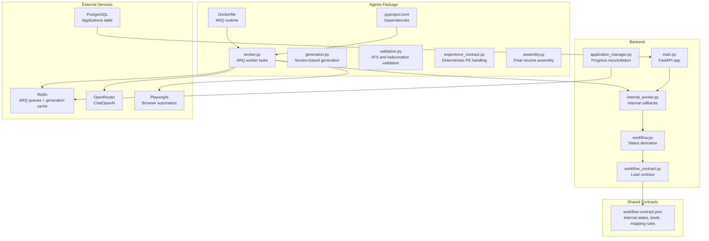

**Diagram sources**
- [worker.py:1-1620](file://agents/worker.py#L1-L1620)
- [generation.py:1-1110](file://agents/generation.py#L1-L1110)
- [validation.py:1-602](file://agents/validation.py#L1-L602)
- [experience_contract.py:1-254](file://agents/experience_contract.py#L1-L254)
- [assembly.py:1-86](file://agents/assembly.py#L1-L86)
- [pyproject.toml:1-26](file://agents/pyproject.toml#L1-L26)
- [Dockerfile:1-14](file://agents/Dockerfile#L1-L14)
- [workflow-contract.json:1-114](file://shared/workflow-contract.json#L1-L114)
- [workflow_contract.py:1-40](file://backend/app/core/workflow_contract.py#L1-L40)
- [workflow.py:1-32](file://backend/app/services/workflow.py#L1-L32)
- [internal_worker.py:1-71](file://backend/app/api/internal_worker.py#L1-L71)
- [main.py:1-36](file://backend/app/main.py#L1-L36)
- [application_manager.py:992-1191](file://backend/app/services/application_manager.py#L992-L1191)

**Section sources**
- [worker.py:1-1620](file://agents/worker.py#L1-L1620)
- [pyproject.toml:1-26](file://agents/pyproject.toml#L1-L26)
- [Dockerfile:1-14](file://agents/Dockerfile#L1-L14)
- [workflow-contract.json:1-114](file://shared/workflow-contract.json#L1-L114)
- [workflow_contract.py:1-40](file://backend/app/core/workflow_contract.py#L1-L40)
- [workflow.py:1-32](file://backend/app/services/workflow.py#L1-L32)
- [internal_worker.py:1-71](file://backend/app/api/internal_worker.py#L1-L71)
- [main.py:1-36](file://backend/app/main.py#L1-L36)

## Core Components
- ARQ worker tasks: define the extraction, generation, and regeneration jobs and publish progress and results to Redis and backend callbacks.
- Extraction agent: uses Playwright to scrape job postings and LangChain with OpenRouter to extract structured fields.
- Generation agent: performs section-based generation with structured output, fallback models, and progress callbacks.
- Validation agent: validates ATS safety, hallucinations, required sections, and ordering; supports auto-corrections.
- Experience contract service: provides deterministic Professional Experience structure handling with anchor extraction and validation.
- Assembly service: combines personal info header with ordered generated sections into a single Markdown resume.
- Progress tracking: Redis-backed JobProgress records and periodic callbacks to backend.
- Workflow contract: shared contract defining internal states, workflow kinds, failure reasons, and status mapping rules.
- Redis generation caching: persistent cache for generation results with reconciliation capabilities.

**Section sources**
- [worker.py:52-53](file://agents/worker.py#L52-L53)
- [worker.py:58-75](file://agents/worker.py#L58-L75)
- [generation.py:56-57](file://agents/generation.py#L56-L57)
- [generation.py:58-59](file://agents/generation.py#L58-L59)
- [validation.py:1-16](file://agents/validation.py#L1-L16)
- [experience_contract.py:1-254](file://agents/experience_contract.py#L1-L254)
- [assembly.py:12-86](file://agents/assembly.py#L12-L86)
- [workflow-contract.json:1-114](file://shared/workflow-contract.json#L1-L114)

## Architecture Overview
The system integrates ARQ workers with Redis queues, LangChain ChatOpenAI via OpenRouter, Playwright for browser automation, and backend callbacks for progress and completion. The backend derives visible statuses from internal states using the shared workflow contract. Generation workflows include Redis caching for results with reconciliation capabilities.

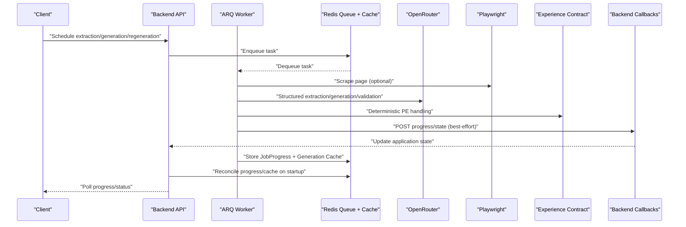

**Diagram sources**
- [worker.py:672-974](file://agents/worker.py#L672-L974)
- [internal_worker.py:19-71](file://backend/app/api/internal_worker.py#L19-L71)
- [workflow-contract.json:1-114](file://shared/workflow-contract.json#L1-L114)
- [application_manager.py:992-1191](file://backend/app/services/application_manager.py#L992-L1191)

## Detailed Component Analysis

### Extraction Agent
The extraction agent scrapes job posting pages and extracts structured fields using a LangChain ChatOpenAI call against OpenRouter. It supports a primary and fallback model with automatic retry.

Key behaviors:
- Playwright-driven scraping with headless Chromium
- Origin normalization and reference ID extraction from URL/text
- Structured extraction with Pydantic model validation
- Blocked-page detection and failure reporting
- Progress updates and success/failure callbacks

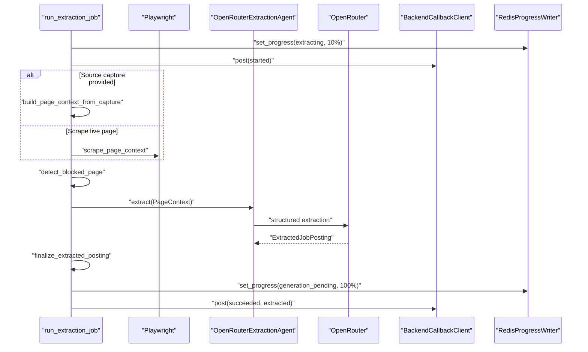

**Diagram sources**
- [worker.py:672-791](file://agents/worker.py#L672-L791)
- [worker.py:485-522](file://agents/worker.py#L485-L522)

**Section sources**
- [worker.py:485-522](file://agents/worker.py#L485-L522)
- [worker.py:672-791](file://agents/worker.py#L672-L791)
- [worker.py:283-322](file://agents/worker.py#L283-L322)

### Generation Agent
The generation agent performs section-based generation with:
- Structured output via Pydantic models
- Fallback model retry on primary failure
- Progress callbacks for each section
- Validation gate before assembly
- Deterministic Professional Experience structure handling

**Updated** Enhanced with comprehensive generation workflow system and Redis caching

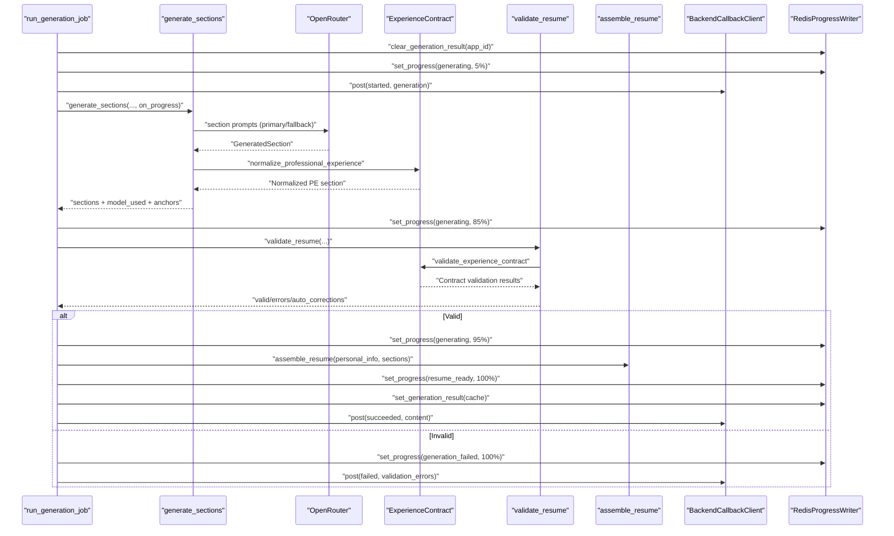

**Diagram sources**
- [worker.py:961-1149](file://agents/worker.py#L961-L1149)
- [generation.py:898-991](file://agents/generation.py#L898-L991)
- [validation.py:527-602](file://agents/validation.py#L527-L602)
- [assembly.py:12-86](file://agents/assembly.py#L12-L86)

**Section sources**
- [worker.py:961-1149](file://agents/worker.py#L961-L1149)
- [generation.py:898-991](file://agents/generation.py#L898-L991)
- [validation.py:527-602](file://agents/validation.py#L527-L602)

### Regeneration Agent
The regeneration agent provides both full and single-section regeneration capabilities:
- Full regeneration follows the same generation pipeline with deterministic validation
- Single-section regeneration targets specific sections with user instructions
- Both modes support progress callbacks and validation gates
- Redis caching persists generation results for recovery

**Updated** Comprehensive documentation of regeneration workflow system

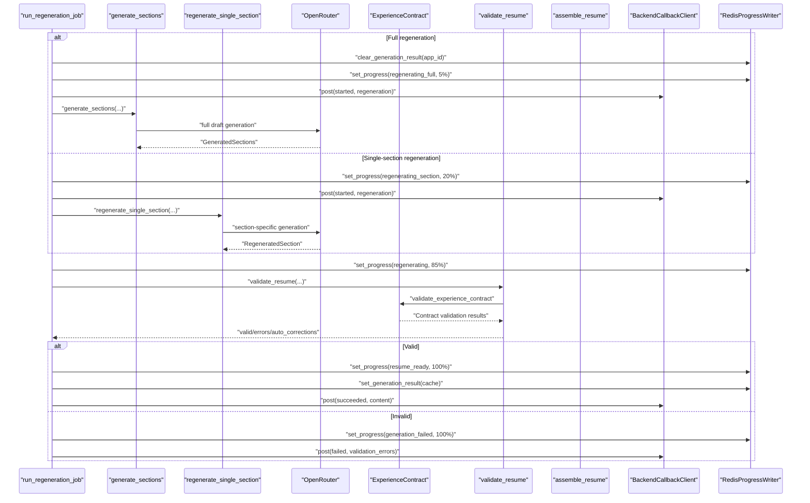

**Diagram sources**
- [worker.py:1226-1613](file://agents/worker.py#L1226-L1613)
- [generation.py:1013-1110](file://agents/generation.py#L1013-L1110)
- [validation.py:527-602](file://agents/validation.py#L527-L602)

**Section sources**
- [worker.py:1226-1613](file://agents/worker.py#L1226-L1613)
- [generation.py:1013-1110](file://agents/generation.py#L1013-L1110)

### Validation Agent
The validation agent enforces:
- Hallucination detection across sections using structured LLM output with detailed finding models
- Required sections presence
- Correct ordering
- ATS safety (no tables/images; auto-correct minor formatting)
- Deterministic Professional Experience structure validation with anchor-based contract enforcement

**Updated** Enhanced with deterministic Professional Experience validation and stricter role title constraints

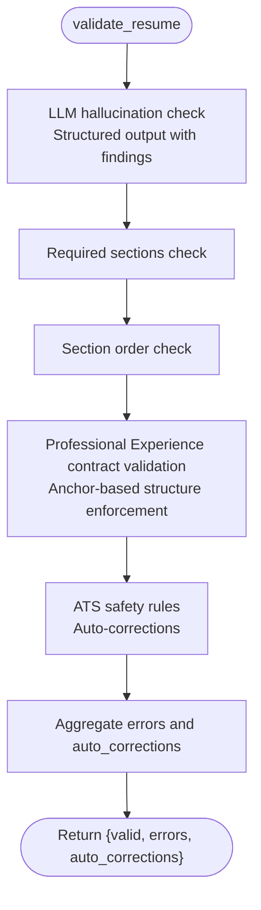

**Diagram sources**
- [validation.py:527-602](file://agents/validation.py#L527-L602)
- [experience_contract.py:202-254](file://agents/experience_contract.py#L202-L254)

**Section sources**
- [validation.py:140-174](file://agents/validation.py#L140-L174)
- [validation.py:176-228](file://agents/validation.py#L176-L228)
- [validation.py:230-250](file://agents/validation.py#L230-L250)
- [validation.py:332-395](file://agents/validation.py#L332-L395)
- [validation.py:441-462](file://agents/validation.py#L441-L462)
- [validation.py:464-499](file://agents/validation.py#L464-L499)
- [validation.py:527-602](file://agents/validation.py#L527-L602)

### Experience Contract Service
The experience contract service provides deterministic Professional Experience structure handling:
- Anchor extraction from source content
- Role header parsing with title/company/date validation
- Deterministic normalization preserving source anchors
- Contract validation ensuring structural integrity

**New** Comprehensive documentation of deterministic Professional Experience handling

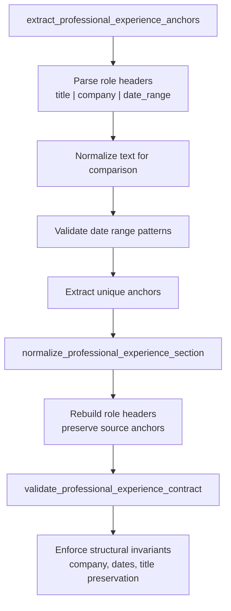

**Diagram sources**
- [experience_contract.py:86-122](file://agents/experience_contract.py#L86-L122)
- [experience_contract.py:156-200](file://agents/experience_contract.py#L156-L200)
- [experience_contract.py:202-254](file://agents/experience_contract.py#L202-L254)

**Section sources**
- [experience_contract.py:86-122](file://agents/experience_contract.py#L86-L122)
- [experience_contract.py:156-200](file://agents/experience_contract.py#L156-L200)
- [experience_contract.py:202-254](file://agents/experience_contract.py#L202-L254)

### Assembly Service
Assembles final Markdown from personal info header and ordered generated sections, ensuring proper formatting and section separation.

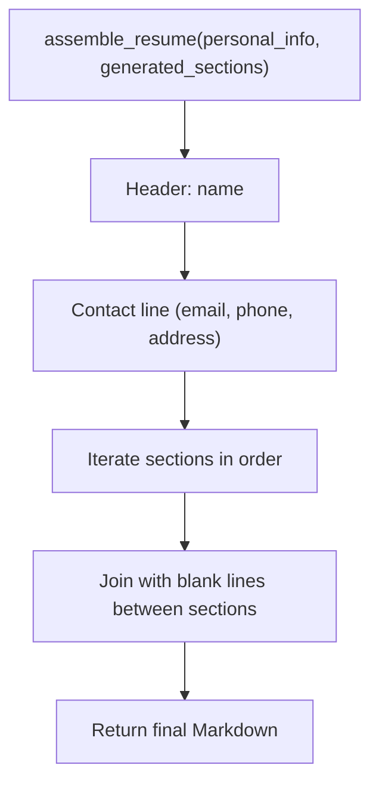

**Diagram sources**
- [assembly.py:12-86](file://agents/assembly.py#L12-L86)

**Section sources**
- [assembly.py:12-86](file://agents/assembly.py#L12-L86)

### Progress Tracking and Callbacks
Progress is stored in Redis under a deterministic key and periodically updated during agent runs. Backend callbacks notify the system of state transitions and completion. Generation workflows include Redis caching for results with best-effort delivery.

```mermaid
classDiagram
class RedisProgressWriter {
+get(application_id) JobProgress?
+set(application_id, progress, ttl_seconds)
+set_generation_result(application_id, job_id, workflow_kind, generated, ttl_seconds)
+clear_generation_result(application_id)
}
class JobProgress {
+string job_id
+string workflow_kind
+string state
+string message
+int percent_complete
+string created_at
+string updated_at
+string completed_at?
+string terminal_error_code?
}
class BackendCallbackClient {
+post(payload, path)
}
class BestEffortCallback {
+post_callback_best_effort(callback, payload, path, app_id, job_id, stage)
}
RedisProgressWriter --> JobProgress : "serializes/deserializes"
BackendCallbackClient -->|"HTTP POST"| BackendCallbackClient : "extraction/generation/regeneration"
BestEffortCallback --> BackendCallbackClient : "wraps with retry/backoff"
```

**Diagram sources**
- [worker.py:356-372](file://agents/worker.py#L356-L372)
- [worker.py:77-87](file://agents/worker.py#L77-L87)
- [worker.py:374-403](file://agents/worker.py#L374-L403)
- [worker.py:722-766](file://agents/worker.py#L722-L766)

**Section sources**
- [worker.py:356-372](file://agents/worker.py#L356-L372)
- [worker.py:77-87](file://agents/worker.py#L77-L87)
- [worker.py:374-403](file://agents/worker.py#L374-L403)
- [worker.py:722-766](file://agents/worker.py#L722-L766)

### Redis Generation Caching
Generation results are cached in Redis with TTL expiration for recovery purposes. The backend can reconcile progress and cached results on startup or when callbacks fail to deliver.

**New** Comprehensive documentation of Redis caching for generation results

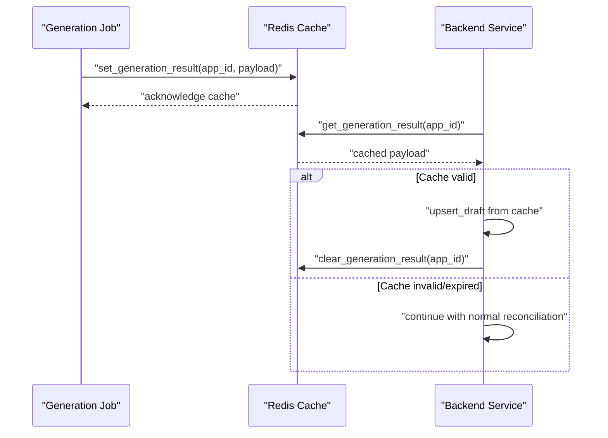

**Diagram sources**
- [worker.py:406-425](file://agents/worker.py#L406-L425)
- [application_manager.py:992-1191](file://backend/app/services/application_manager.py#L992-L1191)

**Section sources**
- [worker.py:406-425](file://agents/worker.py#L406-L425)
- [application_manager.py:992-1191](file://backend/app/services/application_manager.py#L992-L1191)

### LangChain and OpenRouter Integration
- ChatOpenAI is configured with OpenRouter base URL and API key.
- Structured output is used for extraction and generation to ensure robust parsing.
- Fallback model is attempted automatically when the primary model fails.
- Higher-quality slower models are used as defaults for improved output quality.

**Updated** Enhanced with higher-quality model defaults and improved timeout handling

**Section sources**
- [worker.py:405-483](file://agents/worker.py#L405-L483)
- [generation.py:642-660](file://agents/generation.py#L642-L660)
- [validation.py:1-16](file://agents/validation.py#L1-L16)

### Workflow Contract Integration
The shared workflow-contract.json defines internal states, workflow kinds, failure reasons, and mapping rules. The backend derives visible statuses from internal states and failure reasons.

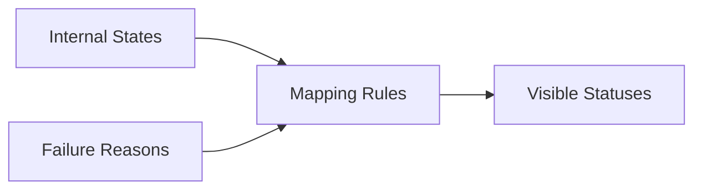

**Diagram sources**
- [workflow-contract.json:1-114](file://shared/workflow-contract.json#L1-L114)
- [workflow_contract.py:32-39](file://backend/app/core/workflow_contract.py#L32-L39)
- [workflow.py:11-32](file://backend/app/services/workflow.py#L11-L32)

**Section sources**
- [workflow-contract.json:1-114](file://shared/workflow-contract.json#L1-L114)
- [workflow_contract.py:32-39](file://backend/app/core/workflow_contract.py#L32-L39)
- [workflow.py:11-32](file://backend/app/services/workflow.py#L11-L32)

### Generation Settings and Section Management
The generation system supports advanced configuration including:
- Aggressiveness levels (low, medium, high) for tailoring
- Target length guidance (1_page, 2_page, 3_page) for resume sizing
- Section preferences with enabled status and ordering
- Additional instructions for custom generation requirements
- Deterministic Professional Experience structure handling

**Updated** Enhanced with deterministic Professional Experience handling and stricter role title constraints

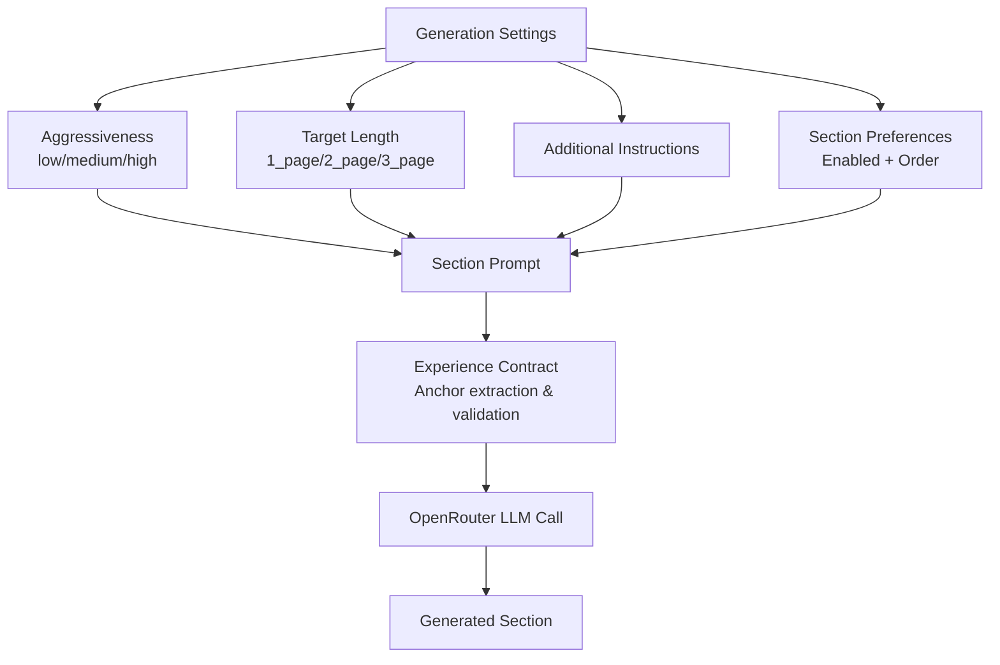

**Diagram sources**
- [generation.py:898-991](file://agents/generation.py#L898-L991)
- [generation.py:499-560](file://agents/generation.py#L499-L560)
- [experience_contract.py:86-122](file://agents/experience_contract.py#L86-L122)

**Section sources**
- [generation.py:898-991](file://agents/generation.py#L898-L991)
- [generation.py:499-560](file://agents/generation.py#L499-L560)

### Regeneration Capabilities
The system supports both full regeneration and single-section regeneration with strict enforcement:
- Full regeneration follows the same generation pipeline with deterministic Professional Experience handling
- Single-section regeneration allows targeted updates with user instructions
- Non-admin users are limited to 3 full regenerations per application
- Admin users have bypass capability for unlimited full regenerations
- Automatic validation after regeneration with error recovery
- Slot consumption occurs only on successful queue submission

**Updated** Enhanced with regeneration cap enforcement and deterministic handling

**Section sources**
- [worker.py:1062-1414](file://agents/worker.py#L1062-L1414)
- [generation.py:1110-1110](file://agents/generation.py#L1110-L1110)
- [2026-04-10-deterministic-regeneration-timeouts-and-cap.md:25-31](file://docs/task-output/2026-04-10-deterministic-regeneration-timeouts-and-cap.md#L25-L31)

### Advanced Validation Features
The validation system implements comprehensive hallucination detection and ATS safety compliance:
- LLM-based hallucination checking with structured output and detailed finding models
- Detection of invented employers, titles, dates, credentials, and institutions
- Cross-section consistency validation
- ATS safety compliance with auto-correction capabilities for formatting issues
- Deterministic Professional Experience structure validation with anchor-based contract enforcement
- Structured error reporting with section-specific details

**Updated** Enhanced with deterministic Professional Experience validation and stricter constraints

**Section sources**
- [validation.py:140-174](file://agents/validation.py#L140-L174)
- [validation.py:527-602](file://agents/validation.py#L527-L602)
- [experience_contract.py:202-254](file://agents/experience_contract.py#L202-L254)

### Error Handling and Timeout Management
The system implements comprehensive error handling and timeout management:
- Extraction timeout: 30 seconds
- Full generation timeout: 540 seconds (increased from previous 240s)
- Full regeneration timeout: 540 seconds (increased from previous 240s)
- Single-section regeneration timeout: 280 seconds (increased from previous 120s)
- Section regeneration LLM timeout: 120 seconds (increased from previous 45s)
- Export timeout: 20 seconds
- Bounded retries: One fallback model retry per LLM call
- Structured error reporting with normalized validation errors
- Terminal error codes for different failure scenarios
- Deterministic regeneration with strict timeout profiles
- Best-effort callback delivery with exponential backoff

**Updated** Enhanced with increased timeouts and deterministic handling

**Section sources**
- [worker.py:52-53](file://agents/worker.py#L52-L53)
- [worker.py:889-904](file://agents/worker.py#L889-L904)
- [worker.py:1132-1147](file://agents/worker.py#L1132-L1147)
- [worker.py:1252-1269](file://agents/worker.py#L1252-L1269)
- [generation.py:56-57](file://agents/generation.py#L56-L57)
- [generation.py:58-59](file://agents/generation.py#L58-L59)
- [2026-04-07-generation-hang-and-cancel-fixes.md:110-118](file://docs/task-output/2026-04-07-generation-hang-and-cancel-fixes.md#L110-L118)

### Strict Prompt Constraints for Role Title Rewrites
The system enforces strict constraints for role title rewrites:
- Low and medium aggressiveness: Preserve source role titles exactly as written
- High aggressiveness: May retitle Professional Experience roles only when the new title is a truthful reframing of the same source role
- Strict guardrails: Preserve employer and dates exactly when role titles are rewritten
- Seniority inflation and invented scope are explicitly forbidden
- Deterministic validation ensures high-aggressiveness rewrites don't fail as unsupported claims

**New** Comprehensive documentation of strict role title rewrite constraints

**Section sources**
- [generation.py:105-115](file://agents/generation.py#L105-L115)
- [generation.py:122-133](file://agents/generation.py#L122-L133)
- [generation.py:422-432](file://agents/generation.py#L422-L432)
- [2026-04-09-high-aggressiveness-role-title-rewrites.md:62-71](file://docs/task-output/2026-04-09-high-aggressiveness-role-title-rewrites.md#L62-L71)

### Best-Effort Callback Delivery
Generation workflows implement best-effort callback delivery with retry logic and exponential backoff to ensure resilience against transient failures.

**New** Comprehensive documentation of best-effort callback mechanisms

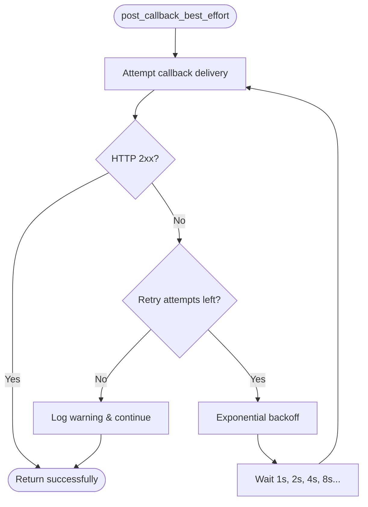

**Diagram sources**
- [worker.py:722-766](file://agents/worker.py#L722-L766)

**Section sources**
- [worker.py:722-766](file://agents/worker.py#L722-L766)

## Dependency Analysis
The agents package depends on ARQ for task queueing, LangChain OpenAI for LLM calls, Playwright for browser automation, and Redis for progress storage and generation caching. The backend consumes agent callbacks and derives application statuses from the shared workflow contract.

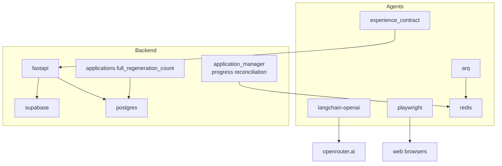

**Diagram sources**
- [pyproject.toml:10-16](file://agents/pyproject.toml#L10-L16)
- [worker.py:13-19](file://agents/worker.py#L13-L19)
- [main.py:14-36](file://backend/app/main.py#L14-L36)
- [2026-04-10-deterministic-regeneration-timeouts-and-cap.sql:3-4](file://supabase/migrations/20260410_000011_phase_5_full_regeneration_cap.sql#L3-L4)
- [application_manager.py:992-1191](file://backend/app/services/application_manager.py#L992-L1191)

**Section sources**
- [pyproject.toml:10-16](file://agents/pyproject.toml#L10-L16)
- [worker.py:13-19](file://agents/worker.py#L13-L19)
- [main.py:14-36](file://backend/app/main.py#L14-L36)

## Performance Considerations
- Timeouts: Extraction (30s), generation (540s), regeneration (540s), single-section regeneration (280s), export (20s).
- Increased timeouts for complex generation tasks with deterministic validation
- Bounded retries: One fallback model retry per LLM call.
- Structured output reduces parsing overhead and improves reliability.
- Headless browser automation minimizes resource usage.
- Progress updates keep UI responsive and enable user feedback.
- Deterministic Professional Experience handling reduces validation failures and rework cycles.
- Redis caching reduces callback dependency and enables recovery from delivery failures.
- Best-effort callback delivery with exponential backoff ensures resilience.

## Troubleshooting Guide
Common issues and remedies:
- Extraction timeouts: Retry with manual entry; verify network and provider rate limits.
- Blocked pages: Detection returns failure details; guide user to paste content.
- Validation failures: Review validation errors and auto-corrections; adjust generation settings.
- Missing sections or wrong order: Ensure section preferences are enabled and ordered correctly.
- Model failures: Primary/fallback model retry is automatic; confirm API keys and base URLs.
- Hallucination detection failures: Check LLM model availability and retry with fallback model.
- ATS safety violations: Review auto-corrections applied to fix formatting issues.
- Regeneration cap exceeded: Non-admin users receive conflict guidance; admins can bypass with appropriate permissions.
- Professional Experience structure violations: Review deterministic validation errors and ensure source anchors are preserved.
- Generation cache misses: Backend automatically reconciles from progress when cache is unavailable.
- Callback delivery failures: Best-effort delivery continues without interrupting workflow execution.

**Updated** Enhanced troubleshooting with regeneration cap, Professional Experience validation, and Redis caching issues

**Section sources**
- [worker.py:791-813](file://agents/worker.py#L791-L813)
- [worker.py:672-791](file://agents/worker.py#L672-L791)
- [validation.py:527-602](file://agents/validation.py#L527-L602)
- [2026-04-10-deterministic-regeneration-timeouts-and-cap.md:25-31](file://docs/task-output/2026-04-10-deterministic-regeneration-timeouts-and-cap.md#L25-L31)

## Conclusion
The ARQ-based agent system provides a robust, asynchronous pipeline for extracting job postings, generating tailored resumes, validating ATS compliance, and assembling final outputs. It integrates tightly with Redis for progress tracking and generation caching, OpenRouter for reliable LLM calls, and the backend's workflow contract to maintain a clear state machine and visible status mapping. Built-in retry strategies, timeouts, and structured validation ensure resilient operation and predictable user experiences. The enhanced deterministic Professional Experience handling, comprehensive generation workflow system, Redis caching with reconciliation, and best-effort callback delivery provide additional reliability and control for complex generation workflows.

## Appendices

### Agent Configuration Examples
- Environment variables for OpenRouter and models:
  - OPENROUTER_API_KEY
  - EXTRACTION_AGENT_MODEL, EXTRACTION_AGENT_FALLBACK_MODEL
  - GENERATION_AGENT_MODEL, GENERATION_AGENT_FALLBACK_MODEL
  - VALIDATION_AGENT_MODEL, VALIDATION_AGENT_FALLBACK_MODEL
  - BACKEND_API_URL, WORKER_CALLBACK_SECRET
  - REDIS_URL
- Example scheduling:
  - Enqueue extraction: include job_url, application_id, user_id, job_id
  - Enqueue generation: include job_title, company_name, job_description, base_resume_content, personal_info, section_preferences, generation_settings
  - Enqueue regeneration: include either full params or section_name + instructions + current_draft_content
  - Full regeneration cap enforcement: non-admin users limited to 3 full regenerations per application

**Updated** Enhanced with regeneration cap configuration

**Section sources**
- [worker.py:58-75](file://agents/worker.py#L58-L75)
- [worker.py:672-791](file://agents/worker.py#L672-L791)
- [worker.py:961-1149](file://agents/worker.py#L961-L1149)
- [worker.py:1226-1613](file://agents/worker.py#L1226-L1613)

### Monitoring Approaches
- Poll progress: use the polling schema defined in the workflow contract to fetch JobProgress from Redis.
- Backend status mapping: derive visible status from internal state and failure reason.
- Callback verification: ensure X-Worker-Secret is present for internal worker endpoints.
- Regeneration cap monitoring: track applications.full_regeneration_count for non-admin users.
- Deterministic validation monitoring: verify Professional Experience structure compliance.
- Generation cache monitoring: verify Redis caching and reconciliation capabilities.

**Updated** Enhanced with regeneration cap, deterministic validation, and Redis caching monitoring

**Section sources**
- [workflow-contract.json:91-114](file://shared/workflow-contract.json#L91-L114)
- [workflow.py:11-32](file://backend/app/services/workflow.py#L11-L32)
- [internal_worker.py:19-71](file://backend/app/api/internal_worker.py#L19-L71)

### Error Recovery and Retry Strategies
- Extraction agent: primary model followed by fallback model; blocked pages trigger manual entry.
- Generation/Validation agents: primary model with fallback; structured output ensures consistent parsing.
- Backend callbacks: on failure, set terminal error code and notify the backend; UI can guide user actions.
- Regeneration cap enforcement: non-admin users receive conflict guidance; admin bypass available.
- Deterministic Professional Experience handling: strict validation prevents structural violations.
- Redis caching: automatic recovery from callback failures using cached generation results.
- Best-effort callback delivery: exponential backoff retry mechanism for transient failures.

**Updated** Enhanced with regeneration cap, deterministic handling, Redis caching, and best-effort callback strategies

**Section sources**
- [worker.py:405-483](file://agents/worker.py#L405-L483)
- [generation.py:642-660](file://agents/generation.py#L642-L660)
- [validation.py:1-16](file://agents/validation.py#L1-L16)
- [worker.py:1226-1613](file://agents/worker.py#L1226-L1613)
- [2026-04-10-deterministic-regeneration-timeouts-and-cap.md:25-31](file://docs/task-output/2026-04-10-deterministic-regeneration-timeouts-and-cap.md#L25-L31)

### Hallucination Detection and Validation Rules
The validation system implements comprehensive hallucination detection:
- LLM-based hallucination checking with structured output and detailed finding models
- Detection of invented employers, titles, dates, credentials, and institutions
- Cross-section consistency validation
- ATS safety compliance with auto-correction capabilities
- Deterministic Professional Experience structure validation with anchor-based contract enforcement

**Updated** Enhanced with deterministic Professional Experience validation

**Section sources**
- [validation.py:140-174](file://agents/validation.py#L140-L174)
- [validation.py:527-602](file://agents/validation.py#L527-L602)
- [experience_contract.py:202-254](file://agents/experience_contract.py#L202-L254)

### Generation Settings Configuration
Advanced generation settings for resume customization:
- Aggressiveness levels: low (conservative), medium (balanced), high (aggressive tailoring)
- Target length: 1_page (standard), 2_page (extended), 3_page (maximum)
- Additional instructions: optional custom guidance for specific requirements
- Section preferences: enable/disable sections and set generation order
- Deterministic Professional Experience handling: strict anchor-based structure preservation

**Updated** Enhanced with deterministic Professional Experience handling

**Section sources**
- [backend/AGENTS.md:46-52](file://backend/AGENTS.md#L46-L52)
- [test_worker.py:131-144](file://agents/tests/test_worker.py#L131-L144)
- [generation.py:105-115](file://agents/generation.py#L105-L115)
- [generation.py:122-133](file://agents/generation.py#L122-L133)

### Regeneration Cap Implementation
The system enforces a non-admin full regeneration cap of 3 per application:
- Applications table receives full_regeneration_count column with non-negative constraint
- Non-admin users are blocked at 3 full regenerations with user-safe guidance
- Admin users have bypass capability via profile.is_admin
- Slot consumption occurs only on successful queue submission
- Queue failures do not consume regeneration slots

**New** Comprehensive documentation of regeneration cap implementation

**Section sources**
- [2026-04-10-deterministic-regeneration-timeouts-and-cap.md:25-31](file://docs/task-output/2026-04-10-deterministic-regeneration-timeouts-and-cap.md#L25-L31)
- [2026-04-10-deterministic-regeneration-timeouts-and-cap.sql:3-11](file://supabase/migrations/20260410_000011_phase_5_full_regeneration_cap.sql#L3-L11)
- [2026-04-10-deterministic-regeneration-timeouts-and-cap.md:40-43](file://docs/task-output/2026-04-10-deterministic-regeneration-timeouts-and-cap.md#L40-L43)

### Admin Bypass Support
The system provides admin bypass functionality for regeneration caps:
- Admin users can bypass the 3-full-regeneration cap per application
- Admin bypass is determined by profile.is_admin flag
- Admin users can perform unlimited full regenerations
- Non-admin users are strictly limited to 3 full regenerations per application
- User-safe conflict guidance is provided when cap is reached

**New** Comprehensive documentation of admin bypass support

**Section sources**
- [2026-04-10-deterministic-regeneration-timeouts-and-cap.md:25-31](file://docs/task-output/2026-04-10-deterministic-regeneration-timeouts-and-cap.md#L25-L31)
- [2026-04-10-deterministic-regeneration-timeouts-and-cap.sql:3-11](file://supabase/migrations/20260410_000011_phase_5_full_regeneration_cap.sql#L3-L11)

### Redis Generation Cache Reconciliation
The backend automatically reconciles generation results from Redis cache when callback delivery fails or progress indicates completion without callback receipt.

**New** Comprehensive documentation of Redis cache reconciliation process

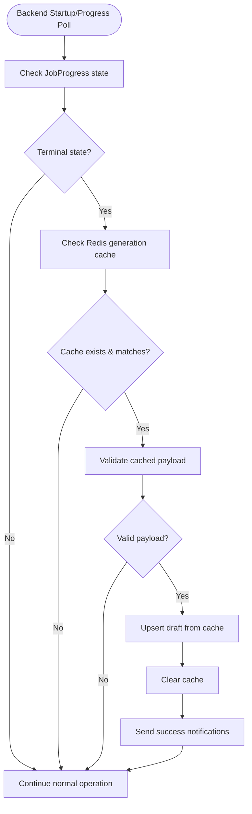

**Diagram sources**
- [application_manager.py:992-1191](file://backend/app/services/application_manager.py#L992-L1191)

**Section sources**
- [application_manager.py:992-1191](file://backend/app/services/application_manager.py#L992-L1191)