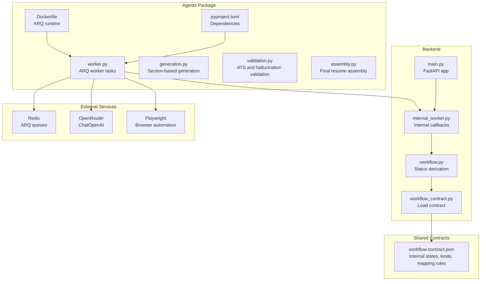
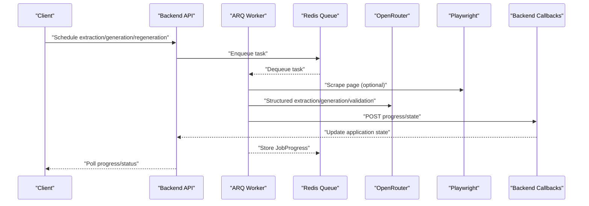
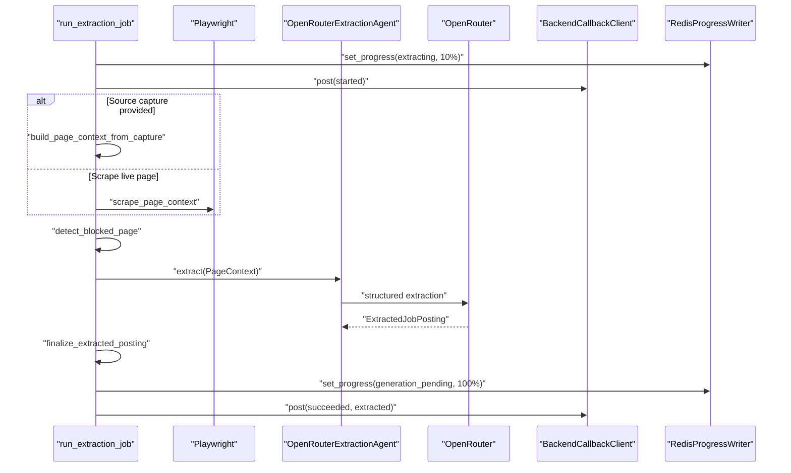
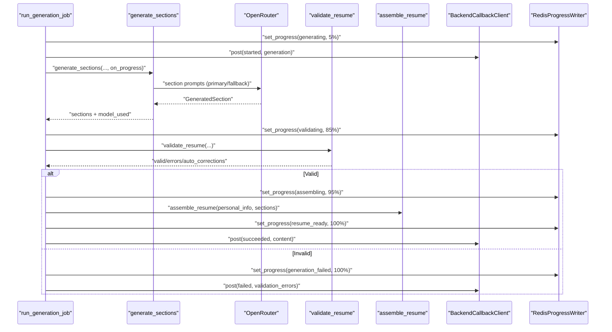
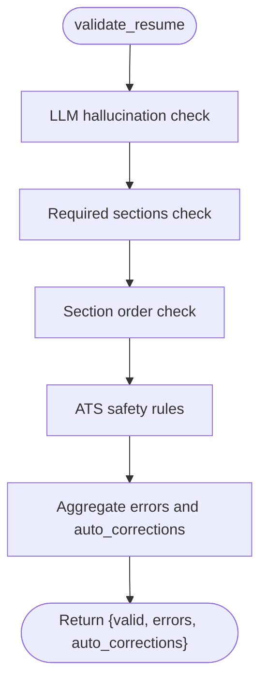
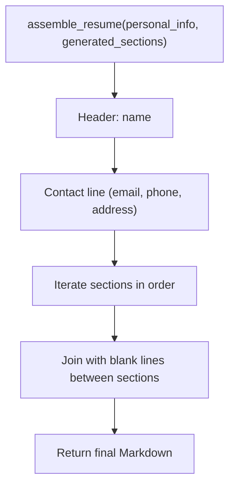
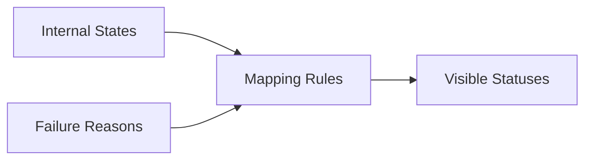
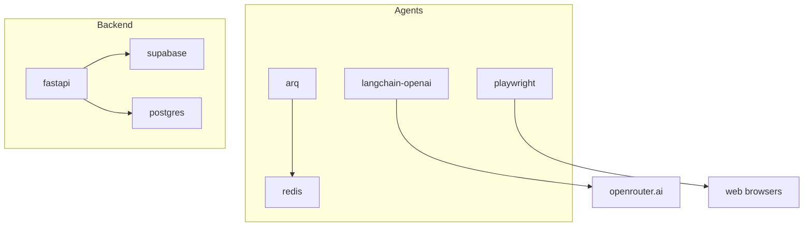

# AI Agent System

<cite>
**Referenced Files in This Document**
- [AGENTS.md](file://agents/AGENTS.md)
- [assembly.py](file://agents/assembly.py)
- [generation.py](file://agents/generation.py)
- [validation.py](file://agents/validation.py)
- [worker.py](file://agents/worker.py)
- [Dockerfile](file://agents/Dockerfile)
- [pyproject.toml](file://agents/pyproject.toml)
- [workflow-contract.json](file://shared/workflow-contract.json)
- [workflow_contract.py](file://backend/app/core/workflow_contract.py)
- [workflow.py](file://backend/app/services/workflow.py)
- [internal_worker.py](file://backend/app/api/internal_worker.py)
- [main.py](file://backend/app/main.py)
- [test_worker.py](file://agents/tests/test_worker.py)
</cite>

## Table of Contents
1. [Introduction](#introduction)
2. [Project Structure](#project-structure)
3. [Core Components](#core-components)
4. [Architecture Overview](#architecture-overview)
5. [Detailed Component Analysis](#detailed-component-analysis)
6. [Dependency Analysis](#dependency-analysis)
7. [Performance Considerations](#performance-considerations)
8. [Troubleshooting Guide](#troubleshooting-guide)
9. [Conclusion](#conclusion)
10. [Appendices](#appendices)

## Introduction
This document describes the AI agent system built on ARQ for the AI Resume Builder. It covers the agent design patterns for task queue management, progress tracking, error handling, and asynchronous processing. It explains the three main agent types:
- Extraction agents for web scraping and job board parsing
- Generation agents for AI-powered resume creation using section-based generation and prompt engineering
- Validation agents for content validation and ATS optimization

It also documents agent coordination via Redis queues, progress callbacks, LangChain integration, OpenRouter API configuration and model selection, workflow contract integration with the backend state machine, error recovery and retry strategies, and practical examples for configuration, scheduling, and monitoring.

## Project Structure
The AI agent system is implemented in the agents/ package and orchestrated by ARQ workers. The backend exposes internal worker callbacks that receive progress and completion events from agents. Shared workflow-contract.json defines the state machine and mapping rules used by the backend to derive visible statuses.



**Diagram sources**
- [worker.py:1-1186](file://agents/worker.py#L1-L1186)
- [generation.py:1-351](file://agents/generation.py#L1-L351)
- [validation.py:1-292](file://agents/validation.py#L1-L292)
- [assembly.py:1-63](file://agents/assembly.py#L1-L63)
- [pyproject.toml:1-26](file://agents/pyproject.toml#L1-L26)
- [Dockerfile:1-14](file://agents/Dockerfile#L1-L14)
- [workflow-contract.json:1-112](file://shared/workflow-contract.json#L1-L112)
- [workflow_contract.py:1-40](file://backend/app/core/workflow_contract.py#L1-L40)
- [workflow.py:1-31](file://backend/app/services/workflow.py#L1-L31)
- [internal_worker.py:1-71](file://backend/app/api/internal_worker.py#L1-L71)
- [main.py:1-36](file://backend/app/main.py#L1-L36)

**Section sources**
- [worker.py:1-1186](file://agents/worker.py#L1-L1186)
- [pyproject.toml:1-26](file://agents/pyproject.toml#L1-L26)
- [Dockerfile:1-14](file://agents/Dockerfile#L1-L14)
- [workflow-contract.json:1-112](file://shared/workflow-contract.json#L1-L112)
- [workflow_contract.py:1-40](file://backend/app/core/workflow_contract.py#L1-L40)
- [workflow.py:1-31](file://backend/app/services/workflow.py#L1-L31)
- [internal_worker.py:1-71](file://backend/app/api/internal_worker.py#L1-L71)
- [main.py:1-36](file://backend/app/main.py#L1-L36)

## Core Components
- ARQ worker tasks: define the extraction, generation, and regeneration jobs and publish progress and results to Redis and backend callbacks.
- Extraction agent: uses Playwright to scrape job postings and LangChain with OpenRouter to extract structured fields.
- Generation agent: performs section-based generation with structured output, fallback models, and progress callbacks.
- Validation agent: validates ATS safety, hallucinations, required sections, and ordering; supports auto-corrections.
- Assembly service: combines personal info header with ordered generated sections into a single Markdown resume.
- Progress tracking: Redis-backed JobProgress records and periodic callbacks to backend.
- Workflow contract: shared contract defining internal states, workflow kinds, failure reasons, and status mapping rules.

**Section sources**
- [worker.py:526-880](file://agents/worker.py#L526-L880)
- [generation.py:159-224](file://agents/generation.py#L159-L224)
- [validation.py:231-291](file://agents/validation.py#L231-L291)
- [assembly.py:12-62](file://agents/assembly.py#L12-L62)
- [workflow-contract.json:1-112](file://shared/workflow-contract.json#L1-L112)

## Architecture Overview
The system integrates ARQ workers with Redis queues, LangChain ChatOpenAI via OpenRouter, Playwright for browser automation, and backend callbacks for progress and completion. The backend derives visible statuses from internal states using the shared workflow contract.



**Diagram sources**
- [worker.py:526-880](file://agents/worker.py#L526-L880)
- [internal_worker.py:19-70](file://backend/app/api/internal_worker.py#L19-L70)
- [workflow-contract.json:1-112](file://shared/workflow-contract.json#L1-L112)

## Detailed Component Analysis

### Extraction Agent
The extraction agent scrapes job posting pages and extracts structured fields using a LangChain ChatOpenAI call against OpenRouter. It supports a primary and fallback model with automatic retry.

Key behaviors:
- Playwright-driven scraping with headless Chromium
- Origin normalization and reference ID extraction from URL/text
- Structured extraction with Pydantic model validation
- Blocked-page detection and failure reporting
- Progress updates and success/failure callbacks



**Diagram sources**
- [worker.py:526-666](file://agents/worker.py#L526-L666)
- [worker.py:307-370](file://agents/worker.py#L307-L370)

**Section sources**
- [worker.py:372-424](file://agents/worker.py#L372-L424)
- [worker.py:526-666](file://agents/worker.py#L526-L666)
- [worker.py:307-370](file://agents/worker.py#L307-L370)

### Generation Agent
The generation agent performs section-based generation with:
- Structured output via Pydantic models
- Fallback model retry on primary failure
- Progress callbacks for each section
- Validation gate before assembly



**Diagram sources**
- [worker.py:682-880](file://agents/worker.py#L682-L880)
- [generation.py:159-224](file://agents/generation.py#L159-L224)
- [validation.py:231-291](file://agents/validation.py#L231-L291)
- [assembly.py:12-62](file://agents/assembly.py#L12-L62)

**Section sources**
- [worker.py:682-880](file://agents/worker.py#L682-L880)
- [generation.py:159-224](file://agents/generation.py#L159-L224)
- [validation.py:231-291](file://agents/validation.py#L231-L291)

### Validation Agent
The validation agent enforces:
- Hallucination detection across sections
- Required sections presence
- Correct ordering
- ATS safety (no tables/images; auto-correct minor formatting)



**Diagram sources**
- [validation.py:231-291](file://agents/validation.py#L231-L291)

**Section sources**
- [validation.py:48-115](file://agents/validation.py#L48-L115)
- [validation.py:118-175](file://agents/validation.py#L118-L175)
- [validation.py:178-223](file://agents/validation.py#L178-L223)
- [validation.py:231-291](file://agents/validation.py#L231-L291)

### Assembly Service
Assembles final Markdown from personal info header and ordered generated sections, ensuring proper formatting and section separation.



**Diagram sources**
- [assembly.py:12-62](file://agents/assembly.py#L12-L62)

**Section sources**
- [assembly.py:12-62](file://agents/assembly.py#L12-L62)

### Progress Tracking and Callbacks
Progress is stored in Redis under a deterministic key and periodically updated during agent runs. Backend callbacks notify the system of state transitions and completion.

```mermaid
classDiagram
class RedisProgressWriter {
+get(application_id) JobProgress?
+set(application_id, progress, ttl_seconds)
}
class JobProgress {
+string job_id
+string workflow_kind
+string state
+string message
+int percent_complete
+string created_at
+string updated_at
+string completed_at?
+string terminal_error_code?
}
class BackendCallbackClient {
+post(payload, path)
}
RedisProgressWriter --> JobProgress : "serializes/deserializes"
BackendCallbackClient -->|"HTTP POST"| BackendCallbackClient : "extraction/generation/regeneration"
```

**Diagram sources**
- [worker.py:272-305](file://agents/worker.py#L272-L305)
- [worker.py:73-83](file://agents/worker.py#L73-L83)
- [worker.py:290-305](file://agents/worker.py#L290-L305)

**Section sources**
- [worker.py:272-305](file://agents/worker.py#L272-L305)
- [worker.py:73-83](file://agents/worker.py#L73-L83)
- [worker.py:290-305](file://agents/worker.py#L290-L305)

### LangChain and OpenRouter Integration
- ChatOpenAI is configured with OpenRouter base URL and API key.
- Structured output is used for extraction and generation to ensure robust parsing.
- Fallback model is attempted automatically when the primary model fails.

**Section sources**
- [worker.py:335-340](file://agents/worker.py#L335-L340)
- [generation.py:133-139](file://agents/generation.py#L133-L139)
- [validation.py:89-95](file://agents/validation.py#L89-L95)

### Workflow Contract Integration
The shared workflow-contract.json defines internal states, workflow kinds, failure reasons, and mapping rules. The backend derives visible statuses from internal states and failure reasons.



**Diagram sources**
- [workflow-contract.json:1-112](file://shared/workflow-contract.json#L1-L112)
- [workflow_contract.py:32-39](file://backend/app/core/workflow_contract.py#L32-L39)
- [workflow.py:11-30](file://backend/app/services/workflow.py#L11-L30)

**Section sources**
- [workflow-contract.json:1-112](file://shared/workflow-contract.json#L1-L112)
- [workflow_contract.py:32-39](file://backend/app/core/workflow_contract.py#L32-L39)
- [workflow.py:11-30](file://backend/app/services/workflow.py#L11-L30)

## Dependency Analysis
The agents package depends on ARQ for task queueing, LangChain OpenAI for LLM calls, Playwright for browser automation, and Redis for progress storage. The backend consumes agent callbacks and derives application statuses from the shared workflow contract.



**Diagram sources**
- [pyproject.toml:10-16](file://agents/pyproject.toml#L10-L16)
- [worker.py:13-19](file://agents/worker.py#L13-L19)
- [main.py:14-36](file://backend/app/main.py#L14-L36)

**Section sources**
- [pyproject.toml:10-16](file://agents/pyproject.toml#L10-L16)
- [worker.py:13-19](file://agents/worker.py#L13-L19)
- [main.py:14-36](file://backend/app/main.py#L14-L36)

## Performance Considerations
- Timeouts: Extraction (30s), generation (90s), single-section regeneration (45s), export (20s).
- Bounded retries: One fallback model retry per LLM call.
- Structured output reduces parsing overhead and improves reliability.
- Headless browser automation minimizes resource usage.
- Progress updates keep UI responsive and enable user feedback.

[No sources needed since this section provides general guidance]

## Troubleshooting Guide
Common issues and remedies:
- Extraction timeouts: Retry with manual entry; verify network and provider rate limits.
- Blocked pages: Detection returns failure details; guide user to paste content.
- Validation failures: Review validation errors and auto-corrections; adjust generation settings.
- Missing sections or wrong order: Ensure section preferences are enabled and ordered correctly.
- Model failures: Primary/fallback model retry is automatic; confirm API keys and base URLs.

**Section sources**
- [worker.py:645-666](file://agents/worker.py#L645-L666)
- [worker.py:580-592](file://agents/worker.py#L580-L592)
- [validation.py:255-291](file://agents/validation.py#L255-L291)
- [backend/AGENTS.md:38-44](file://backend/AGENTS.md#L38-L44)

## Conclusion
The ARQ-based agent system provides a robust, asynchronous pipeline for extracting job postings, generating tailored resumes, validating ATS compliance, and assembling final outputs. It integrates tightly with Redis for progress tracking, OpenRouter for reliable LLM calls, and the backend’s workflow contract to maintain a clear state machine and visible status mapping. Built-in retry strategies, timeouts, and structured validation ensure resilient operation and predictable user experiences.

[No sources needed since this section summarizes without analyzing specific files]

## Appendices

### Agent Configuration Examples
- Environment variables for OpenRouter and models:
  - OPENROUTER_API_KEY
  - EXTRACTION_AGENT_MODEL, EXTRACTION_AGENT_FALLBACK_MODEL
  - GENERATION_AGENT_MODEL, GENERATION_AGENT_FALLBACK_MODEL
  - VALIDATION_AGENT_MODEL, VALIDATION_AGENT_FALLBACK_MODEL
  - BACKEND_API_URL, WORKER_CALLBACK_SECRET
  - REDIS_URL
- Example scheduling:
  - Enqueue extraction: include job_url, application_id, user_id, job_id
  - Enqueue generation: include job_title, company_name, job_description, base_resume_content, personal_info, section_preferences, generation_settings
  - Enqueue regeneration: include either full params or section_name + instructions + current_draft_content

**Section sources**
- [worker.py:54-71](file://agents/worker.py#L54-L71)
- [worker.py:526-666](file://agents/worker.py#L526-L666)
- [worker.py:682-880](file://agents/worker.py#L682-L880)
- [worker.py:888-1180](file://agents/worker.py#L888-L1180)

### Monitoring Approaches
- Poll progress: use the polling schema defined in the workflow contract to fetch JobProgress from Redis.
- Backend status mapping: derive visible status from internal state and failure reason.
- Callback verification: ensure X-Worker-Secret is present for internal worker endpoints.

**Section sources**
- [workflow-contract.json:89-111](file://shared/workflow-contract.json#L89-L111)
- [workflow.py:11-30](file://backend/app/services/workflow.py#L11-L30)
- [internal_worker.py:19-70](file://backend/app/api/internal_worker.py#L19-L70)

### Error Recovery and Retry Strategies
- Extraction agent: primary model followed by fallback model; blocked pages trigger manual entry.
- Generation/Validation agents: primary model with fallback; structured output ensures consistent parsing.
- Backend callbacks: on failure, set terminal error code and notify the backend; UI can guide user actions.

**Section sources**
- [worker.py:320-328](file://agents/worker.py#L320-L328)
- [generation.py:117-151](file://agents/generation.py#L117-L151)
- [validation.py:87-115](file://agents/validation.py#L87-L115)
- [worker.py:475-510](file://agents/worker.py#L475-L510)