# Agent Architecture

<cite>
**Referenced Files in This Document**
- [worker.py](file://agents/worker.py)
- [generation.py](file://agents/generation.py)
- [validation.py](file://agents/validation.py)
- [assembly.py](file://agents/assembly.py)
- [pyproject.toml](file://agents/pyproject.toml)
- [Dockerfile](file://agents/Dockerfile)
- [docker-compose.yml](file://docker-compose.yml)
- [workflow_contract.py](file://backend/app/core/workflow_contract.py)
- [workflow-contract.json](file://shared/workflow-contract.json)
- [jobs.py](file://backend/app/services/jobs.py)
- [test_worker.py](file://agents/tests/test_worker.py)
</cite>

## Table of Contents
1. [Introduction](#introduction)
2. [Project Structure](#project-structure)
3. [Core Components](#core-components)
4. [Architecture Overview](#architecture-overview)
5. [Detailed Component Analysis](#detailed-component-analysis)
6. [Dependency Analysis](#dependency-analysis)
7. [Performance Considerations](#performance-considerations)
8. [Troubleshooting Guide](#troubleshooting-guide)
9. [Conclusion](#conclusion)
10. [Appendices](#appendices)

## Introduction
This document explains the ARQ-based agent architecture for extracting job postings, generating tailored resumes, and validating outputs. It covers task queue management via Redis, asynchronous processing workflows, progress tracking, configuration management, structured LLM outputs using LangChain, OpenRouter API access, Playwright-based web scraping, and integration with the backend’s workflow contract and state machine. It also documents agent lifecycle, callback mechanisms, error handling, and monitoring approaches.

## Project Structure
The agents subsystem is organized around four Python modules plus packaging and containerization:
- worker.py: Agent orchestration, scraping, extraction, progress tracking, callbacks, and job runners
- generation.py: Section-based generation with structured LLM outputs and fallback logic
- validation.py: Hallucination detection, completeness, ordering, and ATS-safety checks
- assembly.py: Final resume assembly from personal info header and ordered sections
- pyproject.toml: Dependencies and build configuration
- Dockerfile: Container image definition and ARQ worker command
- docker-compose.yml: Environment variables and service wiring for agents, Redis, and backend

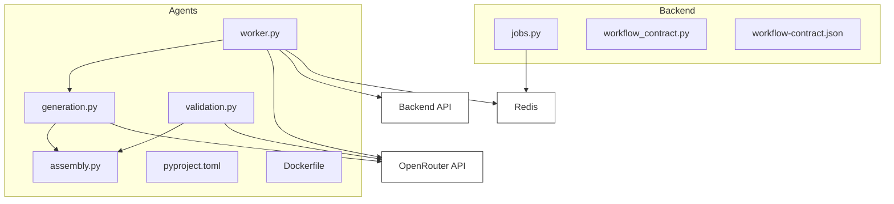

**Diagram sources**
- [worker.py:1-1236](file://agents/worker.py#L1-L1236)
- [generation.py:1-351](file://agents/generation.py#L1-L351)
- [validation.py:1-292](file://agents/validation.py#L1-L292)
- [assembly.py:1-63](file://agents/assembly.py#L1-L63)
- [pyproject.toml:1-26](file://agents/pyproject.toml#L1-L26)
- [Dockerfile:1-14](file://agents/Dockerfile#L1-L14)
- [docker-compose.yml:54-83](file://docker-compose.yml#L54-L83)
- [jobs.py:1-85](file://backend/app/services/jobs.py#L1-L85)
- [workflow_contract.py:1-40](file://backend/app/core/workflow_contract.py#L1-L40)
- [workflow-contract.json:1-112](file://shared/workflow-contract.json#L1-L112)

**Section sources**
- [pyproject.toml:1-26](file://agents/pyproject.toml#L1-L26)
- [Dockerfile:1-14](file://agents/Dockerfile#L1-L14)
- [docker-compose.yml:54-83](file://docker-compose.yml#L54-L83)

## Core Components
- WorkerSettingsEnv: Centralized configuration loader for Redis, backend API, secrets, OpenRouter, and model names
- RedisProgressWriter: Asynchronous Redis-backed progress persistence keyed by application_id
- BackendCallbackClient: Async HTTP client to notify backend of job events and outcomes
- OpenRouterExtractionAgent: Structured extraction using LangChain with primary/fallback model fallback
- Playwright scraping: Chromium-based page capture with metadata and JSON-LD extraction
- Generation pipeline: Section-by-section generation with structured outputs and progress callbacks
- Validation pipeline: Hallucination detection, completeness, ordering, and ATS-safety checks
- Assembly: Final Markdown resume composition from personal info and ordered sections
- Job queues: Backend enqueues ARQ jobs for extraction and generation

**Section sources**
- [worker.py:54-71](file://agents/worker.py#L54-L71)
- [worker.py:272-288](file://agents/worker.py#L272-L288)
- [worker.py:290-305](file://agents/worker.py#L290-L305)
- [worker.py:307-370](file://agents/worker.py#L307-L370)
- [worker.py:372-424](file://agents/worker.py#L372-L424)
- [generation.py:159-224](file://agents/generation.py#L159-L224)
- [validation.py:231-291](file://agents/validation.py#L231-L291)
- [assembly.py:12-62](file://agents/assembly.py#L12-L62)
- [jobs.py:12-43](file://backend/app/services/jobs.py#L12-L43)
- [jobs.py:45-85](file://backend/app/services/jobs.py#L45-L85)

## Architecture Overview
The agents subsystem runs as an ARQ worker container. Jobs are enqueued by the backend into Redis and processed asynchronously. Agents report progress to Redis and notify the backend via authenticated callbacks. LLM interactions leverage OpenRouter through LangChain with structured outputs. Web scraping is performed via Playwright.

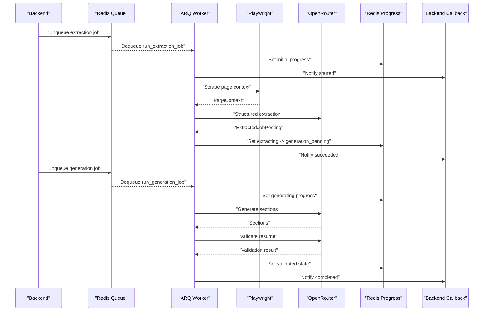

**Diagram sources**
- [jobs.py:16-42](file://backend/app/services/jobs.py#L16-L42)
- [jobs.py:49-84](file://backend/app/services/jobs.py#L49-L84)
- [worker.py:526-667](file://agents/worker.py#L526-L667)
- [worker.py:682-806](file://agents/worker.py#L682-L806)
- [worker.py:272-288](file://agents/worker.py#L272-L288)
- [worker.py:290-305](file://agents/worker.py#L290-L305)
- [worker.py:307-370](file://agents/worker.py#L307-L370)
- [generation.py:159-224](file://agents/generation.py#L159-L224)
- [validation.py:231-291](file://agents/validation.py#L231-L291)

## Detailed Component Analysis

### Configuration Management via WorkerSettingsEnv
- Loads environment variables for Redis URL, backend API URL, worker callback secret, shared contract path, OpenRouter keys and base URL, and model names for extraction, generation, and validation agents
- Validates presence of required keys before invoking LLMs or callbacks

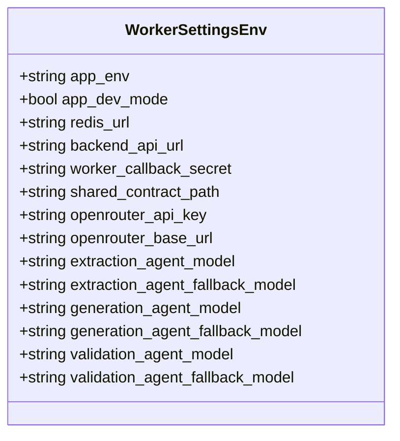

**Diagram sources**
- [worker.py:54-71](file://agents/worker.py#L54-L71)

**Section sources**
- [worker.py:54-71](file://agents/worker.py#L54-L71)
- [docker-compose.yml:58-71](file://docker-compose.yml#L58-L71)

### Task Queue Management Through Redis and ARQ
- Backend enqueues jobs into Redis using ARQ connection settings
- Extraction job enqueues run_extraction_job with application_id, user_id, job_url, optional source_capture, and job_id
- Generation job enqueues run_generation_job with application-specific parameters

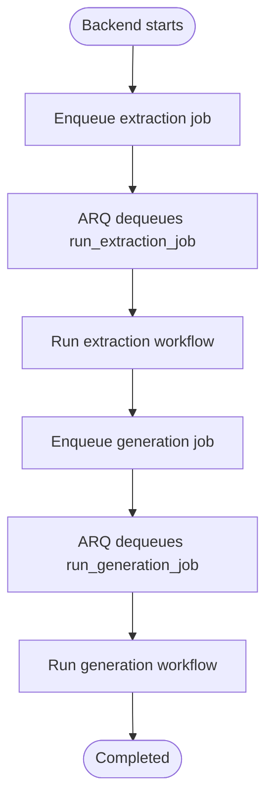

**Diagram sources**
- [jobs.py:16-42](file://backend/app/services/jobs.py#L16-L42)
- [jobs.py:49-84](file://backend/app/services/jobs.py#L49-L84)
- [worker.py:526-667](file://agents/worker.py#L526-L667)
- [worker.py:682-806](file://agents/worker.py#L682-L806)

**Section sources**
- [jobs.py:12-43](file://backend/app/services/jobs.py#L12-L43)
- [jobs.py:45-85](file://backend/app/services/jobs.py#L45-L85)

### Asynchronous Processing Workflows

#### Extraction Workflow
- Initializes progress, notifies backend “started”
- Scrapes page via Playwright or loads SourceCapture
- Detects blocked sources and reports failures
- Runs structured extraction via OpenRouterExtractionAgent
- Validates final extraction and transitions to generation_pending
- Notifies backend “succeeded”

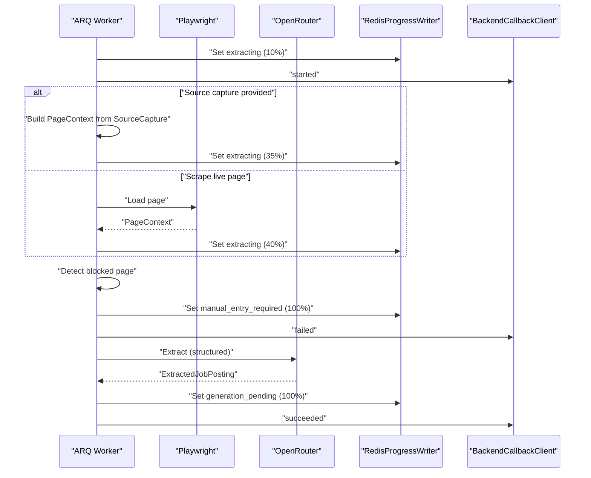

**Diagram sources**
- [worker.py:526-667](file://agents/worker.py#L526-L667)
- [worker.py:372-424](file://agents/worker.py#L372-L424)
- [worker.py:307-370](file://agents/worker.py#L307-L370)
- [worker.py:448-473](file://agents/worker.py#L448-L473)
- [worker.py:475-510](file://agents/worker.py#L475-L510)

**Section sources**
- [worker.py:526-667](file://agents/worker.py#L526-L667)

#### Generation Workflow
- Validates model configuration and initializes progress
- Generates sections sequentially with progress updates
- Validates resume for hallucinations, completeness, ordering, and ATS-safety
- Reports completion to backend

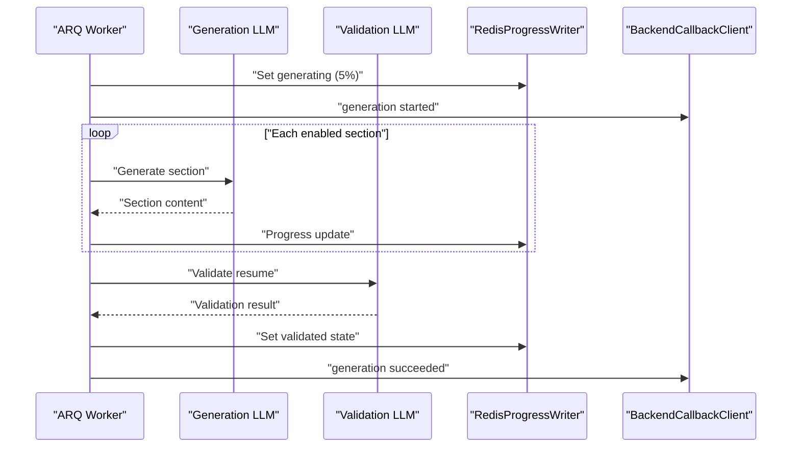

**Diagram sources**
- [worker.py:682-806](file://agents/worker.py#L682-L806)
- [generation.py:159-224](file://agents/generation.py#L159-L224)
- [validation.py:231-291](file://agents/validation.py#L231-L291)

**Section sources**
- [worker.py:682-806](file://agents/worker.py#L682-L806)
- [generation.py:159-224](file://agents/generation.py#L159-L224)
- [validation.py:231-291](file://agents/validation.py#L231-L291)

### Progress Tracking Mechanisms
- RedisProgressWriter stores JobProgress keyed by application_id with TTL
- set_progress builds JobProgress with timestamps and percent_complete, then persists
- report_failure sets terminal state and posts failure details to backend

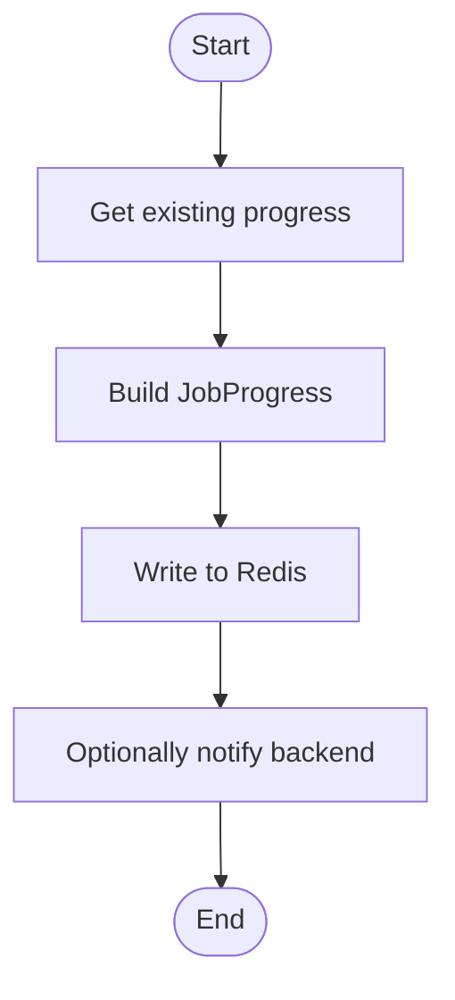

**Diagram sources**
- [worker.py:448-473](file://agents/worker.py#L448-L473)
- [worker.py:272-288](file://agents/worker.py#L272-L288)

**Section sources**
- [worker.py:272-288](file://agents/worker.py#L272-L288)
- [worker.py:448-473](file://agents/worker.py#L448-L473)
- [worker.py:475-510](file://agents/worker.py#L475-L510)

### Callback Mechanisms to Backend API
- BackendCallbackClient posts events to backend with X-Worker-Secret header
- Paths include extraction-callback and generation-callback
- Used to signal started, succeeded, and failed events

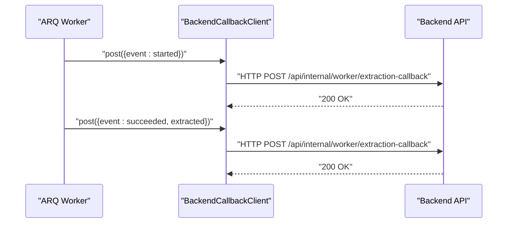

**Diagram sources**
- [worker.py:290-305](file://agents/worker.py#L290-L305)
- [worker.py:548-555](file://agents/worker.py#L548-L555)
- [worker.py:635-643](file://agents/worker.py#L635-L643)

**Section sources**
- [worker.py:290-305](file://agents/worker.py#L290-L305)
- [worker.py:548-555](file://agents/worker.py#L548-L555)
- [worker.py:635-643](file://agents/worker.py#L635-L643)

### Integration with LangChain and OpenRouter
- Structured outputs via ChatOpenAI.with_structured_output
- Extraction agent validates presence of required keys and models
- Generation and validation agents use fallback models for resilience

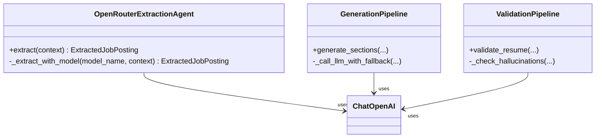

**Diagram sources**
- [worker.py:307-370](file://agents/worker.py#L307-L370)
- [generation.py:117-151](file://agents/generation.py#L117-L151)
- [validation.py:48-115](file://agents/validation.py#L48-L115)

**Section sources**
- [worker.py:307-370](file://agents/worker.py#L307-L370)
- [generation.py:117-151](file://agents/generation.py#L117-L151)
- [validation.py:48-115](file://agents/validation.py#L48-L115)

### Playwright-Based Web Scraping
- Launches headless Chromium, navigates to job URL, waits for DOM/network idle
- Captures page title, final URL, visible text, meta tags, and JSON-LD
- Builds PageContext for downstream extraction and normalization

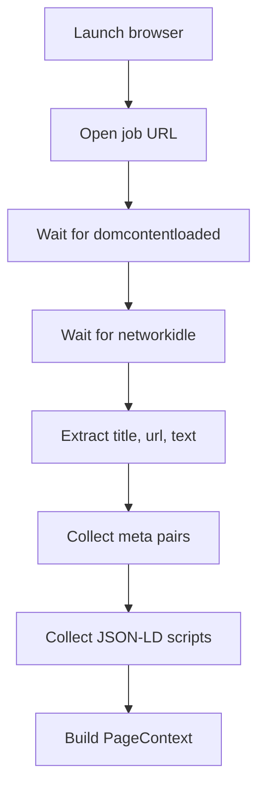

**Diagram sources**
- [worker.py:372-410](file://agents/worker.py#L372-L410)

**Section sources**
- [worker.py:372-410](file://agents/worker.py#L372-L410)

### Workflow Contract Integration and State Machine Participation
- Agents load the shared workflow contract to align internal states and workflow kinds
- Backend maps internal states to visible statuses via mapping rules
- Agents set internal states and notify backend; backend translates to UI-visible statuses

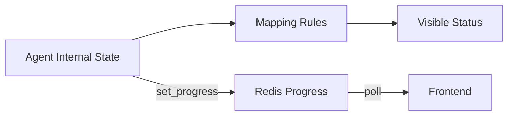

**Diagram sources**
- [worker.py:240-246](file://agents/worker.py#L240-L246)
- [workflow_contract.py:32-39](file://backend/app/core/workflow_contract.py#L32-L39)
- [workflow-contract.json:9-87](file://shared/workflow-contract.json#L9-L87)

**Section sources**
- [workflow-contract.json:1-112](file://shared/workflow-contract.json#L1-L112)
- [workflow_contract.py:22-39](file://backend/app/core/workflow_contract.py#L22-L39)
- [worker.py:512-523](file://agents/worker.py#L512-L523)

### Agent Lifecycle: From Initialization to Completion
- Container starts ARQ worker with WorkerSettings
- WorkerSettingsEnv loads environment variables
- Jobs run extraction or generation workflows
- Progress is persisted and callbacks are sent
- Terminal states are reported with optional failure details

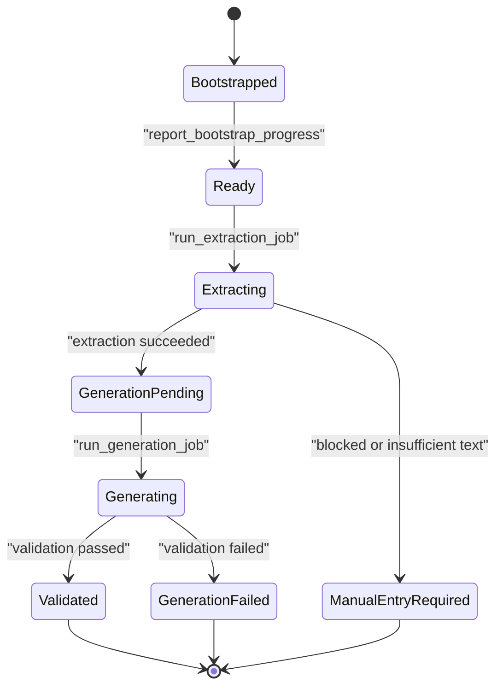

**Diagram sources**
- [worker.py:512-523](file://agents/worker.py#L512-L523)
- [worker.py:526-667](file://agents/worker.py#L526-L667)
- [worker.py:682-806](file://agents/worker.py#L682-L806)
- [workflow-contract.json:9-19](file://shared/workflow-contract.json#L9-L19)

**Section sources**
- [Dockerfile:13-13](file://agents/Dockerfile#L13-L13)
- [worker.py:512-523](file://agents/worker.py#L512-L523)
- [worker.py:526-667](file://agents/worker.py#L526-L667)
- [worker.py:682-806](file://agents/worker.py#L682-L806)

## Dependency Analysis
- Runtime dependencies include ARQ, httpx, langchain-openai, playwright, pydantic-settings
- Container installs Playwright Chromium dependencies and runs ARQ worker with WorkerSettings
- Backend enqueues jobs into Redis; agents consume and publish progress and callbacks

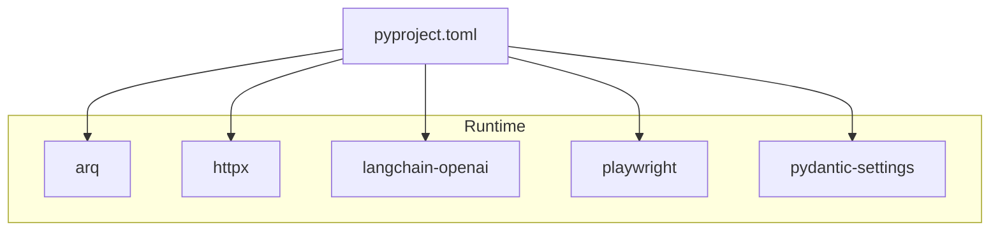

**Diagram sources**
- [pyproject.toml:10-16](file://agents/pyproject.toml#L10-L16)

**Section sources**
- [pyproject.toml:1-26](file://agents/pyproject.toml#L1-L26)
- [Dockerfile:10-11](file://agents/Dockerfile#L10-L11)
- [docker-compose.yml:58-71](file://docker-compose.yml#L58-L71)

## Performance Considerations
- Use fallback models for LLM calls to reduce single-point-of-failure risk
- Apply timeouts for LLM invocations and Playwright operations
- Persist progress periodically to avoid losing state during long-running jobs
- Keep page scraping minimal by limiting text and meta extraction sizes
- Monitor Redis TTL and cleanup strategies for progress keys

## Troubleshooting Guide
Common issues and strategies:
- Missing configuration: Ensure WorkerSettingsEnv variables are set; extraction and generation require API keys and model names
- Blocked pages: detect_blocked_page returns failure details; agents transition to manual_entry_required
- Insufficient source text: If captured text is too short, fail early with extraction_failed
- LLM timeouts: Generation and validation enforce timeouts; adjust settings if needed
- Backend callback failures: Verify WORKER_CALLBACK_SECRET and backend connectivity

**Section sources**
- [worker.py:312-318](file://agents/worker.py#L312-L318)
- [worker.py:580-604](file://agents/worker.py#L580-L604)
- [worker.py:645-666](file://agents/worker.py#L645-L666)
- [worker.py:295-296](file://agents/worker.py#L295-L296)

## Conclusion
The ARQ-based agent architecture provides a robust, asynchronous pipeline for job posting extraction and resume generation. It leverages Redis for reliable task queuing, LangChain with OpenRouter for structured LLM outputs, Playwright for resilient scraping, and a shared workflow contract to integrate with the backend’s state machine. Progress tracking and callback mechanisms keep the UI informed, while fallback strategies and validation improve reliability and quality.

## Appendices

### Example Agent Configuration
- Environment variables for agents are defined in docker-compose and consumed by WorkerSettingsEnv
- Required keys include Redis URL, backend API URL, worker callback secret, OpenRouter API key and base URL, and model names for extraction, generation, and validation

**Section sources**
- [docker-compose.yml:58-71](file://docker-compose.yml#L58-L71)
- [worker.py:54-71](file://agents/worker.py#L54-L71)

### Task Scheduling Patterns
- Backend enqueues jobs with unique job_id and passes application/user identifiers
- ARQ worker processes jobs asynchronously; agents set periodic progress updates

**Section sources**
- [jobs.py:16-42](file://backend/app/services/jobs.py#L16-L42)
- [jobs.py:49-84](file://backend/app/services/jobs.py#L49-L84)
- [worker.py:526-667](file://agents/worker.py#L526-L667)

### Monitoring Approaches
- Poll Redis progress keys for application_id to observe state and percent_complete
- Observe backend-visible status via mapping rules derived from internal states
- Log and alert on terminal_error_code values

**Section sources**
- [worker.py:272-288](file://agents/worker.py#L272-L288)
- [workflow-contract.json:89-110](file://shared/workflow-contract.json#L89-L110)

### Error Handling Strategies
- Primary/fallback model selection for LLM calls
- Early exit on blocked pages or insufficient text
- Terminal state reporting with failure details and error codes
- Validation-driven feedback loops to improve outputs

**Section sources**
- [worker.py:320-328](file://agents/worker.py#L320-L328)
- [worker.py:580-604](file://agents/worker.py#L580-L604)
- [worker.py:475-510](file://agents/worker.py#L475-L510)
- [validation.py:231-291](file://agents/validation.py#L231-L291)