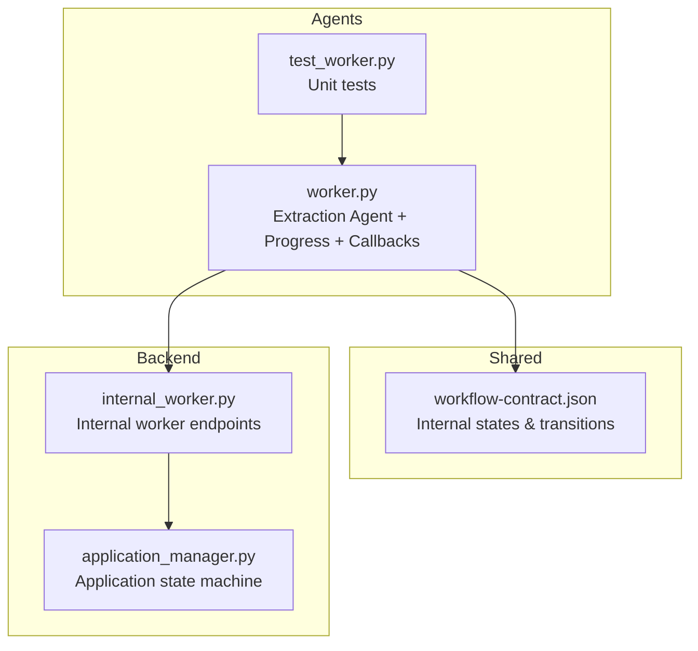
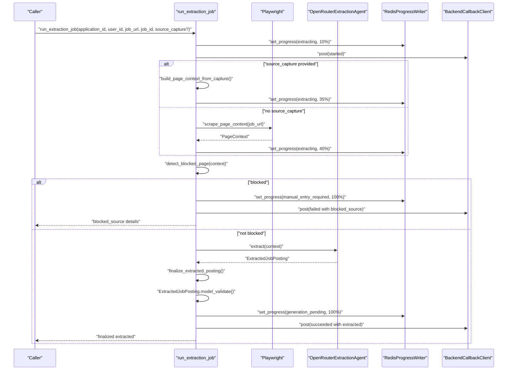
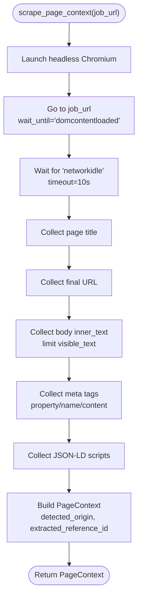
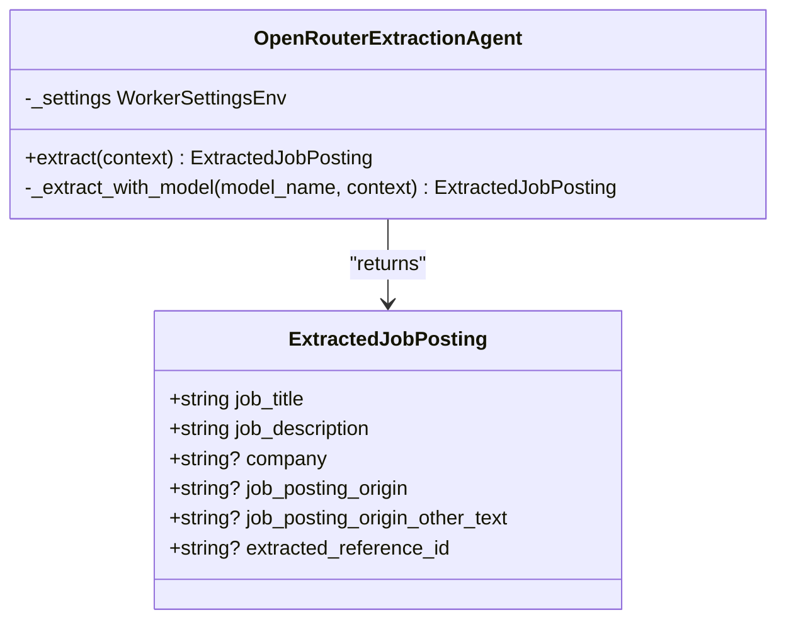
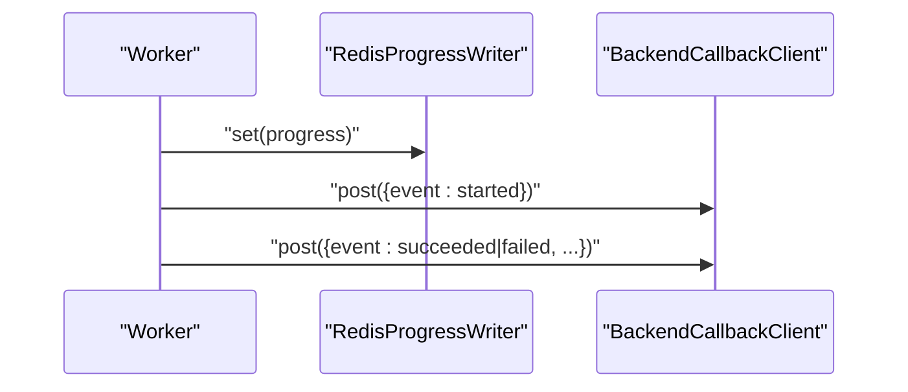
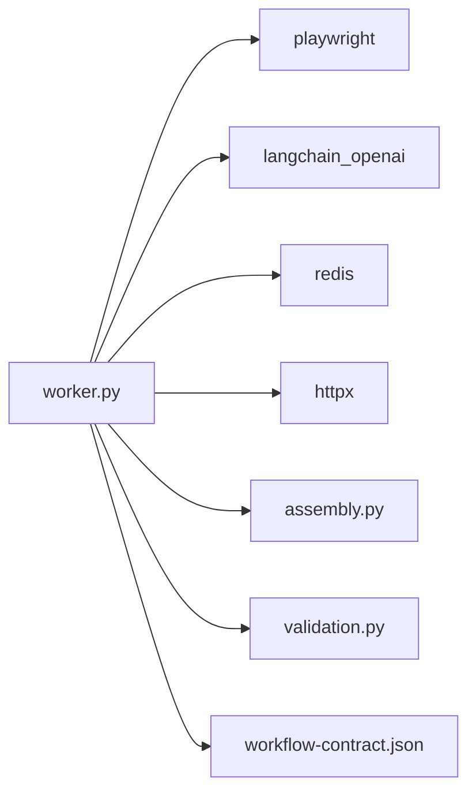

# Extraction Agent

<cite>
**Referenced Files in This Document**
- [worker.py](file://agents/worker.py)
- [test_worker.py](file://agents/tests/test_worker.py)
- [workflow-contract.json](file://shared/workflow-contract.json)
- [internal_worker.py](file://backend/app/api/internal_worker.py)
- [application_manager.py](file://backend/app/services/application_manager.py)
- [AGENTS.md](file://agents/AGENTS.md)
</cite>

## Table of Contents
1. [Introduction](#introduction)
2. [Project Structure](#project-structure)
3. [Core Components](#core-components)
4. [Architecture Overview](#architecture-overview)
5. [Detailed Component Analysis](#detailed-component-analysis)
6. [Dependency Analysis](#dependency-analysis)
7. [Performance Considerations](#performance-considerations)
8. [Troubleshooting Guide](#troubleshooting-guide)
9. [Conclusion](#conclusion)
10. [Appendices](#appendices)

## Introduction
This document describes the Extraction Agent responsible for automatically extracting job postings from URLs. It covers the web scraping pipeline using Playwright, page context capture, metadata extraction, content normalization, job board parsing for multiple platforms, blocked URL detection, reference ID extraction, origin normalization, structured extraction via OpenRouter LLMs with schema validation, and integration with the progress tracking system. It also documents error handling, timeouts, and fallback/retry strategies.

## Project Structure
The extraction agent lives in the agents module and coordinates with the backend via internal callbacks. The shared workflow contract defines the internal states and transitions used by the progress tracking system.

**Diagram sources**
- [worker.py:1-1236](file://agents/worker.py#L1-L1236)
- [workflow-contract.json:1-112](file://shared/workflow-contract.json#L1-L112)
- [internal_worker.py:1-71](file://backend/app/api/internal_worker.py#L1-L71)
- [application_manager.py:477-511](file://backend/app/services/application_manager.py#L477-L511)

**Section sources**
- [worker.py:1-1236](file://agents/worker.py#L1-L1236)
- [workflow-contract.json:1-112](file://shared/workflow-contract.json#L1-L112)
- [internal_worker.py:1-71](file://backend/app/api/internal_worker.py#L1-L71)
- [application_manager.py:477-511](file://backend/app/services/application_manager.py#L477-L511)

## Core Components
- Web scraping and page context capture using Playwright
- Metadata extraction (title, meta tags, JSON-LD, visible text)
- Content normalization and origin detection
- Reference ID extraction from URLs and content
- Blocked URL detection and reporting
- Structured extraction using OpenRouter LLMs with ExtractedJobPosting schema validation
- Progress tracking via Redis and backend callbacks
- Fallback and retry strategies for extraction failures

**Section sources**
- [worker.py:372-424](file://agents/worker.py#L372-L424)
- [worker.py:162-174](file://agents/worker.py#L162-L174)
- [worker.py:177-196](file://agents/worker.py#L177-L196)
- [worker.py:199-237](file://agents/worker.py#L199-L237)
- [worker.py:307-370](file://agents/worker.py#L307-L370)
- [worker.py:448-472](file://agents/worker.py#L448-L472)
- [worker.py:475-509](file://agents/worker.py#L475-L509)

## Architecture Overview
The extraction agent orchestrates a deterministic pipeline:
- Initialize settings and clients
- Capture page context (Playwright) or accept a pre-captured source
- Detect blocked sources
- Run structured extraction via OpenRouter LLM
- Finalize and validate the extracted job posting
- Report progress and completion/failure to backend

**Diagram sources**
- [worker.py:526-666](file://agents/worker.py#L526-L666)
- [worker.py:372-409](file://agents/worker.py#L372-L409)
- [worker.py:307-370](file://agents/worker.py#L307-L370)
- [worker.py:448-472](file://agents/worker.py#L448-L472)
- [worker.py:475-509](file://agents/worker.py#L475-L509)

## Detailed Component Analysis

### Web Scraping and Page Context Capture
- Uses Playwright to launch a Chromium browser, navigate to the job URL, wait for DOM and network idle, and collect:
  - Page title
  - Final URL
  - Visible text from the body element
  - Meta tags (property/name and content)
  - JSON-LD script blocks
- Limits collected metadata to reasonable sizes to keep prompts manageable.
- Builds a PageContext object with detected origin and extracted reference ID.

**Diagram sources**
- [worker.py:372-409](file://agents/worker.py#L372-L409)

**Section sources**
- [worker.py:372-409](file://agents/worker.py#L372-L409)

### Metadata Extraction and Content Normalization
- Normalizes origin from final URL using a predefined mapping for LinkedIn, Indeed, Google Jobs, Glassdoor, ZipRecruiter, Monster, Dice, and treats other domains as company_website.
- Extracts reference IDs from:
  - Query parameters (jobid, job_id, currentjobid, gh_jid, jk, reqid, requisitionid)
  - Patterns in URL path (job IDs and job views)
- Truncates visible text and meta to constrain prompt size.

**Section sources**
- [worker.py:162-174](file://agents/worker.py#L162-L174)
- [worker.py:177-196](file://agents/worker.py#L177-L196)
- [worker.py:398-409](file://agents/worker.py#L398-L409)

### Blocked URL Detection System
- Combines page title, final URL, meta keys/values, and a snippet of visible text.
- Detects providers by markers:
  - Indeed: support.indeed.com or “you have been blocked”
  - Cloudflare: “cloudflare”, “ray id”, “cf-chl”
- Extracts a provider-specific reference ID (e.g., Ray ID) when present.
- Returns an ExtractionFailureDetails object with kind, provider, reference_id, blocked_url, and detected_at.

**Section sources**
- [worker.py:199-237](file://agents/worker.py#L199-L237)

### Structured Extraction Using OpenRouter LLMs
- Uses a dedicated extraction agent class that:
  - Requires OPENROUTER_API_KEY, EXTRACTION_AGENT_MODEL, and EXTRACTION_AGENT_FALLBACK_MODEL
  - Iterates through primary and fallback models, raising a runtime error if both fail
- The prompt instructs extraction of:
  - job_title and job_description (required)
  - company (optional)
  - job_posting_origin (normalized)
  - job_posting_origin_other_text (only when origin is other)
  - extracted_reference_id (optional)
- The agent’s system prompt enforces normalized origins and disallows invented facts.

**Diagram sources**
- [worker.py:307-370](file://agents/worker.py#L307-L370)
- [worker.py:121-156](file://agents/worker.py#L121-L156)

**Section sources**
- [worker.py:307-370](file://agents/worker.py#L307-L370)
- [worker.py:121-156](file://agents/worker.py#L121-L156)

### Origin Normalization and Reference ID Finalization
- finalize_extracted_posting merges:
  - Extracted origin and reference ID with detected values from PageContext
  - Enforces that job_posting_origin_other_text is cleared unless origin is other
  - Ensures extracted_reference_id falls back to context when not provided

**Section sources**
- [worker.py:427-445](file://agents/worker.py#L427-L445)

### Progress Tracking and Backend Callbacks
- Progress is written to Redis under a key derived from application_id.
- The worker posts lifecycle events to backend endpoints:
  - Extraction callback: started, succeeded, failed
  - Generation and regeneration callbacks: started, succeeded, failed
- The backend service updates application state and triggers downstream flows.

**Diagram sources**
- [worker.py:448-472](file://agents/worker.py#L448-L472)
- [worker.py:475-509](file://agents/worker.py#L475-L509)
- [internal_worker.py:19-34](file://backend/app/api/internal_worker.py#L19-L34)

**Section sources**
- [worker.py:448-472](file://agents/worker.py#L448-L472)
- [worker.py:475-509](file://agents/worker.py#L475-L509)
- [internal_worker.py:19-34](file://backend/app/api/internal_worker.py#L19-L34)

### Schema Validation and Error Handling
- After extraction, the worker validates the final ExtractedJobPosting using Pydantic model validation.
- Timeouts:
  - Playwright navigation waits up to 30s to load and 10s for network idle
  - Extraction agent calls are wrapped with a timeout and fallback model retry
- Failure modes:
  - blocked_source: reports manual entry required with failure details
  - extraction_failed: reports manual entry required with generic failure
  - TimeoutError: reports manual entry required with timeout message

**Section sources**
- [worker.py:614-624](file://agents/worker.py#L614-L624)
- [worker.py:645-666](file://agents/worker.py#L645-L666)

### Fallback Mechanisms and Retry Strategies
- Extraction agent retries once using a fallback model if the primary fails.
- The worker sets a terminal error code and posts failure details to the backend for recovery and manual entry.

**Section sources**
- [worker.py:319-328](file://agents/worker.py#L319-L328)
- [worker.py:475-509](file://agents/worker.py#L475-L509)

### Examples of Extraction Workflows
- Successful extraction:
  - Scrape page context or use source_capture
  - Detect blocked sources (if any)
  - Run structured extraction with OpenRouter
  - Validate schema and finalize
  - Report success to backend and update progress to generation_pending
- Blocked source:
  - Detect blocked page and report failure with blocked_source
  - Transition to manual_entry_required
- Insufficient source text:
  - If source_capture is provided and visible_text is too short, report extraction_failed

**Section sources**
- [worker.py:526-666](file://agents/worker.py#L526-L666)
- [test_worker.py:83-96](file://agents/tests/test_worker.py#L83-L96)

## Dependency Analysis
- External libraries:
  - Playwright for browser automation
  - LangChain OpenAI for structured LLM calls
  - Redis client for progress persistence
  - HTTPX for backend callbacks
- Internal dependencies:
  - Assembly and validation modules for downstream generation
  - Shared workflow contract for state machine semantics

**Diagram sources**
- [worker.py:1-24](file://agents/worker.py#L1-L24)
- [workflow-contract.json:1-112](file://shared/workflow-contract.json#L1-L112)

**Section sources**
- [worker.py:1-24](file://agents/worker.py#L1-L24)
- [workflow-contract.json:1-112](file://shared/workflow-contract.json#L1-L112)

## Performance Considerations
- Prompt size limits:
  - Visible text and meta are truncated to constrain LLM context.
- Browser timeouts:
  - Navigation and idle waits are bounded to prevent long hangs.
- Model retries:
  - Extraction agent attempts a fallback model once to improve reliability.
- Progress granularity:
  - Percent-complete increments are used to provide user feedback during long-running steps.

[No sources needed since this section provides general guidance]

## Troubleshooting Guide
Common issues and resolutions:
- Extraction timed out:
  - Indicates slow network or blocked page. The worker reports manual entry required.
- Blocked source detected:
  - The worker extracts provider and reference ID (e.g., Ray ID) and transitions to manual entry.
- Insufficient source text:
  - When using source_capture, if visible text is too short, the worker requests manual entry.
- Validation failed:
  - The extracted fields must pass Pydantic validation; ensure required fields job_title and job_description are present.
- Missing configuration:
  - OPENROUTER_API_KEY, EXTRACTION_AGENT_MODEL, EXTRACTION_AGENT_FALLBACK_MODEL must be set.

**Section sources**
- [worker.py:645-666](file://agents/worker.py#L645-L666)
- [worker.py:199-237](file://agents/worker.py#L199-L237)
- [worker.py:614-624](file://agents/worker.py#L614-L624)
- [worker.py:312-318](file://agents/worker.py#L312-L318)

## Conclusion
The Extraction Agent provides a robust, deterministic pipeline for extracting job postings from URLs. It combines reliable browser automation, careful metadata capture, structured LLM extraction with schema validation, and resilient progress tracking. The system gracefully handles blocked sources, timeouts, and insufficient content by transitioning to manual entry and preserving diagnostic context for recovery.

[No sources needed since this section summarizes without analyzing specific files]

## Appendices

### Integration with Backend and Workflow States
- The worker posts lifecycle events to backend endpoints with a shared secret.
- The backend service updates application records and transitions internal states according to the shared workflow contract.

**Section sources**
- [internal_worker.py:19-34](file://backend/app/api/internal_worker.py#L19-L34)
- [application_manager.py:477-511](file://backend/app/services/application_manager.py#L477-L511)
- [workflow-contract.json:9-26](file://shared/workflow-contract.json#L9-L26)

### Example Test Coverage
- Tests cover origin normalization, reference ID extraction, blocked page detection, page context construction from capture, and fallback model behavior.

**Section sources**
- [test_worker.py:37-96](file://agents/tests/test_worker.py#L37-L96)
- [test_worker.py:121-127](file://agents/tests/test_worker.py#L121-L127)