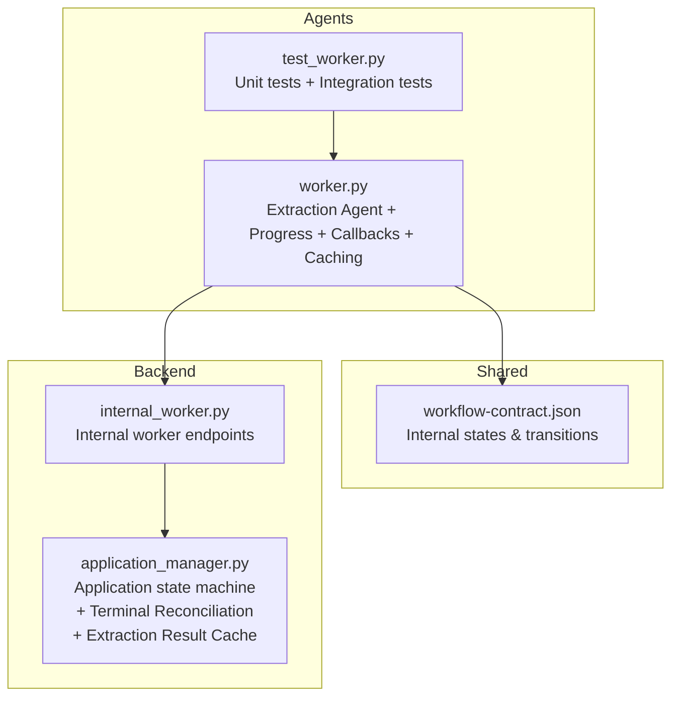
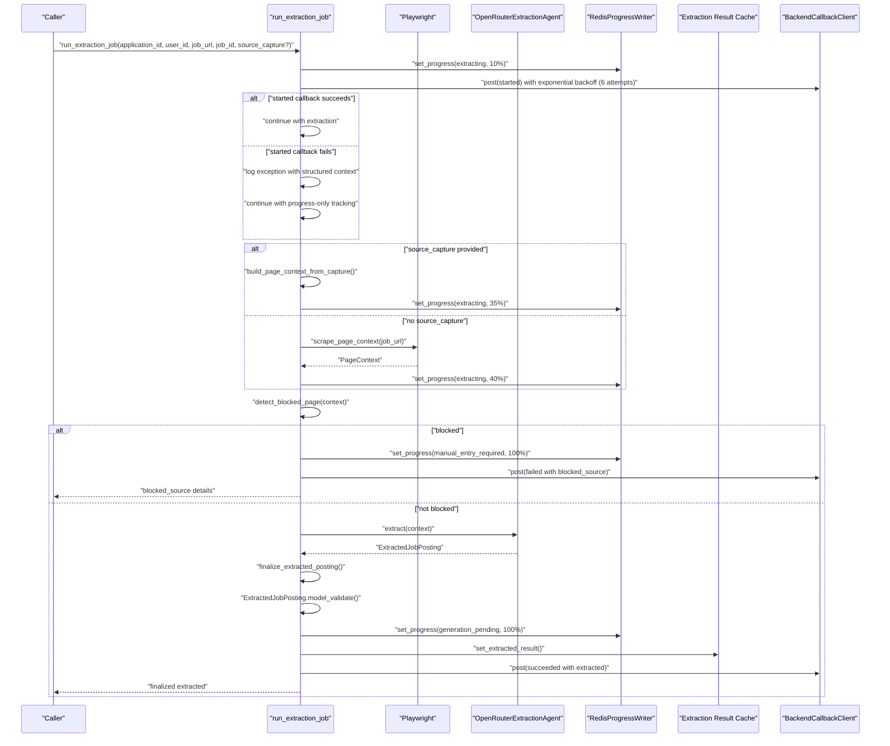
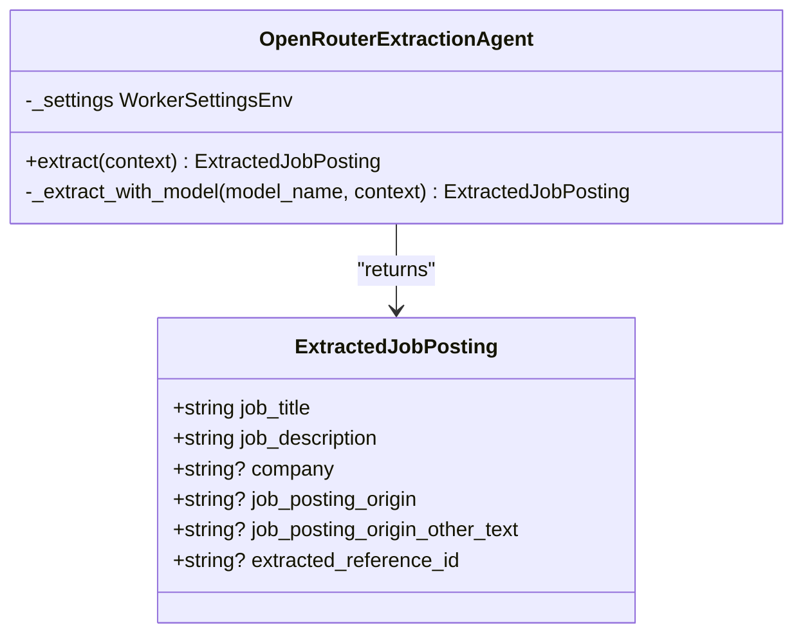
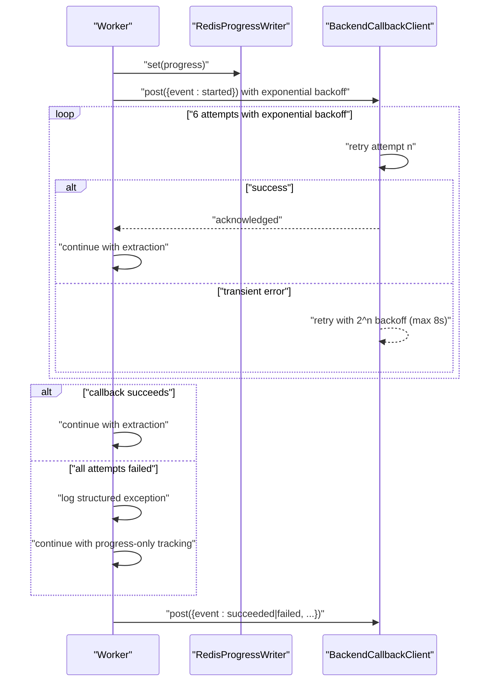
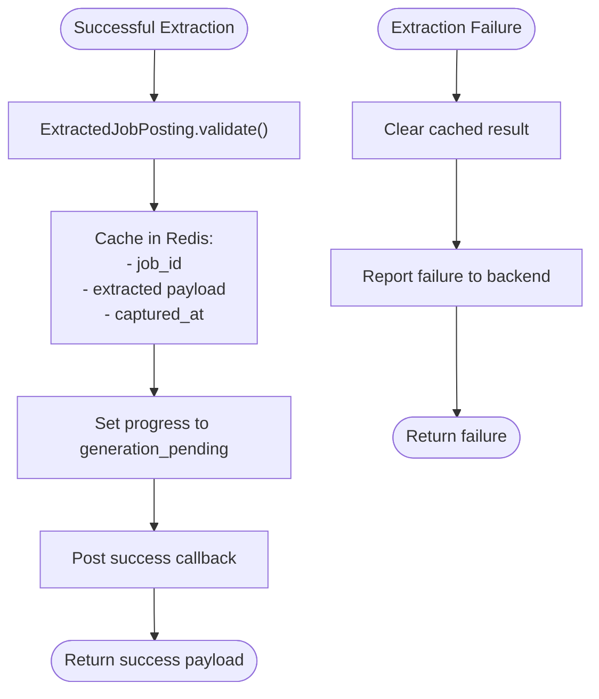
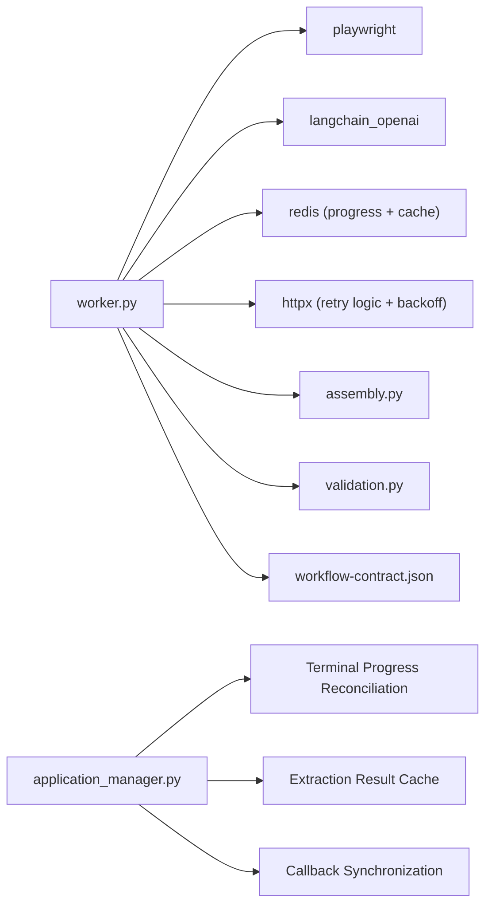

# Extraction Agent

<cite>
**Referenced Files in This Document**
- [worker.py](file://agents/worker.py)
- [test_worker.py](file://agents/tests/test_worker.py)
- [workflow-contract.json](file://shared/workflow-contract.json)
- [internal_worker.py](file://backend/app/api/internal_worker.py)
- [application_manager.py](file://backend/app/services/application_manager.py)
- [AGENTS.md](file://agents/AGENTS.md)
</cite>

## Update Summary
**Changes Made**
- Enhanced callback resilience with increased retry attempts (3 to 6) and exponential backoff with maximum limits
- Improved timeout handling reduced from 10 seconds to 8 seconds for callback requests
- Added comprehensive extraction result caching capabilities with Redis storage
- Enhanced terminal progress reconciliation system for callback synchronization failures
- Updated progress tracking to continue even when callback delivery fails
- Improved error handling for transient network failures with structured logging

## Table of Contents
1. [Introduction](#introduction)
2. [Project Structure](#project-structure)
3. [Core Components](#core-components)
4. [Architecture Overview](#architecture-overview)
5. [Detailed Component Analysis](#detailed-component-analysis)
6. [Dependency Analysis](#dependency-analysis)
7. [Performance Considerations](#performance-considerations)
8. [Troubleshooting Guide](#troubleshooting-guide)
9. [Conclusion](#conclusion)
10. [Appendices](#appendices)

## Introduction
This document describes the Extraction Agent responsible for automatically extracting job postings from URLs. It covers the web scraping pipeline using Playwright, page context capture, metadata extraction, content normalization, job board parsing for multiple platforms, blocked URL detection, reference ID extraction, origin normalization, structured extraction via OpenRouter LLMs with schema validation, and integration with the progress tracking system. It also documents enhanced error handling for transient network failures, callback resilience mechanisms, extraction result caching, and comprehensive logging for debugging purposes.

## Project Structure
The extraction agent lives in the agents module and coordinates with the backend via internal callbacks. The shared workflow contract defines the internal states and transitions used by the progress tracking system. The backend provides terminal progress reconciliation for callback synchronization failures.

**Diagram sources**
- [worker.py:1-1490](file://agents/worker.py#L1-L1490)
- [workflow-contract.json:1-112](file://shared/workflow-contract.json#L1-L112)
- [internal_worker.py:1-71](file://backend/app/api/internal_worker.py#L1-L71)
- [application_manager.py:724-923](file://backend/app/services/application_manager.py#L724-L923)

**Section sources**
- [worker.py:1-1490](file://agents/worker.py#L1-L1490)
- [workflow-contract.json:1-112](file://shared/workflow-contract.json#L1-L112)
- [internal_worker.py:1-71](file://backend/app/api/internal_worker.py#L1-L71)
- [application_manager.py:724-923](file://backend/app/services/application_manager.py#L724-L923)

## Core Components
- Web scraping and page context capture using Playwright
- Metadata extraction (title, meta tags, JSON-LD, visible text)
- Content normalization and origin detection
- Reference ID extraction from URLs and content
- Blocked URL detection and reporting
- Structured extraction using OpenRouter LLMs with ExtractedJobPosting schema validation
- **Enhanced progress tracking via Redis with comprehensive callback resilience**
- **Extraction result caching with Redis storage for terminal progress reconciliation**
- **Improved error handling for transient network failures with exponential backoff**
- **Terminal progress reconciliation system for callback synchronization failures**
- Fallback and retry strategies for extraction failures

**Section sources**
- [worker.py:372-424](file://agents/worker.py#L372-L424)
- [worker.py:162-174](file://agents/worker.py#L162-L174)
- [worker.py:177-196](file://agents/worker.py#L177-L196)
- [worker.py:199-237](file://agents/worker.py#L199-L237)
- [worker.py:307-370](file://agents/worker.py#L307-L370)
- [worker.py:448-472](file://agents/worker.py#L448-L472)
- [worker.py:475-509](file://agents/worker.py#L475-L509)
- [worker.py:384-404](file://agents/worker.py#L384-L404)

## Architecture Overview
The extraction agent orchestrates a deterministic pipeline with enhanced callback resilience and comprehensive caching:
- Initialize settings and clients
- Capture page context (Playwright) or accept a pre-captured source
- Detect blocked sources
- **Enhanced callback delivery with exponential backoff (6 attempts, max 8s)**
- Run structured extraction via OpenRouter LLM
- Cache extraction results in Redis for terminal progress reconciliation
- Finalize and validate the extracted job posting
- Continue progress tracking even if callback delivery fails
- Report completion/failure to backend with enhanced error context

**Diagram sources**
- [worker.py:714-881](file://agents/worker.py#L714-L881)
- [worker.py:372-409](file://agents/worker.py#L372-L409)
- [worker.py:307-370](file://agents/worker.py#L307-L370)
- [worker.py:448-472](file://agents/worker.py#L448-L472)
- [worker.py:475-509](file://agents/worker.py#L475-L509)

## Detailed Component Analysis

### Web Scraping and Page Context Capture
- Uses Playwright to launch a Chromium browser, navigate to the job URL, wait for DOM and network idle, and collect:
  - Page title
  - Final URL
  - Visible text from the body element
  - Meta tags (property/name and content)
  - JSON-LD script blocks
- Limits collected metadata to reasonable sizes to keep prompts manageable.
- Builds a PageContext object with detected origin and extracted reference ID.

**Diagram sources**
- [worker.py:519-556](file://agents/worker.py#L519-L556)

**Section sources**
- [worker.py:519-556](file://agents/worker.py#L519-L556)

### Metadata Extraction and Content Normalization
- Normalizes origin from final URL using a predefined mapping for LinkedIn, Indeed, Google Jobs, Glassdoor, ZipRecruiter, Monster, Dice, and treats other domains as company_website.
- Extracts reference IDs from:
  - Query parameters (jobid, job_id, currentjobid, gh_jid, jk, reqid, requisitionid)
  - Patterns in URL path (job IDs and job views)
- Truncates visible text and meta to constrain prompt size.

**Section sources**
- [worker.py:253-266](file://agents/worker.py#L253-L266)
- [worker.py:268-288](file://agents/worker.py#L268-L288)
- [worker.py:559-571](file://agents/worker.py#L559-L571)

### Blocked URL Detection System
- Combines page title, final URL, meta keys/values, and a snippet of visible text.
- Detects providers by markers:
  - Indeed: support.indeed.com or "you have been blocked"
  - Cloudflare: "cloudflare", "ray id", "cf-chl"
- Extracts a provider-specific reference ID (e.g., Ray ID) when present.
- Returns an ExtractionFailureDetails object with kind, provider, reference_id, blocked_url, and detected_at.

**Section sources**
- [worker.py:290-329](file://agents/worker.py#L290-L329)

### Structured Extraction Using OpenRouter LLMs
- Uses a dedicated extraction agent class that:
  - Requires OPENROUTER_API_KEY, EXTRACTION_AGENT_MODEL, and EXTRACTION_AGENT_FALLBACK_MODEL
  - Iterates through primary and fallback models, raising a runtime error if both fail
- The prompt instructs extraction of:
  - job_title and job_description (required)
  - company (optional)
  - job_posting_origin (normalized)
  - job_posting_origin_other_text (only when origin is other)
  - extracted_reference_id (optional)
- The agent's system prompt enforces normalized origins and disallows invented facts.

**Diagram sources**
- [worker.py:439-517](file://agents/worker.py#L439-L517)
- [worker.py:127-172](file://agents/worker.py#L127-L172)

**Section sources**
- [worker.py:439-517](file://agents/worker.py#L439-L517)
- [worker.py:127-172](file://agents/worker.py#L127-L172)

### Origin Normalization and Reference ID Finalization
- finalize_extracted_posting merges:
  - Extracted origin and reference ID with detected values from PageContext
  - Enforces that job_posting_origin_other_text is cleared unless origin is other
  - Ensures extracted_reference_id falls back to context when not provided

**Section sources**
- [worker.py:574-595](file://agents/worker.py#L574-L595)

### Enhanced Progress Tracking and Callback Resilience
**Updated** Enhanced with exponential backoff, increased retry attempts, and comprehensive error handling

- Progress is written to Redis under a key derived from application_id.
- The worker posts lifecycle events to backend endpoints:
  - Extraction callback: started, succeeded, failed
  - Generation and regeneration callbacks: started, succeeded, failed
- **Enhanced callback delivery**: Uses exponential backoff with 6 retry attempts (increased from 3), initial 1s backoff, and maximum 8s delay
- **Improved timeout handling**: Reduced from 10 seconds to 8 seconds for callback requests
- **Comprehensive logging**: Structured logging with application ID and job ID context for debugging
- **Progress-only continuation**: Extraction continues regardless of callback delivery status
- **Backend reconciliation**: Backend service detects callback synchronization failures and handles them gracefully

**Diagram sources**
- [worker.py:738-751](file://agents/worker.py#L738-L751)
- [worker.py:407-437](file://agents/worker.py#L407-L437)
- [worker.py:448-472](file://agents/worker.py#L448-L472)
- [worker.py:475-509](file://agents/worker.py#L475-L509)

**Section sources**
- [worker.py:738-751](file://agents/worker.py#L738-L751)
- [worker.py:407-437](file://agents/worker.py#L407-L437)
- [worker.py:448-472](file://agents/worker.py#L448-L472)
- [worker.py:475-509](file://agents/worker.py#L475-L509)

### Extraction Result Caching Capabilities
**New** Added comprehensive extraction result caching for terminal progress reconciliation

- Caches successful extraction results in Redis with TTL for recovery
- Stores job_id, extracted payload, and timestamp for verification
- Provides extraction result cache clearing on failure
- Enables backend terminal progress reconciliation when callbacks fail
- Supports recovery of extraction success from cached results

**Diagram sources**
- [worker.py:834-838](file://agents/worker.py#L834-L838)
- [worker.py:677-678](file://agents/worker.py#L677-L678)
- [worker.py:384-404](file://agents/worker.py#L384-L404)

**Section sources**
- [worker.py:834-838](file://agents/worker.py#L834-L838)
- [worker.py:677-678](file://agents/worker.py#L677-L678)
- [worker.py:384-404](file://agents/worker.py#L384-L404)

### Schema Validation and Error Handling
- After extraction, the worker validates the final ExtractedJobPosting using Pydantic model validation.
- Timeouts:
  - Playwright navigation waits up to 30s to load and 10s for network idle
  - Extraction agent calls are wrapped with a timeout and fallback model retry
  - **Enhanced callback timeouts**: Reduced from 10 seconds to 8 seconds for callback requests
- Failure modes:
  - blocked_source: reports manual entry required with failure details
  - extraction_failed: reports manual entry required with generic failure
  - TimeoutError: reports manual entry required with timeout message
- **Enhanced error handling**: Comprehensive exception logging with structured context for debugging

**Section sources**
- [worker.py:822-861](file://agents/worker.py#L822-L861)
- [worker.py:290-329](file://agents/worker.py#L290-L329)
- [worker.py:839-860](file://agents/worker.py#L839-L860)

### Fallback Mechanisms and Retry Strategies
- Extraction agent retries once using a fallback model if the primary fails.
- **Enhanced callback resilience**: Started callback delivery uses exponential backoff with 6 attempts (increased from 3), initial 1s backoff, and maximum 8s delay
- **Backend reconciliation**: Backend service handles callback synchronization failures gracefully using terminal progress reconciliation
- **Extraction result caching**: Caches successful results for recovery when callbacks fail
- The worker sets a terminal error code and posts failure details to the backend for recovery and manual entry.

**Section sources**
- [worker.py:451-460](file://agents/worker.py#L451-L460)
- [worker.py:411-436](file://agents/worker.py#L411-L436)
- [worker.py:475-509](file://agents/worker.py#L475-L509)

### Examples of Extraction Workflows
- Successful extraction:
  - Scrape page context or use source_capture
  - Detect blocked sources (if any)
  - **Enhanced callback delivery with exponential backoff (6 attempts)**
  - Run structured extraction with OpenRouter
  - Validate schema and finalize
  - **Cache extraction results for terminal progress reconciliation**
  - **Continue progress tracking regardless of callback status**
  - Report success to backend and update progress to generation_pending
- Blocked source:
  - Detect blocked page and report failure with blocked_source
  - Transition to manual_entry_required
- **Callback failure scenarios**:
  - Started callback fails due to network issues (up to 6 retry attempts)
  - Extraction completes successfully despite callback failure
  - Backend service detects and handles callback synchronization failure
  - **Terminal progress reconciliation recovers from cached results**
- Insufficient source text:
  - If source_capture is provided and visible_text is too short, report extraction_failed

**Section sources**
- [worker.py:714-881](file://agents/worker.py#L714-L881)
- [test_worker.py:288-366](file://agents/tests/test_worker.py#L288-L366)

## Dependency Analysis
- External libraries:
  - Playwright for browser automation
  - LangChain OpenAI for structured LLM calls
  - Redis client for progress persistence and extraction result caching
  - HTTPX for backend callbacks with retry logic and exponential backoff
- Internal dependencies:
  - Assembly and validation modules for downstream generation
  - Shared workflow contract for state machine semantics
  - **Enhanced backend service with terminal progress reconciliation and extraction result cache**

**Diagram sources**
- [worker.py:1-25](file://agents/worker.py#L1-L25)
- [workflow-contract.json:1-112](file://shared/workflow-contract.json#L1-L112)
- [application_manager.py:724-923](file://backend/app/services/application_manager.py#L724-L923)

**Section sources**
- [worker.py:1-25](file://agents/worker.py#L1-L25)
- [workflow-contract.json:1-112](file://shared/workflow-contract.json#L1-L112)

## Performance Considerations
- Prompt size limits:
  - Visible text and meta are truncated to constrain LLM context.
- Browser timeouts:
  - Navigation and idle waits are bounded to prevent long hangs.
- Model retries:
  - Extraction agent attempts a fallback model once to improve reliability.
- Progress granularity:
  - Percent-complete increments are used to provide user feedback during long-running steps.
- **Enhanced callback performance**:
  - Exponential backoff with 6 attempts reduces server load during callback retries.
  - Increased retry attempts (from 3 to 6) improve reliability for transient network failures.
  - Reduced callback timeout (from 10s to 8s) improves responsiveness.
- **Extraction result caching**:
  - Redis caching enables recovery from callback failures without reprocessing.
  - TTL-based cache management prevents memory leaks.
- **Terminal progress reconciliation**:
  - Backend recovery system ensures progress tracking continuity even with callback failures.

## Troubleshooting Guide
Common issues and resolutions:
- Extraction timed out:
  - Indicates slow network or blocked page. The worker reports manual entry required.
- Blocked source detected:
  - The worker extracts provider and reference ID (e.g., Ray ID) and transitions to manual entry.
- **Enhanced callback synchronization failure**:
  - **Started callback fails with exponential backoff (6 attempts, max 8s delay)**
  - **Success callback fails but extraction continues**
  - **Backend service detects callback delivery failure and handles gracefully**
  - **Check worker logs for structured exception context with app_id and job_id**
- **Extraction result cache issues**:
  - **Cached results persist until TTL expires or failure clears them**
  - **Backend terminal progress reconciliation can recover from cached results**
  - **Verify Redis connectivity for cache operations**
- Insufficient source text:
  - When using source_capture, if visible text is too short, the worker requests manual entry.
- Validation failed:
  - The extracted fields must pass Pydantic validation; ensure required fields job_title and job_description are present.
- Missing configuration:
  - OPENROUTER_API_KEY, EXTRACTION_AGENT_MODEL, EXTRACTION_AGENT_FALLBACK_MODEL must be set.
- **Transient network failures**:
  - **Enhanced exponential backoff with 6 attempts (increased from 3)**
  - **Reduced callback timeout (8s vs 10s) improves responsiveness**
  - **Extraction continues even if callback fails**
  - **Backend service provides reconciliation for callback synchronization issues**

**Section sources**
- [worker.py:822-861](file://agents/worker.py#L822-L861)
- [worker.py:290-329](file://agents/worker.py#L290-L329)
- [worker.py:839-860](file://agents/worker.py#L839-L860)
- [worker.py:411-436](file://agents/worker.py#L411-L436)

## Conclusion
The Extraction Agent provides a robust, deterministic pipeline for extracting job postings from URLs with significantly enhanced resilience against network failures. It combines reliable browser automation, careful metadata capture, structured LLM extraction with schema validation, and resilient progress tracking with enhanced callback delivery using exponential backoff (6 attempts, max 8s delay). The system gracefully handles blocked sources, timeouts, insufficient content, and transient network failures by continuing execution, providing comprehensive logging, enabling extraction result caching for recovery, and leveraging backend terminal progress reconciliation for callback synchronization issues.

## Appendices

### Integration with Backend and Workflow States
- The worker posts lifecycle events to backend endpoints with a shared secret.
- **Enhanced backend service updates application records and transitions internal states according to the shared workflow contract.**
- **Backend service includes terminal progress reconciliation and extraction result cache for callback synchronization failures.**

**Section sources**
- [internal_worker.py:19-34](file://backend/app/api/internal_worker.py#L19-L34)
- [application_manager.py:968-1032](file://backend/app/services/application_manager.py#L968-L1032)
- [workflow-contract.json:9-26](file://shared/workflow-contract.json#L9-L26)

### Enhanced Callback Resilience Testing
- **Tests cover exponential backoff with 6 retry attempts (increased from 3)**
- **Verification that extraction continues despite callback failures**
- **Progress tracking maintains state even when callbacks fail**
- **Backend reconciliation logic handles callback synchronization failures gracefully**
- **Extraction result caching enables recovery from callback failures**

**Section sources**
- [test_worker.py:246-285](file://agents/tests/test_worker.py#L246-L285)
- [test_worker.py:288-366](file://agents/tests/test_worker.py#L288-L366)
- [test_worker.py:368-447](file://agents/tests/test_worker.py#L368-L447)