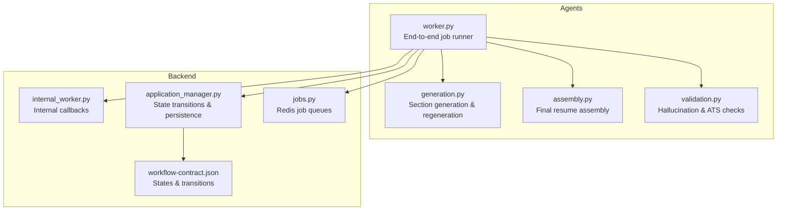
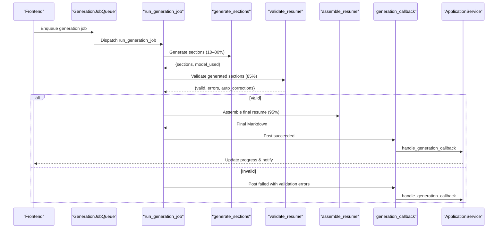
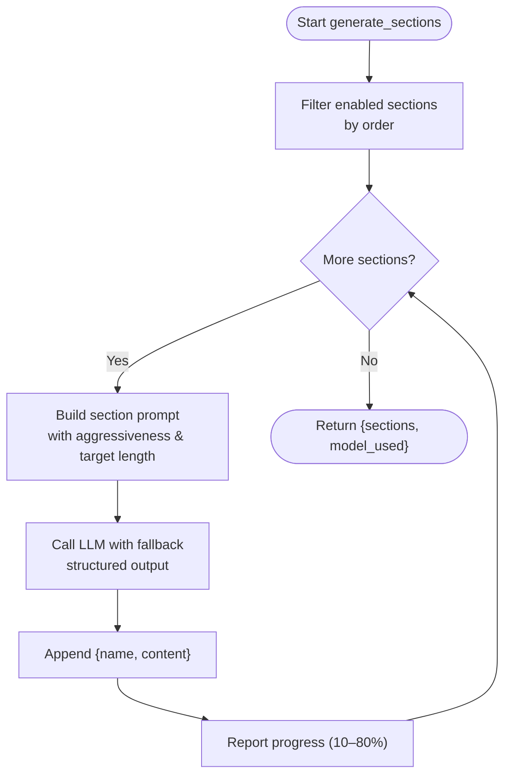
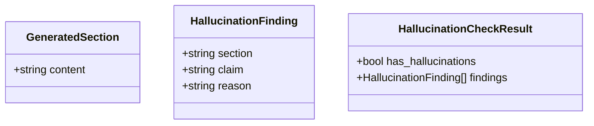
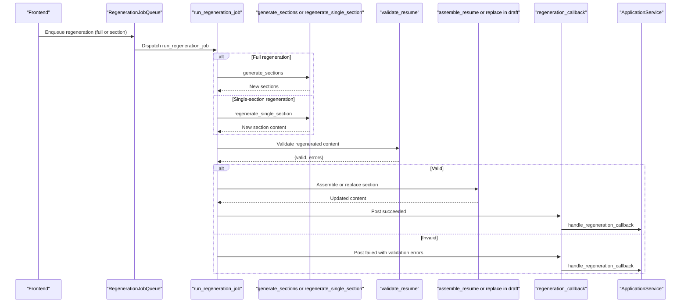
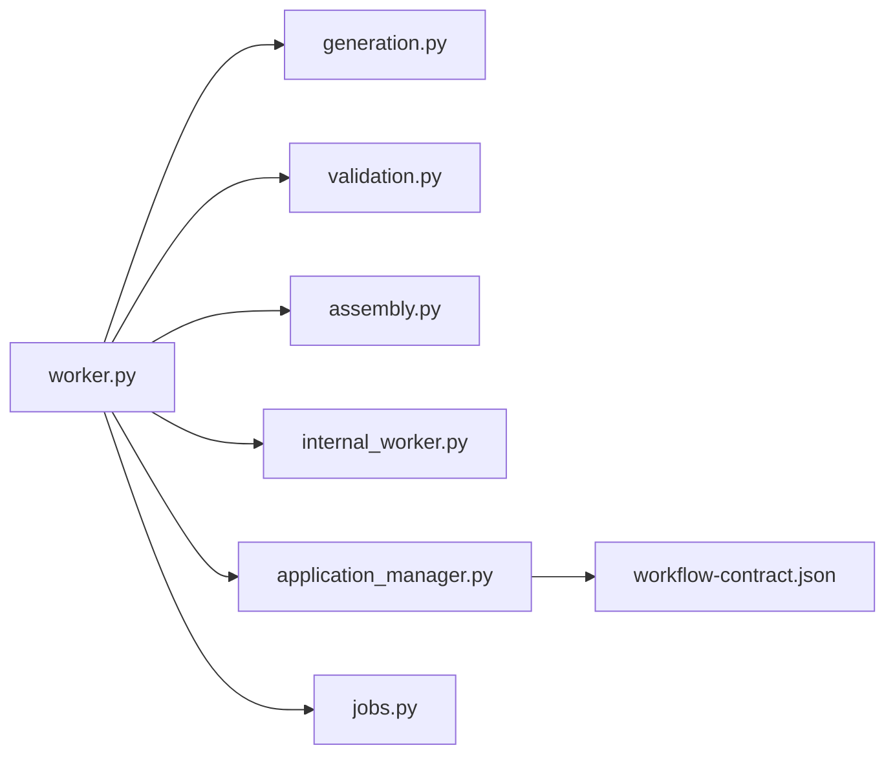

# Generation Agent

<cite>
**Referenced Files in This Document**
- [generation.py](file://agents/generation.py)
- [assembly.py](file://agents/assembly.py)
- [validation.py](file://agents/validation.py)
- [worker.py](file://agents/worker.py)
- [internal_worker.py](file://backend/app/api/internal_worker.py)
- [application_manager.py](file://backend/app/services/application_manager.py)
- [jobs.py](file://backend/app/services/jobs.py)
- [workflow-contract.json](file://shared/workflow-contract.json)
- [AGENTS.md](file://AGENTS.md)
</cite>

## Table of Contents
1. [Introduction](#introduction)
2. [Project Structure](#project-structure)
3. [Core Components](#core-components)
4. [Architecture Overview](#architecture-overview)
5. [Detailed Component Analysis](#detailed-component-analysis)
6. [Dependency Analysis](#dependency-analysis)
7. [Performance Considerations](#performance-considerations)
8. [Troubleshooting Guide](#troubleshooting-guide)
9. [Conclusion](#conclusion)

## Introduction
This document explains the generation agent responsible for AI-powered, section-based resume creation. It covers:
- How each enabled resume section is generated individually with grounded prompts
- Prompt engineering strategies and structured output handling
- Section preferences and ordering
- Integration with LangChain for reliable, structured LLM responses
- Regeneration capabilities for individual sections and full drafts
- Assembly of final Markdown using personal info and generated sections
- Model configuration, fallback handling, and progress reporting
- Validation to prevent hallucinations and ensure ATS-safe output
- Context-aware generation using base resume content and job posting details

## Project Structure
The generation agent spans three layers:
- Agents orchestrating AI workflows
- Backend API and services coordinating jobs and callbacks
- Shared workflow contract defining states and transitions

**Diagram sources**
- [generation.py:1-351](file://agents/generation.py#L1-L351)
- [assembly.py:1-63](file://agents/assembly.py#L1-L63)
- [validation.py:1-292](file://agents/validation.py#L1-L292)
- [worker.py:682-1236](file://agents/worker.py#L682-L1236)
- [internal_worker.py:1-71](file://backend/app/api/internal_worker.py#L1-L71)
- [application_manager.py:603-799](file://backend/app/services/application_manager.py#L603-L799)
- [jobs.py:1-138](file://backend/app/services/jobs.py#L1-L138)
- [workflow-contract.json:1-112](file://shared/workflow-contract.json#L1-L112)

**Section sources**
- [AGENTS.md:1-100](file://AGENTS.md#L1-L100)

## Core Components
- Section generation and regeneration:
  - Builds section-specific prompts with aggressiveness and target length guidance
  - Uses LangChain ChatOpenAI with structured output to enforce Markdown and grounding rules
  - Implements fallback model handling for resilience
- Assembly:
  - Combines personal info header with ordered generated sections into a single Markdown document
- Validation:
  - Detects hallucinations by comparing generated content to the base resume
  - Enforces required sections, correct order, and ATS-safety rules
- Worker orchestration:
  - Manages job lifecycle, progress reporting, and callback handoffs to backend
  - Supports full generation and single-section regeneration

**Section sources**
- [generation.py:159-351](file://agents/generation.py#L159-L351)
- [assembly.py:12-63](file://agents/assembly.py#L12-L63)
- [validation.py:231-292](file://agents/validation.py#L231-L292)
- [worker.py:682-1236](file://agents/worker.py#L682-L1236)

## Architecture Overview
The generation agent follows a deterministic, section-by-section pipeline with validation and assembly.

**Diagram sources**
- [jobs.py:45-85](file://backend/app/services/jobs.py#L45-L85)
- [worker.py:682-855](file://agents/worker.py#L682-L855)
- [generation.py:159-224](file://agents/generation.py#L159-L224)
- [validation.py:231-292](file://agents/validation.py#L231-L292)
- [assembly.py:12-63](file://agents/assembly.py#L12-L63)
- [internal_worker.py:37-53](file://backend/app/api/internal_worker.py#L37-L53)
- [application_manager.py:603-718](file://backend/app/services/application_manager.py#L603-L718)

## Detailed Component Analysis

### Section-Based Generation Pipeline
- Enabled sections are sorted by order and generated sequentially
- Each prompt includes:
  - Target position and job description
  - Base resume content as the source of truth
  - Aggressiveness and target length guidance
  - Strict Markdown-only rules and grounding constraints
- Structured output ensures consistent Markdown with headings and bullet points

**Diagram sources**
- [generation.py:159-224](file://agents/generation.py#L159-L224)

**Section sources**
- [generation.py:67-114](file://agents/generation.py#L67-L114)
- [generation.py:117-152](file://agents/generation.py#L117-L152)
- [generation.py:159-224](file://agents/generation.py#L159-L224)

### Prompt Engineering Strategies
- System instructions emphasize:
  - Generating only the requested section
  - Grounding all content in the base resume
  - Excluding personal info and using Markdown only
  - Tailoring aggressiveness and target length guidance
- Human message includes:
  - Target role and company
  - Job description
  - Base resume content
  - Clear instruction to tailor the section

Examples of prompt elements:
- Tailoring guidance: low, medium, high
- Length guidance: one-page or two-page targets
- Additional user instructions can be appended

**Section sources**
- [generation.py:88-114](file://agents/generation.py#L88-L114)
- [generation.py:186-188](file://agents/generation.py#L186-L188)

### Structured Output and LangChain Integration
- Structured output models define the expected shape of LLM responses
- Generation uses a Pydantic model to constrain content to Markdown with headings
- Validation uses a structured model to enumerate hallucinations and reasons
- Fallback model handling ensures resilience when primary model fails

**Diagram sources**
- [generation.py:53-61](file://agents/generation.py#L53-L61)
- [validation.py:22-41](file://agents/validation.py#L22-L41)

**Section sources**
- [generation.py:133-145](file://agents/generation.py#L133-L145)
- [validation.py:89-100](file://agents/validation.py#L89-L100)

### Section Preferences and Ordering
- Enabled sections are filtered and ordered by preference
- Validation enforces required sections and correct order
- Assembly preserves the intended order from preferences

**Section sources**
- [generation.py:178-181](file://agents/generation.py#L178-L181)
- [validation.py:118-176](file://agents/validation.py#L118-L176)
- [assembly.py:56-61](file://agents/assembly.py#L56-L61)

### Regeneration Capabilities
- Full regeneration:
  - Re-runs section generation with current job and base resume
  - Validates and assembles a new full draft
- Single-section regeneration:
  - Identifies the target section in the current draft
  - Generates a replacement using the same prompt strategy
  - Validates the single section and replaces it in the draft

**Diagram sources**
- [jobs.py:87-129](file://backend/app/services/jobs.py#L87-L129)
- [worker.py:913-1230](file://agents/worker.py#L913-L1230)
- [generation.py:280-351](file://agents/generation.py#L280-L351)
- [validation.py:231-292](file://agents/validation.py#L231-L292)
- [internal_worker.py:55-70](file://backend/app/api/internal_worker.py#L55-L70)
- [application_manager.py:721-799](file://backend/app/services/application_manager.py#L721-L799)

**Section sources**
- [generation.py:280-351](file://agents/generation.py#L280-L351)
- [worker.py:913-1230](file://agents/worker.py#L913-L1230)

### Assembly Process
- Personal info header:
  - Name is required; contacts are optional and joined with a pipe
- Section assembly:
  - Generated sections are appended in order with blank separators
- The personal info is taken from the user profile, not from LLM generation

**Section sources**
- [assembly.py:12-63](file://agents/assembly.py#L12-L63)

### Validation and Content Safety
- Hallucination detection:
  - Compares generated sections to the base resume
  - Flags unsupported claims (employers, titles, dates, credentials, institutions, skills)
- Required sections and ordering:
  - Ensures all enabled sections are present and in the correct order
- ATS safety:
  - Detects tables and images (not ATS-safe)
  - Auto-corrects excessive blank lines

**Section sources**
- [validation.py:48-116](file://agents/validation.py#L48-L116)
- [validation.py:118-176](file://agents/validation.py#L118-L176)
- [validation.py:178-224](file://agents/validation.py#L178-L224)

### Model Configuration and Fallback Handling
- Worker settings:
  - API key and base URL for OpenRouter
  - Separate primary and fallback models for generation and validation
- Fallback logic:
  - Attempts primary model; falls back to secondary on failure
  - Raises a consolidated error if both fail
- Temperature and timeouts:
  - Generation uses a small temperature for determinism
  - Calls are bounded by timeouts to avoid hanging

**Section sources**
- [worker.py:54-71](file://agents/worker.py#L54-L71)
- [worker.py:700-709](file://agents/worker.py#L700-L709)
- [generation.py:117-152](file://agents/generation.py#L117-L152)
- [validation.py:87-115](file://agents/validation.py#L87-L115)

### Progress Reporting During Generation Phases
- Worker sets progress states and percentages:
  - Starting, extracting, validating, assembling, and completion
- Callback endpoints:
  - Internal worker API posts events to backend
  - Application service updates internal state and notifies users

**Section sources**
- [worker.py:711-721](file://agents/worker.py#L711-L721)
- [worker.py:743-760](file://agents/worker.py#L743-L760)
- [worker.py:763-782](file://agents/worker.py#L763-L782)
- [worker.py:808-823](file://agents/worker.py#L808-L823)
- [internal_worker.py:37-53](file://backend/app/api/internal_worker.py#L37-L53)
- [application_manager.py:603-718](file://backend/app/services/application_manager.py#L603-L718)

## Dependency Analysis
- Orchestration:
  - Worker depends on generation, validation, and assembly modules
  - Worker posts callbacks to backend via internal API
- Backend coordination:
  - Application service persists progress and triggers notifications
  - Job queues enqueue work to Redis; worker runs jobs
- Workflow contract:
  - Defines internal states, workflow kinds, and visibility mapping

**Diagram sources**
- [worker.py:21-23](file://agents/worker.py#L21-L23)
- [internal_worker.py:1-71](file://backend/app/api/internal_worker.py#L1-L71)
- [application_manager.py:143-168](file://backend/app/services/application_manager.py#L143-L168)
- [jobs.py:45-138](file://backend/app/services/jobs.py#L45-L138)
- [workflow-contract.json:1-112](file://shared/workflow-contract.json#L1-L112)

**Section sources**
- [worker.py:21-23](file://agents/worker.py#L21-L23)
- [application_manager.py:143-168](file://backend/app/services/application_manager.py#L143-L168)

## Performance Considerations
- Deterministic section generation:
  - Sequential generation reduces context drift and improves consistency
- Structured output:
  - Reduces parsing overhead and ensures predictable Markdown
- Fallback models:
  - Improve reliability under provider latency or rate limits
- Timeouts:
  - Prevent long-running tasks from blocking the worker pool
- ATS safety:
  - Early detection of non-compliant constructs avoids rework

[No sources needed since this section provides general guidance]

## Troubleshooting Guide
Common issues and resolutions:
- No enabled sections:
  - Ensure at least one section is enabled; otherwise generation raises an error
- Validation failures:
  - Review hallucination findings and adjust instructions or base resume
- ATS violations:
  - Remove tables and images; rely on bullet lists and paragraphs
- Timeout errors:
  - Retry with reduced aggressiveness or shorter target length
- Model failures:
  - Confirm API key and base URL; verify fallback model availability

**Section sources**
- [generation.py:183-184](file://agents/generation.py#L183-L184)
- [validation.py:256-264](file://agents/validation.py#L256-L264)
- [validation.py:178-224](file://agents/validation.py#L178-L224)
- [worker.py:856-880](file://agents/worker.py#L856-L880)
- [worker.py:1180-1204](file://agents/worker.py#L1180-L1204)

## Conclusion
The generation agent implements a robust, section-based pipeline that:
- Uses grounded prompts and structured output to ensure accurate, ATS-safe content
- Supports both full and partial regeneration with strong validation
- Integrates tightly with backend services for progress tracking and persistence
- Maintains reliability through fallback models and timeouts

[No sources needed since this section summarizes without analyzing specific files]