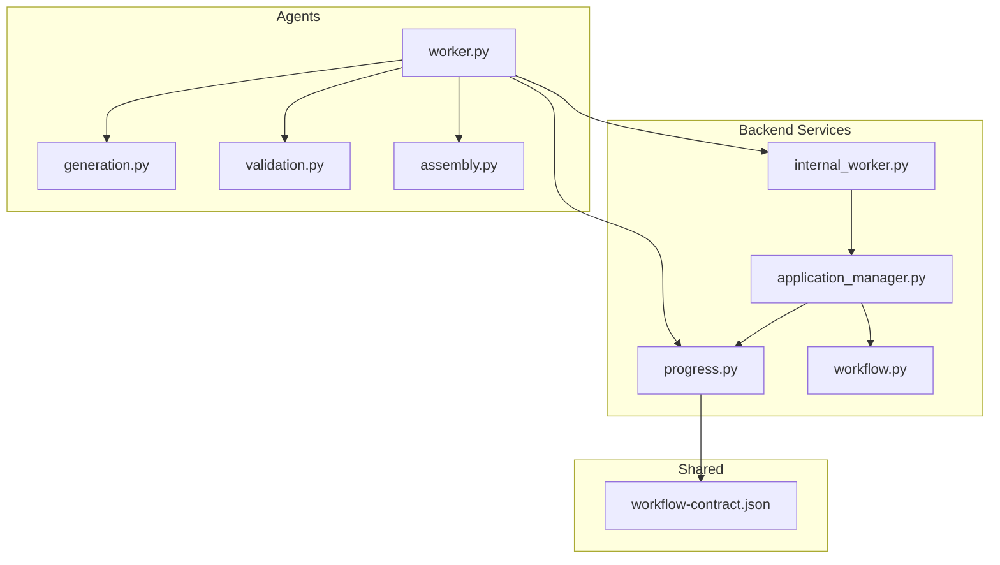
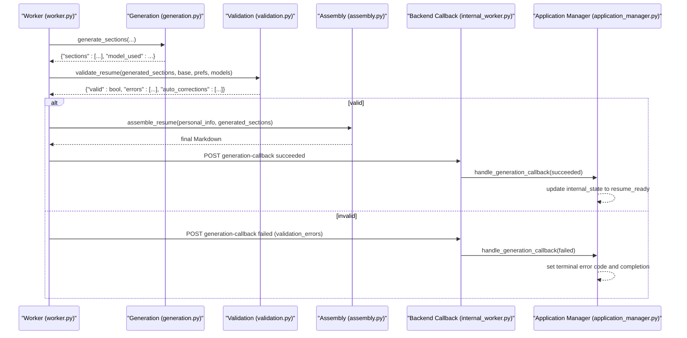
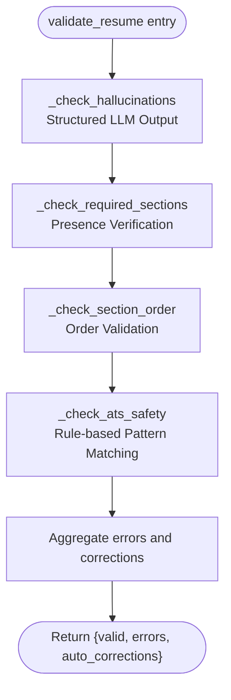
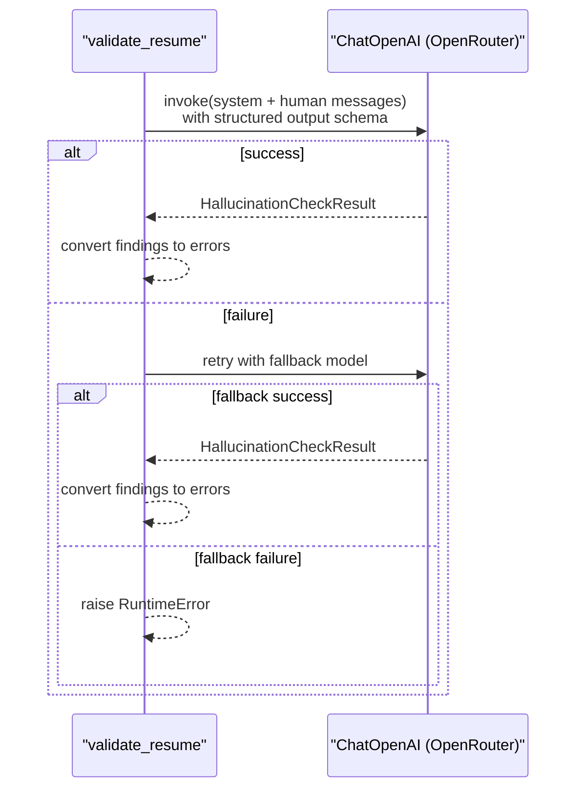
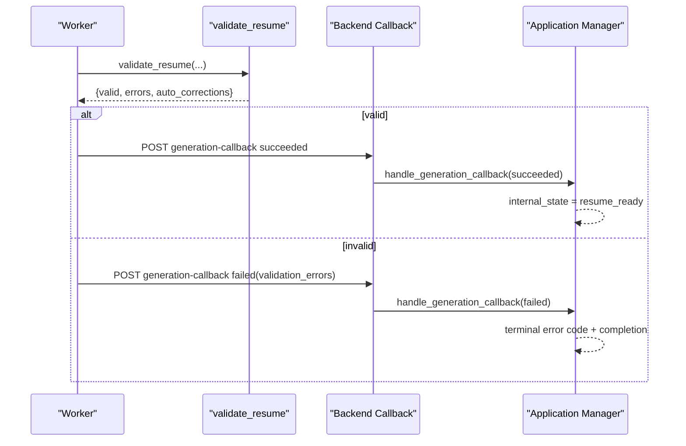
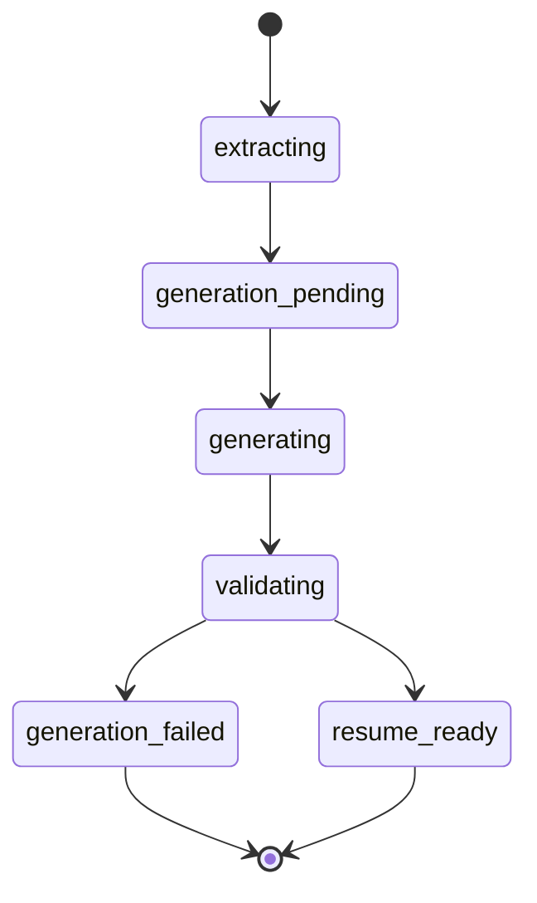
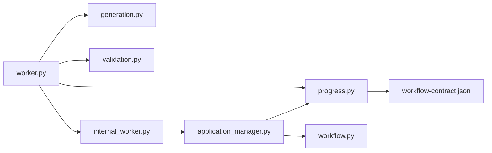

# Validation Agent

<cite>
**Referenced Files in This Document**
- [validation.py](file://agents/validation.py)
- [generation.py](file://agents/generation.py)
- [worker.py](file://agents/worker.py)
- [assembly.py](file://agents/assembly.py)
- [workflow.py](file://backend/app/services/workflow.py)
- [progress.py](file://backend/app/services/progress.py)
- [workflow-contract.json](file://shared/workflow-contract.json)
- [internal_worker.py](file://backend/app/api/internal_worker.py)
- [application_manager.py](file://backend/app/services/application_manager.py)
</cite>

## Update Summary
**Changes Made**
- Updated validation service documentation to reflect the new comprehensive validation capabilities
- Added detailed coverage of hallucination detection using structured LLM outputs
- Documented section completeness verification and ordering validation
- Added ATS-safety compliance checks with rule-based pattern matching
- Enhanced integration details with OpenRouter LLMs and fallback mechanisms
- Updated validation result interpretation and error reporting processes
- Expanded troubleshooting guide with new validation scenarios

## Table of Contents
1. [Introduction](#introduction)
2. [Project Structure](#project-structure)
3. [Core Components](#core-components)
4. [Architecture Overview](#architecture-overview)
5. [Detailed Component Analysis](#detailed-component-analysis)
6. [Dependency Analysis](#dependency-analysis)
7. [Performance Considerations](#performance-considerations)
8. [Troubleshooting Guide](#troubleshooting-guide)
9. [Conclusion](#conclusion)

## Introduction
This document describes the validation agent responsible for validating generated resume content and ensuring ATS-friendly formatting. The validation agent performs comprehensive checks including hallucination detection, section completeness verification, ordering validation, and ATS-safety compliance checks using both LLM-based analysis and rule-based pattern matching. It explains the validate_resume workflow, validation criteria, integration with OpenRouter LLMs, fallback mechanisms, result interpretation, error reporting to the progress system, and how validation results drive workflow state transitions. It also includes examples of validation scenarios, common failures, and resolution strategies.

## Project Structure
The validation agent lives in the agents module and integrates with the generation pipeline and backend progress/reporting systems. The key files are:
- agents/validation.py: Implements validate_resume and individual checks with structured LLM outputs
- agents/generation.py: Generates sections and provides prompts and fallbacks
- agents/worker.py: Orchestrates generation and validation, reports progress and failures
- agents/assembly.py: Assembles final resume after successful validation
- backend/app/services/progress.py: Stores and exposes progress records
- backend/app/services/workflow.py: Derives visible status from internal states
- shared/workflow-contract.json: Defines internal states, visible statuses, and mapping rules
- backend/app/api/internal_worker.py: Receives callbacks from the worker
- backend/app/services/application_manager.py: Processes callbacks and updates application state

**Diagram sources**
- [worker.py:754-926](file://agents/worker.py#L754-L926)
- [generation.py:159-224](file://agents/generation.py#L159-L224)
- [validation.py:231-292](file://agents/validation.py#L231-L292)
- [assembly.py:12-63](file://agents/assembly.py#L12-L63)
- [progress.py:53-79](file://backend/app/services/progress.py#L53-L79)
- [workflow.py:11-31](file://backend/app/services/workflow.py#L11-L31)
- [workflow-contract.json:1-114](file://shared/workflow-contract.json#L1-L114)
- [internal_worker.py:19-71](file://backend/app/api/internal_worker.py#L19-L71)
- [application_manager.py:732-854](file://backend/app/services/application_manager.py#L732-L854)

**Section sources**
- [worker.py:754-926](file://agents/worker.py#L754-L926)
- [validation.py:231-292](file://agents/validation.py#L231-L292)
- [generation.py:159-224](file://agents/generation.py#L159-L224)
- [assembly.py:12-63](file://agents/assembly.py#L12-L63)
- [progress.py:53-79](file://backend/app/services/progress.py#L53-L79)
- [workflow.py:11-31](file://backend/app/services/workflow.py#L11-L31)
- [workflow-contract.json:1-114](file://shared/workflow-contract.json#L1-L114)
- [internal_worker.py:19-71](file://backend/app/api/internal_worker.py#L19-L71)
- [application_manager.py:732-854](file://backend/app/services/application_manager.py#L732-L854)

## Core Components
- validate_resume: Orchestrates four comprehensive validation checks and returns a consolidated result with validity, errors, and auto-corrections.
- Individual checks:
  - Hallucination detection via structured LLM outputs with Pydantic models
  - Required sections presence verification
  - Section ordering validation
  - ATS safety checks with rule-based pattern matching and auto-corrections
- Integration with OpenRouter LLMs and fallback models
- Progress reporting and failure handling in the worker
- Backend callback processing and state transitions

**Section sources**
- [validation.py:231-292](file://agents/validation.py#L231-L292)
- [validation.py:48-116](file://agents/validation.py#L48-L116)
- [validation.py:118-142](file://agents/validation.py#L118-L142)
- [validation.py:144-176](file://agents/validation.py#L144-L176)
- [validation.py:178-224](file://agents/validation.py#L178-L224)
- [worker.py:846-879](file://agents/worker.py#L846-L879)
- [worker.py:881-926](file://agents/worker.py#L881-L926)

## Architecture Overview
The validation agent participates in the generation workflow as follows:
- Generation produces ordered sections with structured LLM outputs
- Validation runs immediately after generation with comprehensive checks
- On success, assembly creates final Markdown with personal info header
- On failure, the worker reports validation errors and sets terminal state

**Diagram sources**
- [worker.py:815-926](file://agents/worker.py#L815-L926)
- [generation.py:159-224](file://agents/generation.py#L159-L224)
- [validation.py:231-292](file://agents/validation.py#L231-L292)
- [assembly.py:12-63](file://agents/assembly.py#L12-L63)
- [internal_worker.py:37-52](file://backend/app/api/internal_worker.py#L37-L52)
- [application_manager.py:732-854](file://backend/app/services/application_manager.py#L732-L854)

## Detailed Component Analysis

### validate_resume Workflow
validate_resume performs four comprehensive validation passes and aggregates results:
1. Structured LLM-based hallucination detection with Pydantic models
2. Required sections presence verification
3. Section ordering validation
4. ATS safety checks with rule-based pattern matching and auto-corrections

**Diagram sources**
- [validation.py:231-292](file://agents/validation.py#L231-L292)
- [validation.py:48-116](file://agents/validation.py#L48-L116)
- [validation.py:118-142](file://agents/validation.py#L118-L142)
- [validation.py:144-176](file://agents/validation.py#L144-L176)
- [validation.py:178-224](file://agents/validation.py#L178-L224)

**Section sources**
- [validation.py:231-292](file://agents/validation.py#L231-L292)

#### Hallucination Detection with Structured LLM Outputs
- Uses Pydantic models (HallucinationFinding, HallucinationCheckResult) for structured LLM output
- Detects unsupported claims across generated sections compared to the base resume
- Integrates fallback model handling with comprehensive error management
- Returns detailed findings with section, claim, and reason information

**Diagram sources**
- [validation.py:48-116](file://agents/validation.py#L48-L116)

**Section sources**
- [validation.py:48-116](file://agents/validation.py#L48-L116)

#### Required Sections Presence Verification
- Compares enabled section names from preferences with generated sections
- Uses set operations for efficient comparison
- Reports missing sections as errors with detailed information

**Section sources**
- [validation.py:118-142](file://agents/validation.py#L118-L142)

#### Section Ordering Validation
- Validates that the actual order of generated sections matches the expected order derived from preferences
- Filters to only sections that exist in both lists
- Reports wrong order as an error with expected vs actual ordering

**Section sources**
- [validation.py:144-176](file://agents/validation.py#L144-L176)

#### ATS Safety Compliance with Rule-Based Pattern Matching
- Detects tables and images in sections using regex pattern matching
- Applies automatic formatting corrections (e.g., reducing excessive blank lines)
- Records auto-corrections and applies them in-place to generated sections
- Uses lightweight regex patterns for performance

**Section sources**
- [validation.py:178-224](file://agents/validation.py#L178-L224)

### Integration with OpenRouter LLMs and Fallbacks
- Both generation and validation use ChatOpenAI with configurable model and fallback model
- Fallback logic retries with the secondary model if the primary fails
- Validation uses Pydantic structured schemas for hallucination detection
- Comprehensive error handling with detailed failure reporting

**Section sources**
- [generation.py:117-151](file://agents/generation.py#L117-L151)
- [validation.py:88-115](file://agents/validation.py#L88-L115)
- [worker.py:774-782](file://agents/worker.py#L774-L782)
- [worker.py:846-879](file://agents/worker.py#L846-L879)

### Validation Result Interpretation and Error Reporting
- validate_resume returns:
  - valid: boolean indicating whether all checks passed
  - errors: list of validation findings with type, section, and detail
  - auto_corrections: list of automatic fixes applied
- Worker interprets the result:
  - If valid: proceeds to assembly and posts a succeeded callback
  - If invalid: posts a failed callback with validation_errors and sets terminal error code

**Diagram sources**
- [worker.py:856-926](file://agents/worker.py#L856-L926)
- [validation.py:287-291](file://agents/validation.py#L287-L291)
- [internal_worker.py:37-52](file://backend/app/api/internal_worker.py#L37-L52)
- [application_manager.py:777-854](file://backend/app/services/application_manager.py#L777-L854)

**Section sources**
- [worker.py:856-926](file://agents/worker.py#L856-L926)
- [application_manager.py:777-854](file://backend/app/services/application_manager.py#L777-L854)

### Relationship Between Validation Results and Workflow State Transitions
- Internal states and visible status mapping are defined in the workflow contract
- The worker sets internal states during generation and validation, and the backend maps these to visible statuses
- Validation failures trigger terminal error codes and state transitions

**Diagram sources**
- [workflow-contract.json:9-20](file://shared/workflow-contract.json#L9-L20)
- [workflow.py:11-31](file://backend/app/services/workflow.py#L11-L31)
- [worker.py:835-926](file://agents/worker.py#L835-L926)

**Section sources**
- [workflow-contract.json:1-114](file://shared/workflow-contract.json#L1-L114)
- [workflow.py:11-31](file://backend/app/services/workflow.py#L11-L31)
- [worker.py:835-926](file://agents/worker.py#L835-L926)

## Dependency Analysis
- validate_resume depends on:
  - LLM calls (OpenRouter) with structured output schemas for hallucination detection
  - Regex-based pattern matching for ATS safety checks
  - Input data: generated sections, base resume content, section preferences
- Worker orchestrates:
  - Calls generation and validation with proper timeout handling
  - Updates progress and posts callbacks with validation results
  - Handles timeouts and system errors gracefully
- Backend services:
  - Store progress and derive visible status from internal states
  - Process callbacks and update application state with validation outcomes

**Diagram sources**
- [worker.py:754-926](file://agents/worker.py#L754-L926)
- [generation.py:159-224](file://agents/generation.py#L159-L224)
- [validation.py:231-292](file://agents/validation.py#L231-L292)
- [progress.py:53-79](file://backend/app/services/progress.py#L53-L79)
- [workflow.py:11-31](file://backend/app/services/workflow.py#L11-L31)
- [workflow-contract.json:1-114](file://shared/workflow-contract.json#L1-L114)
- [internal_worker.py:19-71](file://backend/app/api/internal_worker.py#L19-L71)
- [application_manager.py:732-854](file://backend/app/services/application_manager.py#L732-L854)

**Section sources**
- [worker.py:754-926](file://agents/worker.py#L754-L926)
- [validation.py:231-292](file://agents/validation.py#L231-L292)
- [generation.py:159-224](file://agents/generation.py#L159-L224)
- [progress.py:53-79](file://backend/app/services/progress.py#L53-L79)
- [workflow.py:11-31](file://backend/app/services/workflow.py#L11-L31)
- [workflow-contract.json:1-114](file://shared/workflow-contract.json#L1-L114)
- [internal_worker.py:19-71](file://backend/app/api/internal_worker.py#L19-L71)
- [application_manager.py:732-854](file://backend/app/services/application_manager.py#L732-L854)

## Performance Considerations
- LLM calls are rate-limited and use timeouts; fallback models reduce single-point-of-failure risk
- ATS safety checks use lightweight regex matching and in-place normalization to minimize overhead
- Structured LLM outputs improve parsing efficiency and reduce error-prone text processing
- Validation aggregates results efficiently and avoids redundant processing
- Pydantic models provide fast schema validation and serialization

## Troubleshooting Guide
Common validation failures and resolutions:
- Hallucinations detected:
  - Cause: Claims not present in base resume or inconsistent information
  - Resolution: Regenerate sections with stricter grounding prompts; ensure base resume is accurate and complete
- Missing required sections:
  - Cause: Enabled sections not produced during generation
  - Resolution: Verify section preferences and generation settings; regenerate missing sections
- Wrong section order:
  - Cause: Preferences order mismatch or generation producing unexpected order
  - Resolution: Adjust section preferences order; regenerate sections to match expected order
- ATS violations (tables/images):
  - Cause: Non-ATS-safe content like tables or image references
  - Resolution: Remove tables/images; use bullet lists and plain text formatting; validation automatically removes extra blank lines
- Validation failures reported to progress:
  - The worker posts a failed callback with validation_errors and sets a terminal error code; the backend updates application state accordingly
- Structured output parsing issues:
  - Cause: LLM response not matching expected schema
  - Resolution: Check API key configuration and model availability; fallback mechanism should handle primary model failures

**Section sources**
- [validation.py:287-291](file://agents/validation.py#L287-L291)
- [worker.py:856-926](file://agents/worker.py#L856-L926)
- [application_manager.py:777-854](file://backend/app/services/application_manager.py#L777-L854)

## Conclusion
The validation agent ensures generated resumes are accurate, complete, and ATS-friendly through comprehensive validation checks. It leverages structured LLM outputs for hallucination detection, enforces required sections and ordering, and applies ATS-safe formatting using rule-based pattern matching. The worker coordinates validation with progress reporting and backend callbacks, driving the workflow toward completion or failure states as defined by the workflow contract. The dual approach of LLM-based analysis and rule-based pattern matching provides robust validation coverage while maintaining performance and reliability.