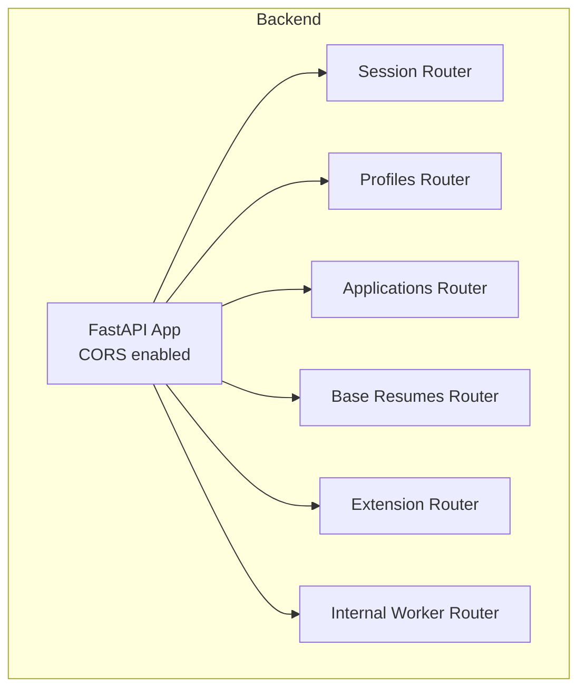
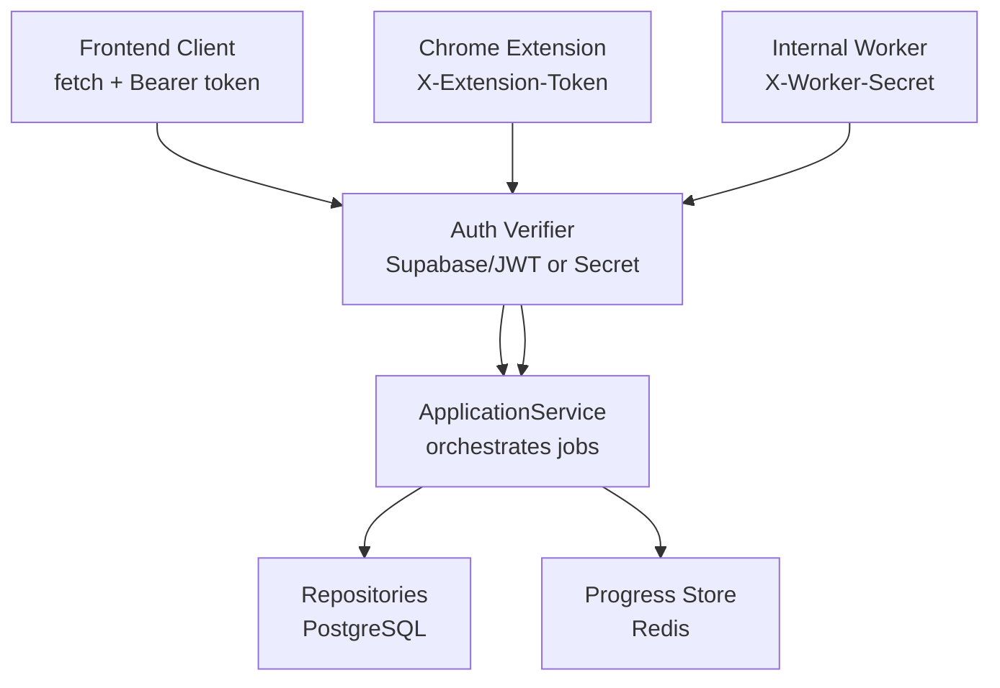
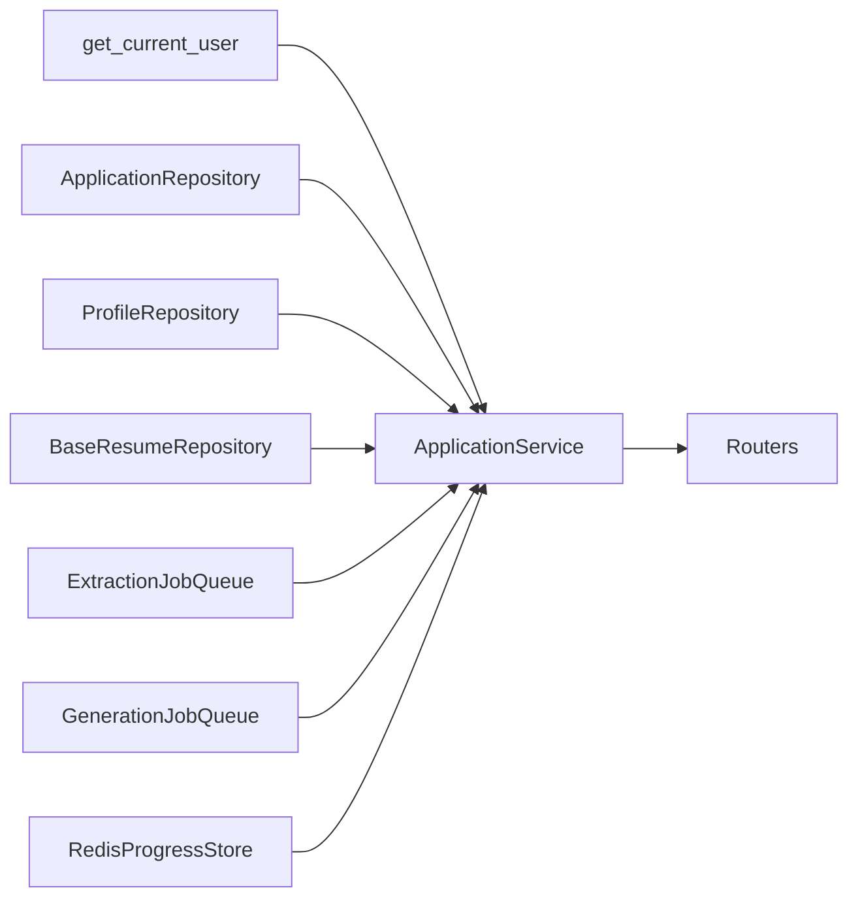

# API Reference

<cite>
**Referenced Files in This Document**
- [backend/app/main.py](file://backend/app/main.py)
- [backend/app/api/session.py](file://backend/app/api/session.py)
- [backend/app/api/applications.py](file://backend/app/api/applications.py)
- [backend/app/api/profiles.py](file://backend/app/api/profiles.py)
- [backend/app/api/base_resumes.py](file://backend/app/api/base_resumes.py)
- [backend/app/api/extension.py](file://backend/app/api/extension.py)
- [backend/app/api/internal_worker.py](file://backend/app/api/internal_worker.py)
- [backend/app/core/auth.py](file://backend/app/core/auth.py)
- [backend/app/core/security.py](file://backend/app/core/security.py)
- [backend/app/db/applications.py](file://backend/app/db/applications.py)
- [backend/app/db/profiles.py](file://backend/app/db/profiles.py)
- [backend/app/db/base_resumes.py](file://backend/app/db/base_resumes.py)
- [backend/app/services/application_manager.py](file://backend/app/services/application_manager.py)
- [frontend/src/lib/api.ts](file://frontend/src/lib/api.ts)
- [frontend/public/chrome-extension/manifest.json](file://frontend/public/chrome-extension/manifest.json)
- [frontend/public/chrome-extension/popup.js](file://frontend/public/chrome-extension/popup.js)
- [frontend/public/chrome-extension/content-script.js](file://frontend/public/chrome-extension/content-script.js)
</cite>

## Table of Contents
1. [Introduction](#introduction)
2. [Project Structure](#project-structure)
3. [Core Components](#core-components)
4. [Architecture Overview](#architecture-overview)
5. [Detailed Component Analysis](#detailed-component-analysis)
6. [Dependency Analysis](#dependency-analysis)
7. [Performance Considerations](#performance-considerations)
8. [Troubleshooting Guide](#troubleshooting-guide)
9. [Conclusion](#conclusion)
10. [Appendices](#appendices)

## Introduction
This document provides a comprehensive API reference for the backend REST endpoints, frontend API utilities, and extension integration flows. It covers:
- Authentication and authorization requirements
- Session management and bootstrap
- Application lifecycle endpoints
- Profile management
- Base resume CRUD and upload
- Extension integration via Chrome extension and token-based authentication
- Internal worker callbacks
- Request/response schemas, validation rules, and error handling
- Frontend client utilities and integration patterns
- Versioning and CORS configuration

## Project Structure
The API surface is organized around routers grouped by domain:
- Session: bootstrap user session and profile
- Profiles: user profile retrieval and updates
- Applications: CRUD, extraction, generation, regeneration, drafts, exports
- Base Resumes: CRUD and PDF upload with optional LLM cleanup
- Extension: status, token issuance/revoke, and import
- Internal Worker: callbacks for extraction/generation/regeneration

**Diagram sources**
- [backend/app/main.py:14-36](file://backend/app/main.py#L14-L36)
- [backend/app/api/session.py:12](file://backend/app/api/session.py#L12)
- [backend/app/api/profiles.py:11](file://backend/app/api/profiles.py#L11)
- [backend/app/api/applications.py:21](file://backend/app/api/applications.py#L21)
- [backend/app/api/base_resumes.py:12](file://backend/app/api/base_resumes.py#L12)
- [backend/app/api/extension.py:27](file://backend/app/api/extension.py#L27)
- [backend/app/api/internal_worker.py:16](file://backend/app/api/internal_worker.py#L16)

**Section sources**
- [backend/app/main.py:14-36](file://backend/app/main.py#L14-L36)

## Core Components
- Authentication: Bearer tokens validated against Supabase JWKS or secret, depending on configuration.
- Security: Extension token hashing and verification via header; worker callback secret verification.
- Data models: Pydantic models define request/response schemas and validation rules.
- Repositories: PostgreSQL-backed repositories for applications, profiles, and base resumes.
- Services: Application manager orchestrates extraction, generation, progress tracking, and notifications.

**Section sources**
- [backend/app/core/auth.py:15-90](file://backend/app/core/auth.py#L15-L90)
- [backend/app/core/security.py:13-54](file://backend/app/core/security.py#L13-L54)
- [backend/app/db/applications.py:14-328](file://backend/app/db/applications.py#L14-L328)
- [backend/app/db/profiles.py:14-225](file://backend/app/db/profiles.py#L14-L225)
- [backend/app/db/base_resumes.py:14-184](file://backend/app/db/base_resumes.py#L14-L184)
- [backend/app/services/application_manager.py:143-200](file://backend/app/services/application_manager.py#L143-L200)

## Architecture Overview
High-level API flow:
- Frontend client authenticates via Supabase and calls backend endpoints with Bearer tokens.
- Extension sends requests with X-Extension-Token header after token issuance.
- Internal worker posts callbacks to internal endpoints protected by X-Worker-Secret.

**Diagram sources**
- [backend/app/main.py:14-36](file://backend/app/main.py#L14-L36)
- [backend/app/core/auth.py:22-90](file://backend/app/core/auth.py#L22-L90)
- [backend/app/core/security.py:13-54](file://backend/app/core/security.py#L13-L54)
- [backend/app/services/application_manager.py:143-200](file://backend/app/services/application_manager.py#L143-L200)

## Detailed Component Analysis

### Authentication and Authorization
- Bearer token required for most endpoints. Token is verified against Supabase JWKS or secret.
- Extension endpoints use X-Extension-Token header; worker callbacks use X-Worker-Secret.
- CORS allows browser origins and Chrome extension origins.

Key behaviors:
- Missing or malformed Bearer token yields 401 Unauthorized.
- JWT audience/issuer validation enforced when configured.
- Extension token hashed and stored; last-used timestamp updated on use.

**Section sources**
- [backend/app/core/auth.py:22-90](file://backend/app/core/auth.py#L22-L90)
- [backend/app/core/security.py:13-54](file://backend/app/core/security.py#L13-L54)
- [backend/app/main.py:15-22](file://backend/app/main.py#L15-L22)

### Session Management
Endpoints:
- GET /api/session/bootstrap
  - Purpose: Bootstrap session with user, profile, and workflow contract version.
  - Auth: Bearer token required.
  - Response: user, profile, workflow_contract_version.
  - Errors: 503 if profile unavailable.

Validation and behavior:
- Returns current user identity and profile; raises 503 if profile not found.

**Section sources**
- [backend/app/api/session.py:27-44](file://backend/app/api/session.py#L27-L44)
- [frontend/src/lib/api.ts:240-242](file://frontend/src/lib/api.ts#L240-L242)

### Applications CRUD and Workflows
Endpoints:
- GET /api/applications
  - Query: search, visible_status
  - Response: array of ApplicationSummary
- POST /api/applications
  - Body: job_url
  - Response: ApplicationDetail
  - Status: 201 Created
- GET /api/applications/{application_id}
  - Response: ApplicationDetail
- PATCH /api/applications/{application_id}
  - Body: partial updates (applied, notes, job_title, company, job_description, job_posting_origin, job_posting_origin_other_text, base_resume_id)
  - Errors: 400 if no updates provided
- POST /api/applications/{application_id}/retry-extraction
  - Response: ApplicationDetail
- POST /api/applications/{application_id}/manual-entry
  - Body: manual entry payload
  - Response: ApplicationDetail
- POST /api/applications/{application_id}/recover-from-source
  - Body: source capture payload
  - Response: ApplicationDetail
- POST /api/applications/{application_id}/duplicate-resolution
  - Body: resolution ("dismissed" | "redirected")
  - Response: ApplicationDetail
- GET /api/applications/{application_id}/progress
  - Response: WorkflowProgress
- GET /api/applications/{application_id}/draft
  - Response: ResumeDraftResponse or null
- POST /api/applications/{application_id}/generate
  - Body: base_resume_id, target_length ("1_page" | "2_page" | "3_page"), aggressiveness ("low" | "medium" | "high"), additional_instructions
  - Response: ApplicationDetail (202 Accepted)
- POST /api/applications/{application_id}/regenerate
  - Body: target_length, aggressiveness, additional_instructions
  - Response: ApplicationDetail (202 Accepted)
- POST /api/applications/{application_id}/regenerate-section
  - Body: section_name, instructions
  - Response: ApplicationDetail (202 Accepted)
- PUT /api/applications/{application_id}/draft
  - Body: content
  - Response: ResumeDraftResponse
- GET /api/applications/{application_id}/export-pdf
  - Response: application/pdf attachment

Validation rules:
- String fields are trimmed; blank-only strings normalized to null.
- Origin "other" requires a label; otherwise label is cleared.
- Target length and aggressiveness constrained to allowed values.
- Section regeneration requires non-blank section name and instructions.
- Draft content must be non-blank.
- PDF upload supports only PDF, up to 10MB; optional LLM cleanup.

Error mapping:
- LookupError → 404 Not Found
- PermissionError → 409 Conflict
- ValueError → 400 Bad Request
- Other → 500 Internal Server Error

**Section sources**
- [backend/app/api/applications.py:369-661](file://backend/app/api/applications.py#L369-L661)
- [backend/app/db/applications.py:14-328](file://backend/app/db/applications.py#L14-L328)
- [backend/app/services/application_manager.py:143-200](file://backend/app/services/application_manager.py#L143-L200)

### Profiles Management
Endpoints:
- GET /api/profiles
  - Response: ProfileResponse
  - Errors: 404 if profile not found
- PATCH /api/profiles
  - Body: name, phone, address, section_preferences (keys limited to predefined sections), section_order (values limited to predefined sections, no duplicates)
  - Errors: 400 if no updates; 400 for invalid preferences/order; 404 if not found

Validation rules:
- String fields are trimmed; blank-only strings normalized to null.
- section_preferences keys must be subset of {"summary","professional_experience","education","skills"}.
- section_order values must be subset of valid sections and must not repeat.

**Section sources**
- [backend/app/api/profiles.py:77-113](file://backend/app/api/profiles.py#L77-L113)
- [backend/app/db/profiles.py:14-225](file://backend/app/db/profiles.py#L14-L225)

### Base Resumes CRUD and Upload
Endpoints:
- GET /api/base-resumes
  - Response: array of BaseResumeSummary
- POST /api/base-resumes
  - Body: name, content_md
  - Response: BaseResumeDetail (201 Created)
- POST /api/base-resumes/upload
  - Form: file (PDF), name, use_llm_cleanup (optional)
  - Response: BaseResumeDetail (201 Created)
  - Constraints: only PDF, <= 10MB; optional LLM cleanup via OpenRouter
- GET /api/base-resumes/{resume_id}
  - Response: BaseResumeDetail
- PATCH /api/base-resumes/{resume_id}
  - Body: name, content_md
  - Errors: 400 if no updates
- DELETE /api/base-resumes/{resume_id}?force={bool}
  - Response: 204 No Content
- POST /api/base-resumes/{resume_id}/set-default
  - Response: BaseResumeSummary

Validation rules:
- Name must be non-blank when provided.
- PDF upload validates extension, content-type, size, parsing, and optional cleanup.

**Section sources**
- [backend/app/api/base_resumes.py:85-242](file://backend/app/api/base_resumes.py#L85-L242)
- [backend/app/db/base_resumes.py:40-184](file://backend/app/db/base_resumes.py#L40-L184)

### Extension Integration APIs
Endpoints:
- GET /api/extension/status
  - Response: ExtensionConnectionStatus
  - Errors: 503 if profile unavailable
- POST /api/extension/token
  - Response: ExtensionTokenResponse (token + status)
- DELETE /api/extension/token
  - Response: ExtensionConnectionStatus
- POST /api/extension/import
  - Body: job_url, source_text, page_title, source_url, meta, json_ld, captured_at
  - Response: ApplicationDetail (201 Created)
  - Auth: X-Extension-Token header required

Validation rules:
- Source text must be non-blank.
- Page title and captured_at are trimmed; blank becomes null.

Frontend extension behavior:
- Manifest defines permissions and background/service worker.
- Popup builds import request payload and calls /api/extension/import with X-Extension-Token.
- Content script captures page metadata and forwards messages to extension runtime.

**Section sources**
- [backend/app/api/extension.py:79-141](file://backend/app/api/extension.py#L79-L141)
- [backend/app/core/security.py:25-54](file://backend/app/core/security.py#L25-L54)
- [frontend/public/chrome-extension/manifest.json:1-24](file://frontend/public/chrome-extension/manifest.json#L1-L24)
- [frontend/public/chrome-extension/popup.js:109-136](file://frontend/public/chrome-extension/popup.js#L109-L136)
- [frontend/public/chrome-extension/content-script.js:60-117](file://frontend/public/chrome-extension/content-script.js#L60-L117)

### Internal Worker Callbacks
Endpoints:
- POST /api/internal/worker/extraction-callback
- POST /api/internal/worker/generation-callback
- POST /api/internal/worker/regeneration-callback
- Auth: X-Worker-Secret header required
- Errors: 404/409/400 mapped per service errors

**Section sources**
- [backend/app/api/internal_worker.py:19-71](file://backend/app/api/internal_worker.py#L19-L71)
- [backend/app/core/security.py:13-23](file://backend/app/core/security.py#L13-L23)

### Frontend API Utilities
The frontend library wraps authenticated requests and exposes typed functions for:
- Session bootstrap
- Applications: list, create, detail, patch, retry extraction, manual entry, duplicate resolution, progress, draft, generate, regenerate, regenerate-section, save draft, export PDF
- Base resumes: list, create, fetch, update, delete, set default, upload
- Profile: fetch, update
- Extension: status, issue token, revoke token

Implementation highlights:
- Uses Supabase session access token for Authorization header.
- Handles non-JSON error responses gracefully.
- Uploads use multipart/form-data for PDF uploads.

**Section sources**
- [frontend/src/lib/api.ts:177-489](file://frontend/src/lib/api.ts#L177-L489)

## Dependency Analysis
- Routers depend on dependency injection for authenticated user, repositories, and services.
- ApplicationService coordinates repositories, job queues, progress store, and email sender.
- Extension endpoints depend on ProfileRepository for token lookup and updates.
- Internal worker endpoints depend on ApplicationService and verify_worker_secret.

**Diagram sources**
- [backend/app/api/applications.py:12-18](file://backend/app/api/applications.py#L12-L18)
- [backend/app/api/extension.py:21-25](file://backend/app/api/extension.py#L21-L25)
- [backend/app/services/application_manager.py:143-200](file://backend/app/services/application_manager.py#L143-L200)

**Section sources**
- [backend/app/api/applications.py:12-18](file://backend/app/api/applications.py#L12-L18)
- [backend/app/api/extension.py:21-25](file://backend/app/api/extension.py#L21-L25)
- [backend/app/services/application_manager.py:143-200](file://backend/app/services/application_manager.py#L143-L200)

## Performance Considerations
- Use pagination-friendly queries for listing applications and base resumes.
- Prefer filtering via query parameters (search, visible_status) to reduce payload sizes.
- Export PDF endpoint streams binary content; avoid unnecessary buffering.
- Keep draft content minimal and trim whitespace to reduce storage overhead.
- Monitor Redis progress store for long-running jobs; consider exponential backoff in clients.

## Troubleshooting Guide
Common errors and resolutions:
- 401 Unauthorized
  - Cause: Missing or invalid Bearer token; invalid extension token; missing worker secret.
  - Resolution: Re-authenticate; verify tokens; check headers.
- 400 Bad Request
  - Cause: Validation failures (blank strings, invalid enums, invalid section preferences/order).
  - Resolution: Normalize inputs; adhere to allowed values.
- 404 Not Found
  - Cause: Resource not found (application, profile, base resume).
  - Resolution: Verify IDs and ownership.
- 409 Conflict
  - Cause: Permission conflicts during operations.
  - Resolution: Check user permissions and resource state.
- 503 Service Unavailable
  - Cause: Profile unavailable during bootstrap/status checks.
  - Resolution: Retry after profile initialization.

Debugging tips:
- Inspect Authorization header format and token validity.
- Log request IDs and timestamps for progress tracking.
- For extension issues, confirm token creation, last-used timestamps, and app URL trust.

**Section sources**
- [backend/app/api/session.py:34-38](file://backend/app/api/session.py#L34-L38)
- [backend/app/api/applications.py:359-366](file://backend/app/api/applications.py#L359-L366)
- [backend/app/api/profiles.py:67-74](file://backend/app/api/profiles.py#L67-L74)
- [backend/app/api/extension.py:86-89](file://backend/app/api/extension.py#L86-L89)

## Conclusion
This API reference documents the REST endpoints, authentication, schemas, and integration flows across session management, applications, profiles, base resumes, extension integration, and internal worker callbacks. Clients should use Bearer tokens for authenticated endpoints, X-Extension-Token for extension endpoints, and X-Worker-Secret for internal callbacks. Adhering to validation rules and error mappings ensures robust integrations.

## Appendices

### Authentication Methods
- Bearer token: Authorization: Bearer <access_token>
- Extension token: X-Extension-Token: <token>
- Worker secret: X-Worker-Secret: <secret>

**Section sources**
- [backend/app/core/auth.py:72-90](file://backend/app/core/auth.py#L72-L90)
- [backend/app/core/security.py:13-54](file://backend/app/core/security.py#L13-L54)

### Error Codes
- 400 Bad Request: Validation errors
- 401 Unauthorized: Missing/invalid tokens
- 404 Not Found: Resource not found
- 409 Conflict: Permission conflicts
- 500 Internal Server Error: Unexpected server errors
- 503 Service Unavailable: Profile/bootstrap unavailable

**Section sources**
- [backend/app/api/applications.py:359-366](file://backend/app/api/applications.py#L359-L366)
- [backend/app/api/profiles.py:67-74](file://backend/app/api/profiles.py#L67-L74)
- [backend/app/api/session.py:34-38](file://backend/app/api/session.py#L34-L38)

### Rate Limiting and Versioning
- Rate limiting: Not exposed in current implementation.
- Versioning: API title/version set to "AI Resume Builder API" v0.1.0.

**Section sources**
- [backend/app/main.py:14](file://backend/app/main.py#L14)

### Endpoint Catalog

- Session
  - GET /api/session/bootstrap

- Profiles
  - GET /api/profiles
  - PATCH /api/profiles

- Applications
  - GET /api/applications
  - POST /api/applications
  - GET /api/applications/{application_id}
  - PATCH /api/applications/{application_id}
  - POST /api/applications/{application_id}/retry-extraction
  - POST /api/applications/{application_id}/manual-entry
  - POST /api/applications/{application_id}/recover-from-source
  - POST /api/applications/{application_id}/duplicate-resolution
  - GET /api/applications/{application_id}/progress
  - GET /api/applications/{application_id}/draft
  - POST /api/applications/{application_id}/generate
  - POST /api/applications/{application_id}/regenerate
  - POST /api/applications/{application_id}/regenerate-section
  - PUT /api/applications/{application_id}/draft
  - GET /api/applications/{application_id}/export-pdf

- Base Resumes
  - GET /api/base-resumes
  - POST /api/base-resumes
  - POST /api/base-resumes/upload
  - GET /api/base-resumes/{resume_id}
  - PATCH /api/base-resumes/{resume_id}
  - DELETE /api/base-resumes/{resume_id}
  - POST /api/base-resumes/{resume_id}/set-default

- Extension
  - GET /api/extension/status
  - POST /api/extension/token
  - DELETE /api/extension/token
  - POST /api/extension/import

- Internal Worker
  - POST /api/internal/worker/extraction-callback
  - POST /api/internal/worker/generation-callback
  - POST /api/internal/worker/regeneration-callback

**Section sources**
- [backend/app/api/session.py:27-44](file://backend/app/api/session.py#L27-L44)
- [backend/app/api/profiles.py:77-113](file://backend/app/api/profiles.py#L77-L113)
- [backend/app/api/applications.py:369-661](file://backend/app/api/applications.py#L369-L661)
- [backend/app/api/base_resumes.py:85-242](file://backend/app/api/base_resumes.py#L85-L242)
- [backend/app/api/extension.py:79-141](file://backend/app/api/extension.py#L79-L141)
- [backend/app/api/internal_worker.py:19-71](file://backend/app/api/internal_worker.py#L19-L71)

### Example Payloads and Schemas

- SessionBootstrapResponse
  - user: { id, email?, role? }
  - profile: { id, email, name?, phone?, address?, default_base_resume_id?, section_preferences, section_order[], created_at, updated_at } | null
  - workflow_contract_version: string

- ProfileResponse
  - { id, email, name?, phone?, address?, default_base_resume_id?, section_preferences, section_order[], created_at, updated_at }

- ApplicationSummary
  - { id, job_url, job_title?, company?, job_posting_origin?, visible_status, internal_state, failure_reason?, applied, duplicate_similarity_score?, duplicate_resolution_status?, duplicate_matched_application_id?, created_at, updated_at, base_resume_name?, has_action_required_notification, has_unresolved_duplicate }

- ApplicationDetail
  - { id, job_url, job_title?, company?, job_description?, extracted_reference_id?, job_posting_origin?, job_posting_origin_other_text?, base_resume_id?, base_resume_name?, visible_status, internal_state, failure_reason?, extraction_failure_details?, generation_failure_details?, applied, duplicate_similarity_score?, duplicate_resolution_status?, duplicate_matched_application_id?, notes?, created_at, updated_at, has_action_required_notification, duplicate_warning? }

- ResumeDraftResponse
  - { id, application_id, content_md, generation_params, sections_snapshot, last_generated_at, last_exported_at?, updated_at }

- WorkflowProgress
  - { job_id, workflow_kind, state, message, percent_complete, created_at, updated_at, completed_at?, terminal_error_code? }

- ExtensionConnectionStatus
  - { connected, token_created_at?, token_last_used_at? }

- ExtensionTokenResponse
  - { token, status: ExtensionConnectionStatus }

- BaseResumeSummary
  - { id, name, is_default, created_at, updated_at }

- BaseResumeDetail
  - { id, name, content_md, is_default, created_at, updated_at }

- Frontend API Functions
  - fetchSessionBootstrap(), listApplications(), createApplication(jobUrl), fetchApplicationDetail(id), patchApplication(id, updates), retryExtraction(id), submitManualEntry(id, payload), resolveDuplicate(id, resolution), fetchApplicationProgress(id), recoverApplicationFromSource(id, payload), fetchExtensionStatus(), issueExtensionToken(), revokeExtensionToken(), listBaseResumes(), createBaseResume(name, contentMd), fetchBaseResume(id), updateBaseResume(id, updates), deleteBaseResume(id, force?), setDefaultBaseResume(id), uploadBaseResume(file, name, useLlmCleanup?), fetchProfile(), updateProfile(updates), triggerGeneration(id, settings), fetchDraft(id), saveDraft(id, content), triggerFullRegeneration(id, settings), triggerSectionRegeneration(id, sectionName, instructions), exportPdf(id)

**Section sources**
- [frontend/src/lib/api.ts:4-489](file://frontend/src/lib/api.ts#L4-L489)
- [backend/app/api/session.py:21-24](file://backend/app/api/session.py#L21-L24)
- [backend/app/api/profiles.py:54-65](file://backend/app/api/profiles.py#L54-L65)
- [backend/app/api/applications.py:114-164](file://backend/app/api/applications.py#L114-L164)
- [backend/app/api/applications.py:300-310](file://backend/app/api/applications.py#L300-L310)
- [backend/app/api/applications.py:311-321](file://backend/app/api/applications.py#L311-L321)
- [backend/app/api/extension.py:30-39](file://backend/app/api/extension.py#L30-L39)
- [backend/app/api/extension.py:36-38](file://backend/app/api/extension.py#L36-L38)
- [backend/app/api/base_resumes.py:55-70](file://backend/app/api/base_resumes.py#L55-L70)
- [backend/app/api/base_resumes.py:63-70](file://backend/app/api/base_resumes.py#L63-L70)

### Client Implementation Guidelines
- Use the frontend API module for browser-based integrations; it handles Bearer token retrieval and error parsing.
- For extension integrations, store the issued token securely and include X-Extension-Token in all import requests.
- For internal worker callbacks, ensure X-Worker-Secret matches the configured secret.
- Respect validation constraints to avoid 400 errors; trim inputs and validate enums.

### Integration Patterns
- Application creation: POST /api/applications with job_url; poll /api/applications/{id}/progress until completion; optionally call /api/applications/{id}/generate.
- Draft editing: GET /api/applications/{id}/draft, PUT /api/applications/{id}/draft, then export via /api/applications/{id}/export-pdf.
- Extension import: Issue token via /api/extension/token, then POST /api/extension/import with captured page data and X-Extension-Token.