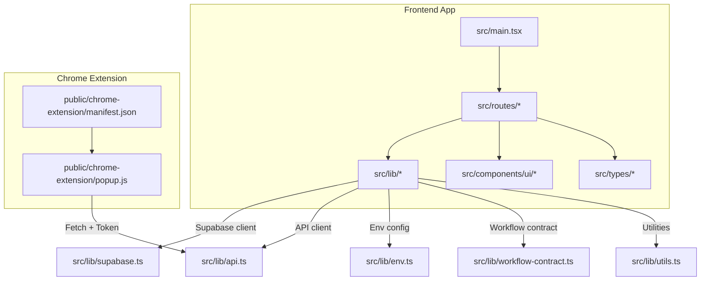
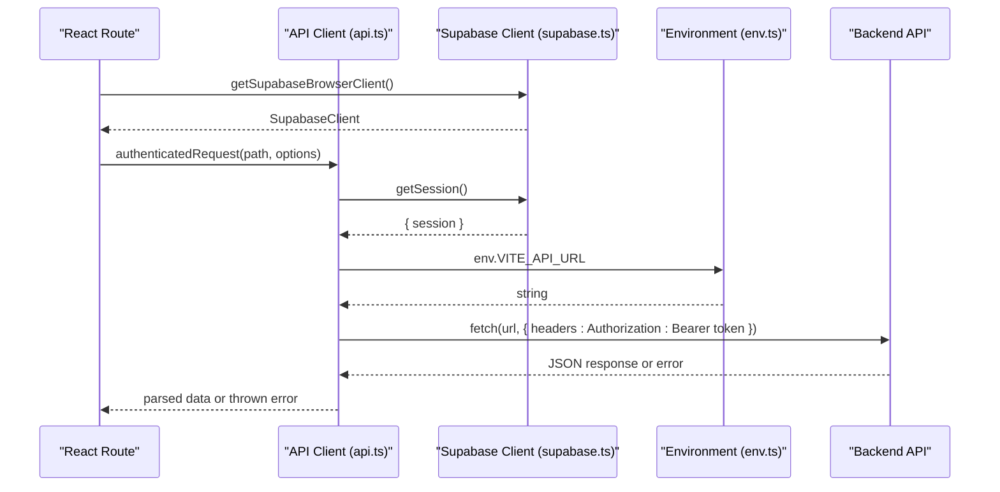
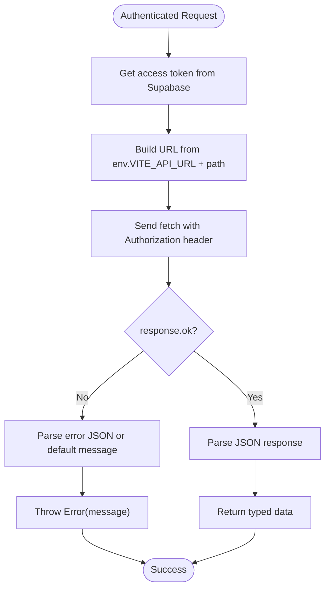
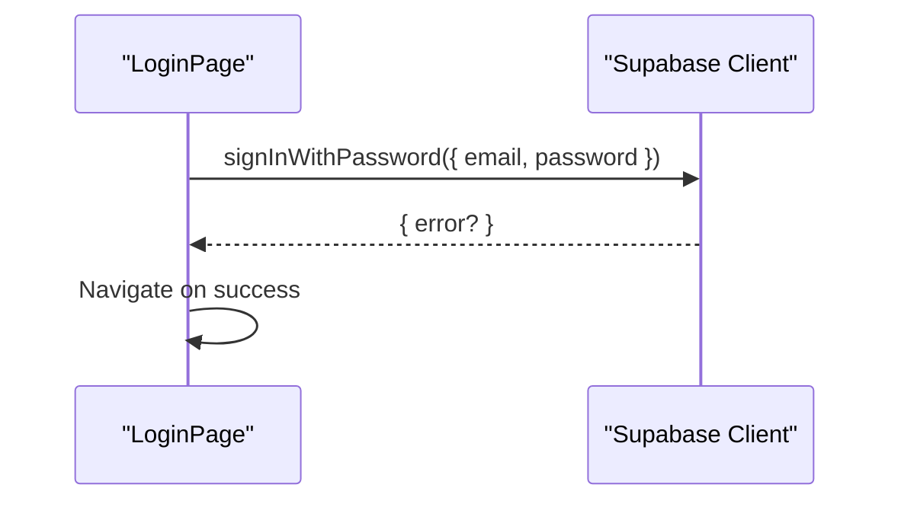
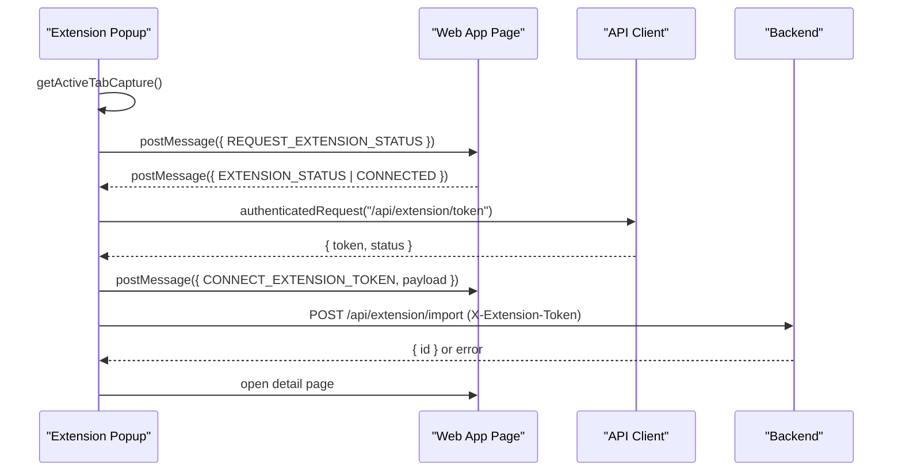
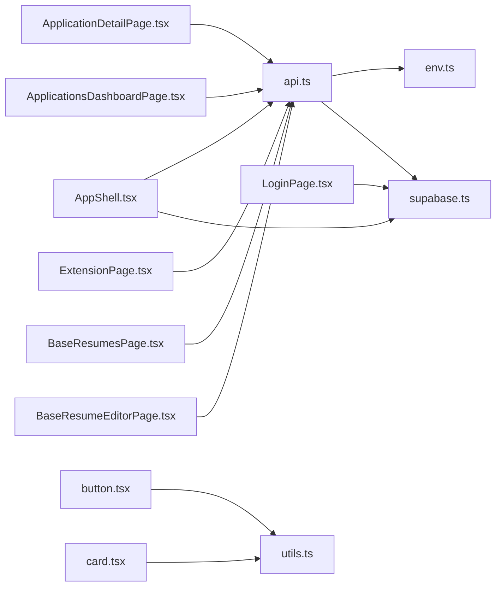

# Frontend API Documentation

<cite>
**Referenced Files in This Document**
- [api.ts](file://frontend/src/lib/api.ts)
- [supabase.ts](file://frontend/src/lib/supabase.ts)
- [env.ts](file://frontend/src/lib/env.ts)
- [workflow-contract.ts](file://frontend/src/lib/workflow-contract.ts)
- [utils.ts](file://frontend/src/lib/utils.ts)
- [chrome-extension-popup.d.ts](file://frontend/src/types/chrome-extension-popup.d.ts)
- [manifest.json](file://frontend/public/chrome-extension/manifest.json)
- [popup.js](file://frontend/public/chrome-extension/popup.js)
- [button.tsx](file://frontend/src/components/ui/button.tsx)
- [card.tsx](file://frontend/src/components/ui/card.tsx)
- [LoginPage.tsx](file://frontend/src/routes/LoginPage.tsx)
- [AppShell.tsx](file://frontend/src/routes/AppShell.tsx)
- [ExtensionPage.tsx](file://frontend/src/routes/ExtensionPage.tsx)
- [ApplicationsDashboardPage.tsx](file://frontend/src/routes/ApplicationsDashboardPage.tsx)
- [ApplicationDetailPage.tsx](file://frontend/src/routes/ApplicationDetailPage.tsx)
- [BaseResumesPage.tsx](file://frontend/src/routes/BaseResumesPage.tsx)
- [BaseResumeEditorPage.tsx](file://frontend/src/routes/BaseResumeEditorPage.tsx)
- [package.json](file://frontend/package.json)
- [main.tsx](file://frontend/src/main.tsx)
</cite>

## Update Summary
**Changes Made**
- Updated Base Resumes API section to reflect the modified deleteBaseResume function signature with force parameter defaults
- Enhanced API reference documentation to include the new force parameter behavior
- Updated user experience documentation for base resume deletion operations

## Table of Contents
1. [Introduction](#introduction)
2. [Project Structure](#project-structure)
3. [Core Components](#core-components)
4. [Architecture Overview](#architecture-overview)
5. [Detailed Component Analysis](#detailed-component-analysis)
6. [Dependency Analysis](#dependency-analysis)
7. [Performance Considerations](#performance-considerations)
8. [Troubleshooting Guide](#troubleshooting-guide)
9. [Conclusion](#conclusion)
10. [Appendices](#appendices)

## Introduction
This document provides comprehensive frontend API documentation for the AI Resume Builder application. It covers:
- API client library for authenticated requests and uploads
- Supabase integration utilities for authentication and session management
- Environment configuration and validation
- Utility functions for UI composition and data formatting
- Workflow contract types for state management
- Chrome extension popup types and integration patterns
- TypeScript type definitions, usage examples, and integration patterns
- Common usage patterns, error handling strategies, and performance optimization techniques

## Project Structure
The frontend is a React application bootstrapped with Vite and TypeScript. Key areas:
- Library modules under src/lib expose typed APIs, environment configuration, Supabase client, utilities, and workflow contracts
- Routes under src/routes implement pages for authentication, dashboard, detail, and extension management
- Components under src/components/ui provide reusable UI primitives
- The Chrome extension assets live under frontend/public/chrome-extension and integrate via a popup script and manifest



**Diagram sources**
- [main.tsx:1-14](file://frontend/src/main.tsx#L1-L14)
- [AppShell.tsx:1-89](file://frontend/src/routes/AppShell.tsx#L1-L89)
- [ApplicationDetailPage.tsx:1-1144](file://frontend/src/routes/ApplicationDetailPage.tsx#L1-L1144)
- [ApplicationsDashboardPage.tsx:1-264](file://frontend/src/routes/ApplicationsDashboardPage.tsx#L1-L264)
- [ExtensionPage.tsx:1-200](file://frontend/src/routes/ExtensionPage.tsx#L1-L200)
- [button.tsx:1-23](file://frontend/src/components/ui/button.tsx#L1-L23)
- [card.tsx:1-15](file://frontend/src/components/ui/card.tsx#L1-L15)
- [supabase.ts:1-26](file://frontend/src/lib/supabase.ts#L1-L26)
- [api.ts:1-489](file://frontend/src/lib/api.ts#L1-L489)
- [env.ts:1-15](file://frontend/src/lib/env.ts#L1-L15)
- [workflow-contract.ts:1-33](file://frontend/src/lib/workflow-contract.ts#L1-L33)
- [utils.ts:1-4](file://frontend/src/lib/utils.ts#L1-L4)
- [manifest.json:1-24](file://frontend/public/chrome-extension/manifest.json#L1-L24)
- [popup.js:1-156](file://frontend/public/chrome-extension/popup.js#L1-L156)

**Section sources**
- [main.tsx:1-14](file://frontend/src/main.tsx#L1-L14)
- [package.json:1-38](file://frontend/package.json#L1-L38)

## Core Components
This section documents the primary libraries and utilities used across the frontend.

- API client library
  - Purpose: Centralized authenticated HTTP client for backend endpoints
  - Key exports: Type definitions for application, profile, base resume, and workflow entities; authenticated request helpers; upload helper; endpoint-specific functions
  - Authentication: Injects Bearer token from Supabase session into Authorization header
  - Error handling: Parses JSON error payloads and throws descriptive errors
  - Uploads: Dedicated multipart/form-data upload helper for base resume file uploads
  - Example usage patterns:
    - Bootstrap session and fetch application lists
    - Create, patch, and manage application lifecycle
    - Trigger generation and regeneration workflows
    - Export PDFs and manage drafts
    - Manage base resumes and profile settings

- Supabase integration
  - Purpose: Singleton browser client creation with persistent session and auto-refresh
  - Key exports: Client factory and options for auth persistence and token refresh
  - Usage: Retrieve access token for API requests and sign in/out

- Environment configuration
  - Purpose: Zod-based runtime validation of environment variables
  - Key exports: Strictly typed env object with defaults for development mode and required Supabase and API URLs
  - Validation: Ensures presence and correctness of environment variables at startup

- Utilities
  - cn: Conditional class name concatenation utility for UI components
  - Additional utilities: Formatting and validation helpers as needed

- Workflow contract
  - Purpose: Typed contract for workflow-visible statuses, internal states, failure reasons, and mapping rules
  - Key exports: Parsed contract object and visible status identifiers
  - Usage: Enforces type-safe status transitions and UI rendering

**Section sources**
- [api.ts:1-489](file://frontend/src/lib/api.ts#L1-L489)
- [supabase.ts:1-26](file://frontend/src/lib/supabase.ts#L1-L26)
- [env.ts:1-15](file://frontend/src/lib/env.ts#L1-L15)
- [utils.ts:1-4](file://frontend/src/lib/utils.ts#L1-L4)
- [workflow-contract.ts:1-33](file://frontend/src/lib/workflow-contract.ts#L1-L33)

## Architecture Overview
The frontend integrates three major subsystems:
- Supabase Auth for session management
- Internal API client for backend operations
- Chrome extension for browser-based job capture



**Diagram sources**
- [api.ts:177-214](file://frontend/src/lib/api.ts#L177-L214)
- [supabase.ts:15-25](file://frontend/src/lib/supabase.ts#L15-L25)
- [env.ts:14-15](file://frontend/src/lib/env.ts#L14-L15)

## Detailed Component Analysis

### API Client Library
The API client centralizes all backend interactions with consistent authentication and error handling.

Key capabilities:
- Session bootstrap and application lifecycle management
- Extraction progress monitoring and duplicate resolution
- Base resume CRUD and upload
- Profile management
- Generation and regeneration workflows
- Draft management and PDF export

Type definitions:
- SessionBootstrapResponse: user, profile, and workflow contract version
- ApplicationSummary/ApplicationDetail: job metadata, status, failure details, duplicates, timestamps
- BaseResumeSummary/BaseResumeDetail: resume metadata and content
- ProfileData/ProfileUpdatePayload: profile fields and update payload
- Workflow progress and extension connection status types

Request configuration:
- Uses env.VITE_API_URL for base URL
- Injects Authorization: Bearer <access_token> from Supabase session
- Serializes JSON bodies and handles JSON responses
- Throws descriptive errors derived from server JSON payloads

Uploads:
- FormData-based uploads for resume files with optional cleanup flag

Usage examples:
- Dashboard: listApplications, createApplication, patchApplication
- Detail page: fetchApplicationDetail, fetchApplicationProgress, triggerGeneration, exportPdf
- Extension: fetchExtensionStatus, issueExtensionToken, revokeExtensionToken



**Diagram sources**
- [api.ts:177-214](file://frontend/src/lib/api.ts#L177-L214)

**Section sources**
- [api.ts:1-489](file://frontend/src/lib/api.ts#L1-L489)

### Supabase Integration Utilities
Supabase client initialization and session retrieval:
- Singleton client with persisted session and auto-refresh enabled
- Uses sessionStorage for browser environments
- Provides getSupabaseBrowserClient() to retrieve the initialized client

Authentication flow:
- LoginPage uses Supabase auth to sign in with password
- AppShell fetches session bootstrap data after mount



**Diagram sources**
- [LoginPage.tsx:17-36](file://frontend/src/routes/LoginPage.tsx#L17-L36)
- [supabase.ts:15-25](file://frontend/src/lib/supabase.ts#L15-L25)

**Section sources**
- [supabase.ts:1-26](file://frontend/src/lib/supabase.ts#L1-L26)
- [LoginPage.tsx:1-111](file://frontend/src/routes/LoginPage.tsx#L1-L111)
- [AppShell.tsx:1-89](file://frontend/src/routes/AppShell.tsx#L1-L89)

### Environment Configuration Utilities
Runtime validation of environment variables:
- Schema enforces VITE_APP_ENV, VITE_APP_DEV_MODE, VITE_SUPABASE_URL, VITE_SUPABASE_ANON_KEY, VITE_API_URL
- Defaults applied for development mode flags
- Parsed env object exported for use across modules

Integration:
- API client reads VITE_API_URL
- Login page displays environment info

**Section sources**
- [env.ts:1-15](file://frontend/src/lib/env.ts#L1-L15)
- [api.ts:1-3](file://frontend/src/lib/api.ts#L1-L3)
- [LoginPage.tsx:59-61](file://frontend/src/routes/LoginPage.tsx#L59-L61)

### Utility Functions
- cn: Compose conditional class names for UI components
- Used across button and card components to merge variants and dynamic classes

**Section sources**
- [utils.ts:1-4](file://frontend/src/lib/utils.ts#L1-L4)
- [button.tsx:1-23](file://frontend/src/components/ui/button.tsx#L1-L23)
- [card.tsx:1-15](file://frontend/src/components/ui/card.tsx#L1-L15)

### Workflow Contract Types and Interfaces
Typed workflow contract:
- Defines visible statuses, internal states, failure reasons, workflow kinds, mapping rules, and progress schema
- Exposes parsed contract object and visible status identifiers
- Enables type-safe rendering and state transitions

**Section sources**
- [workflow-contract.ts:1-33](file://frontend/src/lib/workflow-contract.ts#L1-L33)

### Chrome Extension Popup Types and Interfaces
Extension integration:
- Manifest defines permissions, host permissions, action popup, and content script
- Popup script builds import request payloads, normalizes origins, validates trusted app URLs, and communicates with the web app
- Frontend routes communicate with the extension via postMessage and token exchange

Types:
- Chrome extension popup module declaration defines function signatures for building import requests and origin checks



**Diagram sources**
- [manifest.json:1-24](file://frontend/public/chrome-extension/manifest.json#L1-L24)
- [popup.js:1-156](file://frontend/public/chrome-extension/popup.js#L1-L156)
- [ExtensionPage.tsx:35-72](file://frontend/src/routes/ExtensionPage.tsx#L35-L72)
- [api.ts:312-326](file://frontend/src/lib/api.ts#L312-L326)

**Section sources**
- [chrome-extension-popup.d.ts:1-20](file://frontend/src/types/chrome-extension-popup.d.ts#L1-L20)
- [manifest.json:1-24](file://frontend/public/chrome-extension/manifest.json#L1-L24)
- [popup.js:1-156](file://frontend/public/chrome-extension/popup.js#L1-L156)
- [ExtensionPage.tsx:1-200](file://frontend/src/routes/ExtensionPage.tsx#L1-L200)

### Component APIs
Reusable UI components:
- Button: variant prop supports primary and secondary styles; merges conditional classes via cn
- Card: consistent rounded panel styling with backdrop blur and shadow

Integration patterns:
- Pass className to augment default styles
- Use disabled state to prevent double submissions

**Section sources**
- [button.tsx:1-23](file://frontend/src/components/ui/button.tsx#L1-L23)
- [card.tsx:1-15](file://frontend/src/components/ui/card.tsx#L1-L15)

### Hook Implementations
While the codebase primarily uses functional components with hooks, notable patterns include:
- AppShell: fetchSessionBootstrap on mount and sign-out handler
- ApplicationsDashboardPage: listApplications on mount, optimistic UI updates for applied toggle, filtering and sorting
- ApplicationDetailPage: fetch detail on mount, progress polling, draft fetching, generation triggers, PDF export, and optimistic UI updates

Common patterns:
- useEffect for data fetching and polling intervals
- Optimistic updates with rollback on error
- Debounced or deferred updates for search inputs
- Controlled form state with structured state objects

**Section sources**
- [AppShell.tsx:1-89](file://frontend/src/routes/AppShell.tsx#L1-L89)
- [ApplicationsDashboardPage.tsx:1-264](file://frontend/src/routes/ApplicationsDashboardPage.tsx#L1-L264)
- [ApplicationDetailPage.tsx:1-1144](file://frontend/src/routes/ApplicationDetailPage.tsx#L1-L1144)

## Dependency Analysis
Module-level dependencies and relationships:



**Diagram sources**
- [api.ts:1-3](file://frontend/src/lib/api.ts#L1-L3)
- [env.ts:1-15](file://frontend/src/lib/env.ts#L1-L15)
- [supabase.ts:1-26](file://frontend/src/lib/supabase.ts#L1-L26)
- [AppShell.tsx:1-89](file://frontend/src/routes/AppShell.tsx#L1-L89)
- [ApplicationDetailPage.tsx:1-1144](file://frontend/src/routes/ApplicationDetailPage.tsx#L1-L1144)
- [ApplicationsDashboardPage.tsx:1-264](file://frontend/src/routes/ApplicationsDashboardPage.tsx#L1-L264)
- [ExtensionPage.tsx:1-200](file://frontend/src/routes/ExtensionPage.tsx#L1-L200)
- [LoginPage.tsx:1-111](file://frontend/src/routes/LoginPage.tsx#L1-L111)
- [button.tsx:1-23](file://frontend/src/components/ui/button.tsx#L1-L23)
- [card.tsx:1-15](file://frontend/src/components/ui/card.tsx#L1-L15)
- [utils.ts:1-4](file://frontend/src/lib/utils.ts#L1-L4)
- [BaseResumesPage.tsx:1-192](file://frontend/src/routes/BaseResumesPage.tsx#L1-L192)
- [BaseResumeEditorPage.tsx:1-355](file://frontend/src/routes/BaseResumeEditorPage.tsx#L1-L355)

**Section sources**
- [api.ts:1-489](file://frontend/src/lib/api.ts#L1-L489)
- [supabase.ts:1-26](file://frontend/src/lib/supabase.ts#L1-L26)
- [env.ts:1-15](file://frontend/src/lib/env.ts#L1-L15)
- [button.tsx:1-23](file://frontend/src/components/ui/button.tsx#L1-L23)
- [card.tsx:1-15](file://frontend/src/components/ui/card.tsx#L1-L15)
- [AppShell.tsx:1-89](file://frontend/src/routes/AppShell.tsx#L1-L89)
- [ApplicationDetailPage.tsx:1-1144](file://frontend/src/routes/ApplicationDetailPage.tsx#L1-L1144)
- [ApplicationsDashboardPage.tsx:1-264](file://frontend/src/routes/ApplicationsDashboardPage.tsx#L1-L264)
- [ExtensionPage.tsx:1-200](file://frontend/src/routes/ExtensionPage.tsx#L1-L200)
- [LoginPage.tsx:1-111](file://frontend/src/routes/LoginPage.tsx#L1-L111)
- [BaseResumesPage.tsx:1-192](file://frontend/src/routes/BaseResumesPage.tsx#L1-L192)
- [BaseResumeEditorPage.tsx:1-355](file://frontend/src/routes/BaseResumeEditorPage.tsx#L1-L355)

## Performance Considerations
- Polling intervals: Progress polling runs at 2-second intervals; adjust based on UX requirements
- Optimistic UI: Apply temporary state changes and roll back on error to reduce perceived latency
- Deferred updates: Use deferred values for search inputs to avoid excessive re-renders
- Controlled components: Minimize unnecessary renders by structuring state objects and avoiding anonymous callbacks
- Memoization: Consider memoizing derived data (filters, sorts) when lists grow large
- Network efficiency: Batch small updates (e.g., notes autosave) with debouncing to reduce request volume

## Troubleshooting Guide
Common issues and resolutions:
- Missing session token: Ensure Supabase session exists before calling authenticated endpoints
- Environment misconfiguration: Verify VITE_SUPABASE_URL, VITE_SUPABASE_ANON_KEY, and VITE_API_URL are present and valid
- Extension token errors: On 401 during import, remove stored token and reconnect from the extension page
- Upload failures: Confirm FormData construction and optional cleanup flag usage
- PDF export errors: Catch and display user-friendly messages when export fails

**Section sources**
- [api.ts:177-238](file://frontend/src/lib/api.ts#L177-L238)
- [popup.js:118-126](file://frontend/public/chrome-extension/popup.js#L118-L126)
- [env.ts:1-15](file://frontend/src/lib/env.ts#L1-L15)

## Conclusion
The frontend API provides a robust, type-safe foundation for interacting with the backend, managing Supabase authentication, and integrating with a Chrome extension. By leveraging the provided utilities, components, and patterns, developers can implement reliable data fetching, state management, and user experiences while maintaining strong typing and predictable error handling.

## Appendices

### API Reference Summary
- Session and profile
  - fetchSessionBootstrap
  - fetchProfile, updateProfile
- Applications
  - listApplications, createApplication, fetchApplicationDetail, patchApplication
  - retryExtraction, submitManualEntry, resolveDuplicate
  - fetchApplicationProgress
  - recoverApplicationFromSource
- Base resumes
  - listBaseResumes, createBaseResume, fetchBaseResume, updateBaseResume, deleteBaseResume(**Updated**)
  - setDefaultBaseResume, uploadBaseResume
- Generation and export
  - triggerGeneration, fetchDraft, saveDraft
  - triggerFullRegeneration, triggerSectionRegeneration
  - exportPdf
- Extension
  - fetchExtensionStatus, issueExtensionToken, revokeExtensionToken

**Updated** The deleteBaseResume function now includes a force parameter with a default value of true, improving user experience by simplifying the deletion process while maintaining backward compatibility.

**Section sources**
- [api.ts:240-489](file://frontend/src/lib/api.ts#L240-L489)
- [api.ts:774-796](file://frontend/src/lib/api.ts#L774-L796)

### Base Resumes API Reference
The base resumes API provides comprehensive CRUD operations for managing resume templates:

#### Base Resume Operations
- **listBaseResumes**: Retrieve all base resumes with summary information
- **createBaseResume**: Create a new base resume with name and content
- **fetchBaseResume**: Retrieve detailed information for a specific base resume
- **updateBaseResume**: Update name and/or content of an existing base resume
- **deleteBaseResume**: Delete a base resume with optional force parameter (**Updated**)
- **setDefaultBaseResume**: Set a base resume as the default template
- **uploadBaseResume**: Upload and parse a PDF resume with optional AI cleanup

#### Enhanced Delete Operation
The deleteBaseResume function signature has been updated to include a force parameter:

```typescript
export async function deleteBaseResume(resumeId: string, force: boolean = true): Promise<void>
```

**Behavior Changes**:
- **Default Force Parameter**: The force parameter defaults to `true`, meaning deletions will proceed even with dependencies by default
- **Backward Compatibility**: Existing code continues to work without modification
- **Explicit Control**: Developers can still pass `false` to disable forceful deletion when needed
- **Improved User Experience**: Simplified deletion process reduces friction for users

**Usage Examples**:
```typescript
// Default behavior (force = true)
await deleteBaseResume(resumeId);

// Explicit force parameter
await deleteBaseResume(resumeId, true);
await deleteBaseResume(resumeId, false);
```

**Section sources**
- [api.ts:747-816](file://frontend/src/lib/api.ts#L747-L816)
- [BaseResumesPage.tsx:51-66](file://frontend/src/routes/BaseResumesPage.tsx#L51-L66)
- [BaseResumeEditorPage.tsx:122-135](file://frontend/src/routes/BaseResumeEditorPage.tsx#L122-L135)