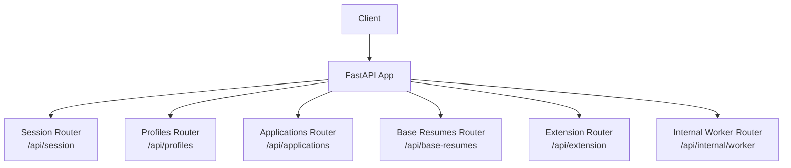
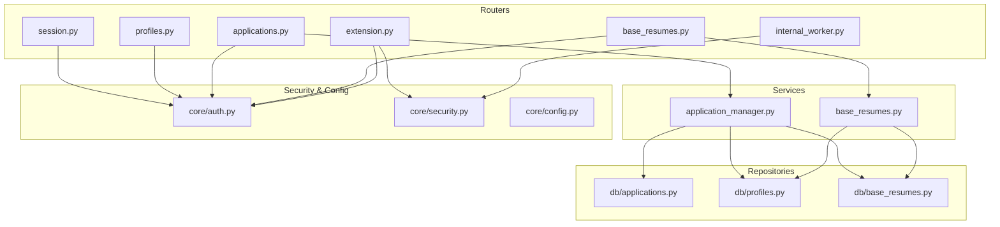
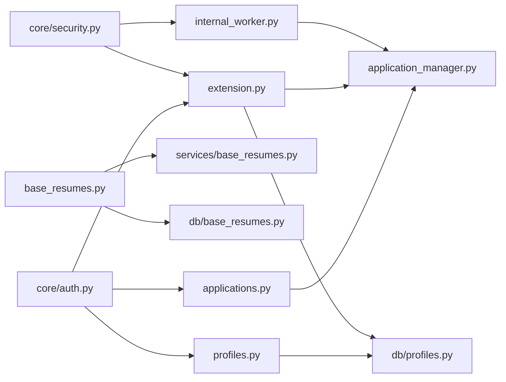

# REST API Endpoints

<cite>
**Referenced Files in This Document**
- [backend/app/main.py](file://backend/app/main.py)
- [backend/app/core/auth.py](file://backend/app/core/auth.py)
- [backend/app/core/security.py](file://backend/app/core/security.py)
- [backend/app/core/config.py](file://backend/app/core/config.py)
- [backend/app/api/session.py](file://backend/app/api/session.py)
- [backend/app/api/profiles.py](file://backend/app/api/profiles.py)
- [backend/app/api/applications.py](file://backend/app/api/applications.py)
- [backend/app/api/base_resumes.py](file://backend/app/api/base_resumes.py)
- [backend/app/api/extension.py](file://backend/app/api/extension.py)
- [backend/app/api/internal_worker.py](file://backend/app/api/internal_worker.py)
- [backend/app/db/applications.py](file://backend/app/db/applications.py)
- [backend/app/db/profiles.py](file://backend/app/db/profiles.py)
- [backend/app/db/base_resumes.py](file://backend/app/db/base_resumes.py)
- [backend/app/services/application_manager.py](file://backend/app/services/application_manager.py)
- [backend/app/services/base_resumes.py](file://backend/app/services/base_resumes.py)
</cite>

## Table of Contents
1. [Introduction](#introduction)
2. [Project Structure](#project-structure)
3. [Core Components](#core-components)
4. [Architecture Overview](#architecture-overview)
5. [Detailed Component Analysis](#detailed-component-analysis)
6. [Dependency Analysis](#dependency-analysis)
7. [Performance Considerations](#performance-considerations)
8. [Troubleshooting Guide](#troubleshooting-guide)
9. [Conclusion](#conclusion)
10. [Appendices](#appendices)

## Introduction
This document provides comprehensive REST API documentation for the backend. It covers authentication, session management, application lifecycle, profile management, base resume templates, Chrome extension integration, and internal worker callbacks. For each endpoint group, you will find HTTP methods, URL patterns, request/response schemas, validation rules, error codes, and practical examples.

## Project Structure
The backend is a FastAPI application that mounts routers for session, profiles, applications, base resumes, extension, and internal worker endpoints. CORS is configured via environment variables.

**Diagram sources**
- [backend/app/main.py:14-36](file://backend/app/main.py#L14-L36)

**Section sources**
- [backend/app/main.py:14-36](file://backend/app/main.py#L14-L36)

## Core Components
- Authentication: JWT-based using Supabase Auth. Tokens are validated against JWKS or a shared secret.
- Security: Extension token hashing and verification; worker secret header verification.
- CORS: Configurable origins and support for Chrome extension origins.
- Routers: Mounted under /api with distinct tags for grouping.

Key behaviors:
- All authenticated endpoints require a Bearer token in the Authorization header.
- Extension endpoints require X-Extension-Token header and are scoped to the token owner.
- Internal worker endpoints require X-Worker-Secret header.

**Section sources**
- [backend/app/core/auth.py:72-90](file://backend/app/core/auth.py#L72-L90)
- [backend/app/core/security.py:13-54](file://backend/app/core/security.py#L13-L54)
- [backend/app/main.py:15-22](file://backend/app/main.py#L15-L22)

## Architecture Overview
The API follows a layered architecture:
- Routers define endpoints and bind Pydantic models for validation.
- Services encapsulate business logic and orchestrate repositories and external systems.
- Repositories manage database operations.
- Configuration and security utilities provide environment-driven behavior.

**Diagram sources**
- [backend/app/api/session.py:12](file://backend/app/api/session.py#L12)
- [backend/app/api/profiles.py:11](file://backend/app/api/profiles.py#L11)
- [backend/app/api/applications.py:21](file://backend/app/api/applications.py#L21)
- [backend/app/api/base_resumes.py:12](file://backend/app/api/base_resumes.py#L12)
- [backend/app/api/extension.py:27](file://backend/app/api/extension.py#L27)
- [backend/app/api/internal_worker.py:16](file://backend/app/api/internal_worker.py#L16)
- [backend/app/services/application_manager.py:143-800](file://backend/app/services/application_manager.py#L143-L800)
- [backend/app/services/base_resumes.py:32-154](file://backend/app/services/base_resumes.py#L32-L154)
- [backend/app/db/applications.py:123-328](file://backend/app/db/applications.py#L123-L328)
- [backend/app/db/profiles.py:38-225](file://backend/app/db/profiles.py#L38-L225)
- [backend/app/db/base_resumes.py:31-184](file://backend/app/db/base_resumes.py#L31-L184)
- [backend/app/core/auth.py:22-90](file://backend/app/core/auth.py#L22-L90)
- [backend/app/core/security.py:13-54](file://backend/app/core/security.py#L13-L54)
- [backend/app/core/config.py:35-97](file://backend/app/core/config.py#L35-L97)

## Detailed Component Analysis

### Authentication and Security
- JWT Validation
  - Uses Supabase JWKS URL when available; falls back to shared secret if configured.
  - Verifies audience and issuer when configured.
  - Exposes AuthenticatedUser with id, email, role, and claims.
- Headers
  - Authorization: Bearer <token>
  - X-Extension-Token: Provided by extension token endpoints
  - X-Worker-Secret: Required for internal worker callbacks
- CORS
  - Origins configurable via environment; supports Chrome extension origins.

**Section sources**
- [backend/app/core/auth.py:22-90](file://backend/app/core/auth.py#L22-L90)
- [backend/app/core/security.py:13-54](file://backend/app/core/security.py#L13-L54)
- [backend/app/main.py:15-22](file://backend/app/main.py#L15-L22)
- [backend/app/core/config.py:35-97](file://backend/app/core/config.py#L35-L97)

### Session Management Endpoints
Purpose: Bootstrap authenticated session with user, profile, and workflow contract version.

- GET /api/session/bootstrap
  - Description: Returns user identity, profile, and workflow contract version.
  - Authentication: Bearer token required.
  - Response Schema:
    - user: id, email, role
    - profile: profile record fields
    - workflow_contract_version: string
  - Errors:
    - 503 Service Unavailable if profile is missing.

Example request:
- Headers: Authorization: Bearer <token>
- Response: JSON with user, profile, workflow_contract_version

**Section sources**
- [backend/app/api/session.py:27-45](file://backend/app/api/session.py#L27-L45)
- [backend/app/db/profiles.py:47-68](file://backend/app/db/profiles.py#L47-L68)

### Application CRUD and Workflow Endpoints
Purpose: Manage job application lifecycle, including creation, updates, duplicate detection, extraction, generation, regeneration, drafts, and exports.

- GET /api/applications
  - Query: search (optional), visible_status (optional)
  - Response: array of ApplicationSummary
  - Validation: Filters applied server-side
- POST /api/applications
  - Request: job_url (required)
  - Response: ApplicationDetail
  - Behavior: Creates application and enqueues extraction
- GET /api/applications/{application_id}
  - Response: ApplicationDetail
- PATCH /api/applications/{application_id}
  - Request: Partial fields (applied, notes, job_title, company, job_description, job_posting_origin, job_posting_origin_other_text, base_resume_id)
  - Validation: At least one field required; trims whitespace; validates “other” origin requirement
  - Response: ApplicationDetail
- POST /api/applications/{application_id}/retry-extraction
  - Response: ApplicationDetail
- POST /api/applications/{application_id}/manual-entry
  - Request: job_title, company, job_description, job_posting_origin, job_posting_origin_other_text, notes
  - Validation: Non-blank fields; “other” origin requires text
  - Response: ApplicationDetail
- POST /api/applications/{application_id}/recover-from-source
  - Request: source_text (required), optional source_url, page_title, meta, json_ld, captured_at
  - Validation: Non-blank source_text; trims optional strings
  - Response: ApplicationDetail
- POST /api/applications/{application_id}/duplicate-resolution
  - Request: resolution (“dismissed” | “redirected”)
  - Validation: Enum check
  - Response: ApplicationDetail
- GET /api/applications/{application_id}/progress
  - Response: WorkflowProgress
- GET /api/applications/{application_id}/draft
  - Response: ResumeDraftResponse (nullable)
- POST /api/applications/{application_id}/generate
  - Request: base_resume_id (required), target_length (“1_page” | “2_page” | “3_page”), aggressiveness (“low” | “medium” | “high”), additional_instructions (optional)
  - Validation: Enum checks; trims instructions
  - Response: ApplicationDetail
- POST /api/applications/{application_id}/regenerate
  - Request: target_length, aggressiveness, additional_instructions
  - Validation: Enum checks; trims instructions
  - Response: ApplicationDetail
- POST /api/applications/{application_id}/regenerate-section
  - Request: section_name (required), instructions (required)
  - Validation: Non-blank section and instructions
  - Response: ApplicationDetail
- PUT /api/applications/{application_id}/draft
  - Request: content (required)
  - Validation: Non-blank content
  - Response: ResumeDraftResponse
- GET /api/applications/{application_id}/export-pdf
  - Response: application/pdf attachment

Common Responses and Errors:
- 400 Bad Request: Validation errors
- 404 Not Found: Resource not found
- 409 Conflict: Permission issues (e.g., duplicate resolution unavailable)
- 500 Internal Server Error: Unexpected failures

Example requests and responses:
- Create application:
  - Method: POST
  - URL: /api/applications
  - Headers: Authorization: Bearer <token>
  - Body: { "job_url": "https://example.com/jobs/123" }
  - Response: ApplicationDetail
- Export PDF:
  - Method: GET
  - URL: /api/applications/{application_id}/export-pdf
  - Headers: Authorization: Bearer <token>
  - Response: application/pdf attachment

**Section sources**
- [backend/app/api/applications.py:369-661](file://backend/app/api/applications.py#L369-L661)
- [backend/app/services/application_manager.py:143-800](file://backend/app/services/application_manager.py#L143-L800)
- [backend/app/db/applications.py:123-328](file://backend/app/db/applications.py#L123-L328)

### Profile Management Endpoints
Purpose: Retrieve and update user profile, including preferences and ordering of resume sections.

- GET /api/profiles
  - Response: ProfileResponse
  - Errors: 404 Not Found if profile does not exist
- PATCH /api/profiles
  - Request: Optional fields (name, phone, address, section_preferences, section_order)
  - Validation: Normalizes whitespace; validates section preferences keys and order uniqueness/values
  - Response: ProfileResponse

Example:
- PATCH /api/profiles
  - Headers: Authorization: Bearer <token>
  - Body: { "section_preferences": { "summary": true }, "section_order": ["summary"] }
  - Response: ProfileResponse

**Section sources**
- [backend/app/api/profiles.py:77-113](file://backend/app/api/profiles.py#L77-L113)
- [backend/app/db/profiles.py:47-68](file://backend/app/db/profiles.py#L47-L68)

### Base Resume Endpoints
Purpose: Manage base resume templates (create, list, upload, retrieve, update, delete, set default).

- GET /api/base-resumes
  - Response: array of BaseResumeSummary
- POST /api/base-resumes
  - Request: name, content_md
  - Validation: Non-blank name
  - Response: BaseResumeDetail
- POST /api/base-resumes/upload
  - Form fields: file (PDF), name, use_llm_cleanup (boolean)
  - Validation: PDF file type/content; size ≤ 10MB; parses and optionally cleans up with LLM
  - Response: BaseResumeDetail
- GET /api/base-resumes/{resume_id}
  - Response: BaseResumeDetail
- PATCH /api/base-resumes/{resume_id}
  - Request: Optional name, content_md
  - Validation: Non-blank name if provided
  - Response: BaseResumeDetail
- DELETE /api/base-resumes/{resume_id}?force={bool}
  - Validation: Ownership; prevents deletion if referenced unless force=true
  - Response: No content
- POST /api/base-resumes/{resume_id}/set-default
  - Response: BaseResumeSummary

Example:
- POST /api/base-resumes/upload
  - Headers: Authorization: Bearer <token>
  - Form: name, file (PDF), use_llm_cleanup=false
  - Response: BaseResumeDetail

**Section sources**
- [backend/app/api/base_resumes.py:85-242](file://backend/app/api/base_resumes.py#L85-L242)
- [backend/app/services/base_resumes.py:32-154](file://backend/app/services/base_resumes.py#L32-L154)
- [backend/app/db/base_resumes.py:40-184](file://backend/app/db/base_resumes.py#L40-L184)

### Extension Integration Endpoints
Purpose: Enable Chrome extension to connect, issue/revoke tokens, and import captured job applications.

- GET /api/extension/status
  - Response: ExtensionConnectionStatus (connected, token_created_at, token_last_used_at)
  - Errors: 503 if profile is unavailable
- POST /api/extension/token
  - Response: ExtensionTokenResponse (token, status)
  - Notes: Issues a new token hashed and stored
- DELETE /api/extension/token
  - Response: ExtensionConnectionStatus
- POST /api/extension/import
  - Request: job_url, source_text, optional page_title, source_url, meta, json_ld, captured_at
  - Validation: Non-blank source_text; trims optional strings
  - Response: ApplicationDetail
  - Authentication: Requires X-Extension-Token header verified against stored hash

Example:
- POST /api/extension/import
  - Headers: X-Extension-Token: <token>
  - Body: { "job_url": "...", "source_text": "..." }
  - Response: ApplicationDetail

**Section sources**
- [backend/app/api/extension.py:79-141](file://backend/app/api/extension.py#L79-L141)
- [backend/app/core/security.py:30-54](file://backend/app/core/security.py#L30-L54)
- [backend/app/db/profiles.py:70-157](file://backend/app/db/profiles.py#L70-L157)

### Internal Worker Callback Endpoints
Purpose: Receive asynchronous callbacks from workers to update extraction and generation states.

- POST /api/internal/worker/extraction-callback
  - Request: WorkerCallbackPayload
  - Authentication: X-Worker-Secret header must match configured secret
  - Response: {"status": "accepted"}
- POST /api/internal/worker/generation-callback
  - Request: GenerationCallbackPayload
  - Authentication: X-Worker-Secret header must match configured secret
  - Response: {"status": "accepted"}
- POST /api/internal/worker/regeneration-callback
  - Request: RegenerationCallbackPayload
  - Authentication: X-Worker-Secret header must match configured secret
  - Response: {"status": "accepted"}

Example:
- POST /api/internal/worker/extraction-callback
  - Headers: X-Worker-Secret: <secret>
  - Body: WorkerCallbackPayload
  - Response: {"status": "accepted"}

**Section sources**
- [backend/app/api/internal_worker.py:19-71](file://backend/app/api/internal_worker.py#L19-L71)
- [backend/app/core/security.py:13-23](file://backend/app/core/security.py#L13-L23)
- [backend/app/services/application_manager.py:455-720](file://backend/app/services/application_manager.py#L455-L720)

## Dependency Analysis
- Endpoint-to-Service mapping:
  - Applications endpoints depend on ApplicationService for business logic and repositories for persistence.
  - Base resumes endpoints depend on BaseResumeService and repositories.
  - Extension endpoints depend on ProfileRepository and ApplicationService.
  - Internal worker endpoints depend on ApplicationService and verify worker secret.
- Authentication and security:
  - AuthenticatedUser is injected via get_current_user for most endpoints.
  - Extension endpoints use verify_extension_token and hash_extension_token.
  - Internal worker endpoints use verify_worker_secret.

**Diagram sources**
- [backend/app/api/applications.py:21](file://backend/app/api/applications.py#L21)
- [backend/app/api/profiles.py:11](file://backend/app/api/profiles.py#L11)
- [backend/app/api/base_resumes.py:12](file://backend/app/api/base_resumes.py#L12)
- [backend/app/api/extension.py:27](file://backend/app/api/extension.py#L27)
- [backend/app/api/internal_worker.py:16](file://backend/app/api/internal_worker.py#L16)
- [backend/app/services/application_manager.py:143-800](file://backend/app/services/application_manager.py#L143-L800)
- [backend/app/services/base_resumes.py:32-154](file://backend/app/services/base_resumes.py#L32-L154)
- [backend/app/db/profiles.py:38-225](file://backend/app/db/profiles.py#L38-L225)
- [backend/app/db/base_resumes.py:31-184](file://backend/app/db/base_resumes.py#L31-L184)
- [backend/app/core/auth.py:22-90](file://backend/app/core/auth.py#L22-L90)
- [backend/app/core/security.py:13-54](file://backend/app/core/security.py#L13-L54)

**Section sources**
- [backend/app/api/applications.py:21](file://backend/app/api/applications.py#L21)
- [backend/app/api/base_resumes.py:12](file://backend/app/api/base_resumes.py#L12)
- [backend/app/api/extension.py:27](file://backend/app/api/extension.py#L27)
- [backend/app/api/internal_worker.py:16](file://backend/app/api/internal_worker.py#L16)

## Performance Considerations
- Pagination and filtering:
  - Applications listing supports search and status filters to reduce payload sizes.
- Asynchronous workflows:
  - Extraction and generation enqueue jobs; progress is tracked via Redis-backed progress store.
- File uploads:
  - PDF upload endpoint enforces size limits and optional LLM cleanup to balance quality and latency.
- Caching:
  - AuthVerifier uses LRU cache for JWK client.

[No sources needed since this section provides general guidance]

## Troubleshooting Guide
Common errors and resolutions:
- 401 Unauthorized
  - Missing or invalid Bearer token; invalid X-Extension-Token; missing/invalid X-Worker-Secret.
- 400 Bad Request
  - Validation failures (blank fields, invalid enums, invalid content type, invalid PDF).
- 404 Not Found
  - Resource not found (application, profile, base resume).
- 409 Conflict
  - Permission-related conflicts (e.g., duplicate resolution unavailable).
- 503 Service Unavailable
  - Profile unavailable during session bootstrap or extension status retrieval.

Operational checks:
- Verify Authorization header format: Bearer <token>.
- Confirm CORS origins include your frontend origin and Chrome extension ID if applicable.
- Ensure X-Worker-Secret matches the configured secret for internal callbacks.

**Section sources**
- [backend/app/api/applications.py:359-367](file://backend/app/api/applications.py#L359-L367)
- [backend/app/api/base_resumes.py:120-144](file://backend/app/api/base_resumes.py#L120-L144)
- [backend/app/api/extension.py:86-90](file://backend/app/api/extension.py#L86-L90)
- [backend/app/core/security.py:13-23](file://backend/app/core/security.py#L13-L23)

## Conclusion
The backend exposes a cohesive set of REST endpoints for managing job applications, user profiles, base resumes, and integrating with a Chrome extension and internal workers. Authentication relies on JWT validation, while extension and worker endpoints use specialized headers. Robust validation and clear error responses enable reliable client integrations.

[No sources needed since this section summarizes without analyzing specific files]

## Appendices

### Authentication Methods
- JWT via Supabase:
  - Header: Authorization: Bearer <token>
  - Validation: RS256/ES256/HS256; audience and issuer checks when configured; fallback to shared secret
- Extension token:
  - Header: X-Extension-Token: <token>
  - Hashed and stored; verified against profile record
- Worker secret:
  - Header: X-Worker-Secret: <secret>
  - Matches configured secret

**Section sources**
- [backend/app/core/auth.py:22-90](file://backend/app/core/auth.py#L22-L90)
- [backend/app/core/security.py:13-54](file://backend/app/core/security.py#L13-L54)

### CORS Configuration
- Origins: From environment variable CORS_ORIGINS
- Chrome extension support: allow chrome-extension://.*
- Credentials, methods, and headers allowed for all

**Section sources**
- [backend/app/main.py:15-22](file://backend/app/main.py#L15-L22)
- [backend/app/core/config.py:47-91](file://backend/app/core/config.py#L47-L91)

### Endpoint Examples

- Session bootstrap
  - curl -H "Authorization: Bearer $TOKEN" https://your-api.example.com/api/session/bootstrap

- List applications
  - curl -H "Authorization: Bearer $TOKEN" "https://your-api.example.com/api/applications?search=data&visible_status=draft"

- Create application
  - curl -X POST -H "Authorization: Bearer $TOKEN" -H "Content-Type: application/json" -d '{"job_url":"https://example.com/jobs/123"}' https://your-api.example.com/api/applications

- Import from extension
  - curl -X POST -H "X-Extension-Token: $EXT_TOKEN" -H "Content-Type: application/json" -d '{"job_url":"...","source_text":"..."}' https://your-api.example.com/api/extension/import

- Set default base resume
  - curl -X POST -H "Authorization: Bearer $TOKEN" https://your-api.example.com/api/base-resumes/{resume_id}/set-default

- Internal worker callback
  - curl -X POST -H "X-Worker-Secret: $SECRET" -H "Content-Type: application/json" -d '{}' https://your-api.example.com/api/internal/worker/extraction-callback

[No sources needed since this section provides examples without quoting specific code]