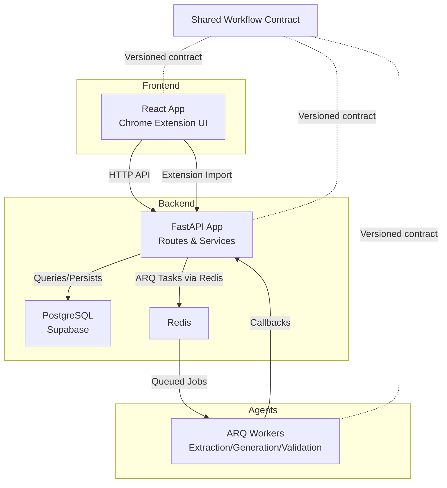
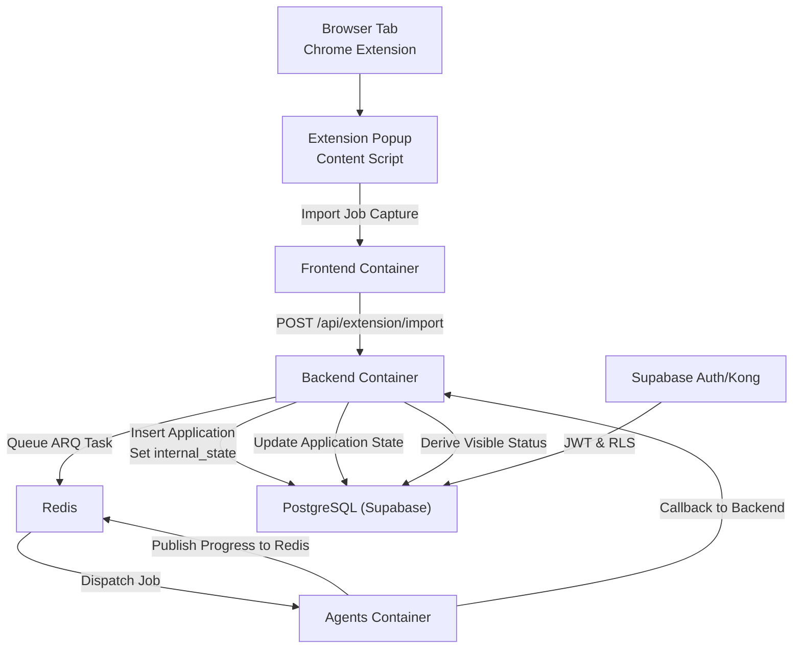
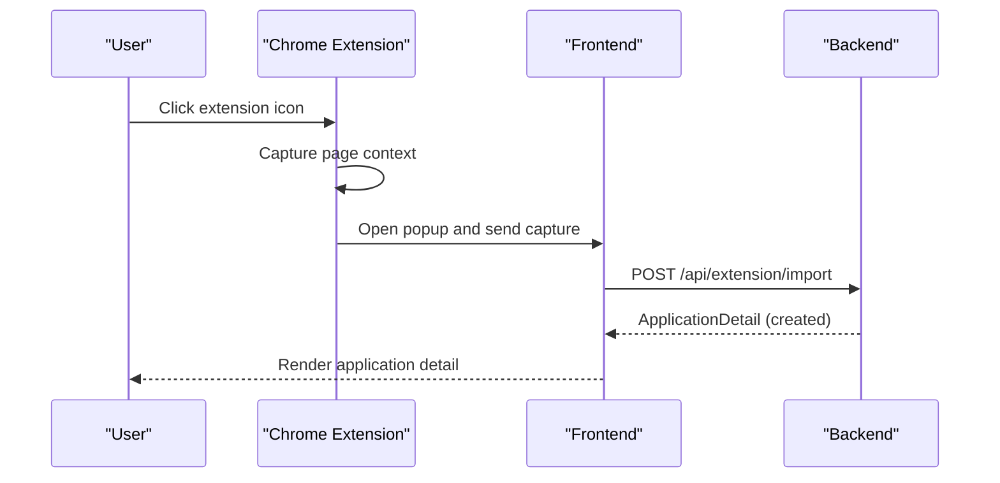
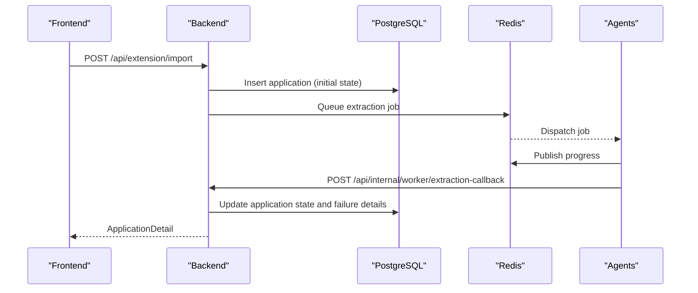
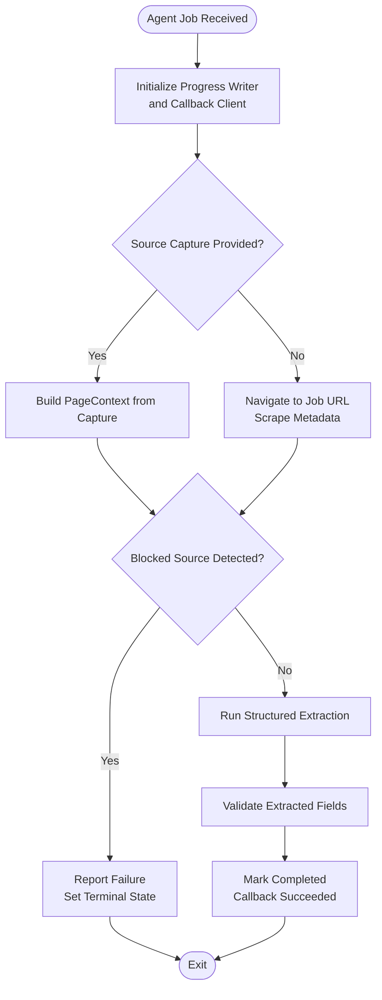
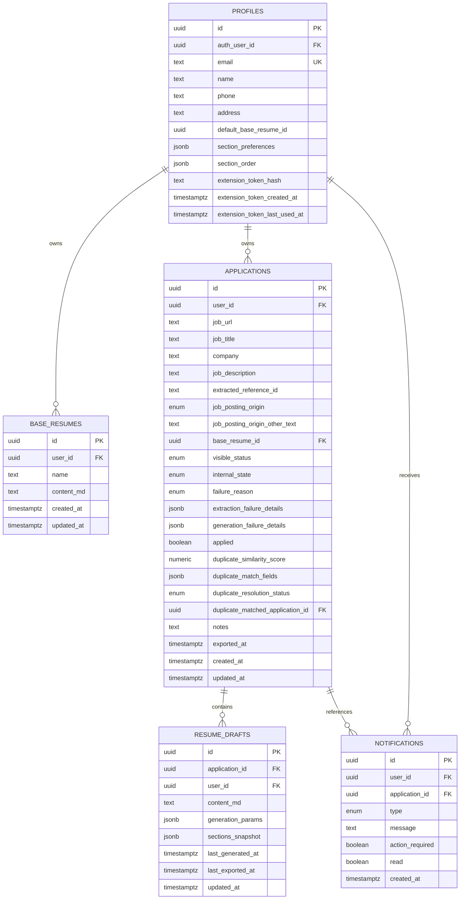
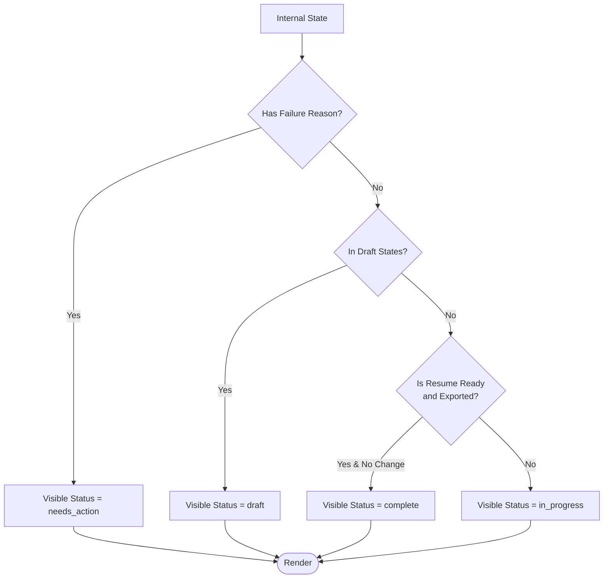
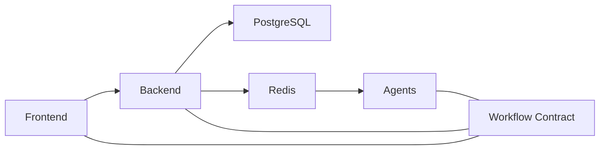

# Architecture Overview

<cite>
**Referenced Files in This Document**
- [backend/app/main.py](file://backend/app/main.py)
- [backend/app/api/extension.py](file://backend/app/api/extension.py)
- [backend/app/db/applications.py](file://backend/app/db/applications.py)
- [backend/app/services/workflow.py](file://backend/app/services/workflow.py)
- [backend/app/core/workflow_contract.py](file://backend/app/core/workflow_contract.py)
- [agents/worker.py](file://agents/worker.py)
- [agents/pyproject.toml](file://agents/pyproject.toml)
- [backend/pyproject.toml](file://backend/pyproject.toml)
- [frontend/src/lib/workflow-contract.ts](file://frontend/src/lib/workflow-contract.ts)
- [shared/workflow-contract.json](file://shared/workflow-contract.json)
- [frontend/public/chrome-extension/manifest.json](file://frontend/public/chrome-extension/manifest.json)
- [docker-compose.yml](file://docker-compose.yml)
- [docs/database_schema.md](file://docs/database_schema.md)
</cite>

## Table of Contents
1. [Introduction](#introduction)
2. [Project Structure](#project-structure)
3. [Core Components](#core-components)
4. [Architecture Overview](#architecture-overview)
5. [Detailed Component Analysis](#detailed-component-analysis)
6. [Dependency Analysis](#dependency-analysis)
7. [Performance Considerations](#performance-considerations)
8. [Troubleshooting Guide](#troubleshooting-guide)
9. [Conclusion](#conclusion)
10. [Appendices](#appendices)

## Introduction
This document describes the AI Resume Builder system’s multi-layered architecture. It covers the frontend React application, the backend FastAPI service, AI agent workers, and the database layer. It explains how the Chrome extension captures job postings, how the backend orchestrates AI workflows, how Redis queues drive asynchronous processing via ARQ, and how PostgreSQL persists state. It also documents the workflow state machine governed by the shared workflow contract and outlines system boundaries, data flows, integration points, scalability, fault tolerance, and deployment topology.

## Project Structure
The system is organized into three primary services plus shared assets:
- Frontend (React): Provides the user interface and integrates with the Chrome extension.
- Backend (FastAPI): Exposes APIs, manages application state, and coordinates AI workflows.
- Agents (ARQ workers): Perform extraction, generation, and validation tasks asynchronously.
- Shared: Defines the workflow contract consumed by frontend and backend.

**Diagram sources**
- [backend/app/main.py:1-36](file://backend/app/main.py#L1-L36)
- [backend/app/api/extension.py:1-141](file://backend/app/api/extension.py#L1-L141)
- [agents/worker.py:1-120](file://agents/worker.py#L1-L120)
- [docker-compose.yml:1-191](file://docker-compose.yml#L1-L191)
- [shared/workflow-contract.json:1-112](file://shared/workflow-contract.json#L1-L112)

**Section sources**
- [docker-compose.yml:1-191](file://docker-compose.yml#L1-L191)

## Core Components
- Frontend (React)
  - Hosted in a container and served locally during development.
  - Integrates with the Chrome extension to import job captures.
  - Consumes the shared workflow contract to render status and progress.
- Backend (FastAPI)
  - Exposes REST endpoints for sessions, profiles, applications, base resumes, extension integration, and internal worker callbacks.
  - Manages application lifecycle and derives visible status from internal workflow states.
  - Persists application state to PostgreSQL and coordinates ARQ jobs via Redis.
- Agents (ARQ Workers)
  - Implements extraction, generation, and validation workflows.
  - Publishes progress to Redis and posts callbacks to the backend.
  - Uses a shared workflow contract to align internal states and transitions.
- Database (PostgreSQL via Supabase)
  - Stores profiles, base resumes, applications, resume drafts, and notifications.
  - Enforces user scoping via RLS and maintains enums for workflow states and statuses.
- Shared Workflow Contract
  - Defines visible statuses, internal states, failure reasons, workflow kinds, mapping rules, and polling progress schema.
  - Consumed by frontend, backend, and agents to maintain consistency across the system.

**Section sources**
- [frontend/src/lib/workflow-contract.ts:1-33](file://frontend/src/lib/workflow-contract.ts#L1-L33)
- [backend/app/main.py:1-36](file://backend/app/main.py#L1-L36)
- [backend/app/api/extension.py:1-141](file://backend/app/api/extension.py#L1-L141)
- [agents/worker.py:1-120](file://agents/worker.py#L1-L120)
- [docs/database_schema.md:1-289](file://docs/database_schema.md#L1-L289)
- [shared/workflow-contract.json:1-112](file://shared/workflow-contract.json#L1-L112)

## Architecture Overview
The system follows a microservices pattern:
- Frontend service handles UI and extension integration.
- Backend service exposes APIs, manages state, and orchestrates asynchronous tasks.
- Agent service performs AI-intensive workloads independently and communicates back via callbacks.
- Data persistence is centralized in PostgreSQL with Supabase-managed auth and gateway.

**Diagram sources**
- [frontend/public/chrome-extension/manifest.json:1-24](file://frontend/public/chrome-extension/manifest.json#L1-L24)
- [backend/app/api/extension.py:114-141](file://backend/app/api/extension.py#L114-L141)
- [agents/worker.py:526-667](file://agents/worker.py#L526-L667)
- [backend/app/db/applications.py:162-193](file://backend/app/db/applications.py#L162-L193)
- [docker-compose.yml:1-191](file://docker-compose.yml#L1-L191)

## Detailed Component Analysis

### Frontend React Application
- Responsibilities
  - Renders application dashboards and detail pages.
  - Bridges the Chrome extension to the backend via the extension API.
  - Validates and consumes the shared workflow contract to compute visible status and progress.
- Key integrations
  - Chrome extension manifest defines permissions and background/service worker.
  - API client and routing integrate with backend endpoints.
  - Workflow contract parser ensures UI alignment with backend and agents.

**Diagram sources**
- [frontend/public/chrome-extension/manifest.json:1-24](file://frontend/public/chrome-extension/manifest.json#L1-L24)
- [backend/app/api/extension.py:114-141](file://backend/app/api/extension.py#L114-L141)

**Section sources**
- [frontend/public/chrome-extension/manifest.json:1-24](file://frontend/public/chrome-extension/manifest.json#L1-L24)
- [frontend/src/lib/workflow-contract.ts:1-33](file://frontend/src/lib/workflow-contract.ts#L1-L33)

### Backend FastAPI Service
- Responsibilities
  - Expose REST endpoints for session, profile, application, base resume, extension, and internal worker callbacks.
  - Manage application state transitions and derive visible status.
  - Persist application records to PostgreSQL and coordinate ARQ jobs via Redis.
- Orchestration
  - Accepts job captures from the extension and creates application records.
  - Queues extraction jobs and listens for callbacks to update state.
  - Applies mapping rules to compute visible status for UI rendering.

**Diagram sources**
- [backend/app/api/extension.py:114-141](file://backend/app/api/extension.py#L114-L141)
- [backend/app/db/applications.py:162-193](file://backend/app/db/applications.py#L162-L193)
- [agents/worker.py:526-667](file://agents/worker.py#L526-L667)

**Section sources**
- [backend/app/main.py:1-36](file://backend/app/main.py#L1-L36)
- [backend/app/api/extension.py:1-141](file://backend/app/api/extension.py#L1-L141)
- [backend/app/services/workflow.py:1-31](file://backend/app/services/workflow.py#L1-L31)
- [backend/app/core/workflow_contract.py:1-40](file://backend/app/core/workflow_contract.py#L1-L40)
- [backend/app/db/applications.py:1-328](file://backend/app/db/applications.py#L1-L328)

### AI Agent Workers (ARQ)
- Responsibilities
  - Perform web scraping, structured extraction, generation, and validation.
  - Publish progress to Redis and post callbacks to the backend.
  - Use the shared workflow contract to align internal states and transitions.
- Asynchronous processing
  - Jobs are queued in Redis and processed by ARQ workers.
  - Workers communicate back to the backend via secret-protected callbacks.

**Diagram sources**
- [agents/worker.py:526-667](file://agents/worker.py#L526-L667)
- [agents/worker.py:1-120](file://agents/worker.py#L1-L120)

**Section sources**
- [agents/worker.py:1-120](file://agents/worker.py#L1-L120)
- [agents/worker.py:526-667](file://agents/worker.py#L526-L667)
- [agents/pyproject.toml:1-26](file://agents/pyproject.toml#L1-L26)

### Database Layer (PostgreSQL via Supabase)
- Responsibilities
  - Store user profiles, base resumes, applications, resume drafts, and notifications.
  - Enforce user scoping via RLS and maintain enums for workflow states and statuses.
  - Provide efficient indexing for dashboard queries and duplicate detection.
- Data model highlights
  - Enumerations define visible statuses, internal states, failure reasons, and origins.
  - JSONB columns store structured failure details and generation parameters.
  - Composite foreign keys maintain referential integrity within user scope.

**Diagram sources**
- [docs/database_schema.md:48-289](file://docs/database_schema.md#L48-L289)

**Section sources**
- [docs/database_schema.md:1-289](file://docs/database_schema.md#L1-L289)
- [backend/app/db/applications.py:1-328](file://backend/app/db/applications.py#L1-L328)

### Workflow State Machine and Contract
- Shared contract
  - Defines visible statuses, internal states, failure reasons, workflow kinds, mapping rules, and polling progress schema.
  - Ensures frontend, backend, and agents interpret states consistently.
- Backend derivation
  - Computes visible status from internal state, failure reason, and export flags.
- Frontend consumption
  - Parses the contract to validate and render UI states.

**Diagram sources**
- [shared/workflow-contract.json:1-112](file://shared/workflow-contract.json#L1-L112)
- [backend/app/services/workflow.py:1-31](file://backend/app/services/workflow.py#L1-L31)
- [frontend/src/lib/workflow-contract.ts:1-33](file://frontend/src/lib/workflow-contract.ts#L1-L33)

**Section sources**
- [shared/workflow-contract.json:1-112](file://shared/workflow-contract.json#L1-L112)
- [backend/app/services/workflow.py:1-31](file://backend/app/services/workflow.py#L1-L31)
- [frontend/src/lib/workflow-contract.ts:1-33](file://frontend/src/lib/workflow-contract.ts#L1-L33)

## Dependency Analysis
- Inter-service dependencies
  - Frontend depends on backend REST endpoints and the shared workflow contract.
  - Backend depends on PostgreSQL for persistence and Redis for task queuing.
  - Agents depend on Redis for job queues and the backend for callbacks.
- Technology stack
  - Backend: FastAPI, ARQ, Redis, PostgreSQL, Pydantic settings.
  - Agents: ARQ, LangChain OpenAI, Playwright, Pydantic settings.
  - Frontend: React, Supabase JS, Zod, Vite.

**Diagram sources**
- [backend/pyproject.toml:1-37](file://backend/pyproject.toml#L1-L37)
- [agents/pyproject.toml:1-26](file://agents/pyproject.toml#L1-L26)
- [shared/workflow-contract.json:1-112](file://shared/workflow-contract.json#L1-L112)

**Section sources**
- [backend/pyproject.toml:1-37](file://backend/pyproject.toml#L1-L37)
- [agents/pyproject.toml:1-26](file://agents/pyproject.toml#L1-L26)

## Performance Considerations
- Asynchronous processing
  - Use ARQ with Redis to decouple long-running tasks (extraction, generation, validation) from request handling.
- Database efficiency
  - Leverage indexes on user-scoped columns and dashboard filters to optimize list and search queries.
- Caching
  - Cache the workflow contract in backend to avoid repeated file reads.
- Resource isolation
  - Separate containers for frontend, backend, agents, Redis, and database improve resource control and scaling.

[No sources needed since this section provides general guidance]

## Troubleshooting Guide
- Health checks
  - Backend exposes a health endpoint for readiness and liveness checks.
- Authentication and authorization
  - Supabase Auth and Kong manage JWT and RLS; ensure proper configuration of secrets and site URLs.
- Redis connectivity
  - Verify Redis URL and network reachability for ARQ workers and backend.
- Database migrations
  - Run migration scripts before starting backend to ensure schema consistency.
- Extension token verification
  - Ensure the extension token is properly hashed and verified by the backend.

**Section sources**
- [backend/app/main.py:25-27](file://backend/app/main.py#L25-L27)
- [docker-compose.yml:101-114](file://docker-compose.yml#L101-L114)
- [backend/app/api/extension.py:93-112](file://backend/app/api/extension.py#L93-L112)

## Conclusion
The AI Resume Builder employs a clean microservices architecture with a React frontend, a FastAPI backend, ARQ-powered agents, and a PostgreSQL-backed data layer. The shared workflow contract ensures consistent state interpretation across components. Event-driven processing via Redis and ARQ enables scalable, fault-tolerant workflows. Supabase provides managed auth and gateway services, while RLS and composite foreign keys protect user data. Together, these choices deliver a robust, extensible system suitable for iterative enhancements.

[No sources needed since this section summarizes without analyzing specific files]

## Appendices

### Deployment Topology
- Local development uses Docker Compose to orchestrate frontend, backend, agents, Redis, Supabase DB, Auth, REST, and Kong.
- Ports are configurable via environment variables; services depend on health checks for startup sequencing.

**Section sources**
- [docker-compose.yml:1-191](file://docker-compose.yml#L1-L191)