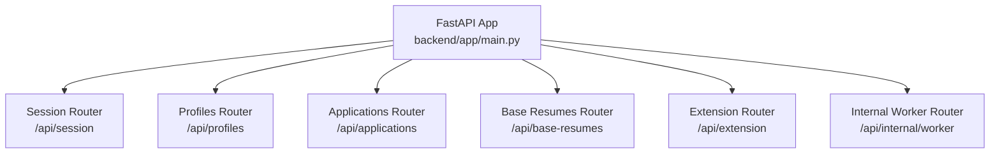
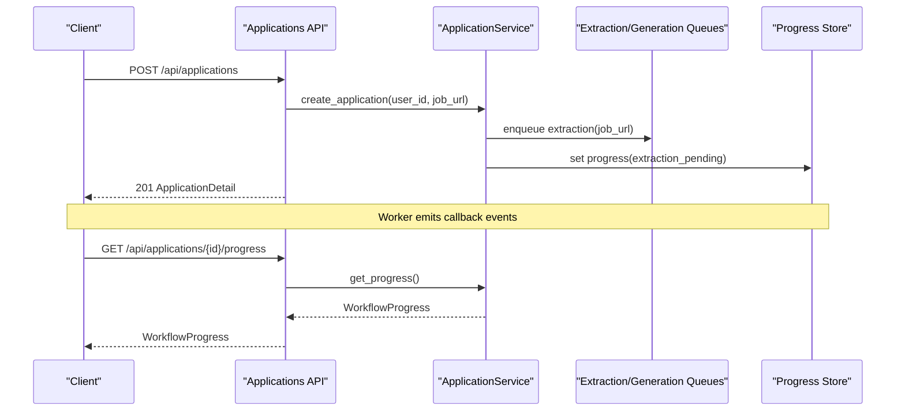
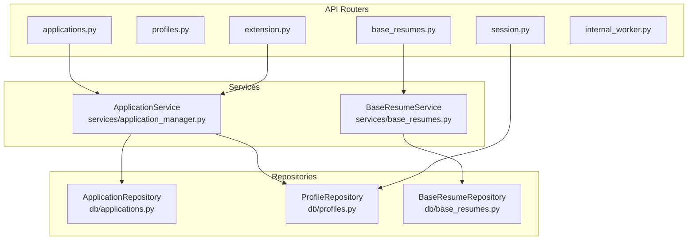

# API Endpoints

<cite>
**Referenced Files in This Document**
- [backend/app/main.py](file://backend/app/main.py)
- [backend/app/api/session.py](file://backend/app/api/session.py)
- [backend/app/api/applications.py](file://backend/app/api/applications.py)
- [backend/app/api/profiles.py](file://backend/app/api/profiles.py)
- [backend/app/api/extension.py](file://backend/app/api/extension.py)
- [backend/app/api/base_resumes.py](file://backend/app/api/base_resumes.py)
- [backend/app/api/internal_worker.py](file://backend/app/api/internal_worker.py)
- [backend/app/core/auth.py](file://backend/app/core/auth.py)
- [backend/app/core/security.py](file://backend/app/core/security.py)
- [backend/app/core/config.py](file://backend/app/core/config.py)
- [backend/app/db/applications.py](file://backend/app/db/applications.py)
- [backend/app/db/profiles.py](file://backend/app/db/profiles.py)
- [backend/app/db/base_resumes.py](file://backend/app/db/base_resumes.py)
- [backend/app/services/application_manager.py](file://backend/app/services/application_manager.py)
- [backend/app/services/base_resumes.py](file://backend/app/services/base_resumes.py)
</cite>

## Table of Contents
1. [Introduction](#introduction)
2. [Project Structure](#project-structure)
3. [Core Components](#core-components)
4. [Architecture Overview](#architecture-overview)
5. [Detailed Component Analysis](#detailed-component-analysis)
6. [Dependency Analysis](#dependency-analysis)
7. [Performance Considerations](#performance-considerations)
8. [Troubleshooting Guide](#troubleshooting-guide)
9. [Conclusion](#conclusion)
10. [Appendices](#appendices)

## Introduction
This document provides comprehensive API documentation for the backend, organized by functional groups. It covers:
- Session management for authentication and user session initialization
- Application CRUD and status tracking workflows
- Profile management for user account and preferences
- Extension integration endpoints for Chrome extension communication and job data import
- Base resume endpoints for managing template resumes and personal information
- Internal worker endpoints for AI agent coordination and callbacks

For each endpoint, you will find HTTP method, URL pattern, request/response schemas, authentication requirements, and error handling behavior. Practical cURL examples and representative response samples are included.

## Project Structure
The backend is a FastAPI application that mounts routers under /api for each functional group. CORS is configured to allow browser and Chrome extension origins.



**Diagram sources**
- [backend/app/main.py:14-36](file://backend/app/main.py#L14-L36)

**Section sources**
- [backend/app/main.py:14-36](file://backend/app/main.py#L14-L36)

## Core Components
- Authentication via Supabase JWTs for user-facing endpoints
- Extension token authentication for browser extension endpoints
- Worker secret verification for internal callbacks
- Centralized settings for environment configuration

Key behaviors:
- User endpoints require Authorization: Bearer <JWT>
- Extension endpoints require X-Extension-Token
- Internal worker endpoints require X-Worker-Secret
- CORS allows web app and Chrome extension origins

**Section sources**
- [backend/app/core/auth.py:72-90](file://backend/app/core/auth.py#L72-L90)
- [backend/app/core/security.py:13-54](file://backend/app/core/security.py#L13-L54)
- [backend/app/core/config.py:35-97](file://backend/app/core/config.py#L35-L97)
- [backend/app/main.py:15-22](file://backend/app/main.py#L15-L22)

## Architecture Overview
High-level flow for application lifecycle:
- User creates an application via URL or manual entry
- Extraction job is enqueued; progress tracked
- On success, duplicate detection runs; on conflict, resolution required
- Generation job produces a resume draft; user can edit/export



**Diagram sources**
- [backend/app/api/applications.py:384-403](file://backend/app/api/applications.py#L384-L403)
- [backend/app/services/application_manager.py:183-225](file://backend/app/services/application_manager.py#L183-L225)
- [backend/app/services/application_manager.py:439-453](file://backend/app/services/application_manager.py#L439-L453)

## Detailed Component Analysis

### Session Management Endpoints
Purpose: Initialize user session, return profile and workflow contract metadata.

- GET /api/session/bootstrap
  - Authentication: Bearer JWT
  - Response: UserPayload, ProfileRecord, workflow_contract_version
  - Errors: 503 if profile unavailable

cURL example:
```bash
curl -H "Authorization: Bearer $JWT" https://your-host/api/session/bootstrap
```

Response sample:
```json
{
  "user": { "id": "...", "email": "...", "role": null },
  "profile": {
    "id": "...", "email": "...", "name": null, "phone": null,
    "address": null, "default_base_resume_id": null,
    "section_preferences": {}, "section_order": [],
    "created_at": "...", "updated_at": "..."
  },
  "workflow_contract_version": "..."
}
```

**Section sources**
- [backend/app/api/session.py:27-44](file://backend/app/api/session.py#L27-L44)
- [backend/app/core/auth.py:72-90](file://backend/app/core/auth.py#L72-L90)

### Application CRUD and Workflows
Endpoints for job application management, status tracking, and resume generation.

- GET /api/applications
  - Query: search, visible_status
  - Response: array of ApplicationSummary
  - Errors: 404/400/500 mapped from service exceptions

- POST /api/applications
  - Request: CreateApplicationRequest (job_url)
  - Response: ApplicationDetail
  - Behavior: Creates draft, enqueues extraction, sets progress

- GET /api/applications/{application_id}
  - Response: ApplicationDetail

- PATCH /api/applications/{application_id}
  - Request: UpdateApplicationRequest (partial fields)
  - Behavior: Updates fields; may trigger duplicate resolution

- POST /api/applications/{application_id}/retry-extraction
  - Response: ApplicationDetail

- POST /api/applications/{application_id}/manual-entry
  - Request: ManualEntryRequest
  - Response: ApplicationDetail

- POST /api/applications/{application_id}/recover-from-source
  - Request: RecoverFromSourceRequest
  - Response: ApplicationDetail

- POST /api/applications/{application_id}/duplicate-resolution
  - Request: DuplicateResolutionRequest
  - Response: ApplicationDetail

- GET /api/applications/{application_id}/progress
  - Response: WorkflowProgress

- GET /api/applications/{application_id}/draft
  - Response: ResumeDraftResponse or null

- POST /api/applications/{application_id}/generate
  - Request: GenerateResumeRequest
  - Response: ApplicationDetail (202 accepted)

- POST /api/applications/{application_id}/regenerate
  - Request: FullRegenerationRequest
  - Response: ApplicationDetail (202 accepted)

- POST /api/applications/{application_id}/regenerate-section
  - Request: SectionRegenerationRequest
  - Response: ApplicationDetail (202 accepted)

- PUT /api/applications/{application_id}/draft
  - Request: SaveDraftRequest
  - Response: ResumeDraftResponse

- GET /api/applications/{application_id}/export-pdf
  - Response: application/pdf attachment

Representative request/response schemas:
- CreateApplicationRequest: job_url (URL)
- UpdateApplicationRequest: applied?, notes?, job_title?, company?, job_description?, job_posting_origin?, job_posting_origin_other_text?, base_resume_id?
- ManualEntryRequest: job_title, company, job_description, job_posting_origin?, job_posting_origin_other_text?, notes?
- RecoverFromSourceRequest: source_text, source_url?, page_title?, meta: dict, json_ld: list, captured_at?
- GenerateResumeRequest: base_resume_id, target_length (1_page|2_page|3_page), aggressiveness (low|medium|high), additional_instructions?
- FullRegenerationRequest: target_length, aggressiveness, additional_instructions?
- SectionRegenerationRequest: section_name, instructions
- SaveDraftRequest: content

cURL examples:
- List applications:
  ```bash
  curl -H "Authorization: Bearer $JWT" "https://your-host/api/applications?search=data&visible_status=draft"
  ```
- Create application:
  ```bash
  curl -X POST -H "Authorization: Bearer $JWT" \
    -H "Content-Type: application/json" \
    -d '{"job_url":"https://example.com/jobs/123"}' \
    https://your-host/api/applications
  ```
- Retry extraction:
  ```bash
  curl -X POST -H "Authorization: Bearer $JWT" \
    https://your-host/api/applications/{application_id}/retry-extraction
  ```
- Export PDF:
  ```bash
  curl -H "Authorization: Bearer $JWT" \
    -o output.pdf \
    https://your-host/api/applications/{application_id}/export-pdf
  ```

Error handling highlights:
- Validation errors: 400 Bad Request
- Not found: 404 Not Found
- Conflict/scenario mismatch: 409 Conflict
- Service failures: 500 Internal Server Error

**Section sources**
- [backend/app/api/applications.py:369-661](file://backend/app/api/applications.py#L369-L661)
- [backend/app/services/application_manager.py:170-800](file://backend/app/services/application_manager.py#L170-L800)
- [backend/app/db/applications.py:14-328](file://backend/app/db/applications.py#L14-L328)

### Profile Management Endpoints
Endpoints for retrieving and updating user profile and preferences.

- GET /api/profiles
  - Response: ProfileResponse

- PATCH /api/profiles
  - Request: UpdateProfileRequest (name?, phone?, address?, section_preferences?, section_order?)
  - Response: ProfileResponse

Validation rules:
- section_preferences keys must be subset of {"summary","professional_experience","education","skills"}
- section_order must contain unique values from the same set and no duplicates

cURL example:
```bash
curl -X PATCH -H "Authorization: Bearer $JWT" \
  -H "Content-Type: application/json" \
  -d '{"section_preferences":{"summary":true,"skills":false},"section_order":["summary","skills","professional_experience","education"]}' \
  https://your-host/api/profiles
```

**Section sources**
- [backend/app/api/profiles.py:77-113](file://backend/app/api/profiles.py#L77-L113)
- [backend/app/db/profiles.py:47-189](file://backend/app/db/profiles.py#L47-L189)

### Extension Integration Endpoints
Endpoints for Chrome extension to manage token and import captured job data.

- GET /api/extension/status
  - Response: ExtensionConnectionStatus (connected, token_created_at?, token_last_used_at?)

- POST /api/extension/token
  - Response: ExtensionTokenResponse (token, status)

- DELETE /api/extension/token
  - Response: ExtensionConnectionStatus

- POST /api/extension/import
  - Request: ExtensionCapturedApplicationRequest
  - Response: ApplicationDetail (201 Created)
  - Authentication: X-Extension-Token

cURL example:
```bash
curl -X POST https://your-host/api/extension/import \
  -H "X-Extension-Token: $EXTENSION_TOKEN" \
  -H "Content-Type: application/json" \
  -d '{"job_url":"https://example.com/jobs/123","source_text":"...","page_title":"..."}'
```

Notes:
- Token is hashed and stored; each successful verification updates token_last_used_at
- Import endpoint uses SourceCapturePayload to reconstruct application

**Section sources**
- [backend/app/api/extension.py:79-141](file://backend/app/api/extension.py#L79-L141)
- [backend/app/core/security.py:34-54](file://backend/app/core/security.py#L34-L54)
- [backend/app/db/profiles.py:86-157](file://backend/app/db/profiles.py#L86-L157)

### Base Resume Endpoints
Endpoints for managing template resumes and importing from PDF.

- GET /api/base-resumes
  - Response: array of BaseResumeSummary

- POST /api/base-resumes
  - Request: CreateBaseResumeRequest (name, content_md)
  - Response: BaseResumeDetail (201)

- POST /api/base-resumes/upload
  - Form-data: file (PDF), name, use_llm_cleanup (bool)
  - Response: BaseResumeDetail (201)
  - Constraints: PDF only, max size, optional LLM cleanup

- GET /api/base-resumes/{resume_id}
  - Response: BaseResumeDetail

- PATCH /api/base-resumes/{resume_id}
  - Request: UpdateBaseResumeRequest (name?, content_md?)
  - Response: BaseResumeDetail

- DELETE /api/base-resumes/{resume_id}?force={bool}
  - Response: 204 No Content
  - Constraint: Cannot delete if referenced by applications unless force=true

- POST /api/base-resumes/{resume_id}/set-default
  - Response: BaseResumeSummary

cURL example:
```bash
curl -X POST https://your-host/api/base-resumes/upload \
  -F "file=@resume.pdf" \
  -F "name=My Resume" \
  -F "use_llm_cleanup=false" \
  -H "Authorization: Bearer $JWT"
```

**Section sources**
- [backend/app/api/base_resumes.py:85-242](file://backend/app/api/base_resumes.py#L85-L242)
- [backend/app/services/base_resumes.py:45-154](file://backend/app/services/base_resumes.py#L45-L154)
- [backend/app/db/base_resumes.py:40-184](file://backend/app/db/base_resumes.py#L40-L184)

### Internal Worker Endpoints
Endpoints for AI agent callbacks and internal coordination.

- POST /api/internal/worker/extraction-callback
  - Request: WorkerCallbackPayload
  - Response: {"status":"accepted"}
  - Authentication: X-Worker-Secret

- POST /api/internal/worker/generation-callback
  - Request: GenerationCallbackPayload
  - Response: {"status":"accepted"}

- POST /api/internal/worker/regeneration-callback
  - Request: RegenerationCallbackPayload
  - Response: {"status":"accepted"}

Typical flow:
- Worker emits callback events with job_id and event type
- Backend validates job_id and user_id, updates state and progress

**Section sources**
- [backend/app/api/internal_worker.py:19-71](file://backend/app/api/internal_worker.py#L19-L71)
- [backend/app/core/security.py:13-23](file://backend/app/core/security.py#L13-L23)
- [backend/app/services/application_manager.py:455-719](file://backend/app/services/application_manager.py#L455-L719)

## Dependency Analysis
Relationships among API, services, and repositories:



**Diagram sources**
- [backend/app/api/applications.py:12-18](file://backend/app/api/applications.py#L12-L18)
- [backend/app/api/base_resumes.py:9-10](file://backend/app/api/base_resumes.py#L9-L10)
- [backend/app/services/application_manager.py:14-38](file://backend/app/services/application_manager.py#L14-L38)
- [backend/app/services/base_resumes.py:32-40](file://backend/app/services/base_resumes.py#L32-L40)
- [backend/app/db/applications.py:123-328](file://backend/app/db/applications.py#L123-L328)
- [backend/app/db/profiles.py:38-225](file://backend/app/db/profiles.py#L38-L225)
- [backend/app/db/base_resumes.py:31-184](file://backend/app/db/base_resumes.py#L31-L184)

## Performance Considerations
- Extraction and generation are asynchronous; use progress endpoints to poll status
- PDF uploads are validated and optionally cleaned via LLM; consider upload size limits
- Duplicate detection triggers additional processing; resolve duplicates promptly to avoid blocking generation
- CORS is configured to allow Chrome extension origins; ensure proper CSP and TLS in production

## Troubleshooting Guide
Common issues and resolutions:
- 401 Unauthorized
  - Missing or invalid Authorization header for user endpoints
  - Missing or invalid X-Extension-Token for extension endpoints
  - Missing or invalid X-Worker-Secret for internal endpoints
- 403 Forbidden
  - Worker payload user mismatch or unauthorized access
- 404 Not Found
  - Application, profile, or resume not found
- 409 Conflict
  - Operation conflicts with current state (e.g., duplicate resolution unavailable)
- 413 Payload Too Large
  - PDF exceeds size limit (10 MB)
- 500 Internal Server Error
  - Unexpected service failures; check worker callbacks and queue connectivity

**Section sources**
- [backend/app/api/applications.py:359-367](file://backend/app/api/applications.py#L359-L367)
- [backend/app/api/base_resumes.py:140-144](file://backend/app/api/base_resumes.py#L140-L144)
- [backend/app/api/internal_worker.py:27-33](file://backend/app/api/internal_worker.py#L27-L33)

## Conclusion
This API organizes job application lifecycle around asynchronous workflows with robust validation, progress tracking, and extension-friendly endpoints. Use the provided authentication mechanisms and follow the error handling guidance to integrate reliably.

## Appendices

### Authentication and Headers
- User endpoints: Authorization: Bearer <JWT>
- Extension endpoints: X-Extension-Token: <token>
- Internal worker endpoints: X-Worker-Secret: <secret>

Environment variables (selected):
- SUPABASE_AUTH_JWKS_URL, SUPABASE_JWT_SECRET, SUPABASE_JWT_AUDIENCE, SUPABASE_JWT_ISSUER
- WORKER_CALLBACK_SECRET
- OPENROUTER_API_KEY, OPENROUTER_CLEANUP_MODEL
- EMAIL_NOTIFICATIONS_ENABLED, RESEND_API_KEY, EMAIL_FROM

**Section sources**
- [backend/app/core/auth.py:22-65](file://backend/app/core/auth.py#L22-L65)
- [backend/app/core/security.py:13-23](file://backend/app/core/security.py#L13-L23)
- [backend/app/core/config.py:56-82](file://backend/app/core/config.py#L56-L82)