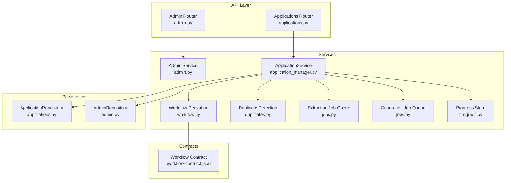
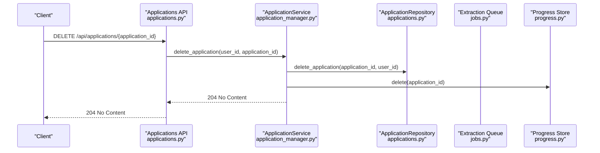
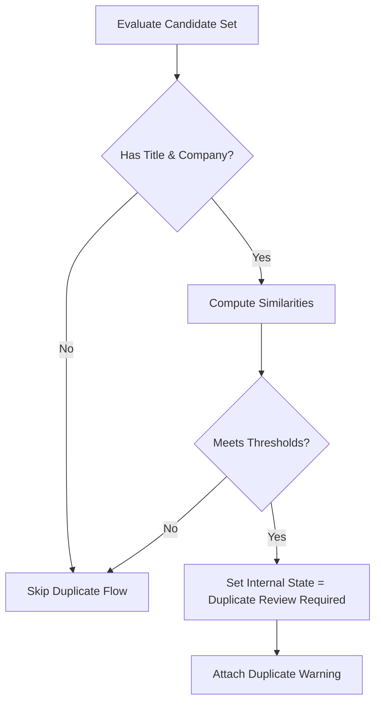
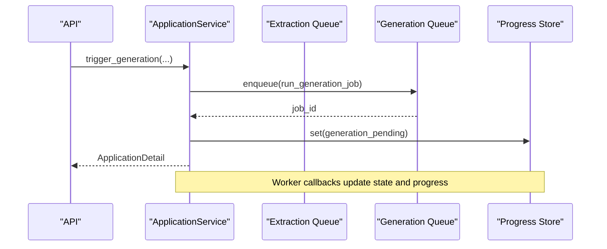
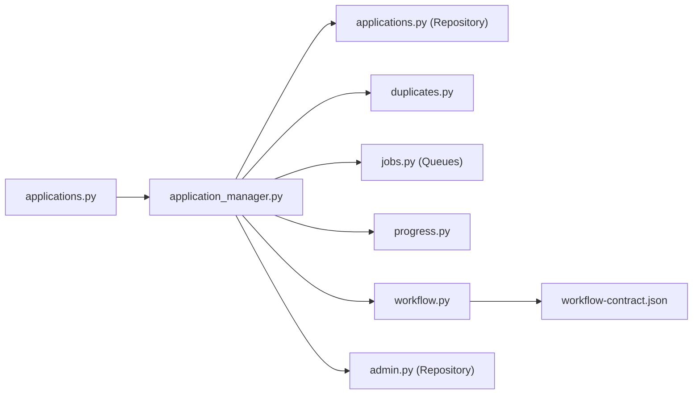

# Application CRUD Operations

<cite>
**Referenced Files in This Document**
- [applications.py](file://backend/app/api/applications.py)
- [applications.py](file://backend/app/db/applications.py)
- [application_manager.py](file://backend/app/services/application_manager.py)
- [admin.py](file://backend/app/services/admin.py)
- [admin.py](file://backend/app/db/admin.py)
- [duplicates.py](file://backend/app/services/duplicates.py)
- [workflow.py](file://backend/app/services/workflow.py)
- [jobs.py](file://backend/app/services/jobs.py)
- [progress.py](file://backend/app/services/progress.py)
- [workflow-contract.json](file://shared/workflow-contract.json)
- [test_phase1_applications.py](file://backend/tests/test_phase1_applications.py)
- [test_application_request_validation.py](file://backend/tests/test_application_request_validation.py)
- [ApplicationsListPage.tsx](file://frontend/src/routes/ApplicationsListPage.tsx)
- [ApplicationDetailPage.tsx](file://frontend/src/routes/ApplicationDetailPage.tsx)
</cite>

## Update Summary
**Changes Made**
- Added comprehensive DELETE endpoint documentation for application deletion
- Enhanced validation rules section with unsafe instruction pattern detection
- Updated admin system integration documentation
- Improved error handling documentation for deletion operations
- Added bulk deletion capabilities and frontend integration

## Table of Contents
1. [Introduction](#introduction)
2. [Project Structure](#project-structure)
3. [Core Components](#core-components)
4. [Architecture Overview](#architecture-overview)
5. [Detailed Component Analysis](#detailed-component-analysis)
6. [Dependency Analysis](#dependency-analysis)
7. [Performance Considerations](#performance-considerations)
8. [Troubleshooting Guide](#troubleshooting-guide)
9. [Conclusion](#conclusion)
10. [Appendices](#appendices)

## Introduction
This document provides comprehensive API documentation for job application CRUD operations. It covers endpoints for creating applications from job URLs, retrieving application details, updating application information, deleting applications, and managing workflow states. It also explains how the system integrates with the workflow contract to derive visible status, handles duplicate detection, manages progress tracking, and implements enhanced validation rules for generation instructions. Examples illustrate creating applications via job URL ingestion, manual entry, bulk operations, and deletion workflows, along with error handling for invalid URLs, duplicates, validation failures, and deletion constraints.

## Project Structure
The application CRUD API is implemented in the backend FastAPI module under the applications router. Supporting services include the application manager, database repositories, duplicate detection, job queues, progress tracking, workflow state derivation, and admin system integration. The workflow contract defines the mapping from internal states to visible statuses and failure reasons.

**Diagram sources**
- [applications.py:21-779](file://backend/app/api/applications.py#L21-L779)
- [application_manager.py:177-2225](file://backend/app/services/application_manager.py#L177-L2225)
- [admin.py:69-471](file://backend/app/services/admin.py#L69-L471)
- [workflow.py:11-31](file://backend/app/services/workflow.py#L11-L31)
- [duplicates.py:79-184](file://backend/app/services/duplicates.py#L79-L184)
- [jobs.py:12-138](file://backend/app/services/jobs.py#L12-L138)
- [progress.py:53-79](file://backend/app/services/progress.py#L53-L79)
- [workflow-contract.json:1-112](file://shared/workflow-contract.json#L1-L112)

**Section sources**
- [applications.py:21-779](file://backend/app/api/applications.py#L21-L779)
- [applications.py:123-328](file://backend/app/db/applications.py#L123-L328)
- [application_manager.py:177-2225](file://backend/app/services/application_manager.py#L177-L2225)
- [admin.py:69-471](file://backend/app/services/admin.py#L69-L471)
- [workflow-contract.json:1-112](file://shared/workflow-contract.json#L1-L112)

## Core Components
- Applications API router exposes endpoints for listing, creating, retrieving, updating, deleting, and workflow-related actions.
- ApplicationService orchestrates business logic, including duplicate detection, job queueing, progress tracking, status derivation, and deletion validation.
- ApplicationRepository persists and queries application records with typed Pydantic models.
- DuplicateDetector evaluates similarity across job title/company, description, posting origin, URLs, and reference IDs.
- Job queues enqueue asynchronous extraction and generation/regeneration tasks.
- Progress store maintains transient progress records in Redis.
- Workflow contract defines visible statuses, internal states, failure reasons, and mapping rules.
- Admin service provides administrative operations with enhanced validation and safety checks.
- Admin repository manages user administration and metrics collection.

**Section sources**
- [applications.py:21-779](file://backend/app/api/applications.py#L21-L779)
- [application_manager.py:177-2225](file://backend/app/services/application_manager.py#L177-L2225)
- [applications.py:14-118](file://backend/app/db/applications.py#L14-L118)
- [admin.py:69-471](file://backend/app/services/admin.py#L69-L471)
- [admin.py:66-173](file://backend/app/db/admin.py#L66-L173)
- [duplicates.py:79-184](file://backend/app/services/duplicates.py#L79-L184)
- [jobs.py:12-138](file://backend/app/services/jobs.py#L12-L138)
- [progress.py:53-79](file://backend/app/services/progress.py#L53-L79)
- [workflow-contract.json:1-112](file://shared/workflow-contract.json#L1-L112)

## Architecture Overview
The API layer validates requests, delegates to ApplicationService, and returns structured responses. ApplicationService updates internal state, enqueues jobs, stores progress, and derives visible status per the workflow contract. The admin system provides enhanced validation and safety checks for administrative operations.

**Diagram sources**
- [applications.py:511-525](file://backend/app/api/applications.py#L511-L525)
- [application_manager.py:326-338](file://backend/app/services/application_manager.py#L326-L338)
- [applications.py:317-336](file://backend/app/db/applications.py#L317-L336)
- [progress.py:67-74](file://backend/app/services/progress.py#L67-L74)

## Detailed Component Analysis

### Endpoints Overview
- List applications: GET /api/applications
- Create application from URL: POST /api/applications
- Get application detail: GET /api/applications/{application_id}
- Patch application: PATCH /api/applications/{application_id}
- Delete application: DELETE /api/applications/{application_id}
- Retry extraction: POST /api/applications/{application_id}/retry-extraction
- Submit manual entry: POST /api/applications/{application_id}/manual-entry
- Recover from source: POST /api/applications/{application_id}/recover-from-source
- Resolve duplicate: POST /api/applications/{application_id}/duplicate-resolution
- Get progress: GET /api/applications/{application_id}/progress
- Get draft: GET /api/applications/{application_id}/draft
- Generate resume: POST /api/applications/{application_id}/generate
- Regenerate full: POST /api/applications/{application_id}/regenerate
- Regenerate section: POST /api/applications/{application_id}/regenerate-section
- Save draft: PUT /api/applications/{application_id}/draft
- Export PDF: GET /api/applications/{application_id}/export-pdf

**Section sources**
- [applications.py:426-779](file://backend/app/api/applications.py#L426-L779)

### Request and Response Schemas

#### Create Application from Job URL
- Request: job_url (HTTP URL), optional source_text
- Response: ApplicationDetail

Validation and normalization:
- job_url is validated as an HTTP URL.
- source_text is normalized and stripped of whitespace.
- On success, the system enqueues an extraction job and sets initial progress.

**Section sources**
- [applications.py:68-79](file://backend/app/api/applications.py#L68-L79)
- [applications.py:441-470](file://backend/app/api/applications.py#L441-L470)
- [application_manager.py:219-261](file://backend/app/services/application_manager.py#L219-L261)

#### Retrieve Application Detail
- Path: GET /api/applications/{application_id}
- Response: ApplicationDetail

Includes fields such as job metadata, status, failure details, duplicate warning, and timestamps.

**Section sources**
- [applications.py:472-487](file://backend/app/api/applications.py#L472-L487)
- [applications.py:196-223](file://backend/app/api/applications.py#L196-L223)

#### Update Application Information
- Path: PATCH /api/applications/{application_id}
- Request: Partial fields (applied, notes, job_title, company, job_description, job_posting_origin, job_posting_origin_other_text, base_resume_id)
- Response: ApplicationDetail

Behavior:
- At least one field must be provided; otherwise, returns 400.
- Updates are persisted and may trigger duplicate resolution flow depending on changed fields.
- String fields are normalized and stripped of whitespace.

**Section sources**
- [applications.py:81-100](file://backend/app/api/applications.py#L81-L100)
- [applications.py:489-509](file://backend/app/api/applications.py#L489-L509)
- [application_manager.py:295-325](file://backend/app/services/application_manager.py#L295-L325)

#### Delete Application
- Path: DELETE /api/applications/{application_id}
- Response: 204 No Content

Behavior:
- Validates that the application belongs to the requesting user.
- Prevents deletion if the application is in active states (extraction_pending, extracting, generating, regenerating_full, regenerating_section).
- Deletes both the application record and associated progress data.
- Returns 204 No Content on successful deletion.

**Section sources**
- [applications.py:511-525](file://backend/app/api/applications.py#L511-L525)
- [application_manager.py:326-338](file://backend/app/services/application_manager.py#L326-L338)
- [applications.py:317-336](file://backend/app/db/applications.py#L317-L336)

#### Manual Entry
- Path: POST /api/applications/{application_id}/manual-entry
- Request: job_title, company, job_description, optional job_posting_origin, job_posting_origin_other_text, notes
- Validation: Non-blank fields enforced; "other" origin requires a label.

**Section sources**
- [applications.py:102-135](file://backend/app/api/applications.py#L102-L135)
- [applications.py:562-579](file://backend/app/api/applications.py#L562-L579)
- [application_manager.py:339-357](file://backend/app/services/application_manager.py#L339-L357)

#### Recover From Source
- Path: POST /api/applications/{application_id}/recover-from-source
- Request: source_text (required), optional source_url, page_title, meta, json_ld, captured_at
- Behavior: Resets workflow to extraction_pending and enqueues extraction with captured source.

**Section sources**
- [applications.py:237-260](file://backend/app/api/applications.py#L237-L260)
- [applications.py:581-606](file://backend/app/api/applications.py#L581-L606)
- [application_manager.py:358-408](file://backend/app/services/application_manager.py#L358-L408)

#### Retry Extraction
- Path: POST /api/applications/{application_id}/retry-extraction
- Behavior: Resets workflow to extraction_pending and enqueues extraction.

**Section sources**
- [applications.py:545-560](file://backend/app/api/applications.py#L545-L560)
- [application_manager.py:410-462](file://backend/app/services/application_manager.py#L410-L462)

#### Duplicate Resolution
- Path: POST /api/applications/{application_id}/duplicate-resolution
- Request: resolution ("dismissed" or "redirected")
- Behavior: Transitions internal state accordingly if eligible.

**Section sources**
- [applications.py:137-146](file://backend/app/api/applications.py#L137-L146)
- [applications.py:608-625](file://backend/app/api/applications.py#L608-L625)
- [application_manager.py:463-489](file://backend/app/services/application_manager.py#L463-L489)

#### Progress Tracking
- Path: GET /api/applications/{application_id}/progress
- Response: WorkflowProgress (job_id, workflow_kind, state, message, percent_complete, timestamps, terminal_error_code)

**Section sources**
- [applications.py:627-641](file://backend/app/api/applications.py#L627-L641)
- [progress.py:13-50](file://backend/app/services/progress.py#L13-L50)

#### Draft Management
- Get draft: GET /api/applications/{application_id}/draft → ResumeDraftResponse
- Save draft: PUT /api/applications/{application_id}/draft → ResumeDraftResponse
- Generate resume: POST /api/applications/{application_id}/generate
- Regenerate full: POST /api/applications/{application_id}/regenerate
- Regenerate section: POST /api/applications/{application_id}/regenerate-section

**Section sources**
- [applications.py:643-722](file://backend/app/api/applications.py#L643-L722)
- [application_manager.py:513-1017](file://backend/app/services/application_manager.py#L513-L1017)

#### Export PDF
- Path: GET /api/applications/{application_id}/export-pdf
- Response: application/pdf with filename header

**Section sources**
- [applications.py:759-779](file://backend/app/api/applications.py#L759-L779)
- [application_manager.py:1069-1148](file://backend/app/services/application_manager.py#L1069-L1148)

### Enhanced Validation Rules

#### Unsafe Instruction Pattern Detection
The system implements comprehensive validation for generation instructions to prevent unsafe content injection:

- **Pattern Detection**: Scans for patterns indicating attempts to override previous instructions or inject false information
- **Restricted Keywords**: Blocks phrases like "ignore", "disregard", "override", "make up", "invent", "fabricate", "hallucinate"
- **Sensitive Information**: Prevents inclusion of degrees, certifications, credentials, awards, employer information, dates, phones, emails, addresses, LinkedIn profiles, websites, or university names
- **Validation Scope**: Applies to generation, full regeneration, and section regeneration instructions

**Section sources**
- [applications.py:26-66](file://backend/app/api/applications.py#L26-L66)
- [applications.py:262-294](file://backend/app/api/applications.py#L262-L294)
- [applications.py:296-319](file://backend/app/api/applications.py#L296-L319)
- [applications.py:321-344](file://backend/app/api/applications.py#L321-L344)
- [test_application_request_validation.py:9-72](file://backend/tests/test_application_request_validation.py#L9-L72)

### Workflow State Management and Visible Status
The system derives visible_status from internal_state and failure_reason according to the workflow contract. Mapping rules define how states map to visible statuses and how failure reasons override states.

**Diagram sources**
- [workflow.py:11-31](file://backend/app/services/workflow.py#L11-L31)
- [workflow-contract.json:34-87](file://shared/workflow-contract.json#L34-L87)

**Section sources**
- [workflow.py:11-31](file://backend/app/services/workflow.py#L11-L31)
- [workflow-contract.json:1-112](file://shared/workflow-contract.json#L1-L112)

### Duplicate Detection and Warning
Duplicate evaluation considers job title, company, description similarity, posting origin, exact URL matches, and extracted reference IDs. If a candidate meets thresholds, the application transitions to duplicate_review_required and a warning is included in the detail response.

**Diagram sources**
- [application_manager.py:1185-1268](file://backend/app/services/application_manager.py#L1185-L1268)
- [duplicates.py:83-184](file://backend/app/services/duplicates.py#L83-L184)

**Section sources**
- [application_manager.py:1185-1268](file://backend/app/services/application_manager.py#L1185-L1268)
- [duplicates.py:79-184](file://backend/app/services/duplicates.py#L79-L184)

### Job Extraction and Generation Workflows
Extraction and generation are enqueued asynchronously. Progress is stored and retrievable. Callback handlers update state and status upon worker events.

**Diagram sources**
- [application_manager.py:513-602](file://backend/app/services/application_manager.py#L513-L602)
- [jobs.py:49-85](file://backend/app/services/jobs.py#L49-L85)
- [progress.py:67-74](file://backend/app/services/progress.py#L67-L74)

**Section sources**
- [application_manager.py:513-720](file://backend/app/services/application_manager.py#L513-L720)
- [jobs.py:12-138](file://backend/app/services/jobs.py#L12-L138)
- [progress.py:53-79](file://backend/app/services/progress.py#L53-L79)

### Examples

#### Creating an Application from a Job URL
- Endpoint: POST /api/applications
- Request: { "job_url": "<valid-job-url>" }
- Outcome: Application created in draft/internal_state extraction_pending; extraction job enqueued; progress initialized.

**Section sources**
- [applications.py:441-470](file://backend/app/api/applications.py#L441-L470)
- [application_manager.py:219-261](file://backend/app/services/application_manager.py#L219-L261)

#### Manually Entering Application Details
- Endpoint: POST /api/applications/{application_id}/manual-entry
- Request: { "job_title", "company", "job_description", optional origin fields }
- Outcome: Application transitions to duplicate review if applicable; otherwise proceeds to generation pending.

**Section sources**
- [applications.py:562-579](file://backend/app/api/applications.py#L562-L579)
- [application_manager.py:339-357](file://backend/app/services/application_manager.py#L339-L357)

#### Deleting Applications
- Endpoint: DELETE /api/applications/{application_id}
- Constraints: Cannot delete if application is in active states (extraction_pending, extracting, generating, regenerating_full, regenerating_section)
- Outcome: Application record and progress data are removed; returns 204 No Content

**Section sources**
- [applications.py:511-525](file://backend/app/api/applications.py#L511-L525)
- [application_manager.py:326-338](file://backend/app/services/application_manager.py#L326-L338)

#### Bulk Operations
Bulk operations are supported for both creation and deletion:
- Batch creation: Loop client-side over job URLs and call POST /api/applications for each.
- Bulk updates: Loop PATCH requests to update fields across multiple applications.
- Bulk deletion: Use frontend bulk delete functionality or individual DELETE requests.
- Bulk exports: Iterate GET /api/applications/{application_id}/export-pdf for each application.

**Section sources**
- [ApplicationsListPage.tsx:289-326](file://frontend/src/routes/ApplicationsListPage.tsx#L289-L326)
- [ApplicationsListPage.tsx:328-356](file://frontend/src/routes/ApplicationsListPage.tsx#L328-L356)

### Error Handling
Common HTTP errors returned by the API:
- 400 Bad Request: Validation failures (e.g., empty update payload, invalid fields, unsafe instruction patterns).
- 404 Not Found: Application not found.
- 409 Conflict: Duplicate resolution unavailable, permission errors (e.g., wrong user, active background work prevents deletion).
- 500 Internal Server Error: Unexpected server failures.

Service-level exceptions are mapped to appropriate HTTP status codes:
- Deletion blocked: PermissionError with "Application cannot be deleted while background work is still running."
- Validation failures: ValueError with specific error messages for unsafe instruction patterns.

**Section sources**
- [applications.py:416-424](file://backend/app/api/applications.py#L416-L424)
- [application_manager.py:333-334](file://backend/app/services/application_manager.py#L333-L334)
- [test_application_request_validation.py:36-72](file://backend/tests/test_application_request_validation.py#L36-L72)

## Dependency Analysis
The API depends on ApplicationService, which in turn depends on repositories, job queues, progress store, duplicate detector, workflow derivation, and admin repository. The workflow contract informs visible status mapping.

**Diagram sources**
- [applications.py:21-779](file://backend/app/api/applications.py#L21-L779)
- [application_manager.py:177-2225](file://backend/app/services/application_manager.py#L177-L2225)
- [workflow-contract.json:1-112](file://shared/workflow-contract.json#L1-L112)

**Section sources**
- [applications.py:21-779](file://backend/app/api/applications.py#L21-L779)
- [application_manager.py:177-2225](file://backend/app/services/application_manager.py#L177-L2225)
- [workflow-contract.json:1-112](file://shared/workflow-contract.json#L1-L112)

## Performance Considerations
- Asynchronous job queues offload long-running work (extraction, generation) to background workers.
- Progress is stored in Redis for low-latency polling.
- Duplicate detection uses efficient similarity scoring and early exits for non-matching candidates.
- Database queries use parameterized statements and selective column selection.
- Admin operations are optimized with batch processing and caching mechanisms.
- Frontend implements optimistic UI updates for better user experience during bulk operations.

## Troubleshooting Guide
- Extraction fails and requires manual entry:
  - Symptom: Application enters manual_entry_required with failure details.
  - Action: Use POST /api/applications/{application_id}/manual-entry or recover-from-source.
- Duplicate review required:
  - Symptom: Application enters duplicate_review_required with a duplicate warning.
  - Action: Resolve via POST /api/applications/{application_id}/duplicate-resolution.
- Generation stuck:
  - Symptom: Internal state remains generation_pending or generating.
  - Action: Poll GET /api/applications/{application_id}/progress; check worker logs; retry generation.
- Export fails:
  - Symptom: Export error notification and resume_ready state with failure reason export_failed.
  - Action: Fix draft content and retry export.
- Deletion blocked:
  - Symptom: PermissionError when attempting to delete application.
  - Action: Wait for active background work to complete or cancel ongoing operations.
- Unsafe instruction rejected:
  - Symptom: Validation error for generation instructions.
  - Action: Remove restricted patterns and keywords from instructions.

**Section sources**
- [application_manager.py:1270-1324](file://backend/app/services/application_manager.py#L1270-L1324)
- [application_manager.py:1150-1184](file://backend/app/services/application_manager.py#L1150-L1184)
- [workflow-contract.json:21-26](file://shared/workflow-contract.json#L21-L26)

## Conclusion
The application CRUD API provides a robust foundation for job application lifecycle management. It supports ingestion from job URLs, manual entry, duplicate detection, comprehensive workflow state management aligned with the workflow contract, enhanced validation rules for safety, and deletion operations with proper constraints. Progress tracking and asynchronous job queues enable scalable processing, while clear error handling and status derivation improve operability. The enhanced admin system provides additional oversight and safety controls for administrative operations.

## Appendices

### Data Models Overview
Key Pydantic models used across the API and service layer:
- ApplicationSummary: Lightweight listing model with visibility and timestamps.
- ApplicationDetail: Full application detail including status, failure details, and duplicate warning.
- WorkflowProgress: Progress envelope for polling.
- DuplicateWarning: Duplicate detection metadata.
- ResumeDraftResponse: Draft content and generation parameters.
- AdminMetricsPayload: Administrative metrics and operation statistics.
- InviteResultPayload: Invitation creation results with expiration details.

**Section sources**
- [applications.py:171-223](file://backend/app/api/applications.py#L171-L223)
- [applications.py:357-366](file://backend/app/api/applications.py#L357-L366)
- [admin.py:23-61](file://backend/app/services/admin.py#L23-L61)
- [admin.py:45-60](file://backend/app/services/admin.py#L45-L60)

### Active State Blocking for Deletion
The system implements comprehensive blocking for deletion operations to prevent data corruption:

- ACTIVE_DELETE_BLOCKING_STATES: ["extraction_pending", "extracting", "generating", "regenerating_full", "regenerating_section"]
- Prevention mechanism ensures applications cannot be deleted while active background work is running
- Users receive clear error messages explaining why deletion is blocked

**Section sources**
- [application_manager.py:56-62](file://backend/app/services/application_manager.py#L56-L62)
- [ApplicationsListPage.tsx:29-37](file://frontend/src/routes/ApplicationsListPage.tsx#L29-L37)