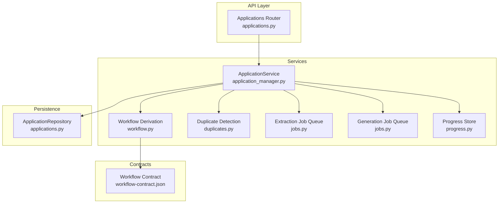
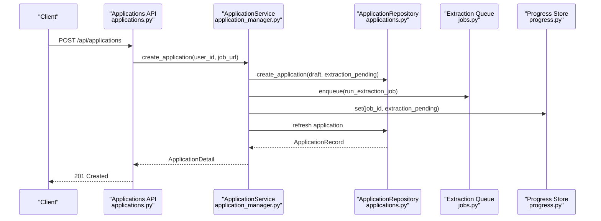
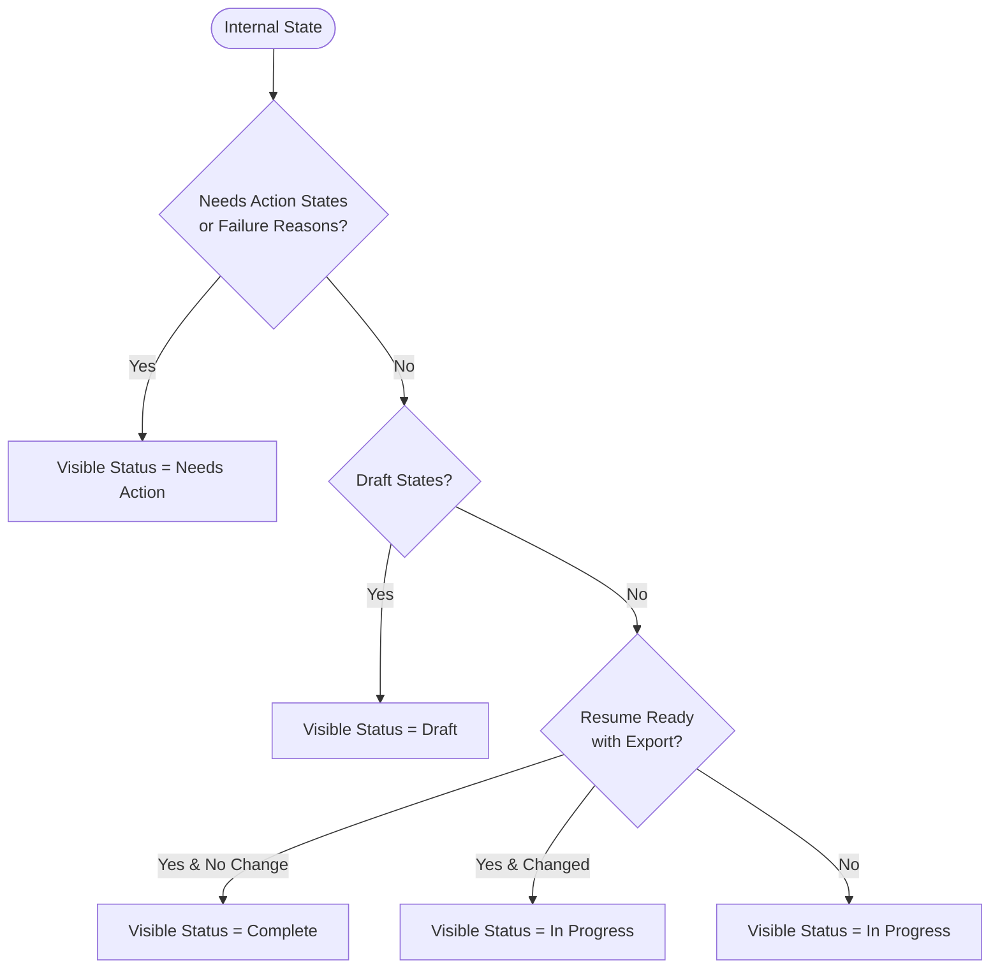
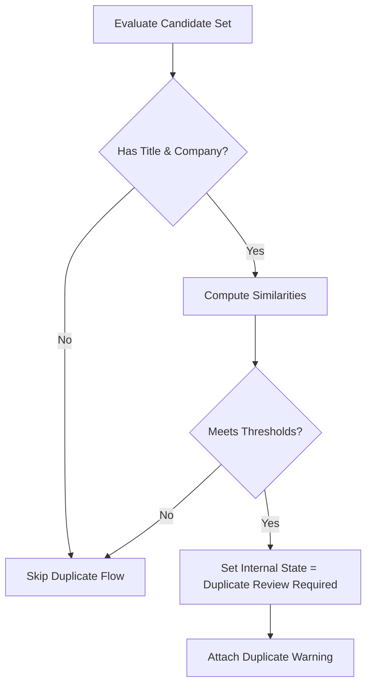
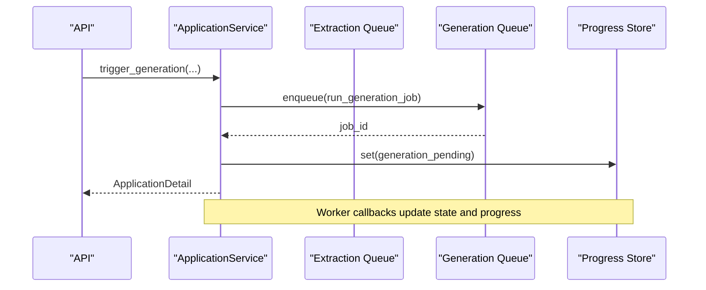
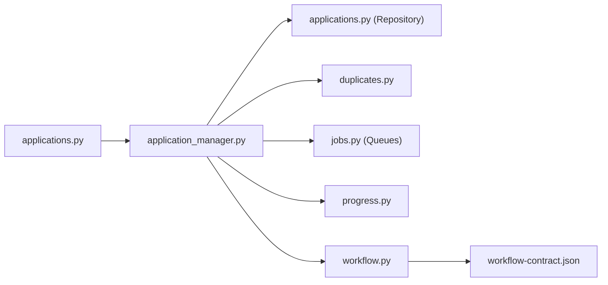

# Application CRUD Operations

<cite>
**Referenced Files in This Document**
- [applications.py](file://backend/app/api/applications.py)
- [applications.py](file://backend/app/db/applications.py)
- [application_manager.py](file://backend/app/services/application_manager.py)
- [duplicates.py](file://backend/app/services/duplicates.py)
- [workflow.py](file://backend/app/services/workflow.py)
- [jobs.py](file://backend/app/services/jobs.py)
- [progress.py](file://backend/app/services/progress.py)
- [workflow-contract.json](file://shared/workflow-contract.json)
</cite>

## Table of Contents
1. [Introduction](#introduction)
2. [Project Structure](#project-structure)
3. [Core Components](#core-components)
4. [Architecture Overview](#architecture-overview)
5. [Detailed Component Analysis](#detailed-component-analysis)
6. [Dependency Analysis](#dependency-analysis)
7. [Performance Considerations](#performance-considerations)
8. [Troubleshooting Guide](#troubleshooting-guide)
9. [Conclusion](#conclusion)
10. [Appendices](#appendices)

## Introduction
This document provides comprehensive API documentation for job application CRUD operations. It covers endpoints for creating applications from job URLs, retrieving application details, updating application information, and managing workflow states. It also explains how the system integrates with the workflow contract to derive visible status, handles duplicate detection, and manages progress tracking. Examples illustrate creating applications via job URL ingestion, manual entry, and regeneration flows, along with error handling for invalid URLs, duplicates, and validation failures.

## Project Structure
The application CRUD API is implemented in the backend FastAPI module under the applications router. Supporting services include the application manager, database repositories, duplicate detection, job queues, progress tracking, and workflow state derivation. The workflow contract defines the mapping from internal states to visible statuses and failure reasons.

**Diagram sources**
- [applications.py:21-661](file://backend/app/api/applications.py#L21-L661)
- [application_manager.py:143-1543](file://backend/app/services/application_manager.py#L143-L1543)
- [workflow.py:11-31](file://backend/app/services/workflow.py#L11-L31)
- [duplicates.py:79-184](file://backend/app/services/duplicates.py#L79-L184)
- [jobs.py:12-138](file://backend/app/services/jobs.py#L12-L138)
- [progress.py:53-79](file://backend/app/services/progress.py#L53-L79)
- [workflow-contract.json:1-112](file://shared/workflow-contract.json#L1-L112)

**Section sources**
- [applications.py:21-661](file://backend/app/api/applications.py#L21-L661)
- [applications.py:123-328](file://backend/app/db/applications.py#L123-L328)
- [application_manager.py:143-1543](file://backend/app/services/application_manager.py#L143-L1543)
- [workflow-contract.json:1-112](file://shared/workflow-contract.json#L1-L112)

## Core Components
- Applications API router exposes endpoints for listing, creating, retrieving, updating, and workflow-related actions.
- ApplicationService orchestrates business logic, including duplicate detection, job queueing, progress tracking, and status derivation.
- ApplicationRepository persists and queries application records with typed Pydantic models.
- DuplicateDetector evaluates similarity across job title/company, description, posting origin, URLs, and reference IDs.
- Job queues enqueue asynchronous extraction and generation/regeneration tasks.
- Progress store maintains transient progress records in Redis.
- Workflow contract defines visible statuses, internal states, failure reasons, and mapping rules.

**Section sources**
- [applications.py:21-661](file://backend/app/api/applications.py#L21-L661)
- [application_manager.py:143-1543](file://backend/app/services/application_manager.py#L143-L1543)
- [applications.py:14-118](file://backend/app/db/applications.py#L14-L118)
- [duplicates.py:79-184](file://backend/app/services/duplicates.py#L79-L184)
- [jobs.py:12-138](file://backend/app/services/jobs.py#L12-L138)
- [progress.py:53-79](file://backend/app/services/progress.py#L53-L79)
- [workflow-contract.json:1-112](file://shared/workflow-contract.json#L1-L112)

## Architecture Overview
The API layer validates requests, delegates to ApplicationService, and returns structured responses. ApplicationService updates internal state, enqueues jobs, stores progress, and derives visible status per the workflow contract.

**Diagram sources**
- [applications.py:384-403](file://backend/app/api/applications.py#L384-L403)
- [application_manager.py:183-225](file://backend/app/services/application_manager.py#L183-L225)
- [applications.py:162-192](file://backend/app/db/applications.py#L162-L192)
- [jobs.py:16-42](file://backend/app/services/jobs.py#L16-L42)
- [progress.py:67-74](file://backend/app/services/progress.py#L67-L74)

## Detailed Component Analysis

### Endpoints Overview
- List applications: GET /api/applications
- Create application from URL: POST /api/applications
- Get application detail: GET /api/applications/{application_id}
- Patch application: PATCH /api/applications/{application_id}
- Retry extraction: POST /api/applications/{application_id}/retry-extraction
- Submit manual entry: POST /api/applications/{application_id}/manual-entry
- Recover from source: POST /api/applications/{application_id}/recover-from-source
- Resolve duplicate: POST /api/applications/{application_id}/duplicate-resolution
- Get progress: GET /api/applications/{application_id}/progress
- Get draft: GET /api/applications/{application_id}/draft
- Generate resume: POST /api/applications/{application_id}/generate
- Regenerate full: POST /api/applications/{application_id}/regenerate
- Regenerate section: POST /api/applications/{application_id}/regenerate-section
- Save draft: PUT /api/applications/{application_id}/draft
- Export PDF: GET /api/applications/{application_id}/export-pdf

**Section sources**
- [applications.py:369-661](file://backend/app/api/applications.py#L369-L661)

### Request and Response Schemas

#### Create Application from Job URL
- Request: job_url (HTTP URL)
- Response: ApplicationDetail

Validation and normalization:
- job_url is validated as an HTTP URL.
- On success, the system enqueues an extraction job and sets initial progress.

**Section sources**
- [applications.py:24-26](file://backend/app/api/applications.py#L24-L26)
- [applications.py:384-403](file://backend/app/api/applications.py#L384-L403)
- [application_manager.py:183-225](file://backend/app/services/application_manager.py#L183-L225)

#### Retrieve Application Detail
- Path: GET /api/applications/{application_id}
- Response: ApplicationDetail

Includes fields such as job metadata, status, failure details, duplicate warning, and timestamps.

**Section sources**
- [applications.py:405-419](file://backend/app/api/applications.py#L405-L419)
- [applications.py:139-163](file://backend/app/api/applications.py#L139-L163)

#### Update Application Information
- Path: PATCH /api/applications/{application_id}
- Request: Partial fields (applied, notes, job_title, company, job_description, job_posting_origin, job_posting_origin_other_text, base_resume_id)
- Response: ApplicationDetail

Behavior:
- At least one field must be provided; otherwise, returns 400.
- Updates are persisted and may trigger duplicate resolution flow depending on changed fields.

**Section sources**
- [applications.py:28-45](file://backend/app/api/applications.py#L28-L45)
- [applications.py:422-442](file://backend/app/api/applications.py#L422-L442)
- [application_manager.py:257-287](file://backend/app/services/application_manager.py#L257-L287)

#### Manual Entry
- Path: POST /api/applications/{application_id}/manual-entry
- Request: job_title, company, job_description, optional job_posting_origin, job_posting_origin_other_text, notes
- Validation: Non-blank fields enforced; “other” origin requires a label.

**Section sources**
- [applications.py:47-78](file://backend/app/api/applications.py#L47-L78)
- [applications.py:461-477](file://backend/app/api/applications.py#L461-L477)
- [application_manager.py:288-305](file://backend/app/services/application_manager.py#L288-L305)

#### Recover From Source
- Path: POST /api/applications/{application_id}/recover-from-source
- Request: source_text (required), optional source_url, page_title, meta, json_ld, captured_at
- Behavior: Resets workflow to extraction_pending and enqueues extraction with captured source.

**Section sources**
- [applications.py:178-201](file://backend/app/api/applications.py#L178-L201)
- [applications.py:480-504](file://backend/app/api/applications.py#L480-L504)
- [application_manager.py:307-356](file://backend/app/services/application_manager.py#L307-L356)

#### Retry Extraction
- Path: POST /api/applications/{application_id}/retry-extraction
- Behavior: Resets workflow to extraction_pending and enqueues extraction.

**Section sources**
- [applications.py:444-459](file://backend/app/api/applications.py#L444-L459)
- [application_manager.py:358-411](file://backend/app/services/application_manager.py#L358-L411)

#### Duplicate Resolution
- Path: POST /api/applications/{application_id}/duplicate-resolution
- Request: resolution ("dismissed" or "redirected")
- Behavior: Transitions internal state accordingly if eligible.

**Section sources**
- [applications.py:80-89](file://backend/app/api/applications.py#L80-L89)
- [applications.py:507-523](file://backend/app/api/applications.py#L507-L523)
- [application_manager.py:412-437](file://backend/app/services/application_manager.py#L412-L437)

#### Progress Tracking
- Path: GET /api/applications/{application_id}/progress
- Response: WorkflowProgress (job_id, workflow_kind, state, message, percent_complete, timestamps, terminal_error_code)

**Section sources**
- [applications.py:526-539](file://backend/app/api/applications.py#L526-L539)
- [progress.py:13-50](file://backend/app/services/progress.py#L13-L50)

#### Draft Management
- Get draft: GET /api/applications/{application_id}/draft → ResumeDraftResponse
- Save draft: PUT /api/applications/{application_id}/draft → ResumeDraftResponse
- Generate resume: POST /api/applications/{application_id}/generate
- Regenerate full: POST /api/applications/{application_id}/regenerate
- Regenerate section: POST /api/applications/{application_id}/regenerate-section

**Section sources**
- [applications.py:542-621](file://backend/app/api/applications.py#L542-L621)
- [application_manager.py:513-1017](file://backend/app/services/application_manager.py#L513-L1017)

#### Export PDF
- Path: GET /api/applications/{application_id}/export-pdf
- Response: application/pdf with filename header

**Section sources**
- [applications.py:641-661](file://backend/app/api/applications.py#L641-L661)
- [application_manager.py:1069-1148](file://backend/app/services/application_manager.py#L1069-L1148)

### Workflow State Management and Visible Status
The system derives visible_status from internal_state and failure_reason according to the workflow contract. Mapping rules define how states map to visible statuses and how failure reasons override states.

**Diagram sources**
- [workflow.py:11-31](file://backend/app/services/workflow.py#L11-L31)
- [workflow-contract.json:34-87](file://shared/workflow-contract.json#L34-L87)

**Section sources**
- [workflow.py:11-31](file://backend/app/services/workflow.py#L11-L31)
- [workflow-contract.json:1-112](file://shared/workflow-contract.json#L1-L112)

### Duplicate Detection and Warning
Duplicate evaluation considers job title, company, description similarity, posting origin, exact URL matches, and extracted reference IDs. If a candidate meets thresholds, the application transitions to duplicate_review_required and a warning is included in the detail response.

**Diagram sources**
- [application_manager.py:1185-1268](file://backend/app/services/application_manager.py#L1185-L1268)
- [duplicates.py:83-184](file://backend/app/services/duplicates.py#L83-L184)

**Section sources**
- [application_manager.py:1185-1268](file://backend/app/services/application_manager.py#L1185-L1268)
- [duplicates.py:79-184](file://backend/app/services/duplicates.py#L79-L184)

### Job Extraction and Generation Workflows
Extraction and generation are enqueued asynchronously. Progress is stored and retrievable. Callback handlers update state and status upon worker events.

**Diagram sources**
- [application_manager.py:513-602](file://backend/app/services/application_manager.py#L513-L602)
- [jobs.py:49-85](file://backend/app/services/jobs.py#L49-L85)
- [progress.py:67-74](file://backend/app/services/progress.py#L67-L74)

**Section sources**
- [application_manager.py:513-720](file://backend/app/services/application_manager.py#L513-L720)
- [jobs.py:12-138](file://backend/app/services/jobs.py#L12-L138)
- [progress.py:53-79](file://backend/app/services/progress.py#L53-L79)

### Examples

#### Creating an Application from a Job URL
- Endpoint: POST /api/applications
- Request: { "job_url": "<valid-job-url>" }
- Outcome: Application created in draft/internal_state extraction_pending; extraction job enqueued; progress initialized.

**Section sources**
- [applications.py:384-403](file://backend/app/api/applications.py#L384-L403)
- [application_manager.py:183-225](file://backend/app/services/application_manager.py#L183-L225)

#### Manually Entering Application Details
- Endpoint: POST /api/applications/{application_id}/manual-entry
- Request: { "job_title", "company", "job_description", optional origin fields }
- Outcome: Application transitions to duplicate review if applicable; otherwise proceeds to generation pending.

**Section sources**
- [applications.py:461-477](file://backend/app/api/applications.py#L461-L477)
- [application_manager.py:288-305](file://backend/app/services/application_manager.py#L288-L305)

#### Bulk Operations
Bulk operations are not exposed as dedicated endpoints. Typical patterns:
- Batch creation: Loop client-side over job URLs and call POST /api/applications for each.
- Bulk updates: Loop PATCH requests to update fields across multiple applications.
- Bulk exports: Iterate GET /api/applications/{application_id}/export-pdf for each application.

[No sources needed since this section provides general guidance]

### Error Handling
Common HTTP errors returned by the API:
- 400 Bad Request: Validation failures (e.g., empty update payload, invalid fields).
- 404 Not Found: Application not found.
- 409 Conflict: Duplicate resolution unavailable or permission errors (e.g., wrong user).
- 500 Internal Server Error: Unexpected server failures.

Service-level exceptions are mapped to appropriate HTTP status codes.

**Section sources**
- [applications.py:359-367](file://backend/app/api/applications.py#L359-L367)
- [application_manager.py:412-437](file://backend/app/services/application_manager.py#L412-L437)

## Dependency Analysis
The API depends on ApplicationService, which in turn depends on repositories, job queues, progress store, duplicate detector, and workflow derivation. The workflow contract informs visible status mapping.

**Diagram sources**
- [applications.py:21-661](file://backend/app/api/applications.py#L21-L661)
- [application_manager.py:143-1543](file://backend/app/services/application_manager.py#L143-L1543)
- [workflow-contract.json:1-112](file://shared/workflow-contract.json#L1-L112)

**Section sources**
- [applications.py:21-661](file://backend/app/api/applications.py#L21-L661)
- [application_manager.py:143-1543](file://backend/app/services/application_manager.py#L143-L1543)
- [workflow-contract.json:1-112](file://shared/workflow-contract.json#L1-L112)

## Performance Considerations
- Asynchronous job queues offload long-running work (extraction, generation) to background workers.
- Progress is stored in Redis for low-latency polling.
- Duplicate detection uses efficient similarity scoring and early exits for non-matching candidates.
- Database queries use parameterized statements and selective column selection.

[No sources needed since this section provides general guidance]

## Troubleshooting Guide
- Extraction fails and requires manual entry:
  - Symptom: Application enters manual_entry_required with failure details.
  - Action: Use POST /api/applications/{application_id}/manual-entry or recover-from-source.
- Duplicate review required:
  - Symptom: Application enters duplicate_review_required with a duplicate warning.
  - Action: Resolve via POST /api/applications/{application_id}/duplicate-resolution.
- Generation stuck:
  - Symptom: Internal state remains generation_pending or generating.
  - Action: Poll GET /api/applications/{application_id}/progress; check worker logs; retry generation.
- Export fails:
  - Symptom: Export error notification and resume_ready state with failure reason export_failed.
  - Action: Fix draft content and retry export.

**Section sources**
- [application_manager.py:1270-1324](file://backend/app/services/application_manager.py#L1270-L1324)
- [application_manager.py:1150-1184](file://backend/app/services/application_manager.py#L1150-L1184)
- [workflow-contract.json:21-26](file://shared/workflow-contract.json#L21-L26)

## Conclusion
The application CRUD API provides a robust foundation for job application lifecycle management. It supports ingestion from job URLs, manual entry, duplicate detection, and comprehensive workflow state management aligned with the workflow contract. Progress tracking and asynchronous job queues enable scalable processing, while clear error handling and status derivation improve operability.

[No sources needed since this section summarizes without analyzing specific files]

## Appendices

### Data Models Overview
Key Pydantic models used across the API and service layer:
- ApplicationSummary: Lightweight listing model with visibility and timestamps.
- ApplicationDetail: Full application detail including status, failure details, and duplicate warning.
- WorkflowProgress: Progress envelope for polling.
- DuplicateWarning: Duplicate detection metadata.
- ResumeDraftResponse: Draft content and generation parameters.

**Section sources**
- [applications.py:114-163](file://backend/app/api/applications.py#L114-L163)
- [applications.py:311-321](file://backend/app/api/applications.py#L311-L321)
- [applications.py:99-104](file://backend/app/api/applications.py#L99-L104)
- [applications.py:300-310](file://backend/app/api/applications.py#L300-L310)