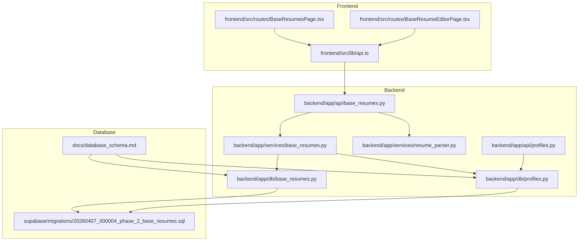
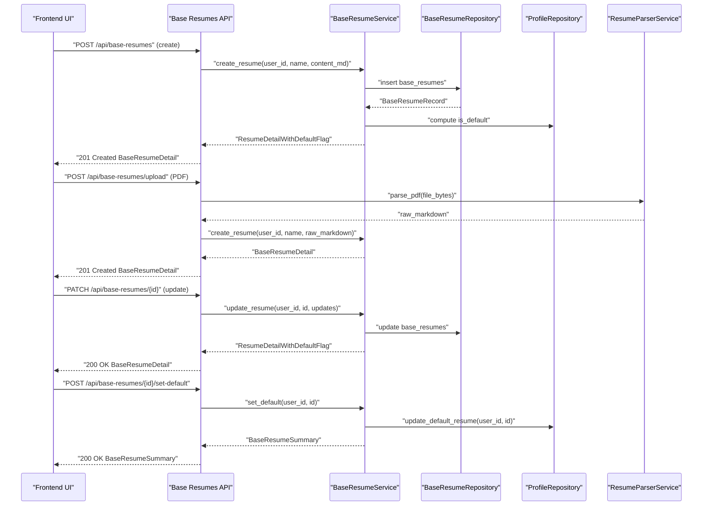
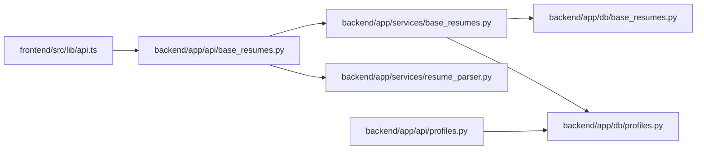
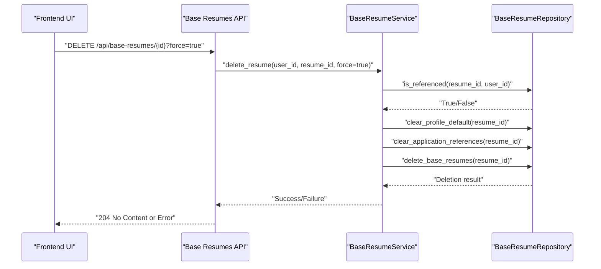

# Base Resume Operations

<cite>
**Referenced Files in This Document**
- [backend/app/api/base_resumes.py](file://backend/app/api/base_resumes.py)
- [backend/app/services/base_resumes.py](file://backend/app/services/base_resumes.py)
- [backend/app/db/base_resumes.py](file://backend/app/db/base_resumes.py)
- [backend/app/services/resume_parser.py](file://backend/app/services/resume_parser.py)
- [frontend/src/lib/api.ts](file://frontend/src/lib/api.ts)
- [frontend/src/routes/BaseResumesPage.tsx](file://frontend/src/routes/BaseResumesPage.tsx)
- [frontend/src/routes/BaseResumeEditorPage.tsx](file://frontend/src/routes/BaseResumeEditorPage.tsx)
- [backend/app/api/profiles.py](file://backend/app/api/profiles.py)
- [backend/app/db/profiles.py](file://backend/app/db/profiles.py)
- [supabase/migrations/20260407_000004_phase_2_base_resumes.sql](file://supabase/migrations/20260407_000004_phase_2_base_resumes.sql)
- [docs/database_schema.md](file://docs/database_schema.md)
</cite>

## Update Summary
**Changes Made**
- Updated deletion endpoint documentation to reflect enhanced proactive reference clearing logic
- Added improved error handling for foreign key violations with clearer messaging
- Updated frontend API documentation to reflect new force parameter defaults
- Enhanced troubleshooting guide with new deletion scenarios

## Table of Contents
1. [Introduction](#introduction)
2. [Project Structure](#project-structure)
3. [Core Components](#core-components)
4. [Architecture Overview](#architecture-overview)
5. [Detailed Component Analysis](#detailed-component-analysis)
6. [Dependency Analysis](#dependency-analysis)
7. [Performance Considerations](#performance-considerations)
8. [Troubleshooting Guide](#troubleshooting-guide)
9. [Conclusion](#conclusion)
10. [Appendices](#appendices)

## Introduction
This document provides comprehensive API documentation for base resume management endpoints. Base resumes are user-owned Markdown templates that serve as the foundation for AI-generated job application materials. The API enables users to create, list, retrieve, update, delete, and set default base resumes. It also supports uploading existing PDFs, parsing them into Markdown, and optionally cleaning up the content with an LLM.

The documentation covers:
- Endpoint definitions and request/response schemas
- Relationship between base resumes and user profiles (including default resume selection)
- Section preferences and ordering that influence AI generation
- Practical examples for creating base resumes, editing sections, and integrating with the AI generation workflow

## Project Structure
The base resume feature spans the backend API, service layer, database repository, and frontend UI. The frontend exposes two pages: a library view for managing base resumes and an editor page for creating/editing content.



**Diagram sources**
- [backend/app/api/base_resumes.py:1-256](file://backend/app/api/base_resumes.py#L1-L256)
- [backend/app/services/base_resumes.py:1-163](file://backend/app/services/base_resumes.py#L1-L163)
- [backend/app/db/base_resumes.py:1-196](file://backend/app/db/base_resumes.py#L1-L196)
- [backend/app/services/resume_parser.py:1-228](file://backend/app/services/resume_parser.py#L1-L228)
- [frontend/src/lib/api.ts:328-397](file://frontend/src/lib/api.ts#L328-L397)
- [frontend/src/routes/BaseResumesPage.tsx:1-185](file://frontend/src/routes/BaseResumesPage.tsx#L1-L185)
- [frontend/src/routes/BaseResumeEditorPage.tsx:1-472](file://frontend/src/routes/BaseResumeEditorPage.tsx#L1-L472)
- [backend/app/api/profiles.py:1-113](file://backend/app/api/profiles.py#L1-L113)
- [backend/app/db/profiles.py:1-225](file://backend/app/db/profiles.py#L1-L225)
- [supabase/migrations/20260407_000004_phase_2_base_resumes.sql:1-158](file://supabase/migrations/20260407_000004_phase_2_base_resumes.sql#L1-L158)
- [docs/database_schema.md:46-246](file://docs/database_schema.md#L46-L246)

**Section sources**
- [backend/app/api/base_resumes.py:1-256](file://backend/app/api/base_resumes.py#L1-L256)
- [frontend/src/lib/api.ts:328-397](file://frontend/src/lib/api.ts#L328-L397)
- [frontend/src/routes/BaseResumesPage.tsx:1-185](file://frontend/src/routes/BaseResumesPage.tsx#L1-L185)
- [frontend/src/routes/BaseResumeEditorPage.tsx:1-472](file://frontend/src/routes/BaseResumeEditorPage.tsx#L1-L472)

## Core Components
- API Layer: Defines endpoints for listing, creating, retrieving, updating, deleting, and setting default base resumes. Includes PDF upload with optional LLM cleanup.
- Service Layer: Orchestrates business logic, validates ownership, applies name/content rules, and integrates with profile defaults.
- Database Layer: Provides typed repositories for base resumes and profiles, enforcing RLS and foreign key constraints.
- Frontend APIs: Encapsulate authenticated requests and form submissions for base resume CRUD and upload flows.
- Resume Parser: Converts PDFs to Markdown and optionally cleans up structure via LLM.

Key relationships:
- Base resumes are owned by users and protected by RLS.
- Profiles maintain a canonical default base resume pointer and section preferences/order used by AI generation.
- Applications reference base resumes for generation and export.

**Section sources**
- [backend/app/api/base_resumes.py:85-256](file://backend/app/api/base_resumes.py#L85-L256)
- [backend/app/services/base_resumes.py:32-163](file://backend/app/services/base_resumes.py#L32-L163)
- [backend/app/db/base_resumes.py:31-196](file://backend/app/db/base_resumes.py#L31-L196)
- [backend/app/services/resume_parser.py:13-228](file://backend/app/services/resume_parser.py#L13-L228)
- [frontend/src/lib/api.ts:328-397](file://frontend/src/lib/api.ts#L328-L397)
- [docs/database_schema.md:48-113](file://docs/database_schema.md#L48-L113)

## Architecture Overview
The base resume lifecycle involves the frontend UI, authenticated API, service orchestration, and database persistence with Row Level Security.



**Diagram sources**
- [backend/app/api/base_resumes.py:94-256](file://backend/app/api/base_resumes.py#L94-L256)
- [backend/app/services/base_resumes.py:55-141](file://backend/app/services/base_resumes.py#L55-L141)
- [backend/app/db/base_resumes.py:59-165](file://backend/app/db/base_resumes.py#L59-L165)
- [backend/app/db/profiles.py:196-220](file://backend/app/db/profiles.py#L196-L220)
- [backend/app/services/resume_parser.py:24-53](file://backend/app/services/resume_parser.py#L24-L53)

## Detailed Component Analysis

### API Endpoints: Base Resumes
- List base resumes
  - Method: GET
  - Path: /api/base-resumes
  - Authenticated user scope enforced by dependency
  - Response: Array of BaseResumeSummary
- Create base resume
  - Method: POST
  - Path: /api/base-resumes
  - Request: CreateBaseResumeRequest (name, content_md)
  - Response: BaseResumeDetail (201)
- Retrieve base resume
  - Method: GET
  - Path: /api/base-resumes/{resume_id}
  - Response: BaseResumeDetail
- Update base resume
  - Method: PATCH
  - Path: /api/base-resumes/{id}
  - Request: UpdateBaseResumeRequest (optional name, content_md)
  - Response: BaseResumeDetail
- Delete base resume
  - Method: DELETE
  - Path: /api/base-resumes/{id}?force=true
  - Response: 204 No Content
- Set default base resume
  - Method: POST
  - Path: /api/base-resumes/{id}/set-default
  - Response: BaseResumeSummary

**Updated** Enhanced deletion functionality now includes proactive reference clearing and improved error handling

Request/Response Schemas
- CreateBaseResumeRequest
  - name: string (required, non-blank)
  - content_md: string (required, non-blank)
- UpdateBaseResumeRequest
  - name: string? (if provided, non-blank)
  - content_md: string? (optional)
- BaseResumeSummary
  - id: string
  - name: string
  - is_default: boolean
  - created_at: string (ISO-like)
  - updated_at: string (ISO-like)
- BaseResumeDetail
  - id: string
  - name: string
  - content_md: string
  - is_default: boolean
  - created_at: string
  - updated_at: string

Error Handling
- 400 Bad Request: Blank name, invalid request payload
- 404 Not Found: Resume not found
- 409 Conflict: Permission/ownership conflict
- 500 Internal Server Error: Unexpected server error

**Section sources**
- [backend/app/api/base_resumes.py:85-256](file://backend/app/api/base_resumes.py#L85-L256)
- [backend/app/api/base_resumes.py:27-70](file://backend/app/api/base_resumes.py#L27-L70)

### PDF Upload and LLM Cleanup
- Endpoint: POST /api/base-resumes/upload
- Form fields:
  - file: PDF (required)
  - name: string (required, non-blank)
  - use_llm_cleanup: boolean (optional, default false)
- Validation:
  - Only PDF files accepted
  - Max file size enforced
  - Content type may be empty (client-dependent)
- Processing:
  - Parse PDF to Markdown
  - Optionally apply LLM cleanup via OpenRouter
  - Create base resume with parsed/cleaned content

**Section sources**
- [backend/app/api/base_resumes.py:111-169](file://backend/app/api/base_resumes.py#L111-L169)
- [backend/app/services/resume_parser.py:24-53](file://backend/app/services/resume_parser.py#L24-L53)
- [backend/app/services/resume_parser.py:168-228](file://backend/app/services/resume_parser.py#L168-L228)

### Service Layer: Business Logic
- Ownership checks and validations
- Name normalization and blank-name enforcement
- Default resume computation via profile repository
- Deletion safety: prevents deletion if referenced by applications unless force=true

**Updated** Enhanced deletion logic now includes proactive reference clearing and improved error handling

**Section sources**
- [backend/app/services/base_resumes.py:32-163](file://backend/app/services/base_resumes.py#L32-L163)

### Database Layer: Repositories
- BaseResumeRepository
  - list_resumes(user_id)
  - create_resume(user_id, name, content_md)
  - fetch_resume(user_id, resume_id)
  - update_resume(resume_id, user_id, updates)
  - delete_resume(resume_id, user_id)
  - is_referenced(resume_id, user_id)
- ProfileRepository
  - fetch_default_resume_id(user_id)
  - update_default_resume(user_id, resume_id)

**Updated** Enhanced deletion functionality now includes proactive reference clearing logic

RLS and Constraints
- base_resumes: RLS per user; composite foreign keys; CHECK constraints on non-blank name/content
- profiles: default_base_resume_id references base_resumes with ON DELETE SET NULL

**Section sources**
- [backend/app/db/base_resumes.py:31-196](file://backend/app/db/base_resumes.py#L31-L196)
- [backend/app/db/profiles.py:38-225](file://backend/app/db/profiles.py#L38-L225)
- [supabase/migrations/20260407_000004_phase_2_base_resumes.sql:14-76](file://supabase/migrations/20260407_000004_phase_2_base_resumes.sql#L14-L76)
- [docs/database_schema.md:84-113](file://docs/database_schema.md#L84-L113)

### Frontend Integration
- BaseResumesPage: Lists base resumes, sets default, deletes
- BaseResumeEditorPage: New from blank or upload; edit; save; set default; delete
- API helpers: listBaseResumes, createBaseResume, fetchBaseResume, updateBaseResume, deleteBaseResume, setDefaultBaseResume, uploadBaseResume

**Updated** Frontend API now defaults to force=true for delete operations

**Section sources**
- [frontend/src/routes/BaseResumesPage.tsx:12-185](file://frontend/src/routes/BaseResumesPage.tsx#L12-L185)
- [frontend/src/routes/BaseResumeEditorPage.tsx:19-472](file://frontend/src/routes/BaseResumeEditorPage.tsx#L19-L472)
- [frontend/src/lib/api.ts:330-397](file://frontend/src/lib/api.ts#L330-L397)

### Relationship Between Base Resumes and User Profiles
- Default Base Resume
  - Stored in profiles.default_base_resume_id
  - Setting a base resume as default updates this pointer
- Section Preferences and Ordering
  - profiles.section_preferences: enables/disables resume sections
  - profiles.section_order: determines generation order
- Impact on AI Generation
  - Generation respects enabled sections and their order
  - Applications can override base resume selection per job application

**Section sources**
- [backend/app/services/base_resumes.py:41-43](file://backend/app/services/base_resumes.py#L41-L43)
- [backend/app/api/profiles.py:13-51](file://backend/app/api/profiles.py#L13-L51)
- [docs/database_schema.md:48-71](file://docs/database_schema.md#L48-L71)

### Enhanced Deletion Functionality

**Updated** The base resume deletion functionality has been significantly enhanced with proactive reference clearing logic and improved error handling.

#### Proactive Reference Clearing
The database layer now automatically clears all references to a base resume before deletion:

1. **Profile Default Clearing**: Updates any profile with this resume as default back to null
2. **Application Reference Clearing**: Sets base_resume_id to null for all applications referencing this resume
3. **Safe Deletion**: Only proceeds with actual deletion after references are cleared

#### Improved Error Handling
Enhanced error handling provides clearer feedback for different deletion scenarios:

- **Referenced Without Force**: When a base resume is referenced by applications and force=false, returns a clear error message
- **Foreign Key Violations**: Maps PostgreSQL foreign key violations to PermissionError with descriptive messaging
- **Not Found Errors**: Distinguishes between missing records and deletion failures

#### Frontend API Defaults
The frontend API now defaults to force=true for delete operations, providing a smoother user experience while maintaining safety:

- **Default Behavior**: deleteBaseResume(resumeId) automatically uses force=true
- **Explicit Control**: Can still override with deleteBaseResume(resumeId, force=false) for manual control
- **User Experience**: Reduces friction for users who want to delete referenced resumes

**Section sources**
- [backend/app/db/base_resumes.py:153-177](file://backend/app/db/base_resumes.py#L153-L177)
- [backend/app/services/base_resumes.py:109-136](file://backend/app/services/base_resumes.py#L109-L136)
- [frontend/src/lib/api.ts:774-796](file://frontend/src/lib/api.ts#L774-L796)

### Example Workflows

#### Create a Base Resume from Scratch
- Endpoint: POST /api/base-resumes
- Request payload:
  - name: "Senior Engineer Resume"
  - content_md: "# Your Name\n\n## Summary\nBrief professional summary...\n\n## Experience\n\n### Job Title - Company\n- Accomplishment 1\n- Accomplishment 2\n\n## Skills\n- Skill 1\n- Skill 2"
- Response: BaseResumeDetail with computed is_default

**Section sources**
- [frontend/src/lib/api.ts:334-339](file://frontend/src/lib/api.ts#L334-L339)
- [backend/app/api/base_resumes.py:94-108](file://backend/app/api/base_resumes.py#L94-L108)

#### Upload and Parse a PDF
- Endpoint: POST /api/base-resumes/upload
- Form fields:
  - name: "Uploaded Resume"
  - file: PDF
  - use_llm_cleanup: true (optional)
- Response: BaseResumeDetail with parsed Markdown (optionally cleaned)

**Section sources**
- [frontend/src/lib/api.ts:385-397](file://frontend/src/lib/api.ts#L385-L397)
- [backend/app/api/base_resumes.py:111-169](file://backend/app/api/base_resumes.py#L111-L169)

#### Edit Sections and Regenerate
- Edit base resume: PATCH /api/base-resumes/{id}
- Trigger section regeneration: POST /api/applications/{id}/regenerate-section
  - Body: { section_name: "professional_experience", instructions: "Make it more concise." }
- Full regeneration: POST /api/applications/{id}/regenerate

Note: Section-based editing is performed on application drafts; base resume content is the source template for generation.

**Section sources**
- [frontend/src/lib/api.ts:345-353](file://frontend/src/lib/api.ts#L345-L353)
- [docs/database_schema.md:169-199](file://docs/database_schema.md#L169-L199)

#### Set as Default and Integrate with Generation
- Set default: POST /api/base-resumes/{id}/set-default
- Fetch profile: GET /api/profiles (to confirm default)
- Use default in generation: include base_resume_id in generation settings

**Section sources**
- [frontend/src/lib/api.ts:379-383](file://frontend/src/lib/api.ts#L379-L383)
- [backend/app/api/profiles.py:77-88](file://backend/app/api/profiles.py#L77-L88)

#### Enhanced Deletion Workflow
**Updated** Enhanced deletion workflow with proactive reference clearing

- **Automatic Deletion**: DELETE /api/base-resumes/{id}?force=true
  - Proactively clears profile default references
  - Clears application base_resume_id references
  - Deletes the base resume safely
- **Manual Control**: DELETE /api/base-resumes/{id}?force=false
  - Prevents deletion if referenced by applications
  - Requires explicit force=true to proceed
- **Frontend Usage**: deleteBaseResume(resumeId) - automatically uses force=true

**Section sources**
- [backend/app/api/base_resumes.py:225-239](file://backend/app/api/base_resumes.py#L225-L239)
- [backend/app/db/base_resumes.py:153-177](file://backend/app/db/base_resumes.py#L153-L177)
- [frontend/src/lib/api.ts:774-796](file://frontend/src/lib/api.ts#L774-L796)

## Dependency Analysis
The API depends on the service layer, which in turn depends on repositories and profile management. The frontend relies on API helpers for all operations.



**Diagram sources**
- [frontend/src/lib/api.ts:328-397](file://frontend/src/lib/api.ts#L328-L397)
- [backend/app/api/base_resumes.py:17-24](file://backend/app/api/base_resumes.py#L17-L24)
- [backend/app/services/base_resumes.py:8-10](file://backend/app/services/base_resumes.py#L8-L10)
- [backend/app/db/base_resumes.py:11](file://backend/app/db/base_resumes.py#L11)
- [backend/app/db/profiles.py:11](file://backend/app/db/profiles.py#L11)
- [backend/app/api/profiles.py:8-9](file://backend/app/api/profiles.py#L8-L9)

**Section sources**
- [backend/app/api/base_resumes.py:1-256](file://backend/app/api/base_resumes.py#L1-L256)
- [backend/app/services/base_resumes.py:1-163](file://backend/app/services/base_resumes.py#L1-L163)
- [backend/app/db/base_resumes.py:1-196](file://backend/app/db/base_resumes.py#L1-L196)
- [backend/app/db/profiles.py:1-225](file://backend/app/db/profiles.py#L1-L225)
- [frontend/src/lib/api.ts:1-489](file://frontend/src/lib/api.ts#L1-L489)

## Performance Considerations
- PDF parsing and optional LLM cleanup add latency; consider client-side previews and caching of parsed content.
- RLS policies and indexes (user_id, updated_at, name) support efficient listing and filtering.
- Large resume content_md increases payload sizes; consider pagination or streaming where appropriate.
- **Updated** Enhanced deletion performance: Proactive reference clearing reduces cascading effects and improves transaction performance.

## Troubleshooting Guide
Common issues and resolutions:
- Blank name validation: Ensure name is provided and non-blank for create/update.
- Ownership errors: Confirm the authenticated user owns the base resume being accessed/modified.
- PDF upload errors:
  - Only PDF files are accepted.
  - File size must not exceed the maximum.
  - LLM cleanup requires a configured API key; otherwise, raw parsing is returned.
- **Updated** Deletion conflicts:
  - If a base resume is referenced by applications, use force=true to delete.
  - Foreign key violations are now mapped to clearer PermissionError messages.
  - Check application references before attempting deletion.
- **Updated** Frontend behavior:
  - deleteBaseResume() automatically uses force=true by default.
  - Manual override available with deleteBaseResume(resumeId, force=false).

**Section sources**
- [backend/app/api/base_resumes.py:120-144](file://backend/app/api/base_resumes.py#L120-L144)
- [backend/app/services/base_resumes.py:119-127](file://backend/app/services/base_resumes.py#L119-L127)
- [backend/app/services/resume_parser.py:181-183](file://backend/app/services/resume_parser.py#L181-L183)
- [backend/app/db/base_resumes.py:153-177](file://backend/app/db/base_resumes.py#L153-L177)

## Conclusion
Base resume management provides a robust foundation for AI-driven job application workflows. The API ensures secure, user-scoped operations with clear defaults and flexible editing. The enhanced deletion functionality with proactive reference clearing and improved error handling makes the system more reliable and user-friendly. Integrating base resumes with profile section preferences and application generation yields tailored, high-quality outputs while maintaining strict ownership and privacy controls.

## Appendices

### API Reference Summary

- GET /api/base-resumes
  - Response: array of BaseResumeSummary
- POST /api/base-resumes
  - Request: CreateBaseResumeRequest
  - Response: BaseResumeDetail (201)
- GET /api/base-resumes/{resume_id}
  - Response: BaseResumeDetail
- PATCH /api/base-resumes/{resume_id}
  - Request: UpdateBaseResumeRequest
  - Response: BaseResumeDetail
- DELETE /api/base-resumes/{resume_id}?force=true
  - Response: 204 No Content
- POST /api/base-resumes/{resume_id}/set-default
  - Response: BaseResumeSummary

- POST /api/base-resumes/upload
  - Form: file, name, use_llm_cleanup
  - Response: BaseResumeDetail

**Section sources**
- [backend/app/api/base_resumes.py:85-256](file://backend/app/api/base_resumes.py#L85-L256)

### Data Model Relationships

```mermaid
erDiagram
PROFILES {
uuid id PK
text email
text name
text phone
text address
uuid default_base_resume_id
jsonb section_preferences
jsonb section_order
timestamptz created_at
timestamptz updated_at
}
BASE_RESUMES {
uuid id PK
uuid user_id FK
text name
text content_md
timestamptz created_at
timestamptz updated_at
}
APPLICATIONS {
uuid id PK
uuid user_id FK
uuid base_resume_id FK
text job_url
text job_title
text company
jsonb generation_failure_details
timestamptz created_at
timestamptz updated_at
}
PROFILES ||--o| BASE_RESUMES : "owns"
PROFILES ||--o| APPLICATIONS : "owns"
BASE_RESUMES ||--o{| APPLICATIONS : "referenced_by"
```

**Diagram sources**
- [docs/database_schema.md:48-113](file://docs/database_schema.md#L48-L113)
- [docs/database_schema.md:114-144](file://docs/database_schema.md#L114-L144)
- [docs/database_schema.md:169-199](file://docs/database_schema.md#L169-L199)

### Enhanced Deletion Flow

**Updated** Enhanced deletion flow with proactive reference clearing



**Diagram sources**
- [backend/app/api/base_resumes.py:225-239](file://backend/app/api/base_resumes.py#L225-L239)
- [backend/app/services/base_resumes.py:109-136](file://backend/app/services/base_resumes.py#L109-L136)
- [backend/app/db/base_resumes.py:153-177](file://backend/app/db/base_resumes.py#L153-L177)