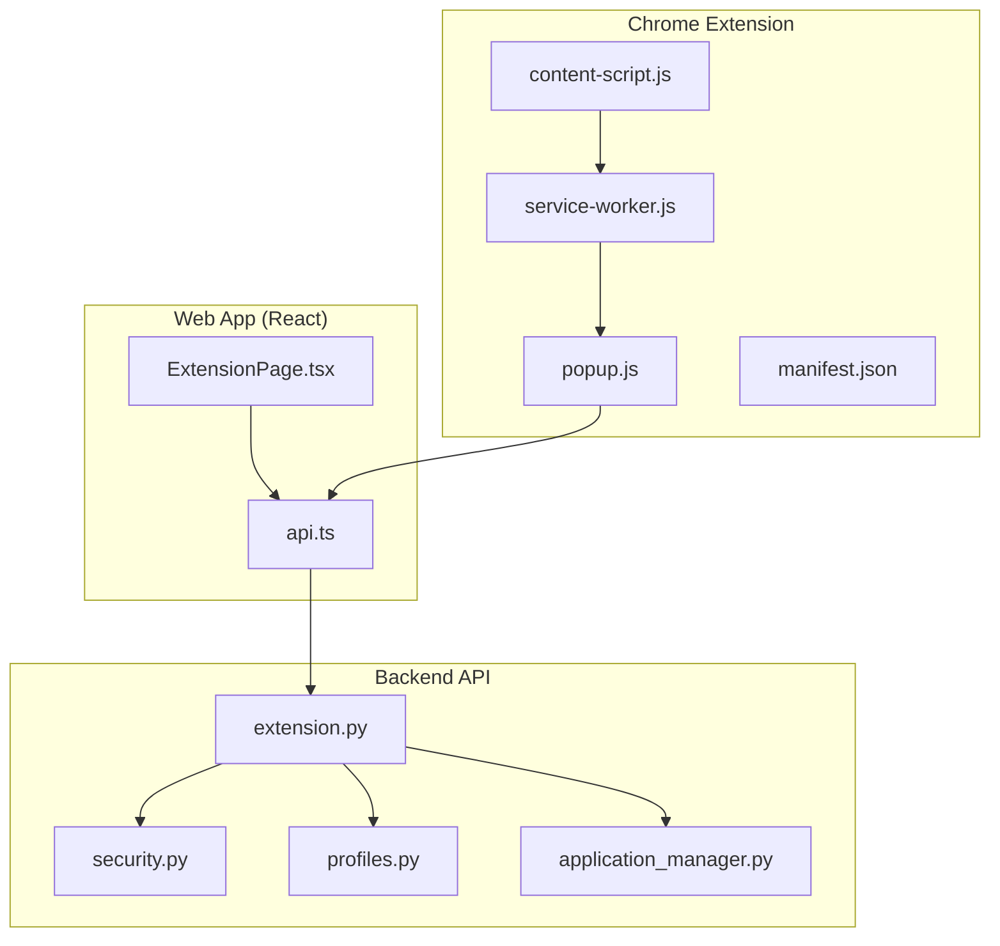
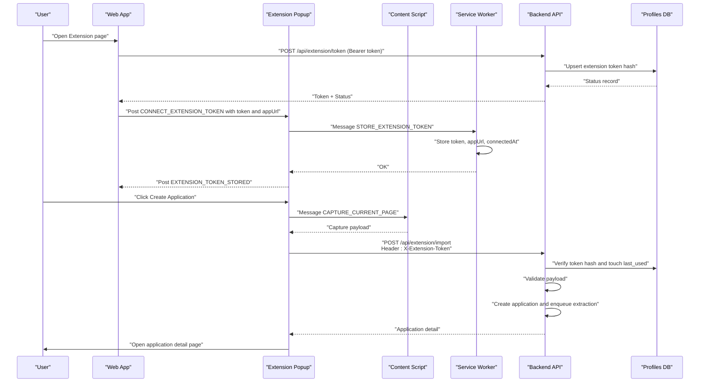
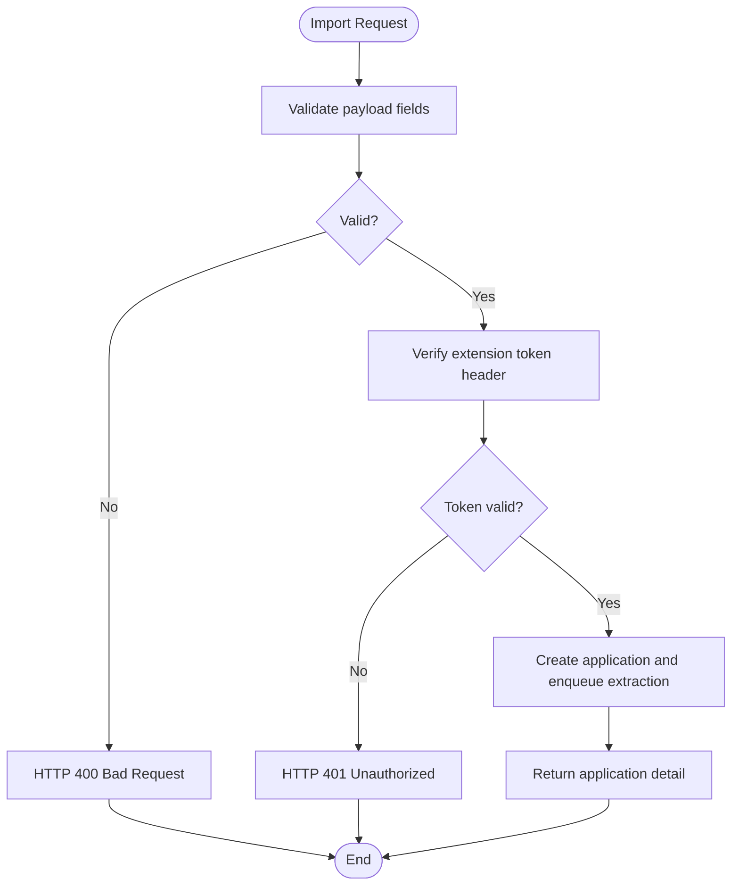
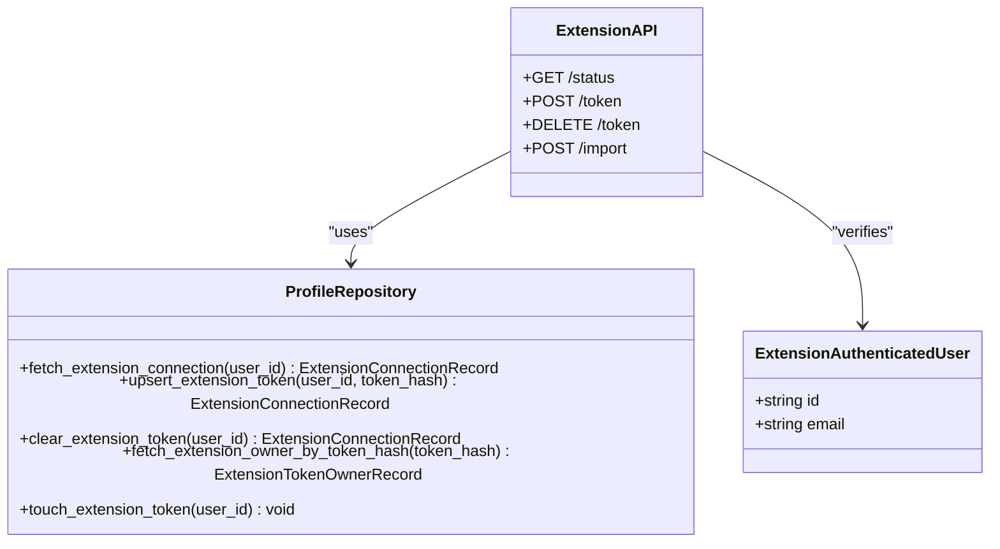
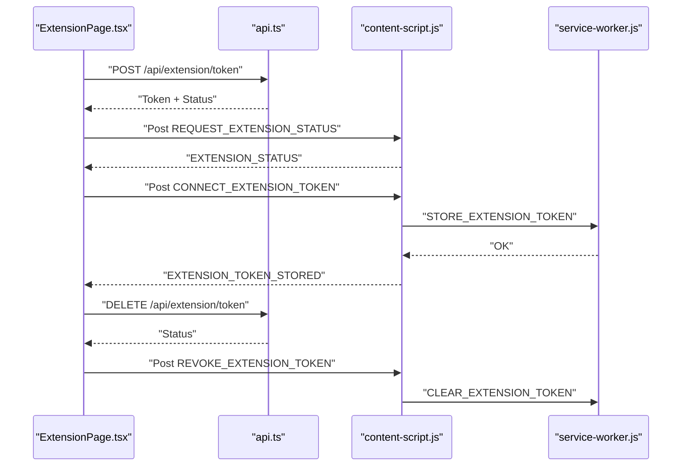
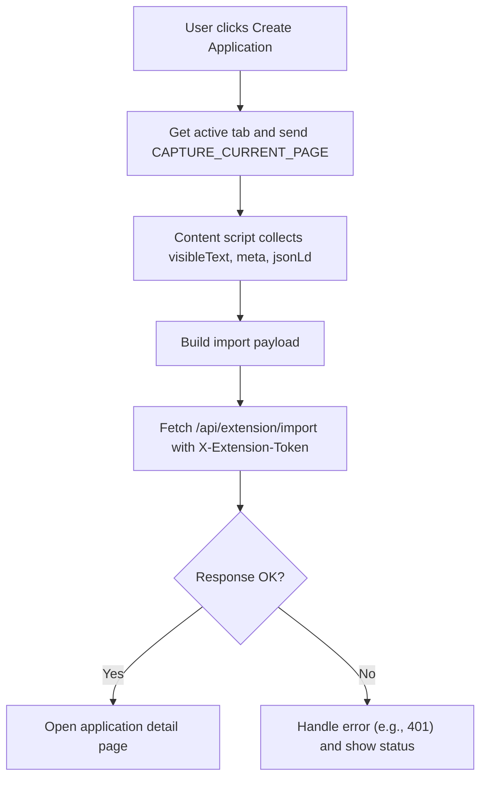
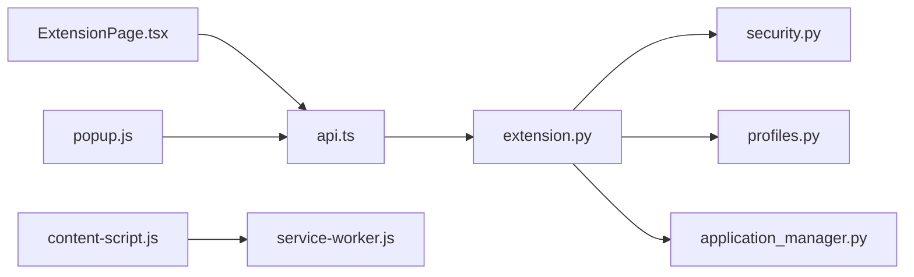

# Extension Integration

<cite>
**Referenced Files in This Document**
- [extension.py](file://backend/app/api/extension.py)
- [security.py](file://backend/app/core/security.py)
- [profiles.py](file://backend/app/db/profiles.py)
- [application_manager.py](file://backend/app/services/application_manager.py)
- [test_extension_api.py](file://backend/tests/test_extension_api.py)
- [content-script.js](file://frontend/public/chrome-extension/content-script.js)
- [service-worker.js](file://frontend/public/chrome-extension/service-worker.js)
- [popup.js](file://frontend/public/chrome-extension/popup.js)
- [manifest.json](file://frontend/public/chrome-extension/manifest.json)
- [ExtensionPage.tsx](file://frontend/src/routes/ExtensionPage.tsx)
- [api.ts](file://frontend/src/lib/api.ts)
- [popup.html](file://frontend/public/chrome-extension/popup.html)
</cite>

## Table of Contents
1. [Introduction](#introduction)
2. [Project Structure](#project-structure)
3. [Core Components](#core-components)
4. [Architecture Overview](#architecture-overview)
5. [Detailed Component Analysis](#detailed-component-analysis)
6. [Dependency Analysis](#dependency-analysis)
7. [Performance Considerations](#performance-considerations)
8. [Troubleshooting Guide](#troubleshooting-guide)
9. [Conclusion](#conclusion)

## Introduction
This document describes the Chrome extension integration endpoints and the secure communication flow between the browser extension and the backend. It covers:
- Job data import from browser tabs via the extension
- Token management for scoped extension access
- Secure cross-origin messaging and authentication
- Message passing protocol between the extension and the web app
- Data validation and error handling for extension requests
- Security considerations for cross-origin communication and token-based authentication

## Project Structure
The integration spans three layers:
- Backend API: FastAPI endpoints under /api/extension for status, token issuance, revocation, and import
- Frontend Web App: React route and API helpers to manage extension connection and communicate with the extension
- Chrome Extension: Content script, service worker, and popup to capture pages and coordinate with the web app

**Diagram sources**
- [ExtensionPage.tsx:1-200](file://frontend/src/routes/ExtensionPage.tsx#L1-200)
- [api.ts:312-326](file://frontend/src/lib/api.ts#L312-L326)
- [content-script.js:1-118](file://frontend/public/chrome-extension/content-script.js#L1-118)
- [service-worker.js:1-37](file://frontend/public/chrome-extension/service-worker.js#L1-37)
- [popup.js:1-156](file://frontend/public/chrome-extension/popup.js#L1-156)
- [manifest.json:1-24](file://frontend/public/chrome-extension/manifest.json#L1-24)
- [extension.py:1-141](file://backend/app/api/extension.py#L1-141)
- [security.py:1-54](file://backend/app/core/security.py#L1-54)
- [profiles.py:1-225](file://backend/app/db/profiles.py#L1-225)
- [application_manager.py:1-800](file://backend/app/services/application_manager.py#L1-800)

**Section sources**
- [extension.py:1-141](file://backend/app/api/extension.py#L1-141)
- [security.py:1-54](file://backend/app/core/security.py#L1-54)
- [profiles.py:1-225](file://backend/app/db/profiles.py#L1-225)
- [application_manager.py:1-800](file://backend/app/services/application_manager.py#L1-800)
- [content-script.js:1-118](file://frontend/public/chrome-extension/content-script.js#L1-118)
- [service-worker.js:1-37](file://frontend/public/chrome-extension/service-worker.js#L1-37)
- [popup.js:1-156](file://frontend/public/chrome-extension/popup.js#L1-156)
- [manifest.json:1-24](file://frontend/public/chrome-extension/manifest.json#L1-24)
- [ExtensionPage.tsx:1-200](file://frontend/src/routes/ExtensionPage.tsx#L1-200)
- [api.ts:312-326](file://frontend/src/lib/api.ts#L312-L326)

## Core Components
- Extension API router: Provides endpoints for status, token issuance, token revocation, and importing captured job data
- Extension token verification: Validates the scoped extension token header and updates usage timestamps
- Profile repository: Manages extension connection state and token storage
- Application service: Creates applications from captured page data and enqueues extraction
- Frontend API helpers: Issue/revoke tokens and import captured data
- Extension bridge: Content script, service worker, and popup for cross-frame messaging and token storage

Key responsibilities:
- Secure token lifecycle management (issue, verify, revoke)
- Cross-origin message validation between the extension and the web app
- Data normalization and validation for import payloads
- Error mapping and user feedback for extension failures

**Section sources**
- [extension.py:27-141](file://backend/app/api/extension.py#L27-L141)
- [security.py:25-54](file://backend/app/core/security.py#L25-L54)
- [profiles.py:70-157](file://backend/app/db/profiles.py#L70-L157)
- [application_manager.py:78-101](file://backend/app/services/application_manager.py#L78-L101)
- [api.ts:312-326](file://frontend/src/lib/api.ts#L312-L326)
- [content-script.js:40-58](file://frontend/public/chrome-extension/content-script.js#L40-L58)
- [service-worker.js:1-37](file://frontend/public/chrome-extension/service-worker.js#L1-L37)
- [popup.js:1-156](file://frontend/public/chrome-extension/popup.js#L1-L156)

## Architecture Overview
The extension integration uses a two-way trust model:
- The web app issues a scoped extension token bound to the authenticated user’s profile
- The extension stores the token locally and uses it to authenticate import requests
- Cross-origin messages are validated against trusted origins and stored app URL

**Diagram sources**
- [ExtensionPage.tsx:74-125](file://frontend/src/routes/ExtensionPage.tsx#L74-L125)
- [api.ts:316-326](file://frontend/src/lib/api.ts#L316-L326)
- [popup.js:95-136](file://frontend/public/chrome-extension/popup.js#L95-L136)
- [content-script.js:60-74](file://frontend/public/chrome-extension/content-script.js#L60-L74)
- [service-worker.js:1-37](file://frontend/public/chrome-extension/service-worker.js#L1-L37)
- [extension.py:93-141](file://backend/app/api/extension.py#L93-L141)
- [security.py:34-54](file://backend/app/core/security.py#L34-L54)
- [profiles.py:101-157](file://backend/app/db/profiles.py#L101-L157)

## Detailed Component Analysis

### Backend Extension API
Endpoints:
- GET /api/extension/status: Returns extension connection status for the authenticated user
- POST /api/extension/token: Issues a scoped extension token and returns status
- DELETE /api/extension/token: Revokes the extension token and returns status
- POST /api/extension/import: Creates an application from captured page data using the extension token

Validation and error mapping:
- Payload validation ensures non-empty source text and normalized optional strings
- Errors are mapped to HTTP 404, 400, or 500 depending on exception type
- Import endpoint requires a valid extension token via header

**Diagram sources**
- [extension.py:41-65](file://backend/app/api/extension.py#L41-L65)
- [extension.py:114-141](file://backend/app/api/extension.py#L114-L141)
- [security.py:34-54](file://backend/app/core/security.py#L34-L54)

**Section sources**
- [extension.py:27-141](file://backend/app/api/extension.py#L27-L141)
- [application_manager.py:226-246](file://backend/app/services/application_manager.py#L226-L246)

### Extension Token Management
- Token issuance: Generates a scoped token and stores its SHA-256 hash in the user’s profile
- Token verification: Hashes incoming token and checks against stored hash; updates last-used timestamp
- Token revocation: Clears the stored token hash and returns status

**Diagram sources**
- [security.py:25-54](file://backend/app/core/security.py#L25-L54)
- [profiles.py:70-157](file://backend/app/db/profiles.py#L70-L157)
- [extension.py:79-141](file://backend/app/api/extension.py#L79-L141)

**Section sources**
- [security.py:25-54](file://backend/app/core/security.py#L25-L54)
- [profiles.py:101-157](file://backend/app/db/profiles.py#L101-L157)
- [extension.py:93-141](file://backend/app/api/extension.py#L93-L141)

### Frontend Extension Page and API Helpers
- ExtensionPage.tsx: Manages connection state, issues and revokes tokens, and listens for extension bridge messages
- api.ts: Provides typed helpers for extension endpoints (status, token, import)

**Diagram sources**
- [ExtensionPage.tsx:35-125](file://frontend/src/routes/ExtensionPage.tsx#L35-L125)
- [api.ts:312-326](file://frontend/src/lib/api.ts#L312-L326)
- [content-script.js:76-117](file://frontend/public/chrome-extension/content-script.js#L76-L117)
- [service-worker.js:1-37](file://frontend/public/chrome-extension/service-worker.js#L1-L37)

**Section sources**
- [ExtensionPage.tsx:1-200](file://frontend/src/routes/ExtensionPage.tsx#L1-200)
- [api.ts:312-326](file://frontend/src/lib/api.ts#L312-L326)

### Chrome Extension Bridge
- Content script: Captures current page metadata and responds to extension messages; validates bridge messages against trusted origins
- Service worker: Stores and retrieves extension token and app URL; handles status and token lifecycle messages
- Popup: Builds import request payload and sends import request with the extension token header

**Diagram sources**
- [popup.js:95-136](file://frontend/public/chrome-extension/popup.js#L95-L136)
- [content-script.js:60-74](file://frontend/public/chrome-extension/content-script.js#L60-L74)
- [popup.html:1-22](file://frontend/public/chrome-extension/popup.html#L1-L22)

**Section sources**
- [content-script.js:1-118](file://frontend/public/chrome-extension/content-script.js#L1-L118)
- [service-worker.js:1-37](file://frontend/public/chrome-extension/service-worker.js#L1-L37)
- [popup.js:1-156](file://frontend/public/chrome-extension/popup.js#L1-L156)
- [manifest.json:1-24](file://frontend/public/chrome-extension/manifest.json#L1-24)

### Data Validation and Error Handling
- Payload validation: Ensures non-empty source text and strips/normalizes optional fields
- Error mapping: Converts exceptions to HTTP 404/400/500 with descriptive details
- Frontend error handling: Detects 401 and clears stored token; displays user-friendly messages

Examples:
- Job URL extraction: The extension captures the current tab URL and title, then sends a structured payload to the backend
- Application creation: The backend creates a draft application and enqueues extraction; the frontend opens the application detail page
- Blocked URLs or invalid data: The backend raises validation errors mapped to 400; the frontend surfaces user-friendly messages

**Section sources**
- [extension.py:41-65](file://backend/app/api/extension.py#L41-L65)
- [extension.py:71-77](file://backend/app/api/extension.py#L71-L77)
- [popup.js:118-136](file://frontend/public/chrome-extension/popup.js#L118-L136)
- [test_extension_api.py:177-204](file://backend/tests/test_extension_api.py#L177-L204)

## Dependency Analysis
- Backend depends on:
  - Security module for token hashing and verification
  - Profile repository for token storage and connection status
  - Application service for creating applications and enqueuing extraction
- Frontend depends on:
  - Supabase for session-based authentication
  - API helpers for extension endpoints
  - Extension bridge for cross-origin messaging

**Diagram sources**
- [extension.py:1-141](file://backend/app/api/extension.py#L1-L141)
- [security.py:1-54](file://backend/app/core/security.py#L1-L54)
- [profiles.py:1-225](file://backend/app/db/profiles.py#L1-L225)
- [application_manager.py:1-800](file://backend/app/services/application_manager.py#L1-L800)
- [ExtensionPage.tsx:1-200](file://frontend/src/routes/ExtensionPage.tsx#L1-L200)
- [api.ts:312-326](file://frontend/src/lib/api.ts#L312-L326)
- [content-script.js:1-118](file://frontend/public/chrome-extension/content-script.js#L1-L118)
- [service-worker.js:1-37](file://frontend/public/chrome-extension/service-worker.js#L1-L37)
- [popup.js:1-156](file://frontend/public/chrome-extension/popup.js#L1-L156)

**Section sources**
- [extension.py:1-141](file://backend/app/api/extension.py#L1-L141)
- [security.py:1-54](file://backend/app/core/security.py#L1-L54)
- [profiles.py:1-225](file://backend/app/db/profiles.py#L1-L225)
- [application_manager.py:1-800](file://backend/app/services/application_manager.py#L1-L800)
- [ExtensionPage.tsx:1-200](file://frontend/src/routes/ExtensionPage.tsx#L1-L200)
- [api.ts:312-326](file://frontend/src/lib/api.ts#L312-L326)
- [content-script.js:1-118](file://frontend/public/chrome-extension/content-script.js#L1-L118)
- [service-worker.js:1-37](file://frontend/public/chrome-extension/service-worker.js#L1-L37)
- [popup.js:1-156](file://frontend/public/chrome-extension/popup.js#L1-L156)

## Performance Considerations
- Token verification is O(1) with a single DB lookup by hashed token
- Import payload validation is lightweight and occurs before any heavy processing
- Application creation enqueues asynchronous jobs; the import endpoint returns quickly after queueing
- Frontend messaging avoids unnecessary re-renders by caching connection state

## Troubleshooting Guide
Common issues and resolutions:
- Missing or invalid extension token:
  - Symptom: 401 Unauthorized on import
  - Resolution: Reconnect from the Extension page to issue a new token
- Cross-origin message not trusted:
  - Symptom: Extension bridge not detected or token not stored
  - Resolution: Ensure the web app origin is trusted and the extension is loaded from the correct folder
- Import fails due to invalid data:
  - Symptom: 400 Bad Request with validation error
  - Resolution: Ensure the captured page contains sufficient text and valid URLs
- Token expired or revoked:
  - Symptom: 401 Unauthorized; frontend clears stored token
  - Resolution: Reconnect and re-issue token

**Section sources**
- [popup.js:118-136](file://frontend/public/chrome-extension/popup.js#L118-L136)
- [content-script.js:40-58](file://frontend/public/chrome-extension/content-script.js#L40-L58)
- [test_extension_api.py:177-204](file://backend/tests/test_extension_api.py#L177-L204)

## Conclusion
The extension integration provides a secure, scoped mechanism for importing job data from browser tabs. By combining session-based authentication for the web app, a scoped extension token for the extension, and strict cross-origin message validation, the system maintains isolation while enabling seamless job intake. The frontend and backend components work together to present clear feedback and handle errors gracefully.