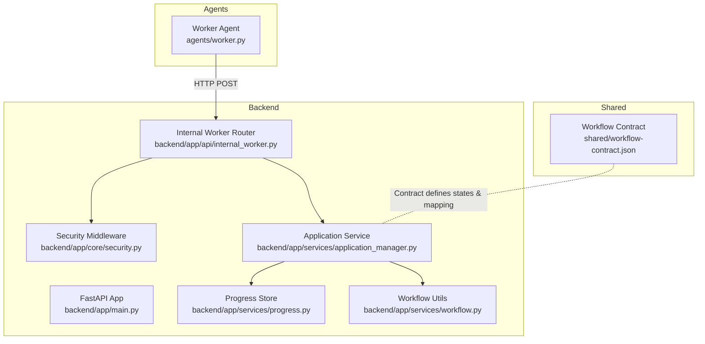
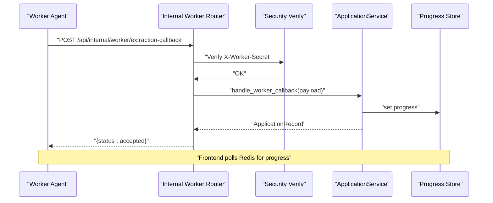
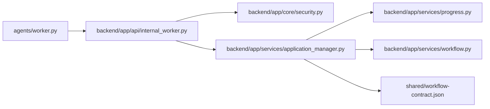

# Internal Worker API

<cite>
**Referenced Files in This Document**
- [backend/app/api/internal_worker.py](file://backend/app/api/internal_worker.py)
- [backend/app/core/security.py](file://backend/app/core/security.py)
- [backend/app/services/application_manager.py](file://backend/app/services/application_manager.py)
- [backend/app/services/progress.py](file://backend/app/services/progress.py)
- [backend/app/services/workflow.py](file://backend/app/services/workflow.py)
- [backend/app/main.py](file://backend/app/main.py)
- [agents/worker.py](file://agents/worker.py)
- [shared/workflow-contract.json](file://shared/workflow-contract.json)
</cite>

## Table of Contents
1. [Introduction](#introduction)
2. [Project Structure](#project-structure)
3. [Core Components](#core-components)
4. [Architecture Overview](#architecture-overview)
5. [Detailed Component Analysis](#detailed-component-analysis)
6. [Dependency Analysis](#dependency-analysis)
7. [Performance Considerations](#performance-considerations)
8. [Troubleshooting Guide](#troubleshooting-guide)
9. [Conclusion](#conclusion)

## Introduction
This document describes the internal worker coordination API used by AI agents to coordinate tasks, report progress, and communicate status updates. It covers endpoint design, request/response patterns, error propagation, and security requirements for internal API access. The API enables:
- Worker registration and bootstrap progress reporting
- Task assignment callbacks for extraction, generation, and regeneration
- Progress callbacks and completion/failure notifications
- Failure handling and state transitions for applications

## Project Structure
The internal worker API is implemented as a FastAPI router under the backend application and is consumed by agents running in separate containers. The key components are:
- Internal worker API router exposing callback endpoints
- Security middleware enforcing worker secret authentication
- Application service orchestrating state transitions and persistence
- Progress storage for real-time status visibility
- Workflow contract defining internal states and visible statuses

**Diagram sources**
- [backend/app/main.py:14-36](file://backend/app/main.py#L14-L36)
- [backend/app/api/internal_worker.py:16-71](file://backend/app/api/internal_worker.py#L16-L71)
- [backend/app/core/security.py:13-22](file://backend/app/core/security.py#L13-L22)
- [backend/app/services/application_manager.py:455-512](file://backend/app/services/application_manager.py#L455-L512)
- [backend/app/services/progress.py:53-79](file://backend/app/services/progress.py#L53-L79)
- [backend/app/services/workflow.py:11-31](file://backend/app/services/workflow.py#L11-L31)
- [agents/worker.py:290-305](file://agents/worker.py#L290-L305)
- [shared/workflow-contract.json:1-112](file://shared/workflow-contract.json#L1-L112)

**Section sources**
- [backend/app/main.py:14-36](file://backend/app/main.py#L14-L36)
- [backend/app/api/internal_worker.py:16-71](file://backend/app/api/internal_worker.py#L16-L71)
- [backend/app/core/security.py:13-22](file://backend/app/core/security.py#L13-L22)
- [backend/app/services/application_manager.py:455-512](file://backend/app/services/application_manager.py#L455-L512)
- [backend/app/services/progress.py:53-79](file://backend/app/services/progress.py#L53-L79)
- [backend/app/services/workflow.py:11-31](file://backend/app/services/workflow.py#L11-L31)
- [agents/worker.py:290-305](file://agents/worker.py#L290-L305)
- [shared/workflow-contract.json:1-112](file://shared/workflow-contract.json#L1-L112)

## Core Components
- Internal worker API router: Exposes three callback endpoints for extraction, generation, and regeneration workflows.
- Security enforcement: Validates a shared worker secret header for all internal worker endpoints.
- Application service: Transitions application state, persists progress, and triggers downstream actions.
- Progress store: Provides real-time progress retrieval and updates via Redis.
- Workflow contract: Defines internal states, visible statuses, and mapping rules for UI presentation.

Key responsibilities:
- Extraction callback: Acknowledges start, success, and failure events from extraction jobs.
- Generation callback: Manages generation lifecycle and draft updates.
- Regeneration callback: Handles section and full regeneration outcomes.
- Progress reporting: Workers push periodic progress snapshots to Redis for UI polling.

**Section sources**
- [backend/app/api/internal_worker.py:19-71](file://backend/app/api/internal_worker.py#L19-L71)
- [backend/app/core/security.py:13-22](file://backend/app/core/security.py#L13-L22)
- [backend/app/services/application_manager.py:455-512](file://backend/app/services/application_manager.py#L455-L512)
- [backend/app/services/application_manager.py:603-719](file://backend/app/services/application_manager.py#L603-L719)
- [backend/app/services/application_manager.py:907-1017](file://backend/app/services/application_manager.py#L907-L1017)
- [backend/app/services/progress.py:53-79](file://backend/app/services/progress.py#L53-L79)
- [shared/workflow-contract.json:1-112](file://shared/workflow-contract.json#L1-L112)

## Architecture Overview
The internal worker API follows a request-response pattern with strict authentication and stateful orchestration:
- Agents call internal endpoints with a shared secret header.
- Backend validates the secret and delegates to the application service.
- Application service updates internal state, writes progress, and triggers notifications.
- Frontend polls progress from Redis-backed progress store.

**Diagram sources**
- [backend/app/api/internal_worker.py:19-34](file://backend/app/api/internal_worker.py#L19-L34)
- [backend/app/core/security.py:13-22](file://backend/app/core/security.py#L13-L22)
- [backend/app/services/application_manager.py:455-512](file://backend/app/services/application_manager.py#L455-L512)
- [backend/app/services/progress.py:53-79](file://backend/app/services/progress.py#L53-L79)

## Detailed Component Analysis

### Internal Worker API Endpoints
- Route: /api/internal/worker/extraction-callback
  - Method: POST
  - Purpose: Report extraction job lifecycle events (started, succeeded, failed).
  - Authentication: Requires X-Worker-Secret header matching configured secret.
  - Request payload: WorkerCallbackPayload with application_id, user_id, job_id, event, and either extracted or failure details.
  - Response: JSON with status accepted on success.
  - Errors: 404 Not Found for missing application, 409 Conflict for user mismatch or invalid state transitions, 400 Bad Request for malformed payload.

- Route: /api/internal/worker/generation-callback
  - Method: POST
  - Purpose: Report generation job lifecycle events (started, progress, succeeded, failed).
  - Authentication: Same secret requirement.
  - Request payload: GenerationCallbackPayload with application_id, user_id, job_id, event, and either generated or failure details.
  - Response: JSON with status accepted on success.
  - Errors: Same mapping as extraction callback.

- Route: /api/internal/worker/regeneration-callback
  - Method: POST
  - Purpose: Report regeneration job lifecycle events (started, succeeded, failed).
  - Authentication: Same secret requirement.
  - Request payload: RegenerationCallbackPayload with application_id, user_id, job_id, event, regeneration_target, and either generated or failure details.
  - Response: JSON with status accepted on success.
  - Errors: Same mapping as extraction callback.

Request/response patterns:
- Event-driven payloads define whether the worker is reporting progress, success, or failure.
- On success, the backend persists extracted or generated content and transitions application state accordingly.
- On failure, the backend marks the application as requiring manual entry or sets failure reasons.

Security:
- All endpoints depend on verify_worker_secret, which compares the incoming X-Worker-Secret header against the configured WORKER_CALLBACK_SECRET setting.

**Section sources**
- [backend/app/api/internal_worker.py:19-71](file://backend/app/api/internal_worker.py#L19-L71)
- [backend/app/core/security.py:13-22](file://backend/app/core/security.py#L13-L22)
- [backend/app/services/application_manager.py:103-141](file://backend/app/services/application_manager.py#L103-L141)
- [backend/app/services/application_manager.py:455-512](file://backend/app/services/application_manager.py#L455-L512)
- [backend/app/services/application_manager.py:124-141](file://backend/app/services/application_manager.py#L124-L141)
- [backend/app/services/application_manager.py:603-719](file://backend/app/services/application_manager.py#L603-L719)
- [backend/app/services/application_manager.py:133-141](file://backend/app/services/application_manager.py#L133-L141)
- [backend/app/services/application_manager.py:907-1017](file://backend/app/services/application_manager.py#L907-L1017)

### Worker Execution and Progress Tracking (Agent-side)
Agent responsibilities:
- Build and send callbacks with X-Worker-Secret header.
- Report lifecycle events: started, progress, succeeded, failed.
- Persist progress snapshots to Redis via a dedicated writer.
- Integrate with external LLM providers for extraction and generation.

Example flows:
- Extraction job: The agent scrapes page context, detects blocked sources, validates extracted content, and reports progress and completion/failure.
- Generation job: The agent generates sections, validates output, and updates progress and state.
- Regeneration job: The agent regenerates either a single section or the full resume and updates progress and state.

Progress model:
- JobProgress captures job_id, workflow_kind, state, message, percent_complete, timestamps, and optional terminal_error_code.
- RedisProgressWriter stores and retrieves progress keyed by application_id.

Failure handling:
- On timeouts or errors, the agent reports failure with a terminal error code and transitions the application to manual entry or failure states.

**Section sources**
- [agents/worker.py:290-305](file://agents/worker.py#L290-L305)
- [agents/worker.py:448-473](file://agents/worker.py#L448-L473)
- [agents/worker.py:526-667](file://agents/worker.py#L526-L667)
- [agents/worker.py:682-800](file://agents/worker.py#L682-L800)
- [agents/worker.py:907-1017](file://agents/worker.py#L907-L1017)
- [backend/app/services/progress.py:13-23](file://backend/app/services/progress.py#L13-L23)
- [backend/app/services/progress.py:53-79](file://backend/app/services/progress.py#L53-L79)

### Application Service Orchestration
ApplicationService coordinates state transitions and persistence:
- handle_worker_callback: Updates internal state based on extraction events and triggers duplicate resolution.
- handle_generation_callback: Manages generation progress, draft creation, and success/failure handling.
- handle_regeneration_callback: Manages regeneration progress and draft updates.
- get_progress: Returns persisted progress or synthesizes a default progress record.

State mapping:
- derive_visible_status maps internal states to visible statuses for UI consumption.

**Section sources**
- [backend/app/services/application_manager.py:455-512](file://backend/app/services/application_manager.py#L455-L512)
- [backend/app/services/application_manager.py:603-719](file://backend/app/services/application_manager.py#L603-L719)
- [backend/app/services/application_manager.py:907-1017](file://backend/app/services/application_manager.py#L907-L1017)
- [backend/app/services/workflow.py:11-31](file://backend/app/services/workflow.py#L11-L31)

### Progress Storage and Polling
ProgressRecord and RedisProgressStore provide:
- Typed progress model with ISO timestamps and optional completion markers.
- Redis-backed storage with TTL for ephemeral progress.
- Utility to build progress snapshots with consistent timestamps.

Frontend polling:
- Clients poll the progress store for the latest JobProgress snapshot associated with an application.

**Section sources**
- [backend/app/services/progress.py:13-23](file://backend/app/services/progress.py#L13-L23)
- [backend/app/services/progress.py:53-79](file://backend/app/services/progress.py#L53-L79)

### Workflow Contract and Visible Status Mapping
The workflow contract defines:
- Internal states and visible statuses
- Failure reasons
- Workflow kinds
- Mapping rules to compute visible status from internal state and failure reason

These rules ensure consistent UI behavior regardless of internal state transitions.

**Section sources**
- [shared/workflow-contract.json:1-112](file://shared/workflow-contract.json#L1-L112)

## Dependency Analysis
The internal worker API depends on:
- Security verification for authentication
- Application service for state transitions and persistence
- Progress store for real-time visibility
- Workflow utilities for status derivation

**Diagram sources**
- [agents/worker.py:290-305](file://agents/worker.py#L290-L305)
- [backend/app/api/internal_worker.py:19-71](file://backend/app/api/internal_worker.py#L19-L71)
- [backend/app/core/security.py:13-22](file://backend/app/core/security.py#L13-L22)
- [backend/app/services/application_manager.py:455-512](file://backend/app/services/application_manager.py#L455-L512)
- [backend/app/services/progress.py:53-79](file://backend/app/services/progress.py#L53-L79)
- [backend/app/services/workflow.py:11-31](file://backend/app/services/workflow.py#L11-L31)
- [shared/workflow-contract.json:1-112](file://shared/workflow-contract.json#L1-L112)

**Section sources**
- [backend/app/api/internal_worker.py:19-71](file://backend/app/api/internal_worker.py#L19-L71)
- [backend/app/core/security.py:13-22](file://backend/app/core/security.py#L13-L22)
- [backend/app/services/application_manager.py:455-512](file://backend/app/services/application_manager.py#L455-L512)
- [backend/app/services/progress.py:53-79](file://backend/app/services/progress.py#L53-L79)
- [backend/app/services/workflow.py:11-31](file://backend/app/services/workflow.py#L11-L31)
- [shared/workflow-contract.json:1-112](file://shared/workflow-contract.json#L1-L112)

## Performance Considerations
- Prefer lightweight progress updates: Emit progress snapshots at logical boundaries rather than continuously to reduce Redis write pressure.
- Use TTL appropriately: Progress entries expire automatically, preventing stale data accumulation.
- Batch notifications: Group notifications for success/failure to minimize downstream processing overhead.
- Model fallbacks: Extraction and generation agents attempt fallback models to improve reliability and reduce retries.

[No sources needed since this section provides general guidance]

## Troubleshooting Guide
Common issues and resolutions:
- Unauthorized access: Ensure X-Worker-Secret matches WORKER_CALLBACK_SECRET. Verify environment configuration and container secrets.
- Application not found: Confirm application_id and user_id match and that the application exists.
- Payload validation errors: Ensure event is one of started, progress, succeeded, failed and that required fields are present for each event type.
- Progress not updating: Verify Redis connectivity and that the agent is writing to the correct application_id key.
- State mismatches: Ensure job_id in callbacks matches the current progress job_id to prevent stale updates.

Error mapping:
- 401 Unauthorized: Invalid or missing worker secret.
- 404 Not Found: Application not found or mismatched ownership.
- 409 Conflict: Permission errors or unsupported state transitions.
- 400 Bad Request: Malformed payload or missing required fields.

**Section sources**
- [backend/app/core/security.py:13-22](file://backend/app/core/security.py#L13-L22)
- [backend/app/api/internal_worker.py:25-34](file://backend/app/api/internal_worker.py#L25-L34)
- [backend/app/api/internal_worker.py:43-52](file://backend/app/api/internal_worker.py#L43-L52)
- [backend/app/api/internal_worker.py:60-70](file://backend/app/api/internal_worker.py#L60-L70)
- [backend/app/services/application_manager.py:455-512](file://backend/app/services/application_manager.py#L455-L512)
- [backend/app/services/application_manager.py:603-719](file://backend/app/services/application_manager.py#L603-L719)
- [backend/app/services/application_manager.py:907-1017](file://backend/app/services/application_manager.py#L907-L1017)

## Conclusion
The internal worker API provides a robust, secure, and stateful mechanism for AI agents to coordinate tasks, report progress, and propagate outcomes. By enforcing shared-secret authentication, validating payloads, and persisting progress, it ensures reliable inter-agent communication and predictable application state transitions. The workflow contract and derived visible status mapping guarantee consistent UI behavior across diverse internal states.