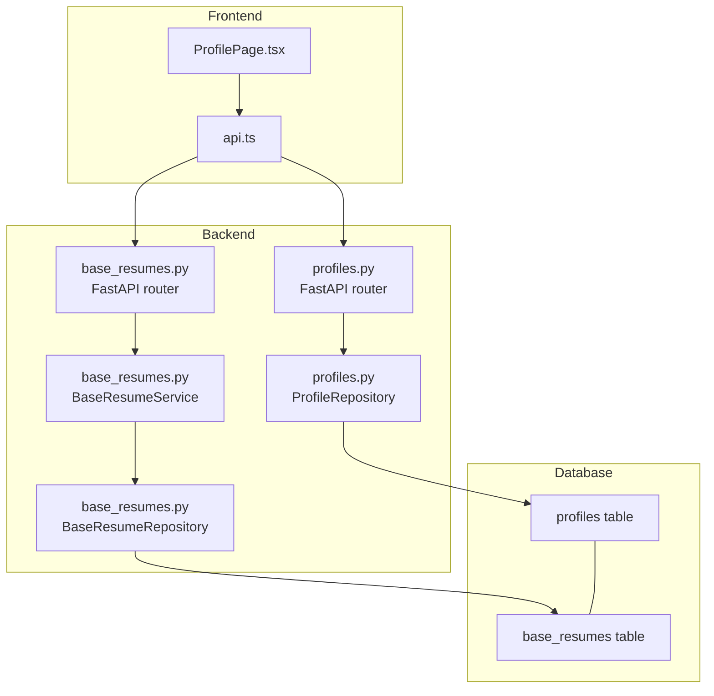
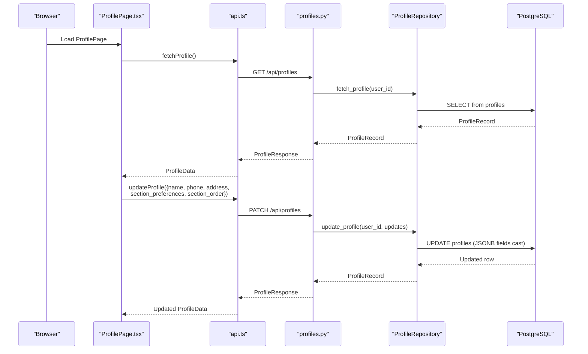
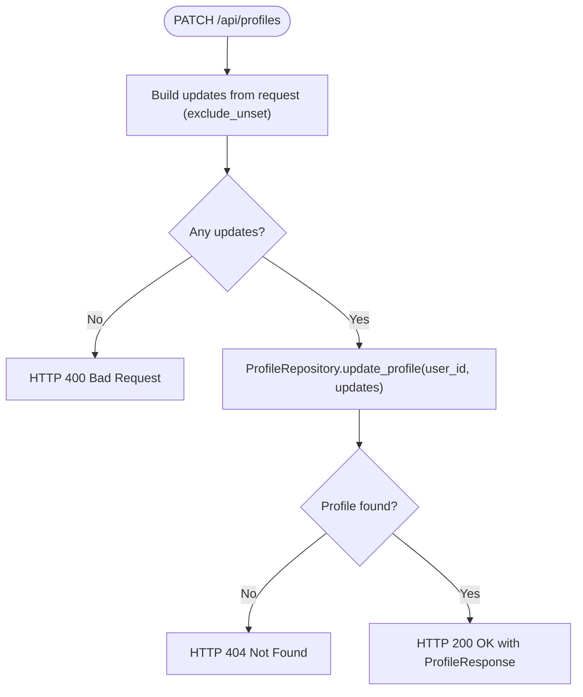
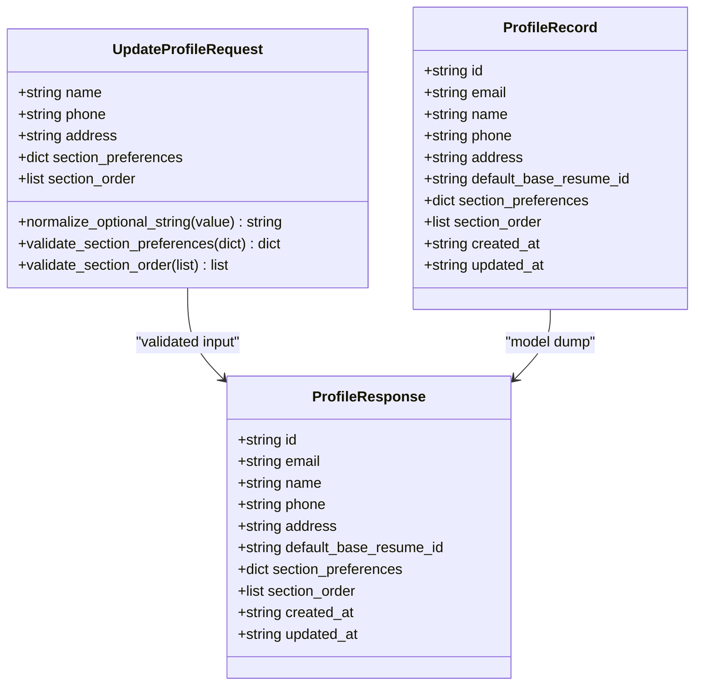
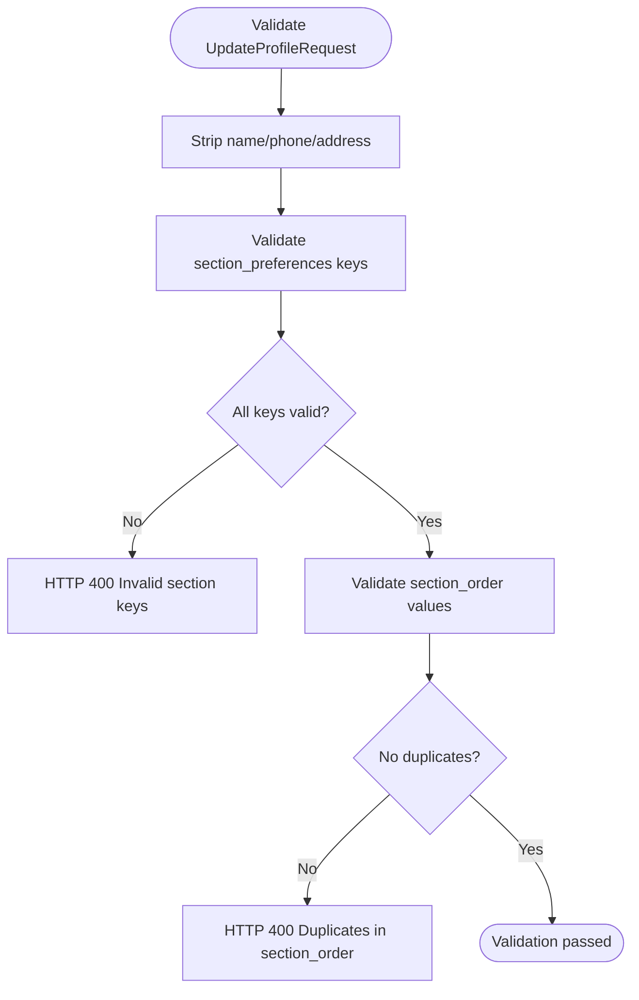
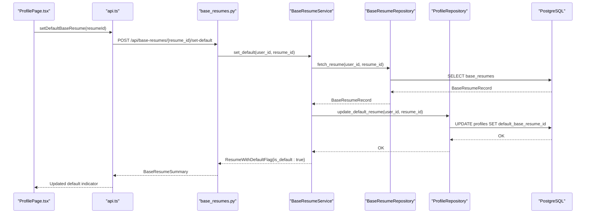
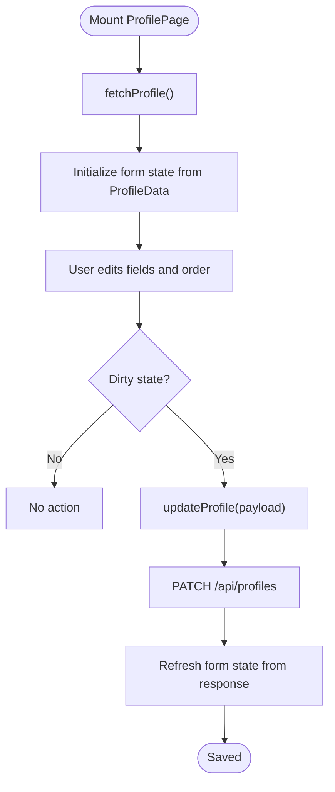
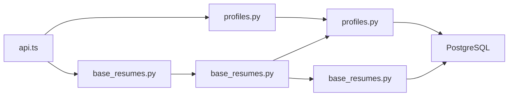

# Profile Management

<cite>
**Referenced Files in This Document**
- [profiles.py](file://backend/app/api/profiles.py)
- [profiles.py](file://backend/app/db/profiles.py)
- [base_resumes.py](file://backend/app/api/base_resumes.py)
- [base_resumes.py](file://backend/app/db/base_resumes.py)
- [base_resumes.py](file://backend/app/services/base_resumes.py)
- [api.ts](file://frontend/src/lib/api.ts)
- [ProfilePage.tsx](file://frontend/src/routes/ProfilePage.tsx)
- [database_schema.md](file://docs/database_schema.md)
- [phase_2_base_resumes.sql](file://supabase/migrations/20260407_000004_phase_2_base_resumes.sql)
</cite>

## Table of Contents
1. [Introduction](#introduction)
2. [Project Structure](#project-structure)
3. [Core Components](#core-components)
4. [Architecture Overview](#architecture-overview)
5. [Detailed Component Analysis](#detailed-component-analysis)
6. [Dependency Analysis](#dependency-analysis)
7. [Performance Considerations](#performance-considerations)
8. [Troubleshooting Guide](#troubleshooting-guide)
9. [Conclusion](#conclusion)
10. [Appendices](#appendices)

## Introduction
This document provides comprehensive API documentation for profile management endpoints, focusing on retrieving and updating user profile information, including personal details, contact information, and application preferences. It also explains the integration with base resume management for template-based resume creation and outlines profile data schemas. Examples of profile updates, base resume association, and validation rules are included, along with the relationship between user profiles and application contexts.

## Project Structure
Profile management spans the backend API layer, database layer, and frontend UI:
- Backend API: FastAPI endpoints under /api/profiles for profile retrieval and updates.
- Database layer: PostgreSQL-backed profile persistence with JSONB fields for preferences and ordering.
- Frontend: React UI that loads profile data, allows editing, and saves changes via authenticated requests.
- Base resume integration: Profiles maintain a default base resume pointer that influences future resume generations.

**Diagram sources**
- [profiles.py:11-113](file://backend/app/api/profiles.py#L11-L113)
- [profiles.py:38-225](file://backend/app/db/profiles.py#L38-L225)
- [base_resumes.py:12-242](file://backend/app/api/base_resumes.py#L12-L242)
- [base_resumes.py:31-184](file://backend/app/db/base_resumes.py#L31-L184)
- [base_resumes.py:32-154](file://backend/app/services/base_resumes.py#L32-L154)
- [api.ts:401-410](file://frontend/src/lib/api.ts#L401-L410)
- [ProfilePage.tsx:17-264](file://frontend/src/routes/ProfilePage.tsx#L17-L264)

**Section sources**
- [profiles.py:11-113](file://backend/app/api/profiles.py#L11-L113)
- [profiles.py:38-225](file://backend/app/db/profiles.py#L38-L225)
- [base_resumes.py:12-242](file://backend/app/api/base_resumes.py#L12-L242)
- [base_resumes.py:31-184](file://backend/app/db/base_resumes.py#L31-L184)
- [base_resumes.py:32-154](file://backend/app/services/base_resumes.py#L32-L154)
- [api.ts:401-410](file://frontend/src/lib/api.ts#L401-L410)
- [ProfilePage.tsx:17-264](file://frontend/src/routes/ProfilePage.tsx#L17-L264)

## Core Components
- Profile API Router: Exposes GET and PATCH endpoints for profile retrieval and updates.
- Profile Repository: Handles database operations for profile records, including JSONB updates for preferences and ordering.
- Frontend Profile Page: Loads profile data, manages local state, and sends updates to the backend.
- Base Resume Integration: Profiles maintain a default base resume pointer; setting a default links a profile to a base resume.

Key responsibilities:
- Validate and normalize incoming profile updates.
- Enforce allowed section keys and ordering constraints.
- Persist JSONB preferences and ordering for future resume generation.
- Integrate with base resume management to set a default template.

**Section sources**
- [profiles.py:16-65](file://backend/app/api/profiles.py#L16-L65)
- [profiles.py:14-25](file://backend/app/db/profiles.py#L14-L25)
- [profiles.py:158-189](file://backend/app/db/profiles.py#L158-L189)
- [api.ts:152-171](file://frontend/src/lib/api.ts#L152-L171)
- [ProfilePage.tsx:17-124](file://frontend/src/routes/ProfilePage.tsx#L17-L124)

## Architecture Overview
The profile management flow integrates frontend UI, backend API, and database persistence, with optional base resume association.

**Diagram sources**
- [ProfilePage.tsx:36-124](file://frontend/src/routes/ProfilePage.tsx#L36-L124)
- [api.ts:401-410](file://frontend/src/lib/api.ts#L401-L410)
- [profiles.py:77-113](file://backend/app/api/profiles.py#L77-L113)
- [profiles.py:158-189](file://backend/app/db/profiles.py#L158-L189)

## Detailed Component Analysis

### Profile API Endpoints
- GET /api/profiles
  - Returns the authenticated user’s profile, including personal info and preferences.
  - Validation: Raises 404 if profile not found.
- PATCH /api/profiles
  - Updates provided fields; ignores unset fields.
  - Validation: Raises 400 if no updates provided.
  - Error mapping: Converts exceptions to appropriate HTTP status codes.

**Diagram sources**
- [profiles.py:91-113](file://backend/app/api/profiles.py#L91-L113)
- [profiles.py:158-189](file://backend/app/db/profiles.py#L158-L189)

**Section sources**
- [profiles.py:77-113](file://backend/app/api/profiles.py#L77-L113)

### Profile Data Schemas
- ProfileResponse (and ProfileRecord): Includes identity, contact info, default base resume pointer, section preferences, section order, and timestamps.
- UpdateProfileRequest: Accepts optional fields for name, phone, address, section_preferences, and section_order with validation rules.

**Diagram sources**
- [profiles.py:14-25](file://backend/app/db/profiles.py#L14-L25)
- [profiles.py:16-65](file://backend/app/api/profiles.py#L16-L65)

**Section sources**
- [profiles.py:14-25](file://backend/app/db/profiles.py#L14-L25)
- [profiles.py:16-65](file://backend/app/api/profiles.py#L16-L65)
- [database_schema.md:48-76](file://docs/database_schema.md#L48-L76)

### Profile Validation Rules
- Name, phone, address: Stripped and coerced to None if empty.
- section_preferences: Keys must be subset of allowed sections; invalid keys cause 400.
- section_order: Values must be subset of allowed sections and must not contain duplicates; invalid values cause 400.

**Diagram sources**
- [profiles.py:23-51](file://backend/app/api/profiles.py#L23-L51)

**Section sources**
- [profiles.py:23-51](file://backend/app/api/profiles.py#L23-L51)

### Base Resume Integration
Profiles maintain a default base resume pointer. Setting a default base resume updates the profile’s default pointer and flags the selected base resume accordingly.

**Diagram sources**
- [base_resumes.py:228-242](file://backend/app/api/base_resumes.py#L228-L242)
- [base_resumes.py:129-141](file://backend/app/services/base_resumes.py#L129-L141)
- [base_resumes.py:92-109](file://backend/app/db/base_resumes.py#L92-L109)
- [profiles.py:196-205](file://backend/app/db/profiles.py#L196-L205)

**Section sources**
- [base_resumes.py:228-242](file://backend/app/api/base_resumes.py#L228-L242)
- [base_resumes.py:129-141](file://backend/app/services/base_resumes.py#L129-L141)
- [base_resumes.py:92-109](file://backend/app/db/base_resumes.py#L92-L109)
- [profiles.py:196-205](file://backend/app/db/profiles.py#L196-L205)

### Frontend Profile Management
- Loads profile on mount, initializes form state, and computes dirty state.
- Supports toggling section preferences and reordering sections.
- Sends PATCH /api/profiles with only changed fields.

**Diagram sources**
- [ProfilePage.tsx:36-124](file://frontend/src/routes/ProfilePage.tsx#L36-L124)
- [api.ts:401-410](file://frontend/src/lib/api.ts#L401-L410)

**Section sources**
- [ProfilePage.tsx:17-124](file://frontend/src/routes/ProfilePage.tsx#L17-L124)
- [api.ts:401-410](file://frontend/src/lib/api.ts#L401-L410)

## Dependency Analysis
- Profile API depends on ProfileRepository for database access.
- Base resume API depends on BaseResumeService, which in turn depends on BaseResumeRepository and ProfileRepository.
- Frontend API module encapsulates authenticated requests and exposes typed functions for profile and base resume operations.
- Database schema defines JSONB contracts for preferences and ordering and foreign key relationships for default base resume.

**Diagram sources**
- [profiles.py:11-113](file://backend/app/api/profiles.py#L11-L113)
- [profiles.py:38-225](file://backend/app/db/profiles.py#L38-L225)
- [base_resumes.py:12-242](file://backend/app/api/base_resumes.py#L12-L242)
- [base_resumes.py:32-154](file://backend/app/services/base_resumes.py#L32-L154)
- [base_resumes.py:31-184](file://backend/app/db/base_resumes.py#L31-L184)
- [api.ts:401-410](file://frontend/src/lib/api.ts#L401-L410)

**Section sources**
- [database_schema.md:48-76](file://docs/database_schema.md#L48-L76)
- [phase_2_base_resumes.sql:14-73](file://supabase/migrations/20260407_000004_phase_2_base_resumes.sql#L14-L73)

## Performance Considerations
- JSONB updates: The repository casts JSONB fields appropriately to ensure efficient storage and retrieval of preferences and ordering.
- Indexing: The database schema recommends indexes supporting user-scoped queries and sorting, aiding performance for profile and base resume operations.
- RLS enforcement: Row-level security policies restrict access to user-owned records, ensuring isolation and reducing unnecessary scans.

[No sources needed since this section provides general guidance]

## Troubleshooting Guide
Common issues and resolutions:
- 400 Bad Request
  - Cause: No updates provided or invalid section keys/values.
  - Resolution: Ensure at least one field is set and section keys/values conform to allowed sets.
- 404 Not Found
  - Cause: Profile not found or base resume not found.
  - Resolution: Verify user authentication and that the requested entity exists.
- 409 Conflict
  - Cause: Permission errors during operations.
  - Resolution: Confirm ownership and proper authentication.

**Section sources**
- [profiles.py:67-74](file://backend/app/api/profiles.py#L67-L74)
- [base_resumes.py:72-82](file://backend/app/api/base_resumes.py#L72-L82)

## Conclusion
Profile management provides a focused interface for maintaining personal information and resume preferences, with strict validation and JSONB-based configuration for future resume generation. Integration with base resume management enables users to select a default template, influencing subsequent resume generations. The frontend offers a responsive editing experience, while backend services and repositories enforce data integrity and ownership.

[No sources needed since this section summarizes without analyzing specific files]

## Appendices

### API Reference: Profile Endpoints
- GET /api/profiles
  - Description: Retrieve the authenticated user’s profile.
  - Authentication: Required.
  - Response: ProfileResponse.
- PATCH /api/profiles
  - Description: Partially update profile fields.
  - Authentication: Required.
  - Request body: UpdateProfileRequest (optional fields).
  - Response: ProfileResponse.

Validation rules:
- name, phone, address: Stripped; empty becomes null.
- section_preferences: Keys must be from allowed set.
- section_order: Values must be from allowed set and must not repeat.

**Section sources**
- [profiles.py:77-113](file://backend/app/api/profiles.py#L77-L113)
- [profiles.py:23-51](file://backend/app/api/profiles.py#L23-L51)

### Data Model: Profiles and Base Resumes
- profiles
  - Columns: id, email, name, phone, address, default_base_resume_id, section_preferences (JSONB), section_order (JSONB), timestamps.
  - Constraints: Unique email; foreign key composite to base_resumes on delete set null.
- base_resumes
  - Columns: id, user_id, name, content_md, timestamps.
  - Constraints: Non-blank name and content_md; unique (id, user_id).

**Section sources**
- [database_schema.md:48-113](file://docs/database_schema.md#L48-L113)