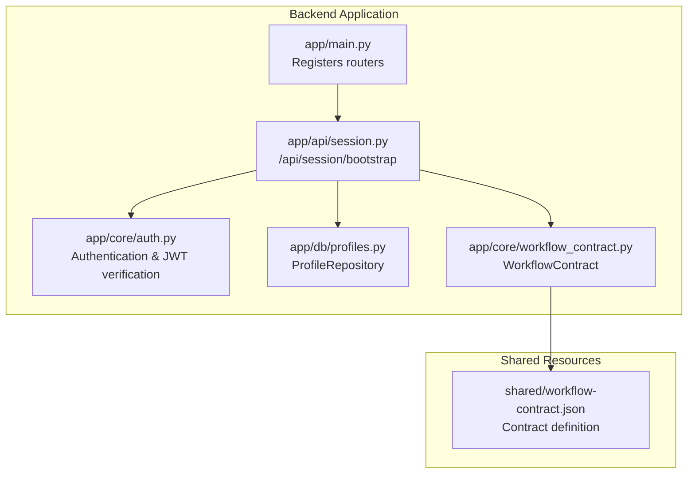
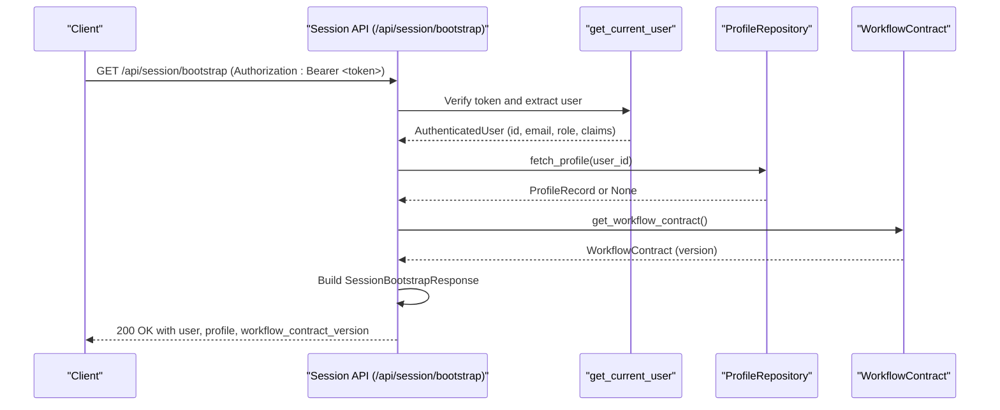
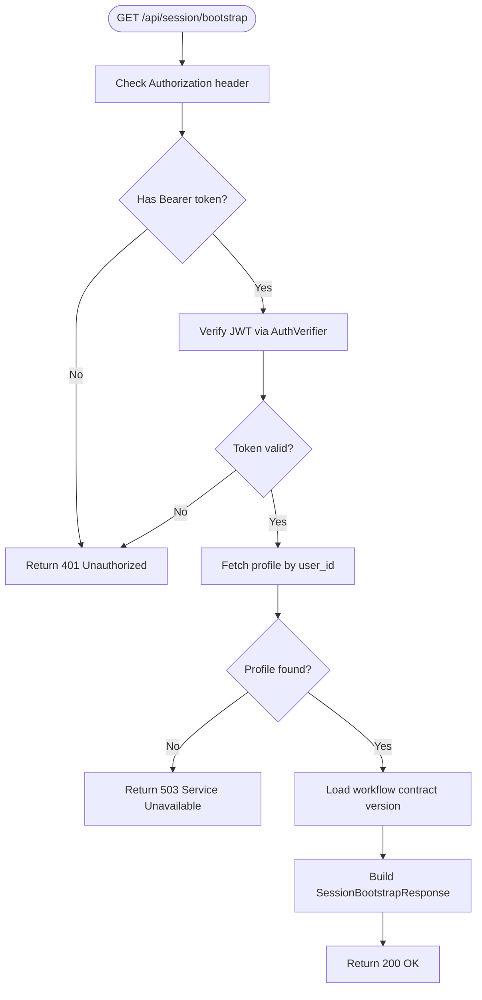
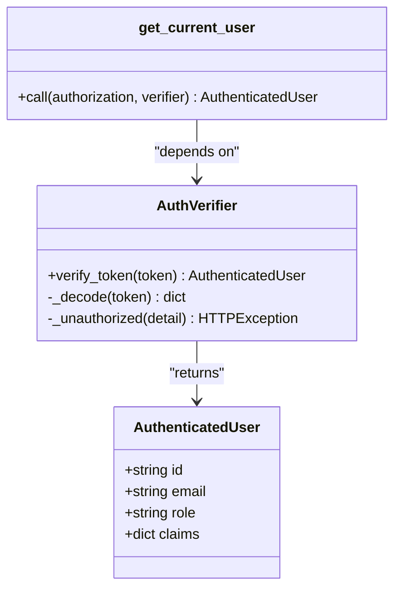
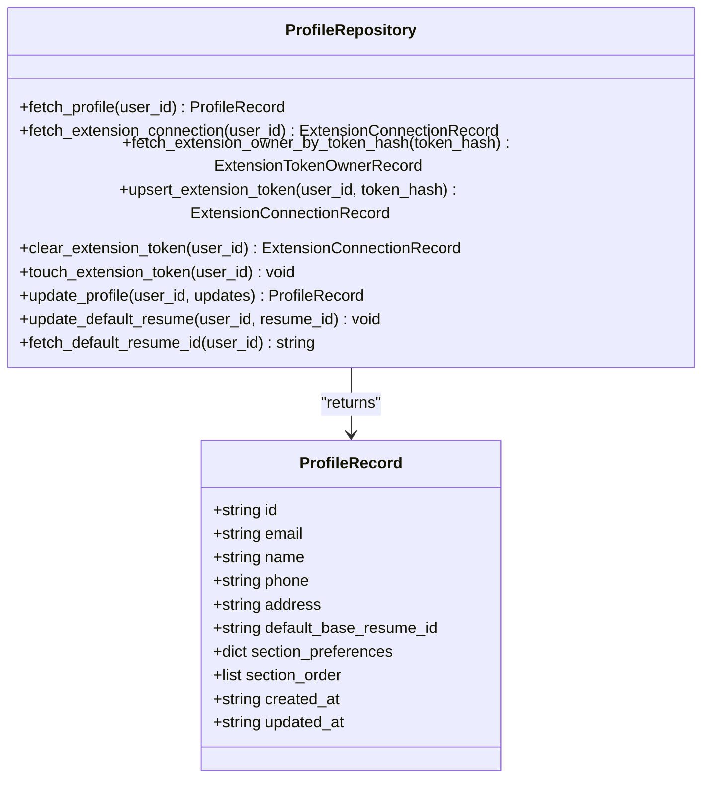
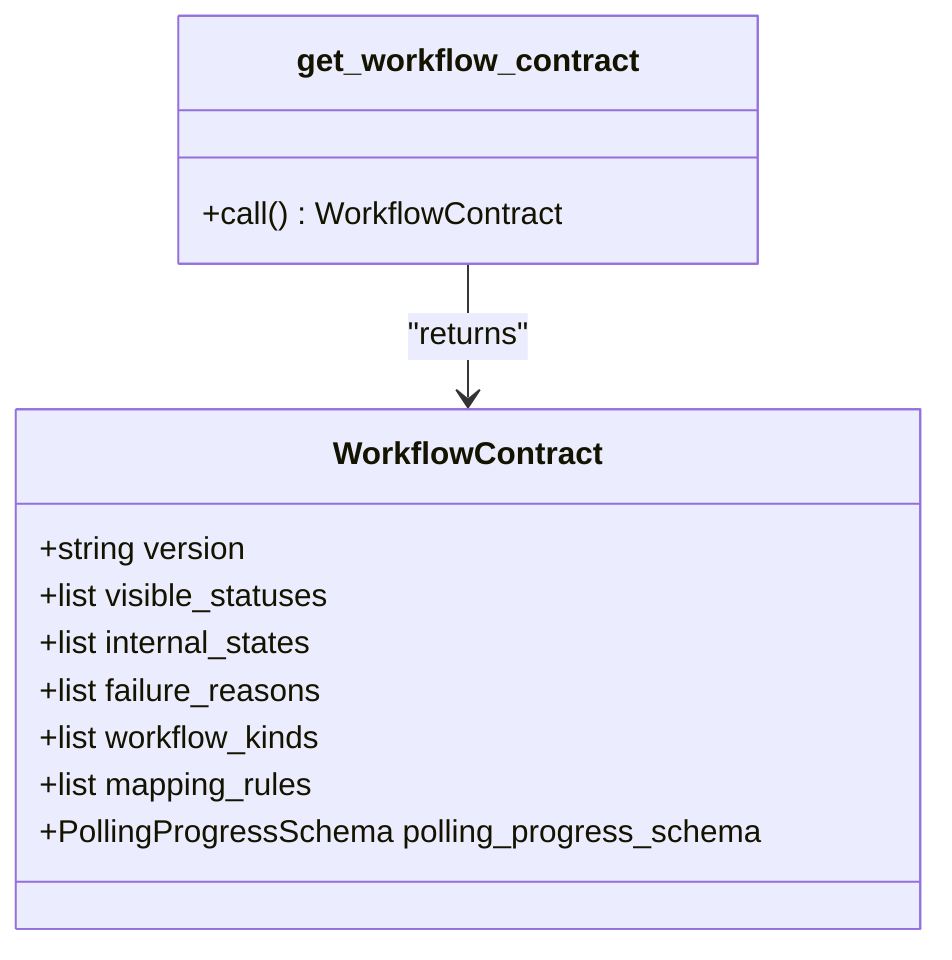
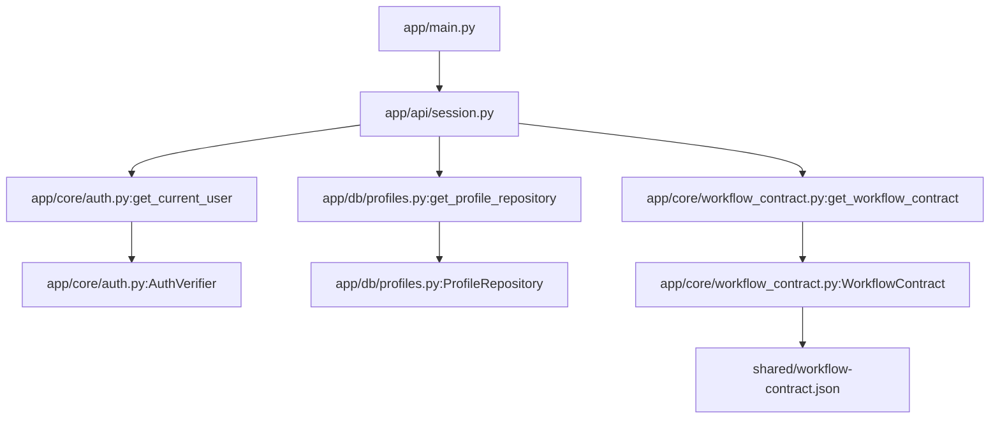

# Session Management

<cite>
**Referenced Files in This Document**
- [session.py](file://backend/app/api/session.py)
- [auth.py](file://backend/app/core/auth.py)
- [profiles.py](file://backend/app/db/profiles.py)
- [workflow_contract.py](file://backend/app/core/workflow_contract.py)
- [main.py](file://backend/app/main.py)
- [test_session_bootstrap.py](file://backend/tests/test_session_bootstrap.py)
- [workflow-contract.json](file://shared/workflow-contract.json)
- [database_schema.md](file://docs/database_schema.md)
</cite>

## Table of Contents
1. [Introduction](#introduction)
2. [Project Structure](#project-structure)
3. [Core Components](#core-components)
4. [Architecture Overview](#architecture-overview)
5. [Detailed Component Analysis](#detailed-component-analysis)
6. [Dependency Analysis](#dependency-analysis)
7. [Performance Considerations](#performance-considerations)
8. [Troubleshooting Guide](#troubleshooting-guide)
9. [Conclusion](#conclusion)

## Introduction
This document provides comprehensive API documentation for the session management endpoints, focusing on the `/api/session/bootstrap` endpoint. It explains how user sessions are initialized, what authentication requirements are enforced, and how the response payload is structured. The documentation covers the integration with the authentication system, profile repository, and workflow contract versioning, along with practical examples of successful responses and error scenarios.

## Project Structure
The session management functionality is implemented within the backend application and integrates with authentication, database repositories, and shared workflow contracts. The main application registers the session router and exposes the bootstrap endpoint.

**Diagram sources**
- [main.py:30](file://backend/app/main.py#L30)
- [session.py:27](file://backend/app/api/session.py#L27)
- [auth.py:72](file://backend/app/core/auth.py#L72)
- [profiles.py:223](file://backend/app/db/profiles.py#L223)
- [workflow_contract.py:32](file://backend/app/core/workflow_contract.py#L32)
- [workflow-contract.json:1](file://shared/workflow-contract.json#L1)

**Section sources**
- [main.py:14](file://backend/app/main.py#L14)
- [main.py:30](file://backend/app/main.py#L30)

## Core Components
This section documents the key components involved in session bootstrap, including the endpoint handler, authentication dependency, profile repository, and workflow contract integration.

- Endpoint: `/api/session/bootstrap`
  - Method: GET
  - Response Model: SessionBootstrapResponse
  - Authentication: Requires a valid Bearer token verified by the authentication system
  - Dependencies:
    - get_current_user: Provides the authenticated user context
    - get_profile_repository: Provides access to the user's profile data
    - get_workflow_contract: Provides the current workflow contract version

- SessionBootstrapResponse Schema
  - user: UserPayload
    - id: string
    - email: optional string
    - role: optional string
  - profile: ProfileRecord
    - id: string
    - email: string
    - name: optional string
    - phone: optional string
    - address: optional string
    - default_base_resume_id: optional string
    - section_preferences: dict[string, bool]
    - section_order: list[string]
    - created_at: string (ISO 8601)
    - updated_at: string (ISO 8601)
  - workflow_contract_version: string

- Authentication Requirements
  - The get_current_user dependency validates the Authorization header and verifies the JWT against configured JWKS or secret
  - On success, returns an AuthenticatedUser object containing user identity, email, role, and raw claims
  - On failure, raises HTTP 401 Unauthorized with a descriptive message

- Profile Repository Integration
  - The ProfileRepository fetches the authenticated user's profile from the database
  - If no profile is found, the endpoint returns HTTP 503 Service Unavailable with a descriptive message
  - The repository uses a connection pool and returns validated ProfileRecord objects

- Workflow Contract Version
  - The workflow contract is loaded from a shared JSON file and cached
  - The endpoint returns the current contract version as part of the response

**Section sources**
- [session.py:21](file://backend/app/api/session.py#L21)
- [session.py:27](file://backend/app/api/session.py#L27)
- [auth.py:15](file://backend/app/core/auth.py#L15)
- [auth.py:72](file://backend/app/core/auth.py#L72)
- [profiles.py:38](file://backend/app/db/profiles.py#L38)
- [profiles.py:47](file://backend/app/db/profiles.py#L47)
- [workflow_contract.py:22](file://backend/app/core/workflow_contract.py#L22)
- [workflow_contract.py:32](file://backend/app/core/workflow_contract.py#L32)

## Architecture Overview
The session bootstrap process orchestrates authentication, profile retrieval, and workflow contract loading to produce a unified response for the client.

**Diagram sources**
- [session.py:27](file://backend/app/api/session.py#L27)
- [auth.py:72](file://backend/app/core/auth.py#L72)
- [profiles.py:47](file://backend/app/db/profiles.py#L47)
- [workflow_contract.py:32](file://backend/app/core/workflow_contract.py#L32)

## Detailed Component Analysis

### Endpoint Handler: bootstrap_session
The bootstrap_session endpoint performs the following steps:
- Validates the Authorization header and extracts the Bearer token
- Verifies the token using the AuthVerifier and get_current_user dependency
- Retrieves the authenticated user's profile via ProfileRepository
- Loads the current workflow contract version
- Constructs and returns a SessionBootstrapResponse

Key behaviors:
- Authentication failures result in HTTP 401 Unauthorized
- Missing or invalid tokens result in HTTP 401 Unauthorized
- If the authenticated profile is unavailable, returns HTTP 503 Service Unavailable
- On success, returns HTTP 200 OK with the complete session payload

**Diagram sources**
- [session.py:27](file://backend/app/api/session.py#L27)
- [auth.py:72](file://backend/app/core/auth.py#L72)
- [profiles.py:47](file://backend/app/db/profiles.py#L47)

**Section sources**
- [session.py:27](file://backend/app/api/session.py#L27)
- [session.py:33](file://backend/app/api/session.py#L33)
- [session.py:34](file://backend/app/api/session.py#L34)

### Authentication Dependency: get_current_user
The get_current_user dependency enforces authentication by:
- Extracting the Authorization header and validating the Bearer scheme
- Using AuthVerifier to decode and verify the JWT
- Returning an AuthenticatedUser object on success
- Raising HTTP 401 Unauthorized on failure with specific messages for missing or invalid tokens

**Diagram sources**
- [auth.py:15](file://backend/app/core/auth.py#L15)
- [auth.py:22](file://backend/app/core/auth.py#L22)
- [auth.py:72](file://backend/app/core/auth.py#L72)

**Section sources**
- [auth.py:72](file://backend/app/core/auth.py#L72)
- [auth.py:27](file://backend/app/core/auth.py#L27)

### Profile Repository: ProfileRepository
The ProfileRepository encapsulates database access for user profiles:
- Uses a connection context manager to manage database connections
- Implements fetch_profile to retrieve a user's profile by ID
- Returns a validated ProfileRecord or None if not found
- Integrates with the database schema documented in database_schema.md

**Diagram sources**
- [profiles.py:14](file://backend/app/db/profiles.py#L14)
- [profiles.py:38](file://backend/app/db/profiles.py#L38)

**Section sources**
- [profiles.py:47](file://backend/app/db/profiles.py#L47)
- [database_schema.md:48](file://docs/database_schema.md#L48)

### Workflow Contract Integration
The workflow contract provides versioning and schema definitions used by the application:
- Loaded from a shared JSON file and cached via get_workflow_contract
- Exposes version and structural definitions for workflow states, statuses, and polling progress
- Returned as part of the session bootstrap response

**Diagram sources**
- [workflow_contract.py:22](file://backend/app/core/workflow_contract.py#L22)
- [workflow_contract.py:32](file://backend/app/core/workflow_contract.py#L32)

**Section sources**
- [workflow_contract.py:32](file://backend/app/core/workflow_contract.py#L32)
- [workflow-contract.json:1](file://shared/workflow-contract.json#L1)

## Dependency Analysis
The session bootstrap endpoint depends on several components that are registered and managed by the main application. The following diagram shows the dependency relationships:

**Diagram sources**
- [main.py:30](file://backend/app/main.py#L30)
- [session.py:8](file://backend/app/api/session.py#L8)
- [auth.py:67](file://backend/app/core/auth.py#L67)
- [profiles.py:223](file://backend/app/db/profiles.py#L223)
- [workflow_contract.py:32](file://backend/app/core/workflow_contract.py#L32)

**Section sources**
- [main.py:30](file://backend/app/main.py#L30)
- [session.py:8](file://backend/app/api/session.py#L8)

## Performance Considerations
- Authentication verification uses a JWK client or secret-based decoding; caching reduces repeated network calls
- Profile retrieval executes a single database query per request; ensure database connection pooling is configured appropriately
- Workflow contract loading is cached to avoid repeated file reads
- Consider adding rate limiting for the bootstrap endpoint to prevent abuse

## Troubleshooting Guide
Common issues and their resolutions:

- Missing Bearer Token
  - Symptom: HTTP 401 Unauthorized with "Missing bearer token."
  - Cause: Authorization header not present or not starting with "Bearer "
  - Resolution: Include a valid Authorization header with the Bearer scheme

- Invalid or Expired Token
  - Symptom: HTTP 401 Unauthorized with "Invalid Supabase access token." or similar
  - Cause: Token verification fails against JWKS or secret
  - Resolution: Obtain a new valid token from the authentication provider

- Unavailable Authenticated Profile
  - Symptom: HTTP 503 Service Unavailable with "Authenticated profile is unavailable."
  - Cause: ProfileRepository.fetch_profile returned None for the authenticated user
  - Resolution: Ensure the user has a corresponding profile record in the database

- Successful Response Validation
  - Use the SessionBootstrapResponse model to validate the structure of the response payload
  - Confirm that user.id matches the authenticated user ID and that profile fields conform to the ProfileRecord schema

**Section sources**
- [test_session_bootstrap.py:72](file://backend/tests/test_session_bootstrap.py#L72)
- [test_session_bootstrap.py:80](file://backend/tests/test_session_bootstrap.py#L80)
- [test_session_bootstrap.py:112](file://backend/tests/test_session_bootstrap.py#L112)
- [test_session_bootstrap.py:93](file://backend/tests/test_session_bootstrap.py#L93)

## Conclusion
The session bootstrap endpoint provides a streamlined mechanism to initialize user sessions by combining authenticated user context, profile data, and workflow contract versioning. Its design emphasizes clear separation of concerns through dedicated authentication, repository, and contract components, enabling reliable and maintainable session management. Proper error handling ensures clients receive meaningful feedback for authentication and profile availability issues, while the response schema supports frontend integration with predictable data structures.