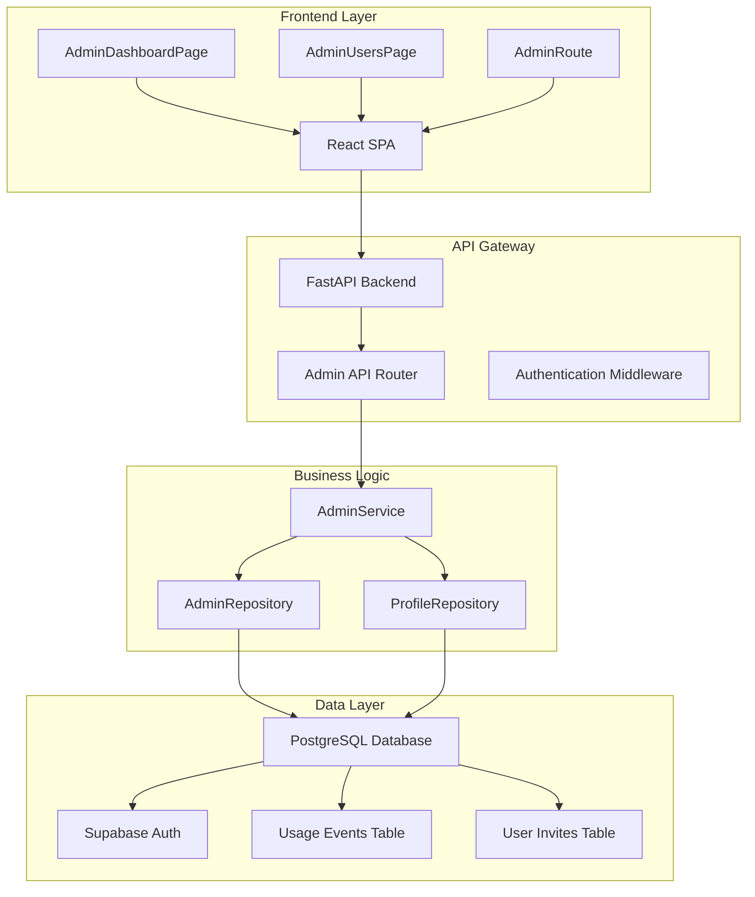
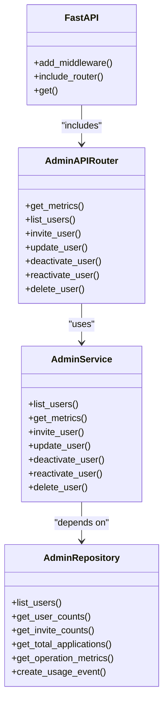
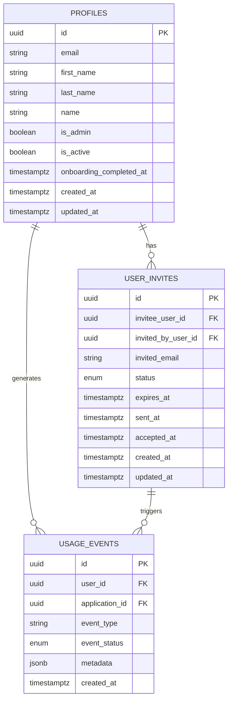
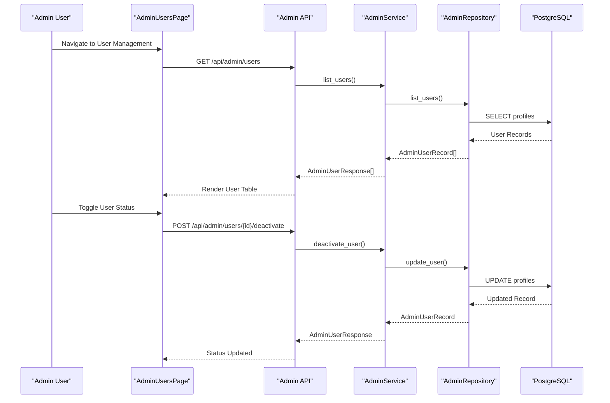
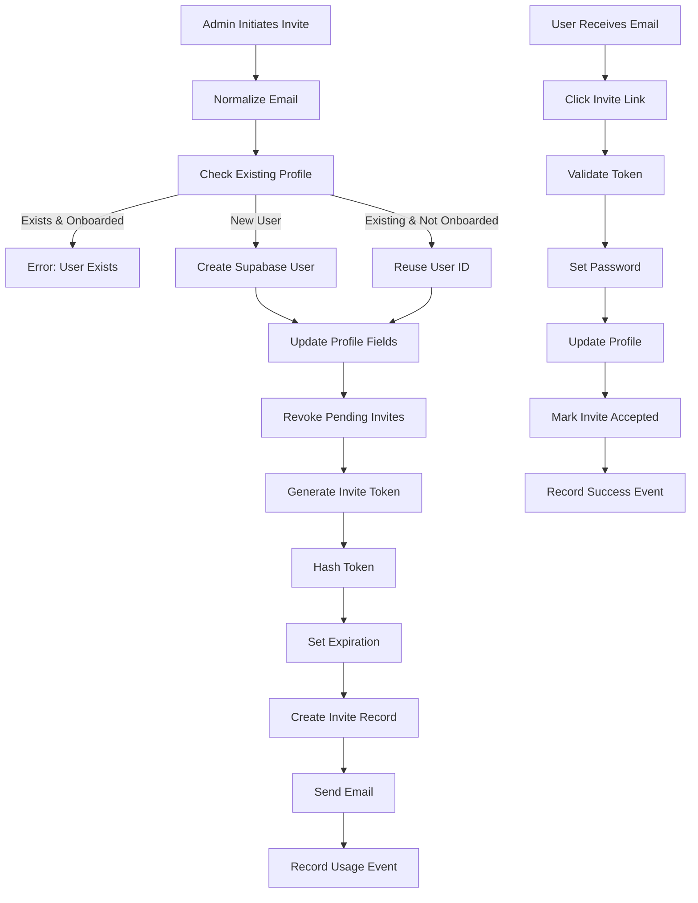
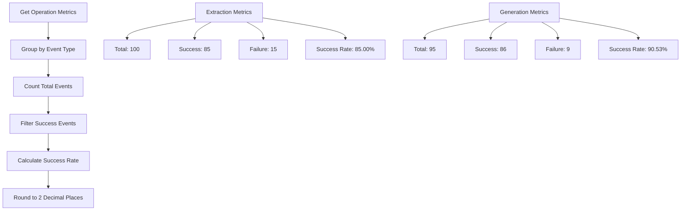
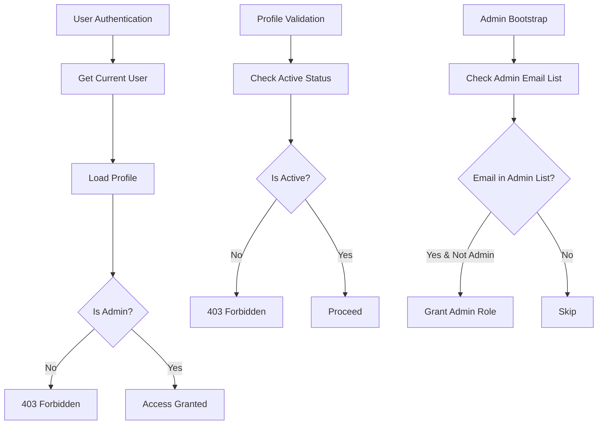
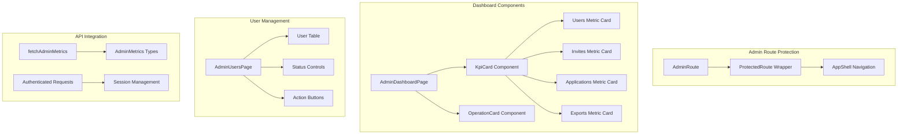

# Administrative Dashboard System

<cite>
**Referenced Files in This Document**
- [README.md](file://README.md)
- [backend/app/main.py](file://backend/app/main.py)
- [backend/app/api/admin.py](file://backend/app/api/admin.py)
- [backend/app/services/admin.py](file://backend/app/services/admin.py)
- [backend/app/db/admin.py](file://backend/app/db/admin.py)
- [backend/app/core/access.py](file://backend/app/core/access.py)
- [frontend/src/routes/AdminDashboardPage.tsx](file://frontend/src/routes/AdminDashboardPage.tsx)
- [frontend/src/routes/AdminUsersPage.tsx](file://frontend/src/routes/AdminUsersPage.tsx)
- [frontend/src/routes/AdminRoute.tsx](file://frontend/src/routes/AdminRoute.tsx)
- [frontend/src/lib/api.ts](file://frontend/src/lib/api.ts)
- [supabase/migrations/20260410_000010_phase_5_invites_admin_metrics.sql](file://supabase/migrations/20260410_000010_phase_5_invites_admin_metrics.sql)
</cite>

## Table of Contents
1. [Introduction](#introduction)
2. [System Architecture](#system-architecture)
3. [Core Components](#core-components)
4. [Admin Dashboard Implementation](#admin-dashboard-implementation)
5. [User Management System](#user-management-system)
6. [Metrics and Analytics](#metrics-and-analytics)
7. [Security and Access Control](#security-and-access-control)
8. [Database Schema](#database-schema)
9. [Frontend Implementation](#frontend-implementation)
10. [API Endpoints](#api-endpoints)
11. [Troubleshooting Guide](#troubleshooting-guide)
12. [Conclusion](#conclusion)

## Introduction

The Administrative Dashboard System is a comprehensive management interface for the Applix AI-powered resume builder platform. This system provides administrators with powerful tools to monitor user engagement, manage user accounts, track system performance, and maintain operational oversight of the job application automation platform.

Applix is designed to help job seekers create AI-crafted, ATS-optimized resumes tailored to specific job opportunities. The administrative dashboard serves as the central control hub for platform operators to monitor usage patterns, manage user provisioning, and ensure optimal system performance.

## System Architecture

The administrative dashboard follows a modern three-tier architecture with clear separation of concerns:



**Diagram sources**
- [backend/app/main.py:1-42](file://backend/app/main.py#L1-L42)
- [backend/app/api/admin.py:1-242](file://backend/app/api/admin.py#L1-L242)
- [backend/app/services/admin.py:69-471](file://backend/app/services/admin.py#L69-L471)

The architecture implements several key design principles:
- **Separation of Concerns**: Clear boundaries between frontend presentation, backend APIs, and database operations
- **Role-Based Access Control**: Admin-only endpoints protected by authentication middleware
- **Event-Driven Metrics**: Usage events tracked for comprehensive analytics
- **Invite-Based Provisioning**: Controlled user onboarding through invitation system

## Core Components

### Backend Foundation

The backend is built on FastAPI, providing type-safe APIs with automatic OpenAPI documentation generation. The main application initializes CORS middleware to support both web and Chrome extension integrations.



**Diagram sources**
- [backend/app/main.py:1-42](file://backend/app/main.py#L1-L42)
- [backend/app/api/admin.py:17-242](file://backend/app/api/admin.py#L17-L242)
- [backend/app/services/admin.py:69-471](file://backend/app/services/admin.py#L69-L471)

**Section sources**
- [backend/app/main.py:1-42](file://backend/app/main.py#L1-L42)
- [backend/app/api/admin.py:1-242](file://backend/app/api/admin.py#L1-L242)

### Database Layer

The database layer implements a robust repository pattern with PostgreSQL as the primary datastore, integrated with Supabase for authentication and row-level security policies.



**Diagram sources**
- [supabase/migrations/20260410_000010_phase_5_invites_admin_metrics.sql:15-70](file://supabase/migrations/20260410_000010_phase_5_invites_admin_metrics.sql#L15-L70)

**Section sources**
- [backend/app/db/admin.py:66-441](file://backend/app/db/admin.py#L66-L441)
- [supabase/migrations/20260410_000010_phase_5_invites_admin_metrics.sql:1-102](file://supabase/migrations/20260410_000010_phase_5_invites_admin_metrics.sql#L1-L102)

## Admin Dashboard Implementation

The admin dashboard provides a comprehensive overview of system metrics and user analytics through an intuitive React interface.

### Dashboard Components

```mermaid
flowchart TD
A[AdminDashboardPage] --> B[fetchAdminMetrics()]
B --> C[AdminMetricsResponse]
C --> D[KpiCard Component]
C --> E[OperationCard Component]
D --> F[Users Metric]
D --> G[Invites Metric]
D --> H[Applications Metric]
D --> I[Exports Metric]
E --> J[Extraction Success Rate]
E --> K[Generation Success Rate]
E --> L[Regeneration Success Rate]
E --> M[Export Success Rate]
N[Loading State] --> O[Skeleton Cards]
P[Error State] --> Q[Error Message]
```

**Diagram sources**
- [frontend/src/routes/AdminDashboardPage.tsx:140-285](file://frontend/src/routes/AdminDashboardPage.tsx#L140-L285)
- [frontend/src/lib/api.ts:229-242](file://frontend/src/lib/api.ts#L229-L242)

The dashboard displays four key performance indicators with visual progress bars and detailed operation metrics showing success versus failure ratios across different workflow stages.

**Section sources**
- [frontend/src/routes/AdminDashboardPage.tsx:1-285](file://frontend/src/routes/AdminDashboardPage.tsx#L1-L285)
- [frontend/src/lib/api.ts:222-242](file://frontend/src/lib/api.ts#L222-L242)

### User Management Interface

The user management system provides comprehensive controls for administrative oversight:



**Diagram sources**
- [frontend/src/routes/AdminUsersPage.tsx:161-186](file://frontend/src/routes/AdminUsersPage.tsx#L161-L186)
- [backend/app/api/admin.py:202-216](file://backend/app/api/admin.py#L202-L216)

**Section sources**
- [frontend/src/routes/AdminUsersPage.tsx:161-186](file://frontend/src/routes/AdminUsersPage.tsx#L161-L186)
- [backend/app/api/admin.py:156-216](file://backend/app/api/admin.py#L156-L216)

## User Management System

The user management system implements a sophisticated invitation-based provisioning model with comprehensive user lifecycle management.

### Invitation Workflow



**Diagram sources**
- [backend/app/services/admin.py:119-270](file://backend/app/services/admin.py#L119-L270)

The invitation system supports temporary passwords, email verification, and comprehensive audit trails through usage events.

**Section sources**
- [backend/app/services/admin.py:119-270](file://backend/app/services/admin.py#L119-L270)
- [backend/app/db/admin.py:236-321](file://backend/app/db/admin.py#L236-L321)

### User Lifecycle Management

The system provides granular control over user accounts with safety mechanisms to prevent self-deactivation and maintain audit integrity.

Key features include:
- **Multi-status filtering**: Active, invited, and deactivated users
- **Bulk operations**: Deactivation, reactivation, and deletion
- **Profile updates**: Email, name, contact information, and LinkedIn profiles
- **Audit logging**: Comprehensive usage event tracking

**Section sources**
- [backend/app/api/admin.py:156-242](file://backend/app/api/admin.py#L156-L242)
- [backend/app/services/admin.py:272-341](file://backend/app/services/admin.py#L272-L341)

## Metrics and Analytics

The metrics system provides comprehensive insights into platform usage patterns and operational performance through structured event tracking.

### Success Rate Calculation



**Diagram sources**
- [backend/app/services/admin.py:87-102](file://backend/app/services/admin.py#L87-L102)

### Usage Event Tracking

The system captures detailed usage events for all major operations, enabling comprehensive analytics and performance monitoring.

**Section sources**
- [backend/app/services/admin.py:80-117](file://backend/app/services/admin.py#L80-L117)
- [backend/app/db/admin.py:322-411](file://backend/app/db/admin.py#L322-L411)

## Security and Access Control

The administrative system implements multiple layers of security to protect sensitive operations and data.

### Role-Based Access Control



**Diagram sources**
- [backend/app/core/access.py:68-77](file://backend/app/core/access.py#L68-L77)

### Security Features

- **Admin-only endpoints**: All administrative operations require admin privileges
- **Self-service prevention**: Administrators cannot deactivate or delete their own accounts
- **Invite validation**: Comprehensive token validation with expiration checking
- **Audit trails**: Complete logging of all administrative actions
- **Email verification**: Secure invitation process with temporary passwords

**Section sources**
- [backend/app/core/access.py:12-77](file://backend/app/core/access.py#L12-L77)
- [backend/app/api/admin.py:117-124](file://backend/app/api/admin.py#L117-L124)

## Database Schema

The database schema supports the administrative dashboard through carefully designed tables with appropriate indexing and security policies.

### Key Tables and Relationships

| Table | Purpose | Key Features |
|-------|---------|--------------|
| `profiles` | User account information | Admin flag, activation status, onboarding completion |
| `user_invites` | Invitation management | Token hashing, status tracking, expiration |
| `usage_events` | Analytics and auditing | Event type categorization, metadata storage |

### Indexing Strategy

The schema includes strategic indexes for optimal query performance:
- Unique indexes on pending invites per user
- Composite indexes on status and timestamps
- JSONB indexing for metadata queries

**Section sources**
- [supabase/migrations/20260410_000010_phase_5_invites_admin_metrics.sql:38-67](file://supabase/migrations/20260410_000010_phase_5_invites_admin_metrics.sql#L38-L67)

## Frontend Implementation

The frontend implementation leverages React with TypeScript for type-safe development and a comprehensive component library for consistent UI patterns.

### Component Architecture



**Diagram sources**
- [frontend/src/routes/AdminRoute.tsx:5-26](file://frontend/src/routes/AdminRoute.tsx#L5-L26)
- [frontend/src/routes/AdminDashboardPage.tsx:21-138](file://frontend/src/routes/AdminDashboardPage.tsx#L21-L138)

### State Management

The frontend implements robust error handling and loading states:
- Skeleton loading cards for initial data fetch
- Comprehensive error state management
- Real-time status updates for user operations
- Responsive design for various screen sizes

**Section sources**
- [frontend/src/routes/AdminDashboardPage.tsx:140-285](file://frontend/src/routes/AdminDashboardPage.tsx#L140-L285)
- [frontend/src/lib/api.ts:289-326](file://frontend/src/lib/api.ts#L289-L326)

## API Endpoints

The administrative API provides a comprehensive set of endpoints for system management and monitoring.

### Endpoint Catalog

| Endpoint | Method | Description | Authentication |
|----------|--------|-------------|----------------|
| `/api/admin/metrics` | GET | Retrieve system metrics | Admin Required |
| `/api/admin/users` | GET | List all users | Admin Required |
| `/api/admin/users/invite` | POST | Send user invitation | Admin Required |
| `/api/admin/users/{id}` | PATCH | Update user profile | Admin Required |
| `/api/admin/users/{id}/deactivate` | POST | Deactivate user account | Admin Required |
| `/api/admin/users/{id}/reactivate` | POST | Reactivate user account | Admin Required |
| `/api/admin/users/{id}` | DELETE | Delete user account | Admin Required |

### Request/Response Patterns

Each endpoint follows consistent patterns:
- **Validation**: Pydantic models for request/response validation
- **Error Handling**: Specific HTTP status codes for different error types
- **Pagination**: Support for search and filtering parameters
- **Type Safety**: Full TypeScript integration on frontend

**Section sources**
- [backend/app/api/admin.py:148-242](file://backend/app/api/admin.py#L148-L242)

## Troubleshooting Guide

### Common Issues and Solutions

**Authentication Problems**
- Verify admin user status in profiles table
- Check session token validity
- Ensure proper CORS configuration for extension access

**Metrics Not Loading**
- Confirm usage events table has data
- Check database connectivity
- Verify event type enumeration values

**User Management Failures**
- Review invite token validation errors
- Check email delivery configuration
- Verify Supabase admin client setup

**Performance Issues**
- Monitor database query performance
- Check index utilization
- Review API response times

### Debugging Tools

The system provides comprehensive logging and error reporting:
- Detailed exception handling with specific error codes
- Usage event tracking for all operations
- Audit trails for administrative actions
- Real-time progress monitoring for long-running operations

## Conclusion

The Administrative Dashboard System represents a comprehensive solution for managing and monitoring the Applix AI-powered resume builder platform. Through its layered architecture, robust security model, and comprehensive analytics capabilities, it provides administrators with the tools necessary to maintain optimal system performance while ensuring user privacy and data protection.

The system's design emphasizes scalability, maintainability, and user experience, with clear separation of concerns and comprehensive error handling. The combination of real-time metrics, detailed analytics, and powerful user management tools makes it an essential component for successful platform operations.

Future enhancements could include expanded analytics dashboards, automated reporting capabilities, and integration with external monitoring systems to further enhance operational visibility and efficiency.