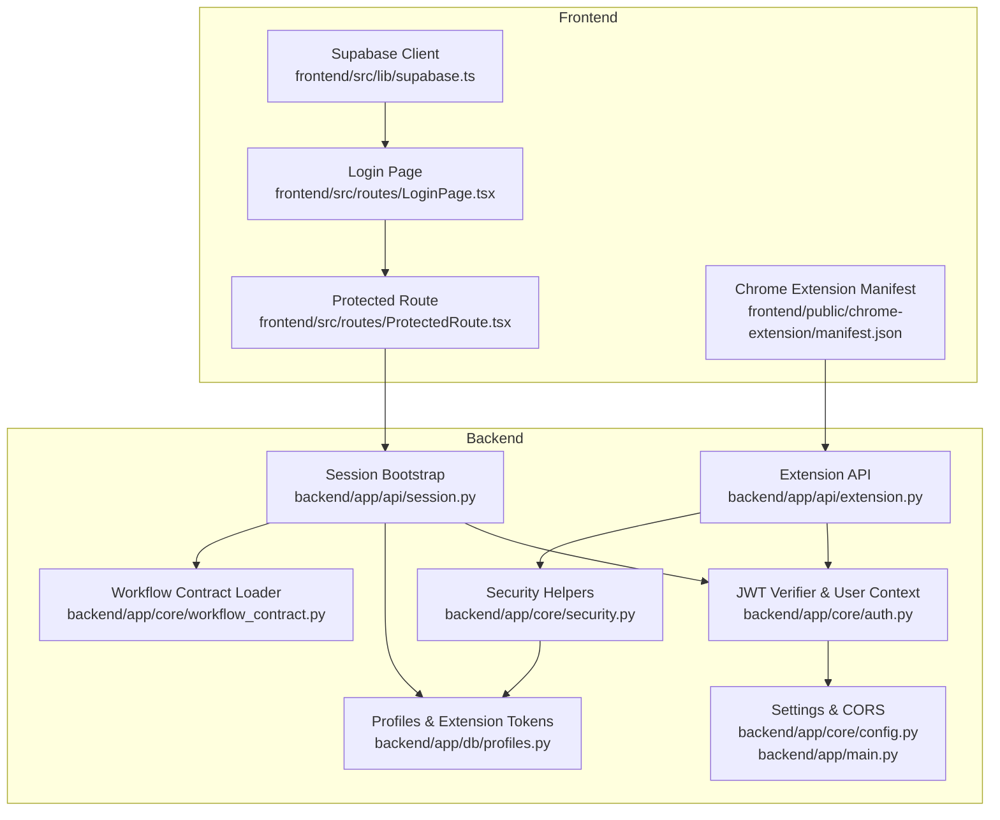
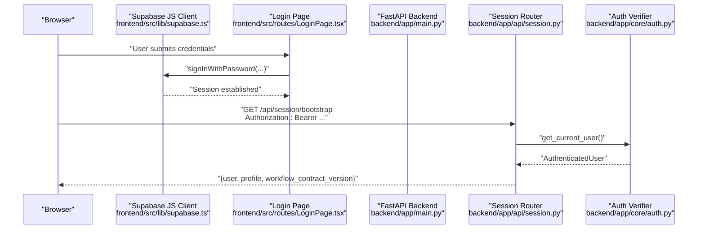
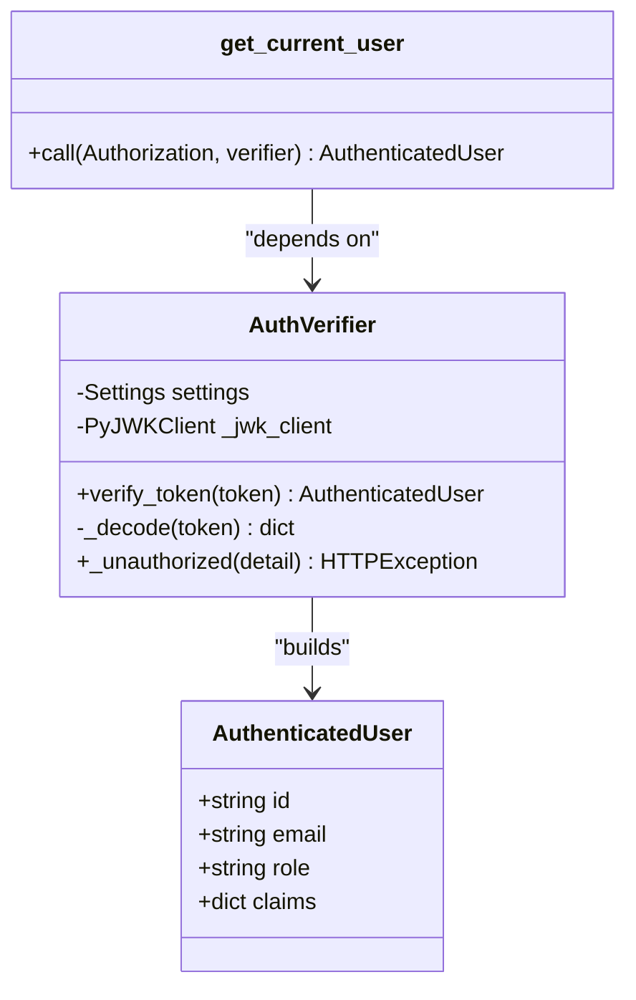
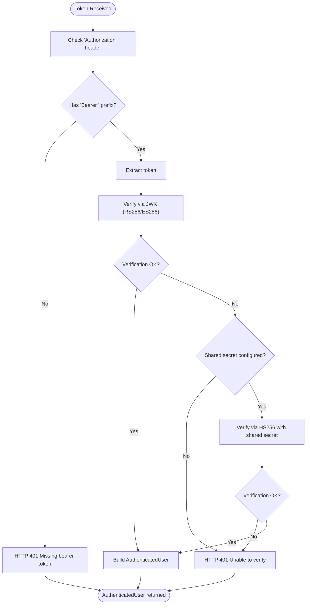
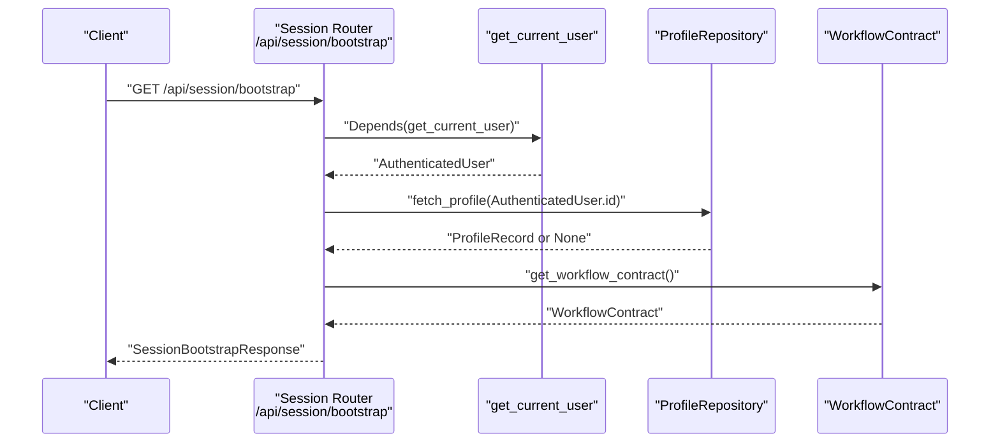
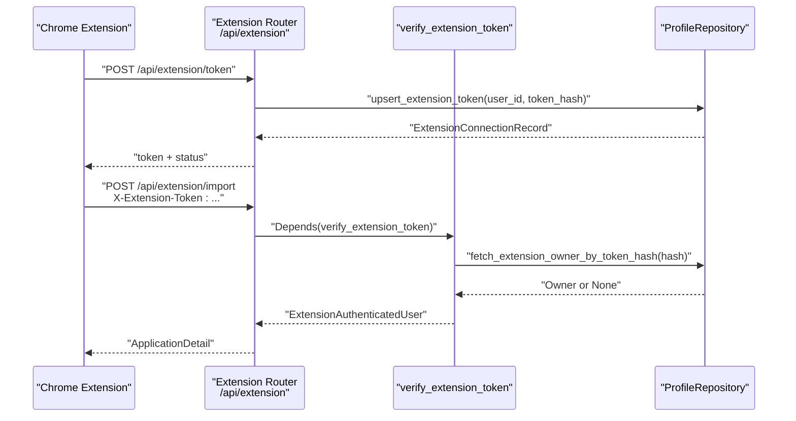
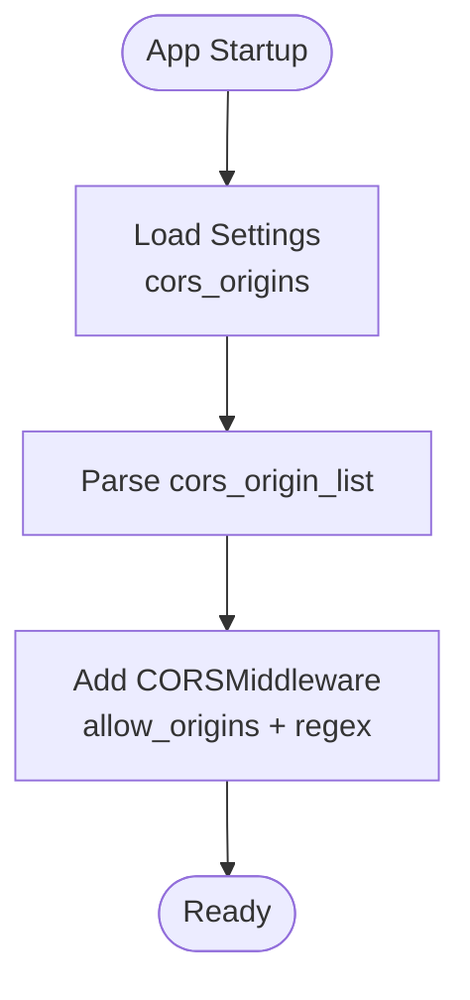
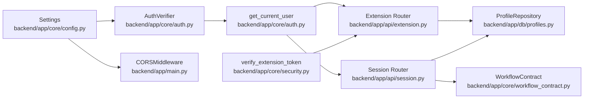

# Authentication & Authorization

<cite>
**Referenced Files in This Document**
- [backend/app/core/auth.py](file://backend/app/core/auth.py)
- [backend/app/core/security.py](file://backend/app/core/security.py)
- [backend/app/core/config.py](file://backend/app/core/config.py)
- [backend/app/main.py](file://backend/app/main.py)
- [backend/app/api/session.py](file://backend/app/api/session.py)
- [backend/app/api/extension.py](file://backend/app/api/extension.py)
- [backend/app/db/profiles.py](file://backend/app/db/profiles.py)
- [backend/app/core/workflow_contract.py](file://backend/app/core/workflow_contract.py)
- [backend/tests/test_auth.py](file://backend/tests/test_auth.py)
- [frontend/src/lib/supabase.ts](file://frontend/src/lib/supabase.ts)
- [frontend/src/routes/LoginPage.tsx](file://frontend/src/routes/LoginPage.tsx)
- [frontend/src/routes/ProtectedRoute.tsx](file://frontend/src/routes/ProtectedRoute.tsx)
- [frontend/public/chrome-extension/manifest.json](file://frontend/public/chrome-extension/manifest.json)
- [supabase/initdb/00-auth-schema.sql](file://supabase/initdb/00-auth-schema.sql)
</cite>

## Table of Contents
1. [Introduction](#introduction)
2. [Project Structure](#project-structure)
3. [Core Components](#core-components)
4. [Architecture Overview](#architecture-overview)
5. [Detailed Component Analysis](#detailed-component-analysis)
6. [Dependency Analysis](#dependency-analysis)
7. [Performance Considerations](#performance-considerations)
8. [Troubleshooting Guide](#troubleshooting-guide)
9. [Conclusion](#conclusion)
10. [Appendices](#appendices)

## Introduction
This document explains the authentication and authorization mechanisms powering the backend. It covers:
- Supabase authentication integration via JWT verification and user context establishment
- Security configuration including token audience/issuer validation and optional shared secret fallback
- Authentication flows from login to protected resource access
- Role-based access control patterns and permission checking mechanisms
- CORS configuration enabling secure Chrome extension communication and token-based authentication
- Practical examples of authentication middleware usage, protected endpoint implementation, and session management
- Security best practices, token refresh strategies, and logout procedures
- Error handling for authentication failures and unauthorized access attempts

## Project Structure
The authentication stack spans the backend core, API routers, database layer, and frontend client. Key areas:
- Core authentication and security: token verification, user context, extension token verification
- API surface: session bootstrap, extension endpoints, and internal worker endpoints
- Configuration: Supabase settings, CORS origins, and shared contract loading
- Frontend: Supabase client configuration, login flow, and protected route gating

**Diagram sources**
- [backend/app/main.py:14-22](file://backend/app/main.py#L14-L22)
- [backend/app/core/config.py:35-96](file://backend/app/core/config.py#L35-L96)
- [backend/app/core/auth.py:22-89](file://backend/app/core/auth.py#L22-L89)
- [backend/app/core/security.py:13-53](file://backend/app/core/security.py#L13-L53)
- [backend/app/db/profiles.py:38-224](file://backend/app/db/profiles.py#L38-L224)
- [backend/app/api/session.py:27-44](file://backend/app/api/session.py#L27-L44)
- [backend/app/api/extension.py:79-140](file://backend/app/api/extension.py#L79-L140)
- [backend/app/core/workflow_contract.py:32-39](file://backend/app/core/workflow_contract.py#L32-L39)
- [frontend/src/lib/supabase.ts:15-25](file://frontend/src/lib/supabase.ts#L15-L25)
- [frontend/src/routes/LoginPage.tsx:17-36](file://frontend/src/routes/LoginPage.tsx#L17-L36)
- [frontend/src/routes/ProtectedRoute.tsx:6-43](file://frontend/src/routes/ProtectedRoute.tsx#L6-L43)
- [frontend/public/chrome-extension/manifest.json:1-24](file://frontend/public/chrome-extension/manifest.json#L1-L24)

**Section sources**
- [backend/app/main.py:14-22](file://backend/app/main.py#L14-L22)
- [backend/app/core/config.py:35-96](file://backend/app/core/config.py#L35-L96)

## Core Components
- AuthVerifier: validates Supabase access tokens using JWK discovery or a shared secret fallback, builds an AuthenticatedUser context
- get_current_user: FastAPI dependency that extracts and validates the Bearer token header
- Extension token verification: hashes and validates extension tokens against stored hashes, updates last-used timestamps
- Session bootstrap: returns user, profile, and workflow contract metadata for authenticated sessions
- CORS configuration: allows cross-origin requests from configured origins and Chrome extension origins

Key responsibilities:
- Token validation: audience, issuer, algorithms, and signature verification
- User context: subject, email, role, and raw claims
- Extension token lifecycle: issuance, revocation, and usage tracking
- Session bootstrap: profile retrieval and workflow contract versioning

**Section sources**
- [backend/app/core/auth.py:22-89](file://backend/app/core/auth.py#L22-L89)
- [backend/app/core/security.py:13-53](file://backend/app/core/security.py#L13-L53)
- [backend/app/api/session.py:27-44](file://backend/app/api/session.py#L27-L44)
- [backend/app/main.py:14-22](file://backend/app/main.py#L14-L22)

## Architecture Overview
The system integrates Supabase Auth for identity and FastAPI for authorization enforcement. The frontend authenticates via Supabase and stores sessions, while the backend verifies JWTs and enforces access to protected resources.

**Diagram sources**
- [frontend/src/lib/supabase.ts:15-25](file://frontend/src/lib/supabase.ts#L15-L25)
- [frontend/src/routes/LoginPage.tsx:17-36](file://frontend/src/routes/LoginPage.tsx#L17-L36)
- [backend/app/api/session.py:27-44](file://backend/app/api/session.py#L27-L44)
- [backend/app/core/auth.py:72-89](file://backend/app/core/auth.py#L72-L89)

## Detailed Component Analysis

### Supabase JWT Verification and User Context
- AuthVerifier constructs a JWK client from the JWKS URL and decodes tokens with audience and issuer checks
- If JWK-based verification fails and a shared secret is configured, it falls back to HS256 verification
- get_current_user enforces Bearer token presence and delegates verification to AuthVerifier
- AuthenticatedUser carries subject, email, role, and raw claims for downstream authorization logic

**Diagram sources**
- [backend/app/core/auth.py:15-89](file://backend/app/core/auth.py#L15-L89)

**Section sources**
- [backend/app/core/auth.py:22-89](file://backend/app/core/auth.py#L22-L89)
- [backend/tests/test_auth.py:29-66](file://backend/tests/test_auth.py#L29-L66)

### Security Configuration and Token Validation
- Settings define Supabase JWKS URL, optional shared secret, audience, and issuer
- Config also exposes CORS origins and a compiled origin list for middleware
- The verifier validates audience and optionally issuer, with algorithm support for RS256/ES256/HS256

**Diagram sources**
- [backend/app/core/auth.py:40-64](file://backend/app/core/auth.py#L40-L64)
- [backend/app/core/config.py:52-58](file://backend/app/core/config.py#L52-L58)

**Section sources**
- [backend/app/core/config.py:35-96](file://backend/app/core/config.py#L35-L96)
- [backend/app/core/auth.py:40-64](file://backend/app/core/auth.py#L40-L64)

### Session Management and Bootstrap
- Session bootstrap endpoint requires a valid Bearer token and returns user info, profile, and workflow contract version
- ProfileRepository fetches profile data for the authenticated user ID
- The endpoint raises a service unavailable error if the profile is missing

**Diagram sources**
- [backend/app/api/session.py:27-44](file://backend/app/api/session.py#L27-L44)
- [backend/app/db/profiles.py:47-68](file://backend/app/db/profiles.py#L47-L68)
- [backend/app/core/workflow_contract.py:32-39](file://backend/app/core/workflow_contract.py#L32-L39)

**Section sources**
- [backend/app/api/session.py:27-44](file://backend/app/api/session.py#L27-L44)
- [backend/app/db/profiles.py:47-68](file://backend/app/db/profiles.py#L47-L68)

### Chrome Extension Authentication and Token Lifecycle
- The extension uses a dedicated token mechanism: a server-generated token is hashed and stored per user
- verify_extension_token validates the incoming X-Extension-Token header against the stored hash and updates last-used timestamps
- The extension API supports issuing, revoking, and importing captured applications using the extension token

**Diagram sources**
- [backend/app/api/extension.py:93-140](file://backend/app/api/extension.py#L93-L140)
- [backend/app/core/security.py:34-53](file://backend/app/core/security.py#L34-L53)
- [backend/app/db/profiles.py:101-156](file://backend/app/db/profiles.py#L101-L156)

**Section sources**
- [backend/app/api/extension.py:79-140](file://backend/app/api/extension.py#L79-L140)
- [backend/app/core/security.py:25-53](file://backend/app/core/security.py#L25-L53)
- [backend/app/db/profiles.py:86-156](file://backend/app/db/profiles.py#L86-L156)

### CORS Configuration for Secure Communication
- The backend enables CORS with allow_origins from settings and a regex allowing chrome-extension:// origins
- Credentials are permitted, and all methods/headers are allowed for development
- The Chrome extension manifest grants permissions for tabs, storage, and content scripts

**Diagram sources**
- [backend/app/core/config.py:90-91](file://backend/app/core/config.py#L90-L91)
- [backend/app/main.py:15-22](file://backend/app/main.py#L15-L22)
- [frontend/public/chrome-extension/manifest.json:6-22](file://frontend/public/chrome-extension/manifest.json#L6-L22)

**Section sources**
- [backend/app/main.py:15-22](file://backend/app/main.py#L15-L22)
- [backend/app/core/config.py:90-91](file://backend/app/core/config.py#L90-L91)
- [frontend/public/chrome-extension/manifest.json:6-22](file://frontend/public/chrome-extension/manifest.json#L6-L22)

### Role-Based Access Control Patterns and Permission Checking
- AuthenticatedUser exposes role claims extracted from the JWT, enabling downstream RBAC decisions
- Implement RBAC by checking user.role in route handlers or service layers
- For least privilege, gate endpoints using get_current_user and enforce role-based logic before data access

Note: The repository does not define centralized permission rules; implement RBAC in route handlers or services using the role claim.

**Section sources**
- [backend/app/core/auth.py:15-38](file://backend/app/core/auth.py#L15-L38)

### Practical Examples
- Authentication middleware usage:
  - Use get_current_user in route dependencies to enforce Bearer token validation
  - Example path: [backend/app/api/session.py](file://backend/app/api/session.py#L29)
- Protected endpoint implementation:
  - Wrap route handlers with get_current_user to ensure authenticated access
  - Example path: [backend/app/api/extension.py](file://backend/app/api/extension.py#L81)
- Session management:
  - Use session bootstrap to load profile and workflow contract version
  - Example path: [backend/app/api/session.py:27-44](file://backend/app/api/session.py#L27-L44)
- Extension token lifecycle:
  - Issue token: [backend/app/api/extension.py:93-103](file://backend/app/api/extension.py#L93-L103)
  - Revoke token: [backend/app/api/extension.py:106-111](file://backend/app/api/extension.py#L106-L111)
  - Import application with extension token: [backend/app/api/extension.py:114-140](file://backend/app/api/extension.py#L114-L140)

**Section sources**
- [backend/app/api/session.py:27-44](file://backend/app/api/session.py#L27-L44)
- [backend/app/api/extension.py:79-140](file://backend/app/api/extension.py#L79-L140)

### Security Best Practices
- Token refresh strategies:
  - Rely on Supabase’s automatic token refresh and persisted session storage
  - Example configuration: [frontend/src/lib/supabase.ts:4-11](file://frontend/src/lib/supabase.ts#L4-L11)
- Logout procedures:
  - Clear session storage and sign out via Supabase client
  - Example usage pattern: [frontend/src/routes/ProtectedRoute.tsx:10-26](file://frontend/src/routes/ProtectedRoute.tsx#L10-L26)
- Password hashing:
  - Supabase manages password hashing; backend does not re-hash passwords
- Token validation:
  - Enforce audience and issuer checks; prefer JWK verification over shared secret
- Session expiration:
  - Supabase controls token lifetimes; backend validates tokens per request

**Section sources**
- [frontend/src/lib/supabase.ts:4-11](file://frontend/src/lib/supabase.ts#L4-L11)
- [frontend/src/routes/ProtectedRoute.tsx:10-26](file://frontend/src/routes/ProtectedRoute.tsx#L10-L26)
- [backend/app/core/auth.py:40-64](file://backend/app/core/auth.py#L40-L64)

## Dependency Analysis
- AuthVerifier depends on Settings for JWKS URL, shared secret, audience, and issuer
- get_current_user depends on AuthVerifier and FastAPI Depends
- Extension endpoints depend on both AuthenticatedUser (for logged-in users) and verify_extension_token (for extension token verification)
- Session bootstrap depends on ProfileRepository and WorkflowContract loader
- CORS middleware depends on Settings.cors_origin_list and regex for Chrome extensions

**Diagram sources**
- [backend/app/core/config.py:35-96](file://backend/app/core/config.py#L35-L96)
- [backend/app/core/auth.py:22-89](file://backend/app/core/auth.py#L22-L89)
- [backend/app/api/session.py:27-44](file://backend/app/api/session.py#L27-L44)
- [backend/app/api/extension.py:79-140](file://backend/app/api/extension.py#L79-L140)
- [backend/app/core/security.py:34-53](file://backend/app/core/security.py#L34-L53)
- [backend/app/db/profiles.py:38-224](file://backend/app/db/profiles.py#L38-L224)
- [backend/app/core/workflow_contract.py:32-39](file://backend/app/core/workflow_contract.py#L32-L39)
- [backend/app/main.py:15-22](file://backend/app/main.py#L15-L22)

**Section sources**
- [backend/app/core/config.py:35-96](file://backend/app/core/config.py#L35-L96)
- [backend/app/core/auth.py:22-89](file://backend/app/core/auth.py#L22-L89)
- [backend/app/api/session.py:27-44](file://backend/app/api/session.py#L27-L44)
- [backend/app/api/extension.py:79-140](file://backend/app/api/extension.py#L79-L140)
- [backend/app/core/security.py:34-53](file://backend/app/core/security.py#L34-L53)
- [backend/app/db/profiles.py:38-224](file://backend/app/db/profiles.py#L38-L224)
- [backend/app/core/workflow_contract.py:32-39](file://backend/app/core/workflow_contract.py#L32-L39)
- [backend/app/main.py:15-22](file://backend/app/main.py#L15-L22)

## Performance Considerations
- Caching: AuthVerifier is cached via lru_cache to avoid repeated JWK client instantiation
- Minimal decoding overhead: JWT verification occurs per request; keep token audiences/issuers aligned with Supabase configuration
- Extension token hashing: SHA-256 hashing is constant-time and efficient for frequent validations

**Section sources**
- [backend/app/core/auth.py:67-69](file://backend/app/core/auth.py#L67-L69)

## Troubleshooting Guide
Common issues and resolutions:
- Missing or invalid Bearer token:
  - Symptom: HTTP 401 Unauthorized during protected endpoint access
  - Resolution: Ensure Authorization header includes "Bearer <token>" and token is present after prefix removal
  - Reference: [backend/app/core/auth.py:72-89](file://backend/app/core/auth.py#L72-L89)
- JWK verification failure with empty JWK set:
  - Symptom: HTTP 401 Unable to verify Supabase access token
  - Resolution: Configure SUPABASE_JWT_SECRET or ensure Supabase JWKS is reachable
  - Reference: [backend/tests/test_auth.py:50-66](file://backend/tests/test_auth.py#L50-L66)
- Shared secret fallback misconfiguration:
  - Symptom: HTTP 401 Invalid Supabase access token when JWK verification fails
  - Resolution: Verify SUPABASE_JWT_SECRET matches the signing secret used by Supabase
  - Reference: [backend/app/core/auth.py:54-60](file://backend/app/core/auth.py#L54-L60)
- Profile unavailable during bootstrap:
  - Symptom: HTTP 503 Service Unavailable when fetching session bootstrap
  - Resolution: Ensure user profile exists for the authenticated user ID
  - Reference: [backend/app/api/session.py:33-38](file://backend/app/api/session.py#L33-L38)
- Extension token invalid or expired:
  - Symptom: HTTP 401 Unauthorized on extension import
  - Resolution: Issue a new token via /api/extension/token and ensure token hash matches stored value
  - References: [backend/app/api/extension.py:114-140](file://backend/app/api/extension.py#L114-L140), [backend/app/core/security.py:34-53](file://backend/app/core/security.py#L34-L53)

**Section sources**
- [backend/app/core/auth.py:72-89](file://backend/app/core/auth.py#L72-L89)
- [backend/tests/test_auth.py:50-66](file://backend/tests/test_auth.py#L50-L66)
- [backend/app/core/auth.py:54-60](file://backend/app/core/auth.py#L54-L60)
- [backend/app/api/session.py:33-38](file://backend/app/api/session.py#L33-L38)
- [backend/app/api/extension.py:114-140](file://backend/app/api/extension.py#L114-L140)
- [backend/app/core/security.py:34-53](file://backend/app/core/security.py#L34-L53)

## Conclusion
The backend implements robust authentication leveraging Supabase JWTs with flexible verification paths (JWK and shared secret), establishes a verified user context, and provides secure session bootstrap and extension token workflows. CORS is configured to support Chrome extension integration. RBAC can be enforced using the role claim from AuthenticatedUser. Adhering to the outlined best practices ensures secure, maintainable authentication across the system.

## Appendices

### Environment Variables and Settings
- Supabase configuration:
  - SUPABASE_AUTH_JWKS_URL, SUPABASE_JWT_SECRET, SUPABASE_JWT_AUDIENCE, SUPABASE_JWT_ISSUER
- CORS configuration:
  - CORS_ORIGINS, APP_URL
- Worker callback:
  - WORKER_CALLBACK_SECRET
- Shared contract path:
  - SHARED_CONTRACT_PATH

**Section sources**
- [backend/app/core/config.py:35-96](file://backend/app/core/config.py#L35-L96)

### Supabase Schema Initialization
- The auth schema initialization script creates the auth schema if it does not exist.

**Section sources**
- [supabase/initdb/00-auth-schema.sql:1-2](file://supabase/initdb/00-auth-schema.sql#L1-L2)