# Backend API

<cite>
**Referenced Files in This Document**
- [backend/app/main.py](file://backend/app/main.py)
- [backend/app/core/config.py](file://backend/app/core/config.py)
- [backend/app/core/auth.py](file://backend/app/core/auth.py)
- [backend/app/core/security.py](file://backend/app/core/security.py)
- [backend/app/api/session.py](file://backend/app/api/session.py)
- [backend/app/api/profiles.py](file://backend/app/api/profiles.py)
- [backend/app/api/applications.py](file://backend/app/api/applications.py)
- [backend/app/api/base_resumes.py](file://backend/app/api/base_resumes.py)
- [backend/app/api/extension.py](file://backend/app/api/extension.py)
- [backend/app/api/internal_worker.py](file://backend/app/api/internal_worker.py)
- [backend/app/db/applications.py](file://backend/app/db/applications.py)
- [backend/app/db/base_resumes.py](file://backend/app/db/base_resumes.py)
- [backend/app/db/profiles.py](file://backend/app/db/profiles.py)
- [backend/app/services/application_manager.py](file://backend/app/services/application_manager.py)
- [backend/app/services/base_resumes.py](file://backend/app/services/base_resumes.py)
- [backend/app/services/duplicates.py](file://backend/app/services/duplicates.py)
- [backend/app/services/email.py](file://backend/app/services/email.py)
- [backend/app/services/jobs.py](file://backend/app/services/jobs.py)
- [backend/app/services/pdf_export.py](file://backend/app/services/pdf_export.py)
- [backend/app/services/progress.py](file://backend/app/services/progress.py)
- [backend/app/services/resume_parser.py](file://backend/app/services/resume_parser.py)
- [backend/app/services/workflow.py](file://backend/app/services/workflow.py)
</cite>

## Update Summary
**Changes Made**
- Added comprehensive documentation for new generation workflow API endpoints
- Documented trigger-generation, trigger-regeneration, trigger-section-regeneration, and cancel-generation endpoints
- Enhanced draft management documentation with save-draft endpoint
- Added detailed workflow examples and state machine documentation
- Updated API reference with new generation endpoints and request/response schemas

## Table of Contents
1. [Introduction](#introduction)
2. [Project Structure](#project-structure)
3. [Core Components](#core-components)
4. [Architecture Overview](#architecture-overview)
5. [Detailed Component Analysis](#detailed-component-analysis)
6. [Generation Workflow API Endpoints](#generation-workflow-api-endpoints)
7. [Dependency Analysis](#dependency-analysis)
8. [Performance Considerations](#performance-considerations)
9. [Troubleshooting Guide](#troubleshooting-guide)
10. [Conclusion](#conclusion)
11. [Appendices](#appendices)

## Introduction
This document describes the backend API for a FastAPI-based server that powers an AI-driven resume builder. It covers application structure, router organization, middleware and CORS configuration, authentication and authorization via Supabase JWT verification, and the service-layer architecture. It also documents the database models and repositories, and provides a comprehensive API reference grouped by functional domains: session management, application lifecycle, profile management, base resume management, extension integration, and internal worker callbacks.

## Project Structure
The backend is organized around a FastAPI application that mounts modular routers under /api. Configuration is centralized, authentication is handled via Supabase JWT verification, and services encapsulate business logic while repositories manage data access.

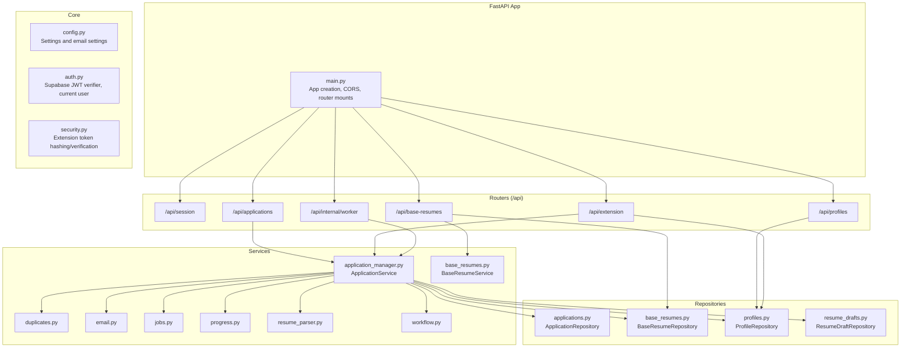

**Diagram sources**
- [backend/app/main.py:1-36](file://backend/app/main.py#L1-L36)
- [backend/app/api/session.py:1-45](file://backend/app/api/session.py#L1-L45)
- [backend/app/api/profiles.py:1-113](file://backend/app/api/profiles.py#L1-L113)
- [backend/app/api/applications.py:1-678](file://backend/app/api/applications.py#L1-L678)
- [backend/app/api/base_resumes.py:1-242](file://backend/app/api/base_resumes.py#L1-L242)
- [backend/app/api/extension.py:1-141](file://backend/app/api/extension.py#L1-L141)
- [backend/app/api/internal_worker.py:1-71](file://backend/app/api/internal_worker.py#L1-L71)
- [backend/app/services/application_manager.py:1-1827](file://backend/app/services/application_manager.py#L1-L1827)
- [backend/app/services/base_resumes.py:1-154](file://backend/app/services/base_resumes.py#L1-L154)
- [backend/app/db/applications.py:1-328](file://backend/app/db/applications.py#L1-L328)
- [backend/app/db/base_resumes.py:1-184](file://backend/app/db/base_resumes.py#L1-L184)
- [backend/app/db/profiles.py:1-225](file://backend/app/db/profiles.py#L1-L225)
- [backend/app/db/resume_drafts.py](file://backend/app/db/resume_drafts.py)

**Section sources**
- [backend/app/main.py:1-36](file://backend/app/main.py#L1-L36)
- [backend/app/core/config.py:1-97](file://backend/app/core/config.py#L1-L97)

## Core Components
- Application initialization and CORS: The app creates a FastAPI instance, configures CORS to allow the frontend origin and the browser extension, registers health check, and includes all routers.
- Configuration: Centralized settings via a cached settings loader, including database, Redis, Supabase auth endpoints, email, and OpenRouter integration.
- Authentication: A JWT verifier validates Supabase access tokens against JWKS or a shared secret, extracting user identity and claims. A dependency injects the current authenticated user into endpoints.
- Security helpers: Extension token hashing and verification enable secure browser extension integration.

**Section sources**
- [backend/app/main.py:1-36](file://backend/app/main.py#L1-L36)
- [backend/app/core/config.py:35-97](file://backend/app/core/config.py#L35-L97)
- [backend/app/core/auth.py:15-90](file://backend/app/core/auth.py#L15-L90)
- [backend/app/core/security.py](file://backend/app/core/security.py)

## Architecture Overview
The API follows a layered architecture:
- Routers define endpoints and bind request/response models.
- Services encapsulate business logic and orchestrate repositories, queues, and external integrations.
- Repositories abstract database operations using raw SQL with psycopg and typed Pydantic models.
- Middleware and CORS are configured at the application level.

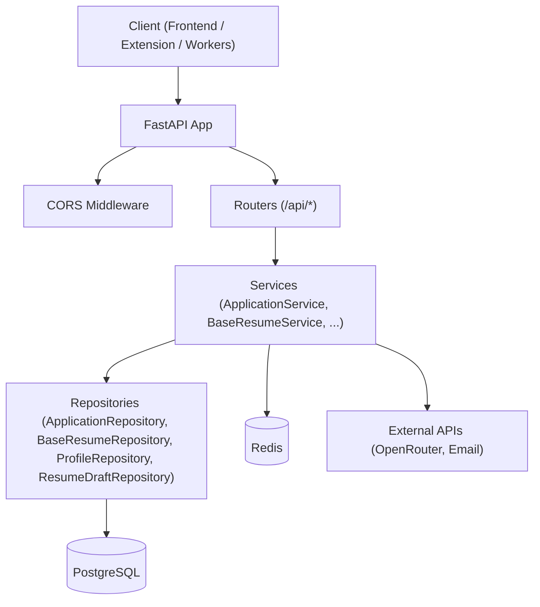

**Diagram sources**
- [backend/app/main.py:14-36](file://backend/app/main.py#L14-L36)
- [backend/app/api/applications.py:1-678](file://backend/app/api/applications.py#L1-L678)
- [backend/app/api/base_resumes.py:1-242](file://backend/app/api/base_resumes.py#L1-L242)
- [backend/app/api/extension.py:1-141](file://backend/app/api/extension.py#L1-L141)
- [backend/app/api/internal_worker.py:1-71](file://backend/app/api/internal_worker.py#L1-L71)
- [backend/app/services/application_manager.py:143-1827](file://backend/app/services/application_manager.py#L143-L1827)
- [backend/app/db/applications.py:123-328](file://backend/app/db/applications.py#L123-L328)
- [backend/app/db/base_resumes.py:31-184](file://backend/app/db/base_resumes.py#L31-L184)
- [backend/app/db/profiles.py:38-225](file://backend/app/db/profiles.py#L38-L225)
- [backend/app/db/resume_drafts.py](file://backend/app/db/resume_drafts.py)

## Detailed Component Analysis

### Session Management
Endpoints under /api/session provide session bootstrap data for the authenticated user, including profile and workflow contract version.

- Endpoint: GET /api/session/bootstrap
  - Authentication: Requires a valid Supabase access token via Authorization header.
  - Response: User identity, profile record, and workflow contract version.
  - Errors: 503 if profile is unavailable.

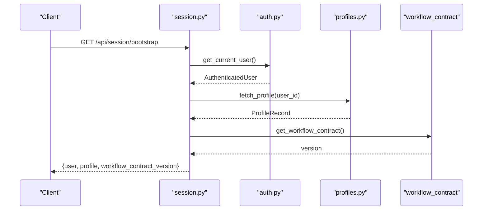

**Diagram sources**
- [backend/app/api/session.py:27-44](file://backend/app/api/session.py#L27-L44)
- [backend/app/core/auth.py:72-90](file://backend/app/core/auth.py#L72-L90)
- [backend/app/db/profiles.py:47-68](file://backend/app/db/profiles.py#L47-L68)

**Section sources**
- [backend/app/api/session.py:1-45](file://backend/app/api/session.py#L1-L45)
- [backend/app/db/profiles.py:1-225](file://backend/app/db/profiles.py#L1-L225)

### Application Lifecycle (CRUD + Workflows)
Endpoints under /api/applications manage job applications, extraction, generation, regeneration, drafts, progress, and exports.

Key endpoints:
- List/Create/Get/Patch application
- Retry extraction
- Manual entry completion
- Recover from source capture
- Duplicate resolution
- Progress polling
- Draft retrieval and saving
- Resume generation and regeneration (full and section)
- PDF export

Validation and normalization:
- String fields are trimmed; blank values are coerced to None.
- Enum-like fields cast to database enums.
- Duplicate resolution accepts specific values only.

Error mapping:
- Service exceptions mapped to appropriate HTTP statuses (400/404/409/500).

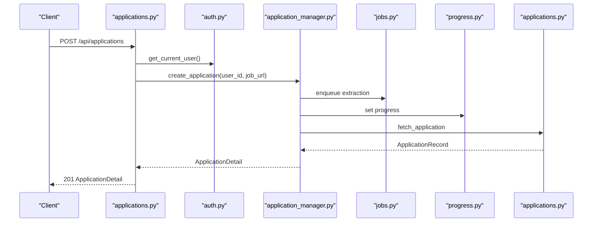

**Diagram sources**
- [backend/app/api/applications.py:384-403](file://backend/app/api/applications.py#L384-L403)
- [backend/app/core/auth.py:72-90](file://backend/app/core/auth.py#L72-L90)
- [backend/app/services/application_manager.py:183-225](file://backend/app/services/application_manager.py#L183-L225)
- [backend/app/services/jobs.py](file://backend/app/services/jobs.py)
- [backend/app/services/progress.py](file://backend/app/services/progress.py)
- [backend/app/db/applications.py:162-192](file://backend/app/db/applications.py#L162-L192)

Additional flows:
- Generation triggers queue and progress updates; success stores draft and notifies.
- Export returns PDF bytes with appropriate headers.

**Section sources**
- [backend/app/api/applications.py:1-678](file://backend/app/api/applications.py#L1-L678)
- [backend/app/services/application_manager.py:513-1152](file://backend/app/services/application_manager.py#L513-L1152)
- [backend/app/services/pdf_export.py](file://backend/app/services/pdf_export.py)

### Profile Management
Endpoints under /api/profiles support retrieving and updating user profile preferences and defaults.

- GET /api/profiles: Returns profile with section preferences/order and default base resume linkage.
- PATCH /api/profiles: Updates name, phone, address, section preferences, and section order with strict validation.

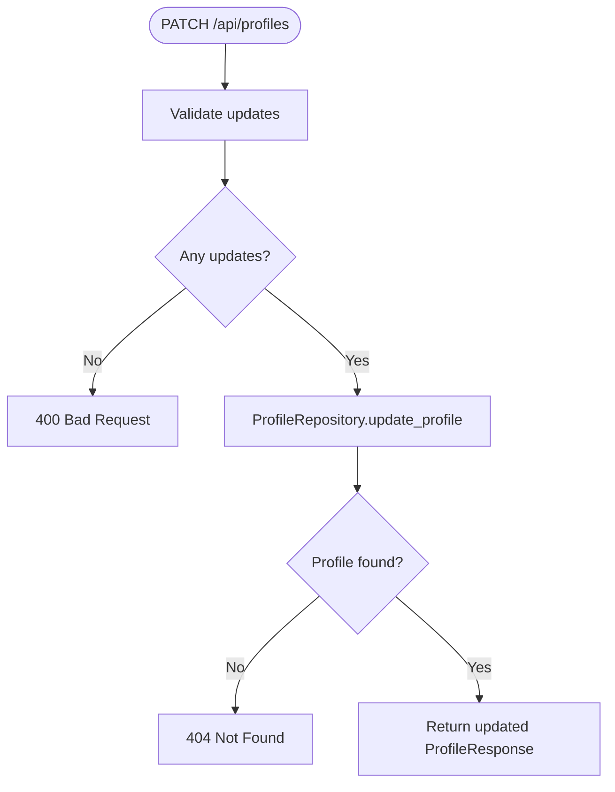

**Diagram sources**
- [backend/app/api/profiles.py:91-113](file://backend/app/api/profiles.py#L91-L113)
- [backend/app/db/profiles.py:158-189](file://backend/app/db/profiles.py#L158-L189)

**Section sources**
- [backend/app/api/profiles.py:1-113](file://backend/app/api/profiles.py#L1-L113)
- [backend/app/db/profiles.py:1-225](file://backend/app/db/profiles.py#L1-L225)

### Base Resume Management
Endpoints under /api/base-resumes manage base resumes, including creation from text and PDF upload with optional LLM cleanup.

- GET /api/base-resumes: List summaries with default flag.
- POST /api/base-resumes: Create from name/content_md.
- POST /api/base-resumes/upload: Upload PDF, parse, optionally cleanup with LLM, then create resume.
- GET /api/base-resumes/{id}: Retrieve detail with default flag.
- PATCH /api/base-resumes/{id}: Update name/content_md.
- DELETE /api/base-resumes/{id}: Delete; requires force=true if referenced.
- POST /api/base-resumes/{id}/set-default: Set as default for user.

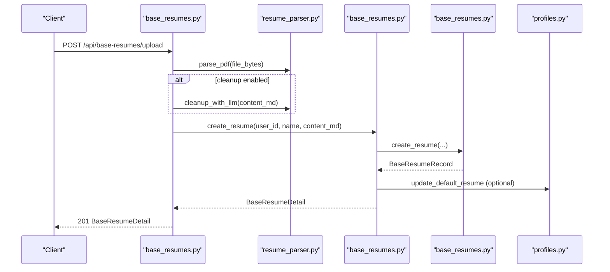

**Diagram sources**
- [backend/app/api/base_resumes.py:111-169](file://backend/app/api/base_resumes.py#L111-L169)
- [backend/app/services/base_resumes.py:55-83](file://backend/app/services/base_resumes.py#L55-L83)
- [backend/app/services/resume_parser.py](file://backend/app/services/resume_parser.py)
- [backend/app/db/base_resumes.py:59-91](file://backend/app/db/base_resumes.py#L59-L91)
- [backend/app/db/profiles.py:196-206](file://backend/app/db/profiles.py#L196-L206)

**Section sources**
- [backend/app/api/base_resumes.py:1-242](file://backend/app/api/base_resumes.py#L1-L242)
- [backend/app/services/base_resumes.py:1-154](file://backend/app/services/base_resumes.py#L1-L154)
- [backend/app/db/base_resumes.py:1-184](file://backend/app/db/base_resumes.py#L1-L184)
- [backend/app/db/profiles.py:1-225](file://backend/app/db/profiles.py#L1-L225)

### Extension Integration
Endpoints under /api/extension support browser extension connectivity:
- GET /api/extension/status: Reports whether the extension is connected and timestamps.
- POST /api/extension/token: Issues a new extension token and updates timestamps.
- DELETE /api/extension/token: Revokes token.
- POST /api/extension/import: Imports a captured job posting; requires extension token verification.

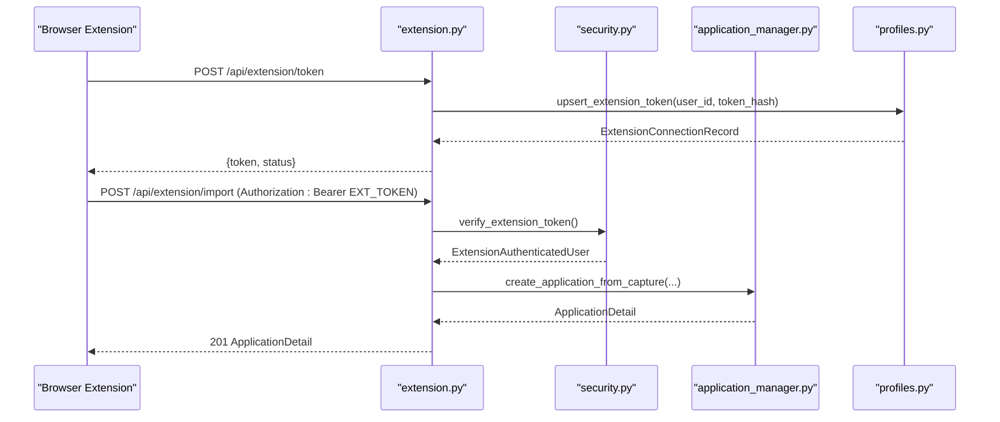

**Diagram sources**
- [backend/app/api/extension.py:93-141](file://backend/app/api/extension.py#L93-L141)
- [backend/app/core/security.py](file://backend/app/core/security.py)
- [backend/app/services/application_manager.py:226-247](file://backend/app/services/application_manager.py#L226-L247)
- [backend/app/db/profiles.py:101-123](file://backend/app/db/profiles.py#L101-L123)

**Section sources**
- [backend/app/api/extension.py:1-141](file://backend/app/api/extension.py#L1-L141)
- [backend/app/core/security.py](file://backend/app/core/security.py)
- [backend/app/db/profiles.py:1-225](file://backend/app/db/profiles.py#L1-L225)

### Internal Worker Callbacks
Endpoints under /api/internal/worker accept callbacks from workers to update extraction and generation states. Requests are authenticated via a shared secret.

- POST /api/internal/worker/extraction-callback
- POST /api/internal/worker/generation-callback
- POST /api/internal/worker/regeneration-callback

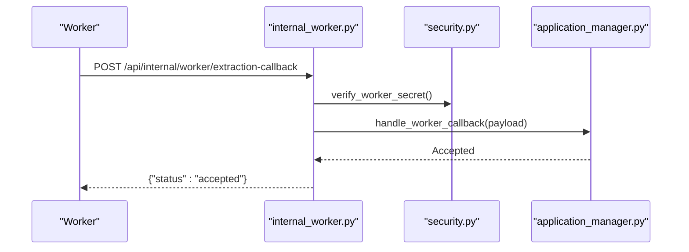

**Diagram sources**
- [backend/app/api/internal_worker.py:19-35](file://backend/app/api/internal_worker.py#L19-L35)
- [backend/app/core/security.py](file://backend/app/core/security.py)
- [backend/app/services/application_manager.py:455-512](file://backend/app/services/application_manager.py#L455-L512)

**Section sources**
- [backend/app/api/internal_worker.py:1-71](file://backend/app/api/internal_worker.py#L1-L71)
- [backend/app/services/application_manager.py:455-512](file://backend/app/services/application_manager.py#L455-L512)

## Generation Workflow API Endpoints

### Overview
The generation workflow API provides comprehensive endpoints for managing resume generation, regeneration, and cancellation. The workflow supports three distinct modes: initial generation, full regeneration, and section-specific regeneration, each with different validation requirements and state transitions.

### State Machine
The generation workflow operates through several states that represent different phases of the generation process:

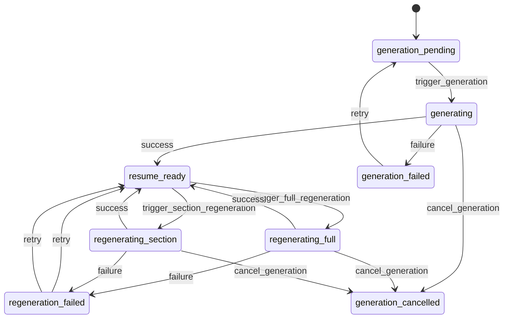

**Diagram sources**
- [backend/app/services/application_manager.py:453-649](file://backend/app/services/application_manager.py#L453-L649)
- [backend/app/services/application_manager.py:856-1152](file://backend/app/services/application_manager.py#L856-L1152)

### Trigger Generation Endpoint
Starts the initial resume generation process for a new application.

- Endpoint: POST /api/applications/{application_id}/generate
- Authentication: Requires valid Supabase access token
- Request Body: GenerateResumeRequest
- Response: ApplicationDetail (202 Accepted)
- Validation Requirements:
  - Application must be in generation_pending or resume_ready state
  - Job title and description must be present
  - No unresolved duplicates allowed
  - Base resume must exist and belong to the user
  - Profile must exist for personal information

**Section sources**
- [backend/app/api/applications.py:560-580](file://backend/app/api/applications.py#L560-L580)
- [backend/app/services/application_manager.py:642-731](file://backend/app/services/application_manager.py#L642-L731)

### Trigger Full Regeneration Endpoint
Regenerates the entire resume using the current draft as a starting point.

- Endpoint: POST /api/applications/{application_id}/regenerate
- Authentication: Requires valid Supabase access token
- Request Body: FullRegenerationRequest
- Response: ApplicationDetail (202 Accepted)
- Validation Requirements:
  - Application must be in resume_ready state
  - Existing draft must exist
  - Job title and description must be present
  - Base resume must be linked to the application

**Section sources**
- [backend/app/api/applications.py:582-601](file://backend/app/api/applications.py#L582-L601)
- [backend/app/services/application_manager.py:856-949](file://backend/app/services/application_manager.py#L856-L949)

### Trigger Section Regeneration Endpoint
Regenerates a specific section of the resume with custom instructions.

- Endpoint: POST /api/applications/{application_id}/regenerate-section
- Authentication: Requires valid Supabase access token
- Request Body: SectionRegenerationRequest
- Response: ApplicationDetail (202 Accepted)
- Validation Requirements:
  - Application must be in resume_ready state
  - Existing draft must exist
  - Instructions must be provided and non-blank
  - Job title and description must be present
  - Base resume must be linked to the application

**Section sources**
- [backend/app/api/applications.py:603-621](file://backend/app/api/applications.py#L603-L621)
- [backend/app/services/application_manager.py:950-1040](file://backend/app/services/application_manager.py#L950-L1040)

### Cancel Generation Endpoint
Cancels an active generation or regeneration process.

- Endpoint: POST /api/applications/{application_id}/cancel-generation
- Authentication: Requires valid Supabase access token
- Response: ApplicationDetail
- Validation Requirements:
  - Must have active generation in progress
  - Determines target state based on workflow type

**Section sources**
- [backend/app/api/applications.py:623-638](file://backend/app/api/applications.py#L623-L638)
- [backend/app/services/application_manager.py:453-491](file://backend/app/services/application_manager.py#L453-L491)

### Draft Management Endpoints
Manage draft content during generation workflows.

- GET /api/applications/{application_id}/draft: Retrieves current draft content
- PUT /api/applications/{application_id}/draft: Saves edited draft content

**Section sources**
- [backend/app/api/applications.py:542-558](file://backend/app/api/applications.py#L542-L558)
- [backend/app/api/applications.py:640-656](file://backend/app/api/applications.py#L640-L656)
- [backend/app/services/application_manager.py:1154-1202](file://backend/app/services/application_manager.py#L1154-L1202)

### Generation Workflow Examples

#### Initial Generation Flow
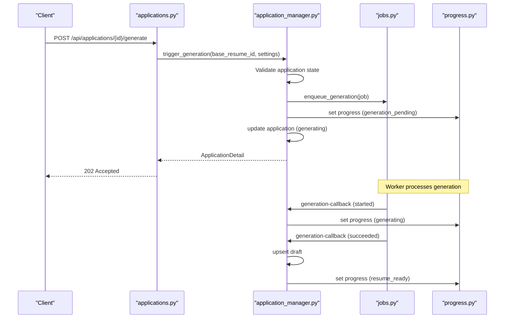

#### Full Regeneration Flow
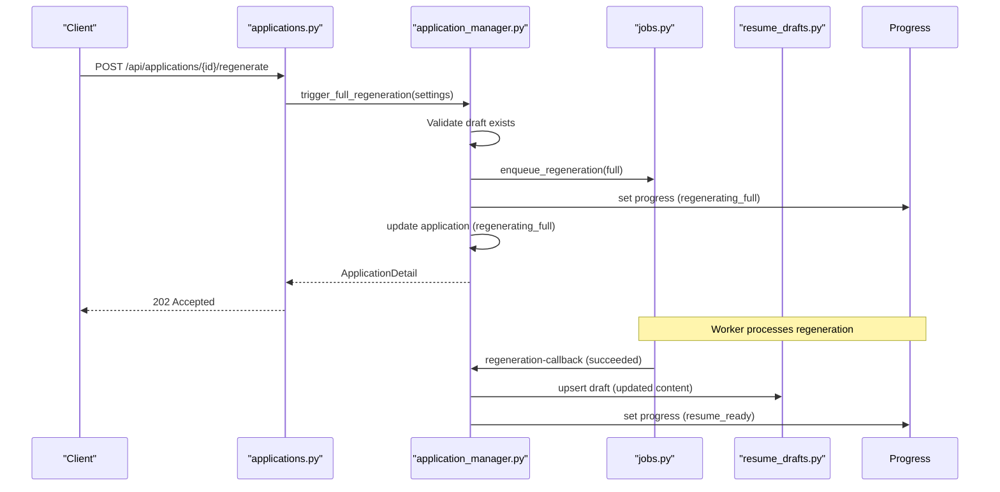

#### Section Regeneration Flow
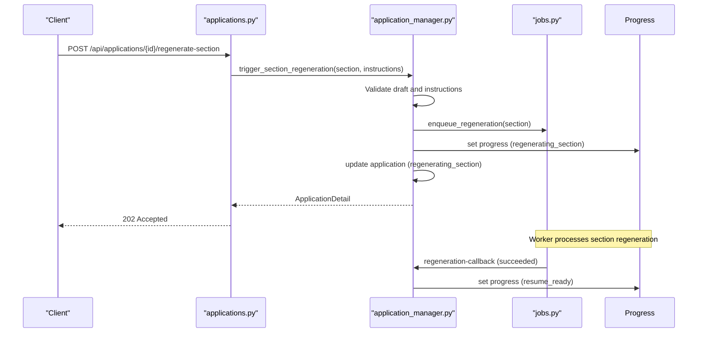

**Diagram sources**
- [backend/app/api/applications.py:560-638](file://backend/app/api/applications.py#L560-L638)
- [backend/app/services/application_manager.py:642-1152](file://backend/app/services/application_manager.py#L642-L1152)
- [backend/app/services/jobs.py](file://backend/app/services/jobs.py)
- [backend/app/services/progress.py](file://backend/app/services/progress.py)

## Dependency Analysis
- Router-to-service coupling: Each router depends on a dedicated service via FastAPI Depends, promoting separation of concerns.
- Service-to-repository coupling: Services depend on repositories for persistence and on external services (queues, progress store, email).
- Configuration dependency: Services and routers depend on settings for database URLs, Supabase endpoints, and feature flags.
- No circular dependencies observed among routers and services.

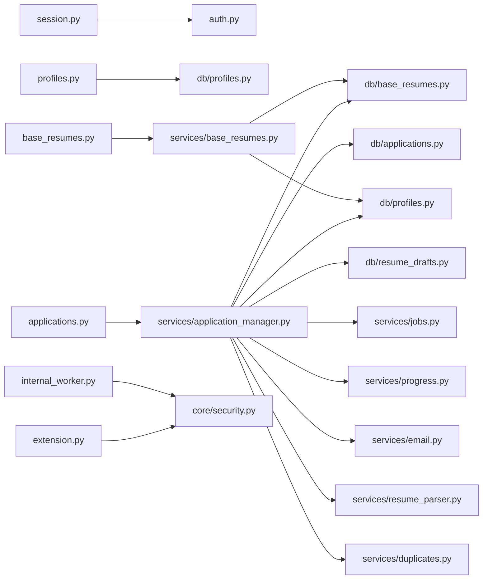

**Diagram sources**
- [backend/app/api/session.py:1-45](file://backend/app/api/session.py#L1-L45)
- [backend/app/api/profiles.py:1-113](file://backend/app/api/profiles.py#L1-L113)
- [backend/app/api/applications.py:1-678](file://backend/app/api/applications.py#L1-L678)
- [backend/app/api/base_resumes.py:1-242](file://backend/app/api/base_resumes.py#L1-L242)
- [backend/app/api/extension.py:1-141](file://backend/app/api/extension.py#L1-L141)
- [backend/app/api/internal_worker.py:1-71](file://backend/app/api/internal_worker.py#L1-L71)
- [backend/app/services/application_manager.py:1-1827](file://backend/app/services/application_manager.py#L1-L1827)
- [backend/app/services/base_resumes.py:1-154](file://backend/app/services/base_resumes.py#L1-L154)
- [backend/app/db/applications.py:1-328](file://backend/app/db/applications.py#L1-L328)
- [backend/app/db/base_resumes.py:1-184](file://backend/app/db/base_resumes.py#L1-L184)
- [backend/app/db/profiles.py:1-225](file://backend/app/db/profiles.py#L1-L225)
- [backend/app/db/resume_drafts.py](file://backend/app/db/resume_drafts.py)

**Section sources**
- [backend/app/api/applications.py:1-678](file://backend/app/api/applications.py#L1-L678)
- [backend/app/api/base_resumes.py:1-242](file://backend/app/api/base_resumes.py#L1-L242)
- [backend/app/api/extension.py:1-141](file://backend/app/api/extension.py#L1-L141)
- [backend/app/api/internal_worker.py:1-71](file://backend/app/api/internal_worker.py#L1-L71)
- [backend/app/services/application_manager.py:1-1827](file://backend/app/services/application_manager.py#L1-L1827)
- [backend/app/services/base_resumes.py:1-154](file://backend/app/services/base_resumes.py#L1-L154)

## Performance Considerations
- Asynchronous job queues: Extraction and generation are enqueued asynchronously to avoid blocking requests; progress is tracked in Redis.
- Minimal ORM overhead: Repositories use raw SQL with psycopg for predictable performance and explicit casting.
- Validation and normalization: Input sanitization reduces downstream processing errors and retries.
- PDF parsing and LLM cleanup: Optional LLM cleanup is opt-in to balance latency and quality.
- Caching: Settings are cached via LRU cache to reduce repeated reads.

## Troubleshooting Guide
Common issues and resolutions:
- Authentication failures:
  - Missing or malformed Authorization header: 401 Unauthorized.
  - Invalid or unverifiable Supabase access token: 401 Unauthorized.
- Resource not found:
  - Applications, profiles, or base resumes may return 404 depending on service logic.
- Conflict scenarios:
  - Duplicate resolution or generation readiness errors return 409 Conflict.
- Validation errors:
  - Malformed inputs (e.g., blank strings, invalid enums) return 400 Bad Request.
- Service-level failures:
  - Extraction or generation failures are recorded with terminal error codes and progress completion.

Operational checks:
- Health endpoint: GET /healthz returns {"status":"ok"}.
- CORS: Ensure frontend origin and extension origins are included in CORS configuration.

**Section sources**
- [backend/app/api/applications.py:359-367](file://backend/app/api/applications.py#L359-L367)
- [backend/app/api/base_resumes.py:72-82](file://backend/app/api/base_resumes.py#L72-L82)
- [backend/app/api/profiles.py:67-75](file://backend/app/api/profiles.py#L67-L75)
- [backend/app/api/extension.py:71-77](file://backend/app/api/extension.py#L71-L77)
- [backend/app/main.py:25-27](file://backend/app/main.py#L25-L27)

## Conclusion
The backend provides a robust, modular API for managing job applications, base resumes, user profiles, and extension integration, with clear separation between routers, services, and repositories. Supabase JWT verification secures endpoints, while asynchronous job queues and Redis-backed progress tracking deliver responsive UX. The design supports future extensions with clear boundaries and consistent error handling.

## Appendices

### API Reference: Session
- GET /api/session/bootstrap
  - Auth: Bearer token
  - Response: {user, profile, workflow_contract_version}
  - Errors: 503 if profile unavailable

**Section sources**
- [backend/app/api/session.py:27-44](file://backend/app/api/session.py#L27-L44)

### API Reference: Profiles
- GET /api/profiles
  - Response: ProfileResponse
  - Errors: 404 if not found
- PATCH /api/profiles
  - Body: UpdateProfileRequest
  - Response: ProfileResponse
  - Errors: 400/404/409/500

**Section sources**
- [backend/app/api/profiles.py:77-113](file://backend/app/api/profiles.py#L77-L113)

### API Reference: Applications
- GET /api/applications
  - Query: search, visible_status
  - Response: list of ApplicationSummary
- POST /api/applications
  - Body: CreateApplicationRequest
  - Response: ApplicationDetail (201)
- GET /api/applications/{application_id}
  - Response: ApplicationDetail
- PATCH /api/applications/{application_id}
  - Body: UpdateApplicationRequest
  - Response: ApplicationDetail
- POST /api/applications/{application_id}/retry-extraction
  - Response: ApplicationDetail
- POST /api/applications/{application_id}/manual-entry
  - Body: ManualEntryRequest
  - Response: ApplicationDetail
- POST /api/applications/{application_id}/recover-from-source
  - Body: RecoverFromSourceRequest
  - Response: ApplicationDetail
- POST /api/applications/{application_id}/duplicate-resolution
  - Body: DuplicateResolutionRequest
  - Response: ApplicationDetail
- GET /api/applications/{application_id}/progress
  - Response: WorkflowProgress
- GET /api/applications/{application_id}/draft
  - Response: ResumeDraftResponse or null
- POST /api/applications/{application_id}/generate
  - Body: GenerateResumeRequest
  - Response: ApplicationDetail (202)
- POST /api/applications/{application_id}/regenerate
  - Body: FullRegenerationRequest
  - Response: ApplicationDetail (202)
- POST /api/applications/{application_id}/regenerate-section
  - Body: SectionRegenerationRequest
  - Response: ApplicationDetail (202)
- POST /api/applications/{application_id}/cancel-generation
  - Response: ApplicationDetail
- PUT /api/applications/{application_id}/draft
  - Body: SaveDraftRequest
  - Response: ResumeDraftResponse
- GET /api/applications/{application_id}/export-pdf
  - Response: application/pdf attachment

**Section sources**
- [backend/app/api/applications.py:369-678](file://backend/app/api/applications.py#L369-L678)

### API Reference: Base Resumes
- GET /api/base-resumes
  - Response: list of BaseResumeSummary
- POST /api/base-resumes
  - Body: CreateBaseResumeRequest
  - Response: BaseResumeDetail (201)
- POST /api/base-resumes/upload
  - Form: file (PDF), name, use_llm_cleanup (bool)
  - Response: BaseResumeDetail (201)
- GET /api/base-resumes/{resume_id}
  - Response: BaseResumeDetail
- PATCH /api/base-resumes/{resume_id}
  - Body: UpdateBaseResumeRequest
  - Response: BaseResumeDetail
- DELETE /api/base-resumes/{resume_id}?force={bool}
  - Response: 204
- POST /api/base-resumes/{resume_id}/set-default
  - Response: BaseResumeSummary

**Section sources**
- [backend/app/api/base_resumes.py:85-242](file://backend/app/api/base_resumes.py#L85-L242)

### API Reference: Extension
- GET /api/extension/status
  - Response: ExtensionConnectionStatus
- POST /api/extension/token
  - Response: ExtensionTokenResponse
- DELETE /api/extension/token
  - Response: ExtensionConnectionStatus
- POST /api/extension/import
  - Body: ExtensionCapturedApplicationRequest
  - Response: ApplicationDetail (201)

**Section sources**
- [backend/app/api/extension.py:79-141](file://backend/app/api/extension.py#L79-L141)

### API Reference: Internal Worker Callbacks
- POST /api/internal/worker/extraction-callback
  - Body: WorkerCallbackPayload
  - Response: {"status":"accepted"}
- POST /api/internal/worker/generation-callback
  - Body: GenerationCallbackPayload
  - Response: {"status":"accepted"}
- POST /api/internal/worker/regeneration-callback
  - Body: RegenerationCallbackPayload
  - Response: {"status":"accepted"}

**Section sources**
- [backend/app/api/internal_worker.py:19-71](file://backend/app/api/internal_worker.py#L19-L71)

### Database Models and Relationships
The application uses typed Pydantic models for records returned by repositories. Key entities:
- Applications: job_url, job_title, company, job_description, extracted_reference_id, job_posting_origin, base_resume_id, visibility and internal states, failure reasons, duplicates, notes, exported_at, timestamps.
- Base Resumes: name, content_md, user_id, timestamps.
- Profiles: user identity, contact info, default_base_resume_id, section_preferences, section_order, extension token hashes and timestamps.
- Resume Drafts: application_id, content_md, generation_params, sections_snapshot, timestamps.

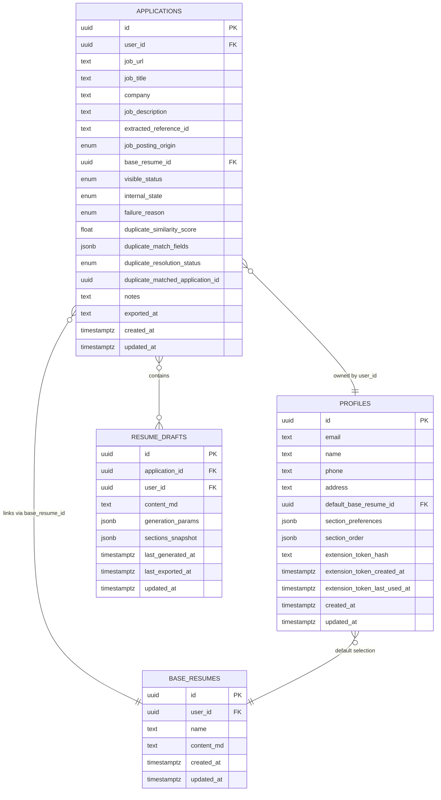

**Diagram sources**
- [backend/app/db/applications.py:14-61](file://backend/app/db/applications.py#L14-L61)
- [backend/app/db/base_resumes.py:14-29](file://backend/app/db/base_resumes.py#L14-L29)
- [backend/app/db/profiles.py:14-36](file://backend/app/db/profiles.py#L14-L36)
- [backend/app/db/resume_drafts.py](file://backend/app/db/resume_drafts.py)

**Section sources**
- [backend/app/db/applications.py:1-328](file://backend/app/db/applications.py#L1-L328)
- [backend/app/db/base_resumes.py:1-184](file://backend/app/db/base_resumes.py#L1-L184)
- [backend/app/db/profiles.py:1-225](file://backend/app/db/profiles.py#L1-L225)
- [backend/app/db/resume_drafts.py](file://backend/app/db/resume_drafts.py)

### Authentication and Authorization
- JWT verification: Supabase JWKS or shared secret; audience/issuer configurable.
- Current user dependency: Extracts subject, email, role, and claims from verified token.
- Extension tokens: Hashed and stored; verified via a separate dependency.
- Worker callbacks: Require a shared secret via a dedicated dependency.

**Section sources**
- [backend/app/core/auth.py:22-90](file://backend/app/core/auth.py#L22-L90)
- [backend/app/core/security.py](file://backend/app/core/security.py)
- [backend/app/api/internal_worker.py:7-7](file://backend/app/api/internal_worker.py#L7-L7)

### Security Considerations
- CORS: Allowlist configured origins plus Chrome extension scheme.
- Token handling: Strict validation and error messaging; extension tokens are hashed.
- Worker callbacks: Enforced secret verification.
- Input validation: Comprehensive field validators and model-level validations.

**Section sources**
- [backend/app/main.py:15-22](file://backend/app/main.py#L15-L22)
- [backend/app/core/auth.py:22-90](file://backend/app/core/auth.py#L22-L90)
- [backend/app/api/internal_worker.py:7-7](file://backend/app/api/internal_worker.py#L7-L7)

### Rate Limiting and Performance Optimization Strategies
- Asynchronous job queues: Offload heavy work to background workers.
- Redis progress store: Efficient progress tracking without DB contention.
- Input normalization: Reduce variability and downstream processing overhead.
- Optional LLM cleanup: Controlled via request parameter to balance quality and latency.