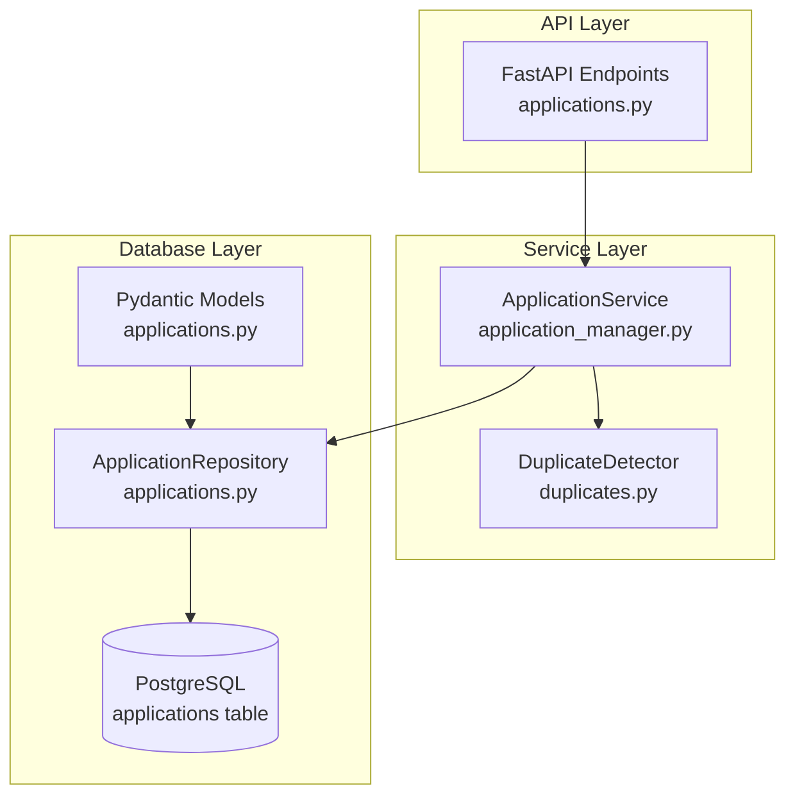
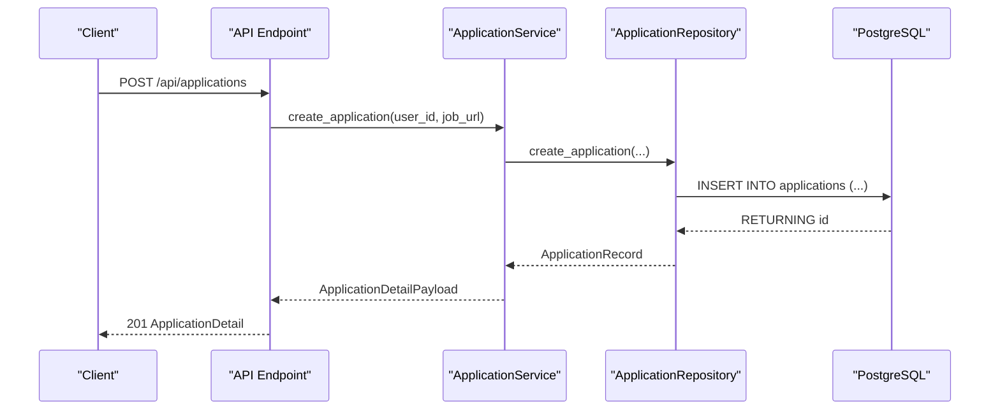
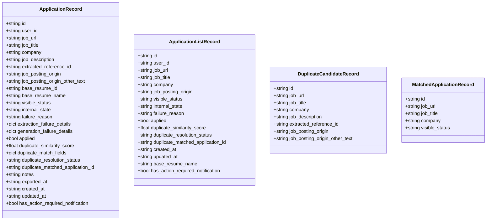
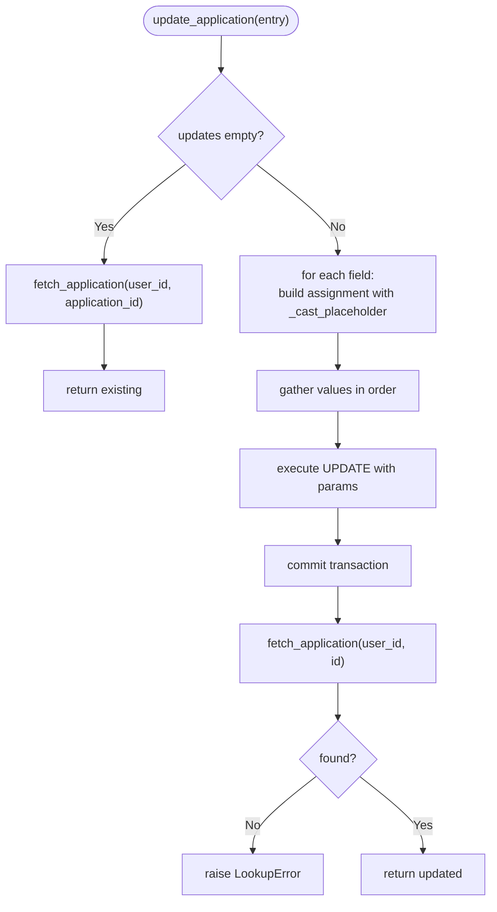
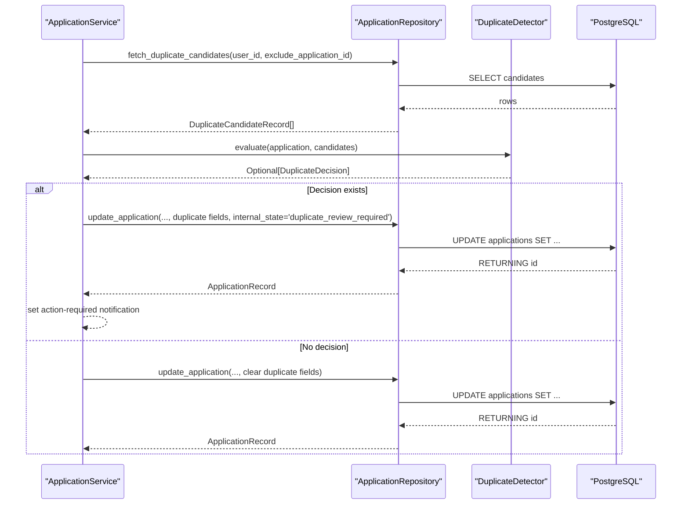
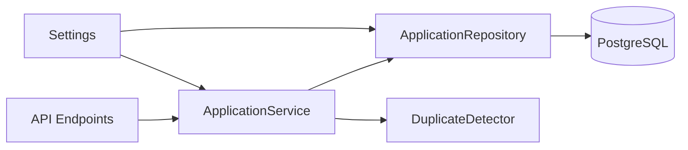

# Application Model

<cite>
**Referenced Files in This Document**
- [applications.py](file://backend/app/db/applications.py)
- [application_manager.py](file://backend/app/services/application_manager.py)
- [duplicates.py](file://backend/app/services/duplicates.py)
- [applications.py](file://backend/app/api/applications.py)
- [phase_0_foundation.sql](file://supabase/migrations/20260407_000001_phase_0_foundation.sql)
- [config.py](file://backend/app/core/config.py)
</cite>

## Table of Contents
1. [Introduction](#introduction)
2. [Project Structure](#project-structure)
3. [Core Components](#core-components)
4. [Architecture Overview](#architecture-overview)
5. [Detailed Component Analysis](#detailed-component-analysis)
6. [Dependency Analysis](#dependency-analysis)
7. [Performance Considerations](#performance-considerations)
8. [Troubleshooting Guide](#troubleshooting-guide)
9. [Conclusion](#conclusion)
10. [Appendices](#appendices)

## Introduction
This document provides comprehensive data model documentation for the Application entity within the job application management system. It covers the Pydantic models that represent application records, the ApplicationRepository class that encapsulates database operations, and the duplicate detection workflow that integrates with these models. The focus areas include:
- ApplicationRecord: the canonical application record with all fields, including status tracking, duplicate detection metadata, and timestamps.
- ApplicationListRecord: a lightweight record optimized for dashboard views.
- DuplicateCandidateRecord and MatchedApplicationRecord: specialized records used during duplicate detection workflows.
- ApplicationRepository: CRUD operations and query patterns, including parameter binding, enum casting, and connection management.
- Practical examples of model instantiation, field validation, and repository method usage.

## Project Structure
The Application model and related components are organized across the database layer, service layer, and API layer:
- Database layer: Pydantic models and repository for PostgreSQL operations.
- Service layer: orchestration of workflows, including duplicate detection and status transitions.
- API layer: request/response models and endpoints that expose application operations.

**Diagram sources**
- [applications.py:1-661](file://backend/app/api/applications.py#L1-L661)
- [application_manager.py:143-1543](file://backend/app/services/application_manager.py#L143-L1543)
- [duplicates.py:79-184](file://backend/app/services/duplicates.py#L79-L184)
- [applications.py:123-328](file://backend/app/db/applications.py#L123-L328)

**Section sources**
- [applications.py:1-328](file://backend/app/db/applications.py#L1-L328)
- [application_manager.py:143-1543](file://backend/app/services/application_manager.py#L143-L1543)
- [applications.py:1-661](file://backend/app/api/applications.py#L1-L661)

## Core Components
This section documents the Pydantic models that define the Application data structure and the repository that manages persistence and retrieval.

- ApplicationRecord
  - Purpose: Canonical representation of an application record with full field coverage.
  - Key fields:
    - Identity: id, user_id
    - Job details: job_url, job_title, company, job_description, extracted_reference_id
    - Origin: job_posting_origin, job_posting_origin_other_text
    - Resume linkage: base_resume_id, base_resume_name
    - Status tracking: visible_status, internal_state, failure_reason, extraction_failure_details, generation_failure_details
    - Flags: applied, has_action_required_notification
    - Duplicate detection: duplicate_similarity_score, duplicate_match_fields, duplicate_resolution_status, duplicate_matched_application_id
    - Notes and export: notes, exported_at
    - Timestamps: created_at, updated_at
  - Validation and normalization are enforced by the API layer request models and repository updates.

- ApplicationListRecord
  - Purpose: Lightweight record optimized for dashboard listings.
  - Fields include id, user_id, job_url, job_title, company, job_posting_origin, visible_status, internal_state, failure_reason, applied, duplicate_* fields, created_at, updated_at, base_resume_name, has_action_required_notification.
  - Used by list_applications to minimize payload size.

- DuplicateCandidateRecord
  - Purpose: Subset of fields used to compare potential duplicates.
  - Fields: id, job_url, job_title, company, job_description, extracted_reference_id, job_posting_origin, job_posting_origin_other_text.

- MatchedApplicationRecord
  - Purpose: Minimal record for displaying matched application details in warnings.
  - Fields: id, job_url, job_title, company, visible_status.

- ApplicationRepository
  - Purpose: Encapsulates database operations for applications.
  - Methods:
    - list_applications(user_id, search?, visible_status?): returns ApplicationListRecord list.
    - create_application(user_id, job_url, visible_status, internal_state): inserts a new application and returns ApplicationRecord.
    - fetch_application(user_id, application_id): returns ApplicationRecord or None.
    - fetch_application_unscoped(application_id): returns ApplicationRecord or None.
    - fetch_matched_application(user_id, application_id): returns MatchedApplicationRecord or None.
    - fetch_duplicate_candidates(user_id, exclude_application_id): returns DuplicateCandidateRecord list.
    - update_application(application_id, user_id, updates): updates selected fields and returns ApplicationRecord.
  - Database connectivity: uses psycopg with a context manager for connections and dict_row row factory.
  - Parameter binding: uses psycopg.sql for safe dynamic SQL construction and parameter binding.
  - Enum casting: _cast_placeholder maps field names to Postgres enum types and UUID casting.

**Section sources**
- [applications.py:14-328](file://backend/app/db/applications.py#L14-L328)

## Architecture Overview
The Application model participates in a layered architecture:
- API layer validates and normalizes requests, then delegates to ApplicationService.
- ApplicationService orchestrates workflows, including duplicate detection and status transitions.
- ApplicationRepository executes SQL against PostgreSQL, casting enums and UUIDs appropriately.
- Database schema defines application table structure, constraints, and indexes.

**Diagram sources**
- [applications.py:384-403](file://backend/app/api/applications.py#L384-L403)
- [application_manager.py:183-225](file://backend/app/services/application_manager.py#L183-L225)
- [applications.py:162-192](file://backend/app/db/applications.py#L162-L192)

## Detailed Component Analysis

### ApplicationRecord and ApplicationListRecord
- Field categories:
  - Identity and ownership: id, user_id
  - Job metadata: job_url, job_title, company, job_description, extracted_reference_id
  - Origin: job_posting_origin, job_posting_origin_other_text
  - Resume linkage: base_resume_id, base_resume_name
  - Status tracking: visible_status, internal_state, failure_reason, extraction_failure_details, generation_failure_details
  - Flags: applied, has_action_required_notification
  - Duplicate detection: duplicate_similarity_score, duplicate_match_fields, duplicate_resolution_status, duplicate_matched_application_id
  - Notes and export: notes, exported_at
  - Timestamps: created_at, updated_at
- Validation:
  - API request models enforce non-blank and normalized fields for job_title, company, job_description, and others.
  - Repository update_application dynamically casts values to enum or UUID types as needed.

**Diagram sources**
- [applications.py:14-80](file://backend/app/db/applications.py#L14-L80)

**Section sources**
- [applications.py:14-80](file://backend/app/db/applications.py#L14-L80)

### ApplicationRepository: CRUD and Query Patterns
- Connection management:
  - Uses a context manager to establish a psycopg connection with dict_row row factory for row access.
- Query patterns:
  - list_applications: builds dynamic WHERE conditions for user_id, optional search term, and optional visible_status, orders by updated_at desc.
  - create_application: inserts with enum casting for visible_status and internal_state, returns id and reloads the record.
  - fetch_application/fetch_application_unscoped: selects from applications joined with base_resumes and checks for action-required notifications.
  - fetch_matched_application: minimal select for matched application display.
  - fetch_duplicate_candidates: lists candidates excluding the current application and filtered by duplicate_resolution_status != 'redirected'.
  - update_application: constructs assignments dynamically, binds values safely, and commits changes.
- Parameter binding and safety:
  - Uses psycopg.sql for dynamic SQL composition and placeholders.
  - _cast_placeholder maps fields to enum or UUID casts to ensure correct type handling.
- Enum casting mechanism:
  - Maps visible_status, internal_state, failure_reason, job_posting_origin, duplicate_resolution_status to their respective Postgres enum types.
  - Casts base_resume_id to UUID.

**Diagram sources**
- [applications.py:270-308](file://backend/app/db/applications.py#L270-L308)
- [applications.py:310-323](file://backend/app/db/applications.py#L310-L323)

**Section sources**
- [applications.py:123-328](file://backend/app/db/applications.py#L123-L328)

### Duplicate Detection Workflow
- Candidate selection:
  - fetch_duplicate_candidates retrieves candidates for a user excluding the current application and filtered by duplicate_resolution_status != 'redirected'.
- Evaluation:
  - DuplicateDetector evaluates similarity across job_title, company, job_description, job_posting_origin, job_url, and extracted_reference_id.
  - Uses thresholds and match basis rules to compute a similarity score and matched fields.
- Decision and update:
  - ApplicationService._run_duplicate_resolution_flow updates internal_state, duplicate fields, and sets action-required notifications when a duplicate is detected.

**Diagram sources**
- [application_manager.py:1185-1268](file://backend/app/services/application_manager.py#L1185-L1268)
- [duplicates.py:79-184](file://backend/app/services/duplicates.py#L79-L184)
- [applications.py:241-268](file://backend/app/db/applications.py#L241-L268)

**Section sources**
- [application_manager.py:1185-1268](file://backend/app/services/application_manager.py#L1185-L1268)
- [duplicates.py:79-184](file://backend/app/services/duplicates.py#L79-L184)

### Database Schema and Constraints
- Enum types:
  - visible_status_enum, internal_state_enum, failure_reason_enum, duplicate_resolution_status_enum, job_posting_origin_enum.
- Table structure:
  - applications table with UUID primary key, foreign keys to users and base_resumes, JSONB fields for duplicate_match_fields, numeric bounds for duplicate_similarity_score, and constraints for non-blank and mutual exclusivity of fields.
- Indexes:
  - Composite indexes for user-scoped queries, duplicate resolution filtering, unresolved duplicates, and GIN trigram search on concatenated job_title and company.

**Section sources**
- [phase_0_foundation.sql:24-74](file://supabase/migrations/20260407_000001_phase_0_foundation.sql#L24-L74)
- [phase_0_foundation.sql:120-175](file://supabase/migrations/20260407_000001_phase_0_foundation.sql#L120-L175)
- [phase_0_foundation.sql:222-228](file://supabase/migrations/20260407_000001_phase_0_foundation.sql#L222-L228)

## Dependency Analysis
- API layer depends on ApplicationService for business logic and on Pydantic models for request/response validation.
- ApplicationService depends on ApplicationRepository for persistence, DuplicateDetector for duplicate evaluation, and other repositories for related entities.
- ApplicationRepository depends on PostgreSQL via psycopg and uses enum types defined in the database schema.
- Configuration supplies DATABASE_URL and DUPLICATE_SIMILARITY_THRESHOLD.

**Diagram sources**
- [applications.py:1-661](file://backend/app/api/applications.py#L1-L661)
- [application_manager.py:143-1543](file://backend/app/services/application_manager.py#L143-L1543)
- [duplicates.py:79-184](file://backend/app/services/duplicates.py#L79-L184)
- [applications.py:123-328](file://backend/app/db/applications.py#L123-L328)
- [config.py:35-97](file://backend/app/core/config.py#L35-L97)

**Section sources**
- [applications.py:123-328](file://backend/app/db/applications.py#L123-L328)
- [application_manager.py:143-1543](file://backend/app/services/application_manager.py#L143-L1543)
- [config.py:35-97](file://backend/app/core/config.py#L35-L97)

## Performance Considerations
- Query optimization:
  - Use of GIN trigram index on concatenated job_title and company for efficient search.
  - Composite indexes for user_id with status and updated_at improve dashboard performance.
- Enum casting:
  - Casting enums at the application boundary ensures correct indexing and avoids implicit conversions.
- Connection management:
  - Context-managed connections reduce overhead and ensure proper cleanup.
- Payload sizing:
  - ApplicationListRecord minimizes network overhead for dashboard listings.

## Troubleshooting Guide
- Common errors and resolutions:
  - LookupError: raised when an application is not found during update or fetch operations; verify user_id and application_id.
  - PermissionError: raised when attempting duplicate resolution or generation under invalid states; ensure internal_state and duplicate_resolution_status are valid.
  - ValueError: raised for invalid inputs (e.g., blank fields, unsupported enum values); validate request payloads.
  - RuntimeError: raised when repository operations fail to return expected results (e.g., insert did not return id); inspect database connectivity and constraints.
- Duplicate detection:
  - If no duplicate is detected despite similar data, verify threshold settings and that required fields (job_title, company) are populated.
  - If a candidate is filtered out unexpectedly, confirm duplicate_resolution_status != 'redirected' and that the exclusion logic excludes the current application.

**Section sources**
- [applications.py:162-192](file://backend/app/db/applications.py#L162-L192)
- [application_manager.py:412-437](file://backend/app/services/application_manager.py#L412-L437)
- [application_manager.py:513-511](file://backend/app/services/application_manager.py#L513-L511)

## Conclusion
The Application model and its surrounding components form a robust, type-safe, and database-backed system for managing job applications. The Pydantic models provide strong validation, the repository encapsulates database concerns with safe parameter binding and enum casting, and the service layer coordinates complex workflows including duplicate detection and status transitions. Together, these pieces support scalable and maintainable application management.

## Appendices

### Practical Examples

- Model instantiation and validation
  - Creating an application via API:
    - Request: POST /api/applications with job_url.
    - Service creates application with initial visible_status and internal_state.
    - Repository inserts and returns ApplicationRecord.
  - Updating application fields:
    - Request: PATCH /api/applications/{application_id} with selective fields.
    - Service calls update_application with updates; repository applies enum/UUID casting and returns updated record.

- Repository method usage
  - Listing applications:
    - list_applications(user_id, search?, visible_status?) returns ApplicationListRecord list.
  - Fetching details:
    - fetch_application(user_id, application_id) returns ApplicationRecord.
  - Duplicate candidate retrieval:
    - fetch_duplicate_candidates(user_id, exclude_application_id) returns DuplicateCandidateRecord list.

- Duplicate detection workflow
  - After extracting job details, service evaluates candidates and updates duplicate fields and internal_state accordingly.

**Section sources**
- [applications.py:384-403](file://backend/app/api/applications.py#L384-L403)
- [application_manager.py:183-225](file://backend/app/services/application_manager.py#L183-L225)
- [applications.py:132-160](file://backend/app/db/applications.py#L132-L160)
- [applications.py:241-268](file://backend/app/db/applications.py#L241-L268)