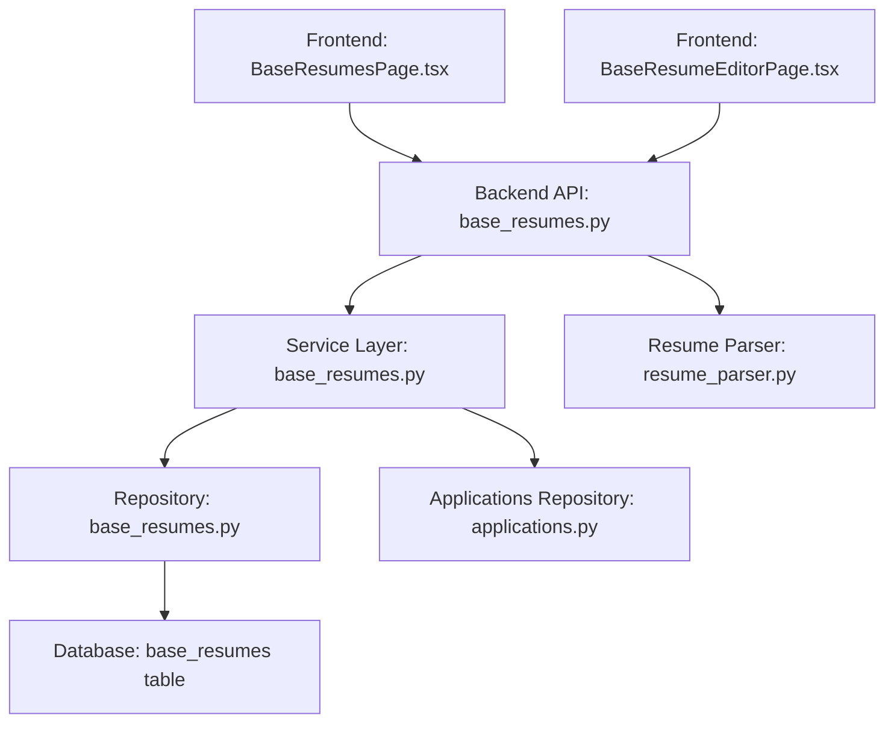
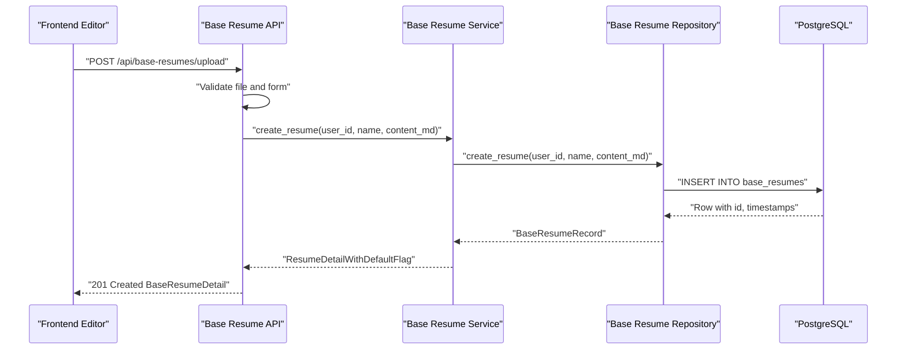
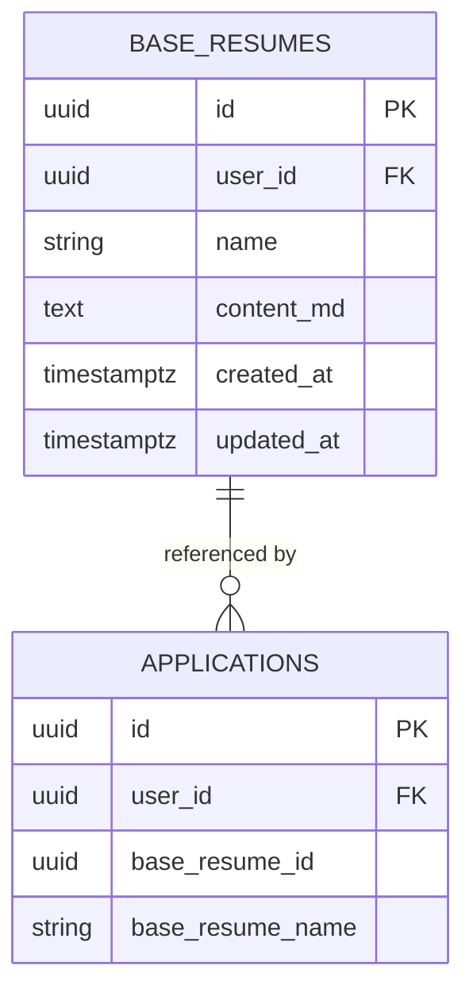
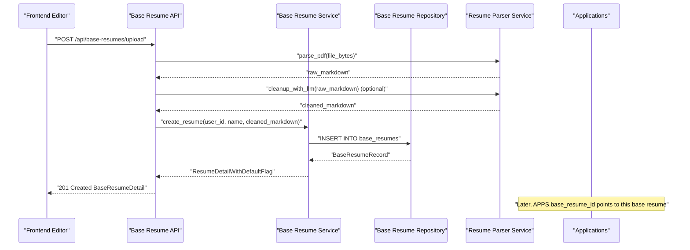
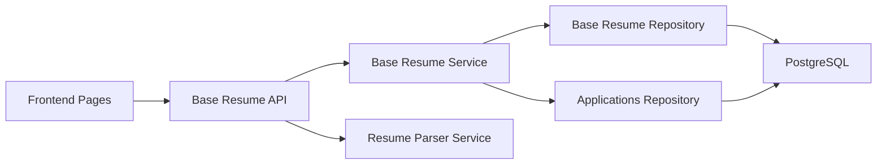

# Base Resume Model

<cite>
**Referenced Files in This Document**
- [base_resumes.py](file://backend/app/db/base_resumes.py)
- [base_resumes.py](file://backend/app/services/base_resumes.py)
- [base_resumes.py](file://backend/app/api/base_resumes.py)
- [applications.py](file://backend/app/db/applications.py)
- [database_schema.md](file://docs/database_schema.md)
- [20260407_000004_phase_2_base_resumes.sql](file://supabase/migrations/20260407_000004_phase_2_base_resumes.sql)
- [20260407_000005_phase_3_generation.sql](file://supabase/migrations/20260407_000005_phase_3_generation.sql)
- [BaseResumesPage.tsx](file://frontend/src/routes/BaseResumesPage.tsx)
- [BaseResumeEditorPage.tsx](file://frontend/src/routes/BaseResumeEditorPage.tsx)
- [resume_parser.py](file://backend/app/services/resume_parser.py)
- [workflow.py](file://backend/app/services/workflow.py)
</cite>

## Table of Contents
1. [Introduction](#introduction)
2. [Project Structure](#project-structure)
3. [Core Components](#core-components)
4. [Architecture Overview](#architecture-overview)
5. [Detailed Component Analysis](#detailed-component-analysis)
6. [Dependency Analysis](#dependency-analysis)
7. [Performance Considerations](#performance-considerations)
8. [Troubleshooting Guide](#troubleshooting-guide)
9. [Conclusion](#conclusion)
10. [Appendices](#appendices)

## Introduction
This document describes the Base Resume model used for template management and personal information storage. It covers the data structure, relationships with applications, repository operations, and integration with the resume generation workflow. It also documents best practices for template management, data consistency, and how base resumes serve as the foundation for AI-generated content.

## Project Structure
The Base Resume feature spans backend repositories, services, APIs, frontend pages, and database schema/migrations. The frontend pages provide user-facing CRUD operations for base resumes, while the backend encapsulates persistence, validation, and integration with the resume generation pipeline.

**Diagram sources**
- [BaseResumesPage.tsx:12-185](file://frontend/src/routes/BaseResumesPage.tsx#L12-L185)
- [BaseResumeEditorPage.tsx:19-472](file://frontend/src/routes/BaseResumeEditorPage.tsx#L19-L472)
- [base_resumes.py:12-242](file://backend/app/api/base_resumes.py#L12-L242)
- [base_resumes.py:32-154](file://backend/app/services/base_resumes.py#L32-L154)
- [base_resumes.py:31-184](file://backend/app/db/base_resumes.py#L31-L184)
- [applications.py:123-328](file://backend/app/db/applications.py#L123-L328)
- [resume_parser.py:13-228](file://backend/app/services/resume_parser.py#L13-L228)

**Section sources**
- [BaseResumesPage.tsx:12-185](file://frontend/src/routes/BaseResumesPage.tsx#L12-L185)
- [BaseResumeEditorPage.tsx:19-472](file://frontend/src/routes/BaseResumeEditorPage.tsx#L19-L472)
- [base_resumes.py:12-242](file://backend/app/api/base_resumes.py#L12-L242)
- [base_resumes.py:32-154](file://backend/app/services/base_resumes.py#L32-L154)
- [base_resumes.py:31-184](file://backend/app/db/base_resumes.py#L31-L184)
- [applications.py:123-328](file://backend/app/db/applications.py#L123-L328)
- [resume_parser.py:13-228](file://backend/app/services/resume_parser.py#L13-L228)

## Core Components
- Base Resume data model: a user-owned Markdown template with metadata.
- Repository: CRUD operations with ownership checks and soft-delete semantics via foreign key constraints.
- Service: validation, ownership enforcement, default resume selection, and deletion safety checks.
- API: endpoints for listing, creating, uploading, retrieving, updating, deleting, and setting default base resumes.
- Frontend: pages for listing, creating/editing, and deleting base resumes, including PDF upload with optional AI cleanup.
- Integration with applications: base resumes are linked to applications via a composite foreign key and used as the source for AI generation.

Key data fields:
- id: UUID primary key
- user_id: UUID foreign key to auth.users with ON DELETE CASCADE
- name: non-blank text label
- content_md: non-blank Markdown content
- created_at, updated_at: timestamptz with automatic updates

**Section sources**
- [database_schema.md:84-113](file://docs/database_schema.md#L84-L113)
- [base_resumes.py:22-28](file://backend/app/db/base_resumes.py#L22-L28)
- [base_resumes.py:31-184](file://backend/app/db/base_resumes.py#L31-L184)
- [base_resumes.py:13-30](file://backend/app/services/base_resumes.py#L13-L30)
- [base_resumes.py:27-70](file://backend/app/api/base_resumes.py#L27-L70)

## Architecture Overview
The Base Resume subsystem follows a layered architecture:
- Frontend pages orchestrate user actions (list, create, edit, delete).
- API validates inputs and delegates to the service layer.
- Service enforces business rules (ownership, validation, default selection).
- Repository executes SQL with explicit user scoping and RLS.
- Database schema defines constraints, composite foreign keys, and RLS policies.

**Diagram sources**
- [BaseResumeEditorPage.tsx:89-115](file://frontend/src/routes/BaseResumeEditorPage.tsx#L89-L115)
- [base_resumes.py:111-168](file://backend/app/api/base_resumes.py#L111-L168)
- [base_resumes.py:55-73](file://backend/app/services/base_resumes.py#L55-L73)
- [base_resumes.py:59-90](file://backend/app/db/base_resumes.py#L59-L90)

**Section sources**
- [base_resumes.py:12-242](file://backend/app/api/base_resumes.py#L12-L242)
- [base_resumes.py:32-154](file://backend/app/services/base_resumes.py#L32-L154)
- [base_resumes.py:31-184](file://backend/app/db/base_resumes.py#L31-L184)

## Detailed Component Analysis

### Data Model and Fields
- Table: base_resumes
- Columns:
  - id: UUID primary key
  - user_id: UUID, foreign key to auth.users with ON DELETE CASCADE
  - name: text, non-blank
  - content_md: text, non-blank Markdown
  - created_at, updated_at: timestamptz with automatic updates
- Constraints:
  - UNIQUE(id, user_id) to support composite foreign keys
  - CHECK constraints on name and content_md
- RLS:
  - SELECT, INSERT, UPDATE, DELETE allowed only when auth.uid() = user_id
- Indexes:
  - base_resumes(user_id, updated_at DESC)
  - base_resumes(user_id, name)
  - base_resumes(user_id)

**Section sources**
- [database_schema.md:84-113](file://docs/database_schema.md#L84-L113)
- [20260407_000004_phase_2_base_resumes.sql:14-76](file://supabase/migrations/20260407_000004_phase_2_base_resumes.sql#L14-L76)
- [20260407_000004_phase_2_base_resumes.sql:155-156](file://supabase/migrations/20260407_000004_phase_2_base_resumes.sql#L155-L156)

### Repository Operations
- list_resumes(user_id): returns summaries with is_default flag resolution.
- create_resume(user_id, name, content_md): inserts a new base resume and returns the record.
- fetch_resume(user_id, resume_id): retrieves a specific base resume with ownership check.
- update_resume(resume_id, user_id, updates): updates selected fields with validation.
- delete_resume(resume_id, user_id): deletes the base resume with commit.
- is_referenced(user_id, resume_id): checks if the base resume is referenced by any application.

Ownership and safety:
- All operations scope by user_id and verify existence before mutating.
- Deletion sets foreign keys to NULL on applications and profile defaults, preserving referential integrity.

**Section sources**
- [base_resumes.py:40-184](file://backend/app/db/base_resumes.py#L40-L184)

### Service Layer
Responsibilities:
- Enforce non-blank name validation on create/update.
- Resolve is_default flag by checking profile.default_base_resume_id.
- Safe deletion: if referenced by applications, require force=true to delete.
- Set default: update profile.default_base_resume_id and return updated summary.

**Section sources**
- [base_resumes.py:41-141](file://backend/app/services/base_resumes.py#L41-L141)

### API Endpoints
Endpoints:
- GET /api/base-resumes: list base resumes with is_default flag.
- POST /api/base-resumes: create a base resume from Markdown.
- POST /api/base-resumes/upload: upload PDF, parse to Markdown, optionally improve with AI, then create.
- GET /api/base-resumes/{resume_id}: retrieve a base resume with is_default flag.
- PATCH /api/base-resumes/{resume_id}: update name/content_md.
- DELETE /api/base-resumes/{resume_id}?force=false: delete with optional force.
- POST /api/base-resumes/{resume_id}/set-default: set as default.

Validation:
- Non-blank name validation.
- PDF upload validation (extension, content-type, size).
- Error mapping to HTTP exceptions.

**Section sources**
- [base_resumes.py:85-242](file://backend/app/api/base_resumes.py#L85-L242)

### Frontend Pages
- BaseResumesPage: lists base resumes, allows setting default and deleting.
- BaseResumeEditorPage: supports three modes:
  - New from scratch (blank mode)
  - Upload PDF (with optional AI cleanup)
  - Edit existing base resume

UI behavior:
- Shows is_default badge.
- Handles loading, saving, and error states.
- Integrates with API for create/update/delete/set-default.

**Section sources**
- [BaseResumesPage.tsx:12-185](file://frontend/src/routes/BaseResumesPage.tsx#L12-L185)
- [BaseResumeEditorPage.tsx:19-472](file://frontend/src/routes/BaseResumeEditorPage.tsx#L19-L472)

### Relationship with Applications
- Applications reference base resumes via a composite foreign key (base_resume_id, user_id) to base_resumes (id, user_id).
- When a base resume is deleted, application references are set to NULL (on delete set null).
- Applications also track base_resume_name for display purposes.

**Diagram sources**
- [applications.py:93-94](file://backend/app/db/applications.py#L93-L94)
- [applications.py:117-117](file://backend/app/db/applications.py#L117-L117)
- [database_schema.md:129-129](file://docs/database_schema.md#L129-L129)

**Section sources**
- [applications.py:82-118](file://backend/app/db/applications.py#L82-L118)
- [database_schema.md:240-241](file://docs/database_schema.md#L240-L241)

### Resume Generation Workflow Integration
- PDF upload flow:
  - Frontend uploads PDF and optionally enables AI cleanup.
  - Backend parses PDF to Markdown and optionally cleans it with an LLM.
  - Creates a base resume with the resulting Markdown.
- Applications use base resumes as the source for generation:
  - Applications.store base_resume_id and base_resume_name.
  - Generation pipeline consumes base_resume.content_md to tailor AI-generated content.

**Diagram sources**
- [BaseResumeEditorPage.tsx:89-115](file://frontend/src/routes/BaseResumeEditorPage.tsx#L89-L115)
- [base_resumes.py:111-168](file://backend/app/api/base_resumes.py#L111-L168)
- [resume_parser.py:24-53](file://backend/app/services/resume_parser.py#L24-L53)
- [resume_parser.py:168-227](file://backend/app/services/resume_parser.py#L168-L227)
- [applications.py:93-94](file://backend/app/db/applications.py#L93-L94)

**Section sources**
- [base_resumes.py:111-168](file://backend/app/api/base_resumes.py#L111-L168)
- [resume_parser.py:13-228](file://backend/app/services/resume_parser.py#L13-L228)
- [applications.py:82-118](file://backend/app/db/applications.py#L82-L118)

### Template Management Best Practices
- Keep base resumes focused and reusable:
  - Use clear, descriptive names.
  - Organize content in Markdown with consistent headings and bullet points.
- Maintain a default base resume:
  - Use set-default endpoint to centralize the preferred template.
- Avoid destructive changes:
  - Prefer creating new base resumes for major revisions.
  - Use deletion with force only when necessary and after unlinking applications.
- Integrate AI cleanup:
  - Enable AI cleanup for PDF uploads to improve structure and readability.
- Versioning considerations:
  - The MVP stores current content only; future versions can be modeled by creating new base resumes.

**Section sources**
- [base_resumes.py:129-141](file://backend/app/services/base_resumes.py#L129-L141)
- [base_resumes.py:228-242](file://backend/app/api/base_resumes.py#L228-L242)
- [resume_parser.py:168-227](file://backend/app/services/resume_parser.py#L168-L227)

### Data Consistency Patterns
- Ownership enforcement:
  - All repository operations scope by user_id.
  - RLS policies restrict access to authenticated users’ rows.
- Foreign key constraints:
  - Composite foreign keys ensure user_id consistency.
  - ON DELETE SET NULL preserves application validity when base resumes are removed.
- Automatic timestamps:
  - updated_at is maintained via triggers/functions.
- JSONB contracts:
  - Profiles and applications define strict JSONB schemas for preferences, generation parameters, and failure details.

**Section sources**
- [database_schema.md:266-289](file://docs/database_schema.md#L266-L289)
- [20260407_000004_phase_2_base_resumes.sql:14-76](file://supabase/migrations/20260407_000004_phase_2_base_resumes.sql#L14-L76)
- [20260407_000005_phase_3_generation.sql:7-8](file://supabase/migrations/20260407_000005_phase_3_generation.sql#L7-L8)

## Dependency Analysis
- Frontend depends on API endpoints for CRUD operations.
- API depends on Service for business logic and on Resume Parser for PDF ingestion.
- Service depends on Repository for persistence and on Applications repository for default resolution.
- Repository depends on PostgreSQL with RLS and constraints.
- Applications depend on base_resumes via composite foreign keys.

**Diagram sources**
- [BaseResumesPage.tsx:12-185](file://frontend/src/routes/BaseResumesPage.tsx#L12-L185)
- [BaseResumeEditorPage.tsx:19-472](file://frontend/src/routes/BaseResumeEditorPage.tsx#L19-L472)
- [base_resumes.py:12-242](file://backend/app/api/base_resumes.py#L12-L242)
- [base_resumes.py:32-154](file://backend/app/services/base_resumes.py#L32-L154)
- [base_resumes.py:31-184](file://backend/app/db/base_resumes.py#L31-L184)
- [applications.py:123-328](file://backend/app/db/applications.py#L123-L328)
- [resume_parser.py:13-228](file://backend/app/services/resume_parser.py#L13-L228)

**Section sources**
- [base_resumes.py:12-242](file://backend/app/api/base_resumes.py#L12-L242)
- [base_resumes.py:32-154](file://backend/app/services/base_resumes.py#L32-L154)
- [base_resumes.py:31-184](file://backend/app/db/base_resumes.py#L31-L184)
- [applications.py:123-328](file://backend/app/db/applications.py#L123-L328)
- [resume_parser.py:13-228](file://backend/app/services/resume_parser.py#L13-L228)

## Performance Considerations
- Indexes:
  - base_resumes(user_id, updated_at DESC) and base_resumes(user_id, name) optimize listing and selection.
  - base_resumes(user_id) supports efficient ownership checks.
- RLS:
  - Composite indexes on user_id reduce overhead for per-user queries.
- PDF parsing:
  - Use AI cleanup judiciously; it adds latency and requires network calls.
- Updates:
  - updated_at is updated on every write; ensure minimal churn to reduce contention.

[No sources needed since this section provides general guidance]

## Troubleshooting Guide
Common issues and resolutions:
- 400 Bad Request on upload:
  - Ensure file is PDF, under size limit, and name is provided.
- 400 Bad Request on create/update:
  - Ensure name is non-blank.
- 404 Not Found:
  - Resume not found or not owned by the current user.
- 409 Conflict on delete:
  - Resume is referenced by applications; use force=true to delete anyway.
- AI cleanup failures:
  - Missing OpenRouter API key or network errors; fallback to raw Markdown.

**Section sources**
- [base_resumes.py:111-168](file://backend/app/api/base_resumes.py#L111-L168)
- [base_resumes.py:171-208](file://backend/app/api/base_resumes.py#L171-L208)
- [base_resumes.py:211-225](file://backend/app/api/base_resumes.py#L211-L225)
- [resume_parser.py:168-227](file://backend/app/services/resume_parser.py#L168-L227)

## Conclusion
The Base Resume model provides a robust, user-owned template system for storing personal information in Markdown. It integrates tightly with applications and the resume generation workflow, supports safe deletion and default selection, and offers optional AI-powered cleanup for PDF uploads. Following the outlined best practices ensures data consistency, performance, and a smooth user experience.

[No sources needed since this section summarizes without analyzing specific files]

## Appendices

### Example Workflows

- Create a base resume from scratch:
  - Navigate to “Start from Scratch” in the editor.
  - Enter a name and Markdown content.
  - Click “Create Resume”.

- Upload and process a PDF:
  - Navigate to “Upload PDF” in the editor.
  - Select a PDF file and enter a name.
  - Optionally enable “Improve with AI”.
  - Click “Upload & Parse”, then “Save Resume”.

- Update personal information:
  - Open the editor for an existing base resume.
  - Modify name and/or content_md.
  - Click “Save Changes”.

- Associate a base resume with an application:
  - Select a base resume as the default or set it on a specific application.
  - The application’s base_resume_id and base_resume_name reflect the selected template.

**Section sources**
- [BaseResumeEditorPage.tsx:296-363](file://frontend/src/routes/BaseResumeEditorPage.tsx#L296-L363)
- [BaseResumeEditorPage.tsx:169-293](file://frontend/src/routes/BaseResumeEditorPage.tsx#L169-L293)
- [BaseResumeEditorPage.tsx:365-471](file://frontend/src/routes/BaseResumeEditorPage.tsx#L365-L471)
- [base_resumes.py:228-242](file://backend/app/api/base_resumes.py#L228-L242)
- [applications.py:93-94](file://backend/app/db/applications.py#L93-L94)