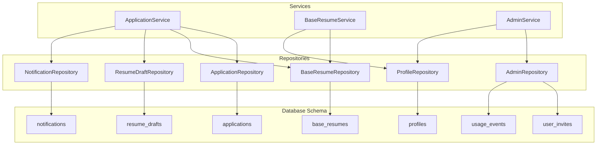
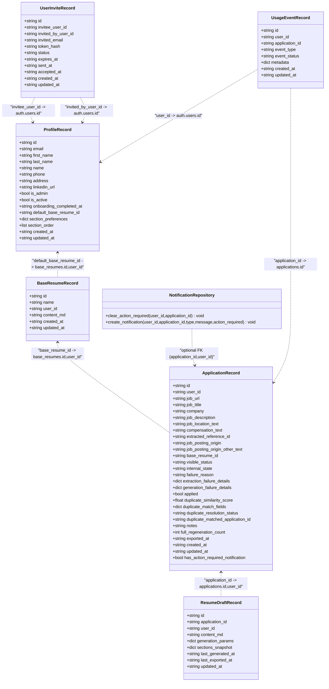
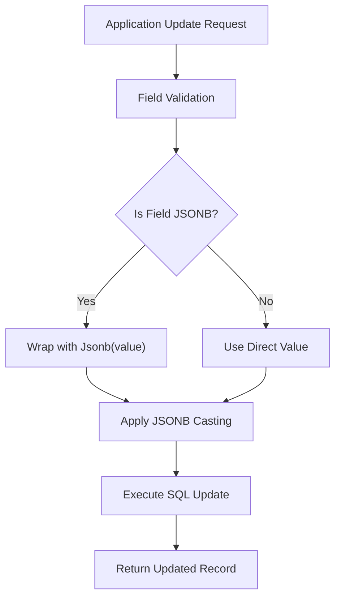
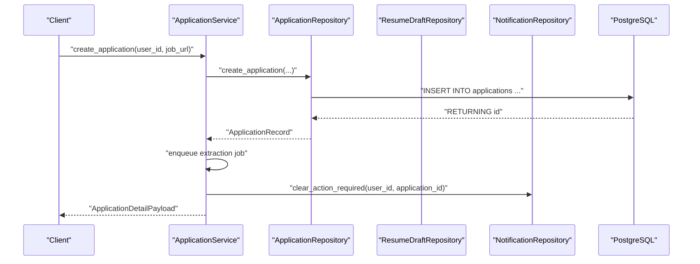
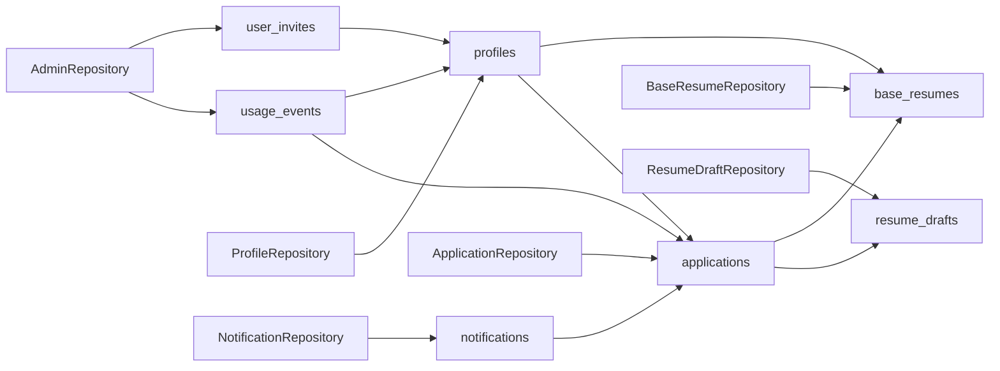

# Database Models

<cite>
**Referenced Files in This Document**
- [profiles.py](file://backend/app/db/profiles.py)
- [applications.py](file://backend/app/db/applications.py)
- [base_resumes.py](file://backend/app/db/base_resumes.py)
- [resume_drafts.py](file://backend/app/db/resume_drafts.py)
- [notifications.py](file://backend/app/db/notifications.py)
- [admin.py](file://backend/app/db/admin.py)
- [public_invites.py](file://backend/app/api/public_invites.py)
- [admin.py](file://backend/app/services/admin.py)
- [20260407_000001_phase_0_foundation.sql](file://supabase/migrations/20260407_000001_phase_0_foundation.sql)
- [20260407_000002_phase_1a_blocked_recovery_extension.sql](file://supabase/migrations/20260407_000002_phase_1a_blocked_recovery_extension.sql)
- [20260407_000004_phase_2_base_resumes.sql](file://supabase/migrations/20260407_000004_phase_2_base_resumes.sql)
- [20260407_000005_phase_3_generation.sql](file://supabase/migrations/20260407_000005_phase_3_generation.sql)
- [20260407_000006_phase_4_generation_failure_reasons.sql](file://supabase/migrations/20260407_000006_phase_4_generation_failure_reasons.sql)
- [20260409_000007_phase_4_application_compensation_text.sql](file://supabase/migrations/20260409_000007_phase_4_application_compensation_text.sql)
- [20260409_000008_phase_4_profile_linkedin_for_export.sql](file://supabase/migrations/20260409_000008_phase_4_profile_linkedin_for_export.sql)
- [20260409_000009_phase_4_application_job_location_text.sql](file://supabase/migrations/20260409_000009_phase_4_application_job_location_text.sql)
- [20260410_000010_phase_5_invites_admin_metrics.sql](file://supabase/migrations/20260410_000010_phase_5_invites_admin_metrics.sql)
- [20260410_000011_phase_5_full_regeneration_cap.sql](file://supabase/migrations/20260410_000011_phase_5_full_regeneration_cap.sql)
- [00-auth-schema.sql](file://supabase/initdb/00-auth-schema.sql)
- [application_manager.py](file://backend/app/services/application_manager.py)
- [base_resumes.py](file://backend/app/services/base_resumes.py)
- [worker.py](file://agents/worker.py)
- [validation.py](file://agents/validation.py)
</cite>

## Update Summary
**Changes Made**
- Added new compensation_text field to Applications model for salary information storage
- Added job_location_text field to Applications model for location extraction support
- Added linkedin_url field to Profiles model for export and user profile integration
- Introduced user_invites table with invite management functionality and invite onboarding workflow
- Added usage_events table for system metrics and operational tracking
- Implemented full_regeneration_count field with regeneration caps for workflow control
- Enhanced Profile model with administrative fields (is_admin, is_active, onboarding_completed_at)
- Updated service layer with invite acceptance workflow and usage event recording
- Added comprehensive invite API endpoints for preview and acceptance functionality

## Table of Contents
1. [Introduction](#introduction)
2. [Project Structure](#project-structure)
3. [Core Components](#core-components)
4. [Architecture Overview](#architecture-overview)
5. [Detailed Component Analysis](#detailed-component-analysis)
6. [Invite System and Administration](#invite-system-and-administration)
7. [Usage Tracking and Metrics](#usage-tracking-and-metrics)
8. [JSONB Field Handling](#jsonb-field-handling)
9. [Failure Details Management](#failure-details-management)
10. [Dependency Analysis](#dependency-analysis)
11. [Performance Considerations](#performance-considerations)
12. [Troubleshooting Guide](#troubleshooting-guide)
13. [Conclusion](#conclusion)

## Introduction
This document describes the database models and relationships used by the job application system. It covers the data model for job applications, user profiles, base resumes, resume drafts, notifications, and the newly added invite system with administrative capabilities. It explains field definitions, data types, constraints, indexes, and referential integrity enforced by the schema. It also documents the Python repositories and services that operate on these models, including SQL patterns, enums, and query optimization strategies.

## Project Structure
The database models are implemented as Pydantic models backed by PostgreSQL tables. Repositories encapsulate SQL operations, while services orchestrate workflows that update these models. The system now includes comprehensive invite management, usage tracking, and administrative capabilities.

**Diagram sources**
- [profiles.py:15-31](file://backend/app/db/profiles.py#L15-L31)
- [base_resumes.py:22-29](file://backend/app/db/base_resumes.py#L22-L29)
- [applications.py:35-64](file://backend/app/db/applications.py#L35-L64)
- [resume_drafts.py:14-24](file://backend/app/db/resume_drafts.py#L14-L24)
- [notifications.py:11-61](file://backend/app/db/notifications.py#L11-L61)
- [admin.py:120-331](file://backend/app/db/admin.py#L120-L331)
- [application_manager.py:143-169](file://backend/app/services/application_manager.py#L143-L169)
- [base_resumes.py:32-154](file://backend/app/services/base_resumes.py#L32-L154)
- [admin.py:1-471](file://backend/app/services/admin.py#L1-L471)

**Section sources**
- [profiles.py:1-279](file://backend/app/db/profiles.py#L1-L279)
- [applications.py:1-372](file://backend/app/db/applications.py#L1-L372)
- [base_resumes.py:1-184](file://backend/app/db/base_resumes.py#L1-L184)
- [resume_drafts.py:1-173](file://backend/app/db/resume_drafts.py#L1-L173)
- [notifications.py:1-61](file://backend/app/db/notifications.py#L1-L61)
- [admin.py:1-471](file://backend/app/db/admin.py#L1-L471)

## Core Components
This section defines each model's fields, types, constraints, and relationships.

- Profiles
  - Purpose: User account, preferences, authentication context, and administrative status.
  - Fields: id (UUID, PK, references auth.users), email (text, unique), first_name/last_name (text), name (text), phone (text), address (text), linkedin_url (text), is_admin (boolean), is_active (boolean), onboarding_completed_at (timestamptz), default_base_resume_id (UUID, FK to base_resumes.id,user_id), section_preferences (JSONB), section_order (JSONB), timestamps.
  - Constraints: Unique email; default JSONB preferences and ordering; triggers update updated_at on change.
  - Indexes: Composite (user_id, updated_at desc), (user_id, name); unique hash index on extension_token_hash (phase 1a).
  - RLS: Self-select/update; creation via auth hook.

- Base Resumes
  - Purpose: Template storage for user-defined base resumes.
  - Fields: id (UUID, PK), user_id (UUID, FK to auth.users), name (text), content_md (text), timestamps.
  - Constraints: Non-blank name/content checks; composite unique (id,user_id); triggers update updated_at on change.
  - Indexes: Composite (user_id, updated_at desc), (user_id, name); standalone user_id index (phase 2).
  - RLS: Per-operation policies (select/insert/update/delete).

- Applications
  - Purpose: Job application tracking with status, duplication detection, export metadata, comprehensive failure details storage, and new compensation/location fields.
  - Fields: id (UUID, PK), user_id (UUID, FK to auth.users), job_url (text), job_title/company/description (text), job_location_text (text), compensation_text (text), extracted_reference_id (text), job_posting_origin (enum), job_posting_origin_other_text (text), base_resume_id (UUID, FK to base_resumes), visible_status/internal_state/failure_reason (enums), applied (bool), duplicate fields (score, match fields, resolution status, matched application id), notes (text), full_regeneration_count (integer), exported_at (timestamptz), timestamps.
  - Constraints: Non-blank job_url; duplicate similarity bounds; mutual exclusivity for origin/other text; composite unique (id,user_id); triggers update updated_at on change.
  - Indexes: Composite (user_id, updated_at desc), (user_id, visible_status, updated_at desc), (user_id, duplicate_resolution_status); GIN trigram search on job_title/company; unresolved duplicates filtered index; triggers on auth.user changes.
  - RLS: Owner-all policy.

- Resume Drafts
  - Purpose: AI-generated content and editing state per application with export tracking.
  - Fields: id (UUID, PK), application_id (UUID, FK to applications), user_id (UUID, FK to auth.users), content_md (text), generation_params/sections_snapshot (JSONB), last_generated_at/last_exported_at (timestamptz), timestamps.
  - Constraints: Non-blank content; unique (application_id); triggers update updated_at on change.
  - Indexes: Unique (application_id); triggers on auth.user changes.
  - RLS: Per-operation policies.

- Notifications
  - Purpose: User communication and action-required alerts.
  - Fields: id (UUID, PK), user_id (UUID, FK to auth.users), application_id (UUID, optional), type (enum), message (text), action_required/read (bool), timestamps.
  - Constraints: Non-blank message; triggers update updated_at on change.
  - Indexes: Composite (user_id, read, created_at desc), unread+action_required filtered index; triggers on auth.user changes.
  - RLS: Owner-all policy.

- User Invites
  - Purpose: Invite management system for controlled user onboarding.
  - Fields: id (UUID, PK), invitee_user_id (UUID, FK to auth.users), invited_by_user_id (UUID, FK to auth.users), invited_email (text), token_hash (text, unique), status (enum: pending, accepted, revoked, expired), expires_at (timestamptz), sent_at/accepted_at (timestamptz), timestamps.
  - Constraints: Non-blank invited_email/token_hash; unique token_hash; composite unique (invitee_user_id) where status = 'pending'; triggers update updated_at on change.
  - Indexes: Composite (invited_by_user_id, created_at desc), (status, created_at desc), (expires_at); unique pending invite per user.
  - RLS: Owner-select/insert/update; creation via auth hook.

- Usage Events
  - Purpose: System metrics and operational tracking for analytics.
  - Fields: id (UUID, PK), user_id (UUID, FK to auth.users), application_id (UUID, optional), event_type (text), event_status (enum: success, failure, info), metadata (JSONB), timestamps.
  - Constraints: Non-blank event_type; default empty JSONB metadata; triggers update updated_at on change.
  - Indexes: Composite (event_type, created_at desc), (user_id, created_at desc), (application_id, created_at desc).
  - RLS: Owner-select/insert; creation via auth hook.

**Section sources**
- [20260407_000001_phase_0_foundation.sql:86-301](file://supabase/migrations/20260407_000001_phase_0_foundation.sql#L86-L301)
- [20260407_000002_phase_1a_blocked_recovery_extension.sql:1-16](file://supabase/migrations/20260407_000002_phase_1a_blocked_recovery_extension.sql#L1-L16)
- [20260407_000004_phase_2_base_resumes.sql:1-158](file://supabase/migrations/20260407_000004_phase_2_base_resumes.sql#L1-L158)
- [20260407_000005_phase_3_generation.sql:1-11](file://supabase/migrations/20260407_000005_phase_3_generation.sql#L1-L11)
- [20260407_000006_phase_4_generation_failure_reasons.sql:1-7](file://supabase/migrations/20260407_000006_phase_4_generation_failure_reasons.sql#L1-L7)
- [20260409_000007_phase_4_application_compensation_text.sql:1-7](file://supabase/migrations/20260409_000007_phase_4_application_compensation_text.sql#L1-L7)
- [20260409_000008_phase_4_profile_linkedin_for_export.sql:1-7](file://supabase/migrations/20260409_000008_phase_4_profile_linkedin_for_export.sql#L1-L7)
- [20260409_000009_phase_4_application_job_location_text.sql:1-7](file://supabase/migrations/20260409_000009_phase_4_application_job_location_text.sql#L1-L7)
- [20260410_000010_phase_5_invites_admin_metrics.sql:1-102](file://supabase/migrations/20260410_000010_phase_5_invites_admin_metrics.sql#L1-L102)
- [20260410_000011_phase_5_full_regeneration_cap.sql:1-12](file://supabase/migrations/20260410_000011_phase_5_full_regeneration_cap.sql#L1-L12)
- [profiles.py:15-31](file://backend/app/db/profiles.py#L15-L31)
- [applications.py:35-64](file://backend/app/db/applications.py#L35-L64)
- [base_resumes.py:14-29](file://backend/app/db/base_resumes.py#L14-L29)
- [resume_drafts.py:14-24](file://backend/app/db/resume_drafts.py#L14-L24)
- [notifications.py:11-61](file://backend/app/db/notifications.py#L11-L61)

## Architecture Overview
The system uses Postgres enums and JSONB fields to represent structured statuses and flexible data. Row-level security policies enforce per-user isolation. Services coordinate workflows that update models and notify users. The new invite system provides controlled user onboarding with comprehensive tracking and administrative capabilities.

**Diagram sources**
- [profiles.py:15-31](file://backend/app/db/profiles.py#L15-L31)
- [base_resumes.py:22-29](file://backend/app/db/base_resumes.py#L22-L29)
- [applications.py:35-64](file://backend/app/db/applications.py#L35-L64)
- [resume_drafts.py:14-24](file://backend/app/db/resume_drafts.py#L14-L24)
- [notifications.py:11-61](file://backend/app/db/notifications.py#L11-L61)
- [admin.py:120-331](file://backend/app/db/admin.py#L120-L331)
- [20260407_000001_phase_0_foundation.sql:111-218](file://supabase/migrations/20260407_000001_phase_0_foundation.sql#L111-L218)

## Detailed Component Analysis

### Profiles Model
- Purpose: Store user account information, preferences, extension token metadata, and administrative status.
- Key fields:
  - id: UUID PK, references auth.users(id) with cascade delete.
  - email: text, unique.
  - first_name/last_name: text fields for user identification.
  - linkedin_url: text field for LinkedIn profile integration.
  - is_admin: boolean flag for administrative access.
  - is_active: boolean flag for account status.
  - onboarding_completed_at: timestamptz for completion tracking.
  - default_base_resume_id: UUID, FK to base_resumes(id,user_id) with on delete set null.
  - section_preferences: JSONB with defaults for resume sections.
  - section_order: JSONB ordering for sections.
  - Timestamps: created_at/updated_at with triggers updating on change.
- Constraints and indexes:
  - Unique email.
  - JSONB defaults ensure consistent preferences.
  - Indexes on (user_id, updated_at desc), (user_id, name).
  - Extension token columns added in phase 1a with unique index on token hash.
- RLS: Self-select/insert/update; auto-create/update via auth trigger.

**Updated** Enhanced with administrative fields (is_admin, is_active, onboarding_completed_at) and LinkedIn URL support for export functionality.

**Section sources**
- [20260407_000001_phase_0_foundation.sql:86-118](file://supabase/migrations/20260407_000001_phase_0_foundation.sql#L86-L118)
- [20260407_000002_phase_1a_blocked_recovery_extension.sql:3-10](file://supabase/migrations/20260407_000002_phase_1a_blocked_recovery_extension.sql#L3-L10)
- [20260409_000008_phase_4_profile_linkedin_for_export.sql:1-7](file://supabase/migrations/20260409_000008_phase_4_profile_linkedin_for_export.sql#L1-L7)
- [20260410_000010_phase_5_invites_admin_metrics.sql:15-20](file://supabase/migrations/20260410_000010_phase_5_invites_admin_metrics.sql#L15-L20)
- [profiles.py:15-31](file://backend/app/db/profiles.py#L15-L31)

### Base Resumes Model
- Purpose: User-defined templates for resumes.
- Key fields:
  - id: UUID PK.
  - user_id: UUID FK to auth.users with cascade delete.
  - name: text, non-blank.
  - content_md: text, non-blank.
  - Timestamps: created_at/updated_at with triggers.
- Constraints and indexes:
  - Composite unique (id,user_id) to align with FKs.
  - Non-blank checks on name and content.
  - Indexes on (user_id, updated_at desc), (user_id, name), and standalone user_id (phase 2).
- RLS: Per-operation policies (select/insert/update/delete).

**Section sources**
- [20260407_000001_phase_0_foundation.sql:99-109](file://supabase/migrations/20260407_000001_phase_0_foundation.sql#L99-L109)
- [20260407_000004_phase_2_base_resumes.sql:14-73](file://supabase/migrations/20260407_000004_phase_2_base_resumes.sql#L14-L73)
- [base_resumes.py:14-29](file://backend/app/db/base_resumes.py#L14-L29)

### Applications Model
- Purpose: Track job posting intake, extraction, generation, and export lifecycle with comprehensive failure tracking and new compensation/location fields.
- Key fields:
  - id: UUID PK.
  - user_id: UUID FK to auth.users with cascade delete.
  - job_url/job_title/company/job_description: text.
  - job_location_text: text field for job location extraction.
  - compensation_text: text field for compensation information storage.
  - extracted_reference_id: text.
  - job_posting_origin: enum; job_posting_origin_other_text: text with mutual exclusivity rules.
  - base_resume_id: UUID FK to base_resumes(id,user_id) with on delete set null.
  - visible_status/internal_state/failure_reason: enums.
  - applied: boolean.
  - duplicate fields: score, match fields, resolution status, matched application id.
  - notes/exported_at: text/timestamp.
  - full_regeneration_count: integer count with non-negative constraint for workflow control.
  - extraction_failure_details: JSONB for storing detailed extraction failure information.
  - generation_failure_details: JSONB for storing detailed generation failure information.
  - duplicate_match_fields: JSONB for storing structured duplicate match criteria.
  - Timestamps: created_at/updated_at with triggers.
- Constraints and indexes:
  - Non-blank job_url; duplicate similarity bounds; mutual exclusivity for origin/other text.
  - Composite unique (id,user_id).
  - Indexes: (user_id, updated_at desc), (user_id, visible_status, updated_at desc), (user_id, duplicate_resolution_status), GIN trigram search on job_title/company, unresolved duplicates filtered index.
  - Triggers on auth.users insert/update to keep profiles in sync.
- RLS: Owner-all policy.

**Updated** Enhanced with compensation_text and job_location_text fields for richer job data capture, full_regeneration_count field with regeneration caps for workflow control, and comprehensive JSONB field handling for structured failure details storage.

**Section sources**
- [20260407_000001_phase_0_foundation.sql:120-175](file://supabase/migrations/20260407_000001_phase_0_foundation.sql#L120-L175)
- [20260407_000002_phase_1a_blocked_recovery_extension.sql:12-13](file://supabase/migrations/20260407_000002_phase_1a_blocked_recovery_extension.sql#L12-L13)
- [20260407_000005_phase_3_generation.sql:7-8](file://supabase/migrations/20260407_000005_phase_3_generation.sql#L7-L8)
- [20260407_000006_phase_4_generation_failure_reasons.sql:3-4](file://supabase/migrations/20260407_000006_phase_4_generation_failure_reasons.sql#L3-L4)
- [20260409_000007_phase_4_application_compensation_text.sql:1-7](file://supabase/migrations/20260409_000007_phase_4_application_compensation_text.sql#L1-L7)
- [20260409_000009_phase_4_application_job_location_text.sql:1-7](file://supabase/migrations/20260409_000009_phase_4_application_job_location_text.sql#L1-L7)
- [20260410_000011_phase_5_full_regeneration_cap.sql:1-12](file://supabase/migrations/20260410_000011_phase_5_full_regeneration_cap.sql#L1-L12)
- [applications.py:35-64](file://backend/app/db/applications.py#L35-L64)

### Resume Drafts Model
- Purpose: Store AI-generated content and editing state per application with comprehensive export tracking.
- Key fields:
  - id: UUID PK.
  - application_id: UUID FK to applications(id,user_id) with cascade delete.
  - user_id: UUID FK to auth.users with cascade delete.
  - content_md: text, non-blank.
  - generation_params/sections_snapshot: JSONB.
  - last_generated_at/last_exported_at: timestamp.
  - Timestamps: created_at/updated_at with triggers.
- Constraints and indexes:
  - Unique (application_id).
  - Non-blank content check.
  - Indexes: unique (application_id).
- RLS: Per-operation policies.

**Updated** Enhanced with export tracking capabilities through last_exported_at field and improved draft management during generation workflows.

**Section sources**
- [20260407_000001_phase_0_foundation.sql:176-198](file://supabase/migrations/20260407_000001_phase_0_foundation.sql#L176-L198)
- [resume_drafts.py:14-24](file://backend/app/db/resume_drafts.py#L14-L24)

### Notifications Model
- Purpose: User communication and action-required alerts.
- Key fields:
  - id: UUID PK.
  - user_id: UUID FK to auth.users with cascade delete.
  - application_id: UUID, optional FK to applications(id,user_id) with on delete set null.
  - type: enum.
  - message: text, non-blank.
  - action_required/read: booleans.
  - Timestamps: created_at with triggers.
- Constraints and indexes:
  - Non-blank message.
  - Indexes: (user_id, read, created_at desc), unread+action_required filtered index.
- RLS: Owner-all policy.

**Section sources**
- [20260407_000001_phase_0_foundation.sql:199-219](file://supabase/migrations/20260407_000001_phase_0_foundation.sql#L199-L219)
- [notifications.py:11-61](file://backend/app/db/notifications.py#L11-L61)

## Invite System and Administration

### User Invites Model
- Purpose: Manage controlled user onboarding through invitation-based workflow.
- Key fields:
  - id: UUID PK.
  - invitee_user_id: UUID FK to auth.users with cascade delete.
  - invited_by_user_id: UUID FK to auth.users with cascade delete.
  - invited_email: text, non-blank.
  - token_hash: text, unique hash for secure invitation links.
  - status: enum (pending, accepted, revoked, expired) with default pending.
  - expires_at: timestamptz for expiration tracking.
  - sent_at/accepted_at: timestamps for workflow tracking.
  - Timestamps: created_at/updated_at with triggers.
- Constraints and indexes:
  - Non-blank invited_email and token_hash checks.
  - Unique token_hash constraint.
  - Composite unique (invitee_user_id) where status = 'pending'.
  - Indexes: (invited_by_user_id, created_at desc), (status, created_at desc), (expires_at).
- RLS: Owner-select/insert/update policy.

### Usage Events Model
- Purpose: Track system operations and user interactions for analytics and monitoring.
- Key fields:
  - id: UUID PK.
  - user_id: UUID FK to auth.users with cascade delete.
  - application_id: UUID, optional FK to applications with on delete set null.
  - event_type: text, non-blank.
  - event_status: enum (success, failure, info) with default success.
  - metadata: JSONB with default empty object.
  - Timestamps: created_at with triggers.
- Constraints and indexes:
  - Non-blank event_type check.
  - Default empty JSONB metadata.
  - Indexes: (event_type, created_at desc), (user_id, created_at desc), (application_id, created_at desc).
- RLS: Owner-select/insert policy.

**Section sources**
- [20260410_000010_phase_5_invites_admin_metrics.sql:22-101](file://supabase/migrations/20260410_000010_phase_5_invites_admin_metrics.sql#L22-L101)
- [admin.py:120-331](file://backend/app/db/admin.py#L120-L331)

### Invite API Endpoints
The system provides comprehensive invite management through FastAPI endpoints:

#### Preview Invite Endpoint
- GET `/api/public/invites/preview`
- Validates token and returns invite preview with expiration details
- Returns invited_email and expires_at fields

#### Accept Invite Endpoint
- POST `/api/public/invites/accept`
- Handles invite acceptance with comprehensive validation
- Validates password strength requirements
- Creates user account with profile information
- Updates invite status to accepted
- Records usage events for analytics

**Section sources**
- [public_invites.py:104-135](file://backend/app/api/public_invites.py#L104-L135)
- [admin.py:210-271](file://backend/app/services/admin.py#L210-L271)

## Usage Tracking and Metrics

### Usage Event Recording
The system tracks various operational events for monitoring and analytics:

#### Invite Events
- `invite_sent`: Tracks successful and failed invite deliveries
- `invite_accepted`: Records successful user onboarding through invitations

#### Operation Metrics
- `extraction`: Tracks job posting extraction success rates
- `generation`: Monitors resume generation performance
- `regeneration`: Records regeneration attempts and outcomes
- `export`: Tracks PDF export operations

#### Administrative Operations
- User management actions (create, update, deactivate, reactivate, delete)
- System maintenance and cleanup operations

**Section sources**
- [admin.py:389-401](file://backend/app/services/admin.py#L389-L401)
- [admin.py:80-117](file://backend/app/services/admin.py#L80-L117)

## JSONB Field Handling

The Applications model now includes comprehensive JSONB field handling for structured failure details storage. The ApplicationRepository provides specialized preparation and casting mechanisms for these fields.

### JSONB Fields in Applications Model

- **extraction_failure_details**: JSONB field for storing detailed extraction failure information including blocked source detection, provider information, and reference IDs.
- **generation_failure_details**: JSONB field for storing structured generation failure information with validation error normalization.
- **duplicate_match_fields**: JSONB field for storing structured criteria used in duplicate detection algorithms.

### ApplicationRepository JSONB Handling

The ApplicationRepository implements specialized JSONB field handling through two key methods:

#### Field Preparation (`_prepare_value`)
- Identifies JSONB fields: `extraction_failure_details`, `generation_failure_details`, `duplicate_match_fields`
- Wraps values with `psycopg.types.json.Jsonb()` for proper PostgreSQL JSONB casting
- Ensures structured data is properly serialized before database insertion

#### Cast Placeholder (`_cast_placeholder`)
- Provides explicit JSONB casting for JSONB fields
- Maintains type safety through proper PostgreSQL casting
- Supports dynamic field updates with correct data type handling

**Diagram sources**
- [applications.py:337-368](file://backend/app/db/applications.py#L337-L368)

**Section sources**
- [applications.py:337-368](file://backend/app/db/applications.py#L337-L368)

## Failure Details Management

The system now supports comprehensive structured failure details storage with validation error normalization and processing workflows.

### Failure Reason Enum Extensions

The failure_reason_enum has been extended with new values:
- `generation_timeout`: Indicates generation timed out
- `generation_cancelled`: Indicates generation was cancelled

### Validation Error Normalization

Both the agent worker and application service implement validation error normalization:

#### Agent Worker Normalization (`_normalize_validation_error`)
- Handles string, dictionary, and mixed error formats
- Extracts detail and section information from structured errors
- Formats errors consistently for storage

#### Application Service Normalization (`_normalize_generation_failure_details`)
- Processes validation errors from resume validation
- Formats errors with section prefixes
- Creates structured failure details for storage

### Failure Details Storage Patterns

#### Extraction Failure Details
Structured storage includes:
- `kind`: Failure type identifier
- `provider`: Source provider information
- `reference_id`: Unique reference for blocked pages
- `blocked_url`: URL where blocking occurred
- `detected_at`: Timestamp of detection

#### Generation Failure Details  
Structured storage includes:
- `message`: Human-readable failure description
- `validation_errors`: Normalized list of validation errors
- Automatic formatting of error messages with section context

**Section sources**
- [20260407_000006_phase_4_generation_failure_reasons.sql:3-4](file://supabase/migrations/20260407_000006_phase_4_generation_failure_reasons.sql#L3-L4)
- [worker.py:164-177](file://agents/worker.py#L164-L177)
- [application_manager.py:1705-1741](file://backend/app/services/application_manager.py#L1705-L1741)

## Architecture Overview

**Diagram sources**
- [application_manager.py:183-225](file://backend/app/services/application_manager.py#L183-L225)
- [applications.py:169-200](file://backend/app/db/applications.py#L169-L200)
- [notifications.py:20-30](file://backend/app/db/notifications.py#L20-L30)

## Detailed Component Analysis

### ApplicationRepository
- Responsibilities:
  - List, create, fetch, and update applications.
  - Fetch matched application and duplicate candidates.
  - Dynamic updates with enum and UUID casting.
  - Specialized JSONB field preparation and casting.
- Notable patterns:
  - Uses a reusable base select with left join to base_resumes and a correlated exists to compute has_action_required_notification.
  - Enum casts for status fields; UUID casts for foreign keys.
  - JSONB field handling through `_prepare_value` and `_cast_placeholder` methods.
  - Case-insensitive search on job_title and company combined.

**Updated** Enhanced with comprehensive JSONB field handling for structured failure details storage and validation error normalization.

**Section sources**
- [applications.py:130-372](file://backend/app/db/applications.py#L130-L372)

### ProfileRepository
- Responsibilities:
  - Fetch profile and extension connection state.
  - Upsert/clear extension token with timestamps.
  - Touch token last-used-at.
  - Update profile fields dynamically with JSONB casting for section_preferences and section_order.
  - Update default base resume and fetch default resume id.
- Notable patterns:
  - Dynamic assignment building with safe SQL identifiers.
  - JSONB casting for specific fields.

**Section sources**
- [profiles.py:46-279](file://backend/app/db/profiles.py#L46-L279)

### BaseResumeRepository
- Responsibilities:
  - List, create, fetch, update, and delete base resumes.
  - Check if a resume is referenced by applications.
- Notable patterns:
  - Composite unique (id,user_id) aligns with FKs.
  - Reference check via applications.base_resume_id.

**Section sources**
- [base_resumes.py:40-180](file://backend/app/db/base_resumes.py#L40-L180)

### ResumeDraftRepository
- Responsibilities:
  - Fetch draft by user_id and application_id.
  - Upsert draft with JSONB generation_params and sections_snapshot; ON CONFLICT WHERE user_id to ensure per-user uniqueness.
  - Update draft content_md and mark last_exported_at.
- Notable patterns:
  - JSON serialization for JSONB fields.
  - ON CONFLICT WHERE clause to scope uniqueness by user_id.

**Updated** Enhanced with export tracking capabilities allowing applications to mark when drafts are exported.

**Section sources**
- [resume_drafts.py:50-170](file://backend/app/db/resume_drafts.py#L50-L170)

### NotificationRepository
- Responsibilities:
  - Clear action_required for a user's application.
  - Create notifications with typed enum.
- Notable patterns:
  - Enum cast for notification_type.

**Section sources**
- [notifications.py:20-57](file://backend/app/db/notifications.py#L20-L57)

### AdminRepository
- Responsibilities:
  - Manage user invites with status tracking and expiration handling.
  - Record usage events for system metrics and analytics.
  - Provide administrative metrics and reporting capabilities.
- Notable patterns:
  - Complex joins between user_invites and profiles for status validation.
  - Comprehensive indexing for invite and usage event queries.

**Section sources**
- [admin.py:120-331](file://backend/app/db/admin.py#L120-L331)

### Service Layer Usage
- ApplicationService orchestrates:
  - Creating applications and enqueuing extraction jobs.
  - Handling worker callbacks to update internal_state and failure_reason.
  - Triggering generation with base resume content and user profile preferences.
  - Managing resume drafts and notifications during generation.
  - Processing generation failure details and updating application records.
  - Normalizing validation errors for structured storage.
- BaseResumeService:
  - Lists, creates, updates, deletes base resumes.
  - Sets default resume and validates constraints.
- AdminService:
  - Manages user invites with comprehensive validation and email delivery.
  - Handles invite acceptance workflow with password validation and profile updates.
  - Records usage events for operational metrics and analytics.
  - Provides administrative dashboard with system metrics.

**Updated** Enhanced with comprehensive generation failure handling including timeout and cancellation scenarios, improved draft management during generation workflows, structured validation error processing, invite management system with onboarding workflow, and comprehensive usage tracking for system analytics.

**Section sources**
- [application_manager.py:143-800](file://backend/app/services/application_manager.py#L143-L800)
- [base_resumes.py:32-154](file://backend/app/services/base_resumes.py#L32-L154)
- [admin.py:69-471](file://backend/app/services/admin.py#L69-L471)

## Dependency Analysis

**Diagram sources**
- [20260407_000001_phase_0_foundation.sql:111-218](file://supabase/migrations/20260407_000001_phase_0_foundation.sql#L111-L218)
- [20260410_000010_phase_5_invites_admin_metrics.sql:22-101](file://supabase/migrations/20260410_000010_phase_5_invites_admin_metrics.sql#L22-L101)
- [profiles.py:15-31](file://backend/app/db/profiles.py#L15-L31)
- [base_resumes.py:31-184](file://backend/app/db/base_resumes.py#L31-L184)
- [applications.py:123-372](file://backend/app/db/applications.py#L123-L372)
- [resume_drafts.py:41-173](file://backend/app/db/resume_drafts.py#L41-L173)
- [notifications.py:11-61](file://backend/app/db/notifications.py#L11-L61)
- [admin.py:120-331](file://backend/app/db/admin.py#L120-L331)

**Section sources**
- [20260407_000001_phase_0_foundation.sql:111-218](file://supabase/migrations/20260407_000001_phase_0_foundation.sql#L111-L218)

## Performance Considerations
- Indexes
  - Composite indexes on (user_id, updated_at desc) for efficient listing and sorting by recency.
  - Filtered indexes for unresolved duplicates and unread+action_required notifications.
  - GIN trigram index on concatenated job_title/company for text search.
  - New indexes for user_invites (invited_by_user_id, status, expires_at) for efficient invite management.
  - Usage event indexes (event_type, user_id, application_id) for analytics queries.
- Enums and JSONB
  - Enums reduce storage and improve query performance compared to text.
  - JSONB enables flexible fields without schema churn.
  - JSONB fields support efficient indexing and querying of structured data.
- Triggers
  - set_updated_at reduces write overhead by updating timestamps automatically.
- RLS
  - Policies restrict access to user-owned rows; composite indexes on user_id support efficient filtering.
- New Columns
  - Compensation and location text fields support rich job data without complex parsing.
  - Regeneration count field enables workflow control and rate limiting.

## Troubleshooting Guide
- Foreign key violations
  - Ensure base_resume_id references (id,user_id) in base_resumes.
  - Ensure application_id references (id,user_id) in applications for resume_drafts.
  - Ensure application_id references (id,user_id) in applications for notifications.
  - Ensure invitee_user_id and invited_by_user_id reference auth.users for user_invites.
- Constraint violations
  - Non-blank name/content for base_resumes and resume_drafts.
  - Non-blank job_url for applications.
  - Non-blank invited_email/token_hash for user_invites.
  - Duplicate similarity score bounds (0–100).
  - Mutual exclusivity between job_posting_origin='other' and job_posting_origin_other_text.
  - Non-negative full_regeneration_count constraint.
- RLS errors
  - Confirm auth.uid() equals user_id for the targeted row.
- Extension token issues
  - Verify unique index on extension_token_hash is respected; ensure token is cleared when disconnected.
- Generation failure tracking
  - Ensure generation_failure_details JSONB is properly formatted when storing failure information.
  - Verify new failure reason enum values are correctly handled in application updates.
  - Check that JSONB fields are properly prepared using Jsonb() wrapper.
  - Validate that validation errors are normalized consistently across worker and service layers.
- Invite system issues
  - Verify token_hash uniqueness for user_invites.
  - Check invite expiration logic and status transitions.
  - Ensure email delivery configuration is properly set up for invite emails.
- Usage event tracking
  - Verify event_type constraints and metadata formatting.
  - Check that usage events are properly recorded for all system operations.
- JSONB field handling
  - Ensure extraction_failure_details, generation_failure_details, and duplicate_match_fields are properly cast to JSONB.
  - Verify that structured data is correctly serialized before database insertion.

**Section sources**
- [20260407_000001_phase_0_foundation.sql:107-156](file://supabase/migrations/20260407_000001_phase_0_foundation.sql#L107-L156)
- [20260407_000001_phase_0_foundation.sql:187-219](file://supabase/migrations/20260407_000001_phase_0_foundation.sql#L187-L219)
- [20260407_000002_phase_1a_blocked_recovery_extension.sql:8-10](file://supabase/migrations/20260407_000002_phase_1a_blocked_recovery_extension.sql#L8-L10)
- [20260407_000005_phase_3_generation.sql:7-8](file://supabase/migrations/20260407_000005_phase_3_generation.sql#L7-L8)
- [20260407_000006_phase_4_generation_failure_reasons.sql:3-4](file://supabase/migrations/20260407_000006_phase_4_generation_failure_reasons.sql#L3-L4)
- [20260409_000007_phase_4_application_compensation_text.sql:1-7](file://supabase/migrations/20260409_000007_phase_4_application_compensation_text.sql#L1-L7)
- [20260409_000008_phase_4_profile_linkedin_for_export.sql:1-7](file://supabase/migrations/20260409_000008_phase_4_profile_linkedin_for_export.sql#L1-L7)
- [20260409_000009_phase_4_application_job_location_text.sql:1-7](file://supabase/migrations/20260409_000009_phase_4_application_job_location_text.sql#L1-L7)
- [20260410_000010_phase_5_invites_admin_metrics.sql:15-44](file://supabase/migrations/20260410_000010_phase_5_invites_admin_metrics.sql#L15-L44)
- [20260410_000011_phase_5_full_regeneration_cap.sql:1-12](file://supabase/migrations/20260410_000011_phase_5_full_regeneration_cap.sql#L1-L12)
- [applications.py:337-368](file://backend/app/db/applications.py#L337-L368)

## Conclusion
The database models are designed around clear ownership semantics with per-user isolation via RLS and composite foreign keys to maintain referential integrity. Repositories encapsulate SQL operations with dynamic casting and safe query construction. Services coordinate complex workflows across models, leveraging enums, JSONB, and indexes for performance and flexibility. The addition of comprehensive resume draft management, generation failure tracking, structured JSONB field handling, invite system with onboarding workflow, usage tracking, and administrative capabilities significantly enhances the system's ability to handle AI-generated content workflows with robust error handling, export capabilities, detailed failure information storage, controlled user onboarding, comprehensive analytics, and workflow governance. The enhanced JSONB field handling ensures proper preparation and casting of complex failure information, enabling structured storage and efficient querying of detailed operational data. The new invite system provides secure, trackable user onboarding with comprehensive validation and administrative oversight, while usage events enable detailed system monitoring and performance analytics.