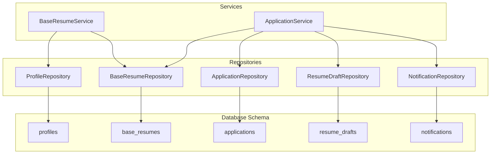
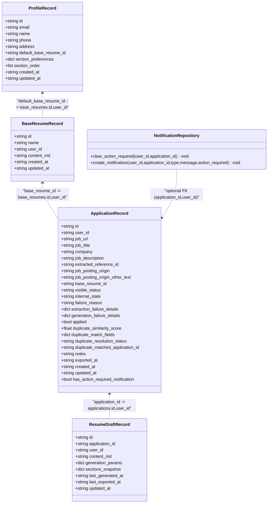
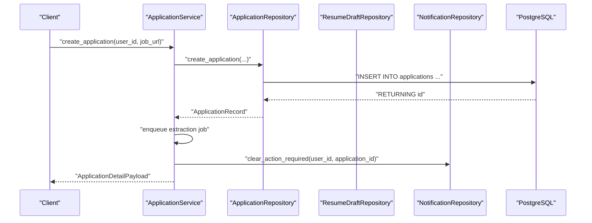
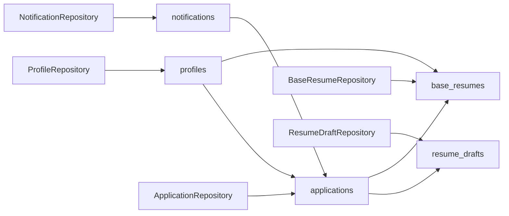

# Database Models

<cite>
**Referenced Files in This Document**
- [profiles.py](file://backend/app/db/profiles.py)
- [applications.py](file://backend/app/db/applications.py)
- [base_resumes.py](file://backend/app/db/base_resumes.py)
- [resume_drafts.py](file://backend/app/db/resume_drafts.py)
- [notifications.py](file://backend/app/db/notifications.py)
- [20260407_000001_phase_0_foundation.sql](file://supabase/migrations/20260407_000001_phase_0_foundation.sql)
- [20260407_000002_phase_1a_blocked_recovery_extension.sql](file://supabase/migrations/20260407_000002_phase_1a_blocked_recovery_extension.sql)
- [20260407_000004_phase_2_base_resumes.sql](file://supabase/migrations/20260407_000004_phase_2_base_resumes.sql)
- [20260407_000005_phase_3_generation.sql](file://supabase/migrations/20260407_000005_phase_3_generation.sql)
- [00-auth-schema.sql](file://supabase/initdb/00-auth-schema.sql)
- [application_manager.py](file://backend/app/services/application_manager.py)
- [base_resumes.py](file://backend/app/services/base_resumes.py)
</cite>

## Table of Contents
1. [Introduction](#introduction)
2. [Project Structure](#project-structure)
3. [Core Components](#core-components)
4. [Architecture Overview](#architecture-overview)
5. [Detailed Component Analysis](#detailed-component-analysis)
6. [Dependency Analysis](#dependency-analysis)
7. [Performance Considerations](#performance-considerations)
8. [Troubleshooting Guide](#troubleshooting-guide)
9. [Conclusion](#conclusion)

## Introduction
This document describes the database models and relationships used by the job application system. It covers the data model for job applications, user profiles, base resumes, resume drafts, and notifications. It explains field definitions, data types, constraints, indexes, and referential integrity enforced by the schema. It also documents the Python repositories and services that operate on these models, including SQL patterns, enums, and query optimization strategies.

## Project Structure
The database models are implemented as Pydantic models backed by PostgreSQL tables. Repositories encapsulate SQL operations, while services orchestrate workflows that update these models.

**Diagram sources**
- [profiles.py:38-225](file://backend/app/db/profiles.py#L38-L225)
- [base_resumes.py:31-184](file://backend/app/db/base_resumes.py#L31-L184)
- [applications.py:123-328](file://backend/app/db/applications.py#L123-L328)
- [resume_drafts.py:41-173](file://backend/app/db/resume_drafts.py#L41-L173)
- [notifications.py:11-61](file://backend/app/db/notifications.py#L11-L61)
- [application_manager.py:143-169](file://backend/app/services/application_manager.py#L143-L169)
- [base_resumes.py:32-154](file://backend/app/services/base_resumes.py#L32-L154)

**Section sources**
- [profiles.py:1-225](file://backend/app/db/profiles.py#L1-L225)
- [applications.py:1-328](file://backend/app/db/applications.py#L1-L328)
- [base_resumes.py:1-184](file://backend/app/db/base_resumes.py#L1-L184)
- [resume_drafts.py:1-173](file://backend/app/db/resume_drafts.py#L1-L173)
- [notifications.py:1-61](file://backend/app/db/notifications.py#L1-L61)

## Core Components
This section defines each model’s fields, types, constraints, and relationships.

- Profiles
  - Purpose: User account, preferences, and authentication context.
  - Fields: id (UUID, PK, references auth.users), email (text, unique), name (text), phone (text), address (text), default_base_resume_id (UUID, FK to base_resumes.id,user_id), section_preferences (JSONB), section_order (JSONB), timestamps.
  - Constraints: Unique email; default JSONB preferences and ordering; triggers update updated_at on change.
  - Indexes: Composite (user_id, updated_at desc), (user_id, name); unique hash index on extension_token_hash (phase 1a).
  - RLS: Self-select/update; creation via auth hook.

- Base Resumes
  - Purpose: Template storage for user-defined base resumes.
  - Fields: id (UUID, PK), user_id (UUID, FK to auth.users), name (text), content_md (text), timestamps.
  - Constraints: Non-blank name/content checks; composite unique (id,user_id); triggers update updated_at on change.
  - Indexes: Composite (user_id, updated_at desc), (user_id, name); standalone user_id index (phase 2).
  - RLS: Per-operation policies (select/insert/update/delete).

- Applications
  - Purpose: Job application tracking with status, duplication detection, and export metadata.
  - Fields: id (UUID, PK), user_id (UUID, FK to auth.users), job_url (text), job_title/company/description (text), extracted_reference_id (text), job_posting_origin (enum), job_posting_origin_other_text (text), base_resume_id (UUID, FK to base_resumes), visible_status/internal_state/failure_reason (enums), applied (bool), duplicate fields (score, match fields, resolution status, matched application id), notes (text), exported_at (timestamptz), timestamps.
  - Constraints: Non-blank job_url; duplicate similarity bounds; mutual exclusivity for origin/other text; composite unique (id,user_id); triggers update updated_at on change.
  - Indexes: Composite (user_id, updated_at desc), (user_id, visible_status, updated_at desc), (user_id, duplicate_resolution_status); GIN trigram search on job_title/company; unresolved duplicates filtered index; triggers on auth.user changes.
  - RLS: Owner-all policy.

- Resume Drafts
  - Purpose: AI-generated content and editing state per application.
  - Fields: id (UUID, PK), application_id (UUID, FK to applications), user_id (UUID, FK to auth.users), content_md (text), generation_params/sections_snapshot (JSONB), last_generated_at/last_exported_at (timestamptz), timestamps.
  - Constraints: Non-blank content; unique (application_id); triggers update updated_at on change.
  - Indexes: Unique (application_id); triggers on auth.user changes.
  - RLS: Per-operation policies.

- Notifications
  - Purpose: User communication and action-required alerts.
  - Fields: id (UUID, PK), user_id (UUID, FK to auth.users), application_id (UUID, optional), type (enum), message (text), action_required/read (bool), timestamps.
  - Constraints: Non-blank message; triggers update updated_at on change.
  - Indexes: Composite (user_id, read, created_at desc), unread+action_required filtered index; triggers on auth.user changes.
  - RLS: Owner-all policy.

**Section sources**
- [20260407_000001_phase_0_foundation.sql:86-301](file://supabase/migrations/20260407_000001_phase_0_foundation.sql#L86-L301)
- [20260407_000002_phase_1a_blocked_recovery_extension.sql:1-16](file://supabase/migrations/20260407_000002_phase_1a_blocked_recovery_extension.sql#L1-L16)
- [20260407_000004_phase_2_base_resumes.sql:1-158](file://supabase/migrations/20260407_000004_phase_2_base_resumes.sql#L1-L158)
- [20260407_000005_phase_3_generation.sql:1-11](file://supabase/migrations/20260407_000005_phase_3_generation.sql#L1-L11)
- [profiles.py:14-36](file://backend/app/db/profiles.py#L14-L36)
- [base_resumes.py:14-29](file://backend/app/db/base_resumes.py#L14-L29)
- [applications.py:14-61](file://backend/app/db/applications.py#L14-L61)
- [resume_drafts.py:14-24](file://backend/app/db/resume_drafts.py#L14-L24)
- [notifications.py:11-61](file://backend/app/db/notifications.py#L11-L61)

## Architecture Overview
The system uses Postgres enums and JSONB fields to represent structured statuses and flexible data. Row-level security policies enforce per-user isolation. Services coordinate workflows that update models and notify users.

**Diagram sources**
- [profiles.py:14-36](file://backend/app/db/profiles.py#L14-L36)
- [base_resumes.py:22-29](file://backend/app/db/base_resumes.py#L22-L29)
- [applications.py:34-61](file://backend/app/db/applications.py#L34-L61)
- [resume_drafts.py:14-24](file://backend/app/db/resume_drafts.py#L14-L24)
- [notifications.py:11-61](file://backend/app/db/notifications.py#L11-L61)
- [20260407_000001_phase_0_foundation.sql:111-218](file://supabase/migrations/20260407_000001_phase_0_foundation.sql#L111-L218)

## Detailed Component Analysis

### Profiles Model
- Purpose: Store user account information, preferences, and extension token metadata.
- Key fields:
  - id: UUID PK, references auth.users(id) with cascade delete.
  - email: text, unique.
  - default_base_resume_id: UUID, FK to base_resumes(id,user_id) with on delete set null.
  - section_preferences: JSONB with defaults for resume sections.
  - section_order: JSONB ordering for sections.
  - Timestamps: created_at/updated_at with triggers updating on change.
- Constraints and indexes:
  - Unique email.
  - JSONB defaults ensure consistent preferences.
  - Indexes on (user_id, updated_at desc), (user_id, name).
  - Extension token columns added in phase 1a with unique index on token hash.
- RLS: Self-select/insert/update; auto-create/update via auth trigger.

**Section sources**
- [20260407_000001_phase_0_foundation.sql:86-118](file://supabase/migrations/20260407_000001_phase_0_foundation.sql#L86-L118)
- [20260407_000002_phase_1a_blocked_recovery_extension.sql:3-10](file://supabase/migrations/20260407_000002_phase_1a_blocked_recovery_extension.sql#L3-L10)
- [profiles.py:14-36](file://backend/app/db/profiles.py#L14-L36)

### Base Resumes Model
- Purpose: User-defined templates for resumes.
- Key fields:
  - id: UUID PK.
  - user_id: UUID FK to auth.users with cascade delete.
  - name: text, non-blank.
  - content_md: text, non-blank.
  - Timestamps: created_at/updated_at with triggers.
- Constraints and indexes:
  - Composite unique (id,user_id) to align with FKs.
  - Non-blank checks on name and content.
  - Indexes on (user_id, updated_at desc), (user_id, name), and standalone user_id (phase 2).
- RLS: Per-operation policies (select/insert/update/delete).

**Section sources**
- [20260407_000001_phase_0_foundation.sql:99-109](file://supabase/migrations/20260407_000001_phase_0_foundation.sql#L99-L109)
- [20260407_000004_phase_2_base_resumes.sql:14-73](file://supabase/migrations/20260407_000004_phase_2_base_resumes.sql#L14-L73)
- [base_resumes.py:14-29](file://backend/app/db/base_resumes.py#L14-L29)

### Applications Model
- Purpose: Track job posting intake, extraction, generation, and export lifecycle.
- Key fields:
  - id: UUID PK.
  - user_id: UUID FK to auth.users with cascade delete.
  - job_url/job_title/company/job_description: text.
  - extracted_reference_id: text.
  - job_posting_origin: enum; job_posting_origin_other_text: text with mutual exclusivity rules.
  - base_resume_id: UUID FK to base_resumes(id,user_id) with on delete set null.
  - visible_status/internal_state/failure_reason: enums.
  - applied: boolean.
  - duplicate fields: score, match fields, resolution status, matched application id.
  - notes/exported_at: text/timestamp.
  - Timestamps: created_at/updated_at with triggers.
- Constraints and indexes:
  - Non-blank job_url; duplicate similarity bounds; mutual exclusivity for origin/other text.
  - Composite unique (id,user_id).
  - Indexes: (user_id, updated_at desc), (user_id, visible_status, updated_at desc), (user_id, duplicate_resolution_status), GIN trigram search on job_title/company, unresolved duplicates filtered index.
  - Triggers on auth.users insert/update to keep profiles in sync.
- RLS: Owner-all policy.

**Section sources**
- [20260407_000001_phase_0_foundation.sql:120-175](file://supabase/migrations/20260407_000001_phase_0_foundation.sql#L120-L175)
- [20260407_000002_phase_1a_blocked_recovery_extension.sql:12-13](file://supabase/migrations/20260407_000002_phase_1a_blocked_recovery_extension.sql#L12-L13)
- [20260407_000005_phase_3_generation.sql:7-8](file://supabase/migrations/20260407_000005_phase_3_generation.sql#L7-L8)
- [applications.py:14-61](file://backend/app/db/applications.py#L14-L61)

### Resume Drafts Model
- Purpose: Store AI-generated content and editing state per application.
- Key fields:
  - id: UUID PK.
  - application_id: UUID FK to applications(id,user_id) with cascade delete.
  - user_id: UUID FK to auth.users with cascade delete.
  - content_md: text, non-blank.
  - generation_params/sections_snapshot: JSONB.
  - last_generated_at/last_exported_at: timestamp.
  - Timestamps: created_at/updated_at with triggers.
- Constraints and indexes:
  - Unique (application_id).
  - Non-blank content check.
  - Indexes: unique (application_id).
- RLS: Per-operation policies.

**Section sources**
- [20260407_000001_phase_0_foundation.sql:176-198](file://supabase/migrations/20260407_000001_phase_0_foundation.sql#L176-L198)
- [resume_drafts.py:14-24](file://backend/app/db/resume_drafts.py#L14-L24)

### Notifications Model
- Purpose: User communication and action-required alerts.
- Key fields:
  - id: UUID PK.
  - user_id: UUID FK to auth.users with cascade delete.
  - application_id: UUID, optional FK to applications(id,user_id) with on delete set null.
  - type: enum.
  - message: text, non-blank.
  - action_required/read: booleans.
  - Timestamps: created_at with triggers.
- Constraints and indexes:
  - Non-blank message.
  - Indexes: (user_id, read, created_at desc), unread+action_required filtered index.
- RLS: Owner-all policy.

**Section sources**
- [20260407_000001_phase_0_foundation.sql:199-219](file://supabase/migrations/20260407_000001_phase_0_foundation.sql#L199-L219)
- [notifications.py:11-61](file://backend/app/db/notifications.py#L11-L61)

## Architecture Overview

**Diagram sources**
- [application_manager.py:183-225](file://backend/app/services/application_manager.py#L183-L225)
- [applications.py:162-192](file://backend/app/db/applications.py#L162-L192)
- [notifications.py:20-30](file://backend/app/db/notifications.py#L20-L30)

## Detailed Component Analysis

### ApplicationRepository
- Responsibilities:
  - List, create, fetch, and update applications.
  - Fetch matched application and duplicate candidates.
  - Dynamic updates with enum and UUID casting.
- Notable patterns:
  - Uses a reusable base select with left join to base_resumes and a correlated exists to compute has_action_required_notification.
  - Enum casts for status fields; UUID casts for foreign keys.
  - Case-insensitive search on job_title and company combined.

**Section sources**
- [applications.py:82-121](file://backend/app/db/applications.py#L82-L121)
- [applications.py:132-324](file://backend/app/db/applications.py#L132-L324)

### ProfileRepository
- Responsibilities:
  - Fetch profile and extension connection state.
  - Upsert/clear extension token with timestamps.
  - Touch token last-used-at.
  - Update profile fields dynamically with JSONB casting for section_preferences and section_order.
  - Update default base resume and fetch default resume id.
- Notable patterns:
  - Dynamic assignment building with safe SQL identifiers.
  - JSONB casting for specific fields.

**Section sources**
- [profiles.py:47-221](file://backend/app/db/profiles.py#L47-L221)

### BaseResumeRepository
- Responsibilities:
  - List, create, fetch, update, and delete base resumes.
  - Check if a resume is referenced by applications.
- Notable patterns:
  - Composite unique (id,user_id) aligns with FKs.
  - Reference check via applications.base_resume_id.

**Section sources**
- [base_resumes.py:40-180](file://backend/app/db/base_resumes.py#L40-L180)

### ResumeDraftRepository
- Responsibilities:
  - Fetch draft by user_id and application_id.
  - Upsert draft with JSONB generation_params and sections_snapshot; ON CONFLICT WHERE user_id to ensure per-user uniqueness.
  - Update draft content_md and mark last_exported_at.
- Notable patterns:
  - JSON serialization for JSONB fields.
  - ON CONFLICT WHERE clause to scope uniqueness by user_id.

**Section sources**
- [resume_drafts.py:50-170](file://backend/app/db/resume_drafts.py#L50-L170)

### NotificationRepository
- Responsibilities:
  - Clear action_required for a user’s application.
  - Create notifications with typed enum.
- Notable patterns:
  - Enum cast for notification_type.

**Section sources**
- [notifications.py:20-57](file://backend/app/db/notifications.py#L20-L57)

### Service Layer Usage
- ApplicationService orchestrates:
  - Creating applications and enqueuing extraction jobs.
  - Handling worker callbacks to update internal_state and failure_reason.
  - Triggering generation with base resume content and user profile preferences.
  - Managing resume drafts and notifications during generation.
- BaseResumeService:
  - Lists, creates, updates, deletes base resumes.
  - Sets default resume and validates constraints.

**Section sources**
- [application_manager.py:143-800](file://backend/app/services/application_manager.py#L143-L800)
- [base_resumes.py:32-154](file://backend/app/services/base_resumes.py#L32-L154)

## Dependency Analysis

**Diagram sources**
- [20260407_000001_phase_0_foundation.sql:111-218](file://supabase/migrations/20260407_000001_phase_0_foundation.sql#L111-L218)
- [profiles.py:38-225](file://backend/app/db/profiles.py#L38-L225)
- [base_resumes.py:31-184](file://backend/app/db/base_resumes.py#L31-L184)
- [applications.py:123-328](file://backend/app/db/applications.py#L123-L328)
- [resume_drafts.py:41-173](file://backend/app/db/resume_drafts.py#L41-L173)
- [notifications.py:11-61](file://backend/app/db/notifications.py#L11-L61)

**Section sources**
- [20260407_000001_phase_0_foundation.sql:111-218](file://supabase/migrations/20260407_000001_phase_0_foundation.sql#L111-L218)

## Performance Considerations
- Indexes
  - Composite indexes on (user_id, updated_at desc) for efficient listing and sorting by recency.
  - Filtered indexes for unresolved duplicates and unread+action_required notifications.
  - GIN trigram index on concatenated job_title/company for text search.
- Enums and JSONB
  - Enums reduce storage and improve query performance compared to text.
  - JSONB enables flexible fields without schema churn.
- Triggers
  - set_updated_at reduces write overhead by updating timestamps automatically.
- RLS
  - Policies restrict access to user-owned rows; composite indexes on user_id support efficient filtering.

[No sources needed since this section provides general guidance]

## Troubleshooting Guide
- Foreign key violations
  - Ensure base_resume_id references (id,user_id) in base_resumes.
  - Ensure application_id references (id,user_id) in applications for resume_drafts.
  - Ensure application_id references (id,user_id) in applications for notifications.
- Constraint violations
  - Non-blank name/content for base_resumes and resume_drafts.
  - Non-blank job_url for applications.
  - Duplicate similarity score bounds (0–100).
  - Mutual exclusivity between job_posting_origin='other' and job_posting_origin_other_text.
- RLS errors
  - Confirm auth.uid() equals user_id for the targeted row.
- Extension token issues
  - Verify unique index on extension_token_hash is respected; ensure token is cleared when disconnected.

**Section sources**
- [20260407_000001_phase_0_foundation.sql:107-156](file://supabase/migrations/20260407_000001_phase_0_foundation.sql#L107-L156)
- [20260407_000001_phase_0_foundation.sql:187-219](file://supabase/migrations/20260407_000001_phase_0_foundation.sql#L187-L219)
- [20260407_000002_phase_1a_blocked_recovery_extension.sql:8-10](file://supabase/migrations/20260407_000002_phase_1a_blocked_recovery_extension.sql#L8-L10)

## Conclusion
The database models are designed around clear ownership semantics with per-user isolation via RLS and composite foreign keys to maintain referential integrity. Repositories encapsulate SQL operations with dynamic casting and safe query construction. Services coordinate complex workflows across models, leveraging enums, JSONB, and indexes for performance and flexibility.