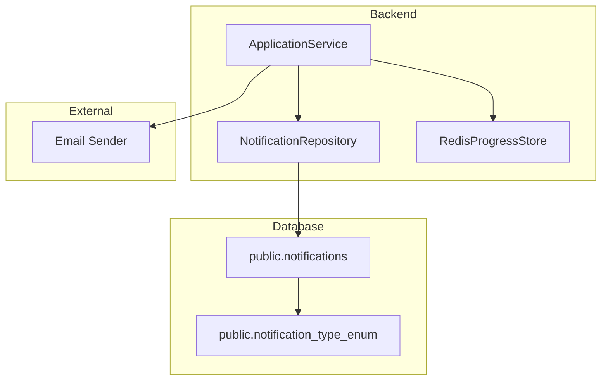
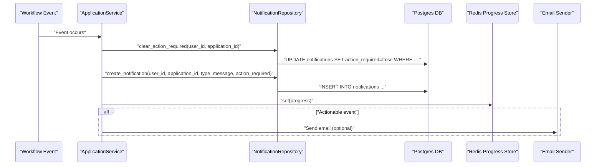
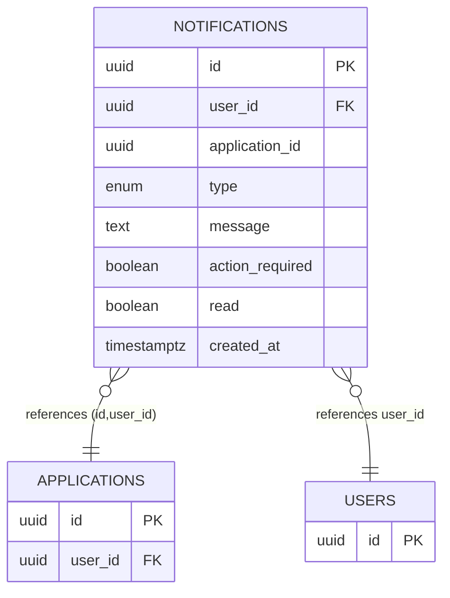
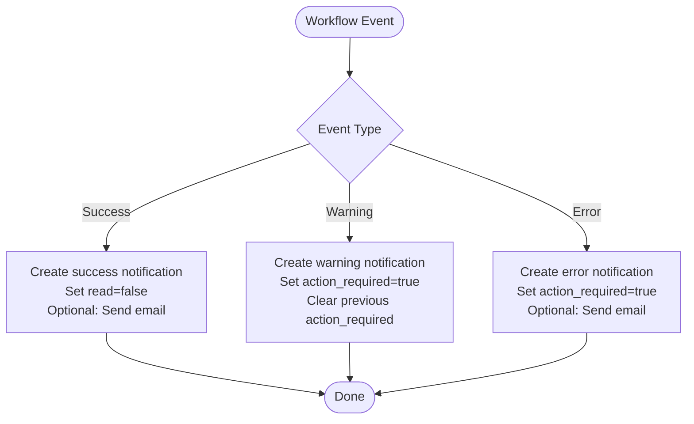
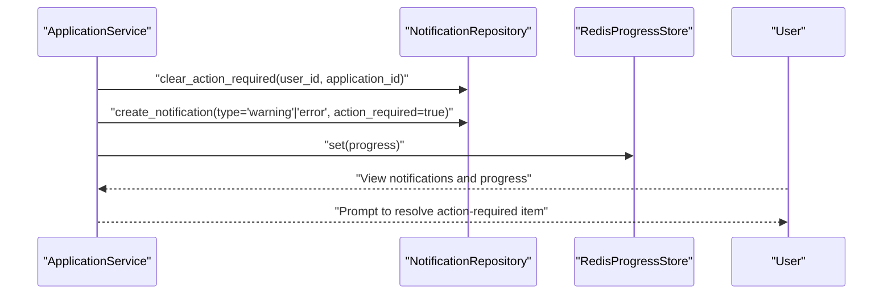
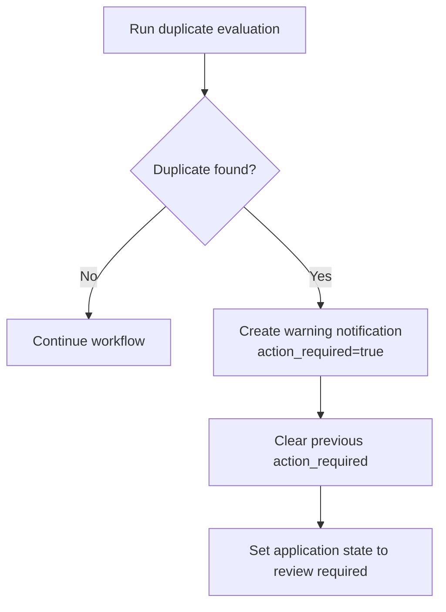
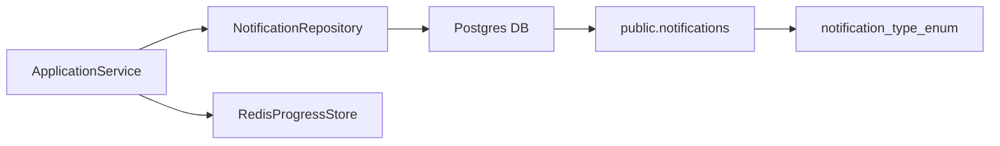

# Notification Model

<cite>
**Referenced Files in This Document**
- [notifications.py](file://backend/app/db/notifications.py)
- [20260407_000001_phase_0_foundation.sql](file://supabase/migrations/20260407_000001_phase_0_foundation.sql)
- [application_manager.py](file://backend/app/services/application_manager.py)
- [progress.py](file://backend/app/services/progress.py)
- [duplicates.py](file://backend/app/services/duplicates.py)
</cite>

## Table of Contents
1. [Introduction](#introduction)
2. [Project Structure](#project-structure)
3. [Core Components](#core-components)
4. [Architecture Overview](#architecture-overview)
5. [Detailed Component Analysis](#detailed-component-analysis)
6. [Dependency Analysis](#dependency-analysis)
7. [Performance Considerations](#performance-considerations)
8. [Troubleshooting Guide](#troubleshooting-guide)
9. [Conclusion](#conclusion)

## Introduction
This document describes the Notification model and its surrounding system for user communication and status updates. It covers the notification data structure, trigger conditions, message templates, repository operations, and integration with the progress tracking system. It also outlines how notifications inform users about workflow updates, how action-required indicators are managed, and how delivery reliability and user preferences are addressed conceptually.

## Project Structure
Notifications are implemented as a Postgres table with a dedicated Python repository and are consumed by the application workflow service. Progress updates are stored separately in Redis and surfaced alongside notifications to keep users informed of ongoing operations.

**Diagram sources**
- [notifications.py:11-60](file://backend/app/db/notifications.py#L11-L60)
- [20260407_000001_phase_0_foundation.sql:199-209](file://supabase/migrations/20260407_000001_phase_0_foundation.sql#L199-L209)
- [20260407_000001_phase_0_foundation.sql:69-70](file://supabase/migrations/20260407_000001_phase_0_foundation.sql#L69-L70)
- [progress.py:53-79](file://backend/app/services/progress.py#L53-L79)
- [application_manager.py:1347-1378](file://backend/app/services/application_manager.py#L1347-L1378)

**Section sources**
- [notifications.py:11-60](file://backend/app/db/notifications.py#L11-L60)
- [20260407_000001_phase_0_foundation.sql:199-209](file://supabase/migrations/20260407_000001_phase_0_foundation.sql#L199-L209)
- [progress.py:53-79](file://backend/app/services/progress.py#L53-L79)
- [application_manager.py:1347-1378](file://backend/app/services/application_manager.py#L1347-L1378)

## Core Components
- NotificationRepository: Provides methods to create notifications and clear action-required flags for a user and application.
- ApplicationService: Orchestrates workflow events and triggers notifications accordingly, including success, warning, and error notifications. It also manages action-required flags and optional email delivery.
- Progress tracking: Maintains human-readable progress messages and states in Redis, complementing notifications.
- Database schema: Defines the notifications table, enumeration of notification types, constraints, indexes, and row-level security policies.

Key responsibilities:
- Create notifications with type, message, and action-required flag.
- Clear action-required flags when appropriate.
- Integrate with progress store to keep users informed of ongoing work.
- Optionally send emails upon actionable events.

**Section sources**
- [notifications.py:11-60](file://backend/app/db/notifications.py#L11-L60)
- [application_manager.py:1347-1378](file://backend/app/services/application_manager.py#L1347-L1378)
- [progress.py:53-79](file://backend/app/services/progress.py#L53-L79)
- [20260407_000001_phase_0_foundation.sql:199-209](file://supabase/migrations/20260407_000001_phase_0_foundation.sql#L199-L209)

## Architecture Overview
The notification system is event-driven:
- Workflow events (e.g., successful generation, duplicate detection, failures) trigger notifications.
- Notifications are persisted to the database and optionally accompanied by email.
- Progress messages in Redis inform users about current state and estimated completion.
- Action-required flags indicate whether user intervention is needed.

**Diagram sources**
- [application_manager.py:702-711](file://backend/app/services/application_manager.py#L702-L711)
- [application_manager.py:1347-1378](file://backend/app/services/application_manager.py#L1347-L1378)
- [notifications.py:20-56](file://backend/app/db/notifications.py#L20-L56)
- [progress.py:67-74](file://backend/app/services/progress.py#L67-L74)

## Detailed Component Analysis

### Notification Data Model
The notification entity is represented as a table with the following attributes:
- id: UUID primary key
- user_id: References auth.users; links the notification to a user
- application_id: Optional reference to applications (with composite foreign key to applications)
- type: Enumerated type with values: info, success, warning, error
- message: Text content of the notification
- action_required: Boolean indicating if user action is required
- read: Boolean indicating if the notification was read
- created_at: Timestamp of creation

Constraints and indexes:
- Non-blank message check
- Composite foreign key ensuring referential integrity with applications and user ownership
- Indexes optimized for user-centric queries and unread actionable notifications
- Row-level security policy restricting access to the owning user

**Diagram sources**
- [20260407_000001_phase_0_foundation.sql:199-209](file://supabase/migrations/20260407_000001_phase_0_foundation.sql#L199-L209)
- [20260407_000001_phase_0_foundation.sql:211-218](file://supabase/migrations/20260407_000001_phase_0_foundation.sql#L211-L218)
- [20260407_000001_phase_0_foundation.sql:69-70](file://supabase/migrations/20260407_000001_phase_0_foundation.sql#L69-L70)

**Section sources**
- [20260407_000001_phase_0_foundation.sql:199-209](file://supabase/migrations/20260407_000001_phase_0_foundation.sql#L199-L209)
- [20260407_000001_phase_0_foundation.sql:211-218](file://supabase/migrations/20260407_000001_phase_0_foundation.sql#L211-L218)
- [20260407_000001_phase_0_foundation.sql:230-232](file://supabase/migrations/20260407_000001_phase_0_foundation.sql#L230-L232)
- [20260407_000001_phase_0_foundation.sql:336-340](file://supabase/migrations/20260407_000001_phase_0_foundation.sql#L336-L340)

### Notification Types and Priority Semantics
- info: General informational messages
- success: Positive outcomes (e.g., completion)
- warning: Advisory messages requiring attention (e.g., duplicates)
- error: Failure states requiring action (e.g., extraction or generation errors)

Priority is implicit in the type and action_required flag. action_required elevates priority by signaling user intervention is needed.

**Section sources**
- [20260407_000001_phase_0_foundation.sql:69-70](file://supabase/migrations/20260407_000001_phase_0_foundation.sql#L69-L70)
- [application_manager.py:1347-1378](file://backend/app/services/application_manager.py#L1347-L1378)

### Trigger Conditions and Workflows
Common triggers observed in the code:
- Successful resume generation: Creates a success notification and sends an email.
- PDF export completion: Creates a success notification.
- Export failure: Creates an error notification with action_required and optionally emails the user.
- Generation failure: Creates an error notification with action_required and emails the user.
- Duplicate detection: Creates a warning notification with action_required when duplicates are detected.
- Manual entry required: Creates an error notification with action_required and emails the user.

**Diagram sources**
- [application_manager.py:702-711](file://backend/app/services/application_manager.py#L702-L711)
- [application_manager.py:1140-1146](file://backend/app/services/application_manager.py#L1140-L1146)
- [application_manager.py:1164-1170](file://backend/app/services/application_manager.py#L1164-L1170)
- [application_manager.py:1317-1323](file://backend/app/services/application_manager.py#L1317-L1323)
- [application_manager.py:1262-1267](file://backend/app/services/application_manager.py#L1262-L1267)
- [application_manager.py:1288-1293](file://backend/app/services/application_manager.py#L1288-L1293)

**Section sources**
- [application_manager.py:702-711](file://backend/app/services/application_manager.py#L702-L711)
- [application_manager.py:1140-1146](file://backend/app/services/application_manager.py#L1140-L1146)
- [application_manager.py:1164-1170](file://backend/app/services/application_manager.py#L1164-L1170)
- [application_manager.py:1317-1323](file://backend/app/services/application_manager.py#L1317-L1323)
- [application_manager.py:1262-1267](file://backend/app/services/application_manager.py#L1262-L1267)
- [application_manager.py:1288-1293](file://backend/app/services/application_manager.py#L1288-L1293)

### Message Templates and Content
Templates are constructed in code and include:
- Success notifications: “Resume generation completed successfully.” or “PDF export completed successfully.”
- Error notifications: Dynamic messages reflecting the failure reason (e.g., extraction or generation failure).
- Warning notifications: “Possible duplicate application detected. Review before proceeding.”

These templates are concise, actionable, and optionally augmented with a link to the application page.

**Section sources**
- [application_manager.py:708-710](file://backend/app/services/application_manager.py#L708-L710)
- [application_manager.py:1144-1145](file://backend/app/services/application_manager.py#L1144-L1145)
- [application_manager.py:1265-1265](file://backend/app/services/application_manager.py#L1265-L1265)
- [application_manager.py:1172-1181](file://backend/app/services/application_manager.py#L1172-L1181)
- [application_manager.py:1322-1322](file://backend/app/services/application_manager.py#L1322-L1322)

### Notification Repository Operations
- create_notification(user_id, application_id, notification_type, message, action_required): Inserts a new notification with type casting to the enumeration and sets action_required appropriately.
- clear_action_required(user_id, application_id): Updates existing notifications to mark action_required as false for the given user and application.

These operations are transactional and commit immediately after execution.

**Section sources**
- [notifications.py:31-56](file://backend/app/db/notifications.py#L31-L56)
- [notifications.py:20-29](file://backend/app/db/notifications.py#L20-L29)

### Integration with Progress Tracking
Progress updates are stored in Redis keyed by application_id and include:
- job_id
- workflow_kind
- state
- message
- percent_complete
- timestamps

ApplicationService writes progress records alongside notifications to keep users informed of ongoing work. Users can correlate progress messages with notifications to understand the current state and next steps.

**Section sources**
- [progress.py:13-50](file://backend/app/services/progress.py#L13-L50)
- [progress.py:67-74](file://backend/app/services/progress.py#L67-L74)
- [application_manager.py:796-805](file://backend/app/services/application_manager.py#L796-L805)
- [application_manager.py:888-897](file://backend/app/services/application_manager.py#L888-L897)

### User Communication Workflows
- Unread actionable notifications are indexed for quick retrieval to surface urgent items to users.
- When action_required is true, the system clears prior action_required flags for the same user and application to avoid confusion.
- Optional email delivery augments notifications for critical events (e.g., manual entry required, generation failure).

**Diagram sources**
- [application_manager.py:1356-1366](file://backend/app/services/application_manager.py#L1356-L1366)
- [progress.py:67-74](file://backend/app/services/progress.py#L67-L74)

**Section sources**
- [application_manager.py:1356-1366](file://backend/app/services/application_manager.py#L1356-L1366)
- [application_manager.py:1367-1378](file://backend/app/services/application_manager.py#L1367-L1378)
- [progress.py:67-74](file://backend/app/services/progress.py#L67-L74)

### Duplicate Detection Alerts
The duplicate detection service computes similarity scores and match basis. When a high-confidence duplicate is found, the workflow transitions to a review state and creates a warning notification with action_required set to true. The system also clears previous action_required flags to ensure the latest prompt is visible.

**Diagram sources**
- [duplicates.py:83-183](file://backend/app/services/duplicates.py#L83-L183)
- [application_manager.py:1246-1267](file://backend/app/services/application_manager.py#L1246-L1267)

**Section sources**
- [duplicates.py:83-183](file://backend/app/services/duplicates.py#L83-L183)
- [application_manager.py:1246-1267](file://backend/app/services/application_manager.py#L1246-L1267)

### Examples of Notification Triggers
- Application status change: On successful resume generation, a success notification is created and an email is sent.
- Duplicate detection alert: On detecting a likely duplicate, a warning notification is created with action_required and the application state is updated to require review.
- System maintenance message: Conceptual placeholder—no explicit maintenance notifications are defined in the codebase.

Note: The codebase does not define a dedicated “maintenance” notification type. Maintenance-style communications would typically be implemented as info-type notifications if needed.

**Section sources**
- [application_manager.py:702-711](file://backend/app/services/application_manager.py#L702-L711)
- [application_manager.py:1262-1267](file://backend/app/services/application_manager.py#L1262-L1267)

## Dependency Analysis
- ApplicationService depends on NotificationRepository for persistence and on RedisProgressStore for progress visibility.
- NotificationRepository depends on the database connection and performs direct SQL operations.
- The notifications table references users and applications and enforces row-level security per user.

**Diagram sources**
- [application_manager.py:1520-1530](file://backend/app/services/application_manager.py#L1520-L1530)
- [notifications.py:11-18](file://backend/app/db/notifications.py#L11-L18)
- [20260407_000001_phase_0_foundation.sql:199-209](file://supabase/migrations/20260407_000001_phase_0_foundation.sql#L199-L209)

**Section sources**
- [application_manager.py:1520-1530](file://backend/app/services/application_manager.py#L1520-L1530)
- [notifications.py:11-18](file://backend/app/db/notifications.py#L11-L18)
- [20260407_000001_phase_0_foundation.sql:199-209](file://supabase/migrations/20260407_000001_phase_0_foundation.sql#L199-L209)

## Performance Considerations
- Indexes on user_id, read, and created_at facilitate efficient retrieval of notifications per user and unread actionable items.
- Using action_required=true and read=false filters reduces UI load by limiting the dataset.
- Progress messages in Redis minimize repeated database reads for status updates.
- Transactional inserts and updates ensure atomicity for notification state changes.

[No sources needed since this section provides general guidance]

## Troubleshooting Guide
- No notifications appear for a user:
  - Verify row-level security policy allows the authenticated user to access notifications.
  - Confirm the user_id matches the notification’s user_id.
- Action-required notifications not clearing:
  - Ensure clear_action_required is invoked before creating a new actionable notification for the same application.
- Excessive notifications:
  - Review triggers that set action_required and confirm they are gated by workflow state changes.
- Progress and notifications out of sync:
  - Confirm Redis progress store is updated concurrently with notification creation.

**Section sources**
- [20260407_000001_phase_0_foundation.sql:336-340](file://supabase/migrations/20260407_000001_phase_0_foundation.sql#L336-L340)
- [application_manager.py:1356-1366](file://backend/app/services/application_manager.py#L1356-L1366)
- [progress.py:67-74](file://backend/app/services/progress.py#L67-L74)

## Conclusion
The notification system provides a robust, event-driven mechanism for communicating application status and prompting user actions. It integrates tightly with workflow events, persists structured data with typed categories, and leverages progress tracking to keep users informed. Action-required flags and optional email delivery ensure critical issues receive attention. The design balances clarity, performance, and user control while maintaining strong data integrity and access controls.