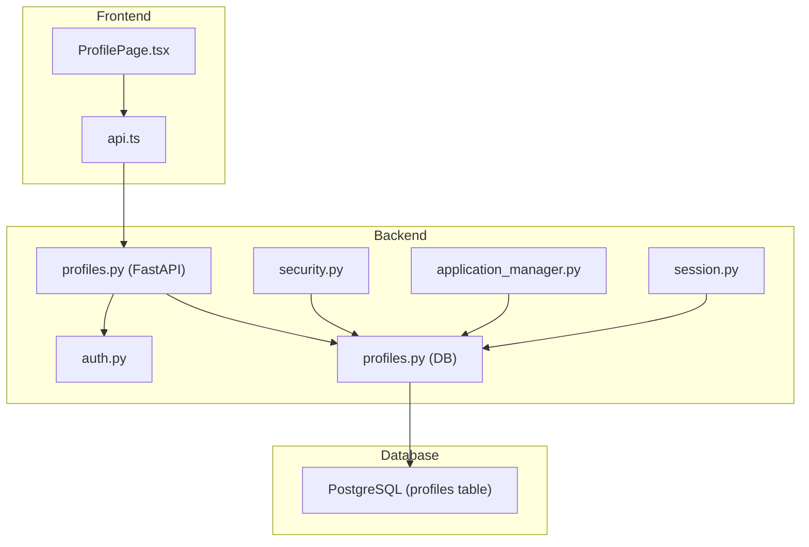
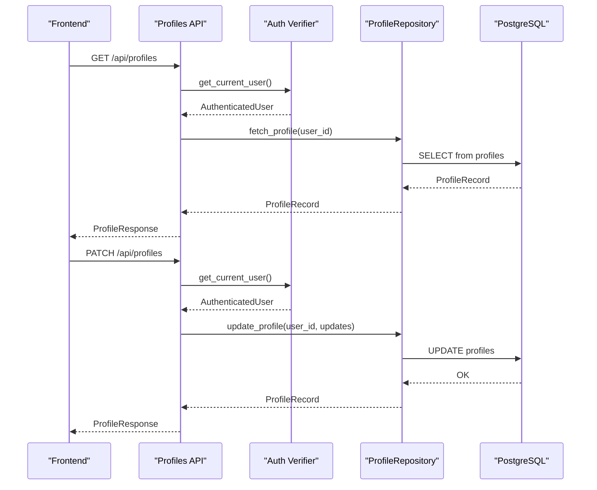
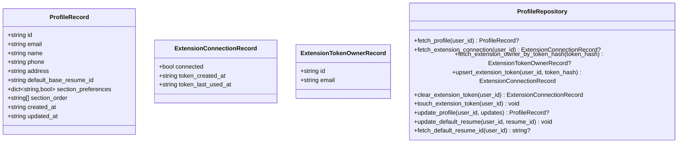
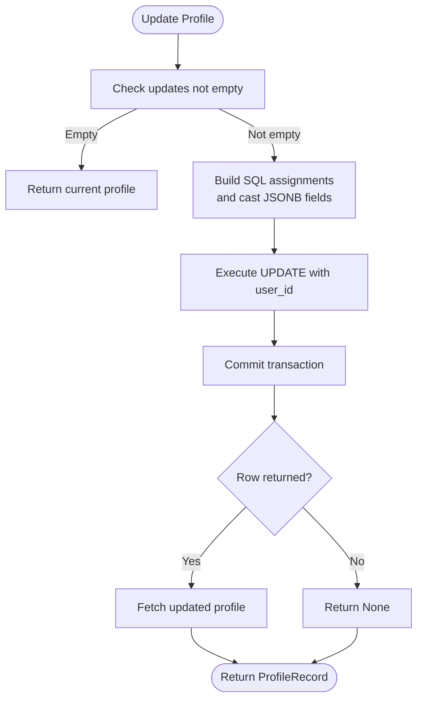
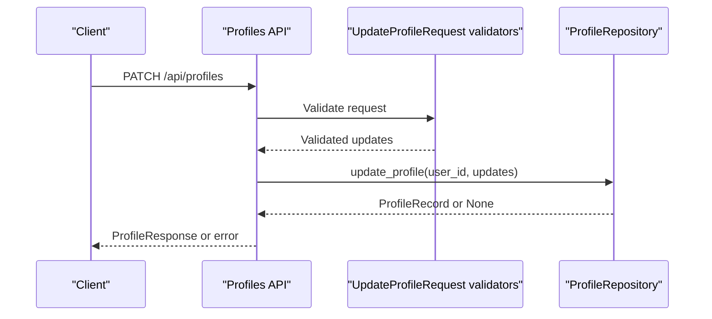
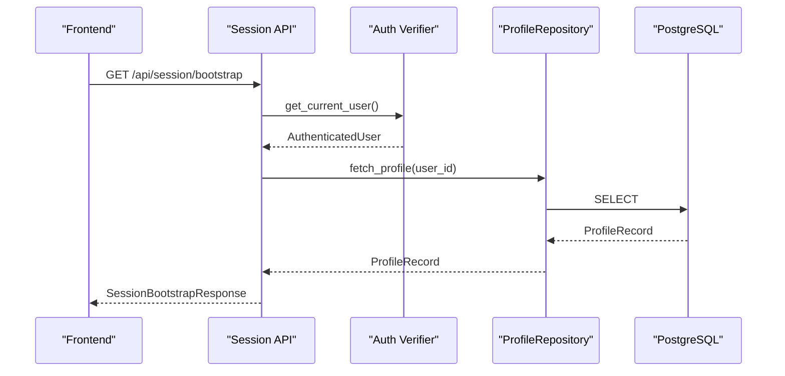
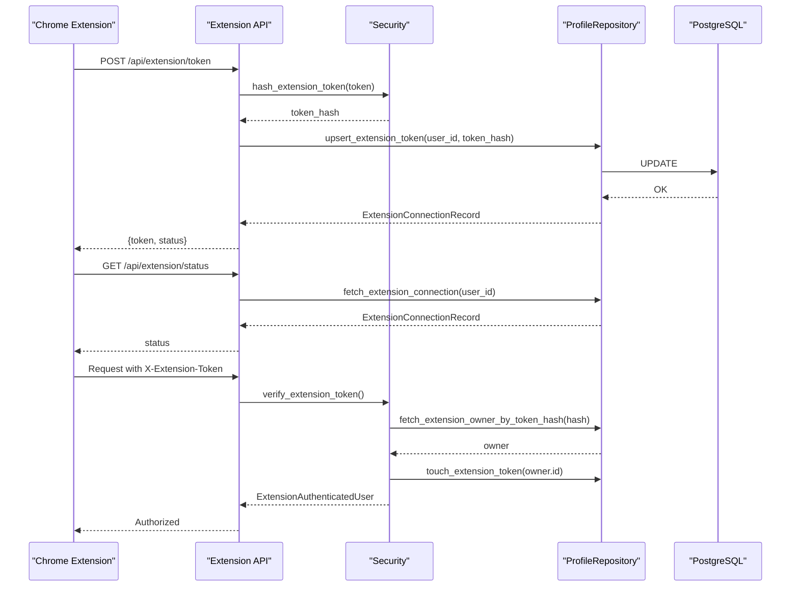
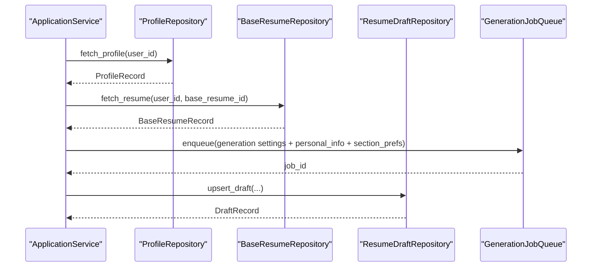
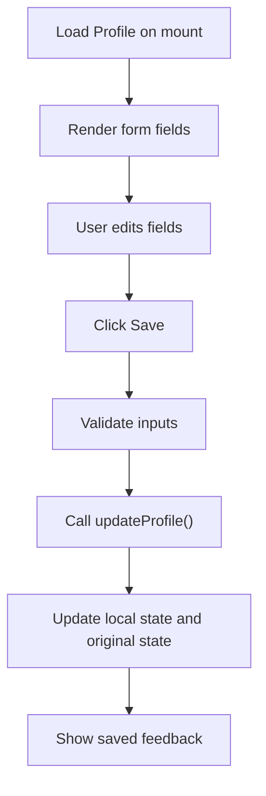
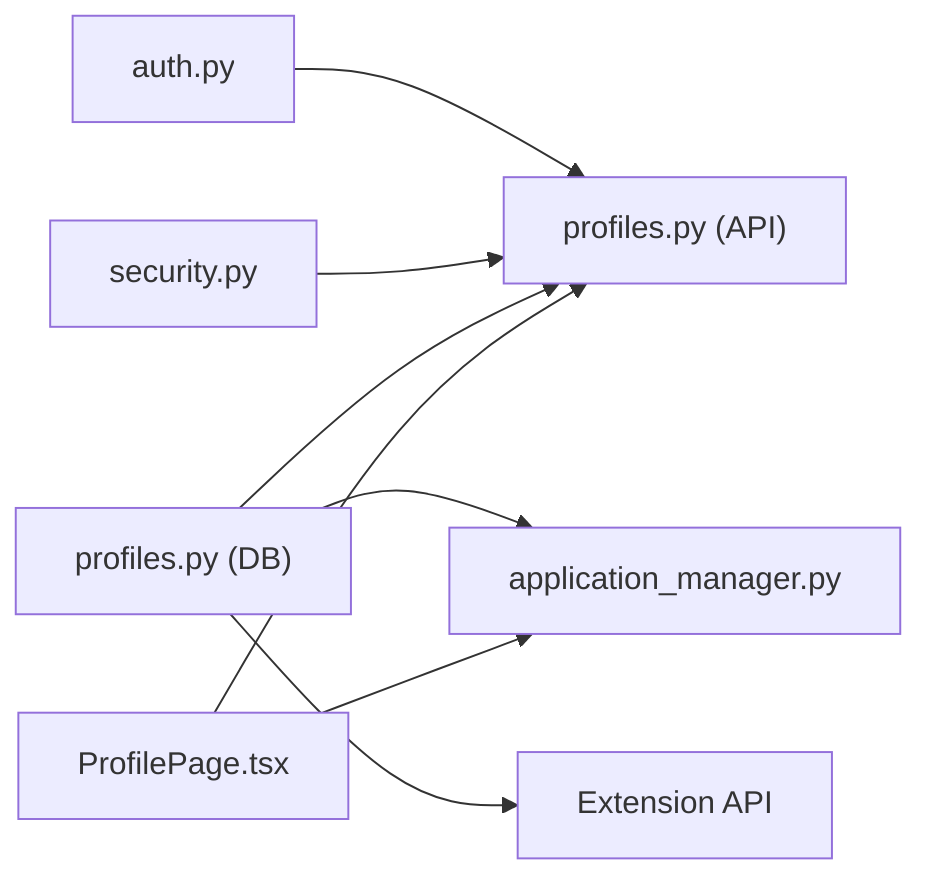

# Profile Model

<cite>
**Referenced Files in This Document**
- [profiles.py](file://backend/app/db/profiles.py)
- [profiles.py](file://backend/app/api/profiles.py)
- [auth.py](file://backend/app/core/auth.py)
- [security.py](file://backend/app/core/security.py)
- [database_schema.md](file://docs/database_schema.md)
- [phase_0_foundation.sql](file://supabase/migrations/20260407_000001_phase_0_foundation.sql)
- [phase_1a_blocked_recovery_extension.sql](file://supabase/migrations/20260407_000002_phase_1a_blocked_recovery_extension.sql)
- [application_manager.py](file://backend/app/services/application_manager.py)
- [ProfilePage.tsx](file://frontend/src/routes/ProfilePage.tsx)
- [api.ts](file://frontend/src/lib/api.ts)
- [session.py](file://backend/app/api/session.py)
</cite>

## Table of Contents
1. [Introduction](#introduction)
2. [Project Structure](#project-structure)
3. [Core Components](#core-components)
4. [Architecture Overview](#architecture-overview)
5. [Detailed Component Analysis](#detailed-component-analysis)
6. [Dependency Analysis](#dependency-analysis)
7. [Performance Considerations](#performance-considerations)
8. [Troubleshooting Guide](#troubleshooting-guide)
9. [Conclusion](#conclusion)

## Introduction
This document provides comprehensive data model documentation for the Profile entity and related user management functionality. It covers the profile data structure, authentication context, user preferences, repository operations, validation rules, and security considerations. It also explains how profiles influence application processing and integrates with the authentication system.

## Project Structure
The profile system spans backend database models, API endpoints, authentication, and frontend UI components. The backend defines the ProfileRecord and ProfileRepository, exposes profile endpoints, and integrates with Supabase authentication. The frontend provides a ProfilePage for editing personal information and section preferences.

**Diagram sources**
- [profiles.py:11-113](file://backend/app/api/profiles.py#L11-L113)
- [profiles.py:38-225](file://backend/app/db/profiles.py#L38-L225)
- [auth.py:15-90](file://backend/app/core/auth.py#L15-L90)
- [security.py:25-53](file://backend/app/core/security.py#L25-L53)
- [application_manager.py:538-547](file://backend/app/services/application_manager.py#L538-L547)
- [session.py:27-44](file://backend/app/api/session.py#L27-L44)

**Section sources**
- [profiles.py:14-24](file://backend/app/db/profiles.py#L14-L24)
- [profiles.py:16-64](file://backend/app/api/profiles.py#L16-L64)
- [database_schema.md:48-76](file://docs/database_schema.md#L48-L76)
- [phase_0_foundation.sql:86-97](file://supabase/migrations/20260407_000001_phase_0_foundation.sql#L86-L97)

## Core Components
- ProfileRecord: Defines the profile data structure returned by the repository.
- ProfileRepository: Encapsulates database operations for profile CRUD, extension token management, and default resume selection.
- Profile API: Exposes GET and PATCH endpoints for profile retrieval and updates with validation.
- Authentication: Provides AuthenticatedUser and token verification for API access.
- Security: Provides extension token hashing and verification for Chrome extension integration.
- Frontend ProfilePage: UI for editing personal information and section preferences.

**Section sources**
- [profiles.py:14-24](file://backend/app/db/profiles.py#L14-L24)
- [profiles.py:38-225](file://backend/app/db/profiles.py#L38-L225)
- [profiles.py:16-113](file://backend/app/api/profiles.py#L16-L113)
- [auth.py:15-90](file://backend/app/core/auth.py#L15-L90)
- [security.py:25-53](file://backend/app/core/security.py#L25-L53)
- [ProfilePage.tsx:17-264](file://frontend/src/routes/ProfilePage.tsx#L17-L264)

## Architecture Overview
The profile system integrates authentication, repository operations, and application processing. Authentication ensures requests are made by the correct user. The repository encapsulates database access and maintains ownership boundaries. Application services consume profile data to personalize resume generation.

**Diagram sources**
- [profiles.py:77-113](file://backend/app/api/profiles.py#L77-L113)
- [auth.py:72-90](file://backend/app/core/auth.py#L72-L90)
- [profiles.py:47-68](file://backend/app/db/profiles.py#L47-L68)
- [profiles.py:158-188](file://backend/app/db/profiles.py#L158-L188)

## Detailed Component Analysis

### Profile Data Model
The profile data model consists of personal information fields, authentication context mirroring, user preferences, and timestamps. The repository returns a typed ProfileRecord, and the API validates and responds with a ProfileResponse.

- Personal information fields: id, email, name, phone, address.
- Authentication context: email mirrors Supabase auth; used for queries and UI display.
- User preferences: section_preferences (JSONB map) and section_order (JSONB array).
- Default base resume: default_base_resume_id (UUID).
- Extension token fields: extension_token_hash, extension_token_created_at, extension_token_last_used_at.
- Timestamps: created_at, updated_at.

**Diagram sources**
- [profiles.py:14-36](file://backend/app/db/profiles.py#L14-L36)
- [profiles.py:38-225](file://backend/app/db/profiles.py#L38-L225)

**Section sources**
- [profiles.py:14-24](file://backend/app/db/profiles.py#L14-L24)
- [database_schema.md:48-76](file://docs/database_schema.md#L48-L76)
- [phase_0_foundation.sql:86-97](file://supabase/migrations/20260407_000001_phase_0_foundation.sql#L86-L97)

### Profile Repository Operations
- Fetch profile: Retrieves a user’s profile by ID.
- Extension connection: Checks if an extension token is set and returns timestamps.
- Token owner lookup: Resolves a hashed token to the profile owner.
- Upsert extension token: Issues a new token by storing a hashed value and resets usage timestamps.
- Clear extension token: Removes the token and resets timestamps.
- Touch extension token: Updates the last-used timestamp when the extension uses the token.
- Update profile: Applies selective updates to profile fields, casting JSONB fields appropriately.
- Default resume: Sets or clears the default base resume pointer.

**Diagram sources**
- [profiles.py:158-188](file://backend/app/db/profiles.py#L158-L188)
- [profiles.py:190-194](file://backend/app/db/profiles.py#L190-L194)

**Section sources**
- [profiles.py:47-68](file://backend/app/db/profiles.py#L47-L68)
- [profiles.py:70-99](file://backend/app/db/profiles.py#L70-L99)
- [profiles.py:101-156](file://backend/app/db/profiles.py#L101-L156)
- [profiles.py:158-220](file://backend/app/db/profiles.py#L158-L220)

### Profile API Endpoints and Validation
- GET /api/profiles: Returns the authenticated user’s profile.
- PATCH /api/profiles: Updates profile fields with validation:
  - name, phone, address are trimmed and normalized to None if empty.
  - section_preferences keys must be from the allowed set.
  - section_order must contain only allowed values and must not have duplicates.
- Error mapping: Converts repository exceptions to HTTP status codes.

**Diagram sources**
- [profiles.py:77-113](file://backend/app/api/profiles.py#L77-L113)
- [profiles.py:16-51](file://backend/app/api/profiles.py#L16-L51)

**Section sources**
- [profiles.py:77-113](file://backend/app/api/profiles.py#L77-L113)
- [profiles.py:16-51](file://backend/app/api/profiles.py#L16-L51)

### Authentication Context and Access Control
- AuthenticatedUser: Carries user identity, email, role, and raw claims.
- get_current_user: Extracts and verifies the Bearer token against Supabase JWKS or secret.
- RLS policies: Enforce per-user ownership on profiles and related tables.
- Session bootstrap: Returns user and profile data on initial load.

**Diagram sources**
- [session.py:27-44](file://backend/app/api/session.py#L27-L44)
- [auth.py:72-90](file://backend/app/core/auth.py#L72-L90)
- [profiles.py:47-68](file://backend/app/db/profiles.py#L47-L68)

**Section sources**
- [auth.py:15-90](file://backend/app/core/auth.py#L15-L90)
- [session.py:27-44](file://backend/app/api/session.py#L27-L44)
- [phase_0_foundation.sql:296-316](file://supabase/migrations/20260407_000001_phase_0_foundation.sql#L296-L316)

### Extension Token Management and Security
- Hashing: Extension tokens are hashed server-side; only the hash is stored.
- Verification: Extension requests include X-Extension-Token; verified by matching the hash.
- Lifecycle: Issue, revoke, and status endpoints manage token lifecycle.
- Usage tracking: touch_extension_token updates last-used timestamp.

**Diagram sources**
- [security.py:30-53](file://backend/app/core/security.py#L30-L53)
- [profiles.py:101-156](file://backend/app/db/profiles.py#L101-L156)
- [profiles.py:86-99](file://backend/app/db/profiles.py#L86-L99)
- [profiles.py:147-156](file://backend/app/db/profiles.py#L147-L156)

**Section sources**
- [security.py:30-53](file://backend/app/core/security.py#L30-L53)
- [profiles.py:86-156](file://backend/app/db/profiles.py#L86-L156)
- [phase_1a_blocked_recovery_extension.sql:3-10](file://supabase/migrations/20260407_000002_phase_1a_blocked_recovery_extension.sql#L3-L10)

### Profile Usage in Application Processing
Profile preferences influence resume generation:
- Personal information: name, email, phone, address are passed to generation.
- Section preferences: section_preferences and section_order drive which sections are included and their order.
- Default base resume: default_base_resume_id determines which base resume is used for generation.

**Diagram sources**
- [application_manager.py:538-547](file://backend/app/services/application_manager.py#L538-L547)
- [application_manager.py:556-584](file://backend/app/services/application_manager.py#L556-L584)
- [application_manager.py:674-680](file://backend/app/services/application_manager.py#L674-L680)

**Section sources**
- [application_manager.py:538-547](file://backend/app/services/application_manager.py#L538-L547)
- [application_manager.py:556-584](file://backend/app/services/application_manager.py#L556-L584)
- [application_manager.py:674-680](file://backend/app/services/application_manager.py#L674-L680)

### Frontend Profile Management
The ProfilePage component:
- Loads profile data on mount.
- Allows editing name, phone, address, section preferences, and section order.
- Saves changes via authenticated API calls.
- Tracks dirty state and displays feedback.

**Diagram sources**
- [ProfilePage.tsx:36-124](file://frontend/src/routes/ProfilePage.tsx#L36-L124)
- [api.ts:401-410](file://frontend/src/lib/api.ts#L401-L410)

**Section sources**
- [ProfilePage.tsx:36-124](file://frontend/src/routes/ProfilePage.tsx#L36-L124)
- [api.ts:401-410](file://frontend/src/lib/api.ts#L401-L410)

## Dependency Analysis
- Profiles depend on Supabase auth for identity and RLS for ownership.
- ApplicationService depends on ProfileRepository to fetch personal info and preferences.
- Extension integration depends on ProfileRepository and security utilities for token management.
- Frontend depends on authenticated API calls for profile operations.

**Diagram sources**
- [auth.py:72-90](file://backend/app/core/auth.py#L72-L90)
- [profiles.py:8-9](file://backend/app/api/profiles.py#L8-L9)
- [profiles.py:38-225](file://backend/app/db/profiles.py#L38-L225)
- [application_manager.py:143-168](file://backend/app/services/application_manager.py#L143-L168)
- [security.py:34-53](file://backend/app/core/security.py#L34-L53)
- [ProfilePage.tsx:6-6](file://frontend/src/routes/ProfilePage.tsx#L6-L6)

**Section sources**
- [profiles.py:38-225](file://backend/app/db/profiles.py#L38-L225)
- [application_manager.py:143-168](file://backend/app/services/application_manager.py#L143-L168)
- [security.py:34-53](file://backend/app/core/security.py#L34-L53)

## Performance Considerations
- JSONB fields: section_preferences and section_order are stored as JSONB; ensure appropriate indexing and validation to minimize overhead.
- RLS checks: Ownership enforcement occurs at the database level; ensure policies are efficient and avoid unnecessary scans.
- Token hashing: SHA-256 hashing is constant-time and safe for token storage.
- Batch updates: Prefer single PATCH requests to reduce round-trips.

## Troubleshooting Guide
Common issues and resolutions:
- Missing or invalid bearer token: Ensure Authorization header is present and valid.
- Profile not found: Verify the authenticated user has a profile row; bootstrap session endpoint returns an error if unavailable.
- Invalid section preferences or order: Ensure keys/values match allowed sets and order contains no duplicates.
- Extension token errors: Confirm token is hashed before storage and that the extension sends X-Extension-Token with each request.

**Section sources**
- [auth.py:72-90](file://backend/app/core/auth.py#L72-L90)
- [profiles.py:67-74](file://backend/app/api/profiles.py#L67-L74)
- [profiles.py:101-122](file://backend/app/db/profiles.py#L101-L122)
- [security.py:34-53](file://backend/app/core/security.py#L34-L53)

## Conclusion
The profile system provides a robust foundation for personal information and user preferences, integrating tightly with authentication and application workflows. The repository encapsulates data access and ownership, while the API enforces validation and error mapping. Extension token management adds secure integration capabilities, and frontend components offer a user-friendly interface for profile maintenance.