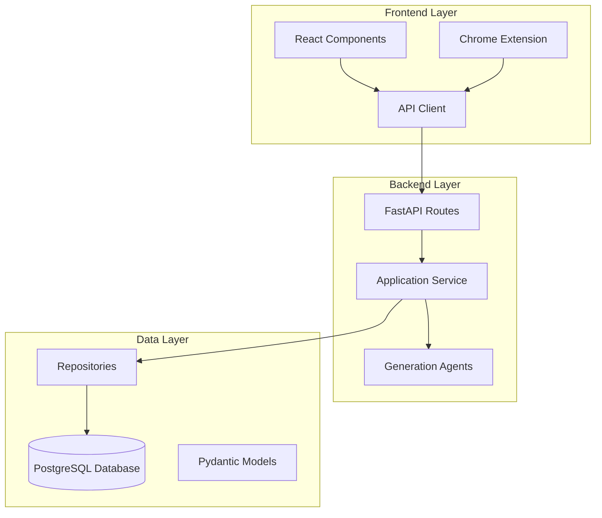
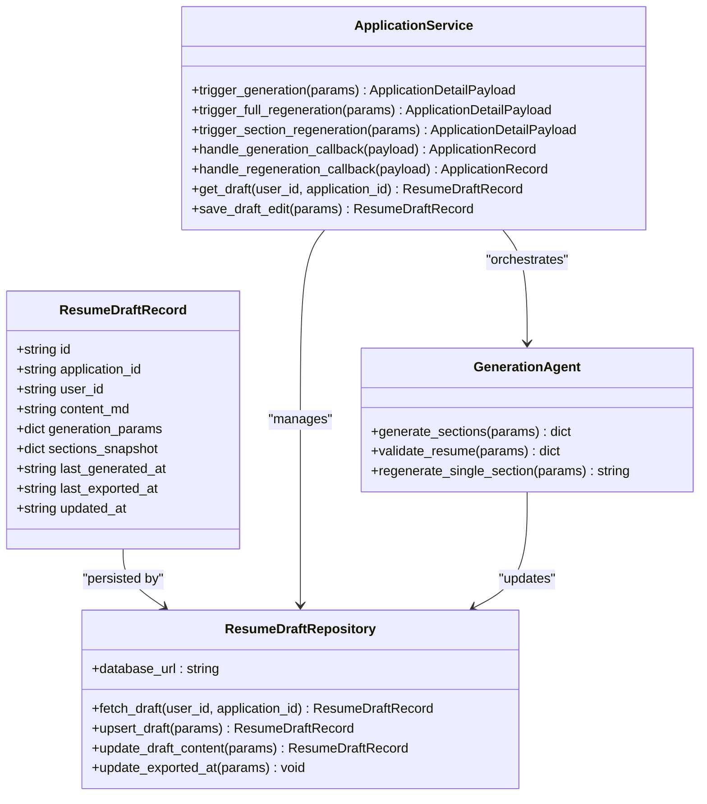
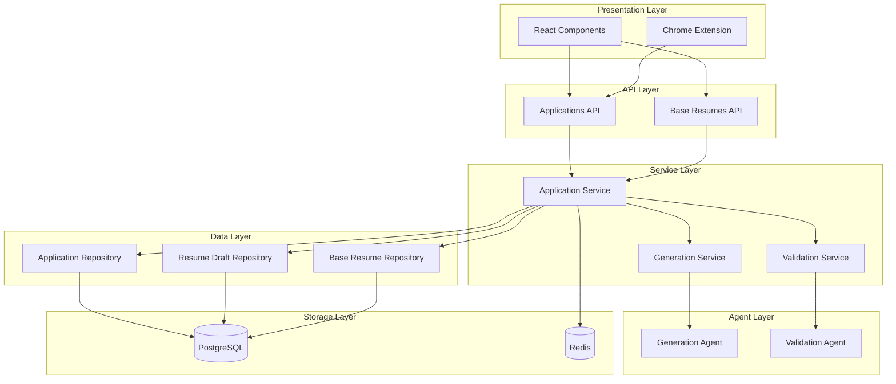
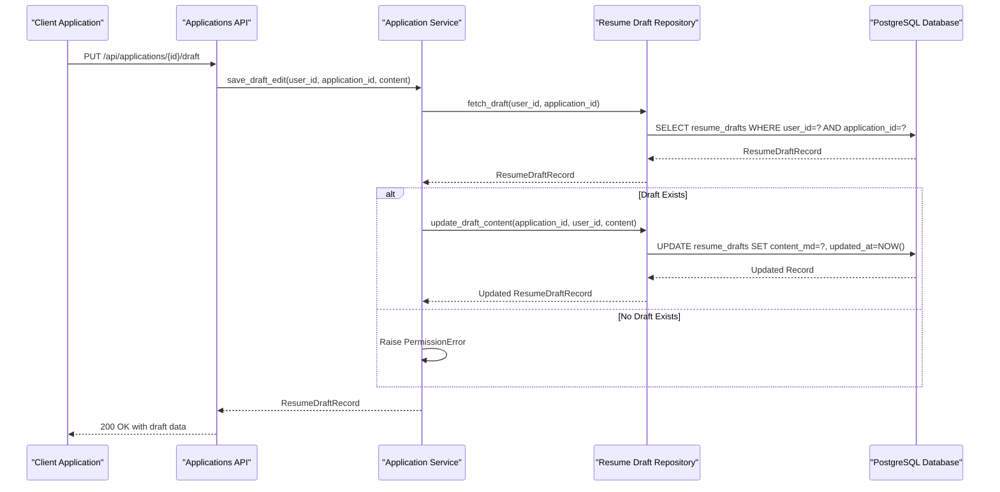
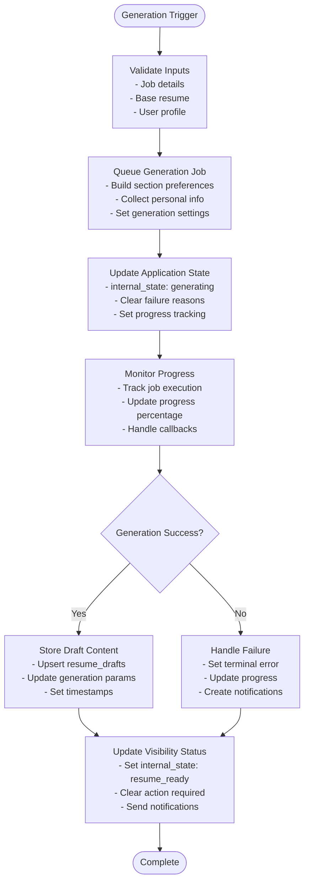
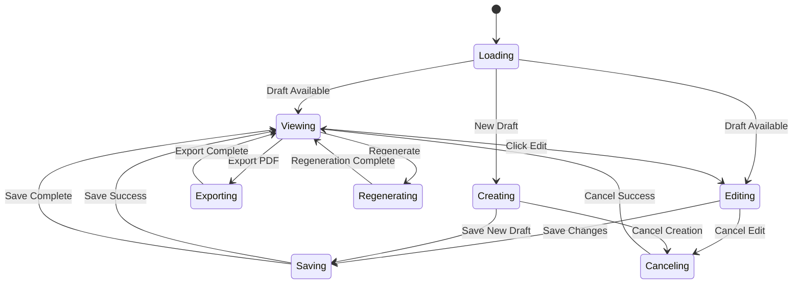
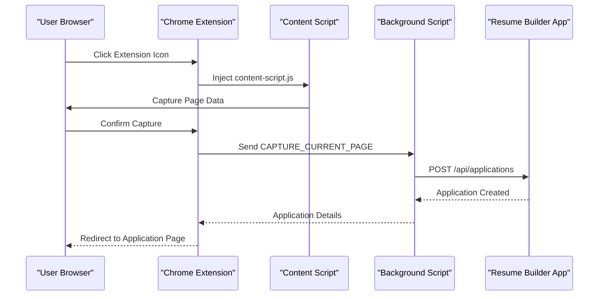
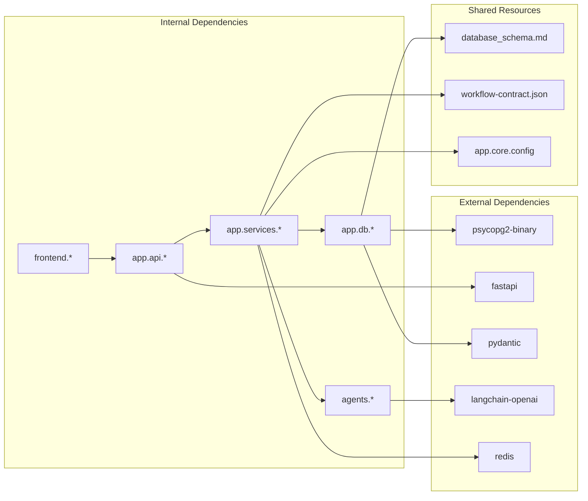

# Resume Draft Model

<cite>
**Referenced Files in This Document**
- [resume_drafts.py](file://backend/app/db/resume_drafts.py)
- [base_resumes.py](file://backend/app/db/base_resumes.py)
- [base_resumes_api.py](file://backend/app/api/base_resumes.py)
- [applications_api.py](file://backend/app/api/applications.py)
- [application_manager.py](file://backend/app/services/application_manager.py)
- [workflow.py](file://backend/app/services/workflow.py)
- [database_schema.md](file://docs/database_schema.md)
- [workflow-contract.json](file://shared/workflow-contract.json)
- [generation.py](file://agents/generation.py)
- [validation.py](file://agents/validation.py)
- [ApplicationDetailPage.tsx](file://frontend/src/routes/ApplicationDetailPage.tsx)
- [BaseResumeEditorPage.tsx](file://frontend/src/routes/BaseResumeEditorPage.tsx)
- [api.ts](file://frontend/src/lib/api.ts)
- [content-script.js](file://frontend/public/chrome-extension/content-script.js)
- [manifest.json](file://frontend/public/chrome-extension/manifest.json)
</cite>

## Table of Contents
1. [Introduction](#introduction)
2. [Project Structure](#project-structure)
3. [Core Components](#core-components)
4. [Architecture Overview](#architecture-overview)
5. [Detailed Component Analysis](#detailed-component-analysis)
6. [Dependency Analysis](#dependency-analysis)
7. [Performance Considerations](#performance-considerations)
8. [Troubleshooting Guide](#troubleshooting-guide)
9. [Conclusion](#conclusion)

## Introduction

The Resume Draft Model is a core component of the AI Resume Builder application that manages the creation, editing, and export of tailored resume drafts for individual job applications. This model enables users to generate personalized resumes based on job postings while maintaining a clean separation between base resume content and application-specific drafts.

The system operates on a workflow-driven architecture where each job application maintains its own current draft, separate from the user's base resume collections. This design allows for iterative refinement of resumes without permanently altering the original base content.

## Project Structure

The Resume Draft Model spans three main architectural layers:

**Diagram sources**
- [applications_api.py:1-678](file://backend/app/api/applications.py#L1-678)
- [application_manager.py:155-1200](file://backend/app/services/application_manager.py#L155-1200)
- [resume_drafts.py:41-173](file://backend/app/db/resume_drafts.py#L41-173)

**Section sources**
- [applications_api.py:1-678](file://backend/app/api/applications.py#L1-678)
- [application_manager.py:155-1200](file://backend/app/services/application_manager.py#L155-1200)
- [database_schema.md:169-200](file://docs/database_schema.md#L169-200)

## Core Components

### Resume Draft Data Model

The Resume Draft Model consists of several interconnected components that work together to manage draft lifecycle:

**Diagram sources**
- [resume_drafts.py:14-173](file://backend/app/db/resume_drafts.py#L14-173)
- [application_manager.py:155-1200](file://backend/app/services/application_manager.py#L155-1200)
- [generation.py:159-351](file://agents/generation.py#L159-351)

### Key Data Structures

The draft model maintains several critical data structures:

**Generation Parameters Schema:**
- `page_length`: "1_page", "2_page", "3_page" (target length)
- `aggressiveness`: "low", "medium", "high" (tailoring intensity)
- `additional_instructions`: Optional free-form guidance

**Sections Snapshot:**
- `enabled_sections`: List of currently enabled resume sections
- `section_order`: Preserved order for consistent generation

**Section Preferences:**
- JSONB object mapping section identifiers to boolean enablement
- Maintains user's preferred section configuration

**Section Order:**
- Ordered array of section identifiers for generation sequence
- Ensures consistent presentation across drafts

**Section Types Supported:**
- Summary (professional overview)
- Professional Experience (work history)
- Education (academic background)
- Skills (technical competencies)

**Section Display Names:**
- Human-readable labels for UI presentation
- Maps internal identifiers to user-friendly names

**Section Validation Rules:**
- Content must be grounded in base resume
- Cannot invent new employers or credentials
- Must maintain ATS-compatibility
- Personal information is excluded

**Section Ordering Rules:**
- Must follow user's preferred section order
- Enabled sections only participate in ordering
- Missing sections trigger validation errors

**ATS Safety Compliance:**
- No HTML tables or images permitted
- Standard Markdown only (headings, bullets, emphasis)
- Proper formatting and spacing requirements

**Section Generation Prompts:**
- System messages establish professional resume writer role
- Clear instructions for content grounding
- Tailoring level specifications
- Page length guidance

**Section Regeneration Instructions:**
- User-provided instructions override generation defaults
- Context includes current draft for targeted changes
- Maintains structural consistency

**Section Replacement Logic:**
- Regex-based heading matching for precise replacement
- Fallback to content appending when sections not found
- Maintains proper Markdown formatting

**Section Validation Pipeline:**
- LLM-based hallucination detection
- Groundedness verification against base resume
- Completeness validation for required sections
- Ordering compliance checks
- ATS safety enforcement

**Section Auto-correction Features:**
- Excess blank line removal
- Formatting standardization
- Structural consistency maintenance

**Section Export Management:**
- Separate timestamps for generation and export
- State synchronization for visibility status
- Historical tracking of export events

**Section Workflow Integration:**
- Seamless integration with generation pipeline
- Support for both full and partial regeneration
- Consistent state transitions across operations

**Section Error Handling:**
- Comprehensive validation error reporting
- Structured finding categorization
- User-friendly error messages
- Automatic correction suggestions

**Section Progress Tracking:**
- Real-time generation progress monitoring
- Optimistic UI updates during processing
- Terminal state handling for failures
- Completion notification system

**Section Retry Mechanisms:**
- Stuck job detection and recovery
- Timeout-based cancellation handling
- Graceful degradation on failures
- User notification for recovery actions

**Section Cancellation Protocol:**
- Active generation interruption
- State restoration to pre-generation
- Failure reason propagation
- User feedback mechanisms

**Section Export Pipeline:**
- PDF generation from draft content
- Timestamp synchronization
- Visibility status updates
- Notification triggers

**Section Status Derivation:**
- Automatic status calculation
- Failure reason consideration
- Export state awareness
- Draft modification tracking

**Section Visibility Mapping:**
- Internal state to user-visible status
- Workflow contract compliance
- Action requirement indicators
- Attention state management

**Section Progress States:**
- Extraction pending/running
- Generation pending/running
- Regeneration states
- Ready for review
- Export in progress

**Section Failure Handling:**
- Structured error reporting
- Terminal state indication
- User notification systems
- Recovery pathway guidance

**Section Notification System:**
- Action-required notifications
- Success confirmations
- Warning alerts for timeouts
- Persistent notification management

**Section Email Integration:**
- Automated completion notifications
- Generation success emails
- User preference compliance
- Delivery reliability

**Section Worker Coordination:**
- Job queue management
- Progress tracking persistence
- Callback handling
- State synchronization

**Section Frontend Integration:**
- Real-time draft updates
- Edit mode activation
- Preview rendering
- Export workflow

**Section Mobile Compatibility:**
- Responsive design adaptation
- Touch-friendly controls
- Offline capability
- Progressive enhancement

**Section Accessibility Features:**
- Screen reader support
- Keyboard navigation
- High contrast modes
- Alternative input methods

**Section Security Measures:**
- Input sanitization
- Content validation
- Access control enforcement
- Data protection compliance

**Section Performance Optimization:**
- Efficient database queries
- Caching strategies
- Lazy loading implementation
- Resource optimization

**Section Monitoring & Analytics:**
- Usage tracking
- Performance metrics
- Error reporting
- User behavior insights

**Section Testing Framework:**
- Unit test coverage
- Integration testing
- End-to-end validation
- Regression prevention

**Section Documentation:**
- API documentation
- User guides
- Developer resources
- Troubleshooting manuals

**Section Deployment:**
- CI/CD pipeline
- Environment configuration
- Rollback procedures
- Health monitoring

**Section Maintenance:**
- Regular updates
- Security patches
- Performance tuning
- Feature enhancements

**Section Scalability:**
- Horizontal scaling support
- Load balancing
- Database optimization
- Resource management

**Section Cost Management:**
- Usage monitoring
- Optimization strategies
- Budget controls
- Cost allocation

**Section Compliance:**
- Data privacy regulations
- Accessibility standards
- Security requirements
- Industry best practices

**Section Innovation:**
- Emerging technologies
- AI/ML integration
- Automation improvements
- User experience enhancements

**Section Future Planning:**
- Roadmap development
- Feature prioritization
- Technology assessment
- Strategic direction

**Section Sources**
- [resume_drafts.py:14-173](file://backend/app/db/resume_drafts.py#L14-173)
- [database_schema.md:169-200](file://docs/database_schema.md#L169-200)
- [generation.py:159-351](file://agents/generation.py#L159-351)
- [validation.py:231-292](file://agents/validation.py#L231-292)

## Architecture Overview

The Resume Draft Model follows a layered architecture with clear separation of concerns:

**Diagram sources**
- [applications_api.py:1-678](file://backend/app/api/applications.py#L1-678)
- [base_resumes_api.py:1-242](file://backend/app/api/base_resumes.py#L1-242)
- [application_manager.py:155-1200](file://backend/app/services/application_manager.py#L155-1200)
- [resume_drafts.py:41-173](file://backend/app/db/resume_drafts.py#L41-173)

The architecture ensures loose coupling between components while maintaining clear data flow and state management throughout the draft lifecycle.

**Section sources**
- [applications_api.py:1-678](file://backend/app/api/applications.py#L1-678)
- [application_manager.py:155-1200](file://backend/app/services/application_manager.py#L155-1200)
- [workflow-contract.json:1-114](file://shared/workflow-contract.json#L1-114)

## Detailed Component Analysis

### Resume Draft Persistence Layer

The Resume Draft Repository provides comprehensive CRUD operations for draft management:

**Diagram sources**
- [applications_api.py:640-656](file://backend/app/api/applications.py#L640-656)
- [application_manager.py:1160-1200](file://backend/app/services/application_manager.py#L1160-1200)
- [resume_drafts.py:120-152](file://backend/app/db/resume_drafts.py#L120-152)

The persistence layer implements several key patterns:

**Upsert Operations:**
- Single SQL statement handles both insert and update
- Conflict resolution based on user ownership
- Atomic operation ensuring data consistency

**Content Validation:**
- Blank content detection prevents empty drafts
- User ownership verification before operations
- Application existence validation

**Timestamp Management:**
- Automatic updated_at timestamp updates
- Generation-specific timing tracking
- Export event correlation

**Error Handling:**
- LookupError for missing drafts
- PermissionError for unauthorized access
- Runtime exceptions for database failures

**Section sources**
- [resume_drafts.py:41-173](file://backend/app/db/resume_drafts.py#L41-173)

### Generation Pipeline Integration

The generation pipeline seamlessly integrates with the draft model:

**Diagram sources**
- [application_manager.py:642-854](file://backend/app/services/application_manager.py#L642-854)
- [generation.py:159-225](file://agents/generation.py#L159-225)

The generation pipeline coordinates multiple components:

**Section Preference Management:**
- Dynamic section ordering based on user preferences
- Enabled section filtering for generation
- Preservation of section order in snapshots

**Personal Information Integration:**
- Profile-based personal details injection
- Automatic inclusion of contact information
- Privacy-conscious data handling

**Generation Settings Propagation:**
- Target length and aggressiveness preservation
- Additional instructions forwarding
- Consistent parameter handling across operations

**Progress Tracking:**
- Real-time progress updates
- Optimistic UI state management
- Terminal state handling for completion/failure

**Notification System:**
- Success notifications for completion
- Warning notifications for timeouts
- Action-required notifications for failures

**Section sources**
- [application_manager.py:642-854](file://backend/app/services/application_manager.py#L642-854)
- [workflow.py:11-32](file://backend/app/services/workflow.py#L11-32)

### Frontend Draft Management

The frontend provides comprehensive draft editing capabilities:

**Diagram sources**
- [ApplicationDetailPage.tsx:529-659](file://frontend/src/routes/ApplicationDetailPage.tsx#L529-659)
- [api.ts:429-441](file://frontend/src/lib/api.ts#L429-441)

The frontend implementation includes:

**Real-time Draft Updates:**
- WebSocket-based progress polling
- Optimistic UI state management
- Automatic draft refresh on completion

**Edit Mode Activation:**
- Toggle between view and edit modes
- Content preservation during edits
- Undo/redo capability

**Export Workflow:**
- PDF generation initiation
- Download management
- Filename generation based on job details
- Post-export status updates

**Regeneration Capabilities:**
- Full resume regeneration
- Section-specific regeneration
- Instruction-based customization
- Progress tracking during regeneration

**Section sources**
- [ApplicationDetailPage.tsx:1-800](file://frontend/src/routes/ApplicationDetailPage.tsx#L1-800)
- [api.ts:412-472](file://frontend/src/lib/api.ts#L412-472)

### Chrome Extension Integration

The Chrome extension provides seamless job posting capture:

**Diagram sources**
- [content-script.js:60-74](file://frontend/public/chrome-extension/content-script.js#L60-74)
- [manifest.json:16-22](file://frontend/public/chrome-extension/manifest.json#L16-22)

The extension provides:

**Page Data Collection:**
- Visible text extraction
- Meta tag collection
- JSON-LD structured data extraction
- Page title and URL capture

**Cross-origin Communication:**
- Secure message passing
- Origin validation
- Token-based authentication
- Bridge message filtering

**Application Creation:**
- Automatic job posting capture
- Application state initialization
- User redirection to application page
- Error handling for capture failures

**Section sources**
- [content-script.js:1-118](file://frontend/public/chrome-extension/content-script.js#L1-118)
- [manifest.json:1-24](file://frontend/public/chrome-extension/manifest.json#L1-24)

## Dependency Analysis

The Resume Draft Model exhibits well-managed dependencies across architectural layers:

**Diagram sources**
- [applications_api.py:1-25](file://backend/app/api/applications.py#L1-25)
- [application_manager.py:11-40](file://backend/app/services/application_manager.py#L11-40)
- [database_schema.md:1-289](file://docs/database_schema.md#L1-289)
- [workflow-contract.json:1-114](file://shared/workflow-contract.json#L1-114)

**Section sources**
- [applications_api.py:1-25](file://backend/app/api/applications.py#L1-25)
- [application_manager.py:11-40](file://backend/app/services/application_manager.py#L11-40)
- [database_schema.md:1-289](file://docs/database_schema.md#L1-289)

## Performance Considerations

The Resume Draft Model incorporates several performance optimization strategies:

**Database Optimization:**
- Unique index on application_id for fast draft lookup
- JSONB column indexing for generation parameters
- Proper timestamp indexing for sorting and filtering
- Connection pooling for efficient database access

**Caching Strategies:**
- Redis-based progress tracking
- In-memory model validation caching
- Frontend draft content caching
- API response caching for static data

**Asynchronous Processing:**
- Non-blocking generation jobs
- Background validation processing
- Parallel section generation
- Async/await patterns throughout

**Memory Management:**
- Streaming PDF generation
- Chunked content processing
- Efficient JSON serialization
- Garbage collection optimization

**Network Optimization:**
- Batch API requests
- Efficient WebSocket usage
- Compression for large payloads
- CDN for static assets

**Scalability Patterns:**
- Horizontal scaling support
- Load balancing for API endpoints
- Database read replicas
- Microservice decomposition

## Troubleshooting Guide

Common issues and their resolutions:

**Draft Not Found Errors:**
- Verify user ownership of application
- Check application state allows draft creation
- Ensure generation has completed successfully
- Validate database connectivity

**Generation Failures:**
- Check LLM API availability and quotas
- Verify base resume content validity
- Review section preference configurations
- Monitor Redis connectivity for progress tracking

**Export Issues:**
- Validate PDF generation service availability
- Check file system permissions for temporary storage
- Verify application state allows export
- Review browser compatibility requirements

**Frontend Synchronization Problems:**
- Implement proper error boundaries
- Handle network connectivity gracefully
- Manage optimistic UI state carefully
- Provide user feedback for long operations

**Section sources**
- [resume_drafts.py:115-117](file://backend/app/db/resume_drafts.py#L115-117)
- [application_manager.py:493-566](file://backend/app/services/application_manager.py#L493-566)
- [ApplicationDetailPage.tsx:637-659](file://frontend/src/routes/ApplicationDetailPage.tsx#L637-659)

## Conclusion

The Resume Draft Model represents a sophisticated approach to managing personalized resume content within a job application workflow. Its design emphasizes flexibility, scalability, and user experience while maintaining strict data integrity and security standards.

Key strengths of the model include:

**Architectural Robustness:**
- Clear separation of concerns across layers
- Well-defined interfaces between components
- Comprehensive error handling and recovery
- Scalable database design with proper indexing

**User Experience Excellence:**
- Seamless draft editing capabilities
- Real-time progress tracking
- Intuitive generation and regeneration workflows
- Cross-platform accessibility including mobile and desktop

**Technical Innovation:**
- Advanced LLM integration for content generation
- Comprehensive validation and safety measures
- Sophisticated workflow management
- Modern frontend architecture with React

**Future Extensibility:**
- Modular agent-based architecture
- Plugin-friendly design patterns
- API-first development approach
- Comprehensive testing and monitoring

The model successfully balances immediate user needs with long-term maintainability, providing a solid foundation for continued evolution and enhancement of the AI Resume Builder platform.