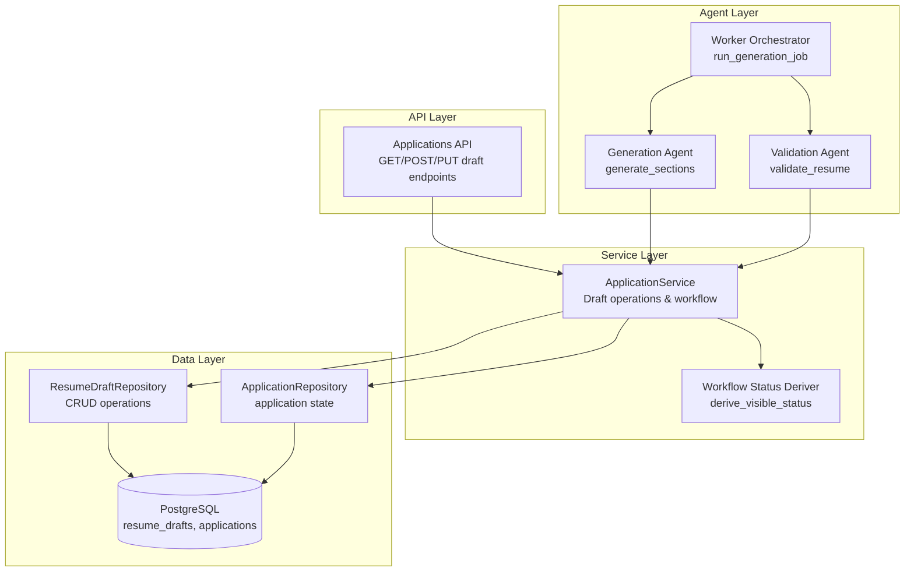
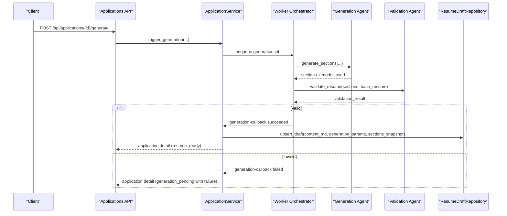
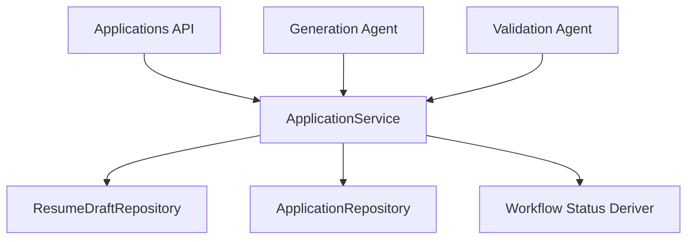

# Resume Draft Model

<cite>
**Referenced Files in This Document**
- [resume_drafts.py](file://backend/app/db/resume_drafts.py)
- [applications.py](file://backend/app/db/applications.py)
- [application_manager.py](file://backend/app/services/application_manager.py)
- [applications_api.py](file://backend/app/api/applications.py)
- [generation.py](file://agents/generation.py)
- [validation.py](file://agents/validation.py)
- [worker.py](file://agents/worker.py)
- [database_schema.md](file://docs/database_schema.md)
- [workflow.py](file://backend/app/services/workflow.py)
- [phase_3_generation.sql](file://supabase/migrations/20260407_000005_phase_3_generation.sql)
</cite>

## Table of Contents
1. [Introduction](#introduction)
2. [Project Structure](#project-structure)
3. [Core Components](#core-components)
4. [Architecture Overview](#architecture-overview)
5. [Detailed Component Analysis](#detailed-component-analysis)
6. [Dependency Analysis](#dependency-analysis)
7. [Performance Considerations](#performance-considerations)
8. [Troubleshooting Guide](#troubleshooting-guide)
9. [Conclusion](#conclusion)

## Introduction
This document provides comprehensive data model documentation for the Resume Draft entity used in AI-generated content and editing workflows. It covers the draft data structure, AI content generation and validation, editing state tracking, modification history, and the integration with the AI agent system. The document also explains how drafts relate to applications, how generated content flows from AI processing to user editing, and how draft persistence works through the repository layer.

## Project Structure
The Resume Draft model spans several layers:
- Data model and repository: backend application database layer
- Service orchestration: backend service layer managing workflow state and draft operations
- API surface: FastAPI endpoints exposing draft operations
- AI agents: generation and validation services that produce and validate draft content
- Database schema: canonical definitions and constraints for drafts and related entities

**Diagram sources**
- [applications_api.py:542-639](file://backend/app/api/applications.py#L542-L639)
- [application_manager.py:603-719](file://backend/app/services/application_manager.py#L603-L719)
- [resume_drafts.py:41-172](file://backend/app/db/resume_drafts.py#L41-L172)
- [applications.py:123-328](file://backend/app/db/applications.py#L123-L328)
- [generation.py:159-224](file://agents/generation.py#L159-L224)
- [validation.py:231-291](file://agents/validation.py#L231-L291)
- [worker.py:682-855](file://agents/worker.py#L682-L855)
- [workflow.py:11-31](file://backend/app/services/workflow.py#L11-L31)

**Section sources**
- [applications_api.py:542-639](file://backend/app/api/applications.py#L542-L639)
- [application_manager.py:603-719](file://backend/app/services/application_manager.py#L603-L719)
- [resume_drafts.py:41-172](file://backend/app/db/resume_drafts.py#L41-L172)
- [applications.py:123-328](file://backend/app/db/applications.py#L123-L328)
- [generation.py:159-224](file://agents/generation.py#L159-L224)
- [validation.py:231-291](file://agents/validation.py#L231-L291)
- [worker.py:682-855](file://agents/worker.py#L682-L855)
- [workflow.py:11-31](file://backend/app/services/workflow.py#L11-L31)

## Core Components
This section defines the Resume Draft data model and its relationships with applications and base resumes.

### Resume Draft Data Model
The Resume Draft represents the current AI-generated and user-edited content for a specific application. It is stored as Markdown and includes metadata about generation parameters and section snapshots.

Key attributes:
- id: UUID primary key
- application_id: UUID foreign key to the owning application
- user_id: UUID foreign key to the authenticated user
- content_md: Markdown content of the resume draft
- generation_params: JSONB containing generation settings (page length, aggressiveness, additional instructions)
- sections_snapshot: JSONB snapshot of enabled sections and their order at generation time
- last_generated_at: Timestamp of last successful generation/full regeneration
- last_exported_at: Timestamp of last successful export
- updated_at: Timestamp updated on every write (persistence hook)

Constraints and behaviors:
- Unique constraint on application_id ensures one current draft per application
- Content must be non-blank
- On successful export, both applications.exported_at and resume_drafts.last_exported_at are updated
- Editing after export transitions the application back to an appropriate visible/in-progress state

**Section sources**
- [database_schema.md:169-199](file://docs/database_schema.md#L169-L199)
- [resume_drafts.py:14-24](file://backend/app/db/resume_drafts.py#L14-L24)
- [resume_drafts.py:71-98](file://backend/app/db/resume_drafts.py#L71-L98)
- [resume_drafts.py:127-141](file://backend/app/db/resume_drafts.py#L127-L141)

### Application-Draft Relationship
Each application can have exactly one current draft. The draft references the application and the user who owns both. The application tracks workflow state and visible status, while the draft holds the latest content and generation metadata.

Relationship semantics:
- One application → One current draft (unique constraint)
- Application deletion cascades to draft deletion
- Ownership enforced via user_id on both tables

**Section sources**
- [database_schema.md:169-199](file://docs/database_schema.md#L169-L199)
- [applications.py:118-143](file://backend/app/db/applications.py#L118-L143)

### Generation Pipeline Metadata
The draft includes generation_params and sections_snapshot to maintain traceability and reproducibility:
- generation_params: Captures generation settings used to produce the draft
- sections_snapshot: Records which sections were enabled and their order at generation time

These fields enable:
- Consistent re-generation behavior despite changing user preferences
- Quality assurance and auditability of generation settings

**Section sources**
- [database_schema.md:43-44](file://docs/database_schema.md#L43-L44)
- [database_schema.md:169-199](file://docs/database_schema.md#L169-L199)

## Architecture Overview
The Resume Draft lifecycle integrates AI generation, validation, and user editing through a clear pipeline:

**Diagram sources**
- [applications_api.py:560-579](file://backend/app/api/applications.py#L560-L579)
- [application_manager.py:513-602](file://backend/app/services/application_manager.py#L513-L602)
- [worker.py:682-855](file://agents/worker.py#L682-L855)
- [generation.py:159-224](file://agents/generation.py#L159-L224)
- [validation.py:231-291](file://agents/validation.py#L231-L291)
- [resume_drafts.py:62-118](file://backend/app/db/resume_drafts.py#L62-L118)

## Detailed Component Analysis

### ResumeDraftRepository
The repository encapsulates all draft persistence operations with explicit SQL queries and JSONB handling.

Key operations:
- fetch_draft(user_id, application_id): Retrieves the current draft for an application
- upsert_draft(application_id, user_id, content_md, generation_params, sections_snapshot): Inserts or updates the draft; on conflict, updates content and metadata
- update_draft_content(application_id, user_id, content_md): Updates only the content_md field
- update_exported_at(application_id, user_id): Updates last_exported_at timestamp

Concurrency and conflict handling:
- Upsert uses PostgreSQL ON CONFLICT WHERE clause keyed by user_id to prevent cross-user updates
- All operations commit within a transaction context

**Section sources**
- [resume_drafts.py:41-172](file://backend/app/db/resume_drafts.py#L41-L172)

### ApplicationService Draft Operations
The service layer coordinates draft operations within the broader workflow.

Draft retrieval and editing:
- get_draft(user_id, application_id): Returns the current draft if it exists
- save_draft_edit(user_id, application_id, content): Validates existence, updates content_md, and recalculates visible status if export had occurred

Generation callbacks:
- handle_generation_callback: On successful generation, upserts the draft and transitions application state to resume_ready
- handle_regeneration_callback: On successful regeneration (full or section), upserts the draft and transitions application state

Export workflow:
- export_pdf: Generates PDF from draft content, updates application.exported_at and draft.last_exported_at, and sets visible status to complete if no subsequent edits occur

Visible status derivation:
- derive_visible_status: Computes visible_status based on internal_state, failure_reason, export state, and whether draft has changed since export

**Section sources**
- [application_manager.py:1019-1067](file://backend/app/services/application_manager.py#L1019-L1067)
- [application_manager.py:603-719](file://backend/app/services/application_manager.py#L603-L719)
- [application_manager.py:907-1017](file://backend/app/services/application_manager.py#L907-L1017)
- [application_manager.py:1069-1148](file://backend/app/services/application_manager.py#L1069-L1148)
- [workflow.py:11-31](file://backend/app/services/workflow.py#L11-L31)

### AI Generation and Validation
The AI agent system produces validated, ATS-safe content that becomes the draft.

Generation process:
- generate_sections: Builds prompts per section, calls LLM with fallback, and returns ordered sections plus model_used
- assemble_resume: Merges personal info and generated sections into final Markdown content
- sections_snapshot: Captures enabled sections and order for reproducibility

Validation process:
- validate_resume: Performs hallucination detection, required sections check, ordering verification, and ATS-safety checks (including auto-corrections)
- Returns validity flag and error details for recovery

**Section sources**
- [generation.py:159-224](file://agents/generation.py#L159-L224)
- [generation.py:280-351](file://agents/generation.py#L280-L351)
- [validation.py:231-291](file://agents/validation.py#L231-L291)
- [worker.py:682-855](file://agents/worker.py#L682-L855)

### API Surface for Draft Management
The API exposes endpoints for draft operations:

- GET /api/applications/{application_id}/draft: Retrieve current draft
- POST /api/applications/{application_id}/generate: Trigger generation
- POST /api/applications/{application_id}/regenerate: Trigger full regeneration
- POST /api/applications/{application_id}/regenerate-section: Trigger section regeneration
- PUT /api/applications/{application_id}/draft: Save user edits to draft
- GET /api/applications/{application_id}/export-pdf: Export PDF and update export timestamps

Error handling:
- Maps service exceptions to HTTP status codes (404, 400, 409, 500)

**Section sources**
- [applications_api.py:542-639](file://backend/app/api/applications.py#L542-L639)

## Dependency Analysis
The draft model depends on several components for data integrity, workflow state, and AI processing.

**Diagram sources**
- [resume_drafts.py:41-172](file://backend/app/db/resume_drafts.py#L41-L172)
- [application_manager.py:143-168](file://backend/app/services/application_manager.py#L143-L168)
- [applications.py:123-328](file://backend/app/db/applications.py#L123-L328)
- [workflow.py:11-31](file://backend/app/services/workflow.py#L11-L31)
- [generation.py:159-224](file://agents/generation.py#L159-L224)
- [validation.py:231-291](file://agents/validation.py#L231-L291)

### Data Integrity and Constraints
- Unique constraint on application_id in resume_drafts ensures one current draft per application
- Composite foreign keys enforce ownership and cascade deletes appropriately
- JSONB validation contracts ensure consistent shapes for generation_params and sections_snapshot

**Section sources**
- [database_schema.md:169-199](file://docs/database_schema.md#L169-L199)
- [database_schema.md:43-44](file://docs/database_schema.md#L43-L44)

### Migration Support
- The generation_failure_details column was added to applications to persist validation and generation failure diagnostics

**Section sources**
- [phase_3_generation.sql:1-11](file://supabase/migrations/20260407_000005_phase_3_generation.sql#L1-L11)

## Performance Considerations
- Draft operations use lightweight SQL with JSONB fields; ensure proper indexing on user_id and application_id for optimal performance
- Generation and validation calls are asynchronous; use timeouts and retries to avoid blocking
- Export operations should be optimized to minimize PDF generation overhead
- Consider caching frequently accessed base resumes and application contexts to reduce latency

## Troubleshooting Guide
Common issues and resolutions:

- Draft not found during save/edit:
  - Cause: Attempting to edit a draft that does not exist
  - Resolution: Ensure generation has completed successfully before saving edits

- Generation validation failures:
  - Cause: Validation errors returned by validate_resume
  - Resolution: Inspect generation_failure_details on the application and fix validation issues before retrying

- Export failures:
  - Cause: PDF generation timeout or error
  - Resolution: Retry export; check logs for timeout or rendering errors

- Conflict during upsert:
  - Cause: Cross-user access attempt or concurrent updates
  - Resolution: Ensure user_id matches the draft owner; the repository uses ON CONFLICT WHERE to prevent unauthorized updates

**Section sources**
- [application_manager.py:1019-1067](file://backend/app/services/application_manager.py#L1019-L1067)
- [application_manager.py:1296-1324](file://backend/app/services/application_manager.py#L1296-L1324)
- [application_manager.py:1150-1184](file://backend/app/services/application_manager.py#L1150-L1184)
- [resume_drafts.py:71-118](file://backend/app/db/resume_drafts.py#L71-L118)

## Conclusion
The Resume Draft model provides a robust foundation for AI-driven resume generation and editing workflows. It maintains content integrity through strict ownership and constraints, preserves generation metadata for reproducibility, and integrates seamlessly with the AI agent system and application workflow. The repository layer ensures safe persistence, while the service layer orchestrates state transitions and visible status derivation. Together, these components support reliable content creation, validation, editing, and export processes.