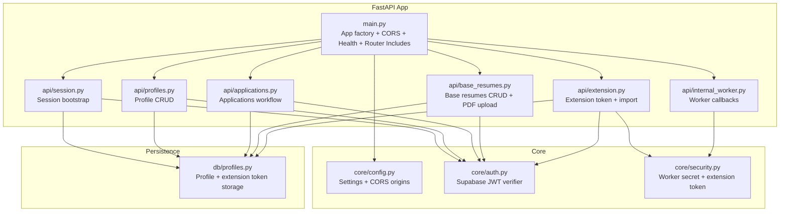
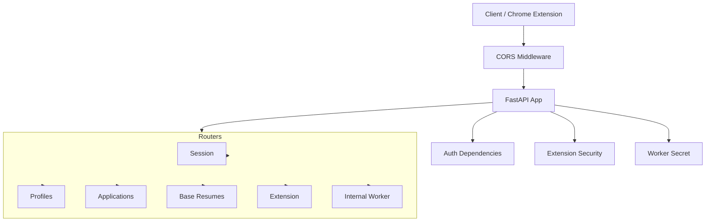
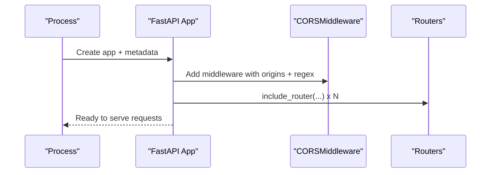
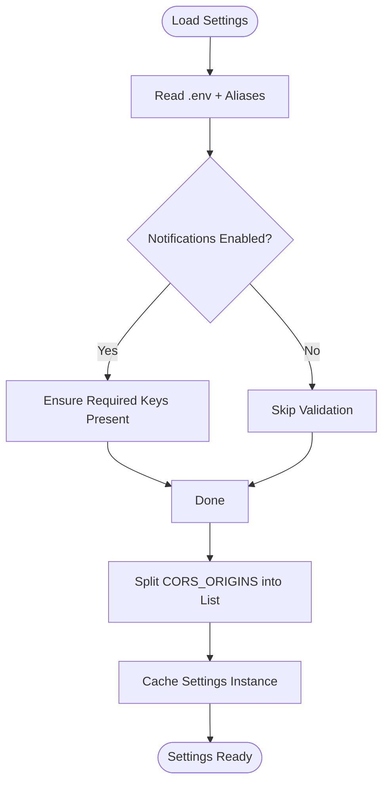
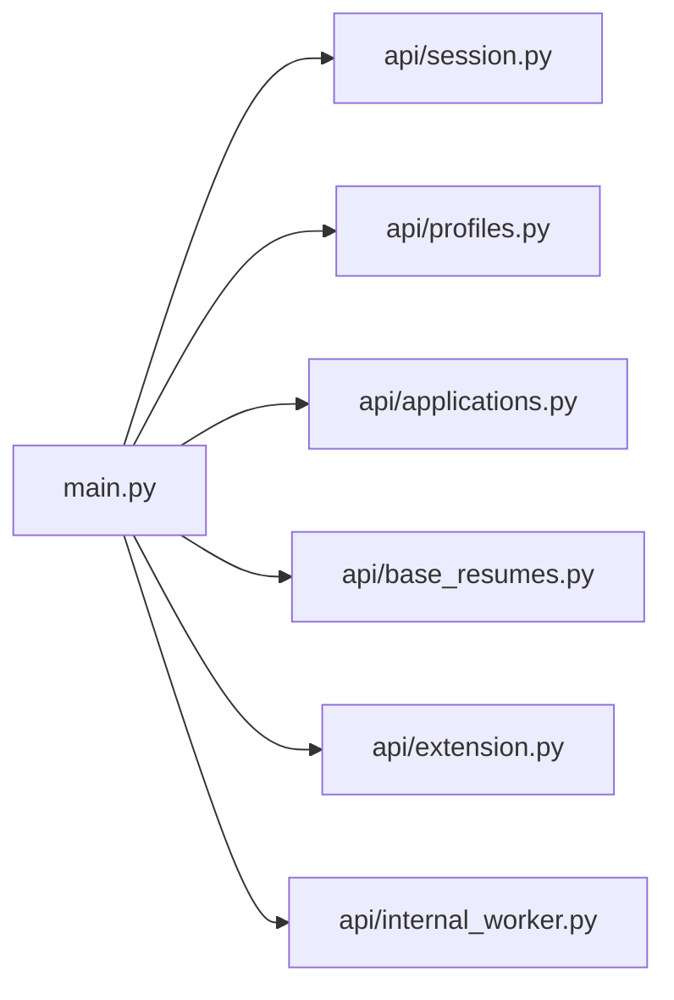
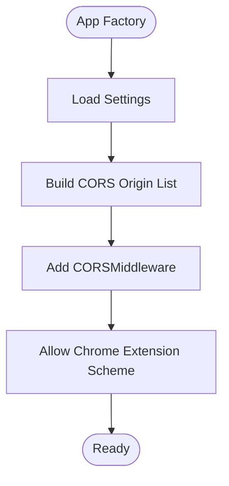
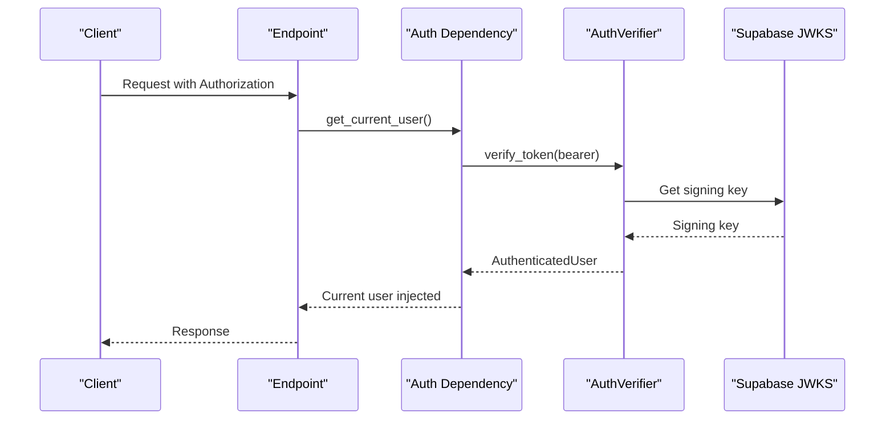
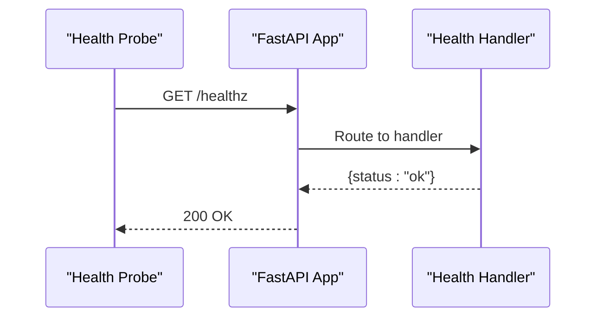
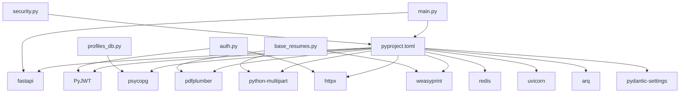

# FastAPI Application

<cite>
**Referenced Files in This Document**
- [main.py](file://backend/app/main.py)
- [config.py](file://backend/app/core/config.py)
- [auth.py](file://backend/app/core/auth.py)
- [security.py](file://backend/app/core/security.py)
- [session.py](file://backend/app/api/session.py)
- [profiles.py](file://backend/app/api/profiles.py)
- [applications.py](file://backend/app/api/applications.py)
- [base_resumes.py](file://backend/app/api/base_resumes.py)
- [extension.py](file://backend/app/api/extension.py)
- [internal_worker.py](file://backend/app/api/internal_worker.py)
- [profiles_db.py](file://backend/app/db/profiles.py)
- [pyproject.toml](file://backend/pyproject.toml)
- [docker-compose.yml](file://docker-compose.yml)
</cite>

## Table of Contents
1. [Introduction](#introduction)
2. [Project Structure](#project-structure)
3. [Core Components](#core-components)
4. [Architecture Overview](#architecture-overview)
5. [Detailed Component Analysis](#detailed-component-analysis)
6. [Dependency Analysis](#dependency-analysis)
7. [Performance Considerations](#performance-considerations)
8. [Troubleshooting Guide](#troubleshooting-guide)
9. [Conclusion](#conclusion)
10. [Appendices](#appendices)

## Introduction
This document explains the FastAPI application structure and configuration for the AI Resume Builder backend. It covers application initialization, router organization, middleware setup (including CORS for Chrome extension support), settings management and environment handling, security configurations, health checks, and application lifecycle. Practical examples demonstrate router registration, middleware configuration, and startup procedures, with a focus on CORS policies enabling secure cross-origin communication with the Chrome extension.

## Project Structure
The backend is organized around a FastAPI application with modular routers grouped under a single application factory. Configuration is centralized via a settings class loaded from environment variables. Authentication integrates with Supabase JWT verification, while a dedicated extension token mechanism supports Chrome extension interactions. Internal worker callbacks are protected by a shared secret header.

**Diagram sources**
- [main.py:14-36](file://backend/app/main.py#L14-L36)
- [config.py:35-96](file://backend/app/core/config.py#L35-L96)
- [auth.py:22-90](file://backend/app/core/auth.py#L22-L90)
- [security.py:13-54](file://backend/app/core/security.py#L13-L54)
- [session.py:12-45](file://backend/app/api/session.py#L12-L45)
- [profiles.py:11-113](file://backend/app/api/profiles.py#L11-L113)
- [applications.py:21-661](file://backend/app/api/applications.py#L21-L661)
- [base_resumes.py:12-242](file://backend/app/api/base_resumes.py#L12-L242)
- [extension.py:27-141](file://backend/app/api/extension.py#L27-L141)
- [internal_worker.py:16-71](file://backend/app/api/internal_worker.py#L16-L71)
- [profiles_db.py:38-225](file://backend/app/db/profiles.py#L38-L225)

**Section sources**
- [main.py:14-36](file://backend/app/main.py#L14-L36)
- [config.py:35-96](file://backend/app/core/config.py#L35-L96)

## Core Components
- Application factory and middleware:
  - Creates the FastAPI app with title and version.
  - Adds CORS middleware allowing configured origins and Chrome extension scheme.
  - Registers routers for session, profiles, applications, base resumes, extension, and internal worker.
  - Defines a health check endpoint.
- Settings management:
  - Centralized settings class loads environment variables with aliases and validation.
  - Provides computed CORS origin list from a comma-separated environment variable.
  - Exposes nested email settings and other service-specific keys.
- Authentication and security:
  - Supabase JWT verification with JWK client and optional symmetric fallback.
  - Extension token hashing and verification against stored hashes.
  - Worker callback protection via shared secret header.

**Section sources**
- [main.py:14-36](file://backend/app/main.py#L14-L36)
- [config.py:35-96](file://backend/app/core/config.py#L35-L96)
- [auth.py:22-90](file://backend/app/core/auth.py#L22-L90)
- [security.py:13-54](file://backend/app/core/security.py#L13-L54)

## Architecture Overview
The application initializes the FastAPI app, applies CORS, registers routers, and exposes endpoints grouped by domain. Authentication is enforced per-route via dependency injection. The extension endpoints use a separate token mechanism to authorize Chrome extension actions.

**Diagram sources**
- [main.py:14-36](file://backend/app/main.py#L14-L36)
- [auth.py:72-90](file://backend/app/core/auth.py#L72-L90)
- [security.py:34-54](file://backend/app/core/security.py#L34-L54)
- [session.py:12-45](file://backend/app/api/session.py#L12-L45)
- [profiles.py:11-113](file://backend/app/api/profiles.py#L11-L113)
- [applications.py:21-661](file://backend/app/api/applications.py#L21-L661)
- [base_resumes.py:12-242](file://backend/app/api/base_resumes.py#L12-L242)
- [extension.py:27-141](file://backend/app/api/extension.py#L27-L141)
- [internal_worker.py:16-71](file://backend/app/api/internal_worker.py#L16-L71)

## Detailed Component Analysis

### Application Initialization and Lifecycle
- Creation:
  - FastAPI app instantiated with metadata.
  - CORS middleware configured with:
    - Origins from settings.
    - Regex allowing Chrome extension scheme.
    - Credentials, methods, and headers permitted.
- Registration:
  - Routers included in a defined order.
- Health check:
  - Endpoint returns a simple status payload.
- Startup procedure:
  - Environment variables loaded via settings.
  - Dependencies resolved per-request using cached verifiers and repositories.

**Diagram sources**
- [main.py:14-36](file://backend/app/main.py#L14-L36)

**Section sources**
- [main.py:14-36](file://backend/app/main.py#L14-L36)

### Settings Management and Environment Handling
- Settings class:
  - Loads from .env with UTF-8 encoding and ignores extra fields.
  - Uses aliases for environment variable names.
  - Validates email settings when notifications are enabled.
  - Computes CORS origin list from a comma-separated string.
- Environment variables:
  - Application and service URLs, database and Redis connections.
  - Supabase configuration for JWKS and JWT audience/issuer.
  - Worker callback secret and duplicate similarity threshold.
  - Email notification toggles and credentials.
  - OpenRouter API key and cleanup model.
- Computed properties:
  - CORS origin list derived from a single environment variable.
  - Email settings object exposed for convenience.

**Diagram sources**
- [config.py:35-96](file://backend/app/core/config.py#L35-L96)

**Section sources**
- [config.py:35-96](file://backend/app/core/config.py#L35-L96)

### Router Organization and Registration
- Routers:
  - Session: bootstrap session with user, profile, and workflow contract version.
  - Profiles: get and patch profile with validation and error mapping.
  - Applications: comprehensive CRUD, workflow progress, drafts, exports, and generation endpoints.
  - Base Resumes: list/create/get/update/delete, plus PDF upload with parsing and optional LLM cleanup.
  - Extension: token status, issuance, revocation, and import from captured job data.
  - Internal Worker: callbacks for extraction, generation, and regeneration.
- Registration:
  - All routers included in the main app factory.

**Diagram sources**
- [main.py:30-36](file://backend/app/main.py#L30-L36)
- [session.py:12-45](file://backend/app/api/session.py#L12-L45)
- [profiles.py:11-113](file://backend/app/api/profiles.py#L11-L113)
- [applications.py:21-661](file://backend/app/api/applications.py#L21-L661)
- [base_resumes.py:12-242](file://backend/app/api/base_resumes.py#L12-L242)
- [extension.py:27-141](file://backend/app/api/extension.py#L27-L141)
- [internal_worker.py:16-71](file://backend/app/api/internal_worker.py#L16-L71)

**Section sources**
- [main.py:30-36](file://backend/app/main.py#L30-L36)
- [session.py:12-45](file://backend/app/api/session.py#L12-L45)
- [profiles.py:11-113](file://backend/app/api/profiles.py#L11-L113)
- [applications.py:21-661](file://backend/app/api/applications.py#L21-L661)
- [base_resumes.py:12-242](file://backend/app/api/base_resumes.py#L12-L242)
- [extension.py:27-141](file://backend/app/api/extension.py#L27-L141)
- [internal_worker.py:16-71](file://backend/app/api/internal_worker.py#L16-L71)

### CORS Configuration for Chrome Extension Support
- Origins:
  - Loaded from settings and split into a list.
- Regex:
  - Explicitly allows the Chrome extension scheme to enable secure cross-origin requests from the extension.
- Credentials and headers/methods:
  - Credentials allowed, wildcard methods and headers configured.

**Diagram sources**
- [main.py:15-22](file://backend/app/main.py#L15-L22)
- [config.py:90-91](file://backend/app/core/config.py#L90-L91)

**Section sources**
- [main.py:15-22](file://backend/app/main.py#L15-L22)
- [config.py:90-91](file://backend/app/core/config.py#L90-L91)

### Authentication and Authorization
- Supabase JWT verification:
  - JWK client fetched from JWKS URL.
  - Decodes tokens with audience and optional issuer.
  - Falls back to symmetric secret if configured.
  - Provides a dependency to extract and validate the current user from Authorization headers.
- Extension token verification:
  - Hashes incoming token and compares to stored hash.
  - Updates last-used timestamp on successful verification.
- Worker callback verification:
  - Validates a shared secret header against settings.

**Diagram sources**
- [auth.py:22-90](file://backend/app/core/auth.py#L22-L90)
- [auth.py:72-90](file://backend/app/core/auth.py#L72-L90)

**Section sources**
- [auth.py:22-90](file://backend/app/core/auth.py#L22-L90)
- [security.py:13-54](file://backend/app/core/security.py#L13-L54)

### Health Check Endpoint
- Endpoint:
  - GET /healthz returns a simple status payload indicating the service is healthy.

**Diagram sources**
- [main.py:25-27](file://backend/app/main.py#L25-L27)

**Section sources**
- [main.py:25-27](file://backend/app/main.py#L25-L27)

### Practical Examples

- Router registration example:
  - Include routers in the main app factory after app creation and middleware addition.
  - Example paths:
    - [main.py:30-36](file://backend/app/main.py#L30-L36)

- Middleware configuration example:
  - Add CORSMiddleware with origins from settings, regex for Chrome extension, and allow credentials/methods/headers.
  - Example paths:
    - [main.py:15-22](file://backend/app/main.py#L15-L22)
    - [config.py:90-91](file://backend/app/core/config.py#L90-L91)

- Application startup procedure:
  - Load settings via the cached getter.
  - Create the app and register routers.
  - Example paths:
    - [main.py:12-14](file://backend/app/main.py#L12-L14)
    - [config.py:94-96](file://backend/app/core/config.py#L94-L96)

- CORS policy for Chrome extension:
  - Configure allow_origin_regex for the Chrome extension scheme alongside allow_origins.
  - Example paths:
    - [main.py:18](file://backend/app/main.py#L18)

- Relationship between configuration and behavior:
  - CORS origin list controls allowed origins.
  - Supabase JWKS and JWT settings control token verification.
  - Worker callback secret controls internal worker endpoint access.
  - Example paths:
    - [config.py:47-58](file://backend/app/core/config.py#L47-L58)
    - [config.py:90-91](file://backend/app/core/config.py#L90-L91)
    - [security.py:13-23](file://backend/app/core/security.py#L13-L23)

**Section sources**
- [main.py:12-22](file://backend/app/main.py#L12-L22)
- [config.py:47-58](file://backend/app/core/config.py#L47-L58)
- [config.py:90-91](file://backend/app/core/config.py#L90-L91)
- [security.py:13-23](file://backend/app/core/security.py#L13-L23)

## Dependency Analysis
- External dependencies:
  - FastAPI, Pydantic Settings, PyJWT, psycopg, redis, uvicorn, pdfplumber, weasyprint, python-multipart.
- Internal dependencies:
  - Routers depend on core auth and security, and on database repositories.
  - Database repositories depend on settings for connection strings.

**Diagram sources**
- [pyproject.toml:10-23](file://backend/pyproject.toml#L10-L23)
- [main.py:1-10](file://backend/app/main.py#L1-L10)
- [auth.py:6-12](file://backend/app/core/auth.py#L6-L12)
- [security.py:3-11](file://backend/app/core/security.py#L3-L11)
- [base_resumes.py:17-24](file://backend/app/api/base_resumes.py#L17-L24)
- [profiles_db.py:6-11](file://backend/app/db/profiles.py#L6-L11)

**Section sources**
- [pyproject.toml:10-23](file://backend/pyproject.toml#L10-L23)

## Performance Considerations
- Settings caching:
  - Settings are cached to avoid repeated environment reads.
- Dependency caching:
  - Auth verifier and settings are cached to reduce overhead during request handling.
- Database connections:
  - Context-managed connections ensure proper resource handling.
- PDF parsing and export:
  - Parsing and PDF export are I/O bound; consider async improvements and worker offloading where feasible.

[No sources needed since this section provides general guidance]

## Troubleshooting Guide
- CORS errors:
  - Verify that the origin is present in the CORS origin list and that the Chrome extension scheme is allowed.
  - Check environment variable values and ensure the list is correctly parsed.
  - Example paths:
    - [main.py:17-22](file://backend/app/main.py#L17-L22)
    - [config.py:90-91](file://backend/app/core/config.py#L90-L91)
- Authentication failures:
  - Ensure Authorization header is present and starts with Bearer.
  - Confirm Supabase JWKS URL and JWT audience/issuer settings match the identity provider.
  - Example paths:
    - [auth.py:72-90](file://backend/app/core/auth.py#L72-L90)
    - [config.py:52-58](file://backend/app/core/config.py#L52-L58)
- Extension token issues:
  - Confirm token is hashed and stored correctly; ensure the header matches the stored hash.
  - Example paths:
    - [security.py:34-54](file://backend/app/core/security.py#L34-L54)
    - [profiles_db.py:101-122](file://backend/app/db/profiles.py#L101-L122)
- Worker callback unauthorized:
  - Verify the X-Worker-Secret header matches the configured secret.
  - Example paths:
    - [security.py:13-23](file://backend/app/core/security.py#L13-L23)
- Health check failing:
  - Confirm the endpoint is reachable and returns the expected payload.
  - Example paths:
    - [main.py:25-27](file://backend/app/main.py#L25-L27)

**Section sources**
- [main.py:17-22](file://backend/app/main.py#L17-L22)
- [config.py:52-58](file://backend/app/core/config.py#L52-L58)
- [security.py:13-23](file://backend/app/core/security.py#L13-L23)
- [profiles_db.py:101-122](file://backend/app/db/profiles.py#L101-L122)
- [main.py:25-27](file://backend/app/main.py#L25-L27)

## Conclusion
The FastAPI backend is structured around a clear separation of concerns: configuration-driven settings, robust authentication and security mechanisms, modular routers, and explicit CORS policies supporting Chrome extension integration. The application lifecycle is straightforward: load settings, initialize the app, apply middleware, register routers, and expose endpoints. Proper environment configuration ensures secure and reliable operation across development and deployment environments.

[No sources needed since this section summarizes without analyzing specific files]

## Appendices

### Environment Variables Reference
- Application and runtime:
  - APP_ENV, APP_DEV_MODE, API_PORT, APP_URL
- Database and cache:
  - DATABASE_URL, REDIS_URL
- CORS:
  - CORS_ORIGINS (comma-separated)
- Supabase:
  - SUPABASE_URL, SUPABASE_EXTERNAL_URL, SUPABASE_AUTH_JWKS_URL, SUPABASE_JWT_SECRET, SUPABASE_JWT_AUDIENCE, SUPABASE_JWT_ISSUER
- Worker:
  - WORKER_CALLBACK_SECRET
- Similarity and notifications:
  - DUPLICATE_SIMILARITY_THRESHOLD, EMAIL_NOTIFICATIONS_ENABLED, RESEND_API_KEY, EMAIL_FROM
- OpenRouter:
  - OPENROUTER_API_KEY, OPENROUTER_CLEANUP_MODEL

**Section sources**
- [config.py:38-74](file://backend/app/core/config.py#L38-L74)

### Docker Compose Integration
- Backend service sets environment variables consumed by the application, including CORS origins, Supabase URLs, and secrets.
- Frontend service depends on backend and shares shared resources.

**Section sources**
- [docker-compose.yml:26-43](file://docker-compose.yml#L26-L43)
- [docker-compose.yml:18-21](file://docker-compose.yml#L18-L21)