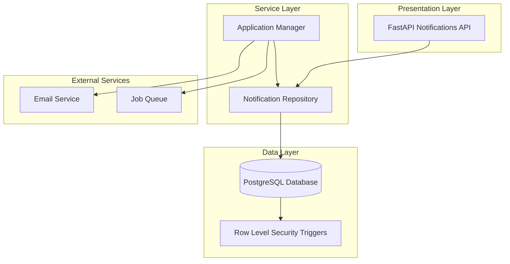
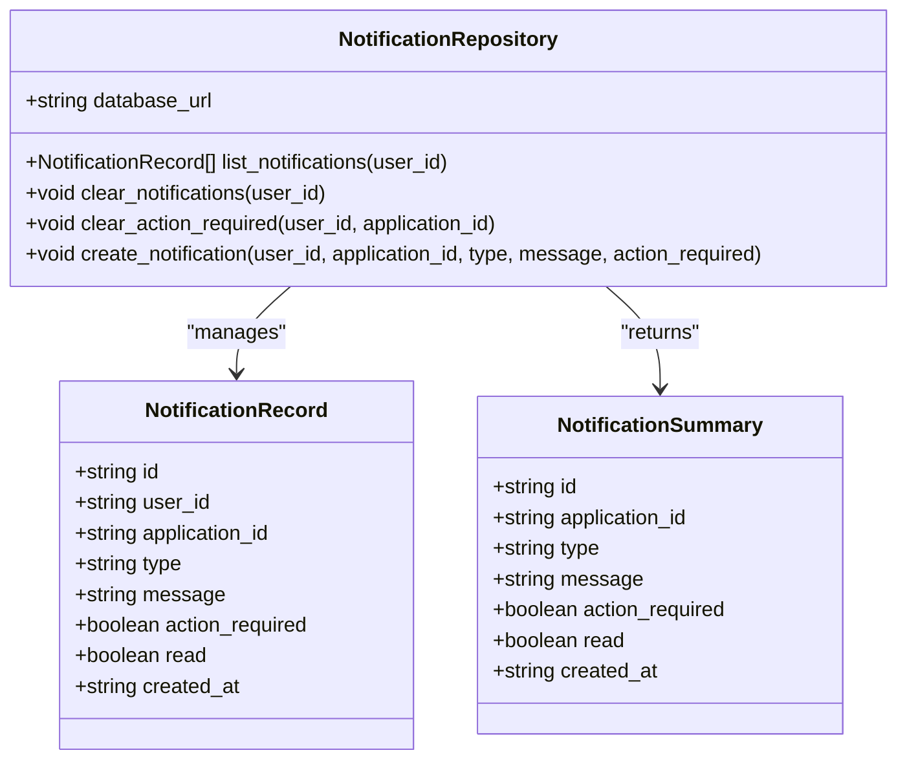
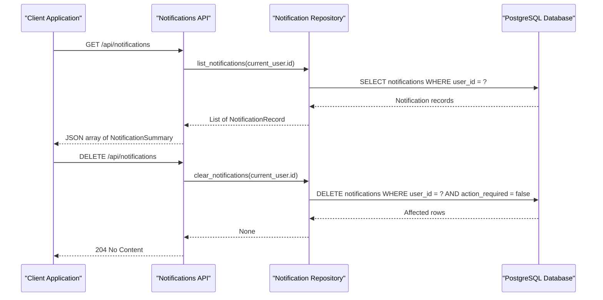
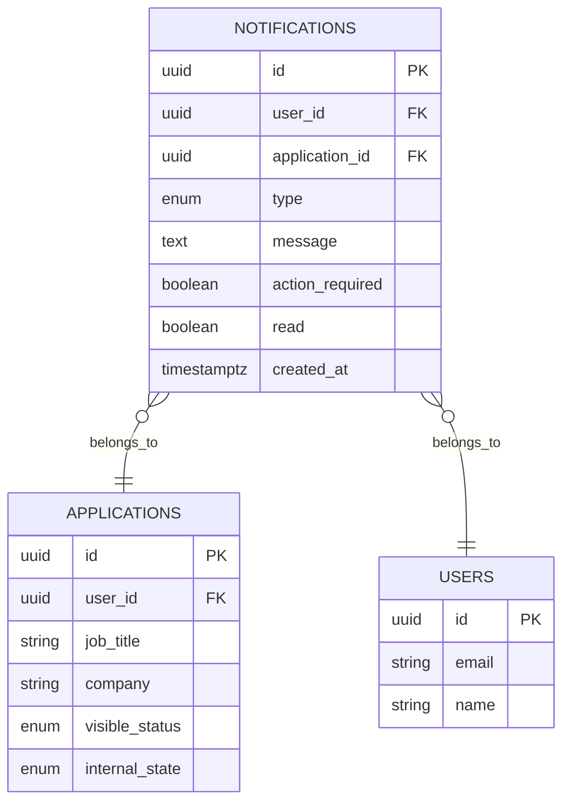
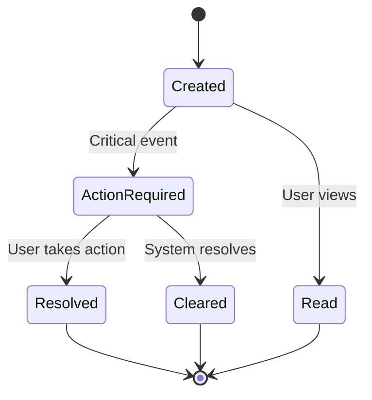
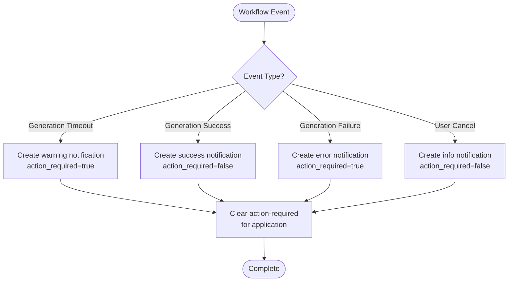
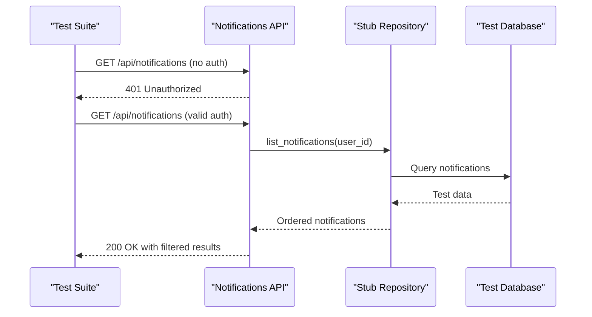

# Notification System

<cite>
**Referenced Files in This Document**
- [backend/app/api/notifications.py](file://backend/app/api/notifications.py)
- [backend/app/db/notifications.py](file://backend/app/db/notifications.py)
- [supabase/migrations/20260407_000001_phase_0_foundation.sql](file://supabase/migrations/20260407_000001_phase_0_foundation.sql)
- [backend/app/services/application_manager.py](file://backend/app/services/application_manager.py)
- [backend/tests/test_notifications_api.py](file://backend/tests/test_notifications_api.py)
- [backend/app/db/applications.py](file://backend/app/db/applications.py)
</cite>

## Table of Contents
1. [Introduction](#introduction)
2. [System Architecture](#system-architecture)
3. [Core Components](#core-components)
4. [Database Schema](#database-schema)
5. [API Endpoints](#api-endpoints)
6. [Notification Types and States](#notification-types-and-states)
7. [Integration Points](#integration-points)
8. [Performance Considerations](#performance-considerations)
9. [Testing Strategy](#testing-strategy)
10. [Troubleshooting Guide](#troubleshooting-guide)
11. [Conclusion](#conclusion)

## Introduction

The Notification System is a core component of the job application management platform that handles asynchronous communication of system events, workflow status updates, and user-action-required notifications. Built on PostgreSQL with FastAPI, this system provides real-time feedback to users about their application processes while maintaining strict data isolation and security policies.

The system operates as a decoupled notification layer that integrates seamlessly with the application workflow, ensuring users receive timely updates about extraction progress, generation status, and other critical events without blocking the main application flow.

## System Architecture

The notification system follows a layered architecture pattern with clear separation of concerns:

**Diagram sources**
- [backend/app/api/notifications.py:12](file://backend/app/api/notifications.py#L12)
- [backend/app/db/notifications.py:23](file://backend/app/db/notifications.py#L23)
- [supabase/migrations/20260407_000001_phase_0_foundation.sql:199](file://supabase/migrations/20260407_000001_phase_0_foundation.sql#L199)

The architecture ensures loose coupling between notification generation and consumption, allowing for easy maintenance and scalability.

## Core Components

### Notification Model

The notification system is built around a comprehensive data model that captures all aspects of notification lifecycle:

**Diagram sources**
- [backend/app/db/notifications.py:13](file://backend/app/db/notifications.py#L13)
- [backend/app/db/notifications.py:23](file://backend/app/db/notifications.py#L23)
- [backend/app/api/notifications.py:15](file://backend/app/api/notifications.py#L15)

**Section sources**
- [backend/app/db/notifications.py:13-21](file://backend/app/db/notifications.py#L13-L21)
- [backend/app/db/notifications.py:23-103](file://backend/app/db/notifications.py#L23-L103)

### API Layer

The notification API provides two primary endpoints for managing user notifications:

**Diagram sources**
- [backend/app/api/notifications.py:25](file://backend/app/api/notifications.py#L25)
- [backend/app/api/notifications.py:36](file://backend/app/api/notifications.py#L36)

**Section sources**
- [backend/app/api/notifications.py:25-42](file://backend/app/api/notifications.py#L25-L42)

## Database Schema

The notification system utilizes a PostgreSQL schema designed for high performance and strict data isolation:

**Diagram sources**
- [supabase/migrations/20260407_000001_phase_0_foundation.sql:199](file://supabase/migrations/20260407_000001_phase_0_foundation.sql#L199)
- [supabase/migrations/20260407_000001_phase_0_foundation.sql:214](file://supabase/migrations/20260407_000001_phase_0_foundation.sql#L214)

The schema includes several critical indexes optimized for notification retrieval and filtering:

**Section sources**
- [supabase/migrations/20260407_000001_phase_0_foundation.sql:199-232](file://supabase/migrations/20260407_000001_phase_0_foundation.sql#L199-L232)

## API Endpoints

### List Notifications Endpoint

The primary endpoint for retrieving user notifications:

**Endpoint:** `GET /api/notifications`

**Response:** Array of `NotificationSummary` objects, sorted by creation time (newest first)

**Security:** Requires authenticated user context

**Behavior:** Returns all notifications for the current user, excluding sensitive cross-user data

### Clear Notifications Endpoint

**Endpoint:** `DELETE /api/notifications`

**Behavior:** Removes all non-action-required notifications for the current user

**Security:** Requires authenticated user context

**Section sources**
- [backend/app/api/notifications.py:25-42](file://backend/app/api/notifications.py#L25-L42)

## Notification Types and States

The notification system supports four distinct notification types with specific meanings:

| Type | Purpose | Action Required | Typical Message |
|------|---------|-----------------|-----------------|
| `info` | Informative updates | No | "Generation was cancelled." |
| `success` | Successful completion | No | "Resume generation completed successfully." |
| `warning` | Pending action required | Yes | "Generation stalled after 300 seconds..." |
| `error` | Critical failures | Yes | "Generation failed with timeout." |

### State Management

Notifications maintain three key states that control user interaction:

**Diagram sources**
- [backend/app/db/notifications.py:18](file://backend/app/db/notifications.py#L18)
- [backend/app/db/notifications.py:19](file://backend/app/db/notifications.py#L19)

**Section sources**
- [backend/app/db/notifications.py:13-21](file://backend/app/db/notifications.py#L13-L21)

## Integration Points

### Application Workflow Integration

The notification system integrates deeply with the application workflow through the Application Manager service:

**Diagram sources**
- [backend/app/services/application_manager.py:520](file://backend/app/services/application_manager.py#L520)
- [backend/app/services/application_manager.py:633](file://backend/app/services/application_manager.py#L633)
- [backend/app/services/application_manager.py:1033](file://backend/app/services/application_manager.py#L1033)

### Application-Level Notification Tracking

Applications maintain a computed field indicating whether they have unresolved action-required notifications:

**Section sources**
- [backend/app/services/application_manager.py:520-526](file://backend/app/services/application_manager.py#L520-L526)
- [backend/app/services/application_manager.py:633-639](file://backend/app/services/application_manager.py#L633-L639)
- [backend/app/services/application_manager.py:1033-1039](file://backend/app/services/application_manager.py#L1033-L1039)

## Performance Considerations

### Database Optimization

The notification system employs several database optimizations:

1. **Index Strategy:**
   - `idx_notifications_user_read_created`: Optimized for user-centric notification listing
   - `idx_notifications_unread_action_required`: Efficient filtering for action-required notifications

2. **Connection Management:**
   - Context-managed database connections prevent resource leaks
   - Row factory ensures efficient data parsing

3. **Query Optimization:**
   - Selective column retrieval reduces memory usage
   - Proper ordering prevents additional sorting overhead

### Caching Strategy

While the current implementation focuses on immediate notification delivery, potential caching opportunities include:

- Frequently accessed notification counts per user
- Recent notification summaries for dashboard displays
- Application-level notification state aggregation

**Section sources**
- [backend/app/db/notifications.py:27-31](file://backend/app/db/notifications.py#L27-L31)
- [supabase/migrations/20260407_000001_phase_0_foundation.sql:230](file://supabase/migrations/20260407_000001_phase_0_foundation.sql#L230)

## Testing Strategy

### Unit Testing Approach

The notification system includes comprehensive testing covering:

1. **API Authentication Tests:** Ensures proper bearer token validation
2. **Data Isolation Tests:** Verifies cross-user data protection
3. **Sorting and Filtering Tests:** Validates notification ordering and filtering logic
4. **Repository Method Tests:** Tests CRUD operations and edge cases

### Test Implementation Patterns

**Diagram sources**
- [backend/tests/test_notifications_api.py:100](file://backend/tests/test_notifications_api.py#L100)

**Section sources**
- [backend/tests/test_notifications_api.py:31-76](file://backend/tests/test_notifications_api.py#L31-L76)
- [backend/tests/test_notifications_api.py:100-106](file://backend/tests/test_notifications_api.py#L100-L106)

## Troubleshooting Guide

### Common Issues and Solutions

1. **Authentication Failures:**
   - Symptom: 401 Unauthorized responses from notification endpoints
   - Solution: Verify bearer token presence and validity

2. **Missing Notifications:**
   - Symptom: Empty notification lists despite recent activity
   - Solution: Check notification filtering logic and user context

3. **Performance Degradation:**
   - Symptom: Slow notification retrieval
   - Solution: Verify index usage and query patterns

4. **Data Consistency Issues:**
   - Symptom: Stale notification states
   - Solution: Review transaction boundaries and commit operations

### Debugging Tools

- Database query logs for notification queries
- Application logs for notification creation and modification
- API response validation for data integrity checks

**Section sources**
- [backend/tests/test_notifications_api.py:100-106](file://backend/tests/test_notifications_api.py#L100-L106)

## Conclusion

The Notification System provides a robust, scalable foundation for asynchronous communication in the job application platform. Its architecture balances performance with security, ensuring users receive timely updates while maintaining strict data isolation.

Key strengths include:
- **Security-first design** with row-level security policies
- **Performance optimization** through strategic indexing
- **Comprehensive integration** with the application workflow
- **Extensible notification types** supporting various use cases
- **Thorough testing coverage** ensuring reliability

Future enhancements could include notification caching, real-time WebSocket updates, and expanded notification channels beyond the current database-based approach.