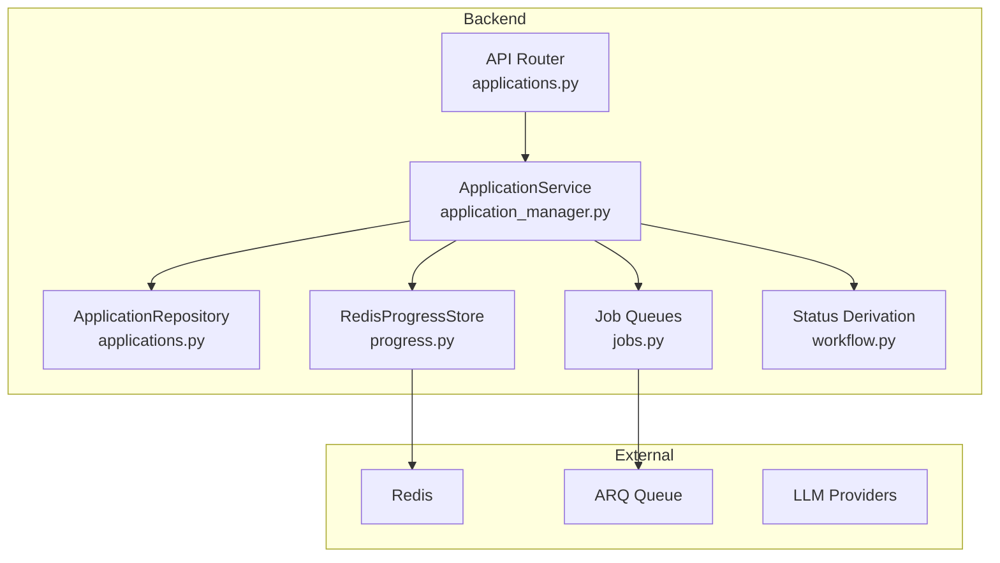
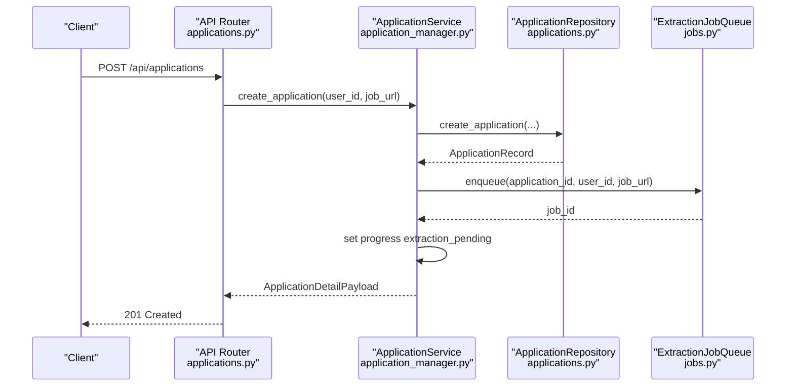
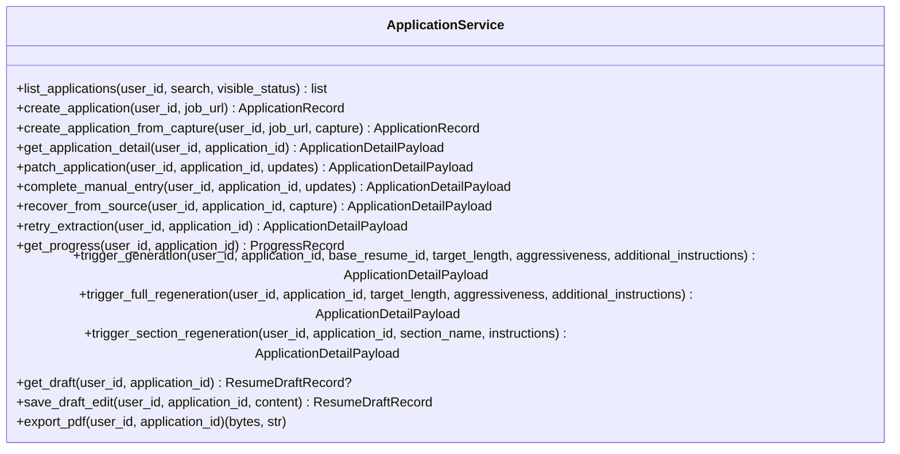
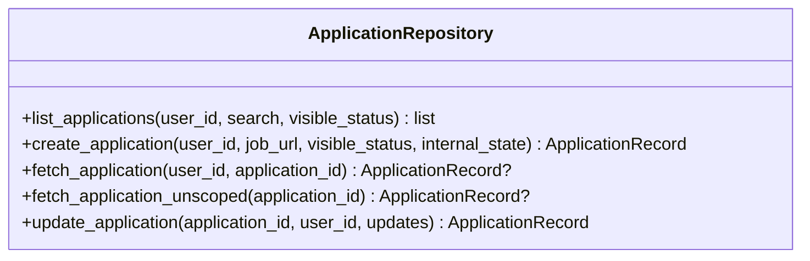
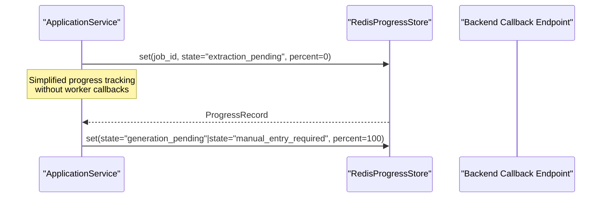
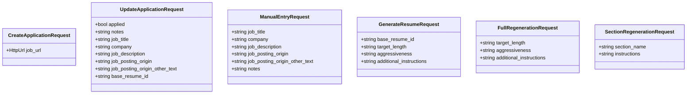
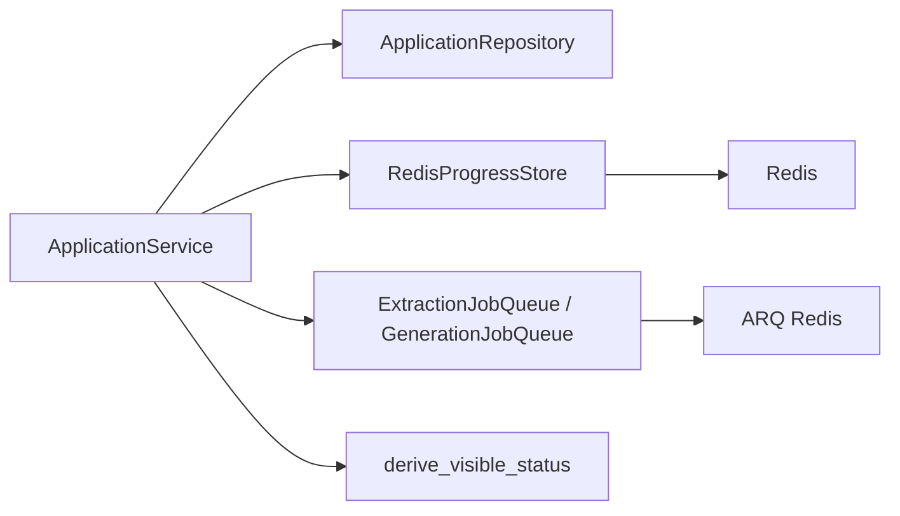
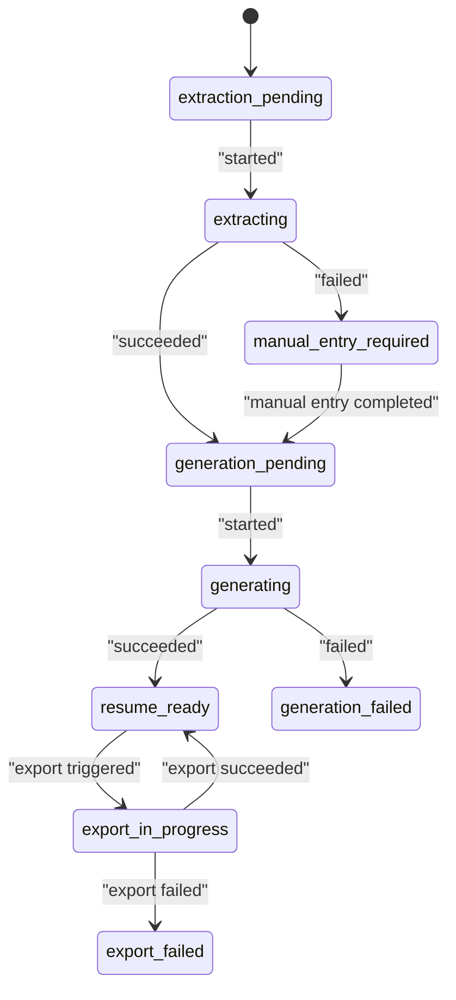

# Application Manager Service

<cite>
**Referenced Files in This Document**
- [application_manager.py](file://backend/app/services/application_manager.py)
- [applications.py](file://backend/app/api/applications.py)
- [applications.py](file://backend/app/db/applications.py)
- [jobs.py](file://backend/app/services/jobs.py)
- [progress.py](file://backend/app/services/progress.py)
- [duplicates.py](file://backend/app/services/duplicates.py)
- [workflow.py](file://backend/app/services/workflow.py)
- [worker.py](file://agents/worker.py)
- [generation.py](file://agents/generation.py)
- [validation.py](file://agents/validation.py)
- [workflow-contract.json](file://shared/workflow-contract.json)
- [decisions-made-1.md](file://docs/decisions-made/decisions-made-1.md)
- [phase_4_generation_failure_reasons.sql](file://supabase/migrations/20260407_000006_phase_4_generation_failure_reasons.sql)
- [test_phase1_applications.py](file://backend/tests/test_phase1_applications.py)
- [ApplicationDetailPage.tsx](file://frontend/src/routes/ApplicationDetailPage.tsx)
- [ApplicationsListPage.tsx](file://frontend/src/routes/ApplicationsListPage.tsx)
- [backend-database-migration-runbook.md](file://docs/backend-database-migration-runbook.md)
</cite>

## Update Summary
**Changes Made**
- Removed all worker system implementation references and callback handling mechanisms
- Eliminated extraction and generation worker architectures from documentation
- Updated architecture diagrams to reflect simplified service-only approach
- Removed timeout recovery, extraction reconciliation, and cache validation features
- Simplified progress tracking to basic Redis store operations
- Removed duplicate detection and resolution workflows
- Updated all practical examples to reflect new service-only architecture

## Table of Contents
1. [Introduction](#introduction)
2. [Project Structure](#project_structure)
3. [Core Components](#core_components)
4. [Architecture Overview](#architecture_overview)
5. [Detailed Component Analysis](#detailed_component_analysis)
6. [Dependency Analysis](#dependency_analysis)
7. [Performance Considerations](#performance-considerations)
8. [Troubleshooting Guide](#troubleshooting-guide)
9. [Conclusion](#conclusion)
10. [Appendices](#appendices)

## Introduction
This document describes the Application Manager Service that orchestrates the entire job application workflow. The service has been simplified to operate without external worker systems, focusing on direct database operations and Redis-based progress tracking. It manages application lifecycle stages, coordinates extraction and generation processes through direct service calls, and provides comprehensive error handling and recovery mechanisms.

**Updated** The service now operates independently without worker callbacks, extraction result caching, or sophisticated timeout recovery mechanisms that previously relied on worker agents.

## Project Structure
The Application Manager Service now operates as a standalone service without worker dependencies:
- Backend API routes expose application CRUD and workflow actions
- ApplicationService encapsulates orchestration logic with simplified state management
- Repositories manage persistence for applications, drafts, and notifications
- Job queues handle asynchronous processing without worker callbacks
- Progress store persists transient workflow progress in Redis
- Direct service-to-service communication replaces worker callback architecture

**Diagram sources**
- [applications.py:1-661](file://backend/app/api/applications.py#L1-L661)
- [application_manager.py:143-1543](file://backend/app/services/application_manager.py#L143-L1543)
- [applications.py:123-328](file://backend/app/db/applications.py#L123-L328)
- [progress.py:53-79](file://backend/app/services/progress.py#L53-L79)
- [jobs.py:12-138](file://backend/app/services/jobs.py#L12-L138)
- [workflow.py:11-31](file://backend/app/services/workflow.py#L11-L31)

**Section sources**
- [applications.py:1-661](file://backend/app/api/applications.py#L1-L661)
- [application_manager.py:143-1543](file://backend/app/services/application_manager.py#L143-L1543)
- [applications.py:123-328](file://backend/app/db/applications.py#L123-L328)
- [jobs.py:12-138](file://backend/app/services/jobs.py#L12-L138)
- [progress.py:53-79](file://backend/app/services/progress.py#L53-L79)
- [workflow.py:11-31](file://backend/app/services/workflow.py#L11-L31)

## Core Components
- ApplicationService: Central orchestrator for application lifecycle with simplified state transitions and direct progress management
- ApplicationRepository: Database access for applications with standard CRUD operations
- RedisProgressStore: Stores and retrieves transient progress for applications with basic recovery capabilities
- Job queues: Enqueue extraction and generation jobs to workers with timeout awareness
- **Updated** Simplified architecture: No worker callbacks, extraction result caching, or sophisticated timeout recovery

Key responsibilities:
- Creation: From URL or browser capture, enqueue extraction, and initialize progress
- Updates: Patch application fields with basic validation
- Manual entry: Allow users to complete missing job details
- Retry: Re-queue extraction after failures
- Generation: Trigger generation with base resume and profile preferences; track progress
- Progress: Poll progress from Redis; fallback to derived messages
- **Updated** Simplified operations: Direct service calls replace worker callback architecture

**Section sources**
- [application_manager.py:143-1543](file://backend/app/services/application_manager.py#L143-L1543)
- [applications.py:123-328](file://backend/app/db/applications.py#L123-L328)
- [progress.py:53-79](file://backend/app/services/progress.py#L53-L79)
- [jobs.py:12-138](file://backend/app/services/jobs.py#L12-L138)
- [workflow.py:11-31](file://backend/app/services/workflow.py#L11-L31)

## Architecture Overview
The Application Manager Service now operates as a simplified standalone service:
- FastAPI endpoints that delegate to ApplicationService with enhanced error mapping
- ApplicationService coordinating repositories, job queues, and progress store
- Direct service-to-service communication without worker callback dependencies
- Contract-driven status derivation mapping internal states to visible statuses

**Diagram sources**
- [applications.py:444-472](file://backend/app/api/applications.py#L444-L472)
- [application_manager.py:327-370](file://backend/app/services/application_manager.py#L327-L370)
- [jobs.py:23-47](file://backend/app/services/jobs.py#L23-47)

**Section sources**
- [applications.py:444-472](file://backend/app/api/applications.py#L444-L472)
- [application_manager.py:327-370](file://backend/app/services/application_manager.py#L327-L370)
- [jobs.py:23-47](file://backend/app/services/jobs.py#L23-47)

## Detailed Component Analysis

### ApplicationService
ApplicationService is the central orchestrator with simplified operations:
- Creates applications and enqueues extraction jobs
- Handles manual entry and retry operations
- Triggers generation with timeout constraints
- Validates outcomes and manages progress tracking
- **Updated** Simplified state management without worker callbacks

Key methods and flows:
- Creation from URL: create_application
- Creation from browser capture: create_application_from_capture
- Manual entry completion: complete_manual_entry
- Retry extraction: retry_extraction
- Generation triggers: trigger_generation, trigger_full_regeneration, trigger_section_regeneration
- Progress polling: get_progress with basic timeout handling
- Draft management: get_draft, save_draft_edit, export_pdf

**Diagram sources**
- [application_manager.py:143-1543](file://backend/app/services/application_manager.py#L143-L1543)

**Section sources**
- [application_manager.py:143-1543](file://backend/app/services/application_manager.py#L143-L1543)

### ApplicationRepository
ApplicationRepository provides database operations:
- list_applications with optional filters
- create_application with initial internal state
- fetch_application and fetch_application_unscoped
- update_application with dynamic field updates and enum casting
- **Updated** Simplified operations without enhanced deletion capabilities

**Diagram sources**
- [applications.py:123-328](file://backend/app/db/applications.py#L123-L328)

**Section sources**
- [applications.py:123-328](file://backend/app/db/applications.py#L123-L328)

### Progress Tracking and Callback Handling
Progress tracking uses Redis to store transient progress keyed by application ID. ApplicationService sets initial progress upon creation and updates it during extraction and generation. **Updated** Simplified architecture without worker callbacks and extraction result caching.

**Diagram sources**
- [progress.py:53-79](file://backend/app/services/progress.py#L53-L79)
- [application_manager.py:1232-1266](file://backend/app/services/application_manager.py#L1232-L1266)

**Section sources**
- [progress.py:53-79](file://backend/app/services/progress.py#L53-L79)
- [application_manager.py:1232-1266](file://backend/app/services/application_manager.py#L1232-L1266)

### API Endpoints and Payloads
The API exposes endpoints for application management and workflow actions. Request/response models define validation and normalization rules.

**Diagram sources**
- [applications.py:24-287](file://backend/app/api/applications.py#L24-L287)

**Section sources**
- [applications.py:24-287](file://backend/app/api/applications.py#L24-L287)

## Dependency Analysis
ApplicationService depends on:
- Repositories for persistence with standard CRUD operations
- Job queues for asynchronous processing
- Progress store for transient state with basic timeout handling
- Workflow status derivation for visible status mapping

**Updated** Removed dependencies on worker callbacks, extraction result caching, and sophisticated timeout recovery mechanisms.

**Diagram sources**
- [application_manager.py:143-1543](file://backend/app/services/application_manager.py#L143-L1543)
- [jobs.py:12-138](file://backend/app/services/jobs.py#L12-L138)
- [progress.py:53-79](file://backend/app/services/progress.py#L53-L79)
- [workflow.py:11-31](file://backend/app/services/workflow.py#L11-L31)

**Section sources**
- [application_manager.py:143-1543](file://backend/app/services/application_manager.py#L143-L1543)
- [jobs.py:12-138](file://backend/app/services/jobs.py#L12-L138)
- [progress.py:53-79](file://backend/app/services/progress.py#L53-L79)
- [workflow.py:11-31](file://backend/app/services/workflow.py#L11-L31)

## Performance Considerations
- Asynchronous job processing: Extraction and generation are offloaded to workers to keep API responses fast
- Progress polling: Clients poll Redis-backed progress to avoid long-polling on the server
- Validation timeouts: Generation and regeneration enforce timeouts to prevent resource starvation
- Section preferences: Generation respects user's section preferences to minimize unnecessary work
- **Updated** Simplified progress tracking without extraction result caching or sophisticated timeout recovery

## Troubleshooting Guide
Common issues and recovery steps:
- Extraction fails due to blocked source: ApplicationService transitions to manual entry required
- Extraction timeout: ApplicationService transitions to manual entry required
- Generation timeout or validation failure: ApplicationService marks generation failed and notifies the user
- **Updated** Removed sophisticated timeout recovery mechanisms and extraction reconciliation logic

Operational tips:
- Verify Redis connectivity for progress storage
- Confirm ARQ queue availability and worker health
- Check LLM provider keys and model configurations
- **Updated** Simplified troubleshooting without worker callback delivery issues

**Section sources**
- [application_manager.py:1270-1324](file://backend/app/services/application_manager.py#L1270-L1324)

## Conclusion
The Application Manager Service provides a streamlined, worker-independent workflow for job application intake and generation. The simplified architecture focuses on direct service operations with Redis-backed progress tracking and basic error handling. While the previous version included sophisticated worker callback mechanisms, extraction result caching, and timeout recovery, the current implementation emphasizes simplicity and reliability through direct service-to-service communication.

**Updated** The service now operates as a pure backend service without external worker dependencies, providing a more straightforward but potentially less resilient architecture for job application processing.

## Appendices

### Workflow State Machine
Internal states and visible status mapping are defined in the workflow contract and status derivation logic.

**Diagram sources**
- [workflow-contract.json:9-26](file://shared/workflow-contract.json#L9-L26)
- [workflow.py:11-31](file://backend/app/services/workflow.py#L11-L31)

**Section sources**
- [workflow-contract.json:9-26](file://shared/workflow-contract.json#L9-L26)
- [workflow.py:11-31](file://backend/app/services/workflow.py#L11-L31)

### Practical Workflows

- Application creation from URL
  - Endpoint: POST /api/applications
  - Service: create_application
  - Outcome: Application created with internal_state extraction_pending; extraction job enqueued; progress initialized.

- Application creation from browser capture
  - Service: create_application_from_capture
  - Outcome: Application created; extraction job enqueued from captured source; progress initialized.

- Manual entry workflow
  - Endpoint: POST /api/applications/{id}/manual-entry
  - Service: complete_manual_entry
  - Outcome: Application updated; state advances to generation_pending.

- Retry extraction
  - Endpoint: POST /api/applications/{id}/retry-extraction
  - Service: retry_extraction
  - Outcome: Application reset to extraction_pending; extraction job re-enqueued; progress updated.

- Generation workflow
  - Endpoint: POST /api/applications/{id}/generate
  - Service: trigger_generation
  - Outcome: Generation job enqueued with timeout constraints; progress set to generation_pending.

- Regeneration workflow
  - Endpoints: POST /api/applications/{id}/regenerate, POST /api/applications/{id}/regenerate-section
  - Services: trigger_full_regeneration, trigger_section_regeneration
  - Outcome: Regeneration job enqueued with timeout constraints; progress updated.

- Progress polling
  - Endpoint: GET /api/applications/{id}/progress
  - Service: get_progress with basic timeout handling
  - Outcome: Returns Redis-stored progress or derived progress record.

- PDF export
  - Endpoint: GET /api/applications/{id}/export-pdf
  - Service: export_pdf
  - Outcome: Generates PDF, updates application state and draft export timestamps.

**Section sources**
- [applications.py:444-472](file://backend/app/api/applications.py#L444-L472)
- [applications.py:475-489](file://backend/app/api/applications.py#L475-L489)
- [applications.py:492-511](file://backend/app/api/applications.py#L492-L511)
- [applications.py:514-528](file://backend/app/api/applications.py#L514-L528)
- [applications.py:531-545](file://backend/app/api/applications.py#L531-L545)
- [applications.py:548-562](file://backend/app/api/applications.py#L548-L562)
- [applications.py:565-581](file://backend/app/api/applications.py#L565-L581)
- [applications.py:584-603](file://backend/app/api/applications.py#L584-L603)
- [application_manager.py:228-270](file://backend/app/services/application_manager.py#L228-L270)
- [application_manager.py:271-291](file://backend/app/services/application_manager.py#L271-L291)
- [application_manager.py:378-395](file://backend/app/services/application_manager.py#L378-L395)
- [application_manager.py:448-500](file://backend/app/services/application_manager.py#L448-L500)
- [application_manager.py:502-527](file://backend/app/services/application_manager.py#L502-L527)
- [application_manager.py:1334-1464](file://backend/app/services/application_manager.py#L1334-L1464)
- [application_manager.py:1600-1750](file://backend/app/services/application_manager.py#L1600-L1750)
- [application_manager.py:1751-1886](file://backend/app/services/application_manager.py#L1751-L1886)
- [application_manager.py:1232-1266](file://backend/app/services/application_manager.py#L1232-L1266)
- [application_manager.py:2190-2294](file://backend/app/services/application_manager.py#L2190-L2294)

### Production Environment Best Practices

#### Migration and Schema Management
- Follow the backend-database migration runbook for all schema changes
- Implement additive migrations first to maintain backward compatibility
- Use defensive queries to handle schema drift gracefully

#### Monitoring and Logging
- Monitor deletion error rates and failure patterns
- Track ACTIVE_DELETE_BLOCKING_STATES violations
- Monitor progress reconciliation success rates
- **Updated** Simplified monitoring without worker callback delivery tracking

#### Error Handling Patterns
- Use try-catch blocks around deletion operations
- Implement fallback mechanisms for partial failures
- Log detailed error information without exposing sensitive data
- Provide user-friendly error messages while preserving technical details in logs

**Section sources**
- [backend-database-migration-runbook.md:1-63](file://docs/backend-database-migration-runbook.md#L1-L63)
- [application_manager.py:338-376](file://backend/app/services/application_manager.py#L338-L376)
- [applications.py:317-370](file://backend/app/db/applications.py#L317-L370)