# Application Manager Service

<cite>
**Referenced Files in This Document**
- [application_manager.py](file://backend/app/services/application_manager.py)
- [applications.py](file://backend/app/api/applications.py)
- [applications.py](file://backend/app/db/applications.py)
- [jobs.py](file://backend/app/services/jobs.py)
- [progress.py](file://backend/app/services/progress.py)
- [duplicates.py](file://backend/app/services/duplicates.py)
- [workflow.py](file://backend/app/services/workflow.py)
- [worker.py](file://agents/worker.py)
- [generation.py](file://agents/generation.py)
- [validation.py](file://agents/validation.py)
- [workflow-contract.json](file://shared/workflow-contract.json)
- [decisions-made-1.md](file://docs/decisions-made/decisions-made-1.md)
- [phase_4_generation_failure_reasons.sql](file://supabase/migrations/20260407_000006_phase_4_generation_failure_reasons.sql)
- [test_phase1_applications.py](file://backend/tests/test_phase1_applications.py)
- [ApplicationDetailPage.tsx](file://frontend/src/routes/ApplicationDetailPage.tsx)
- [ApplicationsListPage.tsx](file://frontend/src/routes/ApplicationsListPage.tsx)
- [backend-database-migration-runbook.md](file://docs/backend-database-migration-runbook.md)
</cite>

## Update Summary
**Changes Made**
- Enhanced application deletion with proactive dependent row clearing in database layer
- Improved error handling for production environments with graceful degradation
- Better resilience against schema drift through defensive database operations
- Added ACTIVE_DELETE_BLOCKING_STATES protection to prevent deletion during active work
- Enhanced progress reconciliation during deletion with comprehensive error handling

## Table of Contents
1. [Introduction](#introduction)
2. [Project Structure](#project_structure)
3. [Core Components](#core_components)
4. [Architecture Overview](#architecture_overview)
5. [Detailed Component Analysis](#detailed_component_analysis)
6. [Dependency Analysis](#dependency_analysis)
7. [Performance Considerations](#performance-considerations)
8. [Troubleshooting Guide](#troubleshooting-guide)
9. [Conclusion](#conclusion)
10. [Appendices](#appendices)

## Introduction
This document describes the Application Manager Service that orchestrates the entire job application workflow. It manages application lifecycle stages, coordinates extraction and generation jobs, detects and resolves duplicates, tracks progress via Redis, and handles worker callbacks. The service now includes sophisticated stuck generation recovery mechanisms with dual-timing approach featuring separate idle timeout and maximum wall-clock timeout parameters for both full generation and section regeneration workflows. Additionally, it features enhanced extraction progress reconciliation with backend reconciliation logic for terminal states, comprehensive extraction result caching capabilities, and robust application deletion with proactive dependent row clearing.

## Project Structure
The Application Manager Service spans backend APIs, services, repositories, and worker agents:
- Backend API routes expose application CRUD and workflow actions including enhanced deletion handling.
- ApplicationService encapsulates orchestration logic with enhanced timeout handling, extraction reconciliation, extraction result caching, and resilient deletion operations.
- Repositories manage persistence for applications, drafts, and notifications with proactive dependent row clearing.
- Job queues enqueue asynchronous tasks for extraction and generation.
- Workers execute jobs and report progress and outcomes with timeout awareness and extraction result caching.
- Progress store persists transient workflow progress in Redis with recovery mechanisms and extraction result caching.
- Duplicate detector evaluates potential duplicates based on configurable thresholds.

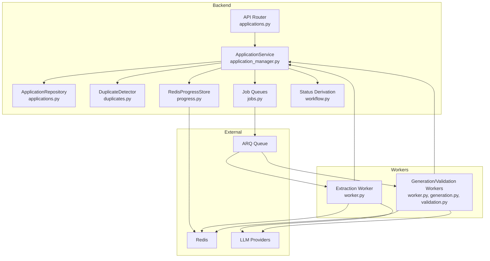

**Diagram sources**
- [applications.py:1-661](file://backend/app/api/applications.py#L1-L661)
- [application_manager.py:143-1543](file://backend/app/services/application_manager.py#L143-L1543)
- [applications.py:123-328](file://backend/app/db/applications.py#L123-L328)
- [duplicates.py:79-184](file://backend/app/services/duplicates.py#L79-L184)
- [progress.py:53-79](file://backend/app/services/progress.py#L53-L79)
- [jobs.py:12-138](file://backend/app/services/jobs.py#L12-L138)
- [workflow.py:11-31](file://backend/app/services/workflow.py#L11-L31)
- [worker.py:526-1236](file://agents/worker.py#L526-L1236)
- [generation.py:159-351](file://agents/generation.py#L159-L351)
- [validation.py:231-292](file://agents/validation.py#L231-L292)

**Section sources**
- [applications.py:1-661](file://backend/app/api/applications.py#L1-L661)
- [application_manager.py:143-1543](file://backend/app/services/application_manager.py#L143-L1543)
- [applications.py:123-328](file://backend/app/db/applications.py#L123-L328)
- [jobs.py:12-138](file://backend/app/services/jobs.py#L12-L138)
- [progress.py:53-79](file://backend/app/services/progress.py#L53-L79)
- [duplicates.py:79-184](file://backend/app/services/duplicates.py#L79-L184)
- [workflow.py:11-31](file://backend/app/services/workflow.py#L11-L31)
- [worker.py:526-1236](file://agents/worker.py#L526-L1236)
- [generation.py:159-351](file://agents/generation.py#L159-L351)
- [validation.py:231-292](file://agents/validation.py#L231-L292)

## Core Components
- ApplicationService: Central orchestrator for application lifecycle, state transitions, duplicate detection, progress tracking, worker callbacks, sophisticated stuck generation recovery with dual-timing timeout mechanisms, enhanced extraction progress reconciliation with extraction result caching, and resilient deletion operations with blocking state protection.
- ApplicationRepository: Database access for applications, including listing, creating, fetching, updating, and enhanced deletion with proactive dependent row clearing.
- DuplicateDetector: Evaluates potential duplicates using similarity thresholds and match basis heuristics.
- RedisProgressStore: Stores and retrieves transient progress for applications with recovery capabilities and extraction result caching.
- Job queues: Enqueue extraction and generation/regeneration jobs to workers with timeout awareness.
- Worker agents: Execute extraction, generation, and validation with individual timeout constraints and comprehensive error handling including extraction result caching.

Key responsibilities:
- Creation: From URL or browser capture, enqueue extraction, and initialize progress.
- Updates: Patch application fields; trigger duplicate resolution when relevant fields change.
- Manual entry: Allow users to complete missing job details.
- Retry: Re-queue extraction after failures.
- Generation: Trigger generation with base resume and profile preferences; track progress and outcomes with timeout recovery.
- Regeneration: Full or section-specific regeneration with validation and timeout-aware recovery.
- Progress: Poll progress from Redis; fallback to derived messages with recovery mechanisms including terminal extraction reconciliation with cache validation.
- Callbacks: Handle worker events to update state and notify users with timeout handling.
- Timeout Recovery: Detect and recover from stuck generation jobs using dual-timing approach.
- **Enhanced**: Extraction reconciliation: Handle cases where extraction callbacks fail to deliver but extraction completes successfully using extraction result cache validation.
- **Enhanced**: Extraction result caching: Store extraction payloads in Redis cache for recovery when callback delivery fails.
- **Enhanced**: Resilient deletion: Proactive dependent row clearing with graceful error handling and schema drift protection.

**Section sources**
- [application_manager.py:143-1543](file://backend/app/services/application_manager.py#L143-L1543)
- [applications.py:123-328](file://backend/app/db/applications.py#L123-L328)
- [duplicates.py:79-184](file://backend/app/services/duplicates.py#L79-L184)
- [progress.py:53-79](file://backend/app/services/progress.py#L53-L79)
- [jobs.py:12-138](file://backend/app/services/jobs.py#L12-L138)
- [workflow.py:11-31](file://backend/app/services/workflow.py#L11-L31)

## Architecture Overview
The Application Manager Service integrates:
- FastAPI endpoints that delegate to ApplicationService with enhanced error mapping.
- ApplicationService coordinating repositories, job queues, progress store, and duplicate detection with timeout recovery mechanisms, extraction reconciliation, and resilient deletion operations.
- Workers consuming jobs from ARQ queues, reporting progress to Redis, caching extraction results, and invoking LLM providers with individual timeout constraints.
- Contract-driven status derivation mapping internal states to visible statuses with timeout-aware transitions.

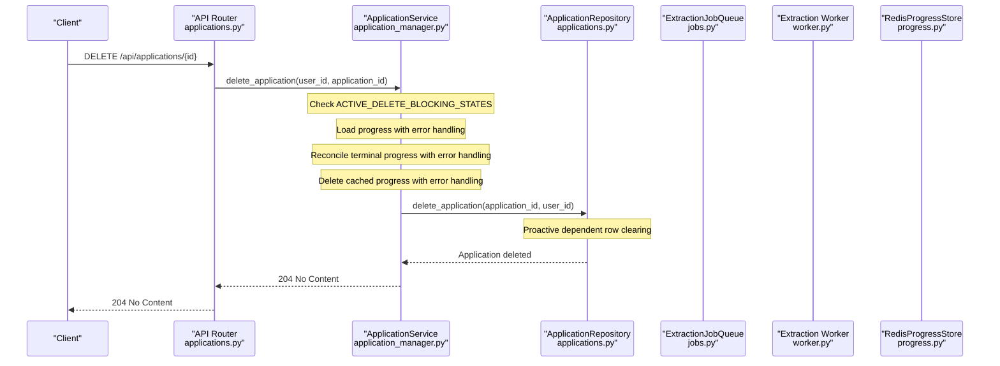

**Diagram sources**
- [applications.py:514-528](file://backend/app/api/applications.py#L514-L528)
- [application_manager.py:338-376](file://backend/app/services/application_manager.py#L338-L376)
- [applications.py:317-370](file://backend/app/db/applications.py#L317-L370)

**Section sources**
- [applications.py:514-528](file://backend/app/api/applications.py#L514-L528)
- [application_manager.py:338-376](file://backend/app/services/application_manager.py#L338-L376)
- [applications.py:317-370](file://backend/app/db/applications.py#L317-L370)

## Detailed Component Analysis

### ApplicationService
ApplicationService is the central orchestrator with enhanced timeout recovery capabilities, extraction reconciliation, and resilient deletion operations. It:
- Creates applications and enqueues extraction jobs.
- Handles manual entry, retries, recovery from captures, and duplicate resolution.
- Triggers generation and regeneration with timeout-aware processing.
- Validates outcomes, updates progress, and manages sophisticated stuck generation recovery.
- Processes worker callbacks to advance state and notify users with timeout handling.
- Derives visible status from internal state and failure reasons with timeout awareness.
- **Enhanced**: Performs terminal extraction progress reconciliation to handle callback delivery failures using extraction result cache validation.
- **Enhanced**: Validates extraction result cache before applying cached extraction data to ensure job ID consistency.
- **Enhanced**: Implements ACTIVE_DELETE_BLOCKING_STATES protection to prevent deletion during active work.
- **Enhanced**: Provides graceful error handling during deletion with progress reconciliation fallback.

Key methods and flows:
- Creation from URL: create_application
- Creation from browser capture: create_application_from_capture
- Manual entry completion: complete_manual_entry
- Retry extraction: retry_extraction
- Recovery from source capture: recover_from_source
- Duplicate resolution: resolve_duplicate
- Generation triggers: trigger_generation, trigger_full_regeneration, trigger_section_regeneration
- Callback handlers: handle_worker_callback, handle_generation_callback, handle_regeneration_callback
- Progress polling: get_progress with automatic timeout recovery and terminal extraction reconciliation with cache validation
- Draft management: get_draft, save_draft_edit, export_pdf
- Timeout recovery: _detect_and_recover_stuck_generation, _recover_stuck_generation_if_needed
- **Enhanced**: Terminal extraction reconciliation: _reconcile_terminal_extraction_progress
- **Enhanced**: Extraction result cache validation: _reconcile_extraction_success_from_progress_cache
- **Enhanced**: Resilient deletion: delete_application with comprehensive error handling

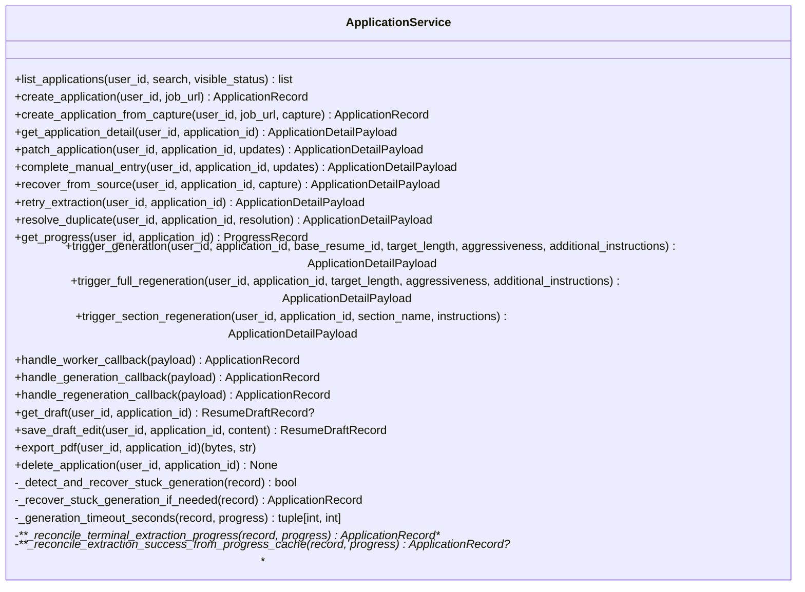

**Diagram sources**
- [application_manager.py:143-1543](file://backend/app/services/application_manager.py#L143-L1543)

**Section sources**
- [application_manager.py:143-1543](file://backend/app/services/application_manager.py#L143-L1543)

### Enhanced Application Deletion with Proactive Dependent Row Clearing
The Application Manager Service now implements robust application deletion with proactive dependent row clearing and enhanced error handling:

#### Active State Protection
The service defines ACTIVE_DELETE_BLOCKING_STATES to prevent deletion during active work:
- extraction_pending: Application is queued for extraction
- extracting: Extraction is currently running
- generation_pending: Application is queued for generation
- generating: Generation is currently running
- regenerating_full: Full regeneration is running
- regenerating_section: Section regeneration is running

#### Proactive Dependent Row Clearing
The database layer now performs comprehensive cleanup during deletion:
- Deletes associated resume drafts for the application
- Clears application_id references in notifications
- Safely handles usage_events table existence with defensive queries
- Removes duplicate references from other applications
- Validates application ownership before deletion

#### Enhanced Error Handling
The deletion process includes comprehensive error handling:
- Graceful progress loading failure with warning logs
- Defensive terminal progress reconciliation with error suppression
- Robust progress cache deletion with fallback continuation
- Schema drift protection through conditional table existence checks

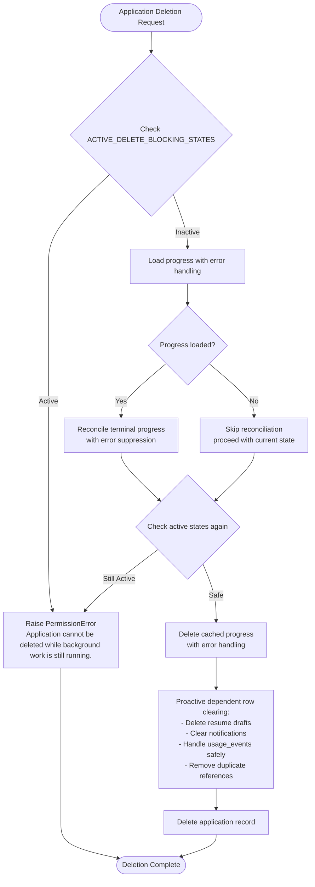

**Diagram sources**
- [application_manager.py:338-376](file://backend/app/services/application_manager.py#L338-L376)
- [applications.py:317-370](file://backend/app/db/applications.py#L317-L370)

#### Key Features of Enhanced Deletion
- **Active State Protection**: Prevents deletion during extraction or generation workflows
- **Proactive Cleanup**: Automatically removes dependent rows to maintain referential integrity
- **Graceful Degradation**: Continues deletion even if progress operations fail
- **Schema Drift Resilience**: Safely handles missing tables and schema changes
- **Ownership Validation**: Ensures proper user scoping before deletion
- **Comprehensive Cleanup**: Handles all dependent entities including notifications and usage events

#### Error Handling Scenarios
- **Progress Loading Failure**: Logs warning and continues with deletion
- **Terminal Progress Reconciliation Failure**: Suppresses errors and proceeds with current state
- **Progress Cache Deletion Failure**: Continues database deletion without cached progress
- **Schema Drift**: Conditional table existence checks prevent crashes
- **Active Work Detection**: Prevents deletion during extraction or generation

**Section sources**
- [application_manager.py:338-376](file://backend/app/services/application_manager.py#L338-L376)
- [applications.py:317-370](file://backend/app/db/applications.py#L317-L370)
- [test_phase1_applications.py:910-937](file://backend/tests/test_phase1_applications.py#L910-L937)

### Enhanced Extraction Progress Reconciliation
The Application Manager Service now includes sophisticated extraction progress reconciliation with backend reconciliation logic for terminal states and extraction result caching:

#### Terminal Extraction Progress Reconciliation
The `_reconcile_terminal_extraction_progress` method handles cases where extraction callbacks fail to deliver but extraction completes successfully:

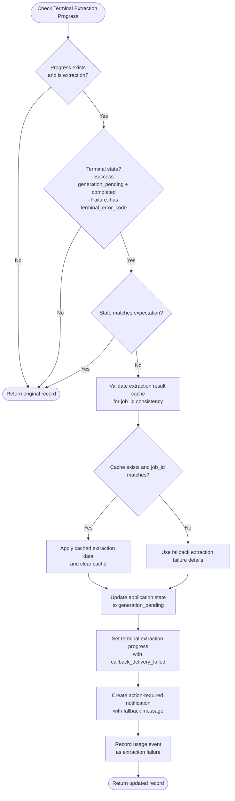

**Diagram sources**
- [application_manager.py:802-934](file://backend/app/services/application_manager.py#L802-L934)

#### Extraction Result Cache Validation
The `_reconcile_extraction_success_from_progress_cache` method provides robust extraction result caching with validation:

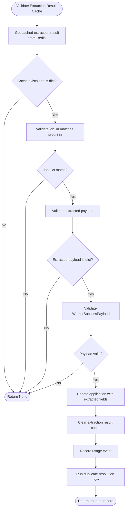

**Diagram sources**
- [application_manager.py:936-990](file://backend/app/services/application_manager.py#L936-L990)

#### Key Features of Enhanced Extraction Reconciliation
- **Success Case Handling**: Detects when extraction completes successfully but callback fails to synchronize
- **Cache Validation**: Validates extraction result cache with job ID consistency checks before applying cached data
- **Failure Case Handling**: Handles various extraction failure scenarios with appropriate error codes
- **State Synchronization**: Ensures application state matches progress state even when callbacks are delayed
- **Fallback Mechanisms**: Provides clear user-facing messages for extraction completion synchronization failures
- **Usage Tracking**: Records extraction failures appropriately for analytics and monitoring
- **Robust Error Handling**: Comprehensive validation and error handling for cached extraction payloads

#### Error Handling Scenarios
- **Callback Delivery Failed**: Extraction completed but callback couldn't be delivered
- **Blocked Source**: Extraction blocked by source website
- **User Cancelled**: User intentionally stopped extraction
- **Other Failures**: Various other extraction failure conditions
- **Cache Validation Failed**: Cached extraction payload invalid or job ID mismatch

**Section sources**
- [application_manager.py:802-934](file://backend/app/services/application_manager.py#L802-L934)
- [application_manager.py:936-990](file://backend/app/services/application_manager.py#L936-L990)
- [test_phase1_applications.py:2172-2263](file://backend/tests/test_phase1_applications.py#L2172-L2263)

### Enhanced Timeout Recovery Mechanisms
The Application Manager Service now implements sophisticated stuck generation recovery with dual-timing approach:

#### Dual-Timing Timeout Parameters
- **Full Generation Workflows**: 240-second idle timeout with 540-second maximum wall-clock cap
- **Section Regeneration Workflows**: 120-second idle timeout with 280-second maximum wall-clock cap

#### Timeout Detection Logic
The system monitors two critical metrics:
- **Idle Timeout**: Time since last progress update indicates job stall
- **Maximum Wall-Clock Timeout**: Absolute time limit prevents indefinite hanging

#### Recovery Process
When timeouts are detected:
1. System identifies target state (generation_pending for initial generation, resume_ready for regeneration)
2. Sets terminal progress with appropriate error code (generation_timeout or regeneration_failed)
3. Creates action-required notification for user
4. Prevents stale worker callbacks from overwriting recovery state

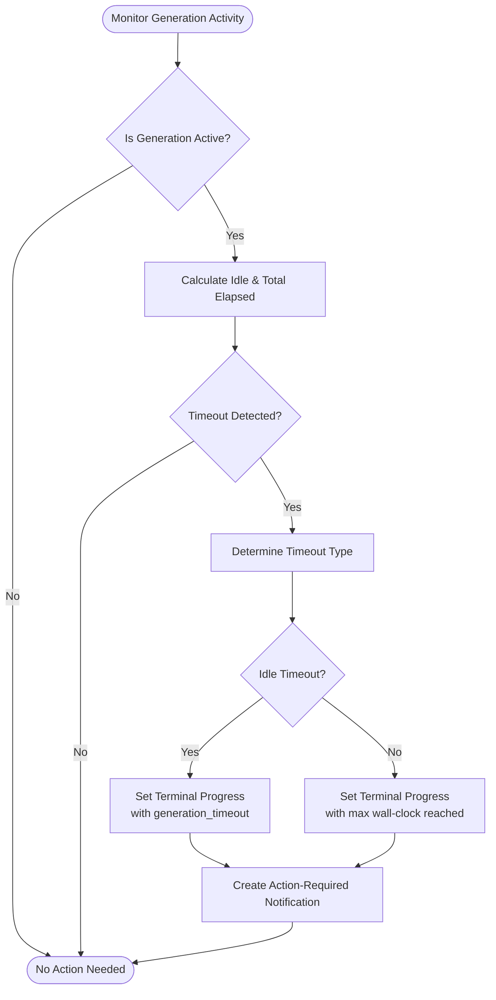

**Diagram sources**
- [application_manager.py:608-642](file://backend/app/services/application_manager.py#L608-L642)
- [application_manager.py:2364-2378](file://backend/app/services/application_manager.py#L2364-L2378)

**Section sources**
- [application_manager.py:608-642](file://backend/app/services/application_manager.py#L608-L642)
- [application_manager.py:2364-2378](file://backend/app/services/application_manager.py#L2364-L2378)
- [decisions-made-1.md:3-11](file://docs/decisions-made/decisions-made-1.md#L3-L11)

### ApplicationRepository
ApplicationRepository provides database operations with enhanced deletion capabilities:
- list_applications with optional filters
- create_application with initial internal state
- fetch_application and fetch_application_unscoped
- update_application with dynamic field updates and enum casting
- fetch_duplicate_candidates and fetch_matched_application
- **Enhanced**: delete_application with proactive dependent row clearing and schema drift protection

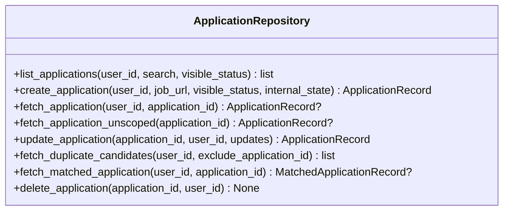

**Diagram sources**
- [applications.py:123-328](file://backend/app/db/applications.py#L123-L328)
- [applications.py:317-370](file://backend/app/db/applications.py#L317-L370)

**Section sources**
- [applications.py:123-328](file://backend/app/db/applications.py#L123-L328)
- [applications.py:317-370](file://backend/app/db/applications.py#L317-L370)

### Duplicate Detection
DuplicateDetector evaluates potential duplicates using:
- Normalized similarity between job title/company
- Reference ID extraction from URL or description
- Origin matching and description similarity thresholds
- Match basis classification (exact URL, exact reference ID, origin+description, etc.)

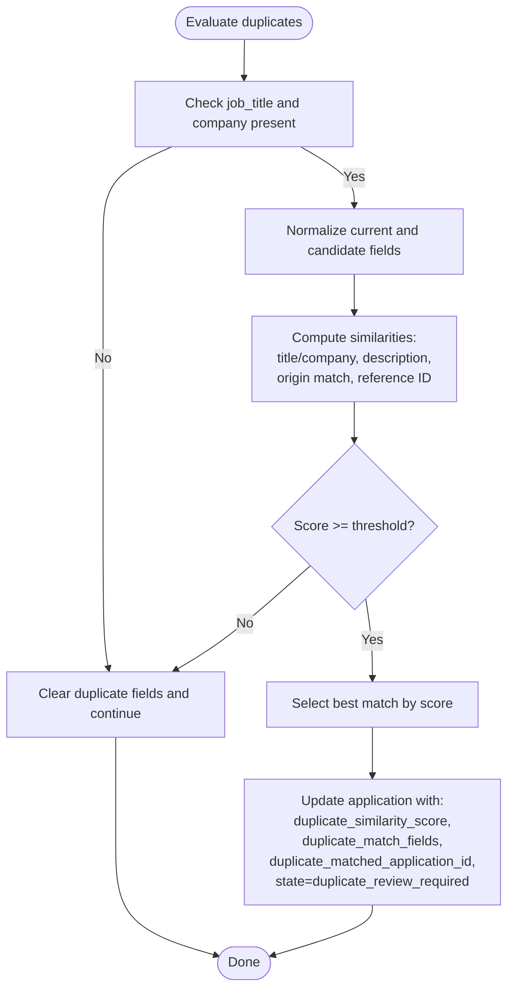

**Diagram sources**
- [duplicates.py:79-184](file://backend/app/services/duplicates.py#L79-L184)
- [application_manager.py:1185-1268](file://backend/app/services/application_manager.py#L1185-L1268)

**Section sources**
- [duplicates.py:79-184](file://backend/app/services/duplicates.py#L79-L184)
- [application_manager.py:1185-1268](file://backend/app/services/application_manager.py#L1185-L1268)

### Enhanced Progress Tracking and Callback Handling
Progress tracking uses Redis to store transient progress keyed by application ID. ApplicationService sets initial progress upon creation and updates it during extraction and generation. Worker agents report progress and outcomes via callbacks with timeout awareness and cache extraction results. The service now includes terminal extraction reconciliation with extraction result cache validation to handle callback delivery failures.

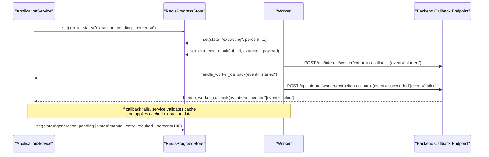

**Diagram sources**
- [progress.py:53-79](file://backend/app/services/progress.py#L53-L79)
- [application_manager.py:1103-1137](file://backend/app/services/application_manager.py#L1103-L1137)
- [worker.py:388-401](file://agents/worker.py#L388-L401)

**Section sources**
- [progress.py:53-79](file://backend/app/services/progress.py#L53-L79)
- [application_manager.py:1103-1137](file://backend/app/services/application_manager.py#L1103-L1137)
- [worker.py:388-401](file://agents/worker.py#L388-L401)

### Generation and Regeneration Workflows
Generation and regeneration are handled by worker agents with timeout awareness:
- Generation: Generate sections, validate, assemble, and produce a resume with timeout constraints.
- Regeneration: Full or section-specific regeneration with validation, draft updates, and timeout recovery.

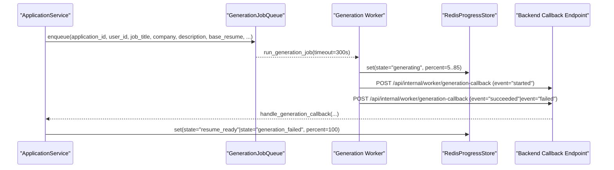

**Diagram sources**
- [jobs.py:49-85](file://backend/app/services/jobs.py#L49-L85)
- [worker.py:682-880](file://agents/worker.py#L682-L880)
- [application_manager.py:1291-1422](file://backend/app/services/application_manager.py#L1291-L1422)

**Section sources**
- [jobs.py:49-85](file://backend/app/services/jobs.py#L49-L85)
- [worker.py:682-880](file://agents/worker.py#L682-L880)
- [application_manager.py:1291-1422](file://backend/app/services/application_manager.py#L1291-L1422)

### API Endpoints and Payloads
The API exposes endpoints for application management and workflow actions. Request/response models define validation and normalization rules.

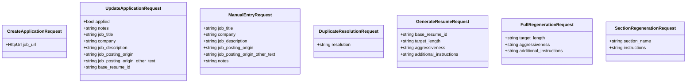

**Diagram sources**
- [applications.py:24-287](file://backend/app/api/applications.py#L24-L287)

**Section sources**
- [applications.py:24-287](file://backend/app/api/applications.py#L24-L287)

## Dependency Analysis
ApplicationService depends on:
- Repositories for persistence with enhanced deletion capabilities
- Job queues for asynchronous processing
- Progress store for transient state with timeout recovery, extraction reconciliation, extraction result caching, and resilient deletion support
- Duplicate detector for duplicate evaluation
- Workflow status derivation for visible status mapping
- Worker agents with timeout-aware processing and extraction result caching

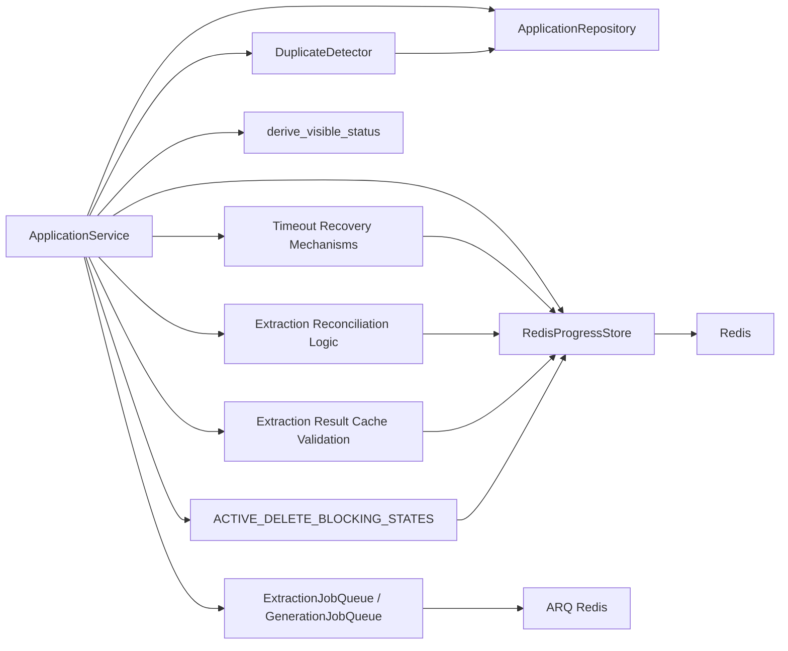

**Diagram sources**
- [application_manager.py:143-1543](file://backend/app/services/application_manager.py#L143-L1543)
- [jobs.py:12-138](file://backend/app/services/jobs.py#L12-L138)
- [progress.py:53-79](file://backend/app/services/progress.py#L53-L79)
- [duplicates.py:79-184](file://backend/app/services/duplicates.py#L79-L184)
- [workflow.py:11-31](file://backend/app/services/workflow.py#L11-L31)

**Section sources**
- [application_manager.py:143-1543](file://backend/app/services/application_manager.py#L143-L1543)
- [jobs.py:12-138](file://backend/app/services/jobs.py#L12-L138)
- [progress.py:53-79](file://backend/app/services/progress.py#L53-L79)
- [duplicates.py:79-184](file://backend/app/services/duplicates.py#L79-L184)
- [workflow.py:11-31](file://backend/app/services/workflow.py#L11-L31)

## Performance Considerations
- Asynchronous job processing: Extraction and generation are offloaded to workers to keep API responses fast.
- Progress polling: Clients poll Redis-backed progress to avoid long-polling on the server.
- Validation timeouts: Generation and regeneration enforce timeouts to prevent resource starvation.
- Section preferences: Generation respects user's section preferences to minimize unnecessary work.
- Fallback mechanisms: On extraction failure, the system transitions to manual entry with a terminal error code stored in progress.
- **Enhanced**: Timeout recovery prevents infinite loops in generation workflows with dual-timing approach.
- **Enhanced**: Separate idle and maximum wall-clock timeouts prevent both false positives and resource starvation.
- **Enhanced**: Sophisticated recovery mechanisms ensure stuck jobs are properly terminated and users are notified.
- **Enhanced**: Backend extraction reconciliation reduces user confusion by properly handling callback delivery failures.
- **Enhanced**: Extraction result caching provides reliable fallback when callback delivery fails, improving system resilience.
- **Enhanced**: Cache validation ensures only valid, job-consistent extraction data is applied, preventing data corruption.
- **Enhanced**: Proactive dependent row clearing prevents orphaned records and maintains referential integrity.
- **Enhanced**: Graceful error handling during deletion ensures system stability even with partial failures.
- **Enhanced**: Schema drift protection prevents crashes from missing database objects.

## Troubleshooting Guide
Common issues and recovery steps:
- Extraction fails due to blocked source: Worker reports failure with details; ApplicationService transitions to manual entry required and sets a terminal error code in progress.
- Extraction timeout: Worker reports failure; ApplicationService transitions to manual entry required.
- Generation timeout or validation failure: Worker reports failure; ApplicationService marks generation failed and notifies the user.
- **Enhanced**: Stuck generation detection: System automatically detects stalled jobs and recovers them with appropriate timeout codes.
- **Enhanced**: Dual-timing timeout handling: Different timeout parameters for full generation (240s idle, 540s max) vs section regeneration (120s idle, 280s max).
- **Enhanced**: Extraction callback delivery failure: Backend reconciliation detects successful extraction completion despite missing callbacks, validates cache, and transitions to generation_pending with cached extraction data.
- **Enhanced**: Extraction result cache validation: System validates cached extraction payloads and job IDs before applying cached data to prevent data corruption.
- Export failure: ApplicationService updates state to resume_ready with failure reason and creates an action-required notification.
- **Enhanced**: Application deletion failures: System continues deletion even if progress operations fail, with comprehensive error logging.
- **Enhanced**: Active work prevention: System blocks deletion attempts during extraction or generation to prevent data inconsistency.
- **Enhanced**: Schema drift protection: System handles missing database tables gracefully without crashing.

Operational tips:
- Verify Redis connectivity for progress storage and extraction result caching.
- Confirm ARQ queue availability and worker health.
- Check LLM provider keys and model configurations.
- Review duplicate resolution status before generation.
- **Enhanced**: Monitor timeout recovery logs for stuck job detection and recovery.
- **Enhanced**: Verify timeout parameters are appropriate for your workload patterns.
- **Enhanced**: Monitor extraction reconciliation logs for callback delivery failures and proper state synchronization.
- **Enhanced**: Verify extraction result cache integrity and job ID consistency for reliable fallback mechanisms.
- **Enhanced**: Check ACTIVE_DELETE_BLOCKING_STATES to understand deletion restrictions.
- **Enhanced**: Monitor deletion error logs for graceful degradation scenarios.

**Section sources**
- [application_manager.py:1270-1324](file://backend/app/services/application_manager.py#L1270-L1324)
- [worker.py:645-667](file://agents/worker.py#L645-L667)
- [worker.py:856-905](file://agents/worker.py#L856-L905)
- [application_manager.py:1150-1184](file://backend/app/services/application_manager.py#L1150-L1184)
- [application_manager.py:608-642](file://backend/app/services/application_manager.py#L608-L642)
- [application_manager.py:802-934](file://backend/app/services/application_manager.py#L802-L934)
- [application_manager.py:936-990](file://backend/app/services/application_manager.py#L936-L990)
- [applications.py:317-370](file://backend/app/db/applications.py#L317-L370)

## Conclusion
The Application Manager Service provides a robust, asynchronous workflow for job application intake, extraction, generation, and regeneration. It integrates cleanly with job queues and Redis-backed progress tracking, supports duplicate detection and resolution, and offers comprehensive error handling and recovery. The enhanced timeout recovery mechanisms with dual-timing approach ensure that stuck generation jobs are properly detected and recovered, preventing infinite loops while allowing legitimate long-running operations to complete successfully. The new extraction progress reconciliation logic with extraction result caching provides improved reliability by handling callback delivery failures gracefully, validating cached data for consistency, and ensuring proper state synchronization between application records and progress store. The extraction result cache validation mechanism adds an additional layer of resilience by providing reliable fallback when worker callback delivery fails, while comprehensive error handling prevents data corruption and maintains system integrity.

The enhanced application deletion functionality represents a significant improvement in system reliability and data integrity. Through proactive dependent row clearing, comprehensive error handling, and schema drift protection, the service now provides robust deletion capabilities that maintain referential integrity while gracefully handling edge cases. The ACTIVE_DELETE_BLOCKING_STATES protection prevents deletion during active work, ensuring data consistency and preventing orphaned records. These enhancements make the Application Manager Service more production-ready and resilient against real-world operational challenges.

## Appendices

### Workflow State Machine
Internal states and visible status mapping are defined in the workflow contract and status derivation logic.

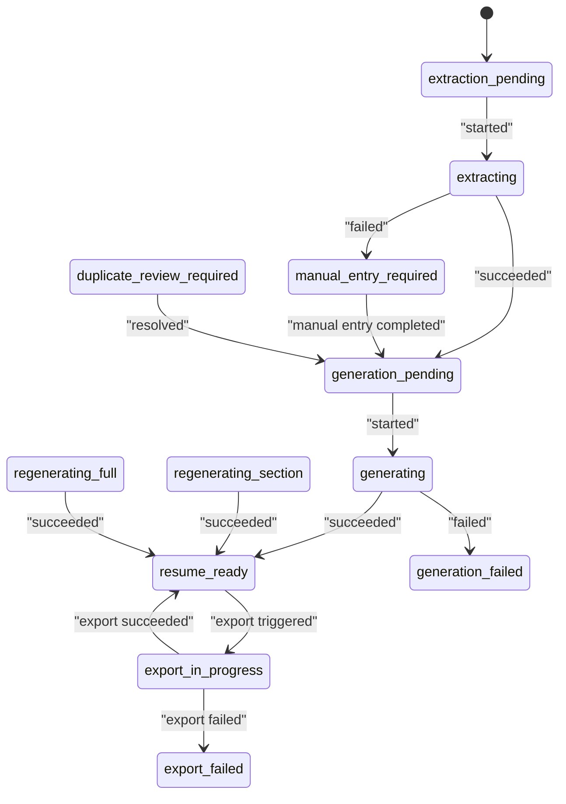

**Diagram sources**
- [workflow-contract.json:9-26](file://shared/workflow-contract.json#L9-L26)
- [workflow.py:11-31](file://backend/app/services/workflow.py#L11-L31)

**Section sources**
- [workflow-contract.json:9-26](file://shared/workflow-contract.json#L9-L26)
- [workflow.py:11-31](file://backend/app/services/workflow.py#L11-L31)

### Enhanced Timeout Recovery Configuration

#### Timeout Parameters
- **Full Generation Workflows**: 
  - Idle Timeout: 240 seconds (no progress updates)
  - Maximum Wall-Clock: 540 seconds (absolute time limit)
- **Section Regeneration Workflows**:
  - Idle Timeout: 120 seconds (no progress updates)
  - Maximum Wall-Clock: 280 seconds (absolute time limit)

#### Error Codes
- **generation_timeout**: Initial generation exceeded idle or maximum timeout
- **generation_cancelled**: User-initiated cancellation
- **regeneration_failed**: Regeneration operation failed (includes timeout)

#### Recovery Behavior
- **Stuck Detection**: Monitors progress timestamps and elapsed time
- **Graceful Recovery**: Sets terminal progress with appropriate error code
- **State Transition**: Moves to generation_pending (initial) or resume_ready (regeneration)
- **User Notification**: Creates action-required notification for timeout recovery

**Section sources**
- [application_manager.py:43-46](file://backend/app/services/application_manager.py#L43-L46)
- [application_manager.py:2364-2378](file://backend/app/services/application_manager.py#L2364-L2378)
- [decisions-made-1.md:3-11](file://docs/decisions-made/decisions-made-1.md#L3-L11)
- [phase_4_generation_failure_reasons.sql:3-4](file://supabase/migrations/20260407_000006_phase_4_generation_failure_reasons.sql#L3-L4)

### Enhanced Extraction Progress Reconciliation Configuration

#### Terminal Extraction States
- **Success Cases**: 
  - `state == "generation_pending"` AND `terminal_error_code is None` AND `completed_at is not None`
  - Indicates extraction completed successfully but callback failed to synchronize
- **Failure Cases**:
  - `terminal_error_code is not None` for extraction progress
  - Various extraction failure scenarios (blocked source, user cancelled, etc.)

#### Extraction Result Cache Validation
- **Cache Storage**: Extraction results stored in Redis with job_id, extracted payload, and captured timestamp
- **Cache Retrieval**: ApplicationService retrieves cached extraction results during reconciliation
- **Job ID Validation**: Ensures cached extraction result matches current progress job_id before applying
- **Payload Validation**: Validates WorkerSuccessPayload structure and required fields
- **Cache Cleanup**: Clears extraction result cache after successful application update

#### Error Details Handling
- **Callback Delivery Failed**: Automatically populated with `kind: "callback_delivery_failed"`
- **Blocked Source**: Uses existing blocked source detection and preserves provider information
- **User Cancelled**: Captures cancellation details with timestamp
- **Other Failures**: Standard extraction failure details with reference ID and blocked URL

#### Fallback Messages
- **Extraction Completion Sync Failure**: "Extraction finished, but results could not be synchronized. Retry extraction or complete manual entry."
- **User-Facing Error Messages**: Clear guidance for users on next steps

**Section sources**
- [application_manager.py:802-934](file://backend/app/services/application_manager.py#L802-L934)
- [application_manager.py:936-990](file://backend/app/services/application_manager.py#L936-L990)
- [test_phase1_applications.py:2172-2263](file://backend/tests/test_phase1_applications.py#L2172-L2263)
- [ApplicationDetailPage.tsx:385-405](file://frontend/src/routes/ApplicationDetailPage.tsx#L385-L405)

### Enhanced Application Deletion Configuration

#### ACTIVE_DELETE_BLOCKING_STATES
The service prevents deletion during these active states:
- extraction_pending: Application is queued for extraction
- extracting: Extraction is currently running
- generation_pending: Application is queued for generation
- generating: Generation is currently running
- regenerating_full: Full regeneration is running
- regenerating_section: Section regeneration is running

#### Proactive Dependent Row Clearing
During deletion, the system automatically cleans up:
- **Resume Drafts**: Deletes all associated draft records
- **Notifications**: Clears application_id references from notifications
- **Usage Events**: Safely handles usage_events table existence
- **Duplicate References**: Removes duplicate_matched_application_id from other applications

#### Error Handling During Deletion
The deletion process includes comprehensive error handling:
- **Progress Loading Failure**: Logs warning and continues with deletion
- **Terminal Progress Reconciliation Failure**: Suppresses errors and proceeds with current state
- **Progress Cache Deletion Failure**: Continues database deletion without cached progress
- **Schema Drift Protection**: Conditional table existence checks prevent crashes

#### Frontend Integration
The frontend provides enhanced user experience:
- **Bulk Deletion**: Supports batch deletion with error handling and feedback
- **Row Actions**: Individual deletion with confirmation dialogs
- **Error Messaging**: Clear error messages for failed operations
- **Loading States**: Proper loading indicators during deletion operations

**Section sources**
- [application_manager.py:338-376](file://backend/app/services/application_manager.py#L338-L376)
- [applications.py:317-370](file://backend/app/db/applications.py#L317-L370)
- [ApplicationsListPage.tsx:289-326](file://frontend/src/routes/ApplicationsListPage.tsx#L289-L326)

### Practical Workflows

- Application creation from URL
  - Endpoint: POST /api/applications
  - Service: create_application
  - Outcome: Application created with internal_state extraction_pending; extraction job enqueued; progress initialized.

- Application creation from browser capture
  - Service: create_application_from_capture
  - Outcome: Application created; extraction job enqueued from captured source; progress initialized.

- Manual entry workflow
  - Endpoint: POST /api/applications/{id}/manual-entry
  - Service: complete_manual_entry
  - Outcome: Application updated; duplicate resolution flow runs; state advances to generation_pending if applicable.

- Retry extraction
  - Endpoint: POST /api/applications/{id}/retry-extraction
  - Service: retry_extraction
  - Outcome: Application reset to extraction_pending; extraction job re-enqueued; progress updated.

- Duplicate resolution process
  - Service: resolve_duplicate
  - Outcome: Application state transitions to generation_pending; action-required notification cleared.

- Generation workflow
  - Endpoint: POST /api/applications/{id}/generate
  - Service: trigger_generation
  - Outcome: Generation job enqueued with timeout constraints; progress set to generation_pending; worker validates and assembles resume.

- Regeneration workflow
  - Endpoints: POST /api/applications/{id}/regenerate, POST /api/applications/{id}/regenerate-section
  - Services: trigger_full_regeneration, trigger_section_regeneration
  - Outcome: Regeneration job enqueued with timeout constraints; progress updated; validation performed; draft updated.

- Progress polling
  - Endpoint: GET /api/applications/{id}/progress
  - Service: get_progress with automatic timeout recovery and terminal extraction reconciliation with cache validation
  - Outcome: Returns Redis-stored progress or derived progress record; automatically recovers stuck generation jobs; handles extraction callback delivery failures with cache validation.

- PDF export
  - Endpoint: GET /api/applications/{id}/export-pdf
  - Service: export_pdf
  - Outcome: Generates PDF, updates application state and draft export timestamps, creates success notification.

- **Enhanced**: Application deletion
  - Endpoint: DELETE /api/applications/{id}
  - Service: delete_application with ACTIVE_DELETE_BLOCKING_STATES protection
  - Outcome: Application and dependent records deleted; proactive cleanup ensures referential integrity; graceful error handling for partial failures

**Section sources**
- [applications.py:444-472](file://backend/app/api/applications.py#L444-L472)
- [applications.py:475-489](file://backend/app/api/applications.py#L475-L489)
- [applications.py:492-511](file://backend/app/api/applications.py#L492-L511)
- [applications.py:514-528](file://backend/app/api/applications.py#L514-L528)
- [applications.py:531-545](file://backend/app/api/applications.py#L531-L545)
- [applications.py:548-562](file://backend/app/api/applications.py#L548-L562)
- [applications.py:565-581](file://backend/app/api/applications.py#L565-L581)
- [applications.py:584-603](file://backend/app/api/applications.py#L584-L603)
- [application_manager.py:228-270](file://backend/app/services/application_manager.py#L228-L270)
- [application_manager.py:271-291](file://backend/app/services/application_manager.py#L271-L291)
- [application_manager.py:378-395](file://backend/app/services/application_manager.py#L378-L395)
- [application_manager.py:448-500](file://backend/app/services/application_manager.py#L448-L500)
- [application_manager.py:502-527](file://backend/app/services/application_manager.py#L502-L527)
- [application_manager.py:1205-1289](file://backend/app/services/application_manager.py#L1205-L1289)
- [application_manager.py:1424-1529](file://backend/app/services/application_manager.py#L1424-L1529)
- [application_manager.py:1103-1137](file://backend/app/services/application_manager.py#L1103-L1137)
- [application_manager.py:1139-1203](file://backend/app/services/application_manager.py#L1139-L1203)
- [application_manager.py:1291-1422](file://backend/app/services/application_manager.py#L1291-L1422)
- [application_manager.py:802-934](file://backend/app/services/application_manager.py#L802-L934)
- [application_manager.py:936-990](file://backend/app/services/application_manager.py#L936-L990)
- [application_manager.py:338-376](file://backend/app/services/application_manager.py#L338-L376)
- [applications.py:317-370](file://backend/app/db/applications.py#L317-L370)

### Production Environment Best Practices

#### Migration and Schema Management
- Follow the backend-database migration runbook for all schema changes
- Implement additive migrations first to maintain backward compatibility
- Use defensive queries to handle schema drift gracefully
- Test deletion operations across different schema versions

#### Monitoring and Logging
- Monitor deletion error rates and failure patterns
- Track ACTIVE_DELETE_BLOCKING_STATES violations
- Monitor progress reconciliation success rates
- Log graceful degradation scenarios for debugging

#### Error Handling Patterns
- Use try-catch blocks around deletion operations
- Implement fallback mechanisms for partial failures
- Log detailed error information without exposing sensitive data
- Provide user-friendly error messages while preserving technical details in logs

**Section sources**
- [backend-database-migration-runbook.md:1-63](file://docs/backend-database-migration-runbook.md#L1-L63)
- [application_manager.py:338-376](file://backend/app/services/application_manager.py#L338-L376)
- [applications.py:317-370](file://backend/app/db/applications.py#L317-L370)