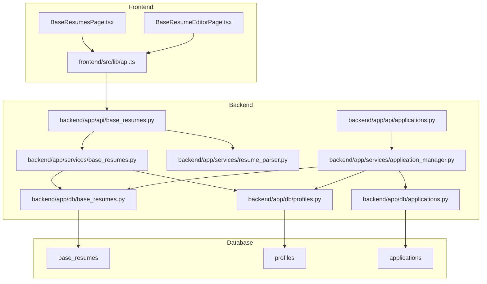
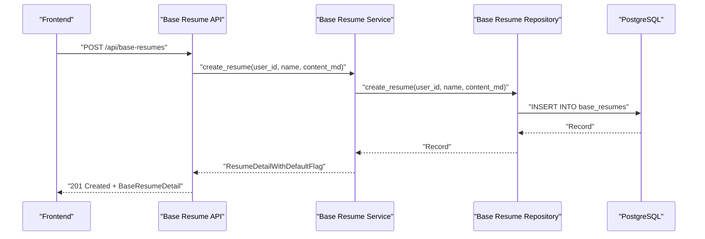
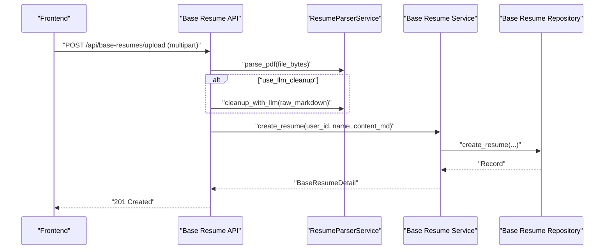
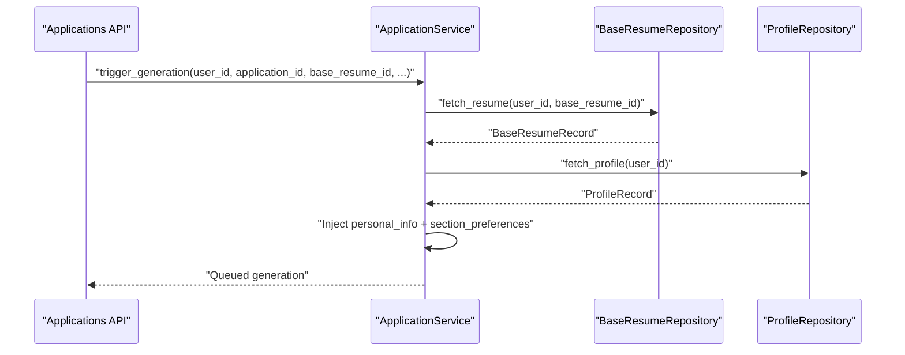
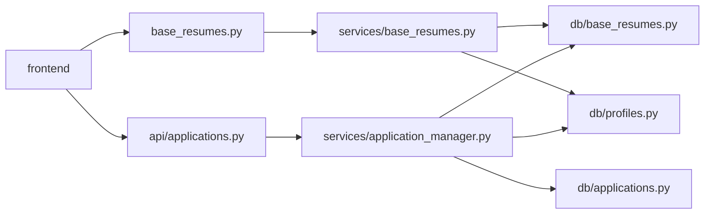

# Base Resume Management Service

<cite>
**Referenced Files in This Document**
- [backend/app/api/base_resumes.py](file://backend/app/api/base_resumes.py)
- [backend/app/services/base_resumes.py](file://backend/app/services/base_resumes.py)
- [backend/app/db/base_resumes.py](file://backend/app/db/base_resumes.py)
- [backend/app/db/profiles.py](file://backend/app/db/profiles.py)
- [backend/app/services/resume_parser.py](file://backend/app/services/resume_parser.py)
- [backend/app/api/applications.py](file://backend/app/api/applications.py)
- [backend/app/db/applications.py](file://backend/app/db/applications.py)
- [backend/app/services/application_manager.py](file://backend/app/services/application_manager.py)
- [frontend/src/routes/BaseResumesPage.tsx](file://frontend/src/routes/BaseResumesPage.tsx)
- [frontend/src/routes/BaseResumeEditorPage.tsx](file://frontend/src/routes/BaseResumeEditorPage.tsx)
- [frontend/src/lib/api.ts](file://frontend/src/lib/api.ts)
- [supabase/migrations/20260407_000004_phase_2_base_resumes.sql](file://supabase/migrations/20260407_000004_phase_2_base_resumes.sql)
- [docs/database_schema.md](file://docs/database_schema.md)
</cite>

## Table of Contents
1. [Introduction](#introduction)
2. [Project Structure](#project-structure)
3. [Core Components](#core-components)
4. [Architecture Overview](#architecture-overview)
5. [Detailed Component Analysis](#detailed-component-analysis)
6. [Dependency Analysis](#dependency-analysis)
7. [Performance Considerations](#performance-considerations)
8. [Troubleshooting Guide](#troubleshooting-guide)
9. [Conclusion](#conclusion)
10. [Appendices](#appendices)

## Introduction
This document describes the Base Resume Management Service that powers user-managed resume templates and content. It covers the service architecture for creating, updating, retrieving, and deleting base resumes, along with integration points to application workflows. The system stores resume content as Markdown, supports PDF uploads with optional AI cleanup, and integrates with profile data to inject personal information and section preferences during generation.

## Project Structure
The Base Resume Management Service spans backend APIs, services, repositories, and frontend UI components:

- Backend API layer exposes endpoints for base resume CRUD and default selection
- Service layer encapsulates business logic and validation
- Repository layer handles database operations with PostgreSQL and RLS
- Frontend pages provide user interfaces for creating, editing, uploading, and setting default base resumes
- Database schema defines tables, constraints, enums, and RLS policies

**Diagram sources**
- [backend/app/api/base_resumes.py:1-242](file://backend/app/api/base_resumes.py#L1-L242)
- [backend/app/services/base_resumes.py:1-154](file://backend/app/services/base_resumes.py#L1-L154)
- [backend/app/db/base_resumes.py:1-184](file://backend/app/db/base_resumes.py#L1-L184)
- [backend/app/db/profiles.py:1-225](file://backend/app/db/profiles.py#L1-L225)
- [backend/app/services/resume_parser.py:1-228](file://backend/app/services/resume_parser.py#L1-L228)
- [backend/app/api/applications.py:1-661](file://backend/app/api/applications.py#L1-L661)
- [backend/app/db/applications.py:1-328](file://backend/app/db/applications.py#L1-L328)
- [backend/app/services/application_manager.py:1-800](file://backend/app/services/application_manager.py#L1-L800)
- [frontend/src/routes/BaseResumesPage.tsx:1-185](file://frontend/src/routes/BaseResumesPage.tsx#L1-L185)
- [frontend/src/routes/BaseResumeEditorPage.tsx:1-472](file://frontend/src/routes/BaseResumeEditorPage.tsx#L1-L472)
- [frontend/src/lib/api.ts:1-489](file://frontend/src/lib/api.ts#L1-L489)

**Section sources**
- [backend/app/api/base_resumes.py:1-242](file://backend/app/api/base_resumes.py#L1-L242)
- [backend/app/services/base_resumes.py:1-154](file://backend/app/services/base_resumes.py#L1-L154)
- [backend/app/db/base_resumes.py:1-184](file://backend/app/db/base_resumes.py#L1-L184)
- [backend/app/db/profiles.py:1-225](file://backend/app/db/profiles.py#L1-L225)
- [backend/app/services/resume_parser.py:1-228](file://backend/app/services/resume_parser.py#L1-L228)
- [backend/app/api/applications.py:1-661](file://backend/app/api/applications.py#L1-L661)
- [backend/app/db/applications.py:1-328](file://backend/app/db/applications.py#L1-L328)
- [backend/app/services/application_manager.py:1-800](file://backend/app/services/application_manager.py#L1-L800)
- [frontend/src/routes/BaseResumesPage.tsx:1-185](file://frontend/src/routes/BaseResumesPage.tsx#L1-L185)
- [frontend/src/routes/BaseResumeEditorPage.tsx:1-472](file://frontend/src/routes/BaseResumeEditorPage.tsx#L1-L472)
- [frontend/src/lib/api.ts:1-489](file://frontend/src/lib/api.ts#L1-L489)

## Core Components
- Base Resume API: Provides endpoints for listing, creating, uploading, retrieving, updating, deleting, and setting default base resumes
- Base Resume Service: Implements validation, ownership checks, default flag computation, and deletion semantics
- Base Resume Repository: Handles database operations with PostgreSQL and RLS enforcement
- Profile Repository: Manages user profile defaults and section preferences used during generation
- Resume Parser Service: Extracts and optionally cleans up PDF content into Markdown
- Application Integration: Links base resumes to applications and injects profile data and preferences during generation

Key responsibilities:
- Content management: Store and manage Markdown-based resume content
- Ownership and permissions: Enforce user scoping via RLS and explicit user_id checks
- Default selection: Normalize default base resume selection into profile-level pointer
- Generation integration: Supply personal info and section preferences to generation pipeline

**Section sources**
- [backend/app/api/base_resumes.py:85-242](file://backend/app/api/base_resumes.py#L85-L242)
- [backend/app/services/base_resumes.py:32-154](file://backend/app/services/base_resumes.py#L32-L154)
- [backend/app/db/base_resumes.py:31-184](file://backend/app/db/base_resumes.py#L31-L184)
- [backend/app/db/profiles.py:38-225](file://backend/app/db/profiles.py#L38-L225)
- [backend/app/services/resume_parser.py:13-228](file://backend/app/services/resume_parser.py#L13-L228)
- [backend/app/api/applications.py:560-580](file://backend/app/api/applications.py#L560-L580)
- [backend/app/db/applications.py:123-328](file://backend/app/db/applications.py#L123-L328)
- [backend/app/services/application_manager.py:513-602](file://backend/app/services/application_manager.py#L513-L602)

## Architecture Overview
The Base Resume Management Service follows a layered architecture:
- Presentation: FastAPI endpoints define the contract and handle request validation
- Service: Encapsulates business rules, validation, and cross-entity logic
- Persistence: PostgreSQL with Row Level Security (RLS) policies and explicit user_id scoping
- Integration: Applications reference base resumes and generation consumes profile data and preferences

**Diagram sources**
- [backend/app/api/base_resumes.py:94-109](file://backend/app/api/base_resumes.py#L94-L109)
- [backend/app/services/base_resumes.py:55-73](file://backend/app/services/base_resumes.py#L55-L73)
- [backend/app/db/base_resumes.py:59-90](file://backend/app/db/base_resumes.py#L59-L90)

**Section sources**
- [backend/app/api/base_resumes.py:1-242](file://backend/app/api/base_resumes.py#L1-L242)
- [backend/app/services/base_resumes.py:1-154](file://backend/app/services/base_resumes.py#L1-L154)
- [backend/app/db/base_resumes.py:1-184](file://backend/app/db/base_resumes.py#L1-L184)

## Detailed Component Analysis

### Base Resume API Layer
Endpoints:
- GET /api/base-resumes: List summaries with default flag
- POST /api/base-resumes: Create a new base resume
- POST /api/base-resumes/upload: Upload PDF, parse to Markdown, optionally clean with LLM, then create
- GET /api/base-resumes/{resume_id}: Retrieve detailed resume
- PATCH /api/base-resumes/{resume_id}: Partially update name/content
- DELETE /api/base-resumes/{resume_id}: Delete with optional force flag
- POST /api/base-resumes/{resume_id}/set-default: Set as default via profile pointer

Validation:
- Name must be non-blank for create/update
- PDF upload validates extension, content type, and size
- LLM cleanup is optional and gracefully falls back if API key is missing

Error mapping:
- Translates service exceptions to appropriate HTTP status codes

**Section sources**
- [backend/app/api/base_resumes.py:85-242](file://backend/app/api/base_resumes.py#L85-L242)

### Base Resume Service Layer
Responsibilities:
- Ownership verification: Fetches records to confirm ownership before updates/deletes
- Validation: Ensures non-blank names and strips whitespace
- Default flag: Computes whether a resume is the user's default by checking profile pointer
- Deletion semantics: Prevents deletion if referenced by applications unless force=true

Integration:
- Uses ProfileRepository to compute default flag and update default pointer
- Uses BaseResumeRepository for persistence operations

**Section sources**
- [backend/app/services/base_resumes.py:32-154](file://backend/app/services/base_resumes.py#L32-L154)

### Base Resume Repository Layer
Operations:
- list_resumes(user_id): Returns summaries ordered by updated_at desc
- create_resume(user_id, name, content_md): Inserts and returns created record
- fetch_resume(user_id, resume_id): Retrieves a single resume
- update_resume(resume_id, user_id, updates): Updates selected fields with dynamic assignment
- delete_resume(resume_id, user_id): Deletes and returns success
- is_referenced(user_id, resume_id): Checks if resume is referenced by applications

SQL patterns:
- Dynamic SQL construction for selective updates
- Composite foreign key constraints enforced via application joins

**Section sources**
- [backend/app/db/base_resumes.py:31-184](file://backend/app/db/base_resumes.py#L31-L184)

### Profile Integration and Default Selection
- Default base resume is stored in profiles.default_base_resume_id
- Setting default updates profile pointer; service computes is_default flag
- During generation, application manager reads profile personal info and section preferences to assemble the resume

**Section sources**
- [backend/app/db/profiles.py:196-221](file://backend/app/db/profiles.py#L196-L221)
- [backend/app/services/base_resumes.py:41-43](file://backend/app/services/base_resumes.py#L41-L43)
- [backend/app/services/application_manager.py:542-556](file://backend/app/services/application_manager.py#L542-L556)

### PDF Upload and Parsing Pipeline
- Validates file type (.pdf), content type, and size (≤10MB)
- Parses PDF to Markdown using ResumeParserService
- Optional LLM cleanup via OpenRouter API if configured
- Creates base resume with parsed/cleaned content

**Diagram sources**
- [backend/app/api/base_resumes.py:111-169](file://backend/app/api/base_resumes.py#L111-L169)
- [backend/app/services/resume_parser.py:24-228](file://backend/app/services/resume_parser.py#L24-L228)
- [backend/app/services/base_resumes.py:55-73](file://backend/app/services/base_resumes.py#L55-L73)
- [backend/app/db/base_resumes.py:59-90](file://backend/app/db/base_resumes.py#L59-L90)

**Section sources**
- [backend/app/api/base_resumes.py:111-169](file://backend/app/api/base_resumes.py#L111-L169)
- [backend/app/services/resume_parser.py:13-228](file://backend/app/services/resume_parser.py#L13-L228)

### Application Workflow Integration
- Applications can link to a base resume via base_resume_id
- During generation, the application manager injects profile personal info and section preferences
- The linked base resume content serves as the Markdown template for assembly

**Diagram sources**
- [backend/app/api/applications.py:560-580](file://backend/app/api/applications.py#L560-L580)
- [backend/app/services/application_manager.py:513-602](file://backend/app/services/application_manager.py#L513-L602)
- [backend/app/db/applications.py:123-328](file://backend/app/db/applications.py#L123-L328)
- [backend/app/db/base_resumes.py:92-109](file://backend/app/db/base_resumes.py#L92-L109)
- [backend/app/db/profiles.py:47-68](file://backend/app/db/profiles.py#L47-L68)

**Section sources**
- [backend/app/api/applications.py:560-580](file://backend/app/api/applications.py#L560-L580)
- [backend/app/services/application_manager.py:513-602](file://backend/app/services/application_manager.py#L513-L602)
- [backend/app/db/applications.py:123-328](file://backend/app/db/applications.py#L123-L328)

### Frontend Integration
- BaseResumesPage displays list of base resumes with default badge and actions
- BaseResumeEditorPage supports three modes:
  - Blank creation: Start from scratch with Markdown editor
  - Upload: Select PDF, review extracted content, then save
  - Edit: Update existing resume name/content
- API helpers wrap authenticated requests for base resume operations

**Section sources**
- [frontend/src/routes/BaseResumesPage.tsx:12-185](file://frontend/src/routes/BaseResumesPage.tsx#L12-L185)
- [frontend/src/routes/BaseResumeEditorPage.tsx:19-472](file://frontend/src/routes/BaseResumeEditorPage.tsx#L19-L472)
- [frontend/src/lib/api.ts:328-397](file://frontend/src/lib/api.ts#L328-L397)

## Dependency Analysis
- API depends on Service for business logic
- Service depends on Repositories for persistence
- Repositories depend on PostgreSQL with RLS policies
- Applications depend on Base Resume and Profile repositories for generation
- Frontend depends on API for all operations

**Diagram sources**
- [backend/app/api/base_resumes.py:1-242](file://backend/app/api/base_resumes.py#L1-L242)
- [backend/app/services/base_resumes.py:1-154](file://backend/app/services/base_resumes.py#L1-L154)
- [backend/app/db/base_resumes.py:1-184](file://backend/app/db/base_resumes.py#L1-L184)
- [backend/app/db/profiles.py:1-225](file://backend/app/db/profiles.py#L1-L225)
- [backend/app/api/applications.py:1-661](file://backend/app/api/applications.py#L1-L661)
- [backend/app/services/application_manager.py:1-800](file://backend/app/services/application_manager.py#L1-L800)
- [frontend/src/lib/api.ts:1-489](file://frontend/src/lib/api.ts#L1-L489)

**Section sources**
- [backend/app/api/base_resumes.py:1-242](file://backend/app/api/base_resumes.py#L1-L242)
- [backend/app/services/base_resumes.py:1-154](file://backend/app/services/base_resumes.py#L1-L154)
- [backend/app/db/base_resumes.py:1-184](file://backend/app/db/base_resumes.py#L1-L184)
- [backend/app/db/profiles.py:1-225](file://backend/app/db/profiles.py#L1-L225)
- [backend/app/api/applications.py:1-661](file://backend/app/api/applications.py#L1-L661)
- [backend/app/services/application_manager.py:1-800](file://backend/app/services/application_manager.py#L1-L800)
- [frontend/src/lib/api.ts:1-489](file://frontend/src/lib/api.ts#L1-L489)

## Performance Considerations
- Database indexing: Composite indexes on base_resumes(user_id, updated_at DESC) and applications(user_id, updated_at DESC) optimize list queries
- RLS overhead: Policies are efficient due to indexes on user_id; ensure queries filter by user_id
- PDF parsing: Async LLM cleanup is optional; without API key, parsing falls back to basic extraction
- Frontend caching: Consider memoizing base resume lists and details to reduce network calls

[No sources needed since this section provides general guidance]

## Troubleshooting Guide
Common issues and resolutions:
- 400 Bad Request
  - Blank name validation failures during create/update
  - Invalid PDF file type or size exceeded
- 404 Not Found
  - Resume not found due to wrong user_id or missing record
  - Profile not found when generating
- 409 Conflict
  - Attempted deletion of a resume referenced by applications without force=true
- 500 Internal Server Error
  - Unexpected server errors mapped from service exceptions

Operational tips:
- Verify user_id scoping in all requests
- Ensure profile has required fields (name, email, phone, address) before generation
- Confirm section_preferences and section_order are valid JSONB shapes

**Section sources**
- [backend/app/api/base_resumes.py:72-82](file://backend/app/api/base_resumes.py#L72-L82)
- [backend/app/services/base_resumes.py:108-127](file://backend/app/services/base_resumes.py#L108-L127)
- [backend/app/db/profiles.py:158-188](file://backend/app/db/profiles.py#L158-L188)

## Conclusion
The Base Resume Management Service provides a robust, user-scoped system for managing Markdown-based resume templates. It integrates seamlessly with application workflows by linking base resumes to job applications and injecting profile data and section preferences during generation. Strong validation, RLS policies, and clear CRUD operations ensure data integrity and user autonomy.

[No sources needed since this section summarizes without analyzing specific files]

## Appendices

### Database Schema Highlights
- base_resumes: Stores user-owned Markdown resumes with non-blank constraints
- profiles: Contains default_base_resume_id and section preferences/order
- applications: Links to base_resumes via base_resume_id with ON DELETE SET NULL

**Section sources**
- [docs/database_schema.md:84-113](file://docs/database_schema.md#L84-L113)
- [docs/database_schema.md:48-77](file://docs/database_schema.md#L48-L77)
- [docs/database_schema.md:114-163](file://docs/database_schema.md#L114-L163)

### RLS Policy Summary
- base_resumes: SELECT/INSERT/UPDATE/DELETE allowed only when auth.uid() = user_id
- profiles: SELECT/INSERT/UPDATE allowed only when auth.uid() = id
- applications: SELECT/INSERT/UPDATE/DELETE allowed only when auth.uid() = user_id

**Section sources**
- [supabase/migrations/20260407_000004_phase_2_base_resumes.sql:14-73](file://supabase/migrations/20260407_000004_phase_2_base_resumes.sql#L14-L73)
- [docs/database_schema.md:266-281](file://docs/database_schema.md#L266-L281)