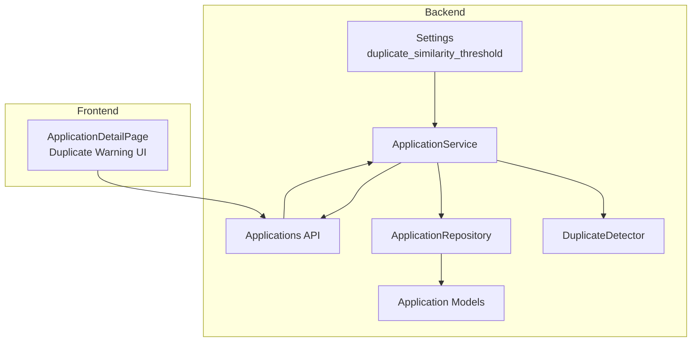
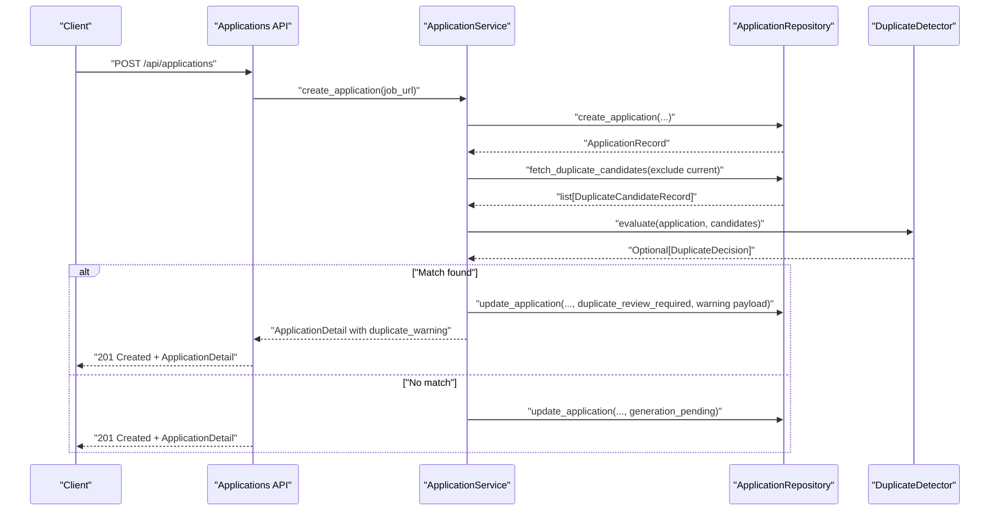
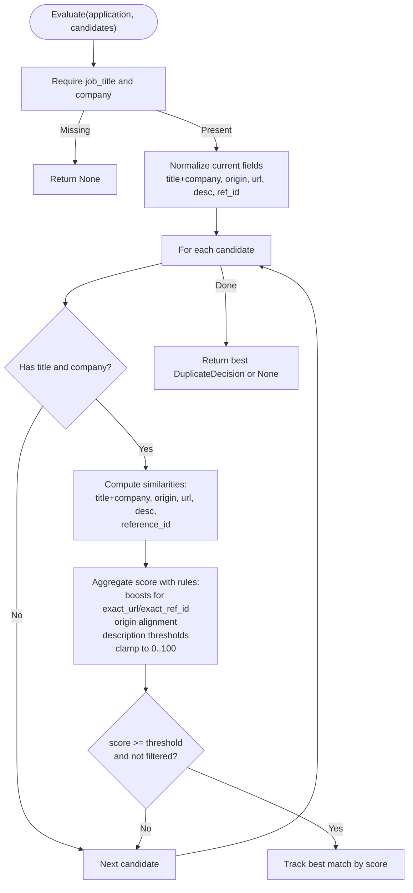
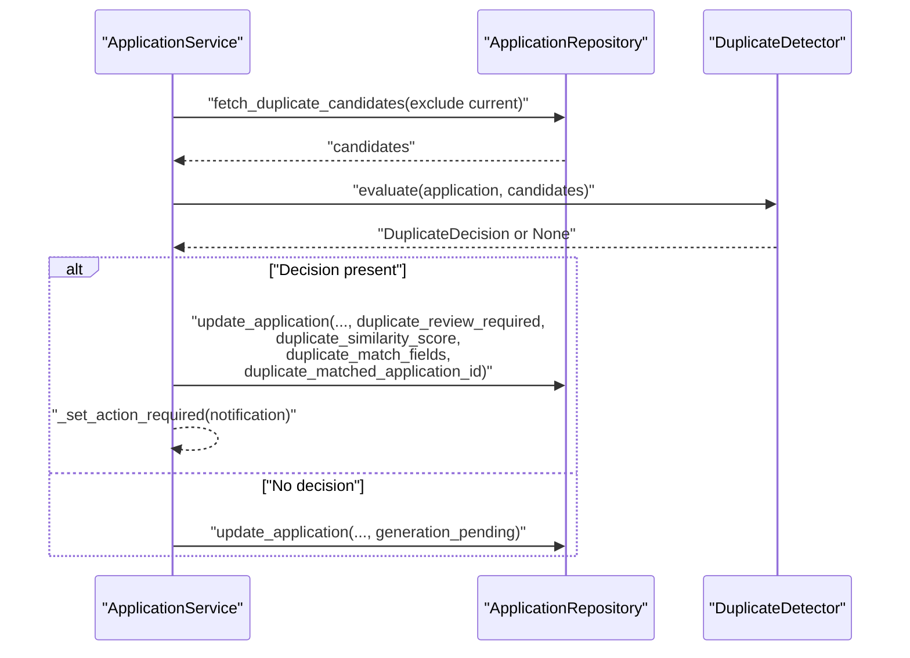
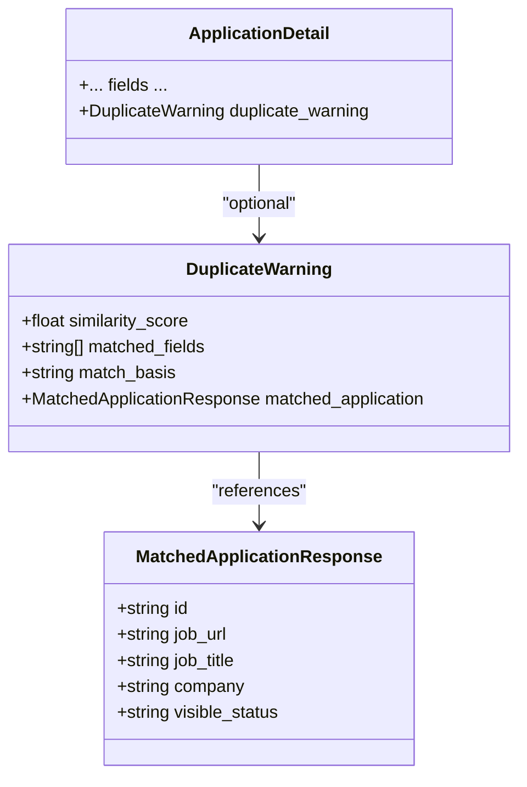
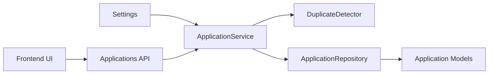

# Duplicate Detection Service

<cite>
**Referenced Files in This Document**
- [duplicates.py](file://backend/app/services/duplicates.py)
- [application_manager.py](file://backend/app/services/application_manager.py)
- [applications.py](file://backend/app/api/applications.py)
- [applications.py](file://backend/app/db/applications.py)
- [config.py](file://backend/app/core/config.py)
- [test_phase1_applications.py](file://backend/tests/test_phase1_applications.py)
- [ApplicationDetailPage.tsx](file://frontend/src/routes/ApplicationDetailPage.tsx)
</cite>

## Table of Contents
1. [Introduction](#introduction)
2. [Project Structure](#project-structure)
3. [Core Components](#core-components)
4. [Architecture Overview](#architecture-overview)
5. [Detailed Component Analysis](#detailed-component-analysis)
6. [Dependency Analysis](#dependency-analysis)
7. [Performance Considerations](#performance-considerations)
8. [Troubleshooting Guide](#troubleshooting-guide)
9. [Conclusion](#conclusion)

## Introduction
This document describes the Duplicate Detection Service that prevents duplicate job applications by comparing newly created or updated applications against existing ones. It explains the DuplicateDetector class, its similarity scoring algorithms, matching criteria, threshold configuration, and integration with the application workflow. It also covers how duplicate warnings are presented to users and how manual resolution works.

## Project Structure
The duplicate detection feature spans backend services, database models, API payloads, configuration, and frontend presentation:
- Backend services define the detector, workflow integration, and API endpoints.
- Database models represent application records and candidate sets.
- Configuration exposes a tunable similarity threshold.
- Tests validate detection behavior under realistic scenarios.
- Frontend renders duplicate warnings and handles user actions.

**Diagram sources**
- [config.py:60-62](file://backend/app/core/config.py#L60-L62)
- [application_manager.py:168](file://backend/app/services/application_manager.py#L168)
- [duplicates.py:79-183](file://backend/app/services/duplicates.py#L79-L183)
- [applications.py](file://backend/app/api/applications.py)
- [applications.py](file://backend/app/db/applications.py)

**Section sources**
- [config.py:60-62](file://backend/app/core/config.py#L60-L62)
- [application_manager.py:168](file://backend/app/services/application_manager.py#L168)
- [duplicates.py:79-183](file://backend/app/services/duplicates.py#L79-L183)
- [applications.py](file://backend/app/api/applications.py)
- [applications.py](file://backend/app/db/applications.py)

## Core Components
- DuplicateDetector: Implements fuzzy similarity scoring across job title, company, description, posting origin, and reference IDs. It computes a composite score and selects the best match above the configured threshold.
- ApplicationService: Orchestrates duplicate detection during application lifecycle events, updates application state, and emits notifications when duplicates are found.
- ApplicationRepository: Provides candidate lists and application CRUD operations used by the detector and service.
- API Payloads: Define the duplicate warning payload returned to clients and the resolution endpoint used by the frontend.
- Configuration: Exposes DUPLICATE_SIMILARITY_THRESHOLD to tune detection sensitivity.

Key behaviors:
- Threshold-driven matching: Only results meeting or exceeding the threshold are considered duplicates.
- Origin-aware scoring: Exact URL and exact reference ID triggers high-confidence matches; otherwise, origin alignment and description similarity influence scores.
- Candidate filtering: Excludes applications resolved as "redirected" and excludes the current application from matching.

**Section sources**
- [duplicates.py:79-183](file://backend/app/services/duplicates.py#L79-L183)
- [application_manager.py:1185-1267](file://backend/app/services/application_manager.py#L1185-L1267)
- [applications.py](file://backend/app/db/applications.py)
- [config.py:60-62](file://backend/app/core/config.py#L60-L62)

## Architecture Overview
The duplicate detection pipeline runs automatically when applications are created or updated. The service fetches candidates, delegates to DuplicateDetector, and transitions the application into duplicate review state if a match is found.

**Diagram sources**
- [applications.py](file://backend/app/api/applications.py)
- [application_manager.py:1185-1267](file://backend/app/services/application_manager.py#L1185-L1267)
- [duplicates.py:79-183](file://backend/app/services/duplicates.py#L79-L183)
- [applications.py](file://backend/app/db/applications.py)

## Detailed Component Analysis

### DuplicateDetector
The detector compares the current application against a list of candidates using:
- Normalization: Lowercase, whitespace normalization, and truncation of descriptions to a fixed length.
- Fuzzy similarity: Uses sequence matcher ratio scaled to percentage.
- Reference ID extraction: Parses URLs and descriptions to find persistent identifiers.
- Scoring rules:
  - Start with a score based on normalized job title + company similarity.
  - Exact URL match yields a high boost.
  - Exact reference ID match yields a high boost.
  - Origin alignment adds or subtracts points depending on whether origins match.
  - Description similarity contributes positively when above thresholds; very low similarity reduces score.
  - Score clamped to 0–100 and compared to threshold.

**Diagram sources**
- [duplicates.py:79-183](file://backend/app/services/duplicates.py#L79-L183)

**Section sources**
- [duplicates.py:31-38](file://backend/app/services/duplicates.py#L31-L38)
- [duplicates.py:41-62](file://backend/app/services/duplicates.py#L41-L62)
- [duplicates.py:65-77](file://backend/app/services/duplicates.py#L65-L77)
- [duplicates.py:79-183](file://backend/app/services/duplicates.py#L79-L183)

### Matching Criteria and Threshold Configuration
- Fields considered:
  - job_title and company (required for evaluation)
  - job_posting_origin (origin-aware scoring)
  - job_url (exact URL match boost)
  - job_description (description similarity thresholds)
  - extracted_reference_id and reference ID extracted from URL/description
- Threshold:
  - Configurable via DUPLICATE_SIMILARITY_THRESHOLD (default 85.0).
  - Used to decide whether a candidate qualifies as a duplicate.
- Additional filters:
  - Exclude candidates marked as "redirected".
  - Exclude the current application from matching.
  - If description similarity is below a lower threshold and origins differ, filter out.

**Section sources**
- [config.py:60-62](file://backend/app/core/config.py#L60-L62)
- [application_manager.py:1222-1225](file://backend/app/services/application_manager.py#L1222-L1225)
- [duplicates.py:153-167](file://backend/app/services/duplicates.py#L153-L167)

### Integration with Application Workflow
- Automatic detection occurs during:
  - Creation after extraction completes.
  - Updates when job_title/company become available or change.
- Workflow transitions:
  - No match: application proceeds to generation_pending.
  - Match found: application enters duplicate_review_required with a duplicate warning payload.
- Notification:
  - When a duplicate is pending, an action-required notification is set until resolved.

**Diagram sources**
- [application_manager.py:1185-1267](file://backend/app/services/application_manager.py#L1185-L1267)
- [duplicates.py:79-183](file://backend/app/services/duplicates.py#L79-L183)

**Section sources**
- [application_manager.py:1185-1267](file://backend/app/services/application_manager.py#L1185-L1267)
- [applications.py](file://backend/app/db/applications.py)

### Duplicate Warning Payload and Presentation
- Backend payload:
  - similarity_score: numeric score from detector.
  - matched_fields: list of fields that contributed to the match.
  - match_basis: concise rationale for the match (e.g., exact URL, exact reference ID, origin + description).
  - matched_application: summary of the existing application being flagged.
- API mapping:
  - ApplicationDetail includes duplicate_warning when present.
- Frontend UI:
  - Renders a banner with confidence score and matched fields.
  - Provides buttons to "Proceed Anyway" (dismiss) or "Open Existing Application".

**Diagram sources**
- [applications.py](file://backend/app/api/applications.py)
- [applications.py](file://backend/app/db/applications.py)

**Section sources**
- [applications.py](file://backend/app/api/applications.py)
- [ApplicationDetailPage.tsx:610-633](file://frontend/src/routes/ApplicationDetailPage.tsx#L610-L633)

### Manual Resolution Workflow
- Endpoint: POST /api/applications/{application_id}/duplicate-resolution with resolution "dismissed" or "redirected".
- Behavior:
  - "dismissed": clears the duplicate warning and allows proceeding without further action.
  - "redirected": navigates the user to the matched application.
- Validation:
  - Requires the application to be in duplicate_review_required with pending resolution.

**Section sources**
- [applications.py](file://backend/app/api/applications.py)
- [application_manager.py:412-437](file://backend/app/services/application_manager.py#L412-L437)

## Dependency Analysis
- DuplicateDetector depends on:
  - Application models for input data.
  - difflib.SequenceMatcher for similarity.
  - URL parsing and regex patterns for reference ID extraction.
- ApplicationService depends on:
  - DuplicateDetector for matching.
  - ApplicationRepository for candidate queries and updates.
  - Settings for threshold configuration.
- API layer depends on:
  - ApplicationService for business logic.
  - ApplicationDetailPayload/DuplicateWarningPayload for serialization.

**Diagram sources**
- [config.py:60-62](file://backend/app/core/config.py#L60-L62)
- [application_manager.py:168](file://backend/app/services/application_manager.py#L168)
- [duplicates.py:79-183](file://backend/app/services/duplicates.py#L79-L183)
- [applications.py](file://backend/app/api/applications.py)
- [applications.py](file://backend/app/db/applications.py)

**Section sources**
- [config.py:60-62](file://backend/app/core/config.py#L60-L62)
- [application_manager.py:168](file://backend/app/services/application_manager.py#L168)
- [duplicates.py:79-183](file://backend/app/services/duplicates.py#L79-L183)
- [applications.py](file://backend/app/api/applications.py)
- [applications.py](file://backend/app/db/applications.py)

## Performance Considerations
- Candidate pruning:
  - Excluding "redirected" applications and the current application reduces comparison cost.
- Early exits:
  - Missing required fields (job_title/company) immediately skips evaluation.
  - Scores below threshold or filtered by description/origin thresholds avoid full computation.
- Scoring complexity:
  - Each candidate incurs O(n) similarity computations; keep candidate count reasonable.
- Caching:
  - Consider caching normalized strings or reference IDs if repeated comparisons occur frequently.

## Troubleshooting Guide
Common issues and resolutions:
- Duplicate warning not appearing:
  - Ensure job_title and company are populated; detection requires both.
  - Verify the threshold is not too high for the given content.
  - Confirm the candidate is not marked as "redirected".
- Incorrectly high/false positive matches:
  - Lower the DUPLICATE_SIMILARITY_THRESHOLD.
  - Improve description uniqueness or add reference IDs.
- Origin mismatches causing false negatives:
  - Align job_posting_origin values across applications.
- Resolving duplicates:
  - Use the duplicate-resolution endpoint with "dismissed" or "redirected".
  - After dismissal, the warning persists until the user chooses to proceed.

Validation references:
- Threshold default and configuration: [config.py:60-62](file://backend/app/core/config.py#L60-L62)
- Candidate exclusion and filtering: [application_manager.py:1222-1225](file://backend/app/services/application_manager.py#L1222-L1225), [duplicates.py:153-167](file://backend/app/services/duplicates.py#L153-L167)
- Manual resolution endpoint and validation: [applications.py](file://backend/app/api/applications.py), [application_manager.py:412-437](file://backend/app/services/application_manager.py#L412-L437)

**Section sources**
- [config.py:60-62](file://backend/app/core/config.py#L60-L62)
- [application_manager.py:1222-1225](file://backend/app/services/application_manager.py#L1222-L1225)
- [duplicates.py:153-167](file://backend/app/services/duplicates.py#L153-L167)
- [applications.py](file://backend/app/api/applications.py)
- [application_manager.py:412-437](file://backend/app/services/application_manager.py#L412-L437)

## Conclusion
The Duplicate Detection Service provides robust duplicate prevention by combining fuzzy matching across key job fields, origin awareness, and configurable thresholds. It integrates seamlessly into the application lifecycle, surfacing actionable warnings and enabling straightforward manual resolution. Tuning the threshold and ensuring consistent origin/reference metadata improves accuracy and user experience.