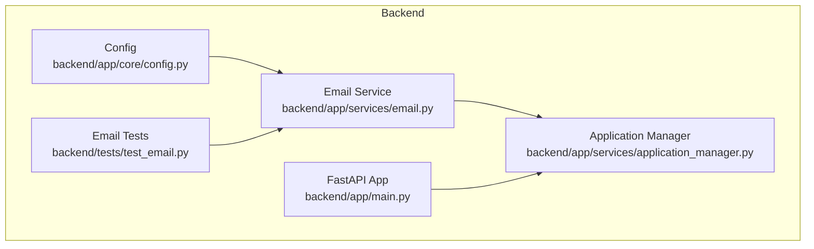
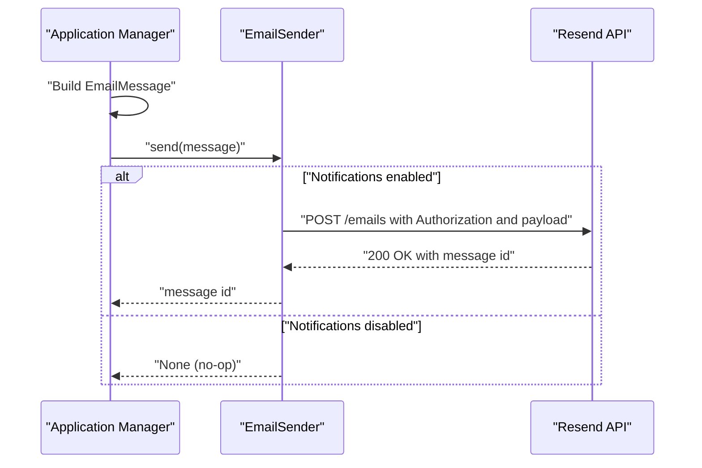
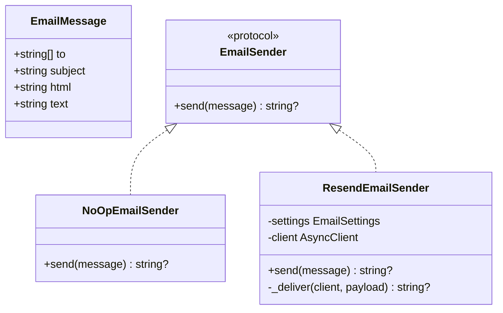
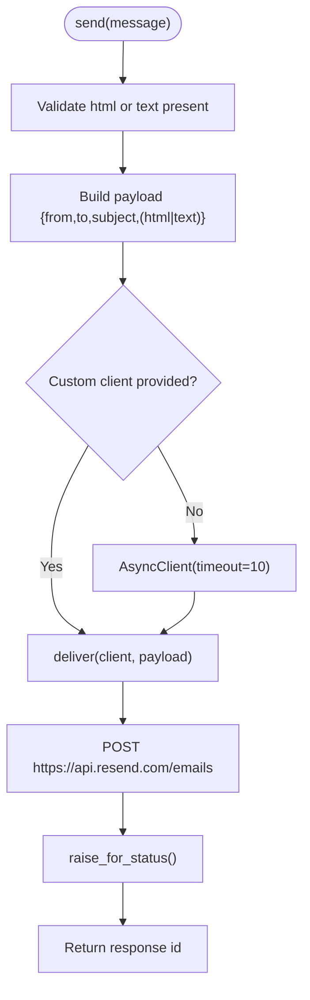
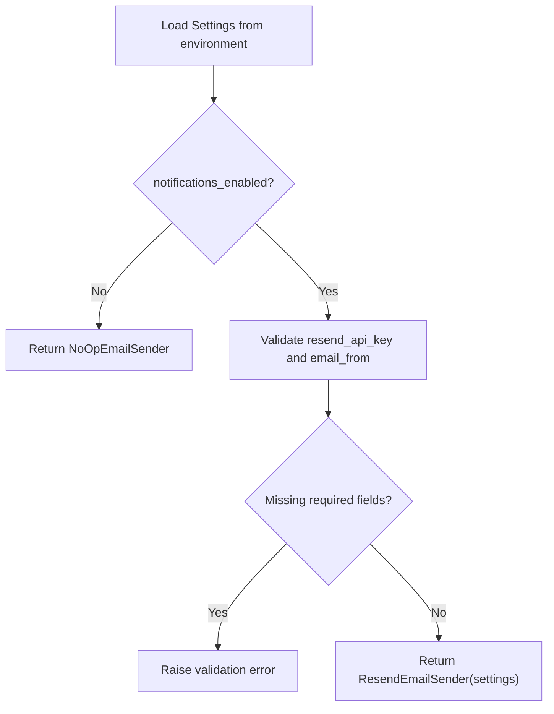
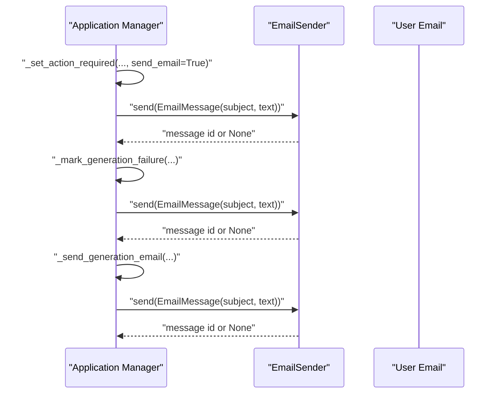
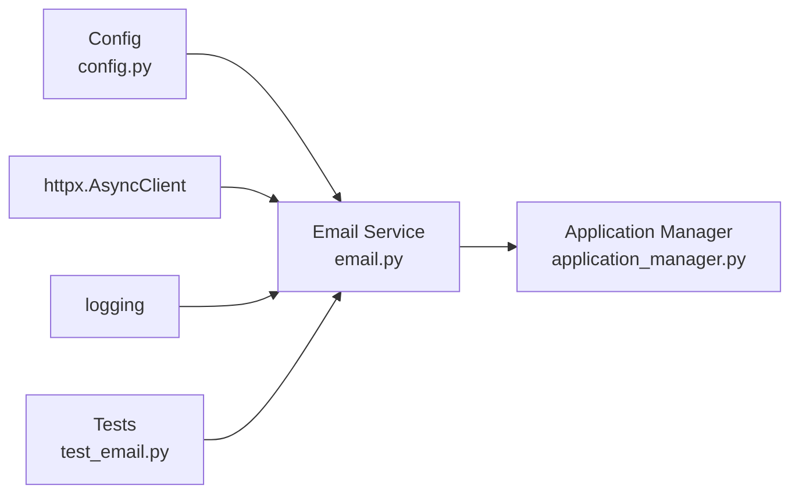

# Email Service

<cite>
**Referenced Files in This Document**
- [email.py](file://backend/app/services/email.py)
- [config.py](file://backend/app/core/config.py)
- [test_email.py](file://backend/tests/test_email.py)
- [application_manager.py](file://backend/app/services/application_manager.py)
- [main.py](file://backend/app/main.py)
- [2026-04-07-env-contract-simplification.md](file://docs/task-output/2026-04-07-env-contract-simplification.md)
</cite>

## Table of Contents
1. [Introduction](#introduction)
2. [Project Structure](#project-structure)
3. [Core Components](#core-components)
4. [Architecture Overview](#architecture-overview)
5. [Detailed Component Analysis](#detailed-component-analysis)
6. [Dependency Analysis](#dependency-analysis)
7. [Performance Considerations](#performance-considerations)
8. [Troubleshooting Guide](#troubleshooting-guide)
9. [Conclusion](#conclusion)
10. [Appendices](#appendices)

## Introduction
This document describes the Email Service responsible for automated notifications and user communication. It covers the EmailSender protocol and EmailMessage structure, SMTP configuration via Resend, authentication, and email template management. It also documents integration with application workflows for sending generation completion notifications, progress updates, and system alerts, along with content formatting, HTML rendering, and attachment handling. Finally, it explains error handling, retry mechanisms, and logging strategies.

## Project Structure
The Email Service is implemented in the backend service module and integrates with configuration and application workflows:
- Email primitives and provider logic live in backend/app/services/email.py
- Email configuration and validation live in backend/app/core/config.py
- Integration examples appear in backend/app/services/application_manager.py
- Tests validate behavior in backend/tests/test_email.py
- The API entrypoint is defined in backend/app/main.py
- Environment simplification and email gating are documented in docs/task-output/2026-04-07-env-contract-simplification.md

**Diagram sources**
- [email.py:1-85](file://backend/app/services/email.py#L1-L85)
- [config.py:1-97](file://backend/app/core/config.py#L1-L97)
- [application_manager.py:1170-1384](file://backend/app/services/application_manager.py#L1170-L1384)
- [test_email.py:1-59](file://backend/tests/test_email.py#L1-L59)
- [main.py:1-36](file://backend/app/main.py#L1-L36)

**Section sources**
- [email.py:1-85](file://backend/app/services/email.py#L1-L85)
- [config.py:1-97](file://backend/app/core/config.py#L1-L97)
- [application_manager.py:1170-1384](file://backend/app/services/application_manager.py#L1170-L1384)
- [test_email.py:1-59](file://backend/tests/test_email.py#L1-L59)
- [main.py:1-36](file://backend/app/main.py#L1-L36)

## Core Components
- EmailMessage: Immutable data structure representing an email with recipients, subject, and either HTML or text content.
- EmailSender Protocol: Defines an asynchronous send method for pluggable providers.
- NoOpEmailSender: A null-object provider used when notifications are disabled.
- ResendEmailSender: Provider implementation that posts emails to the Resend API using an Authorization header and a JSON payload.
- build_email_sender: Factory that selects the appropriate provider based on configuration.

Key behaviors:
- Content validation: At least one of HTML or text must be present.
- Payload construction: Includes from, to, subject, and either html or text.
- Authentication: Uses a Bearer token from the configured Resend API key.
- Timeout: Uses a 10-second timeout for outbound requests.
- No-op gate: When notifications are disabled, all send operations return None without network calls.

**Section sources**
- [email.py:15-84](file://backend/app/services/email.py#L15-L84)
- [config.py:10-32](file://backend/app/core/config.py#L10-L32)

## Architecture Overview
The Email Service is integrated into application workflows to notify users about extraction failures, generation errors, and progress updates. The application manager constructs EmailMessage instances and delegates sending to the configured EmailSender.

**Diagram sources**
- [application_manager.py:1326-1378](file://backend/app/services/application_manager.py#L1326-L1378)
- [email.py:43-74](file://backend/app/services/email.py#L43-L74)

**Section sources**
- [application_manager.py:1170-1384](file://backend/app/services/application_manager.py#L1170-L1384)
- [email.py:43-74](file://backend/app/services/email.py#L43-L74)

## Detailed Component Analysis

### EmailMessage and EmailSender Protocol
- EmailMessage fields: to (list of strings), subject (string), html (optional), text (optional).
- EmailSender Protocol: defines an async send method that returns an optional message identifier.

**Diagram sources**
- [email.py:15-84](file://backend/app/services/email.py#L15-L84)

**Section sources**
- [email.py:15-84](file://backend/app/services/email.py#L15-L84)

### ResendEmailSender Implementation
- Validates presence of HTML or text content.
- Constructs payload with from, to, subject, and content.
- Sends via HTTP POST to the Resend API endpoint with Authorization header.
- Returns the message id from the JSON response.
- Supports a shared AsyncClient or creates a short-lived one with a 10-second timeout.

**Diagram sources**
- [email.py:43-74](file://backend/app/services/email.py#L43-L74)

**Section sources**
- [email.py:43-74](file://backend/app/services/email.py#L43-L74)

### Configuration and Authentication
- EmailSettings enforces that when notifications are enabled, both the Resend API key and the sender address must be provided.
- Settings exposes email configuration via a property and validates it during model construction.
- build_email_sender chooses NoOpEmailSender when notifications are disabled; otherwise, it returns ResendEmailSender.

Environment variables:
- EMAIL_NOTIFICATIONS_ENABLED: Boolean toggle for enabling email notifications.
- RESEND_API_KEY: Bearer token for Resend API authentication.
- EMAIL_FROM: Sender email address used in the from field.

**Diagram sources**
- [config.py:10-32](file://backend/app/core/config.py#L10-L32)
- [email.py:77-84](file://backend/app/services/email.py#L77-L84)

**Section sources**
- [config.py:10-32](file://backend/app/core/config.py#L10-L32)
- [config.py:76-87](file://backend/app/core/config.py#L76-L87)
- [email.py:77-84](file://backend/app/services/email.py#L77-L84)

### Integration with Application Workflows
The application manager integrates email notifications into several workflows:
- Extraction failure: Marks the application as requiring manual entry and optionally sends an email.
- Generation failure: Updates state and sends an email with a subject derived from the failure type.
- Progress updates: Sends a generic email with a subject and body, including a link to the application.

**Diagram sources**
- [application_manager.py:1270-1384](file://backend/app/services/application_manager.py#L1270-L1384)

**Section sources**
- [application_manager.py:1270-1384](file://backend/app/services/application_manager.py#L1270-L1384)

### Email Template Management
- The current implementation does not include a dedicated template engine or pre-defined templates.
- Email content is constructed inline as plain text with a link to the application page.
- HTML content is supported via the html field of EmailMessage, allowing future adoption of HTML templates without changing the API.

Practical guidance:
- Prefer plain text for simplicity and reliability.
- Use the html field for styled content when needed.
- Keep links dynamic and environment-aware (as seen in application URLs).

**Section sources**
- [email.py:15-21](file://backend/app/services/email.py#L15-L21)
- [application_manager.py:1326-1378](file://backend/app/services/application_manager.py#L1326-L1378)

### Attachment Handling
- The current EmailMessage structure supports only text and HTML content.
- Attachments are not modeled in the EmailMessage dataclass.
- To support attachments, extend EmailMessage with attachment fields and update the provider payload accordingly.

**Section sources**
- [email.py:15-21](file://backend/app/services/email.py#L15-L21)

### Examples of Email Templates
Below are representative templates for different events. Use these as guidelines for constructing EmailMessage bodies in workflows.

- Generation Failure Notification
  - Subject: "Resume Builder: generation failed"
  - Body: Plain text with a summary of the failure and a link to the application page.

- Regeneration Failure Notification
  - Subject: "Resume Builder: regeneration failed"
  - Body: Plain text with a summary of the failure and a link to the application page.

- Extraction Needs Manual Entry
  - Subject: "Resume Builder: extraction needs manual entry"
  - Body: Plain text with guidance and a link to the application page.

- PDF Export Failure
  - Subject: "Resume Builder: PDF export failed"
  - Body: Plain text with a summary and a link to the application page.

Implementation pattern in workflows:
- Construct EmailMessage with subject and text.
- Optionally compute HTML content and pass it via the html field.
- Send via the configured EmailSender.

**Section sources**
- [application_manager.py:1170-1384](file://backend/app/services/application_manager.py#L1170-L1384)
- [email.py:15-21](file://backend/app/services/email.py#L15-L21)

## Dependency Analysis
- EmailService depends on:
  - Config module for EmailSettings and Settings validation.
  - httpx for asynchronous HTTP requests.
  - Logging for informational and operational messages.
- ApplicationManager depends on EmailService to send notifications.
- Tests validate configuration gating and payload construction.

**Diagram sources**
- [email.py:1-85](file://backend/app/services/email.py#L1-L85)
- [config.py:1-97](file://backend/app/core/config.py#L1-L97)
- [application_manager.py:1170-1384](file://backend/app/services/application_manager.py#L1170-L1384)
- [test_email.py:1-59](file://backend/tests/test_email.py#L1-L59)

**Section sources**
- [email.py:1-85](file://backend/app/services/email.py#L1-L85)
- [config.py:1-97](file://backend/app/core/config.py#L1-L97)
- [application_manager.py:1170-1384](file://backend/app/services/application_manager.py#L1170-L1384)
- [test_email.py:1-59](file://backend/tests/test_email.py#L1-L59)

## Performance Considerations
- Asynchronous I/O: Uses httpx.AsyncClient to avoid blocking the event loop.
- Short timeout: Requests use a 10-second timeout to prevent long waits.
- Reuse client: Passing a shared AsyncClient avoids connection overhead.
- Minimal payload: Only required fields are included in the Resend payload.

Recommendations:
- Reuse a single AsyncClient instance across the application lifecycle.
- Monitor Resend API latency and adjust timeouts if needed.
- Consider batching recipient lists when supported by the provider.

**Section sources**
- [email.py:60-61](file://backend/app/services/email.py#L60-L61)
- [email.py:70-74](file://backend/app/services/email.py#L70-L74)

## Troubleshooting Guide
Common issues and resolutions:
- Notifications disabled: When EMAIL_NOTIFICATIONS_ENABLED is false, the service returns None without sending. Verify environment configuration.
- Missing credentials: When notifications are enabled, both RESEND_API_KEY and EMAIL_FROM must be set; otherwise, validation raises an error.
- Empty content: Sending an EmailMessage without HTML or text raises a ValueError. Ensure at least one content field is provided.
- Network errors: The provider raises for status on non-2xx responses. Inspect logs and network connectivity.
- Silent failures in workflows: Some workflows catch exceptions around email sending and continue. Add explicit error handling and retries if needed.

Operational tips:
- Enable logging to observe info-level messages from the email sender.
- Use tests to simulate disabled mode and payload validation.

**Section sources**
- [config.py:15-32](file://backend/app/core/config.py#L15-L32)
- [email.py:44-45](file://backend/app/services/email.py#L44-L45)
- [email.py:29-31](file://backend/app/services/email.py#L29-L31)
- [test_email.py:13-21](file://backend/tests/test_email.py#L13-L21)
- [test_email.py:24-58](file://backend/tests/test_email.py#L24-L58)
- [application_manager.py:1333-1345](file://backend/app/services/application_manager.py#L1333-L1345)

## Conclusion
The Email Service provides a clean, extensible abstraction for sending notifications. It is gated by configuration, validated at startup, and integrated into key application workflows. While attachments are not currently supported, the design allows for easy extension. By following the patterns outlined here, teams can reliably deliver user-facing notifications with clear error handling and observability.

## Appendices

### Environment Variables Reference
- EMAIL_NOTIFICATIONS_ENABLED: Enables or disables email notifications.
- RESEND_API_KEY: Bearer token for Resend authentication.
- EMAIL_FROM: Sender email address used in the from field.

**Section sources**
- [config.py:63-67](file://backend/app/core/config.py#L63-L67)
- [config.py:11-13](file://backend/app/core/config.py#L11-L13)
- [2026-04-07-env-contract-simplification.md:14-19](file://docs/task-output/2026-04-07-env-contract-simplification.md#L14-L19)