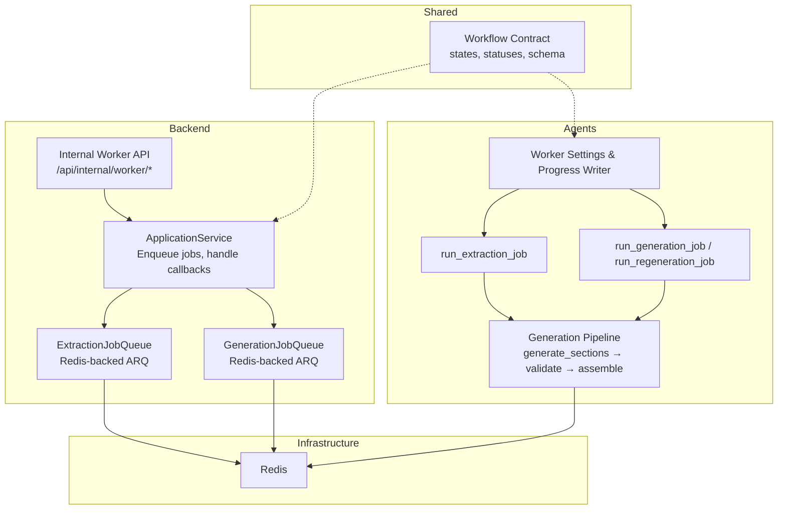
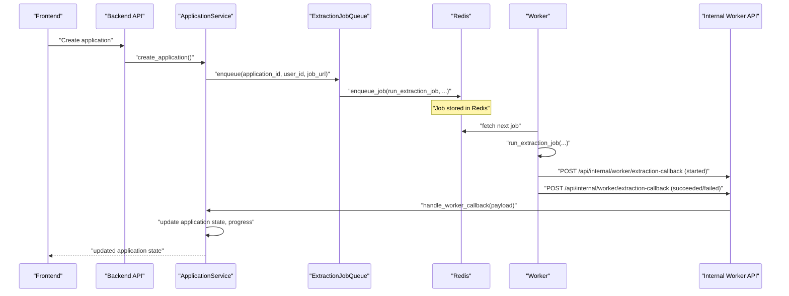
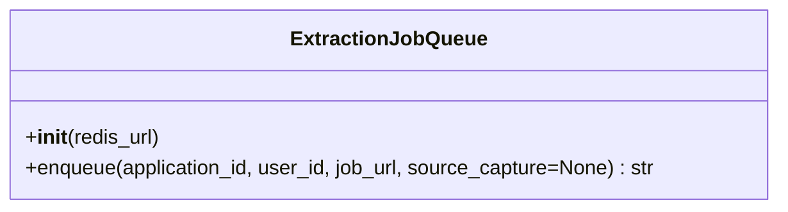
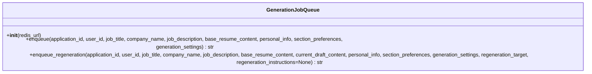
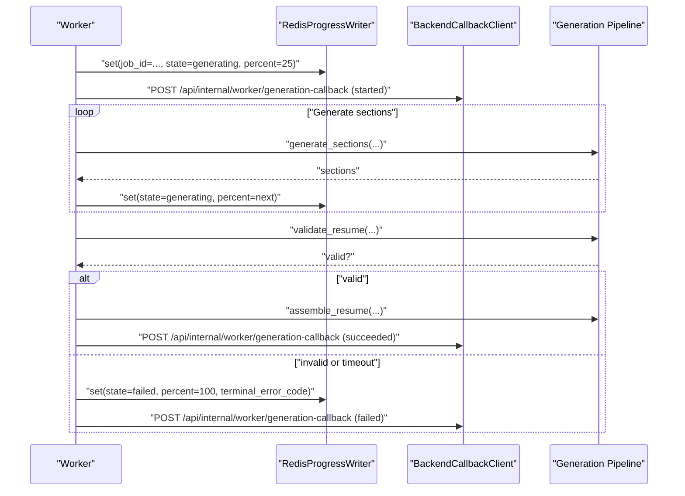
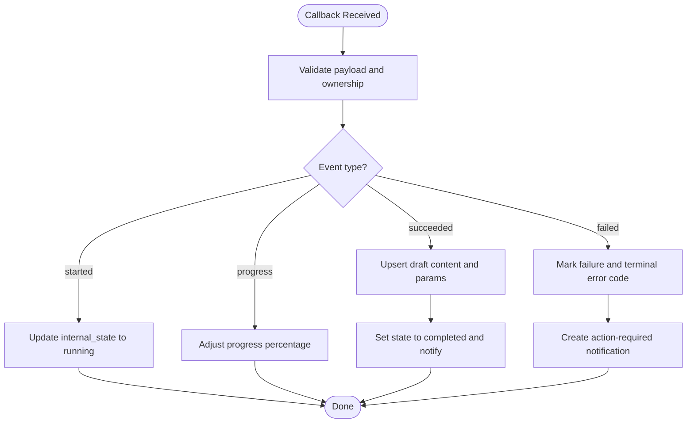
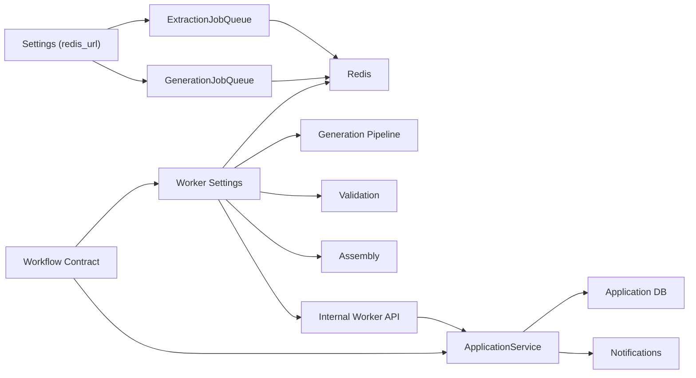

# Jobs Processing Service

<cite>
**Referenced Files in This Document**
- [jobs.py](file://backend/app/services/jobs.py)
- [worker.py](file://agents/worker.py)
- [application_manager.py](file://backend/app/services/application_manager.py)
- [internal_worker.py](file://backend/app/api/internal_worker.py)
- [config.py](file://backend/app/core/config.py)
- [docker-compose.yml](file://docker-compose.yml)
- [workflow-contract.json](file://shared/workflow-contract.json)
- [generation.py](file://agents/generation.py)
- [validation.py](file://agents/validation.py)
- [assembly.py](file://agents/assembly.py)
</cite>

## Table of Contents
1. [Introduction](#introduction)
2. [Project Structure](#project-structure)
3. [Core Components](#core-components)
4. [Architecture Overview](#architecture-overview)
5. [Detailed Component Analysis](#detailed-component-analysis)
6. [Dependency Analysis](#dependency-analysis)
7. [Performance Considerations](#performance-considerations)
8. [Troubleshooting Guide](#troubleshooting-guide)
9. [Conclusion](#conclusion)

## Introduction
This document describes the Jobs Processing Service responsible for asynchronous job execution of extraction and generation tasks. It covers queue management via Redis-backed ARQ, worker-side job execution, progress tracking, and callback-driven result handling. The service integrates tightly with the application workflow to orchestrate end-to-end resume building from job posting extraction to final PDF export.

## Project Structure
The Jobs Processing Service spans three main areas:
- Backend services that enqueue jobs and receive callbacks
- Agent workers that execute jobs and report progress/results
- Shared workflow contract that defines states, statuses, and polling schema

**Diagram sources**
- [jobs.py:12-138](file://backend/app/services/jobs.py#L12-L138)
- [worker.py:1232-1236](file://agents/worker.py#L1232-L1236)
- [application_manager.py:143-168](file://backend/app/services/application_manager.py#L143-L168)
- [internal_worker.py:16-71](file://backend/app/api/internal_worker.py#L16-L71)
- [workflow-contract.json:1-112](file://shared/workflow-contract.json#L1-L112)

**Section sources**
- [jobs.py:12-138](file://backend/app/services/jobs.py#L12-L138)
- [worker.py:1232-1236](file://agents/worker.py#L1232-L1236)
- [application_manager.py:143-168](file://backend/app/services/application_manager.py#L143-L168)
- [internal_worker.py:16-71](file://backend/app/api/internal_worker.py#L16-L71)
- [workflow-contract.json:1-112](file://shared/workflow-contract.json#L1-L112)

## Core Components
- ExtractionJobQueue: Encapsulates enqueueing extraction jobs with ARQ and Redis.
- GenerationJobQueue: Encapsulates enqueueing generation and regeneration jobs with ARQ and Redis.
- Worker runtime: Executes jobs, tracks progress, validates outputs, and posts callbacks.
- Backend ApplicationService: Orchestrates job lifecycle, handles callbacks, updates application state, and manages progress.
- Internal Worker API: Exposes endpoints for workers to report job events and results.
- Workflow contract: Defines internal states, visible statuses, workflow kinds, and polling schema.

Key responsibilities:
- Enqueueing jobs with validated parameters and unique job IDs
- Executing jobs with timeouts and fallback models
- Reporting progress and terminal outcomes via callbacks
- Updating application state and notifying users

**Section sources**
- [jobs.py:12-138](file://backend/app/services/jobs.py#L12-L138)
- [worker.py:272-288](file://agents/worker.py#L272-L288)
- [application_manager.py:455-512](file://backend/app/services/application_manager.py#L455-L512)
- [internal_worker.py:19-71](file://backend/app/api/internal_worker.py#L19-L71)
- [workflow-contract.json:27-112](file://shared/workflow-contract.json#L27-L112)

## Architecture Overview
The system uses ARQ with Redis as the broker. Backend services enqueue jobs with structured payloads. Workers pull jobs from Redis, execute them, and post callbacks to the backend’s internal API. ApplicationService coordinates state transitions and progress updates.

**Diagram sources**
- [jobs.py:16-42](file://backend/app/services/jobs.py#L16-L42)
- [worker.py:526-667](file://agents/worker.py#L526-L667)
- [internal_worker.py:19-34](file://backend/app/api/internal_worker.py#L19-L34)
- [application_manager.py:455-512](file://backend/app/services/application_manager.py#L455-L512)

## Detailed Component Analysis

### ExtractionJobQueue
- Purpose: Provide a simple interface to enqueue extraction jobs into Redis via ARQ.
- Key behaviors:
  - Accepts application_id, user_id, job_url, optional source_capture
  - Generates a UUID for job_id
  - Uses ARQ RedisSettings from DSN
  - Calls enqueue_job with function name "run_extraction_job"
  - Raises an error if enqueue returns None
  - Returns the generated job_id

**Diagram sources**
- [jobs.py:12-42](file://backend/app/services/jobs.py#L12-L42)

**Section sources**
- [jobs.py:12-42](file://backend/app/services/jobs.py#L12-L42)

### GenerationJobQueue
- Purpose: Provide interfaces to enqueue generation and regeneration jobs.
- Key behaviors:
  - enqueue: Standard generation job with job title, company, description, base resume, personal info, section preferences, and generation settings
  - enqueue_regeneration: Full or section regeneration with current draft content, regeneration target, and optional instructions
  - Both methods generate a UUID for job_id, use ARQ RedisSettings, and call enqueue_job with appropriate function names
  - Raise an error if enqueue returns None
  - Return the generated job_id

**Diagram sources**
- [jobs.py:45-130](file://backend/app/services/jobs.py#L45-L130)

**Section sources**
- [jobs.py:45-130](file://backend/app/services/jobs.py#L45-L130)

### Worker Runtime and Execution
- WorkerSettings: Declares ARQ functions, Redis settings, and max_tries
- run_extraction_job:
  - Validates and normalizes page context (scraped or captured)
  - Detects blocked sources and reports failure if needed
  - Runs structured extraction and validation
  - Updates progress and posts success/failure callbacks
- run_generation_job:
  - Validates required keys
  - Generates sections with timeouts and fallback models
  - Validates output and assembles final resume
  - Posts progress and success/failure callbacks
- run_regeneration_job:
  - Supports full regeneration or single-section regeneration
  - Applies timeouts and validation
  - Replaces sections in draft when applicable
  - Posts progress and success/failure callbacks

**Diagram sources**
- [worker.py:682-906](file://agents/worker.py#L682-L906)
- [generation.py:159-224](file://agents/generation.py#L159-L224)
- [validation.py:231-292](file://agents/validation.py#L231-L292)
- [assembly.py:12-63](file://agents/assembly.py#L12-L63)

**Section sources**
- [worker.py:1232-1236](file://agents/worker.py#L1232-L1236)
- [worker.py:526-667](file://agents/worker.py#L526-L667)
- [worker.py:682-906](file://agents/worker.py#L682-L906)
- [generation.py:159-224](file://agents/generation.py#L159-L224)
- [validation.py:231-292](file://agents/validation.py#L231-L292)
- [assembly.py:12-63](file://agents/assembly.py#L12-L63)

### Backend Orchestration and Callback Handling
- ApplicationService:
  - Enqueues jobs and sets initial progress
  - Handles extraction, generation, and regeneration callbacks
  - Updates application internal_state and visible_status
  - Upserts drafts and sends notifications
- Internal Worker API:
  - /api/internal/worker/extraction-callback
  - /api/internal/worker/generation-callback
  - /api/internal/worker/regeneration-callback
  - Verifies worker secret and delegates to ApplicationService

**Diagram sources**
- [application_manager.py:603-720](file://backend/app/services/application_manager.py#L603-L720)
- [application_manager.py:907-1017](file://backend/app/services/application_manager.py#L907-L1017)
- [internal_worker.py:19-71](file://backend/app/api/internal_worker.py#L19-L71)

**Section sources**
- [application_manager.py:455-512](file://backend/app/services/application_manager.py#L455-L512)
- [application_manager.py:603-720](file://backend/app/services/application_manager.py#L603-L720)
- [application_manager.py:907-1017](file://backend/app/services/application_manager.py#L907-L1017)
- [internal_worker.py:19-71](file://backend/app/api/internal_worker.py#L19-L71)

### Job Payload Structures and Validation
- Extraction payload (enqueue): application_id, user_id, job_url, optional source_capture
- Generation payload (enqueue): application_id, user_id, job_title, company_name, job_description, base_resume_content, personal_info, section_preferences, generation_settings
- Regeneration payload (enqueue): includes current_draft_content, regeneration_target, optional regeneration_instructions
- Worker callback payloads:
  - WorkerCallbackPayload: event, extracted, failure
  - GenerationCallbackPayload: event, generated, failure
  - RegenerationCallbackPayload: event, regeneration_target, generated, failure
- Parameter validation:
  - ExtractionJobQueue and GenerationJobQueue validate presence of required fields and raise errors on enqueue failure
  - Worker callbacks validate presence of required fields and enforce event correctness

**Section sources**
- [jobs.py:16-85](file://backend/app/services/jobs.py#L16-L85)
- [jobs.py:87-130](file://backend/app/services/jobs.py#L87-L130)
- [application_manager.py:103-141](file://backend/app/services/application_manager.py#L103-L141)
- [worker.py:526-667](file://agents/worker.py#L526-L667)

### Retry Policies, Timeouts, and Cancellation
- Retry policies:
  - LLM calls use primary and fallback models with a last-error fallback
  - ARQ max_tries is configured in WorkerSettings
- Timeouts:
  - Generation and regeneration use asyncio.wait_for with timeouts (e.g., 180 seconds)
  - Section regeneration uses a shorter timeout (e.g., 45 seconds)
- Cancellation:
  - No explicit cancellation mechanism is implemented; jobs run to completion or timeout

**Section sources**
- [worker.py:1232-1236](file://agents/worker.py#L1232-L1236)
- [worker.py:744-759](file://agents/worker.py#L744-L759)
- [worker.py:1080-1096](file://agents/worker.py#L1080-L1096)

### Queue Monitoring and Worker Coordination
- Progress tracking:
  - RedisProgressWriter stores JobProgress keyed by application_id
  - Worker writes progress updates during job execution
  - ApplicationService reads progress for UI polling
- Worker bootstrap:
  - report_bootstrap_progress announces readiness to the workflow contract
- Infrastructure:
  - Redis is exposed on port 6379
  - ARQ workers consume jobs from Redis queues

**Section sources**
- [worker.py:272-288](file://agents/worker.py#L272-L288)
- [worker.py:512-524](file://agents/worker.py#L512-L524)
- [docker-compose.yml:80-84](file://docker-compose.yml#L80-L84)

## Dependency Analysis
- Backend depends on:
  - ARQ and Redis for job queuing
  - ApplicationService for orchestration and state management
  - Internal Worker API for callbacks
- Workers depend on:
  - ARQ and Redis for job fetching
  - Generation/validation/assembly modules for job execution
  - Backend callback endpoint for reporting results
- Shared contract defines:
  - Internal states and visible statuses
  - Workflow kinds and polling schema

**Diagram sources**
- [config.py:46](file://backend/app/core/config.py#L46)
- [jobs.py:132-137](file://backend/app/services/jobs.py#L132-L137)
- [worker.py:1232-1236](file://agents/worker.py#L1232-L1236)
- [application_manager.py:143-168](file://backend/app/services/application_manager.py#L143-L168)
- [workflow-contract.json:1-112](file://shared/workflow-contract.json#L1-112)

**Section sources**
- [config.py:46](file://backend/app/core/config.py#L46)
- [jobs.py:132-137](file://backend/app/services/jobs.py#L132-L137)
- [worker.py:1232-1236](file://agents/worker.py#L1232-L1236)
- [application_manager.py:143-168](file://backend/app/services/application_manager.py#L143-L168)
- [workflow-contract.json:1-112](file://shared/workflow-contract.json#L1-112)

## Performance Considerations
- Use fallback models to reduce single-point-of-failure for LLM calls
- Tune timeouts based on workload characteristics
- Monitor Redis queue depth and worker throughput
- Batch progress updates to reduce Redis write frequency
- Consider rate-limiting external APIs (Playwright, OpenRouter) to avoid throttling

## Troubleshooting Guide
Common issues and resolutions:
- Enqueue failures:
  - Symptom: RuntimeError indicating failed enqueue
  - Resolution: Verify Redis connectivity and ARQ configuration
- Extraction failures:
  - Blocked sources: Worker detects blocked pages and posts failure with terminal error code
  - Insufficient text: Worker posts failure when captured text is too short
- Generation/Regeneration timeouts:
  - Symptom: Terminal error code for timeout
  - Resolution: Retry with reduced aggressiveness or target length; verify provider latency
- Validation failures:
  - Symptom: Validation errors reported in callback failure payload
  - Resolution: Adjust instructions or regenerate specific sections
- Progress not updating:
  - Symptom: UI polling shows stale progress
  - Resolution: Confirm Redis availability and callback delivery to backend

**Section sources**
- [jobs.py:39-42](file://backend/app/services/jobs.py#L39-L42)
- [jobs.py:82-85](file://backend/app/services/jobs.py#L82-L85)
- [worker.py:580-592](file://agents/worker.py#L580-L592)
- [worker.py:645-666](file://agents/worker.py#L645-L666)
- [worker.py:856-880](file://agents/worker.py#L856-L880)
- [worker.py:1180-1204](file://agents/worker.py#L1180-L1204)

## Conclusion
The Jobs Processing Service provides a robust, Redis-backed asynchronous pipeline for extraction and generation tasks. It integrates cleanly with the application workflow, ensuring reliable job execution, progress tracking, and callback-driven state updates. By leveraging ARQ, structured validation, and a shared workflow contract, the system supports scalable and maintainable job orchestration across distributed workers.