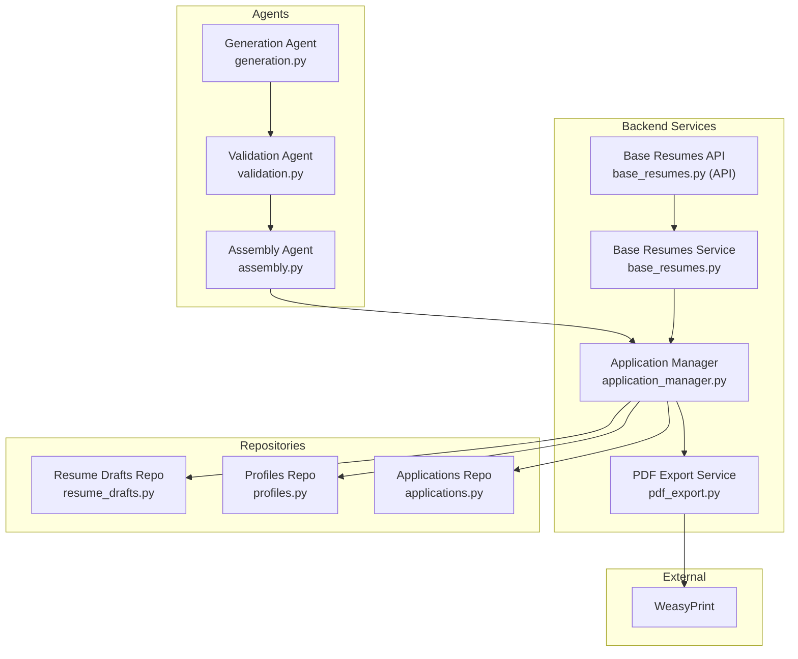
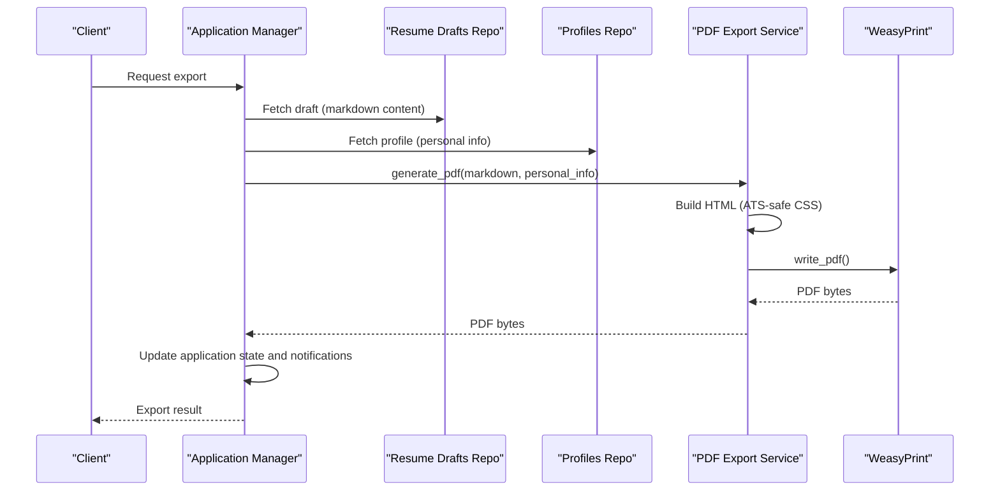
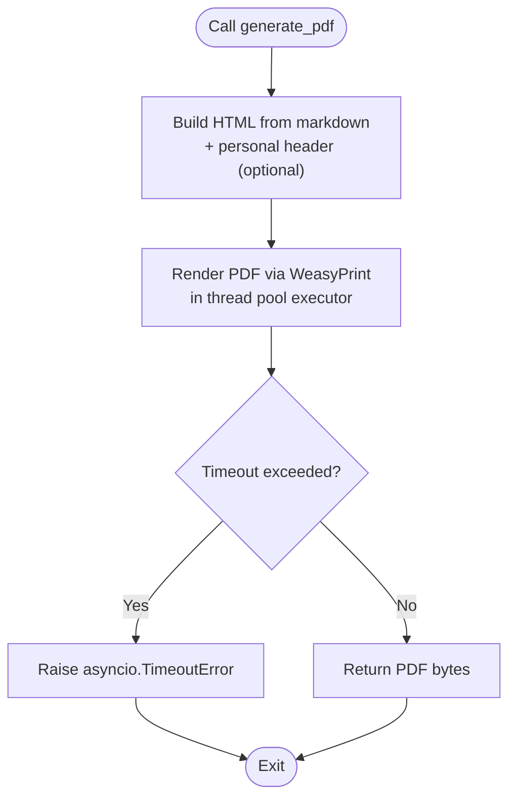
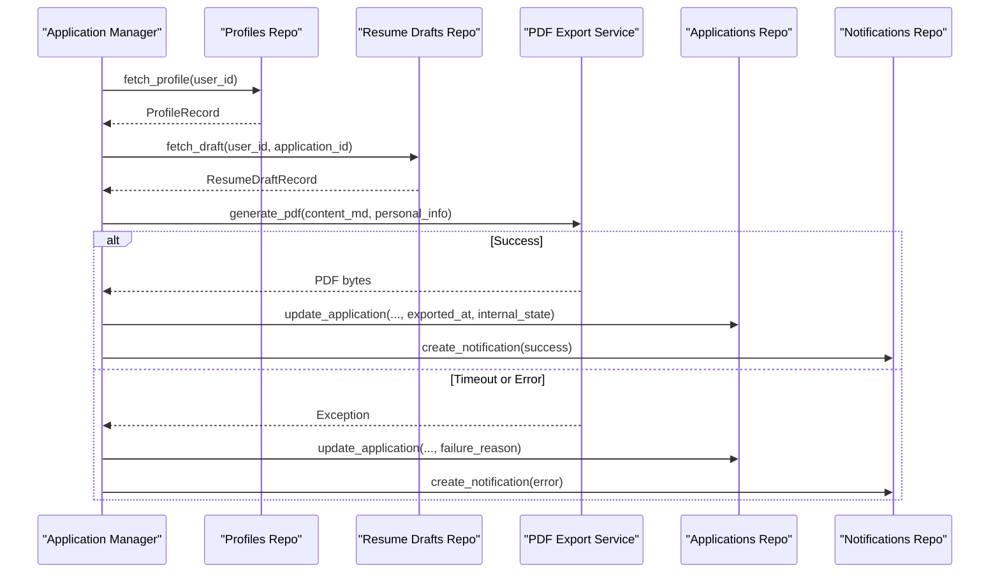
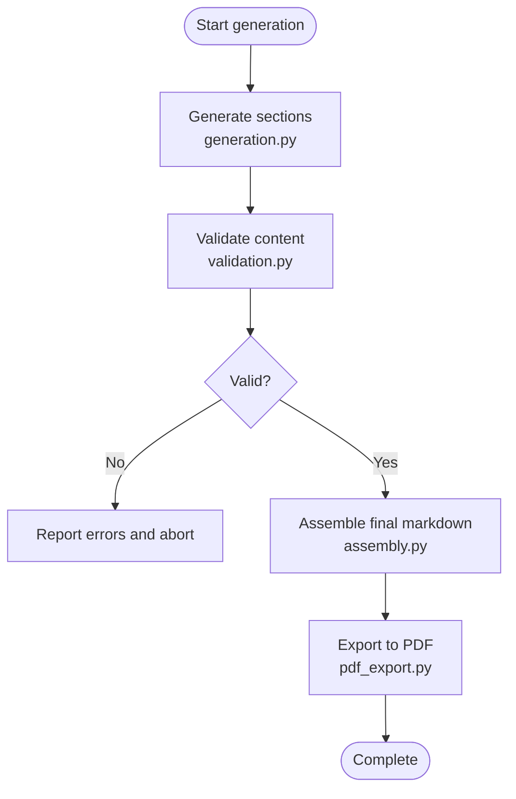
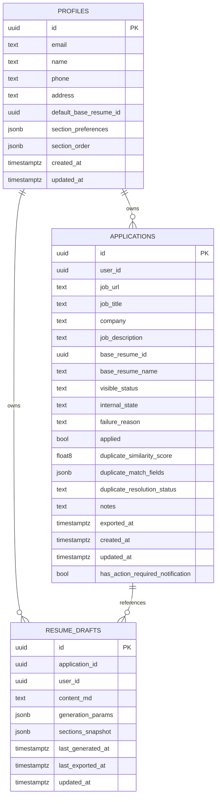
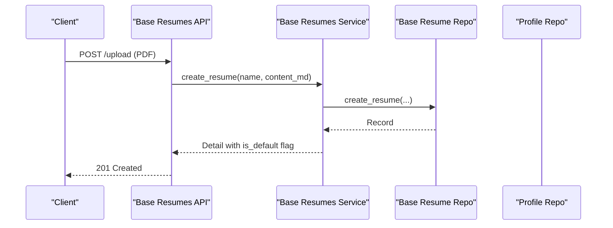
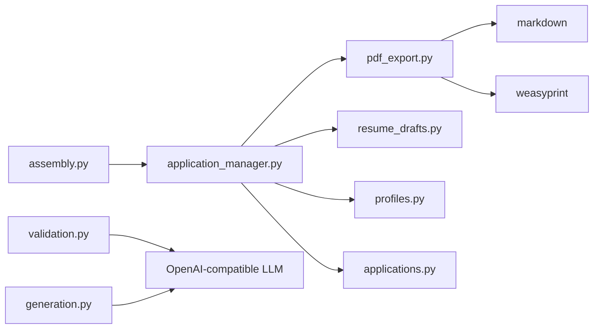

# PDF Export Service

<cite>
**Referenced Files in This Document**
- [pdf_export.py](file://backend/app/services/pdf_export.py)
- [application_manager.py](file://backend/app/services/application_manager.py)
- [resume_drafts.py](file://backend/app/db/resume_drafts.py)
- [profiles.py](file://backend/app/db/profiles.py)
- [applications.py](file://backend/app/db/applications.py)
- [workflow.py](file://backend/app/services/workflow.py)
- [validation.py](file://agents/validation.py)
- [assembly.py](file://agents/assembly.py)
- [generation.py](file://agents/generation.py)
- [base_resumes.py](file://backend/app/services/base_resumes.py)
- [base_resumes.py (API)](file://backend/app/api/base_resumes.py)
</cite>

## Table of Contents
1. [Introduction](#introduction)
2. [Project Structure](#project-structure)
3. [Core Components](#core-components)
4. [Architecture Overview](#architecture-overview)
5. [Detailed Component Analysis](#detailed-component-analysis)
6. [Dependency Analysis](#dependency-analysis)
7. [Performance Considerations](#performance-considerations)
8. [Troubleshooting Guide](#troubleshooting-guide)
9. [Conclusion](#conclusion)

## Introduction
This document describes the PDF Export Service that generates ATS-compliant resume PDFs from markdown content. It explains the end-to-end pipeline using WeasyPrint, the content transformation process, styling integration, and layout optimization. It also documents integration with resume drafts and generation parameters, quality and compression considerations, and troubleshooting common formatting issues. The service ensures compatibility with Applicant Tracking Systems (ATS) by enforcing strict content and styling rules.

## Project Structure
The PDF export pipeline spans several backend services and agents:
- PDF generation service: transforms markdown to HTML and renders PDF via WeasyPrint.
- Application manager: orchestrates export within the application workflow.
- Data repositories: persist resume drafts and application state.
- Validation agent: enforces ATS safety and content grounding.
- Assembly agent: composes final markdown with personal info and ordered sections.
- Generation agent: produces tailored sections respecting ATS constraints.
- Base resumes service/API: manages user-defined base resumes used as source material.

**Diagram sources**
- [pdf_export.py:78-96](file://backend/app/services/pdf_export.py#L78-L96)
- [application_manager.py:1080-1148](file://backend/app/services/application_manager.py#L1080-L1148)
- [resume_drafts.py:14-118](file://backend/app/db/resume_drafts.py#L14-L118)
- [profiles.py:14-68](file://backend/app/db/profiles.py#L14-L68)
- [applications.py:34-60](file://backend/app/db/applications.py#L34-L60)
- [validation.py:231-292](file://agents/validation.py#L231-L292)
- [assembly.py:12-26](file://agents/assembly.py#L12-L26)
- [generation.py:88-112](file://agents/generation.py#L88-L112)
- [base_resumes.py (API): 17-242:17-242](file://backend/app/api/base_resumes.py#L17-L242)
- [base_resumes.py:32-154](file://backend/app/services/base_resumes.py#L32-L154)

**Section sources**
- [pdf_export.py:14-96](file://backend/app/services/pdf_export.py#L14-L96)
- [application_manager.py:1080-1148](file://backend/app/services/application_manager.py#L1080-L1148)
- [resume_drafts.py:14-118](file://backend/app/db/resume_drafts.py#L14-L118)
- [profiles.py:14-68](file://backend/app/db/profiles.py#L14-L68)
- [applications.py:34-60](file://backend/app/db/applications.py#L34-L60)
- [validation.py:231-292](file://agents/validation.py#L231-L292)
- [assembly.py:12-26](file://agents/assembly.py#L12-L26)
- [generation.py:88-112](file://agents/generation.py#L88-L112)
- [base_resumes.py (API): 17-242:17-242](file://backend/app/api/base_resumes.py#L17-L242)
- [base_resumes.py:32-154](file://backend/app/services/base_resumes.py#L32-L154)

## Core Components
- PDF Export Service
  - Converts markdown to an ATS-safe HTML document and renders a PDF using WeasyPrint.
  - Uses a thread pool executor to keep the event loop unblocked and enforces a timeout.
  - Builds a personal header from profile data and applies a fixed, ATS-friendly stylesheet.
- Application Manager
  - Coordinates export within the application workflow, constructs filenames, and updates application state and notifications upon success or failure.
- Resume Drafts Repository
  - Stores markdown content, generation parameters, and timestamps for drafts.
- Profiles Repository
  - Supplies personal info (name, email, phone, address) used in the resume header.
- Applications Repository
  - Tracks application state, failure reasons, and export timestamps.
- Validation Agent
  - Ensures generated content is grounded in the base resume, maintains correct section order, and enforces ATS safety (no tables/images).
- Assembly Agent
  - Composes final markdown with a personal header and ordered sections.
- Generation Agent
  - Produces tailored sections respecting ATS constraints and target page-length guidance.
- Base Resumes Service/API
  - Manages user-defined base resumes used as source material for generation.

**Section sources**
- [pdf_export.py:14-96](file://backend/app/services/pdf_export.py#L14-L96)
- [application_manager.py:1080-1148](file://backend/app/services/application_manager.py#L1080-L1148)
- [resume_drafts.py:14-118](file://backend/app/db/resume_drafts.py#L14-L118)
- [profiles.py:14-68](file://backend/app/db/profiles.py#L14-L68)
- [applications.py:34-60](file://backend/app/db/applications.py#L34-L60)
- [validation.py:231-292](file://agents/validation.py#L231-L292)
- [assembly.py:12-26](file://agents/assembly.py#L12-L26)
- [generation.py:88-112](file://agents/generation.py#L88-L112)
- [base_resumes.py (API): 17-242:17-242](file://backend/app/api/base_resumes.py#L17-L242)
- [base_resumes.py:32-154](file://backend/app/services/base_resumes.py#L32-L154)

## Architecture Overview
The PDF export pipeline integrates generation, validation, assembly, and export orchestration:

**Diagram sources**
- [application_manager.py:1080-1148](file://backend/app/services/application_manager.py#L1080-L1148)
- [resume_drafts.py:50-60](file://backend/app/db/resume_drafts.py#L50-L60)
- [profiles.py:47-68](file://backend/app/db/profiles.py#L47-L68)
- [pdf_export.py:78-96](file://backend/app/services/pdf_export.py#L78-L96)

## Detailed Component Analysis

### PDF Export Service
- Responsibilities
  - Build an HTML document from markdown with an ATS-safe stylesheet.
  - Optionally include a centered personal header derived from profile data.
  - Render PDF using WeasyPrint in a thread pool executor with a timeout.
- Key behaviors
  - Deferred import of WeasyPrint to avoid module load failures in environments lacking native libraries.
  - Timeout enforcement to prevent long-running conversions.
  - Fixed font family, sizes, and margins optimized for print and ATS parsing.
- Styling integration
  - Serif fonts, modest font sizes, and minimal spacing to reduce layout variance.
  - No tables, images, or decorative elements to maintain ATS compliance.
- Layout optimization
  - Standard heading levels and paragraph spacing improve readability and ATS parsing.
  - Margins configured for standard page layout.

**Diagram sources**
- [pdf_export.py:78-96](file://backend/app/services/pdf_export.py#L78-L96)
- [pdf_export.py:14-68](file://backend/app/services/pdf_export.py#L14-L68)

**Section sources**
- [pdf_export.py:14-96](file://backend/app/services/pdf_export.py#L14-L96)

### Application Manager Export Workflow
- Responsibilities
  - Fetch profile and draft, construct filename, and call the PDF export service.
  - Handle timeouts and exceptions, update application state, and notify users.
- Integration points
  - Reads personal info from profile and markdown content from draft.
  - Updates application exported_at timestamp and internal state on success.
- Notifications and emails
  - Emits success/error notifications and attempts to send an email on failure.

**Diagram sources**
- [application_manager.py:1080-1148](file://backend/app/services/application_manager.py#L1080-L1148)
- [profiles.py:47-68](file://backend/app/db/profiles.py#L47-L68)
- [resume_drafts.py:50-60](file://backend/app/db/resume_drafts.py#L50-L60)
- [applications.py:270-308](file://backend/app/db/applications.py#L270-L308)

**Section sources**
- [application_manager.py:1080-1148](file://backend/app/services/application_manager.py#L1080-L1148)
- [applications.py:270-308](file://backend/app/db/applications.py#L270-L308)

### Content Transformation and ATS Safety
- Generation agent
  - Produces sections tailored to a job description while staying grounded in the base resume.
  - Enforces ATS-safe Markdown (no tables/images).
- Validation agent
  - Detects hallucinations by comparing generated content to the base resume.
  - Verifies required sections and correct ordering.
  - Enforces ATS safety rules and auto-applies minor formatting fixes.
- Assembly agent
  - Composes final markdown with a personal header and ordered sections.
  - Ensures personal info comes from the profile, not LLM generation.

**Diagram sources**
- [generation.py:88-112](file://agents/generation.py#L88-L112)
- [validation.py:231-292](file://agents/validation.py#L231-L292)
- [assembly.py:12-26](file://agents/assembly.py#L12-L26)
- [pdf_export.py:78-96](file://backend/app/services/pdf_export.py#L78-L96)

**Section sources**
- [generation.py:88-112](file://agents/generation.py#L88-L112)
- [validation.py:231-292](file://agents/validation.py#L231-L292)
- [assembly.py:12-26](file://agents/assembly.py#L12-L26)

### Data Models and Repositories
- ResumeDraftRecord
  - Stores markdown content, generation parameters, sections snapshot, and timestamps.
- ProfileRecord
  - Provides personal info used in the resume header.
- ApplicationRecord
  - Tracks application state, failure reasons, and export timestamps.

**Diagram sources**
- [resume_drafts.py:14-24](file://backend/app/db/resume_drafts.py#L14-L24)
- [profiles.py:14-24](file://backend/app/db/profiles.py#L14-L24)
- [applications.py:34-60](file://backend/app/db/applications.py#L34-L60)

**Section sources**
- [resume_drafts.py:14-118](file://backend/app/db/resume_drafts.py#L14-L118)
- [profiles.py:14-68](file://backend/app/db/profiles.py#L14-L68)
- [applications.py:34-60](file://backend/app/db/applications.py#L34-L60)

### Base Resumes Management
- API endpoints support creating, uploading, listing, updating, deleting, and setting default base resumes.
- Upload endpoint supports optional LLM cleanup of parsed PDF content.
- Service enforces ownership and default resume association.

**Diagram sources**
- [base_resumes.py (API): 111-169:111-169](file://backend/app/api/base_resumes.py#L111-L169)
- [base_resumes.py:55-73](file://backend/app/services/base_resumes.py#L55-L73)

**Section sources**
- [base_resumes.py (API): 17-242:17-242](file://backend/app/api/base_resumes.py#L17-L242)
- [base_resumes.py:32-154](file://backend/app/services/base_resumes.py#L32-L154)

## Dependency Analysis
- Coupling and cohesion
  - PDF Export Service is cohesive around HTML-to-PDF conversion and has low coupling to external systems.
  - Application Manager orchestrates multiple repositories and services, increasing coupling but centralizing workflow logic.
- External dependencies
  - WeasyPrint is used for PDF rendering; import is deferred to avoid environment-specific failures.
  - Validation agent depends on OpenAI-compatible LLM for structured output.
- Potential circular dependencies
  - No evident circular imports among the analyzed modules.

**Diagram sources**
- [application_manager.py:1080-1148](file://backend/app/services/application_manager.py#L1080-L1148)
- [pdf_export.py:71-75](file://backend/app/services/pdf_export.py#L71-L75)
- [validation.py:89-95](file://agents/validation.py#L89-L95)
- [generation.py:341-348](file://agents/generation.py#L341-L348)

**Section sources**
- [pdf_export.py:71-75](file://backend/app/services/pdf_export.py#L71-L75)
- [application_manager.py:1080-1148](file://backend/app/services/application_manager.py#L1080-L1148)
- [validation.py:89-95](file://agents/validation.py#L89-L95)
- [generation.py:341-348](file://agents/generation.py#L341-L348)

## Performance Considerations
- Concurrency and blocking
  - PDF generation runs in a thread pool executor to avoid blocking the event loop.
  - A timeout is enforced to prevent long-running conversions from stalling the service.
- Rendering cost
  - WeasyPrint rendering cost scales with content length and complexity; prefer ATS-safe, minimal markup.
- File size optimization
  - The current implementation does not apply PDF compression or optimization; consider adding compression options if needed.
- Network latency
  - Validation agent relies on external LLM calls; timeouts and fallback models mitigate latency risks.

[No sources needed since this section provides general guidance]

## Troubleshooting Guide
- PDF export timeout
  - Symptom: asyncio.TimeoutError during export.
  - Resolution: Retry export; ensure content is concise and free of heavy formatting.
  - Related code: timeout enforcement and exception handling.
- Export failure with generic error
  - Symptom: ValueError raised after catching non-timeout exceptions.
  - Resolution: Inspect logs for underlying causes; confirm WeasyPrint availability and environment readiness.
- ATS formatting issues
  - Symptom: ATS parsing problems due to unsupported elements.
  - Resolution: Avoid tables and images; stick to headings, paragraphs, and bullet lists.
- Validation failures
  - Symptom: Validation errors indicating hallucinations, missing sections, wrong order, or ATS violations.
  - Resolution: Regenerate sections to ground claims in the base resume; ensure required sections are present and ordered correctly.
- Filename and state updates
  - Symptom: Application not transitioning to expected state after export.
  - Resolution: Confirm exported_at timestamp and internal_state updates occur on success; verify notifications are created.

**Section sources**
- [application_manager.py:1100-1117](file://backend/app/services/application_manager.py#L1100-L1117)
- [pdf_export.py:11](file://backend/app/services/pdf_export.py#L11)
- [validation.py:231-292](file://agents/validation.py#L231-L292)

## Conclusion
The PDF Export Service provides a robust, ATS-compliant pipeline for generating resumes from markdown content. By combining generation, validation, and assembly with a controlled HTML-to-PDF transformation, it ensures reliable exports suitable for ATS systems. The service’s timeout and asynchronous design help maintain responsiveness, while the repository-driven workflow keeps state consistent across the application lifecycle. For future enhancements, consider adding PDF compression options and expanding styling customization while preserving ATS safety.