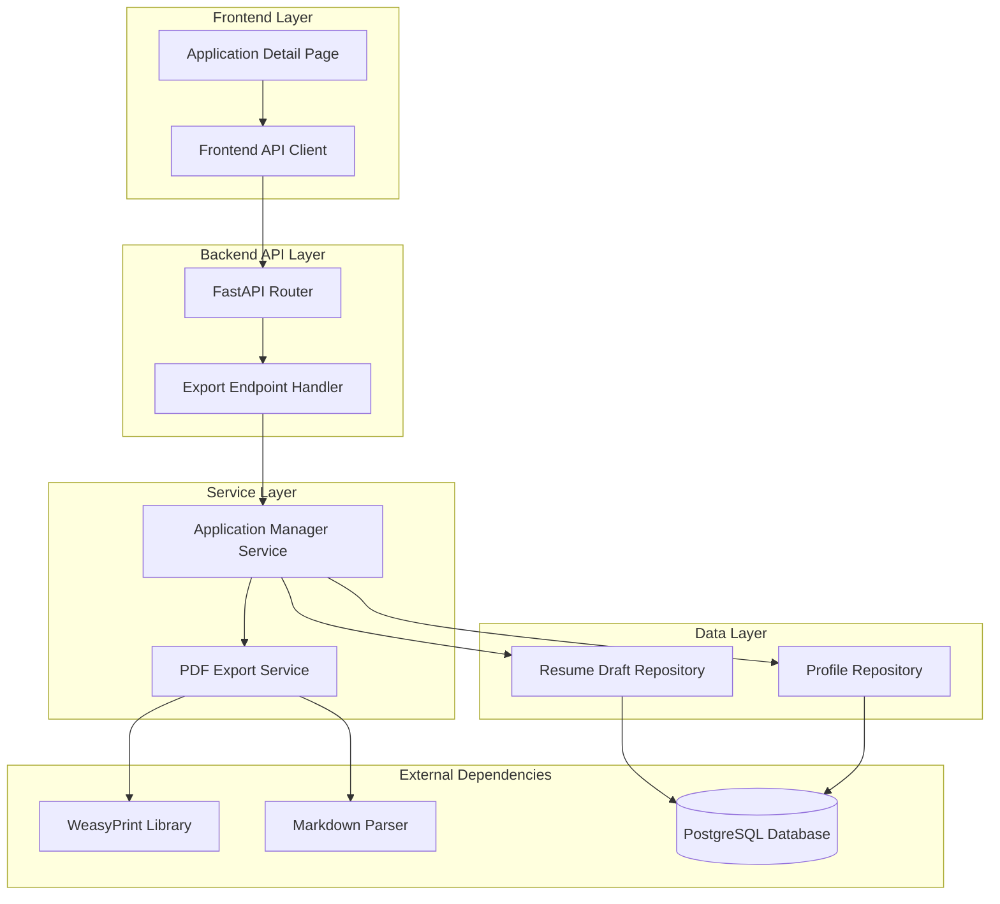
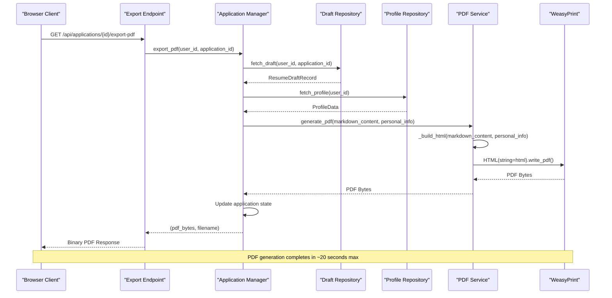

# PDF Export Service

<cite>
**Referenced Files in This Document**
- [pdf_export.py](file://backend/app/services/pdf_export.py)
- [applications.py](file://backend/app/api/applications.py)
- [application_manager.py](file://backend/app/services/application_manager.py)
- [resume_drafts.py](file://backend/app/db/resume_drafts.py)
- [api.ts](file://frontend/src/lib/api.ts)
- [ApplicationDetailPage.tsx](file://frontend/src/routes/ApplicationDetailPage.tsx)
- [phase-3-4-generation-editing-export.md](file://docs/task-output/2026-04-07-phase-3-4-generation-editing-export.md)
- [config.py](file://backend/app/core/config.py)
</cite>

## Table of Contents
1. [Introduction](#introduction)
2. [System Architecture](#system-architecture)
3. [Core Components](#core-components)
4. [PDF Generation Pipeline](#pdf-generation-pipeline)
5. [Frontend Integration](#frontend-integration)
6. [Error Handling and Timeout Management](#error-handling-and-timeout-management)
7. [Performance Considerations](#performance-considerations)
8. [Configuration and Dependencies](#configuration-and-dependencies)
9. [Troubleshooting Guide](#troubleshooting-guide)
10. [Conclusion](#conclusion)

## Introduction

The PDF Export Service is a critical component of the AI Resume Builder application that converts Markdown-based resume drafts into ATS (Applicant Tracking System)-friendly PDF documents. This service enables users to download professional-quality PDF resumes directly from their browser, supporting the complete workflow from AI-generated content to downloadable formats.

The service operates on-demand, generating fresh PDFs from the latest draft content stored in the database. It implements strict ATS safety standards, ensuring compatibility with automated hiring systems while maintaining professional presentation quality.

## System Architecture

The PDF Export Service follows a layered architecture pattern with clear separation of concerns:

**Diagram sources**
- [applications.py:658-678](file://backend/app/api/applications.py#L658-L678)
- [application_manager.py:1204-1283](file://backend/app/services/application_manager.py#L1204-L1283)
- [pdf_export.py:78-96](file://backend/app/services/pdf_export.py#L78-L96)

## Core Components

### PDF Export Service

The PDF Export Service is implemented as a standalone service responsible for converting Markdown content to PDF format. It features:

- **ATS-Safe Rendering**: Uses clean typography and CSS that passes ATS screening
- **Thread Pool Execution**: Non-blocking operation using asyncio with timeout protection
- **Deferred Library Loading**: WeasyPrint import is deferred to handle development environment constraints
- **Personal Information Integration**: Automatically includes user profile data in PDF headers

**Section sources**
- [pdf_export.py:14-96](file://backend/app/services/pdf_export.py#L14-L96)

### Application Manager Service

The Application Manager coordinates the complete PDF export workflow:

- **Draft Validation**: Ensures a valid draft exists before export
- **Profile Integration**: Retrieves user personal information for PDF headers
- **Status Management**: Updates application state and timestamps upon successful export
- **Error Recovery**: Handles export failures gracefully with notifications and state rollback

**Section sources**
- [application_manager.py:1204-1283](file://backend/app/services/application_manager.py#L1204-L1283)

### API Integration

The FastAPI router provides the HTTP interface for PDF exports:

- **Authentication**: Requires authenticated user context
- **Authorization**: Validates user ownership of the application
- **Response Handling**: Returns binary PDF content with appropriate headers
- **Error Mapping**: Converts service exceptions to HTTP responses

**Section sources**
- [applications.py:658-678](file://backend/app/api/applications.py#L658-L678)

## PDF Generation Pipeline

The PDF generation process follows a multi-stage pipeline designed for reliability and performance:

**Diagram sources**
- [application_manager.py:1204-1283](file://backend/app/services/application_manager.py#L1204-L1283)
- [pdf_export.py:78-96](file://backend/app/services/pdf_export.py#L78-L96)

### HTML Generation Process

The service converts Markdown to HTML using a two-stage process:

1. **Header Block Creation**: Personal information is formatted into a centered header
2. **Content Processing**: Markdown is converted to HTML with ATS-safe extensions
3. **CSS Integration**: Clean, professional styling optimized for ATS systems

**Section sources**
- [pdf_export.py:14-68](file://backend/app/services/pdf_export.py#L14-L68)

### PDF Conversion Process

The conversion from HTML to PDF utilizes WeasyPrint with specific optimizations:

- **Font Selection**: Georgia and Times New Roman for professional appearance
- **Spacing Control**: Precise margin and line height settings
- **ATS Compliance**: No tables, images, or decorative elements
- **Timeout Protection**: 20-second maximum execution time

**Section sources**
- [pdf_export.py:71-96](file://backend/app/services/pdf_export.py#L71-L96)

## Frontend Integration

The frontend provides seamless PDF export functionality through React components:

### API Integration

The frontend communicates with the backend through a dedicated API function:

- **Authentication**: Automatic bearer token inclusion
- **Error Handling**: Comprehensive error catching and user feedback
- **Blob Processing**: Direct binary response handling for PDF downloads

**Section sources**
- [api.ts:474-494](file://frontend/src/lib/api.ts#L474-L494)

### User Interface

The Application Detail Page features:

- **Export Button**: Prominent button triggering PDF generation
- **Loading States**: Visual feedback during export processing
- **Error Display**: Clear error messaging for failed exports
- **Automatic Refresh**: Post-export state refresh to show completion

**Section sources**
- [ApplicationDetailPage.tsx:637-672](file://frontend/src/routes/ApplicationDetailPage.tsx#L637-L672)

## Error Handling and Timeout Management

The PDF Export Service implements comprehensive error handling strategies:

### Timeout Management

- **Hard Timeout**: 20-second maximum execution time for PDF generation
- **Async Safety**: Non-blocking operation prevents server thread starvation
- **Graceful Degradation**: Timeout errors are caught and handled appropriately

### Error Categories

- **Missing Draft**: Prevents export attempts without generated content
- **Export Failures**: Comprehensive error logging and user notification
- **Database Issues**: Proper exception mapping to HTTP responses
- **Authentication Errors**: Unauthorized access prevention

**Section sources**
- [application_manager.py:1235-1252](file://backend/app/services/application_manager.py#L1235-L1252)
- [application_manager.py:1285-1318](file://backend/app/services/application_manager.py#L1285-L1318)

## Performance Considerations

### Thread Pool Optimization

The service leverages Python's asyncio with thread pool executors to maintain responsiveness:

- **Non-blocking Conversion**: WeasyPrint runs in separate threads
- **Event Loop Safety**: Main event loop remains responsive during PDF generation
- **Resource Management**: Proper cleanup of thread resources

### Memory Management

- **Streaming Responses**: PDF bytes streamed directly to client
- **Temporary Processing**: No persistent PDF storage on server
- **Efficient Caching**: Settings and configuration cached via LRU cache

### Scalability Factors

- **Horizontal Scaling**: Stateless service supports multiple instances
- **Database Efficiency**: Minimal database queries for export operations
- **Network Optimization**: Direct binary transfer reduces overhead

## Configuration and Dependencies

### External Dependencies

The service requires specific external libraries:

- **WeasyPrint**: Core PDF generation engine
- **Markdown**: Content processing and conversion
- **Asyncio**: Non-blocking operation support

### Environment Configuration

Key configuration parameters:

- **PDF_EXPORT_TIMEOUT_SECONDS**: 20-second timeout threshold
- **Database Connections**: PostgreSQL connectivity for draft retrieval
- **Profile Integration**: User data availability for PDF headers

**Section sources**
- [pdf_export.py:11](file://backend/app/services/pdf_export.py#L11)
- [config.py:71-74](file://backend/app/core/config.py#L71-L74)

### Database Schema Integration

The service interacts with the resume drafts table:

- **Content Retrieval**: Fetches latest Markdown content for export
- **Timestamp Updates**: Records export completion times
- **Application Context**: Links exports to specific application instances

**Section sources**
- [resume_drafts.py:50-60](file://backend/app/db/resume_drafts.py#L50-L60)
- [resume_drafts.py:154-169](file://backend/app/db/resume_drafts.py#L154-L169)

## Troubleshooting Guide

### Common Issues and Solutions

#### PDF Generation Failures

**Symptoms**: Export requests timeout or fail with generic errors
**Causes**: 
- WeasyPrint library installation issues
- Excessive content complexity
- Memory constraints

**Solutions**:
- Verify WeasyPrint installation in deployment environment
- Simplify complex Markdown formatting
- Monitor server resource utilization

#### Authentication Problems

**Symptoms**: 401/403 errors on export attempts
**Causes**:
- Expired or invalid authentication tokens
- User account access restrictions
- Session timeout issues

**Solutions**:
- Re-authenticate user session
- Verify user permissions for the application
- Check authentication middleware configuration

#### Content Issues

**Symptoms**: Empty or malformed PDF output
**Causes**:
- Missing draft content
- Corrupted Markdown formatting
- Profile data inconsistencies

**Solutions**:
- Ensure draft generation completed successfully
- Validate Markdown syntax and structure
- Check profile information completeness

### Monitoring and Debugging

#### Logging Strategy

The service implements comprehensive logging:

- **Operation Tracking**: Export attempts and completions
- **Error Details**: Specific failure reasons and stack traces
- **Performance Metrics**: Generation timing and resource usage

#### Health Checks

Regular monitoring should verify:
- Database connectivity for draft retrieval
- External library availability (WeasyPrint)
- API endpoint accessibility
- Response time metrics

**Section sources**
- [application_manager.py:1246-1252](file://backend/app/services/application_manager.py#L1246-L1252)

## Conclusion

The PDF Export Service represents a robust, production-ready solution for converting AI-generated resume content into professional PDF documents. Its design emphasizes reliability, performance, and user experience through:

- **ATS Compliance**: Ensures compatibility with automated hiring systems
- **Non-blocking Operations**: Maintains server responsiveness under load
- **Comprehensive Error Handling**: Provides graceful degradation and user feedback
- **Clean Architecture**: Separation of concerns enables maintainability and testing
- **Frontend Integration**: Seamless user experience with proper state management

The service successfully bridges the gap between AI-powered content generation and practical job application submission, providing users with professional-quality PDF resumes on demand while maintaining system stability and performance.