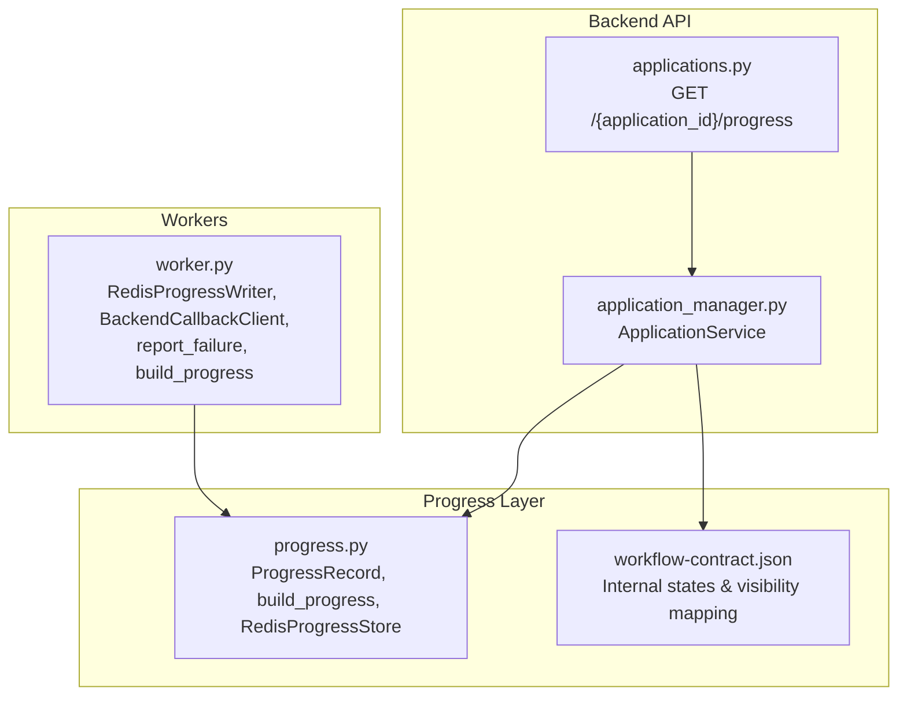
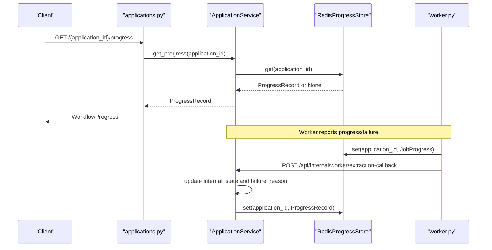
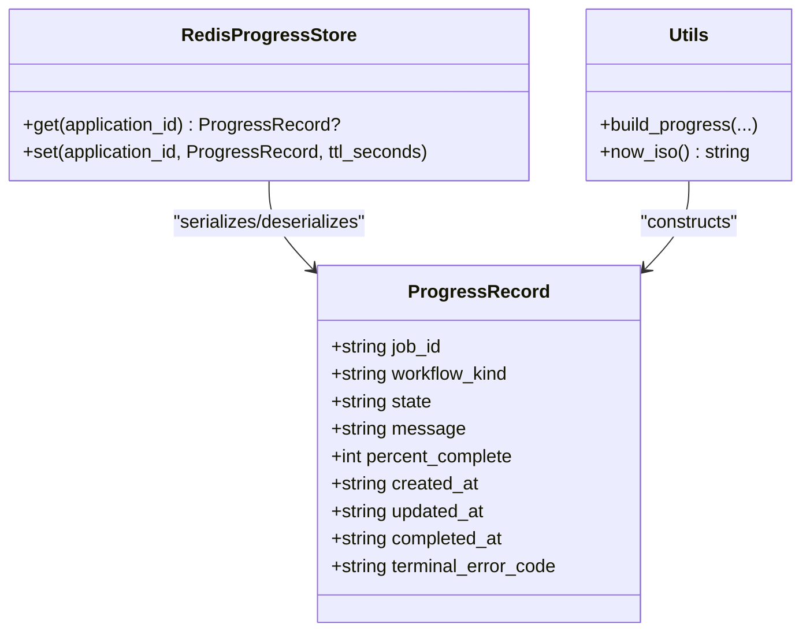
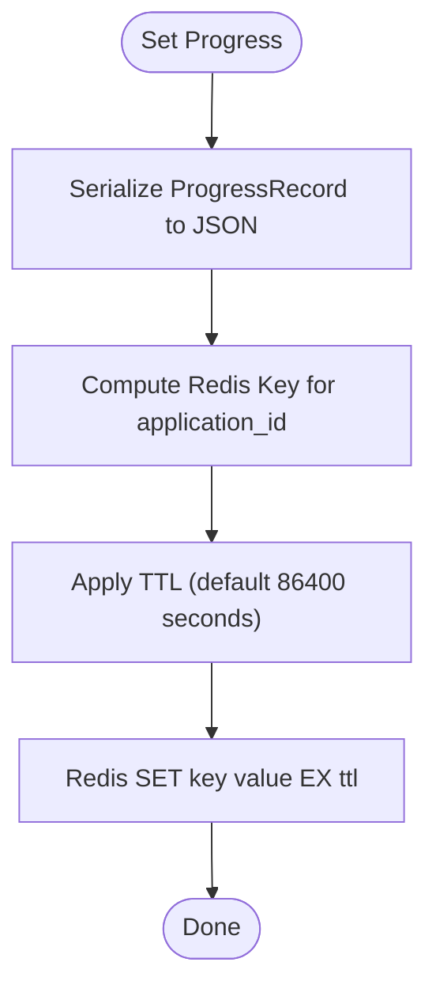
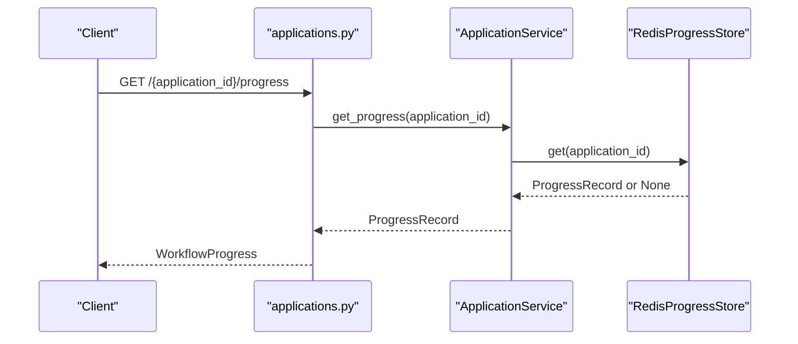
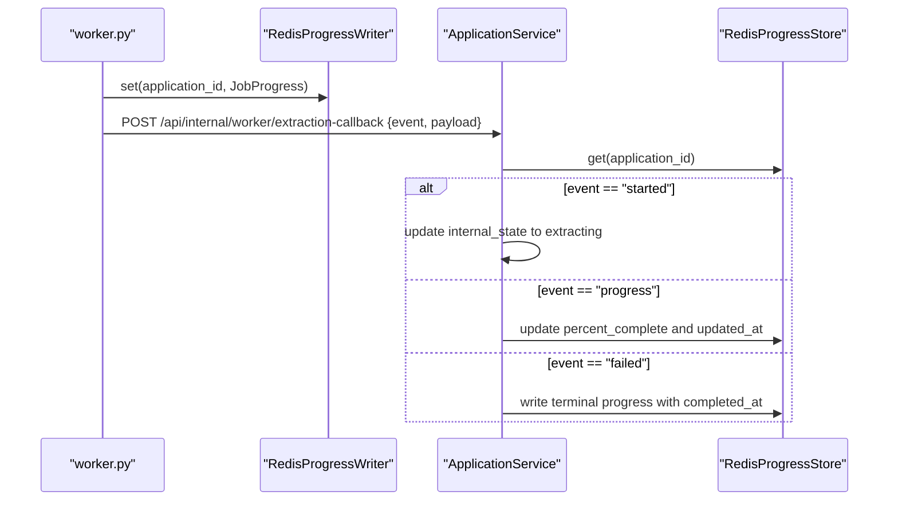
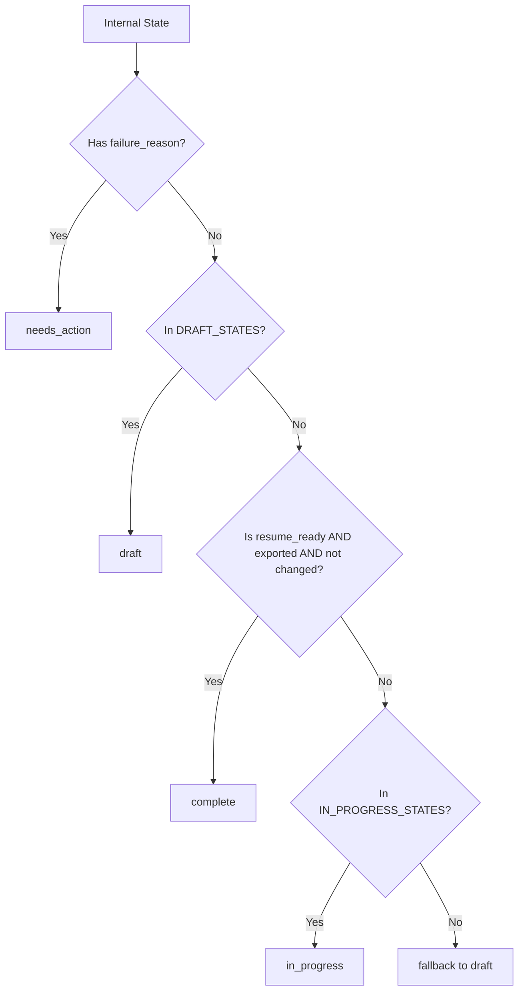
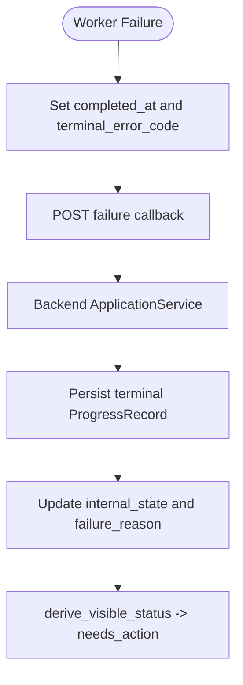
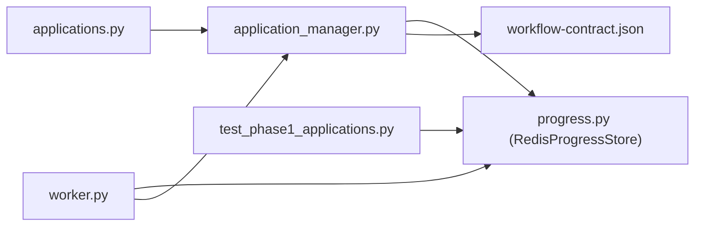

# Progress Tracking Service

<cite>
**Referenced Files in This Document**
- [progress.py](file://backend/app/services/progress.py)
- [application_manager.py](file://backend/app/services/application_manager.py)
- [applications.py](file://backend/app/api/applications.py)
- [workflow.py](file://backend/app/services/workflow.py)
- [workflow-contract.json](file://shared/workflow-contract.json)
- [worker.py](file://agents/worker.py)
- [test_phase1_applications.py](file://backend/tests/test_phase1_applications.py)
</cite>

## Table of Contents
1. [Introduction](#introduction)
2. [Project Structure](#project-structure)
3. [Core Components](#core-components)
4. [Architecture Overview](#architecture-overview)
5. [Detailed Component Analysis](#detailed-component-analysis)
6. [Dependency Analysis](#dependency-analysis)
7. [Performance Considerations](#performance-considerations)
8. [Troubleshooting Guide](#troubleshooting-guide)
9. [Conclusion](#conclusion)

## Introduction
This document describes the Progress Tracking Service responsible for real-time status updates of long-running operations such as extraction, generation, and regeneration. It covers the data model, storage mechanism, progress building utilities, callback integration, state management, and terminal error handling. It also explains how clients poll progress and how failures propagate through the system.

## Project Structure
The progress tracking spans three layers:
- Data model and storage: backend/app/services/progress.py
- API surface and workflow integration: backend/app/api/applications.py and backend/app/services/application_manager.py
- Worker-side progress reporting and callbacks: agents/worker.py
- Workflow contract and visibility mapping: shared/workflow-contract.json
- Tests validating progress store and workflow contract: backend/tests/test_phase1_applications.py

**Diagram sources**
- [applications.py:526-540](file://backend/app/api/applications.py#L526-L540)
- [application_manager.py:143-168](file://backend/app/services/application_manager.py#L143-L168)
- [progress.py:13-78](file://backend/app/services/progress.py#L13-L78)
- [workflow-contract.json:1-112](file://shared/workflow-contract.json#L1-L112)
- [worker.py:272-305](file://agents/worker.py#L272-L305)

**Section sources**
- [progress.py:13-78](file://backend/app/services/progress.py#L13-L78)
- [applications.py:526-540](file://backend/app/api/applications.py#L526-L540)
- [application_manager.py:143-168](file://backend/app/services/application_manager.py#L143-L168)
- [workflow-contract.json:1-112](file://shared/workflow-contract.json#L1-L112)
- [worker.py:272-305](file://agents/worker.py#L272-L305)

## Core Components
- ProgressRecord: Pydantic model representing a single progress snapshot with job identity, workflow kind, state, message, percentage, timestamps, optional completion timestamp, and terminal error code.
- build_progress: Utility to construct a ProgressRecord with consistent timestamps and optional completion markers.
- RedisProgressStore: Asynchronous Redis-backed persistence keyed by application_id with TTL.
- ApplicationService integration: Orchestrates enqueueing jobs, initial progress writes, and callback-driven updates.
- Worker callback pipeline: Reports progress and failures back to the backend via a secret-protected endpoint.
- Visible status derivation: Maps internal states and failure reasons to user-visible statuses.

**Section sources**
- [progress.py:13-50](file://backend/app/services/progress.py#L13-L50)
- [progress.py:53-78](file://backend/app/services/progress.py#L53-L78)
- [application_manager.py:143-168](file://backend/app/services/application_manager.py#L143-L168)
- [workflow.py:11-31](file://backend/app/services/workflow.py#L11-L31)
- [worker.py:290-305](file://agents/worker.py#L290-L305)

## Architecture Overview
The system integrates three main flows:
- Creation and initial progress: On creation or retry, the backend enqueues a job and writes initial progress.
- Worker progress callbacks: Workers periodically report progress and final outcomes to the backend.
- Frontend polling: Clients poll the progress endpoint to render live status.

**Diagram sources**
- [applications.py:526-540](file://backend/app/api/applications.py#L526-L540)
- [application_manager.py:455-475](file://backend/app/services/application_manager.py#L455-L475)
- [progress.py:61-74](file://backend/app/services/progress.py#L61-L74)
- [worker.py:290-305](file://agents/worker.py#L290-L305)

## Detailed Component Analysis

### ProgressRecord and build_progress
- Purpose: Define the canonical shape of progress snapshots and provide a factory to populate timestamps and optional completion/error fields.
- Fields:
  - job_id: Unique identifier for the job.
  - workflow_kind: One of extraction, generation, regeneration, export.
  - state: Internal state aligned with the workflow contract.
  - message: Human-readable status message.
  - percent_complete: Integer 0–100.
  - created_at, updated_at: ISO timestamps.
  - completed_at: Set upon terminal completion.
  - terminal_error_code: Failure reason when terminal.
- build_progress: Ensures consistent created_at/updated_at behavior and optional completion stamping.

**Diagram sources**
- [progress.py:13-50](file://backend/app/services/progress.py#L13-L50)
- [progress.py:53-78](file://backend/app/services/progress.py#L53-L78)

**Section sources**
- [progress.py:13-50](file://backend/app/services/progress.py#L13-L50)
- [progress.py:25-26](file://backend/app/services/progress.py#L25-L26)

### RedisProgressStore
- Key scheme: Uses a Redis key per application_id to store the JSON-serialized progress.
- Operations:
  - get: Returns None if missing; otherwise parses JSON into a ProgressRecord.
  - set: Serializes and stores with TTL (default 24 hours).
- Accessor: get_progress_store returns a configured instance from settings.

**Diagram sources**
- [progress.py:57-74](file://backend/app/services/progress.py#L57-L74)

**Section sources**
- [progress.py:53-78](file://backend/app/services/progress.py#L53-L78)

### API Integration and Polling
- Endpoint: GET /api/applications/{application_id}/progress returns WorkflowProgress (alias of ProgressRecord).
- Validation: Response is validated against the ProgressRecord schema defined in the workflow contract.

**Diagram sources**
- [applications.py:526-540](file://backend/app/api/applications.py#L526-L540)
- [progress.py:61-65](file://backend/app/services/progress.py#L61-L65)

**Section sources**
- [applications.py:526-540](file://backend/app/api/applications.py#L526-L540)
- [workflow-contract.json:89-111](file://shared/workflow-contract.json#L89-L111)

### Worker Callbacks and Progress Reporting
- Worker constructs JobProgress snapshots and writes them to Redis via RedisProgressWriter.
- Worker posts structured payloads to the backend callback endpoint with a shared secret header.
- Backend ApplicationService handles events:
  - started: Moves internal state to extracting.
  - progress: Increments percent_complete up to a cap and resets generation message.
  - failed: Writes terminal progress with completion timestamp and failure reason.

**Diagram sources**
- [worker.py:272-305](file://agents/worker.py#L272-L305)
- [application_manager.py:455-662](file://backend/app/services/application_manager.py#L455-L662)
- [progress.py:61-74](file://backend/app/services/progress.py#L61-L74)

**Section sources**
- [worker.py:272-305](file://agents/worker.py#L272-L305)
- [application_manager.py:455-662](file://backend/app/services/application_manager.py#L455-L662)

### State Management and Visibility Mapping
- Internal states and failure reasons are defined in the workflow contract.
- derive_visible_status maps internal states and failure reasons to visible statuses (draft, needs_action, in_progress, complete).

**Diagram sources**
- [workflow.py:11-31](file://backend/app/services/workflow.py#L11-L31)
- [workflow-contract.json:34-87](file://shared/workflow-contract.json#L34-L87)

**Section sources**
- [workflow.py:11-31](file://backend/app/services/workflow.py#L11-L31)
- [workflow-contract.json:1-112](file://shared/workflow-contract.json#L1-L112)

### Terminal State Handling and Error Propagation
- On failure, workers set completed_at and terminal_error_code, then post a failure event.
- Backend persists terminal progress and updates internal state and failure_reason accordingly.
- Visible status transitions to needs_action when failure_reason is present.

**Diagram sources**
- [worker.py:475-509](file://agents/worker.py#L475-L509)
- [application_manager.py:648-662](file://backend/app/services/application_manager.py#L648-L662)
- [workflow.py:11-31](file://backend/app/services/workflow.py#L11-L31)

**Section sources**
- [worker.py:475-509](file://agents/worker.py#L475-L509)
- [application_manager.py:648-662](file://backend/app/services/application_manager.py#L648-L662)

## Dependency Analysis
- Backend API depends on ApplicationService for progress retrieval.
- ApplicationService depends on RedisProgressStore for persistence and on the workflow contract for state mapping.
- Workers depend on RedisProgressWriter for writing progress and BackendCallbackClient for notifying the backend.
- Tests include a FakeProgressStore to simulate Redis behavior during unit tests.

**Diagram sources**
- [applications.py:526-540](file://backend/app/api/applications.py#L526-L540)
- [application_manager.py:143-168](file://backend/app/services/application_manager.py#L143-L168)
- [progress.py:53-78](file://backend/app/services/progress.py#L53-L78)
- [workflow-contract.json:1-112](file://shared/workflow-contract.json#L1-L112)
- [worker.py:272-305](file://agents/worker.py#L272-L305)
- [test_phase1_applications.py:211-219](file://backend/tests/test_phase1_applications.py#L211-L219)

**Section sources**
- [test_phase1_applications.py:211-219](file://backend/tests/test_phase1_applications.py#L211-L219)

## Performance Considerations
- Redis latency: Progress reads/writes are O(1) with negligible overhead; ensure Redis is co-located with the backend for low latency.
- TTL strategy: Default TTL of 24 hours balances visibility with cleanup; adjust based on retention needs.
- Payload size: Progress snapshots are small; JSON serialization cost is minimal.
- Concurrency: Redis operations are atomic; avoid excessive polling to reduce load.

## Troubleshooting Guide
- No progress returned:
  - Verify Redis connectivity and key correctness.
  - Confirm the job was enqueued and initial progress was written.
- Incorrect percent_complete:
  - Ensure worker callbacks increment progress sensibly and do not overshoot 100.
- Terminal state not reflected:
  - Check that workers set completed_at and terminal_error_code on failure.
  - Confirm backend ApplicationService persisted the terminal progress and updated internal_state.
- Visible status not updating:
  - Validate derive_visible_status logic and that failure_reason is set appropriately.

**Section sources**
- [progress.py:61-74](file://backend/app/services/progress.py#L61-L74)
- [application_manager.py:648-662](file://backend/app/services/application_manager.py#L648-L662)
- [workflow.py:11-31](file://backend/app/services/workflow.py#L11-L31)

## Conclusion
The Progress Tracking Service provides a robust, Redis-backed mechanism for real-time progress updates across extraction, generation, and regeneration workflows. It integrates cleanly with the backend API, worker callbacks, and visibility mapping, ensuring accurate state representation and reliable terminal error handling.