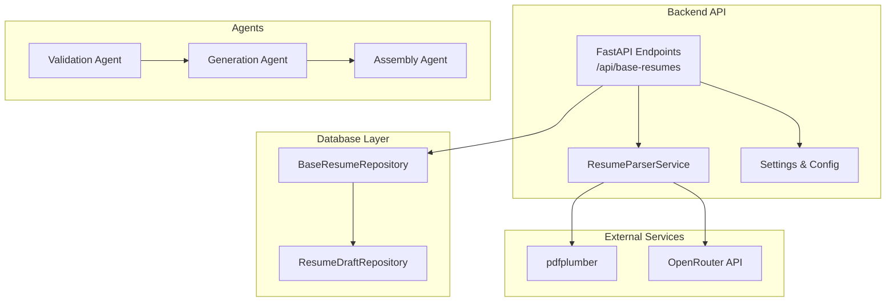
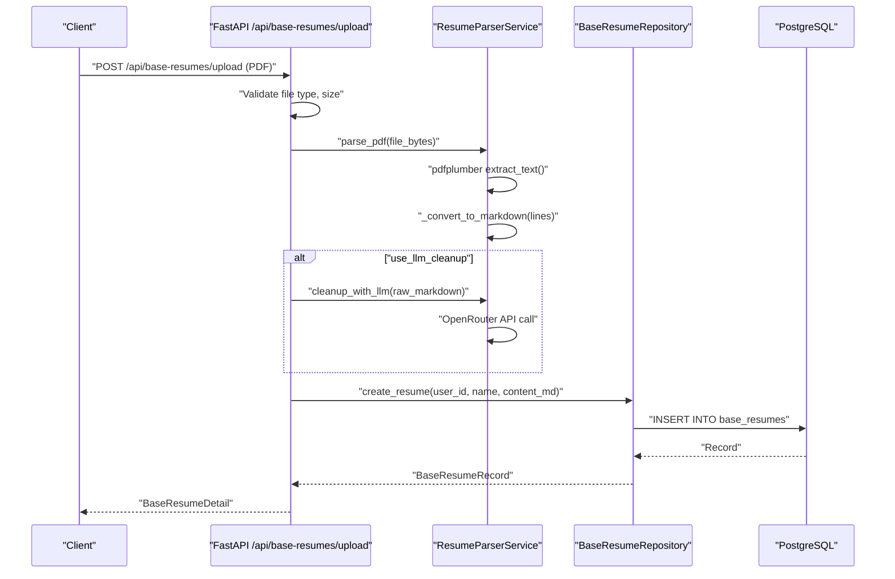
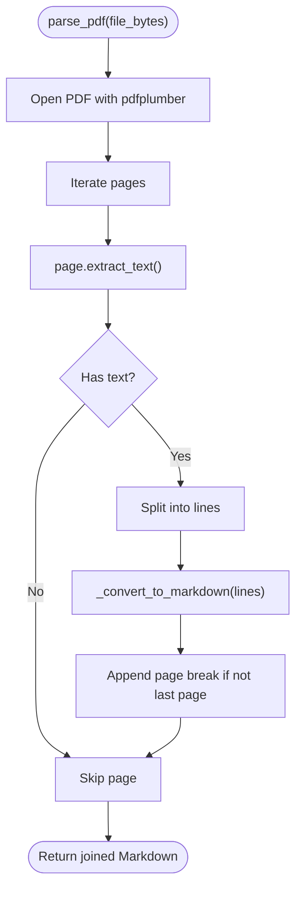
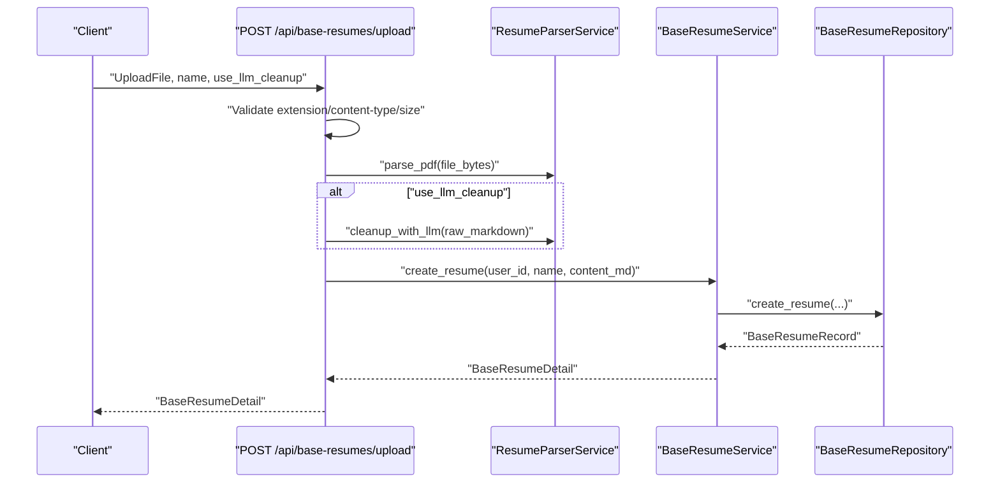
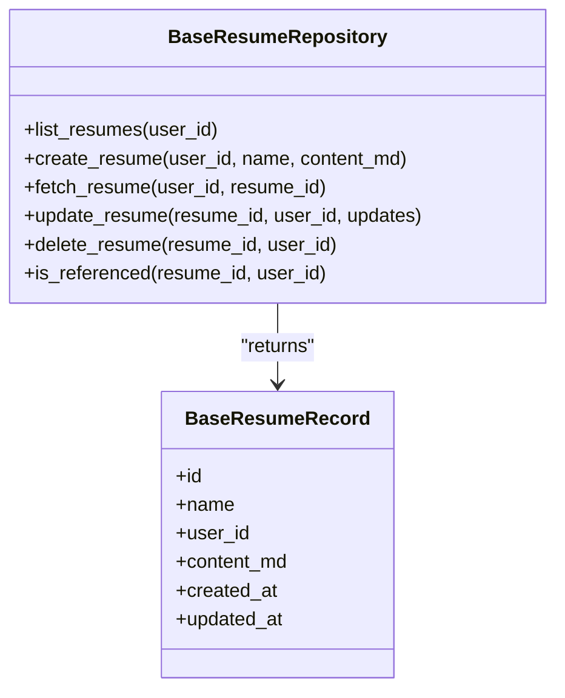
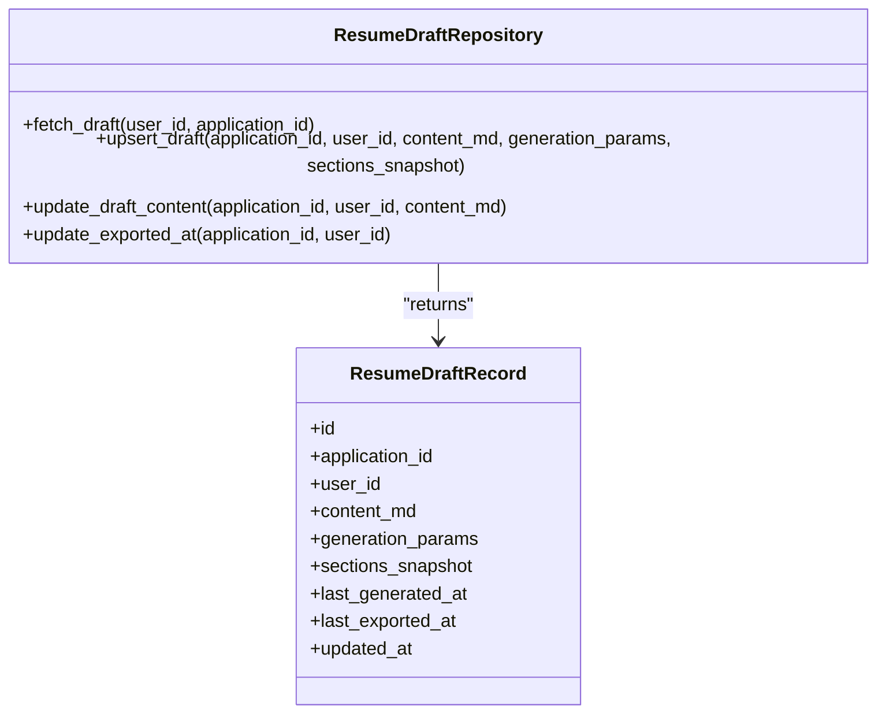
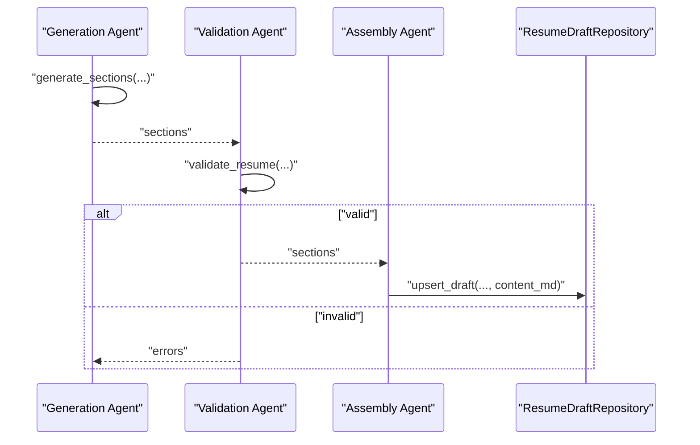
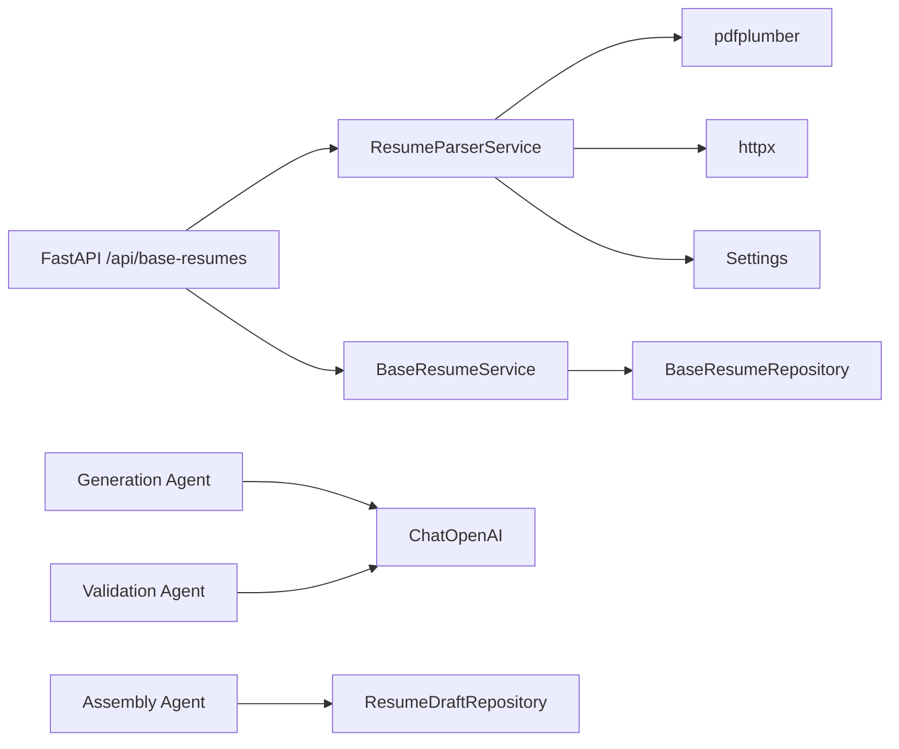

# Resume Parser Service

<cite>
**Referenced Files in This Document**
- [resume_parser.py](file://backend/app/services/resume_parser.py)
- [base_resumes.py](file://backend/app/api/base_resumes.py)
- [config.py](file://backend/app/core/config.py)
- [base_resumes.py](file://backend/app/db/base_resumes.py)
- [resume_drafts.py](file://backend/app/db/resume_drafts.py)
- [assembly.py](file://agents/assembly.py)
- [generation.py](file://agents/generation.py)
- [validation.py](file://agents/validation.py)
- [worker.py](file://agents/worker.py)
- [database_schema.md](file://docs/database_schema.md)
</cite>

## Table of Contents
1. [Introduction](#introduction)
2. [Project Structure](#project-structure)
3. [Core Components](#core-components)
4. [Architecture Overview](#architecture-overview)
5. [Detailed Component Analysis](#detailed-component-analysis)
6. [Dependency Analysis](#dependency-analysis)
7. [Performance Considerations](#performance-considerations)
8. [Troubleshooting Guide](#troubleshooting-guide)
9. [Conclusion](#conclusion)
10. [Appendices](#appendices)

## Introduction
This document describes the Resume Parser Service responsible for extracting and normalizing resume content from PDFs into structured Markdown. It covers parsing algorithms, content extraction techniques, data normalization, integration with PDF processing and text extraction, structured data parsing, content validation, formatting standardization, metadata extraction workflows, supported file formats, error handling for malformed content, and integration with base resume management and draft assembly.

## Project Structure
The Resume Parser Service is implemented as a backend service integrated with FastAPI endpoints and interacts with PostgreSQL-backed repositories for base resumes and resume drafts. It also integrates with agent-based generation, validation, and assembly services for end-to-end resume creation and editing.

**Diagram sources**
- [base_resumes.py:111-168](file://backend/app/api/base_resumes.py#L111-L168)
- [resume_parser.py:24-53](file://backend/app/services/resume_parser.py#L24-L53)
- [config.py:71-74](file://backend/app/core/config.py#L71-L74)
- [base_resumes.py:31-183](file://backend/app/db/base_resumes.py#L31-L183)
- [resume_drafts.py:41-173](file://backend/app/db/resume_drafts.py#L41-L173)
- [generation.py:159-224](file://agents/generation.py#L159-L224)
- [validation.py:231-291](file://agents/validation.py#L231-L291)
- [assembly.py:12-62](file://agents/assembly.py#L12-L62)

**Section sources**
- [base_resumes.py:111-168](file://backend/app/api/base_resumes.py#L111-L168)
- [resume_parser.py:24-53](file://backend/app/services/resume_parser.py#L24-L53)
- [config.py:71-74](file://backend/app/core/config.py#L71-L74)
- [base_resumes.py:31-183](file://backend/app/db/base_resumes.py#L31-L183)
- [resume_drafts.py:41-173](file://backend/app/db/resume_drafts.py#L41-L173)
- [assembly.py:12-62](file://agents/assembly.py#L12-L62)
- [generation.py:159-224](file://agents/generation.py#L159-L224)
- [validation.py:231-291](file://agents/validation.py#L231-L291)

## Core Components
- ResumeParserService: Extracts text from PDFs and converts it to Markdown, with optional LLM cleanup.
- FastAPI endpoint: Validates uploads, parses PDFs, optionally cleans with LLM, and persists as a base resume.
- BaseResumeRepository: Persists and retrieves base resume Markdown content.
- ResumeDraftRepository: Manages current draft content per application.
- Assembly, Generation, Validation agents: Compose final resume, generate sections, and validate content.

**Section sources**
- [resume_parser.py:13-228](file://backend/app/services/resume_parser.py#L13-L228)
- [base_resumes.py:111-168](file://backend/app/api/base_resumes.py#L111-L168)
- [base_resumes.py:31-183](file://backend/app/db/base_resumes.py#L31-L183)
- [resume_drafts.py:41-173](file://backend/app/db/resume_drafts.py#L41-L173)
- [assembly.py:12-62](file://agents/assembly.py#L12-L62)
- [generation.py:159-224](file://agents/generation.py#L159-L224)
- [validation.py:231-291](file://agents/validation.py#L231-L291)

## Architecture Overview
The parser integrates with FastAPI endpoints to accept PDF uploads, parse them into Markdown, optionally enhance with LLM, and store as a base resume. The system also supports draft management and end-to-end generation and assembly.

**Diagram sources**
- [base_resumes.py:111-168](file://backend/app/api/base_resumes.py#L111-L168)
- [resume_parser.py:24-53](file://backend/app/services/resume_parser.py#L24-L53)
- [resume_parser.py:168-227](file://backend/app/services/resume_parser.py#L168-L227)
- [base_resumes.py:59-90](file://backend/app/db/base_resumes.py#L59-L90)

## Detailed Component Analysis

### ResumeParserService
- Responsibilities:
  - Parse PDFs and convert to Markdown.
  - Detect section headings, bullet points, and paragraphs.
  - Optionally clean up Markdown with an LLM via OpenRouter.
- Key methods:
  - parse_pdf(file_bytes): Uses pdfplumber to iterate pages, extract text, and convert to Markdown.
  - _convert_to_markdown(lines): Detects headings, bullets, and paragraphs; normalizes spacing.
  - _is_section_heading(line): Recognizes common resume section headings and short uppercase lines.
  - _is_bullet_point(line) and _extract_bullet_content(line): Normalize bullet styles.
  - cleanup_with_llm(raw_markdown): Calls OpenRouter chat completions with timeouts and error handling.

**Diagram sources**
- [resume_parser.py:24-53](file://backend/app/services/resume_parser.py#L24-L53)
- [resume_parser.py:55-95](file://backend/app/services/resume_parser.py#L55-L95)

**Section sources**
- [resume_parser.py:13-228](file://backend/app/services/resume_parser.py#L13-L228)

### FastAPI Endpoint Integration
- Endpoint: POST /api/base-resumes/upload
- Features:
  - Validates file extension (.pdf), content type, and size.
  - Parses PDF to Markdown.
  - Optional LLM cleanup controlled by form parameter.
  - Creates a base resume record with persisted Markdown.

**Diagram sources**
- [base_resumes.py:111-168](file://backend/app/api/base_resumes.py#L111-L168)
- [resume_parser.py:168-227](file://backend/app/services/resume_parser.py#L168-L227)
- [base_resumes.py:59-90](file://backend/app/db/base_resumes.py#L59-L90)

**Section sources**
- [base_resumes.py:111-168](file://backend/app/api/base_resumes.py#L111-L168)

### Content Normalization and Formatting Standardization
- Section headings: Converted to Markdown h2 headings and title-cased.
- Bullets: Normalized to Markdown bullet lists.
- Paragraphs: Joined with blank lines to separate sections.
- Page breaks: Inserted between pages to preserve pagination context.

**Section sources**
- [resume_parser.py:55-95](file://backend/app/services/resume_parser.py#L55-L95)
- [resume_parser.py:97-141](file://backend/app/services/resume_parser.py#L97-L141)
- [resume_parser.py:143-166](file://backend/app/services/resume_parser.py#L143-L166)

### Metadata Extraction Workflows
- PDF text extraction uses pdfplumber.page.extract_text().
- Page iteration preserves multi-page structure for Markdown output.
- No OCR or metadata extraction is performed; content is derived from text blocks.

**Section sources**
- [resume_parser.py:38-53](file://backend/app/services/resume_parser.py#L38-L53)

### Integration with Base Resume Management
- After parsing, the service creates a base resume with:
  - user_id
  - name
  - content_md (Markdown)
- Retrieval and updates are supported via BaseResumeRepository.

**Diagram sources**
- [base_resumes.py:31-183](file://backend/app/db/base_resumes.py#L31-L183)

**Section sources**
- [base_resumes.py:31-183](file://backend/app/db/base_resumes.py#L31-L183)

### Relationship with Resume Drafts and Content Assembly
- ResumeDraftRepository manages a single current draft per application with:
  - content_md (Markdown)
  - generation_params
  - sections_snapshot
  - timestamps for last generation and export
- Assembly agent composes final Markdown from personal info header and ordered generated sections.

**Diagram sources**
- [resume_drafts.py:41-173](file://backend/app/db/resume_drafts.py#L41-L173)

**Section sources**
- [resume_drafts.py:41-173](file://backend/app/db/resume_drafts.py#L41-L173)
- [assembly.py:12-62](file://agents/assembly.py#L12-L62)

### End-to-End Generation and Validation Pipeline
- Generation agent builds prompts per section and calls LLM with fallback models.
- Validation agent checks hallucinations, required sections, ordering, and ATS safety.
- Assembly agent composes final Markdown from personal info and ordered sections.

**Diagram sources**
- [generation.py:159-224](file://agents/generation.py#L159-L224)
- [validation.py:231-291](file://agents/validation.py#L231-L291)
- [assembly.py:12-62](file://agents/assembly.py#L12-L62)
- [resume_drafts.py:62-118](file://backend/app/db/resume_drafts.py#L62-L118)

**Section sources**
- [generation.py:159-224](file://agents/generation.py#L159-L224)
- [validation.py:231-291](file://agents/validation.py#L231-L291)
- [assembly.py:12-62](file://agents/assembly.py#L12-L62)
- [resume_drafts.py:62-118](file://backend/app/db/resume_drafts.py#L62-L118)

## Dependency Analysis
- ResumeParserService depends on:
  - pdfplumber for text extraction.
  - httpx for asynchronous OpenRouter API calls.
  - Settings for OpenRouter API key and model.
- FastAPI endpoint depends on:
  - ResumeParserService factory that reads settings.
  - BaseResumeService for persistence.
- Repositories depend on:
  - PostgreSQL via psycopg with row_factory for dict-like rows.
- Agents depend on:
  - LangChain ChatOpenAI for structured LLM calls.
  - Regex and string manipulation for section parsing and replacement.

**Diagram sources**
- [resume_parser.py:34-227](file://backend/app/services/resume_parser.py#L34-L227)
- [base_resumes.py:17-24](file://backend/app/api/base_resumes.py#L17-L24)
- [base_resumes.py:31-183](file://backend/app/db/base_resumes.py#L31-L183)
- [generation.py:13-14](file://agents/generation.py#L13-L14)
- [validation.py:13-14](file://agents/validation.py#L13-L14)
- [assembly.py:12-62](file://agents/assembly.py#L12-L62)
- [resume_drafts.py:41-173](file://backend/app/db/resume_drafts.py#L41-L173)

**Section sources**
- [resume_parser.py:34-227](file://backend/app/services/resume_parser.py#L34-L227)
- [base_resumes.py:17-24](file://backend/app/api/base_resumes.py#L17-L24)
- [base_resumes.py:31-183](file://backend/app/db/base_resumes.py#L31-L183)
- [generation.py:13-14](file://agents/generation.py#L13-L14)
- [validation.py:13-14](file://agents/validation.py#L13-L14)
- [assembly.py:12-62](file://agents/assembly.py#L12-L62)
- [resume_drafts.py:41-173](file://backend/app/db/resume_drafts.py#L41-L173)

## Performance Considerations
- PDF parsing performance scales with page count and text density; consider:
  - Limiting maximum file size and enforcing a reasonable page limit.
  - Using efficient text extraction and minimal regex overhead.
- LLM cleanup adds latency and cost; enable only when needed.
- Database writes are batched per operation; ensure indexing on user_id for fast lookups.

[No sources needed since this section provides general guidance]

## Troubleshooting Guide
- PDF parsing failures:
  - Verify file extension and content type.
  - Check file size limits.
  - Inspect exceptions raised during parse_pdf and handle gracefully.
- LLM cleanup failures:
  - Missing API key disables cleanup and returns raw Markdown.
  - Timeouts and HTTP errors are caught and logged; raw Markdown is returned.
- Persistence errors:
  - Lookup errors and permission errors are mapped to HTTP exceptions.
  - Database constraints ensure non-empty content and proper ownership.

**Section sources**
- [base_resumes.py:111-168](file://backend/app/api/base_resumes.py#L111-L168)
- [resume_parser.py:168-227](file://backend/app/services/resume_parser.py#L168-L227)
- [base_resumes.py:72-82](file://backend/app/db/base_resumes.py#L72-L82)

## Conclusion
The Resume Parser Service provides robust PDF text extraction and Markdown normalization, with optional LLM cleanup for improved formatting. It integrates cleanly with base resume persistence and draft management, and participates in a broader generation, validation, and assembly pipeline. The design emphasizes reliability, error handling, and clear separation of concerns across parsing, persistence, and content composition.

[No sources needed since this section summarizes without analyzing specific files]

## Appendices

### Supported File Formats
- PDF: Only PDF files are accepted for parsing.

**Section sources**
- [base_resumes.py:120-134](file://backend/app/api/base_resumes.py#L120-L134)

### Parsing Accuracy Metrics
- No built-in accuracy metrics are implemented in the parser. Validation and generation agents provide downstream checks for hallucinations, completeness, ordering, and ATS safety.

**Section sources**
- [validation.py:231-291](file://agents/validation.py#L231-L291)

### Parser Configuration
- Environment variables:
  - OPENROUTER_API_KEY: Enables LLM cleanup.
  - OPENROUTER_CLEANUP_MODEL: Model used for cleanup.
- Endpoint form parameter:
  - use_llm_cleanup: Controls whether to apply LLM cleanup.

**Section sources**
- [config.py:71-74](file://backend/app/core/config.py#L71-L74)
- [base_resumes.py:117-118](file://backend/app/api/base_resumes.py#L117-L118)
- [resume_parser.py:16-22](file://backend/app/services/resume_parser.py#L16-L22)

### Content Processing Pipelines
- PDF upload pipeline:
  - Validate file -> Parse PDF -> Optional LLM cleanup -> Persist as base resume.
- Generation and assembly pipeline:
  - Generate sections -> Validate -> Assemble -> Store draft.

**Section sources**
- [base_resumes.py:111-168](file://backend/app/api/base_resumes.py#L111-L168)
- [generation.py:159-224](file://agents/generation.py#L159-L224)
- [validation.py:231-291](file://agents/validation.py#L231-L291)
- [assembly.py:12-62](file://agents/assembly.py#L12-L62)

### Database Schema Notes
- Base resumes and resume drafts are stored as Markdown text with strict non-empty constraints and RLS policies.
- Indexes optimize user-scoped queries and dashboard sorting.

**Section sources**
- [database_schema.md:99-101](file://docs/database_schema.md#L99-L101)
- [database_schema.md:169-188](file://docs/database_schema.md#L169-L188)
- [database_schema.md:248-264](file://docs/database_schema.md#L248-L264)