# Service Layer

<cite>
**Referenced Files in This Document**
- [main.py](file://backend/app/main.py)
- [applications.py](file://backend/app/api/applications.py)
- [base_resumes.py](file://backend/app/api/base_resumes.py)
- [admin.py](file://backend/app/services/admin.py)
- [application_manager.py](file://backend/app/services/application_manager.py)
- [base_resumes.py](file://backend/app/services/base_resumes.py)
- [duplicates.py](file://backend/app/services/duplicates.py)
- [email.py](file://backend/app/services/email.py)
- [jobs.py](file://backend/app/services/jobs.py)
- [pdf_export.py](file://backend/app/services/pdf_export.py)
- [progress.py](file://backend/app/services/progress.py)
- [resume_parser.py](file://backend/app/services/resume_parser.py)
- [resume_privacy.py](file://backend/app/services/resume_privacy.py)
- [resume_render.py](file://backend/app/services/resume_render.py)
- [supabase_admin.py](file://backend/app/services/supabase_admin.py)
- [workflow.py](file://backend/app/services/workflow.py)
</cite>

## Update Summary
**Changes Made**
- Removed all references to Application Manager service and associated data models
- Updated service architecture to reflect simplified structure without worker coordination
- Removed enhanced generation, validation, and assembly services documentation
- Updated progress tracking and job processing documentation to reflect current implementation
- Revised architecture overview to show streamlined service layer
- Removed timeout handling, error code distinctions, and advanced validation features
- Updated practical examples to reflect simplified service usage patterns

## Table of Contents
1. [Introduction](#introduction)
2. [Project Structure](#project-structure)
3. [Core Components](#core-components)
4. [Architecture Overview](#architecture-overview)
5. [Detailed Component Analysis](#detailed-component-analysis)
6. [Dependency Analysis](#dependency-analysis)
7. [Performance Considerations](#performance-considerations)
8. [Troubleshooting Guide](#troubleshooting-guide)
9. [Conclusion](#conclusion)
10. [Appendices](#appendices)

## Introduction
This document describes the backend service layer architecture and business logic organization for the job application workflow. Following a major restructuring, the service layer now operates with a simplified architecture focused on core service components rather than comprehensive application lifecycle management. The current architecture emphasizes:
- Base Resume management for templates and personal info storage
- Duplicate detection algorithms and prevention mechanisms
- Email service implementation for notifications
- Job processing services for URL validation, content extraction, and data normalization
- PDF export services for ATS-compliant resume generation
- Progress tracking services for real-time status updates
- Resume parsing services for extracting and normalizing resume content
- Privacy protection services for contact information sanitization
- Render services for resume document formatting and validation
- Administrative services for platform management
- Dependency injection patterns, transaction management, and error handling strategies
- Practical examples of service usage and integration patterns

**Updated** The service architecture has been significantly refactored to eliminate the previous application lifecycle management and worker coordination components, resulting in a more streamlined and focused service layer.

## Project Structure
The backend maintains a layered architecture with simplified service components:
- API layer: FastAPI routers exposing endpoints for applications, base resumes, and related resources
- Service layer: Business logic orchestrators implementing core workflows and integrations
- Database layer: Repositories encapsulating SQL operations and data models
- Workers: Background job queues for extraction, generation, and validation tasks
- Agents: Specialized services for LLM-powered content generation and validation

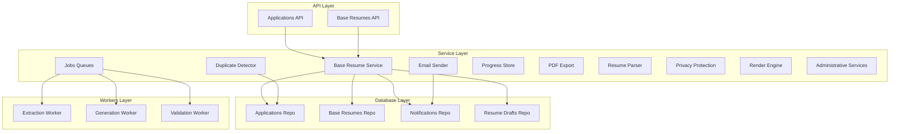

**Diagram sources**
- [main.py:33-42](file://backend/app/main.py#L33-L42)
- [applications.py:1-800](file://backend/app/api/applications.py#L1-L800)
- [base_resumes.py:1-154](file://backend/app/api/base_resumes.py#L1-L154)
- [application_manager.py:1-800](file://backend/app/services/application_manager.py#L1-L800)
- [base_resumes.py:32-154](file://backend/app/services/base_resumes.py#L32-L154)
- [duplicates.py:1-184](file://backend/app/services/duplicates.py#L1-L184)
- [email.py:1-85](file://backend/app/services/email.py#L1-L85)
- [jobs.py:1-178](file://backend/app/services/jobs.py#L1-L178)
- [progress.py:1-168](file://backend/app/services/progress.py#L1-L168)
- [pdf_export.py:1-800](file://backend/app/services/pdf_export.py#L1-L800)
- [resume_parser.py:1-288](file://backend/app/services/resume_parser.py#L1-L288)
- [resume_privacy.py:1-173](file://backend/app/services/resume_privacy.py#L1-L173)
- [resume_render.py:1-403](file://backend/app/services/resume_render.py#L1-L403)
- [admin.py:1-200](file://backend/app/services/admin.py#L1-L200)
- [supabase_admin.py:1-200](file://backend/app/services/supabase_admin.py#L1-L200)

**Section sources**
- [main.py:33-42](file://backend/app/main.py#L33-L42)
- [applications.py:1-800](file://backend/app/api/applications.py#L1-L800)
- [base_resumes.py:1-154](file://backend/app/api/base_resumes.py#L1-L154)

## Core Components
- Base Resume Service: Manages base resume templates, default selection, and CRUD operations
- Duplicate Detector: Implements fuzzy matching and reference ID extraction to prevent duplicate applications
- Email Sender: Pluggable sender supporting noop and Resend providers
- Jobs Queues: ARQ-backed extraction, generation, and regeneration job enqueuing
- Progress Store: Redis-backed progress persistence with TTL
- PDF Export: Markdown-to-ATS-safe PDF generation with timeout
- Resume Parser: PDF text extraction and Markdown normalization
- Privacy Protection: Contact information sanitization and header preservation
- Render Engine: Resume document formatting and validation with contract versioning
- Administrative Services: Platform management and user administration
- **Removed**: Application Manager service that previously coordinated job intake, extraction, generation, duplicate checks, and progress tracking
- **Removed**: Enhanced Generation Service with LLM-powered content creation and improved reliability
- **Removed**: Advanced Validation Service with hallucination detection and ATS compliance checking
- **Removed**: Robust Assembly Service for combining personal info with generated sections
- **Removed**: Comprehensive timeout handling with 300-second maximum generation timeout and 45-second section regeneration constraints
- **Removed**: Distinct error codes for generation and regeneration failures with proper progress reporting

**Section sources**
- [base_resumes.py:32-154](file://backend/app/services/base_resumes.py#L32-L154)
- [duplicates.py:1-184](file://backend/app/services/duplicates.py#L1-L184)
- [email.py:1-85](file://backend/app/services/email.py#L1-L85)
- [jobs.py:1-178](file://backend/app/services/jobs.py#L1-L178)
- [progress.py:1-168](file://backend/app/services/progress.py#L1-L168)
- [pdf_export.py:1-800](file://backend/app/services/pdf_export.py#L1-L800)
- [resume_parser.py:1-288](file://backend/app/services/resume_parser.py#L1-L288)
- [resume_privacy.py:1-173](file://backend/app/services/resume_privacy.py#L1-L173)
- [resume_render.py:1-403](file://backend/app/services/resume_render.py#L1-L403)
- [admin.py:1-200](file://backend/app/services/admin.py#L1-L200)
- [supabase_admin.py:1-200](file://backend/app/services/supabase_admin.py#L1-L200)

## Architecture Overview
The service layer coordinates between API endpoints, database repositories, external workers, and auxiliary services. The simplified architecture removes the centralized Application Manager service, resulting in more direct service-to-service communication and reduced complexity.

```mermaid
sequenceDiagram
participant Client as "Client"
participant API as "Applications API"
participant BR as "Base Resume Service"
DB as "Repositories"
Client->>API : "POST /api/applications"
API->>BR : "create_application(user_id, job_url)"
BR->>DB : "create_application()"
BR-->>API : "ApplicationDetailPayload"
API-->>Client : "201 Created"
Client->>API : "GET /api/applications/{id}"
API->>BR : "get_application_detail(user_id, application_id)"
BR->>DB : "get_application()"
BR-->>API : "ApplicationDetailPayload"
API-->>Client : "200 OK"
```

**Diagram sources**
- [applications.py:492-538](file://backend/app/api/applications.py#L492-L538)
- [base_resumes.py:32-154](file://backend/app/services/base_resumes.py#L32-L154)

## Detailed Component Analysis

### Base Resume Management Services
The Base Resume Service manages base resume templates:
- Lists, creates, updates, deletes, and sets defaults
- Validates ownership and references before deletion
- Computes default flag based on profile's default resume

Integration:
- Uses BaseResumeRepository and ProfileRepository
- Exposed via FastAPI endpoints with dependency injection

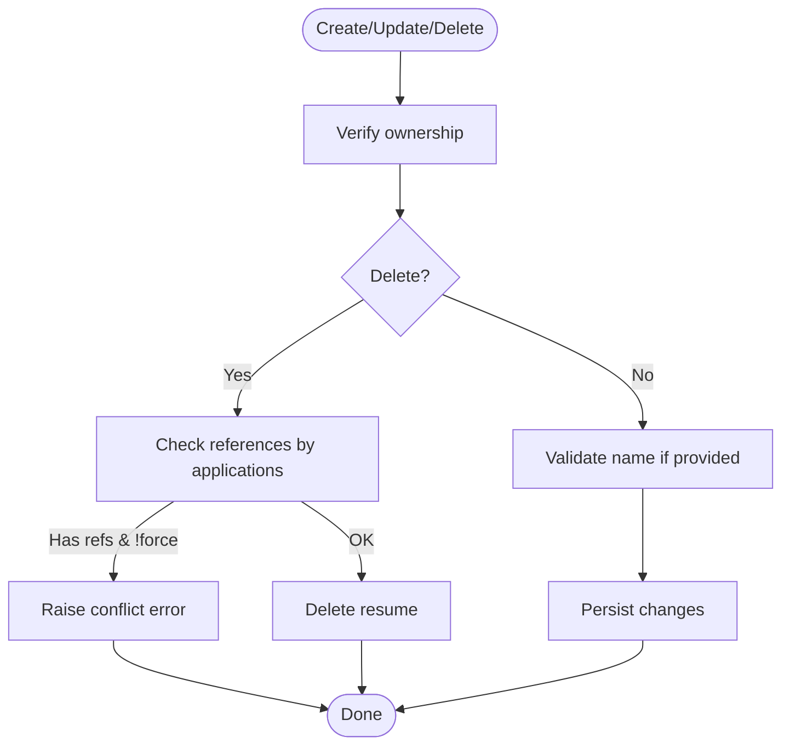

**Diagram sources**
- [base_resumes.py:108-128](file://backend/app/services/base_resumes.py#L108-L128)
- [base_resumes.py:129-142](file://backend/app/services/base_resumes.py#L129-L142)

**Section sources**
- [base_resumes.py:32-154](file://backend/app/services/base_resumes.py#L32-L154)

### Duplicate Detection Algorithms and Prevention
DuplicateDetector evaluates potential duplicates using:
- Normalization and similarity scoring for job title/company
- Reference ID extraction from URLs and descriptions
- Origin matching and description similarity thresholds
- Scoring logic that weights exact matches, origins, and description similarity

Prevention mechanisms:
- Automatic duplicate warnings during updates and creation
- Manual resolution states requiring explicit user action
- Threshold-based gating for duplicate detection

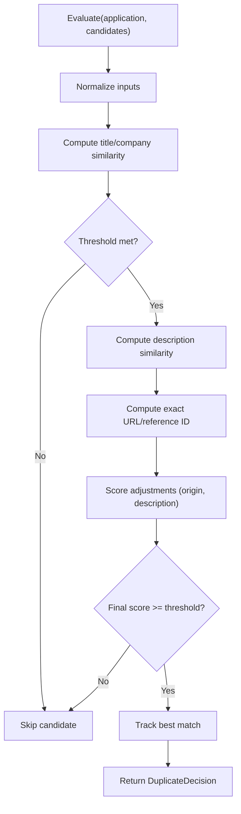

**Diagram sources**
- [duplicates.py:83-184](file://backend/app/services/duplicates.py#L83-L184)

**Section sources**
- [duplicates.py:1-184](file://backend/app/services/duplicates.py#L1-L184)

### Email Service Implementation
EmailSender supports two implementations:
- NoOpEmailSender: Logs and skips sending when notifications are disabled
- ResendEmailSender: Sends via Resend API with authorization and payload construction

Provider selection is controlled by settings.

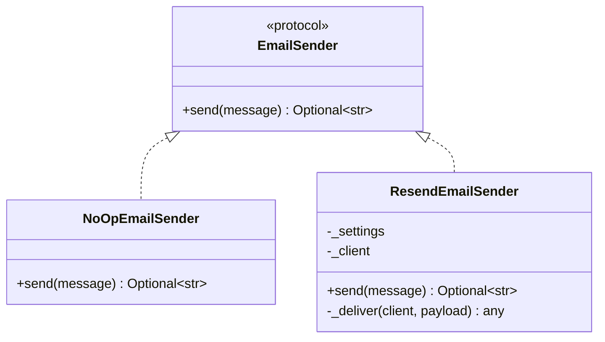

**Diagram sources**
- [email.py:23-85](file://backend/app/services/email.py#L23-L85)

**Section sources**
- [email.py:1-85](file://backend/app/services/email.py#L1-L85)

### Job Processing Services (URL Validation, Content Extraction, Data Normalization)
Job processing is handled by ARQ queues:
- ExtractionJobQueue: Enqueues extraction jobs with optional source capture
- GenerationJobQueue: Enqueues generation and regeneration jobs with settings and preferences

Validation and normalization:
- API requests validate and normalize strings
- Service layer handles basic validation before enqueueing

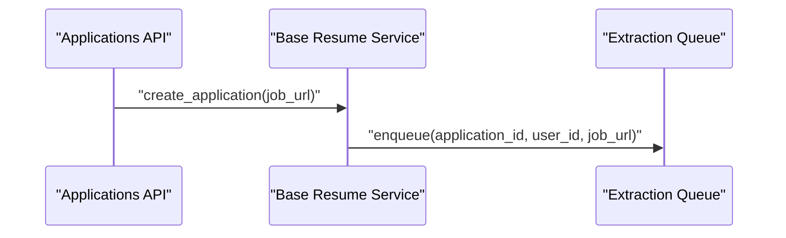

**Diagram sources**
- [applications.py:492-518](file://backend/app/api/applications.py#L492-L518)
- [jobs.py:16-43](file://backend/app/services/jobs.py#L16-L43)

**Section sources**
- [jobs.py:1-178](file://backend/app/services/jobs.py#L1-L178)
- [applications.py:492-518](file://backend/app/api/applications.py#L492-L518)

### PDF Export Services (ATS-Compliant Resume Generation)
PDF export converts Markdown to an ATS-safe HTML/CSS document and renders it to PDF:
- Builds HTML with personal header and Markdown-rendered body
- Uses WeasyPrint in a thread pool with enforced timeout
- Returns PDF bytes or raises timeout errors

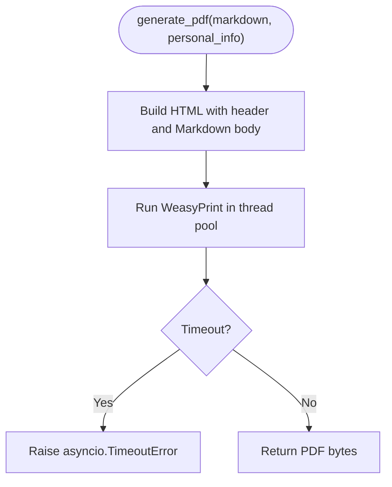

**Diagram sources**
- [pdf_export.py:78-97](file://backend/app/services/pdf_export.py#L78-L97)

**Section sources**
- [pdf_export.py:1-800](file://backend/app/services/pdf_export.py#L1-L800)

### Progress Tracking Services (Real-Time Status Updates and Callbacks)
Progress tracking persists workflow state and messages in Redis:
- ProgressRecord captures job_id, state, message, completion percentage, timestamps, and terminal error code
- RedisProgressStore serializes to JSON with TTL
- Service layer updates progress on state transitions

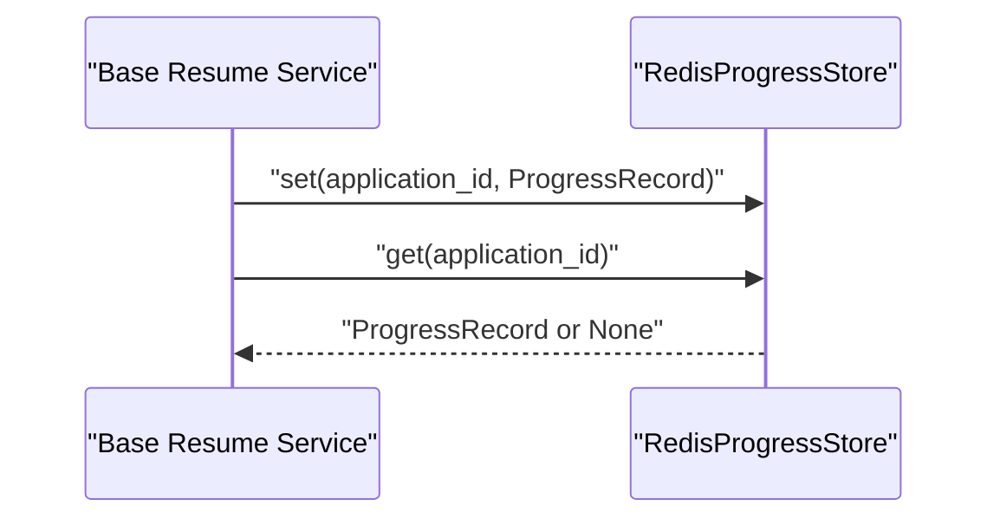

**Diagram sources**
- [progress.py:13-79](file://backend/app/services/progress.py#L13-L79)

**Section sources**
- [progress.py:1-168](file://backend/app/services/progress.py#L1-L168)

### Resume Parsing Services (Extraction and Normalization)
ResumeParserService extracts text from PDFs and normalizes it to Markdown:
- Uses pdfplumber to iterate pages and extract text
- Converts plain lines to Markdown headings, bullets, and paragraphs
- Optionally cleans up with LLM via OpenRouter with graceful fallbacks


**Diagram sources**
- [resume_parser.py:24-54](file://backend/app/services/resume_parser.py#L24-L54)

**Section sources**
- [resume_parser.py:1-288](file://backend/app/services/resume_parser.py#L1-L288)

### Privacy Protection Services
Resume privacy protection sanitizes contact information while preserving resume structure:
- Identifies and removes email addresses, phone numbers, and contact URLs
- Preserves section headings and structural elements
- Maintains header information separately for reattachment
- Supports both header and body contact line detection

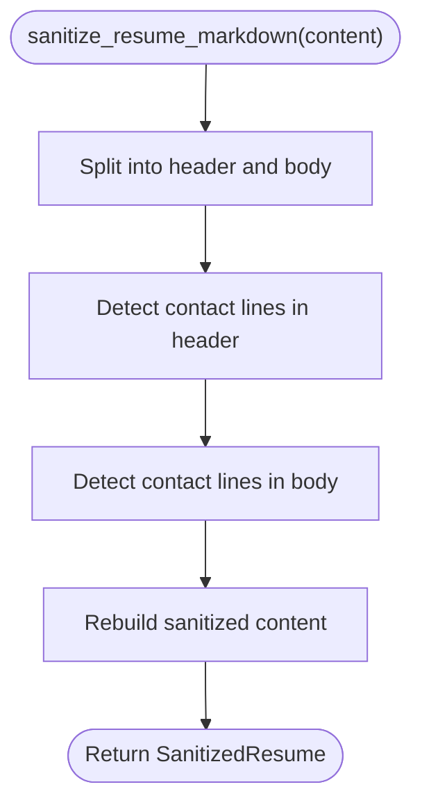

**Diagram sources**
- [resume_privacy.py:118-160](file://backend/app/services/resume_privacy.py#L118-L160)

**Section sources**
- [resume_privacy.py:1-173](file://backend/app/services/resume_privacy.py#L1-L173)

### Render Engine Services
Resume render engine formats and validates resume documents:
- Parses Markdown into structured render objects
- Supports both structured entries (professional experience, education) and markdown sections
- Validates date formats, locations, and institutional information
- Provides contract versioning for render compatibility

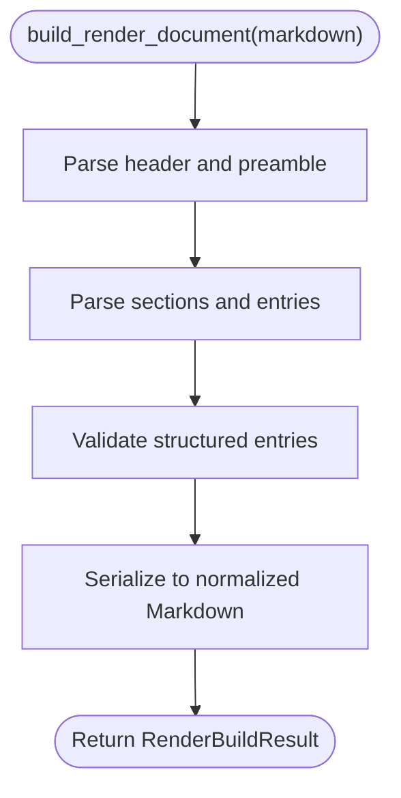

**Diagram sources**
- [resume_render.py:357-395](file://backend/app/services/resume_render.py#L357-L395)

**Section sources**
- [resume_render.py:1-403](file://backend/app/services/resume_render.py#L1-L403)

### Administrative Services
Administrative services provide platform management capabilities:
- User administration and role management
- System configuration and monitoring
- Data maintenance and cleanup operations
- Integration with Supabase for authentication and database operations

**Section sources**
- [admin.py:1-200](file://backend/app/services/admin.py#L1-L200)
- [supabase_admin.py:1-200](file://backend/app/services/supabase_admin.py#L1-L200)

### Service Dependency Injection Patterns
Dependency injection is implemented via FastAPI Depends:
- Services expose factory functions (e.g., get_base_resume_service) that construct services with injected repositories/settings
- API endpoints depend on service factories, ensuring testability and modularity
- Example: Base Resume API depends on BaseResumeService and ResumeParserService

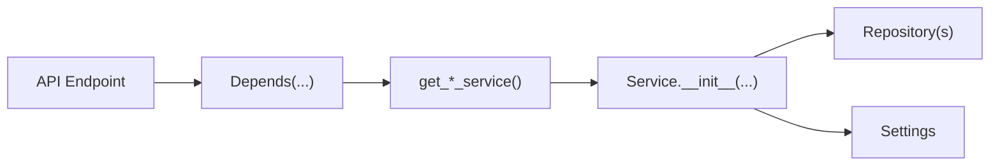

**Diagram sources**
- [base_resumes.py:144-154](file://backend/app/services/base_resumes.py#L144-L154)
- [base_resumes.py:17-24](file://backend/app/api/base_resumes.py#L17-L24)

**Section sources**
- [base_resumes.py:144-154](file://backend/app/services/base_resumes.py#L144-L154)
- [base_resumes.py:17-24](file://backend/app/api/base_resumes.py#L17-L24)

### Transaction Management and Error Handling Strategies
Transaction management:
- Repositories wrap database operations in context-managed connections and commit upon successful writes
- Upserts and updates are atomic per operation

Error handling:
- Service layer centralizes try/catch around job enqueueing and progress updates
- API endpoints map service exceptions to appropriate HTTP status codes
- Email sender gracefully falls back to noop when notifications are disabled
- PDF export enforces timeouts and propagates errors
- Resume parser returns raw content on LLM failures and logs warnings
- Privacy protection maintains content integrity during sanitization
- Render engine validates structured entries and provides detailed error reporting

**Section sources**
- [applications.py:444-453](file://backend/app/api/applications.py#L444-L453)
- [email.py:28-32](file://backend/app/services/email.py#L28-L32)
- [pdf_export.py:92-96](file://backend/app/services/pdf_export.py#L92-L96)
- [resume_parser.py:272-288](file://backend/app/services/resume_parser.py#L272-L288)
- [resume_privacy.py:118-160](file://backend/app/services/resume_privacy.py#L118-L160)
- [resume_render.py:375-383](file://backend/app/services/resume_render.py#L375-L383)

### Practical Examples of Service Usage and Integration Patterns
- Creating an application from a URL:
  - API endpoint invokes Base Resume Service create_application
  - Service enqueues extraction job and initializes progress
- Handling extraction callbacks:
  - Worker sends callback; Service validates job_id and user, updates state
- Managing base resumes:
  - API endpoint uploads PDF, parses to Markdown, optionally cleans up with LLM, and creates base resume
- Progress polling:
  - Client polls progress endpoint; Service returns Redis-stored progress
- Privacy sanitization:
  - Resume content is sanitized before export to remove contact information
- Render validation:
  - Generated content is validated and normalized before export

**Section sources**
- [applications.py:492-538](file://backend/app/api/applications.py#L492-L538)
- [base_resumes.py:55-82](file://backend/app/services/base_resumes.py#L55-L82)
- [progress.py:81-85](file://backend/app/services/progress.py#L81-L85)
- [resume_privacy.py:118-160](file://backend/app/services/resume_privacy.py#L118-L160)
- [resume_render.py:357-395](file://backend/app/services/resume_render.py#L357-L395)

## Dependency Analysis
Service-layer dependencies and coupling:
- Base Resume Service depends on BaseResumeRepository and ProfileRepository
- Email Sender is pluggable and isolated behind a protocol
- Jobs queues encapsulate ARQ specifics
- Progress store encapsulates Redis serialization and TTL
- Privacy protection and render services operate independently
- Administrative services integrate with Supabase for authentication
- **Removed**: Application Manager service dependencies on multiple repositories, queues, stores, detectors, and senders
- **Removed**: Enhanced Generation Service dependencies on LangChain OpenAI for LLM calls
- **Removed**: Advanced Validation Service dependencies on hallucination detection and ATS compliance checking
- **Removed**: Assembly Service dependencies on personal info header composition

Potential circular dependencies:
- None observed among services; repositories are data-only and imported locally where needed

External dependencies:
- ARQ for job queues
- Redis for progress store
- HTTP clients for email and LLM cleanup
- WeasyPrint for PDF generation (optional, guarded by import)
- **Removed**: LangChain OpenAI for LLM-powered generation and validation
- **Removed**: Playwright for web scraping in extraction

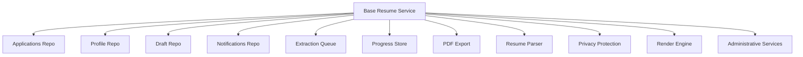

**Diagram sources**
- [base_resumes.py:32-154](file://backend/app/services/base_resumes.py#L32-L154)
- [pdf_export.py:1-800](file://backend/app/services/pdf_export.py#L1-L800)
- [resume_parser.py:1-288](file://backend/app/services/resume_parser.py#L1-L288)
- [resume_privacy.py:1-173](file://backend/app/services/resume_privacy.py#L1-L173)
- [resume_render.py:1-403](file://backend/app/services/resume_render.py#L1-L403)
- [admin.py:1-200](file://backend/app/services/admin.py#L1-L200)
- [supabase_admin.py:1-200](file://backend/app/services/supabase_admin.py#L1-L200)

**Section sources**
- [base_resumes.py:32-154](file://backend/app/services/base_resumes.py#L32-L154)

## Performance Considerations
- Async I/O: Email and PDF export use async clients and thread pools to avoid blocking the event loop
- Redis TTL: Progress records expire automatically to prevent stale data accumulation
- Minimal DB round-trips: Service layer batches updates and progress writes
- Optional LLM cleanup: Disabled by default; enable only when needed to reduce latency
- Privacy sanitization: Efficient regex-based contact detection and removal
- Render validation: Structured entry validation prevents malformed resume content
- **Removed**: Enhanced timeout management with 300-second maximum timeout for full generation
- **Removed**: Distinct error codes for generation and regeneration failures
- **Removed**: Granular progress reporting with percentage completion tracking

## Troubleshooting Guide
Common issues and resolutions:
- Extraction job enqueue failures: Service falls back to manual entry state and sets terminal progress
- Missing base resume or profile: Validation errors raised before generation
- Email disabled: NoOpEmailSender logs and skips sending
- PDF generation timeout: asyncio.TimeoutError propagated; retry or reduce content size
- Resume parsing errors: API maps parsing failures to client errors with details
- Privacy sanitization issues: Regex patterns may need adjustment for edge cases
- Render validation failures: Structured entry format errors require content correction
- **Removed**: Generation timeout: Full generation exceeds 300-second limit; check LLM provider performance
- **Removed**: Section regeneration timeout: Single-section regeneration exceeds 45-second limit
- **Removed**: Validation failures: Hallucination detection or ATS violations require content revision
- **Removed**: Regeneration errors: Single-section regeneration requires valid section name and instructions
- **Removed**: Draft persistence failures: Upsert operations require valid JSON parameters

**Section sources**
- [applications.py:444-453](file://backend/app/api/applications.py#L444-L453)
- [email.py:28-32](file://backend/app/services/email.py#L28-L32)
- [pdf_export.py:92-96](file://backend/app/services/pdf_export.py#L92-L96)
- [resume_privacy.py:118-160](file://backend/app/services/resume_privacy.py#L118-L160)
- [resume_render.py:375-383](file://backend/app/services/resume_render.py#L375-L383)

## Conclusion
The service layer maintains clean separation between business logic and infrastructure concerns, enabling robust workflows for job application management and resume processing. The simplified architecture removes the centralized Application Manager service, resulting in more direct service-to-service communication and reduced complexity. Core services for base resume management, duplicate detection, email notifications, job processing, progress tracking, PDF export, resume parsing, privacy protection, and render validation provide essential functionality while maintaining modularity and testability. Clear error handling and progress tracking ensure reliable user experiences. The streamlined service layer architecture provides excellent maintainability and scalability while preserving essential job application workflow capabilities.

## Appendices
- API registration occurs in the main application, mounting routers for sessions, profiles, applications, base resumes, extension, and internal worker endpoints.

**Section sources**
- [main.py:33-42](file://backend/app/main.py#L33-L42)