# Service Layer

<cite>
**Referenced Files in This Document**
- [application_manager.py](file://backend/app/services/application_manager.py)
- [base_resumes.py](file://backend/app/services/base_resumes.py)
- [duplicates.py](file://backend/app/services/duplicates.py)
- [email.py](file://backend/app/services/email.py)
- [jobs.py](file://backend/app/services/jobs.py)
- [pdf_export.py](file://backend/app/services/pdf_export.py)
- [progress.py](file://backend/app/services/progress.py)
- [resume_parser.py](file://backend/app/services/resume_parser.py)
- [workflow.py](file://backend/app/services/workflow.py)
- [generation.py](file://agents/generation.py)
- [validation.py](file://agents/validation.py)
- [worker.py](file://agents/worker.py)
- [assembly.py](file://agents/assembly.py)
- [resume_drafts.py](file://backend/app/db/resume_drafts.py)
- [applications.py](file://backend/app/db/applications.py)
- [base_resumes.py](file://backend/app/db/base_resumes.py)
- [notifications.py](file://backend/app/db/notifications.py)
- [applications.py](file://backend/app/api/applications.py)
- [base_resumes.py](file://backend/app/api/base_resumes.py)
- [main.py](file://backend/app/main.py)
</cite>

## Update Summary
**Changes Made**
- Added comprehensive documentation for new resume generation services including generation service, validation service, and assembly service
- Updated job queue management documentation to cover both extraction and generation/regeneration workflows
- Enhanced progress tracking integration with Redis for generation workflows
- Added callback handling documentation for generation and regeneration events
- Updated service dependencies to include new generation and validation agents
- Added resume draft management documentation for persistent draft storage

## Table of Contents
1. [Introduction](#introduction)
2. [Project Structure](#project-structure)
3. [Core Components](#core-components)
4. [Architecture Overview](#architecture-overview)
5. [Detailed Component Analysis](#detailed-component-analysis)
6. [Dependency Analysis](#dependency-analysis)
7. [Performance Considerations](#performance-considerations)
8. [Troubleshooting Guide](#troubleshooting-guide)
9. [Conclusion](#conclusion)
10. [Appendices](#appendices)

## Introduction
This document describes the backend service layer architecture and business logic organization for the job application workflow. It focuses on:
- Application Manager service coordinating job intake, extraction, generation, duplicate handling, and progress tracking
- Base Resume management for templates and personal info storage
- Duplicate detection algorithms and prevention mechanisms
- Email service implementation for notifications
- Job processing services for URL validation, content extraction, and data normalization
- PDF export services for ATS-compliant resume generation
- Progress tracking services for real-time status updates
- Resume parsing services for extracting and normalizing resume content
- **New**: Section-based resume generation service with LLM-powered content creation
- **New**: Validation service for hallucination detection and ATS compliance checking
- **New**: Assembly service for combining personal info with generated sections
- **New**: Resume draft management for persistent draft storage and regeneration
- Dependency injection patterns, transaction management, and error handling strategies
- Practical examples of service usage and integration patterns

## Project Structure
The backend is organized around a layered architecture:
- API layer: FastAPI routers exposing endpoints for applications, base resumes, and related resources
- Service layer: Business logic orchestrators implementing workflows and integrations
- Database layer: Repositories encapsulating SQL operations and data models
- Workers: Background job queues for extraction, generation, and validation tasks
- Agents: Specialized services for LLM-powered content generation and validation

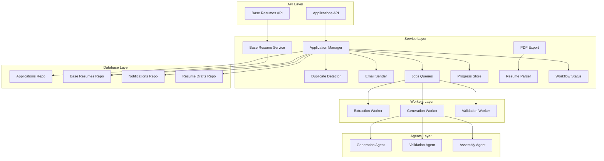

**Diagram sources**
- [main.py:14-36](file://backend/app/main.py#L14-L36)
- [applications.py:1-200](file://backend/app/api/applications.py#L1-L200)
- [base_resumes.py:1-200](file://backend/app/api/base_resumes.py#L1-L200)
- [application_manager.py:143-168](file://backend/app/services/application_manager.py#L143-L168)
- [base_resumes.py:32-39](file://backend/app/services/base_resumes.py#L32-L39)
- [duplicates.py:79-82](file://backend/app/services/duplicates.py#L79-L82)
- [email.py:23-41](file://backend/app/services/email.py#L23-L41)
- [jobs.py:12-138](file://backend/app/services/jobs.py#L12-L138)
- [progress.py:53-79](file://backend/app/services/progress.py#L53-L79)
- [pdf_export.py:78-97](file://backend/app/services/pdf_export.py#L78-L97)
- [resume_parser.py:13-23](file://backend/app/services/resume_parser.py#L13-L23)
- [workflow.py:11-31](file://backend/app/services/workflow.py#L11-L31)
- [generation.py:1-351](file://agents/generation.py#L1-L351)
- [validation.py:1-292](file://agents/validation.py#L1-L292)
- [worker.py:1-1299](file://agents/worker.py#L1-L1299)
- [resume_drafts.py:1-173](file://backend/app/db/resume_drafts.py#L1-L173)
- [applications.py:123-200](file://backend/app/db/applications.py#L123-L200)
- [base_resumes.py:31-184](file://backend/app/db/base_resumes.py#L31-L184)
- [notifications.py:11-61](file://backend/app/db/notifications.py#L11-L61)

**Section sources**
- [main.py:14-36](file://backend/app/main.py#L14-L36)
- [applications.py:1-200](file://backend/app/api/applications.py#L1-L200)
- [base_resumes.py:1-200](file://backend/app/api/base_resumes.py#L1-L200)

## Core Components
- Application Manager: Central coordinator for job application lifecycle, including creation, extraction, duplicate checks, generation, progress tracking, and notifications
- Base Resume Service: Manages base resume templates, default selection, and CRUD operations
- Duplicate Detector: Implements fuzzy matching and reference ID extraction to prevent duplicate applications
- Email Sender: Pluggable sender supporting noop and Resend providers
- Jobs Queues: ARQ-backed extraction, generation, and regeneration job enqueuing
- Progress Store: Redis-backed progress persistence with TTL
- PDF Export: Markdown-to-ATS-safe PDF generation with timeout
- Resume Parser: PDF text extraction and Markdown normalization
- Workflow Status: Derives visible status from internal state and failure indicators
- **New**: Generation Service: Section-based LLM-powered resume generation with configurable aggressiveness and target length
- **New**: Validation Service: Hallucination detection and ATS compliance checking for generated content
- **New**: Assembly Service: Combines personal info header with ordered generated sections into final resume
- **New**: Resume Draft Repository: Persistent storage for generated resume drafts with regeneration support

**Section sources**
- [application_manager.py:143-168](file://backend/app/services/application_manager.py#L143-L168)
- [base_resumes.py:32-142](file://backend/app/services/base_resumes.py#L32-L142)
- [duplicates.py:79-184](file://backend/app/services/duplicates.py#L79-L184)
- [email.py:23-85](file://backend/app/services/email.py#L23-L85)
- [jobs.py:12-138](file://backend/app/services/jobs.py#L12-L138)
- [progress.py:53-79](file://backend/app/services/progress.py#L53-L79)
- [pdf_export.py:78-97](file://backend/app/services/pdf_export.py#L78-L97)
- [resume_parser.py:13-228](file://backend/app/services/resume_parser.py#L13-L228)
- [workflow.py:11-31](file://backend/app/services/workflow.py#L11-L31)
- [generation.py:1-351](file://agents/generation.py#L1-L351)
- [validation.py:1-292](file://agents/validation.py#L1-L292)
- [assembly.py:1-63](file://agents/assembly.py#L1-L63)
- [resume_drafts.py:1-173](file://backend/app/db/resume_drafts.py#L1-L173)

## Architecture Overview
The service layer coordinates between API endpoints, database repositories, external workers, and auxiliary services. It uses dependency injection via FastAPI Depends to assemble services with their repositories and external clients.

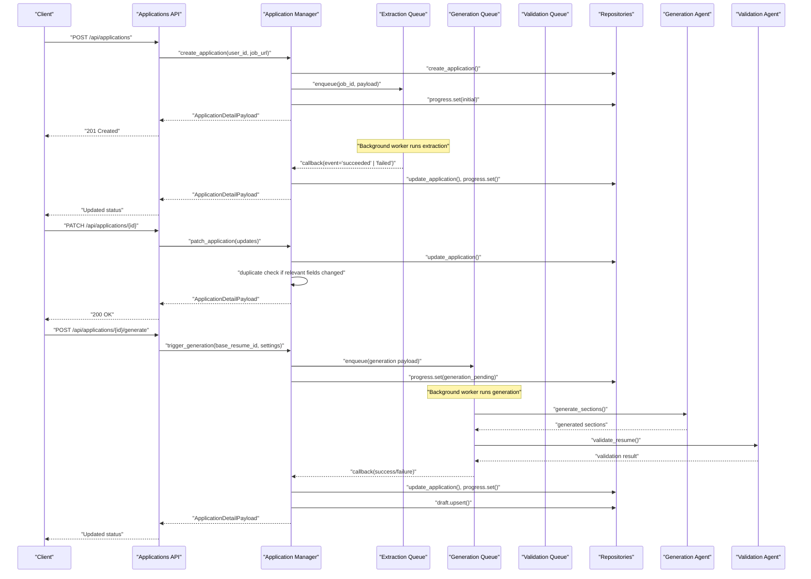

**Diagram sources**
- [applications.py:1-200](file://backend/app/api/applications.py#L1-L200)
- [application_manager.py:183-225](file://backend/app/services/application_manager.py#L183-L225)
- [jobs.py:16-43](file://backend/app/services/jobs.py#L16-L43)
- [progress.py:61-75](file://backend/app/services/progress.py#L61-L75)
- [applications.py:123-200](file://backend/app/db/applications.py#L123-L200)
- [generation.py:159-224](file://agents/generation.py#L159-L224)
- [validation.py:231-291](file://agents/validation.py#L231-L291)
- [worker.py:754-973](file://agents/worker.py#L754-L973)

## Detailed Component Analysis

### Application Manager Service
The Application Manager orchestrates the end-to-end application workflow:
- Creation: Creates application records and enqueues extraction jobs
- Recovery and retries: Handles manual entry fallbacks and retry logic
- Duplicate resolution: Runs duplicate evaluation and exposes resolution actions
- Generation: Validates readiness, collects profile data, enqueues generation jobs, and persists drafts
- Progress tracking: Updates Redis-backed progress records
- Notifications: Clears action-required flags and creates success notifications
- Callback handling: Processes worker callbacks for extraction and generation events

Key responsibilities and integration points:
- Uses ApplicationRepository, BaseResumeRepository, ResumeDraftRepository, ProfileRepository, NotificationRepository
- Integrates with ExtractionJobQueue and GenerationJobQueue
- Uses DuplicateDetector, EmailSender, RedisProgressStore, and derive_visible_status

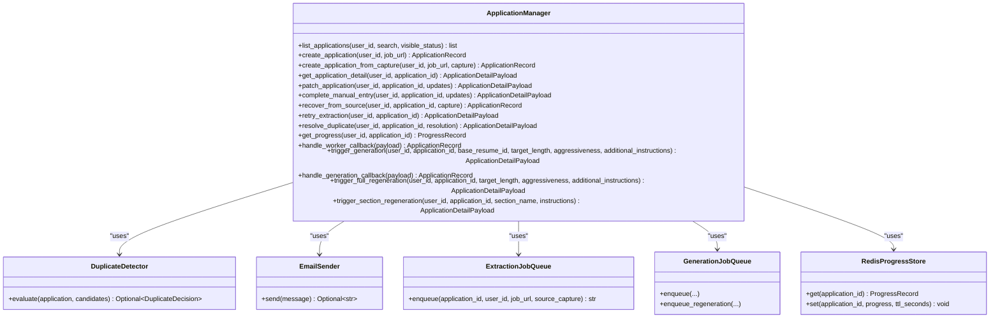

**Diagram sources**
- [application_manager.py:143-168](file://backend/app/services/application_manager.py#L143-L168)
- [duplicates.py:79-184](file://backend/app/services/duplicates.py#L79-L184)
- [email.py:23-85](file://backend/app/services/email.py#L23-L85)
- [jobs.py:12-138](file://backend/app/services/jobs.py#L12-L138)
- [progress.py:53-79](file://backend/app/services/progress.py#L53-L79)

**Section sources**
- [application_manager.py:170-720](file://backend/app/services/application_manager.py#L170-L720)

### Base Resume Management Services
The Base Resume Service manages base resume templates:
- Lists, creates, updates, deletes, and sets defaults
- Validates ownership and references before deletion
- Computes default flag based on profile's default resume

Integration:
- Uses BaseResumeRepository and ProfileRepository
- Exposed via FastAPI endpoints with dependency injection

**Diagram sources**
- [base_resumes.py:108-128](file://backend/app/services/base_resumes.py#L108-L128)
- [base_resumes.py:129-142](file://backend/app/services/base_resumes.py#L129-L142)

**Section sources**
- [base_resumes.py:32-142](file://backend/app/services/base_resumes.py#L32-L142)

### Duplicate Detection Algorithms and Prevention
DuplicateDetector evaluates potential duplicates using:
- Normalization and similarity scoring for job title/company
- Reference ID extraction from URLs and descriptions
- Origin matching and description similarity thresholds
- Scoring logic that weights exact matches, origins, and description similarity

Prevention mechanisms:
- Automatic duplicate warnings during updates and creation
- Manual resolution states requiring explicit user action
- Threshold-based gating for duplicate detection

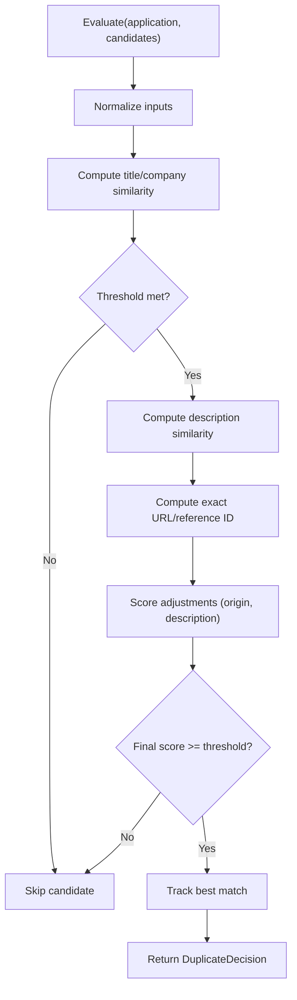

**Diagram sources**
- [duplicates.py:83-184](file://backend/app/services/duplicates.py#L83-L184)

**Section sources**
- [duplicates.py:79-184](file://backend/app/services/duplicates.py#L79-L184)

### Email Service Implementation
EmailSender supports two implementations:
- NoOpEmailSender: Logs and skips sending when notifications are disabled
- ResendEmailSender: Sends via Resend API with authorization and payload construction

Provider selection is controlled by settings.

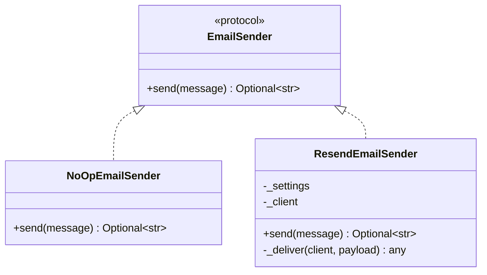

**Diagram sources**
- [email.py:23-85](file://backend/app/services/email.py#L23-L85)

**Section sources**
- [email.py:23-85](file://backend/app/services/email.py#L23-L85)

### Job Processing Services (URL Validation, Content Extraction, Data Normalization)
Job processing is handled by ARQ queues:
- ExtractionJobQueue: Enqueues extraction jobs with optional source capture
- GenerationJobQueue: Enqueues generation and regeneration jobs with settings and preferences

Validation and normalization:
- API requests validate and normalize strings
- Application Manager normalizes payloads and validates readiness before enqueueing

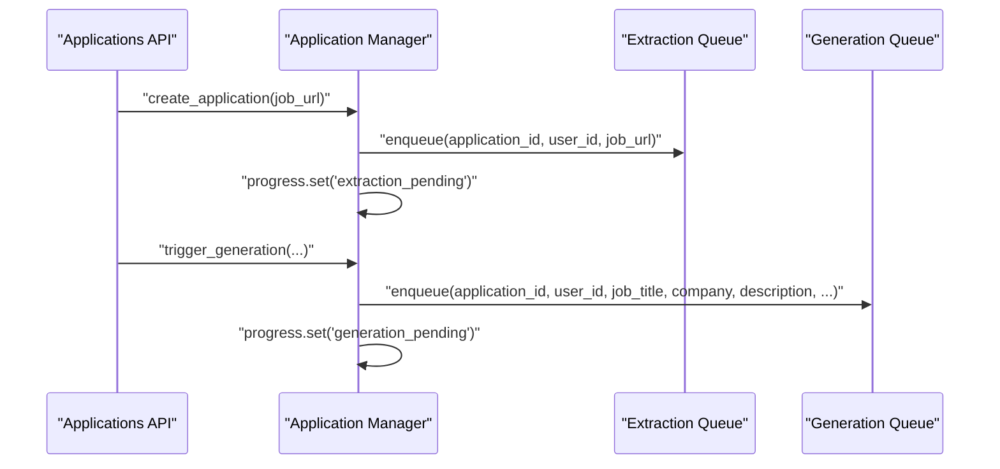

**Diagram sources**
- [applications.py:24-78](file://backend/app/api/applications.py#L24-L78)
- [application_manager.py:183-225](file://backend/app/services/application_manager.py#L183-L225)
- [jobs.py:16-129](file://backend/app/services/jobs.py#L16-L129)

**Section sources**
- [jobs.py:12-138](file://backend/app/services/jobs.py#L12-L138)
- [applications.py:24-78](file://backend/app/api/applications.py#L24-L78)

### PDF Export Services (ATS-Compliant Resume Generation)
PDF export converts Markdown to an ATS-safe HTML/CSS document and renders it to PDF:
- Builds HTML with personal header and Markdown-rendered body
- Uses WeasyPrint in a thread pool with enforced timeout
- Returns PDF bytes or raises timeout errors

**Diagram sources**
- [pdf_export.py:78-97](file://backend/app/services/pdf_export.py#L78-L97)

**Section sources**
- [pdf_export.py:78-97](file://backend/app/services/pdf_export.py#L78-L97)

### Progress Tracking Services (Real-Time Status Updates and Callbacks)
Progress tracking persists workflow state and messages in Redis:
- ProgressRecord captures job_id, state, message, completion percentage, timestamps, and terminal error code
- RedisProgressStore serializes to JSON with TTL
- Application Manager updates progress on state transitions and callbacks

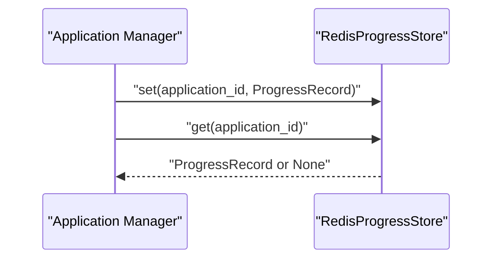

**Diagram sources**
- [progress.py:13-79](file://backend/app/services/progress.py#L13-L79)
- [application_manager.py:439-453](file://backend/app/services/application_manager.py#L439-L453)

**Section sources**
- [progress.py:13-79](file://backend/app/services/progress.py#L13-L79)
- [application_manager.py:439-453](file://backend/app/services/application_manager.py#L439-L453)

### Resume Parsing Services (Extraction and Normalization)
ResumeParserService extracts text from PDFs and normalizes it to Markdown:
- Uses pdfplumber to iterate pages and extract text
- Converts plain lines to Markdown headings, bullets, and paragraphs
- Optionally cleans up with LLM via OpenRouter with graceful fallbacks

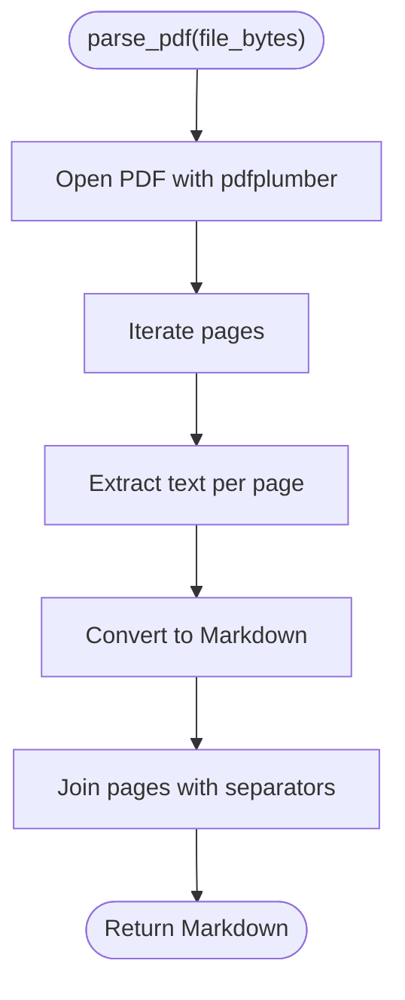

**Diagram sources**
- [resume_parser.py:24-54](file://backend/app/services/resume_parser.py#L24-L54)

**Section sources**
- [resume_parser.py:13-228](file://backend/app/services/resume_parser.py#L13-L228)

### New: Generation Service (LLM-Powered Resume Generation)
The Generation Service creates resume content using section-based LLM prompting:
- Supports four resume sections: summary, professional experience, education, skills
- Configurable aggressiveness levels (low, medium, high) for tailoring
- Target length guidance for single or dual-page resumes
- Structured LLM output with fallback mechanisms
- Progress reporting with percentage completion tracking

Key features:
- Section-by-section generation with grounding in base resume content
- User-defined additional instructions for customization
- Structured output validation and error handling
- Integration with Redis progress tracking

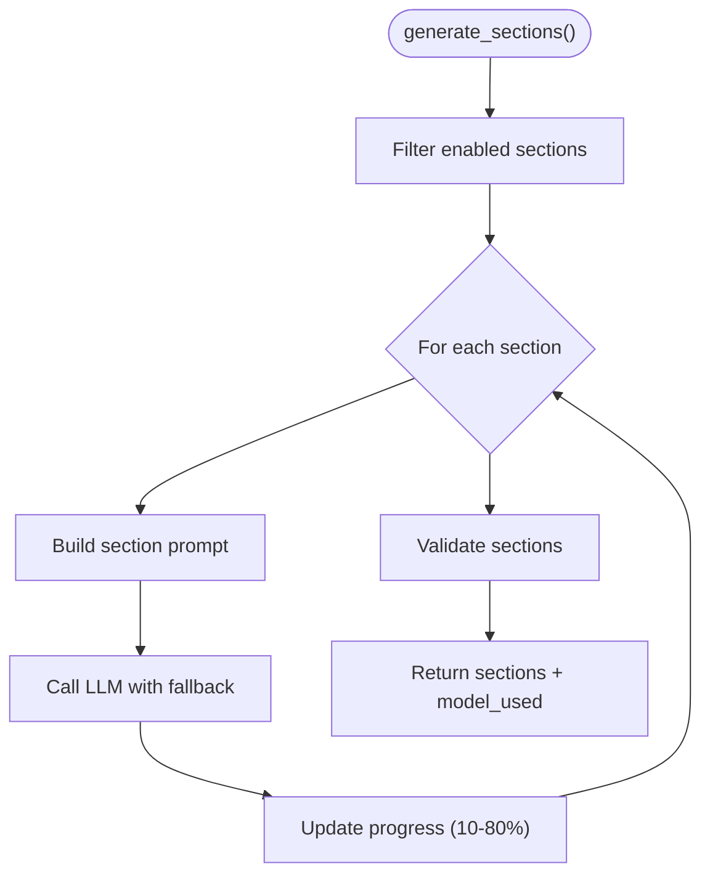

**Diagram sources**
- [generation.py:159-224](file://agents/generation.py#L159-L224)

**Section sources**
- [generation.py:1-351](file://agents/generation.py#L1-L351)

### New: Validation Service (Hallucination Detection and ATS Compliance)
The Validation Service ensures generated content quality and ATS compliance:
- LLM-based hallucination detection comparing generated vs. base resume
- Required sections verification and ordering validation
- ATS safety checking (no tables, images, or decorative elements)
- Auto-correction capabilities for formatting issues

Validation pipeline:
- Hallucination detection across all generated sections
- Required sections completeness check
- Section ordering validation according to preferences
- ATS safety compliance with automatic formatting corrections

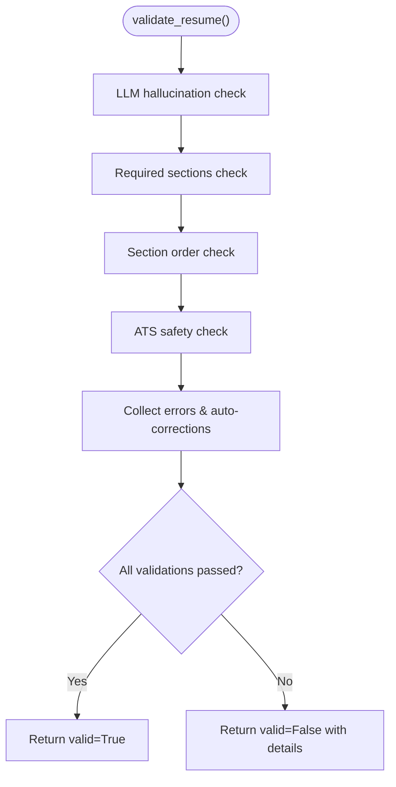

**Diagram sources**
- [validation.py:231-291](file://agents/validation.py#L231-L291)

**Section sources**
- [validation.py:1-292](file://agents/validation.py#L1-L292)

### New: Assembly Service (Resume Composition)
The Assembly Service combines personal information with generated sections:
- Creates personal info header with name and contact details
- Orders sections according to preferences
- Ensures personal info comes from profile, not LLM generation
- Produces clean, final Markdown resume

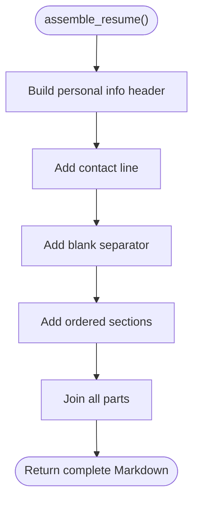

**Diagram sources**
- [assembly.py:12-62](file://agents/assembly.py#L12-L62)

**Section sources**
- [assembly.py:1-63](file://agents/assembly.py#L1-L63)

### New: Resume Draft Management
The Resume Draft Repository provides persistent storage for generated content:
- Stores complete resume drafts with generation parameters
- Tracks sections snapshot and last generation timestamp
- Supports content updates and export tracking
- Enables regeneration workflows with history preservation

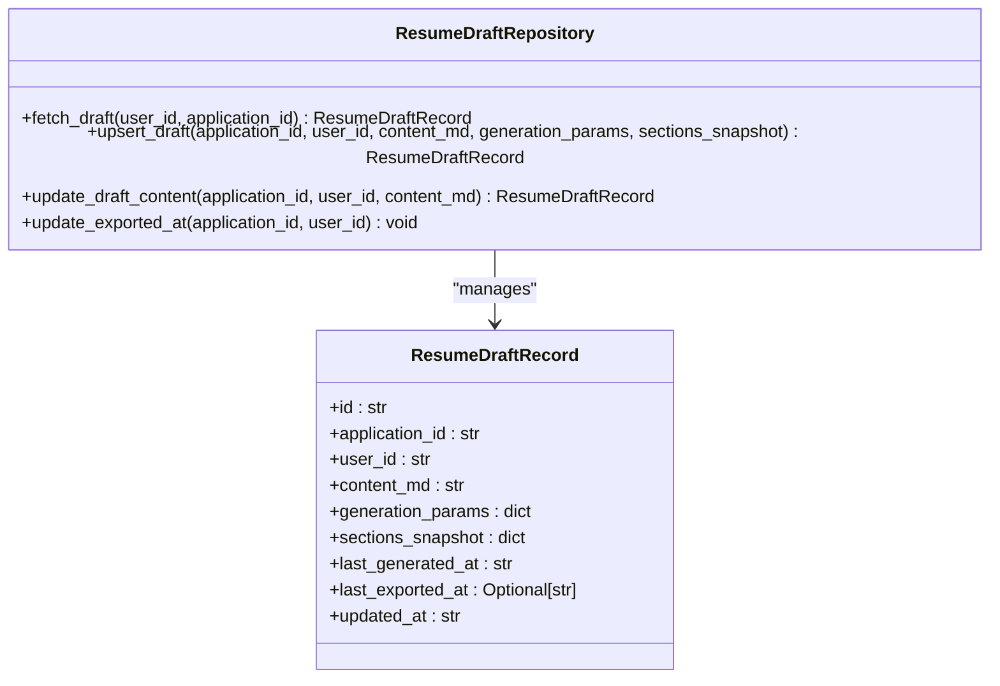

**Diagram sources**
- [resume_drafts.py:41-173](file://backend/app/db/resume_drafts.py#L41-L173)

**Section sources**
- [resume_drafts.py:1-173](file://backend/app/db/resume_drafts.py#L1-L173)

### Service Dependency Injection Patterns
Dependency injection is implemented via FastAPI Depends:
- Services expose factory functions (e.g., get_base_resume_service) that construct services with injected repositories/settings
- API endpoints depend on service factories, ensuring testability and modularity
- Example: Base Resume API depends on BaseResumeService and ResumeParserService

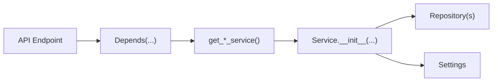

**Diagram sources**
- [base_resumes.py:144-154](file://backend/app/services/base_resumes.py#L144-L154)
- [base_resumes.py:17-24](file://backend/app/api/base_resumes.py#L17-L24)

**Section sources**
- [base_resumes.py:144-154](file://backend/app/services/base_resumes.py#L144-L154)
- [base_resumes.py:17-24](file://backend/app/api/base_resumes.py#L17-L24)

### Transaction Management and Error Handling Strategies
Transaction management:
- Repositories wrap database operations in context-managed connections and commit upon successful writes
- Upserts and updates are atomic per operation

Error handling:
- Application Manager centralizes try/catch around job enqueueing and progress updates
- API endpoints map service exceptions to appropriate HTTP status codes
- Email sender gracefully falls back to noop when notifications are disabled
- PDF export enforces timeouts and propagates errors
- Resume parser returns raw content on LLM failures and logs warnings
- Generation and validation services implement structured error handling with fallback models

**Section sources**
- [applications.py:123-200](file://backend/app/db/applications.py#L123-L200)
- [base_resumes.py:31-184](file://backend/app/db/base_resumes.py#L31-L184)
- [application_manager.py:191-225](file://backend/app/services/application_manager.py#L191-L225)
- [base_resumes.py:72-82](file://backend/app/api/base_resumes.py#L72-L82)
- [email.py:82-85](file://backend/app/services/email.py#L82-L85)
- [pdf_export.py:92-96](file://backend/app/services/pdf_export.py#L92-L96)
- [resume_parser.py:181-228](file://backend/app/services/resume_parser.py#L181-L228)
- [generation.py:117-151](file://agents/generation.py#L117-L151)
- [validation.py:48-115](file://agents/validation.py#L48-L115)

### Practical Examples of Service Usage and Integration Patterns
- Creating an application from a URL:
  - API endpoint invokes Application Manager create_application
  - Manager enqueues extraction job and initializes progress
- Handling extraction callbacks:
  - Worker sends callback; Application Manager validates job_id and user, updates state, and triggers duplicate resolution
- Generating a resume:
  - Application Manager validates readiness, collects profile and base resume data, enqueues generation, and persists draft
  - Generation worker runs section-by-section generation with validation
  - Assembly service composes final resume with personal info header
- Managing base resumes:
  - API endpoint uploads PDF, parses to Markdown, optionally cleans up with LLM, and creates base resume
- Progress polling:
  - Client polls progress endpoint; Application Manager returns Redis-stored progress or derives state
- Regenerating specific sections:
  - Application Manager triggers section regeneration with user instructions
  - Worker regenerates single section and validates ATS compliance

**Section sources**
- [applications.py:1-200](file://backend/app/api/applications.py#L1-L200)
- [application_manager.py:455-512](file://backend/app/services/application_manager.py#L455-L512)
- [application_manager.py:513-602](file://backend/app/services/application_manager.py#L513-L602)
- [base_resumes.py:111-169](file://backend/app/api/base_resumes.py#L111-L169)
- [progress.py:61-75](file://backend/app/services/progress.py#L61-L75)
- [worker.py:754-973](file://agents/worker.py#L754-L973)
- [worker.py:981-1292](file://agents/worker.py#L981-L1292)

## Dependency Analysis
Service-layer dependencies and coupling:
- Application Manager depends on multiple repositories, queues, stores, detectors, and senders
- Base Resume Service depends on BaseResumeRepository and ProfileRepository
- Email Sender is pluggable and isolated behind a protocol
- Jobs queues encapsulate ARQ specifics
- Progress store encapsulates Redis serialization and TTL
- Workflow status derivation is pure logic decoupled from persistence
- **New**: Generation Service depends on LangChain OpenAI for LLM calls
- **New**: Validation Service performs hallucination detection and ATS compliance checking
- **New**: Assembly Service composes final resume content
- **New**: Resume Draft Repository provides persistent storage for generated content

Potential circular dependencies:
- None observed among services; repositories are data-only and imported locally where needed

External dependencies:
- ARQ for job queues
- Redis for progress store
- HTTP clients for email and LLM cleanup
- WeasyPrint for PDF generation (optional, guarded by import)
- **New**: LangChain OpenAI for LLM-powered generation and validation
- **New**: Playwright for web scraping in extraction

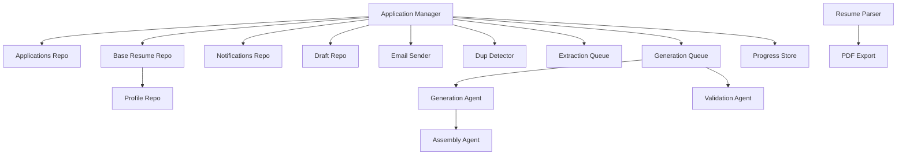

**Diagram sources**
- [application_manager.py:143-168](file://backend/app/services/application_manager.py#L143-L168)
- [base_resumes.py:32-39](file://backend/app/services/base_resumes.py#L32-L39)
- [pdf_export.py:78-97](file://backend/app/services/pdf_export.py#L78-L97)
- [generation.py:1-351](file://agents/generation.py#L1-L351)
- [validation.py:1-292](file://agents/validation.py#L1-L292)
- [assembly.py:1-63](file://agents/assembly.py#L1-L63)
- [resume_drafts.py:1-173](file://backend/app/db/resume_drafts.py#L1-L173)

**Section sources**
- [application_manager.py:143-168](file://backend/app/services/application_manager.py#L143-L168)
- [base_resumes.py:32-39](file://backend/app/services/base_resumes.py#L32-L39)

## Performance Considerations
- Async I/O: Email and PDF export use async clients and thread pools to avoid blocking the event loop
- Timeouts: PDF export enforces a strict timeout to prevent long-running conversions
- Redis TTL: Progress records expire automatically to prevent stale data accumulation
- Minimal DB round-trips: Application Manager batches updates and progress writes
- Optional LLM cleanup: Disabled by default; enable only when needed to reduce latency
- **New**: Generation service implements structured LLM calls with fallback models for reliability
- **New**: Validation service uses rule-based ATS checking for fast pre-validation
- **New**: Generation progress tracking provides granular updates (10-80% for generation, 85% for validation)
- **New**: Draft persistence enables efficient regeneration without reprocessing entire content

## Troubleshooting Guide
Common issues and resolutions:
- Extraction job enqueue failures: Application Manager falls back to a manual entry state and sets terminal progress
- Generation job enqueue failures: Application Manager marks generation failure and updates progress
- Missing base resume or profile: Validation errors raised before generation
- Duplicate resolution unavailable: Permission error when state is not eligible
- Email disabled: NoOpEmailSender logs and skips sending
- PDF generation timeout: asyncio.TimeoutError propagated; retry or reduce content size
- Resume parsing errors: API maps parsing failures to client errors with details
- **New**: Generation timeout: Full generation exceeds 300-second limit; check LLM provider performance
- **New**: Validation failures: Hallucination detection or ATS violations require content revision
- **New**: Regeneration errors: Single-section regeneration requires valid section name and instructions
- **New**: Draft persistence failures: Upsert operations require valid JSON parameters and application ownership

**Section sources**
- [application_manager.py:191-225](file://backend/app/services/application_manager.py#L191-L225)
- [application_manager.py:596-602](file://backend/app/services/application_manager.py#L596-L602)
- [base_resumes.py:140-144](file://backend/app/api/base_resumes.py#L140-L144)
- [email.py:28-32](file://backend/app/services/email.py#L28-L32)
- [pdf_export.py:92-96](file://backend/app/services/pdf_export.py#L92-L96)
- [worker.py:928-950](file://agents/worker.py#L928-L950)
- [worker.py:1247-1269](file://agents/worker.py#L1247-L1269)
- [resume_drafts.py:115-118](file://backend/app/db/resume_drafts.py#L115-L118)

## Conclusion
The service layer cleanly separates business logic from infrastructure concerns, enabling robust workflows for job application intake, duplication prevention, generation, and delivery. Dependency injection, repository abstractions, and queue-based processing provide scalability and maintainability. Clear error handling and progress tracking ensure reliable user experiences. The addition of specialized generation, validation, and assembly services enhances content quality and ATS compliance while maintaining the modular architecture.

## Appendices
- API registration occurs in the main application, mounting routers for sessions, profiles, applications, base resumes, extension, and internal worker endpoints.

**Section sources**
- [main.py:30-36](file://backend/app/main.py#L30-L36)