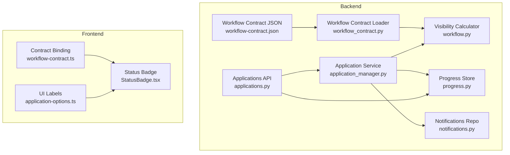
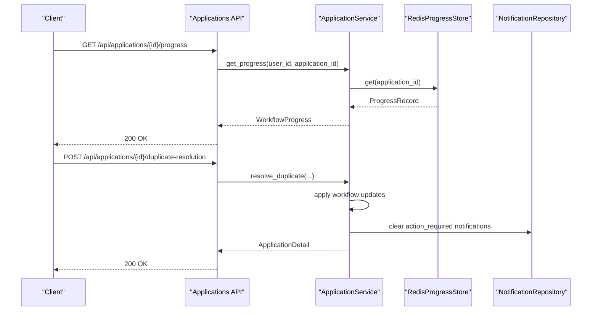
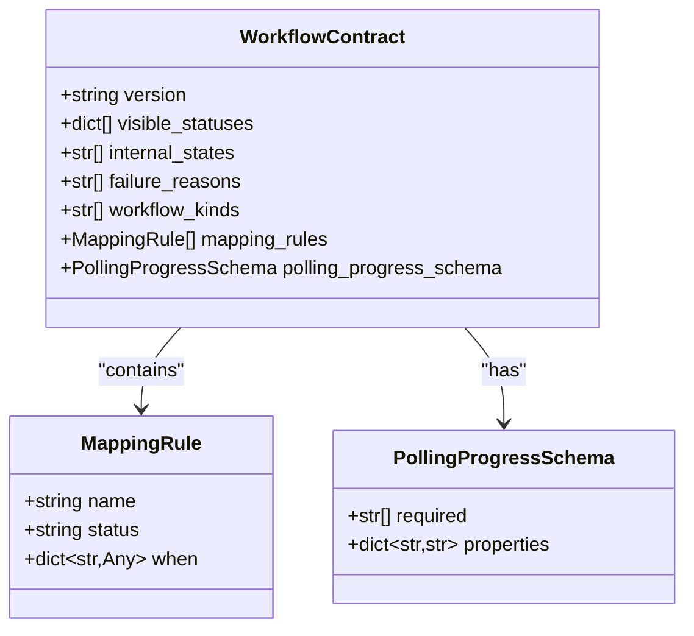
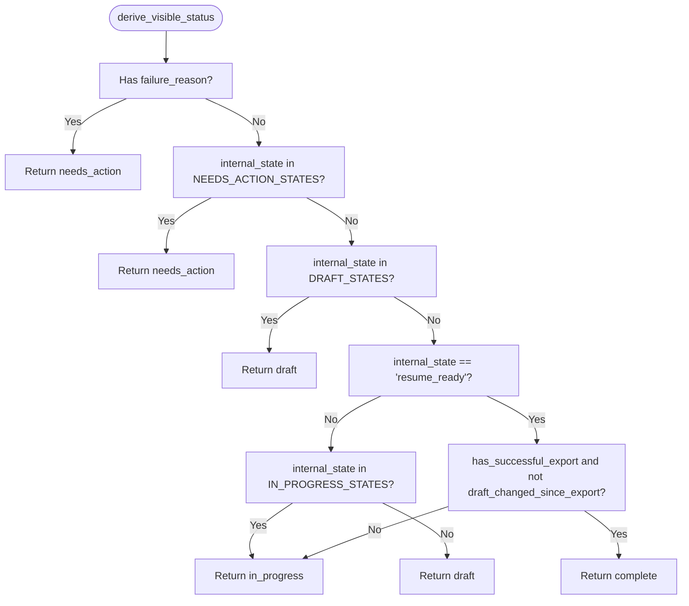
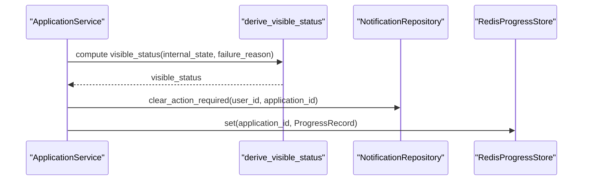
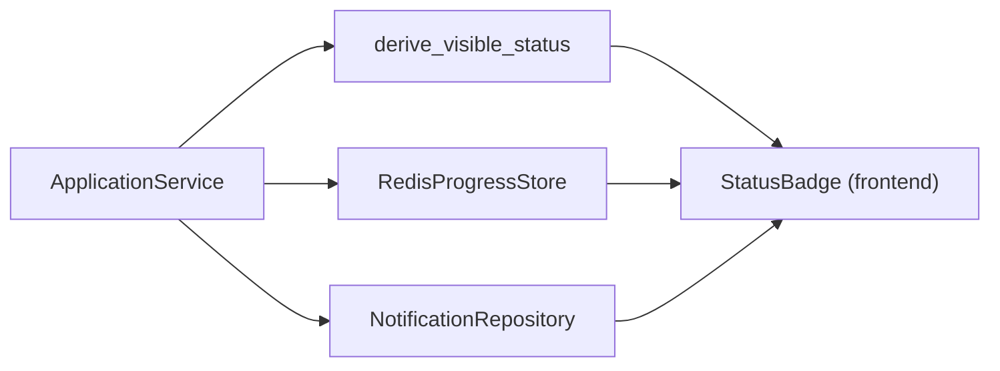
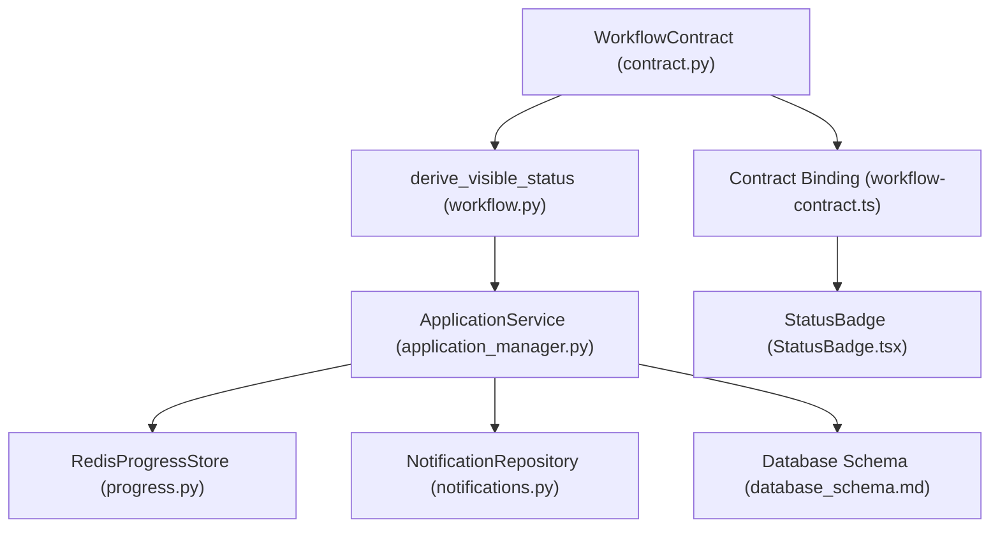

# Workflow Management Service

<cite>
**Referenced Files in This Document**
- [workflow.py](file://backend/app/services/workflow.py)
- [workflow_contract.py](file://backend/app/core/workflow_contract.py)
- [workflow-contract.json](file://shared/workflow-contract.json)
- [application_manager.py](file://backend/app/services/application_manager.py)
- [progress.py](file://backend/app/services/progress.py)
- [applications.py](file://backend/app/api/applications.py)
- [workflow-contract.ts](file://frontend/src/lib/workflow-contract.ts)
- [application-options.ts](file://frontend/src/lib/application-options.ts)
- [StatusBadge.tsx](file://frontend/src/components/StatusBadge.tsx)
- [database_schema.md](file://docs/database_schema.md)
- [notifications.py](file://backend/app/db/notifications.py)
- [test_workflow_contract.py](file://backend/tests/test_workflow_contract.py)
</cite>

## Table of Contents
1. [Introduction](#introduction)
2. [Project Structure](#project-structure)
3. [Core Components](#core-components)
4. [Architecture Overview](#architecture-overview)
5. [Detailed Component Analysis](#detailed-component-analysis)
6. [Dependency Analysis](#dependency-analysis)
7. [Performance Considerations](#performance-considerations)
8. [Troubleshooting Guide](#troubleshooting-guide)
9. [Conclusion](#conclusion)

## Introduction
This document describes the Workflow Management Service responsible for defining and managing the application state machine and workflow rules. It explains how internal workflow states are mapped to user-facing visible statuses, documents the derive_visible_status function and its rules, and details the workflow contract definition, state validation, and transition guards. It also covers integration with application services for enforcing workflow constraints, maintaining data consistency, and driving progress tracking, notifications, and UI updates.

## Project Structure
The workflow system spans backend services, shared contracts, and frontend bindings:
- Backend core contract loader and runtime contract model
- Workflow visibility calculation logic
- Application service orchestrating state transitions and notifications
- Progress tracking via Redis-backed store
- API endpoints exposing progress and application details
- Frontend TypeScript contract binding and UI badge rendering

**Diagram sources**
- [workflow_contract.py:32-39](file://backend/app/core/workflow_contract.py#L32-L39)
- [workflow-contract.json:1-112](file://shared/workflow-contract.json#L1-L112)
- [workflow.py:11-30](file://backend/app/services/workflow.py#L11-L30)
- [application_manager.py:143-38](file://backend/app/services/application_manager.py#L143-L38)
- [progress.py:53-78](file://backend/app/services/progress.py#L53-L78)
- [applications.py:526-539](file://backend/app/api/applications.py#L526-L539)
- [workflow-contract.ts:28-32](file://frontend/src/lib/workflow-contract.ts#L28-L32)
- [StatusBadge.tsx:8-22](file://frontend/src/components/StatusBadge.tsx#L8-L22)
- [application-options.ts:13-18](file://frontend/src/lib/application-options.ts#L13-L18)

**Section sources**
- [workflow_contract.py:32-39](file://backend/app/core/workflow_contract.py#L32-L39)
- [workflow-contract.json:1-112](file://shared/workflow-contract.json#L1-L112)
- [workflow.py:11-30](file://backend/app/services/workflow.py#L11-L30)
- [application_manager.py:143-38](file://backend/app/services/application_manager.py#L143-L38)
- [progress.py:53-78](file://backend/app/services/progress.py#L53-L78)
- [applications.py:526-539](file://backend/app/api/applications.py#L526-L539)
- [workflow-contract.ts:28-32](file://frontend/src/lib/workflow-contract.ts#L28-L32)
- [StatusBadge.tsx:8-22](file://frontend/src/components/StatusBadge.tsx#L8-L22)
- [application-options.ts:13-18](file://frontend/src/lib/application-options.ts#L13-L18)

## Core Components
- Workflow Contract: Defines visible statuses, internal states, failure reasons, workflow kinds, mapping rules, and polling progress schema. Loaded at runtime with caching.
- Visibility Calculator: derive_visible_status computes the user-facing status based on internal state, failure reason, and export freshness.
- Application Service: Orchestrates state transitions, applies workflow updates, emits notifications, and maintains progress.
- Progress Store: Provides Redis-backed persistence for workflow progress events.
- API Layer: Exposes endpoints to fetch application details and progress.
- Frontend Contract and UI: Validates and consumes the workflow contract; renders status badges consistently.

**Section sources**
- [workflow_contract.py:22-39](file://backend/app/core/workflow_contract.py#L22-L39)
- [workflow-contract.json:3-112](file://shared/workflow-contract.json#L3-L112)
- [workflow.py:11-30](file://backend/app/services/workflow.py#L11-L30)
- [application_manager.py:1427-1442](file://backend/app/services/application_manager.py#L1427-L1442)
- [progress.py:29-50](file://backend/app/services/progress.py#L29-L50)
- [applications.py:526-539](file://backend/app/api/applications.py#L526-L539)
- [workflow-contract.ts:28-32](file://frontend/src/lib/workflow-contract.ts#L28-L32)
- [StatusBadge.tsx:8-22](file://frontend/src/components/StatusBadge.tsx#L8-L22)

## Architecture Overview
The Workflow Management Service integrates backend orchestration, shared contracts, and frontend presentation:

**Diagram sources**
- [applications.py:507-539](file://backend/app/api/applications.py#L507-L539)
- [application_manager.py:445-453](file://backend/app/services/application_manager.py#L445-L453)
- [progress.py:61-74](file://backend/app/services/progress.py#L61-L74)
- [notifications.py:20-29](file://backend/app/db/notifications.py#L20-L29)

## Detailed Component Analysis

### Workflow Contract Definition
The contract defines:
- Visible statuses: draft, needs_action, in_progress, complete
- Internal states: extraction_pending, extracting, manual_entry_required, duplicate_review_required, generation_pending, generating, resume_ready, regenerating_section, regenerating_full, export_in_progress
- Failure reasons: extraction_failed, generation_failed, regeneration_failed, export_failed
- Workflow kinds: extraction, generation, regeneration_section, regeneration_full, export
- Mapping rules: business rules that map internal states and conditions to visible statuses
- Polling progress schema: shape and validation for progress events

**Diagram sources**
- [workflow_contract.py:22-29](file://backend/app/core/workflow_contract.py#L22-L29)
- [workflow-contract.json:3-112](file://shared/workflow-contract.json#L3-L112)

**Section sources**
- [workflow_contract.py:22-39](file://backend/app/core/workflow_contract.py#L22-L39)
- [workflow-contract.json:3-112](file://shared/workflow-contract.json#L3-L112)
- [test_workflow_contract.py:4-20](file://backend/tests/test_workflow_contract.py#L4-L20)

### derive_visible_status Function
The visibility calculator determines the user-facing status based on:
- internal_state
- failure_reason
- has_successful_export (optional)
- draft_changed_since_export (optional)

Rules:
- If failure_reason exists or internal_state is in NEEDS_ACTION_STATES, return needs_action
- Else if internal_state is in DRAFT_STATES, return draft
- Else if internal_state is resume_ready, has_successful_export is true, and draft has not changed since export, return complete
- Else if internal_state is in IN_PROGRESS_STATES, return in_progress
- Otherwise, return draft

**Diagram sources**
- [workflow.py:11-30](file://backend/app/services/workflow.py#L11-L30)

**Section sources**
- [workflow.py:11-30](file://backend/app/services/workflow.py#L11-L30)

### Mapping Between Internal States and Visible Statuses
The mapping rules in the contract define how internal states and conditions map to visible statuses. These rules are enforced by the visibility calculator and the application service’s workflow update logic.

Key mappings:
- failure_reason_any → needs_action
- manual_entry_required or duplicate_review_required → needs_action
- pre-resume states (extraction_pending, extracting, generation_pending, generating) → draft
- resume_ready/regenerating_* without fresh export → in_progress
- resume_ready with fresh export and no draft changes → complete

These rules are validated by the backend contract loader and consumed by the frontend contract binding.

**Section sources**
- [workflow-contract.json:34-87](file://shared/workflow-contract.json#L34-L87)
- [workflow_contract.py:32-39](file://backend/app/core/workflow_contract.py#L32-L39)
- [workflow-contract.ts:28-32](file://frontend/src/lib/workflow-contract.ts#L28-L32)

### Workflow State Transitions and Transition Guards
ApplicationService coordinates transitions and applies workflow updates atomically:
- _workflow_updates composes internal_state, failure_reason, and computed visible_status
- Notification clearing occurs when transitioning away from action-required states
- Progress store is updated with appropriate job_id, state, message, and completion markers

Common transitions:
- Creation sets initial internal_state to extraction_pending and visible_status to draft
- Worker callbacks update internal_state and failure_reason, recomputing visible_status
- Duplicate resolution clears action_required notifications and proceeds to next state
- Export transitions update exported timestamps and refresh progress

**Diagram sources**
- [application_manager.py:1427-1442](file://backend/app/services/application_manager.py#L1427-L1442)
- [workflow.py:11-30](file://backend/app/services/workflow.py#L11-L30)
- [notifications.py:20-29](file://backend/app/db/notifications.py#L20-L29)
- [progress.py:67-74](file://backend/app/services/progress.py#L67-L74)

**Section sources**
- [application_manager.py:183-206](file://backend/app/services/application_manager.py#L183-L206)
- [application_manager.py:455-475](file://backend/app/services/application_manager.py#L455-L475)
- [application_manager.py:1427-1442](file://backend/app/services/application_manager.py#L1427-L1442)
- [progress.py:29-50](file://backend/app/services/progress.py#L29-L50)

### Integration with Application Services, Progress Tracking, Notifications, and UI
- ApplicationService updates both internal_state and visible_status, ensuring consistency
- Progress events are built and stored with workflow_kind, state, message, and completion metadata
- Notifications are created and action_required flags are cleared to drive UI attention
- Frontend validates the shared contract and renders status badges using consistent labels

**Diagram sources**
- [application_manager.py:1427-1442](file://backend/app/services/application_manager.py#L1427-L1442)
- [progress.py:53-78](file://backend/app/services/progress.py#L53-L78)
- [notifications.py:31-56](file://backend/app/db/notifications.py#L31-L56)
- [StatusBadge.tsx:8-22](file://frontend/src/components/StatusBadge.tsx#L8-L22)

**Section sources**
- [application_manager.py:1347-1384](file://backend/app/services/application_manager.py#L1347-L1384)
- [progress.py:29-50](file://backend/app/services/progress.py#L29-L50)
- [StatusBadge.tsx:8-22](file://frontend/src/components/StatusBadge.tsx#L8-L22)
- [application-options.ts:13-18](file://frontend/src/lib/application-options.ts#L13-L18)

## Dependency Analysis
The workflow system exhibits clear separation of concerns:
- Contract-driven visibility rules decouple UI and backend logic
- ApplicationService encapsulates workflow updates and side effects
- Progress and notifications are orthogonal concerns managed by dedicated stores/repositories
- Frontend consumes the shared contract to maintain UI consistency

**Diagram sources**
- [workflow_contract.py:22-39](file://backend/app/core/workflow_contract.py#L22-L39)
- [workflow.py:11-30](file://backend/app/services/workflow.py#L11-L30)
- [workflow-contract.ts:28-32](file://frontend/src/lib/workflow-contract.ts#L28-L32)
- [application_manager.py:1427-1442](file://backend/app/services/application_manager.py#L1427-L1442)
- [progress.py:53-78](file://backend/app/services/progress.py#L53-L78)
- [notifications.py:11-59](file://backend/app/db/notifications.py#L11-L59)
- [database_schema.md:20-29](file://docs/database_schema.md#L20-L29)
- [StatusBadge.tsx:8-22](file://frontend/src/components/StatusBadge.tsx#L8-L22)

**Section sources**
- [workflow_contract.py:22-39](file://backend/app/core/workflow_contract.py#L22-L39)
- [workflow-contract.ts:28-32](file://frontend/src/lib/workflow-contract.ts#L28-L32)
- [application_manager.py:1427-1442](file://backend/app/services/application_manager.py#L1427-L1442)
- [progress.py:53-78](file://backend/app/services/progress.py#L53-L78)
- [notifications.py:11-59](file://backend/app/db/notifications.py#L11-L59)
- [database_schema.md:20-29](file://docs/database_schema.md#L20-L29)
- [StatusBadge.tsx:8-22](file://frontend/src/components/StatusBadge.tsx#L8-L22)

## Performance Considerations
- Contract loading uses LRU caching to minimize repeated disk reads
- Progress store operations are lightweight Redis updates keyed by application_id
- Visibility computation is O(1) with constant-time checks against predefined sets
- Frontend contract parsing occurs once at module load time

[No sources needed since this section provides general guidance]

## Troubleshooting Guide
Common issues and resolutions:
- Visible status not updating: Verify internal_state and failure_reason are correctly set; ensure derive_visible_status is invoked in workflow updates
- Stale progress: Confirm progress store set/get operations are called with the correct application_id and job_id
- Missing action-required notifications: Ensure notification clear/update logic runs after transitions that resolve issues
- Contract mismatches: Validate shared workflow-contract.json and frontend binding; confirm visible_statuses and internal_states align

**Section sources**
- [workflow_contract.py:32-39](file://backend/app/core/workflow_contract.py#L32-L39)
- [workflow-contract.ts:28-32](file://frontend/src/lib/workflow-contract.ts#L28-L32)
- [application_manager.py:1427-1442](file://backend/app/services/application_manager.py#L1427-L1442)
- [progress.py:61-74](file://backend/app/services/progress.py#L61-L74)
- [notifications.py:20-29](file://backend/app/db/notifications.py#L20-L29)

## Conclusion
The Workflow Management Service provides a robust, contract-driven mechanism for managing application state and user-facing visibility. By centralizing mapping rules and visibility logic, it ensures consistent behavior across backend services, progress tracking, notifications, and the user interface. The design enables clear state transitions, strong validation, and maintainable integrations.