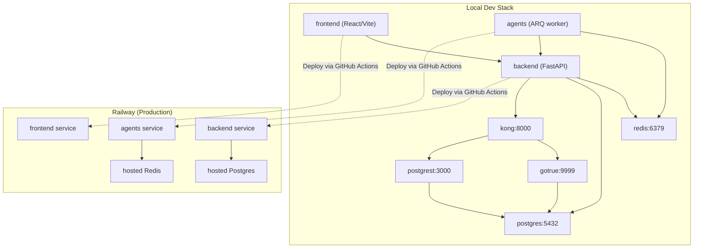
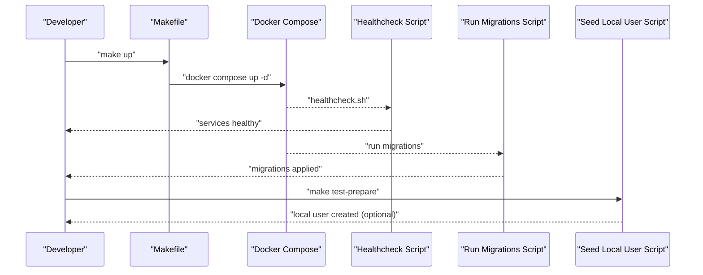
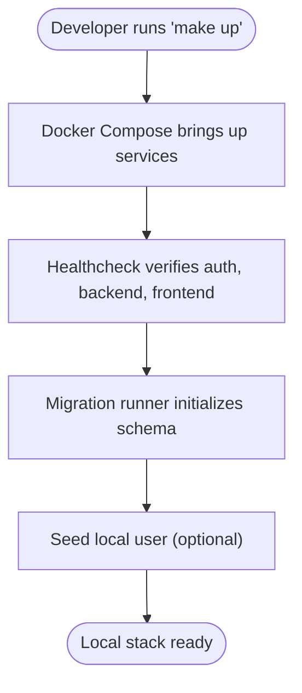
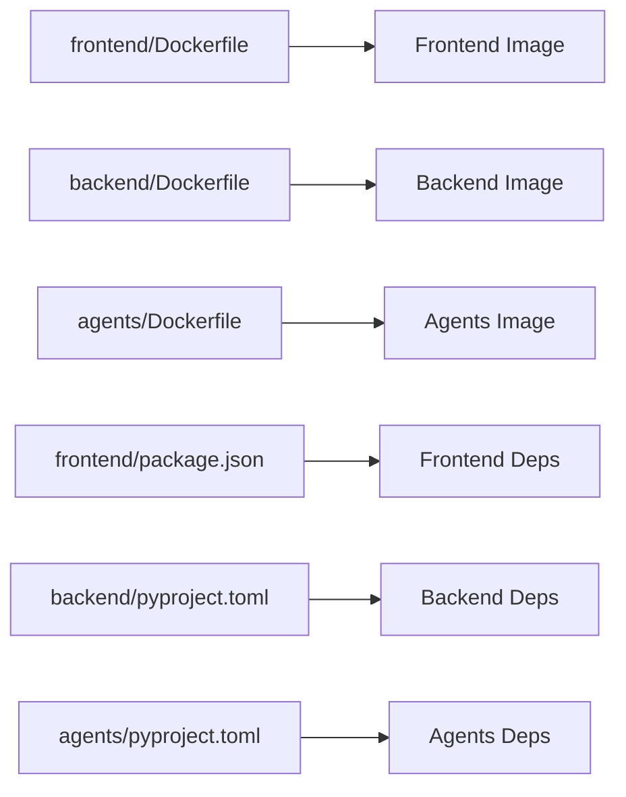
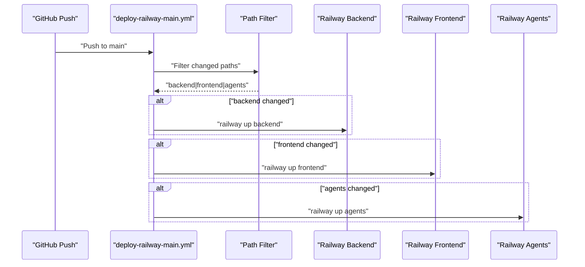
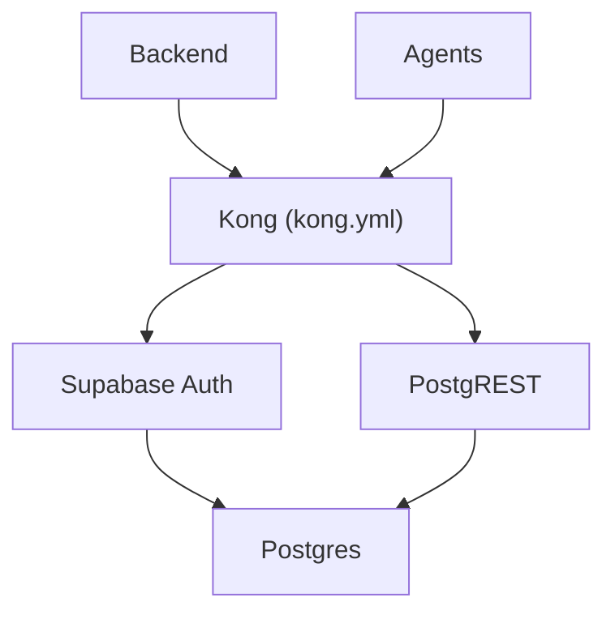
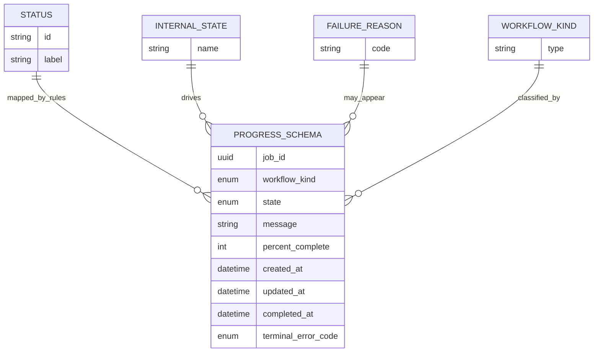
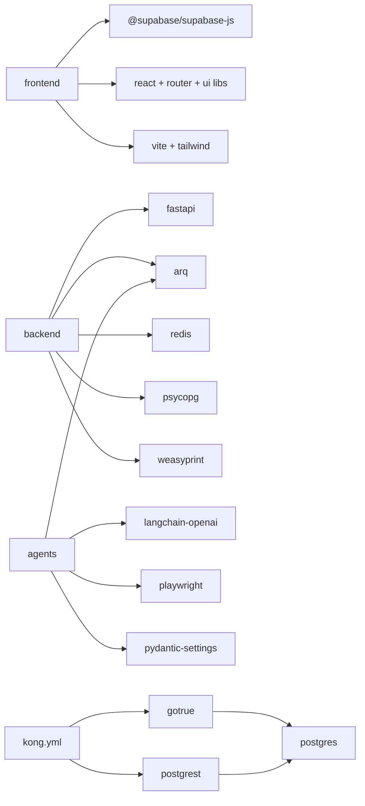
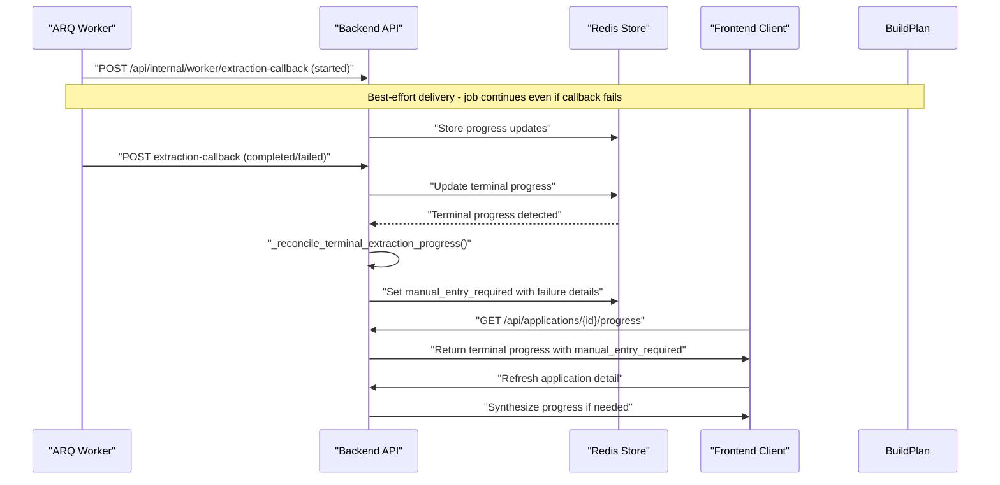

# Build Plan

<cite>
**Referenced Files in This Document**
- [docs/build-plan.md](file://docs/build-plan.md)
- [Makefile](file://Makefile)
- [docker-compose.yml](file://docker-compose.yml)
- [backend/Dockerfile](file://backend/Dockerfile)
- [frontend/Dockerfile](file://frontend/Dockerfile)
- [agents/Dockerfile](file://agents/Dockerfile)
- [scripts/healthcheck.sh](file://scripts/healthcheck.sh)
- [scripts/run_migrations.sh](file://scripts/run_migrations.sh)
- [scripts/seed_local_user.sh](file://scripts/seed_local_user.sh)
- [backend/pyproject.toml](file://backend/pyproject.toml)
- [frontend/package.json](file://frontend/package.json)
- [agents/pyproject.toml](file://agents/pyproject.toml)
- [.github/workflows/deploy-railway-main.yml](file://.github/workflows/deploy-railway-main.yml)
- [supabase/kong/kong.yml](file://supabase/kong/kong.yml)
- [supabase/kong/kong-entrypoint.sh](file://supabase/kong/kong-entrypoint.sh)
- [shared/workflow-contract.json](file://shared/workflow-contract.json)
- [backend/app/core/config.py](file://backend/app/core/config.py)
- [backend/app/core/workflow-contract.json](file://backend/app/core/workflow-contract.json)
- [frontend/vite.config.ts](file://frontend/vite.config.ts)
- [frontend/src/lib/env.ts](file://frontend/src/lib/env.ts)
- [agents/worker.py](file://agents/worker.py)
- [backend/app/api/internal_worker.py](file://backend/app/api/internal_worker.py)
- [backend/app/services/application_manager.py](file://backend/app/services/application_manager.py)
- [frontend/src/routes/ApplicationDetailPage.tsx](file://frontend/src/routes/ApplicationDetailPage.tsx)
- [.env.compose.example](file://.env.compose.example)
</cite>

## Update Summary
**Changes Made**
- Added comprehensive documentation for B5-T04 (terminal progress reconciliation), B5-T05 (extraction callback resilience), B5-T06 (extraction callback hardening), and B5-T07 (callback-missed extraction recovery) bug fixes
- Enhanced reliability section with detailed terminal progress reconciliation documentation and callback resilience mechanisms
- Updated troubleshooting guide with specific guidance for callback delivery failures and terminal progress handling
- Added systematic coverage of extraction payload caching and recovery mechanisms

## Table of Contents
1. [Introduction](#introduction)
2. [Project Structure](#project-structure)
3. [Core Components](#core-components)
4. [Architecture Overview](#architecture-overview)
5. [Detailed Component Analysis](#detailed-component-analysis)
6. [Environment Configuration](#environment-configuration)
7. [Deployment Pipeline](#deployment-pipeline)
8. [Dependency Analysis](#dependency-analysis)
9. [Performance Considerations](#performance-considerations)
10. [Reliability Enhancements](#reliability-enhancements)
11. [Troubleshooting Guide](#troubleshooting-guide)
12. [Conclusion](#conclusion)
13. [Appendices](#appendices)

## Introduction
This document describes the Build Plan for the AI Resume Builder project. It consolidates the roadmap, implementation status, and operational build practices across the frontend, backend, agents (workers), and local development stack. It also documents the containerized local environment, deployment automation, and configuration contracts that ensure reproducible builds and reliable CI/CD on Railway.

**Updated** Enhanced with comprehensive extraction callback resilience improvements, terminal progress reconciliation features, and callback-missed extraction recovery mechanisms that provide reliability guarantees for distributed asynchronous workflows.

## Project Structure
The project is organized into layered services:
- Frontend: React + Vite + Tailwind with TypeScript and custom domain host validation
- Backend: FastAPI application exposing REST APIs and managing auth, jobs, and integrations with Railway-compatible port binding
- Agents: Python ARQ worker orchestrating long-running tasks (extraction, generation, validation, assembly)
- Local Dev Stack: Docker Compose with Supabase auth, REST, and Kong gateway, plus Redis and Postgres
- Deployment: GitHub Actions deploying services independently on Railway based on path changes

**Diagram sources**
- [docker-compose.yml:1-194](file://docker-compose.yml#L1-L194)
- [.github/workflows/deploy-railway-main.yml:1-134](file://.github/workflows/deploy-railway-main.yml#L1-L134)

**Section sources**
- [docs/build-plan.md:1-509](file://docs/build-plan.md#L1-L509)
- [docker-compose.yml:1-194](file://docker-compose.yml#L1-L194)

## Core Components
- Local development orchestrated by a Makefile with targets for boot, reset, logs, health, and test preparation
- Docker Compose services for frontend, backend, agents, Supabase auth/REST/Kong, Postgres, and Redis
- Scripts for health verification, database migrations, and seeding a local user
- GitHub Actions pipeline for selective deployments to Railway based on changed paths
- Shared workflow contract defining status mapping, internal states, failure reasons, and progress polling schema

Key build artifacts and roles:
- Frontend Dockerfile installs Node dependencies and runs dev entrypoint with custom domain host validation
- Backend Dockerfile installs Python dependencies and runs Uvicorn with Railway-compatible port binding
- Agents Dockerfile installs Python dependencies and Playwright Chromium, then runs ARQ worker
- Backend and Agents pyproject.toml define Python dependencies and dev/test configuration
- Frontend package.json defines Vite/Tailwind/React toolchain and test scripts
- Kong declarative config and entrypoint script wire Supabase auth and REST behind a gateway

**Updated** Enhanced backend port binding to support Railway's dynamic $PORT environment variable and improved frontend custom domain validation.

**Section sources**
- [Makefile:1-30](file://Makefile#L1-L30)
- [docker-compose.yml:1-194](file://docker-compose.yml#L1-L194)
- [frontend/Dockerfile:1-11](file://frontend/Dockerfile#L1-L11)
- [backend/Dockerfile:1-18](file://backend/Dockerfile#L1-L18)
- [agents/Dockerfile:1-14](file://agents/Dockerfile#L1-L14)
- [frontend/package.json:1-42](file://frontend/package.json#L1-L42)
- [backend/pyproject.toml:1-37](file://backend/pyproject.toml#L1-L37)
- [agents/pyproject.toml:1-26](file://agents/pyproject.toml#L1-L26)
- [supabase/kong/kong.yml:1-96](file://supabase/kong/kong.yml#L1-L96)
- [supabase/kong/kong-entrypoint.sh:1-10](file://supabase/kong/kong-entrypoint.sh#L1-L10)
- [shared/workflow-contract.json:1-122](file://shared/workflow-contract.json#L1-L122)

## Architecture Overview
The build plan ties together a containerized local stack and a production deployment pipeline:
- Local stack: frontend, backend, agents, Supabase (auth, REST, gateway), Postgres, Redis
- Health checks and migrations are automated via scripts
- Railway deployment uses path-filtered jobs to deploy only changed services

**Diagram sources**
- [Makefile:9-26](file://Makefile#L9-L26)
- [scripts/healthcheck.sh:1-35](file://scripts/healthcheck.sh#L1-L35)
- [scripts/run_migrations.sh:1-39](file://scripts/run_migrations.sh#L1-L39)
- [scripts/seed_local_user.sh:1-97](file://scripts/seed_local_user.sh#L1-L97)

**Section sources**
- [docs/build-plan.md:175-232](file://docs/build-plan.md#L175-L232)
- [docker-compose.yml:1-194](file://docker-compose.yml#L1-L194)

## Detailed Component Analysis

### Local Development Stack
- Services: frontend, backend, agents, redis, supabase-db, supabase-auth, supabase-rest, supabase-kong, migration-runner
- Environment variables injected via docker-compose and .env.compose
- Health checks for auth, backend, and frontend endpoints
- Migration runner ensures schema initialization and idempotent application of SQL migrations
- Seed script provisions an invited local user and optionally grants admin role

**Diagram sources**
- [Makefile:9-26](file://Makefile#L9-L26)
- [scripts/healthcheck.sh:21-35](file://scripts/healthcheck.sh#L21-L35)
- [scripts/run_migrations.sh:13-39](file://scripts/run_migrations.sh#L13-L39)
- [scripts/seed_local_user.sh:31-97](file://scripts/seed_local_user.sh#L31-L97)

**Section sources**
- [docker-compose.yml:1-194](file://docker-compose.yml#L1-L194)
- [scripts/healthcheck.sh:1-35](file://scripts/healthcheck.sh#L1-L35)
- [scripts/run_migrations.sh:1-39](file://scripts/run_migrations.sh#L1-L39)
- [scripts/seed_local_user.sh:1-97](file://scripts/seed_local_user.sh#L1-L97)

### Container Images and Dependencies
- Frontend: Node 22 Alpine, installs deps, runs dev entrypoint with custom domain host validation for applix.ca
- Backend: Python 3.12 Slim, installs dependencies, runs Uvicorn with Railway-compatible port binding
- Agents: Python 3.12 Bookworm, installs dependencies and Playwright Chromium, runs ARQ worker
- Python dependencies declared in pyproject.toml for backend and agents
- Frontend dependencies declared in package.json for Vite/Tailwind/React

**Diagram sources**
- [frontend/Dockerfile:1-11](file://frontend/Dockerfile#L1-L11)
- [backend/Dockerfile:1-18](file://backend/Dockerfile#L1-L18)
- [agents/Dockerfile:1-14](file://agents/Dockerfile#L1-L14)
- [frontend/package.json:1-42](file://frontend/package.json#L1-L42)
- [backend/pyproject.toml:1-37](file://backend/pyproject.toml#L1-L37)
- [agents/pyproject.toml:1-26](file://agents/pyproject.toml#L1-L26)

**Section sources**
- [frontend/Dockerfile:1-11](file://frontend/Dockerfile#L1-L11)
- [backend/Dockerfile:1-18](file://backend/Dockerfile#L1-L18)
- [agents/Dockerfile:1-14](file://agents/Dockerfile#L1-L14)
- [frontend/package.json:1-42](file://frontend/package.json#L1-L42)
- [backend/pyproject.toml:1-37](file://backend/pyproject.toml#L1-L37)
- [agents/pyproject.toml:1-26](file://agents/pyproject.toml#L1-L26)

### Deployment Pipeline (Railway)
- Path-filtered GitHub Actions detects changes in backend, frontend, or agents
- Deploys only changed services to Railway with project and service IDs from secrets
- Supports selective deploys to reduce downtime and improve reliability

**Diagram sources**
- [.github/workflows/deploy-railway-main.yml:1-134](file://.github/workflows/deploy-railway-main.yml#L1-L134)

**Section sources**
- [.github/workflows/deploy-railway-main.yml:1-134](file://.github/workflows/deploy-railway-main.yml#L1-L134)

### Supabase Gateway and Authentication
- Kong declarative config exposes auth and REST endpoints with ACL and key-auth
- Entry script injects keys from environment variables
- Backend and agents consume Supabase URLs and keys from environment

**Diagram sources**
- [supabase/kong/kong.yml:1-96](file://supabase/kong/kong.yml#L1-L96)
- [supabase/kong/kong-entrypoint.sh:1-10](file://supabase/kong/kong-entrypoint.sh#L1-L10)
- [docker-compose.yml:118-189](file://docker-compose.yml#L118-L189)

**Section sources**
- [supabase/kong/kong.yml:1-96](file://supabase/kong/kong.yml#L1-L96)
- [supabase/kong/kong-entrypoint.sh:1-10](file://supabase/kong/kong-entrypoint.sh#L1-L10)
- [docker-compose.yml:118-189](file://docker-compose.yml#L118-L189)

### Shared Workflow Contract
- Defines visible statuses, internal states, failure reasons, workflow kinds, and mapping rules
- Provides a schema for progress polling responses
- Ensures frontend, backend, and agents interpret workflow states consistently

**Diagram sources**
- [shared/workflow-contract.json:1-122](file://shared/workflow-contract.json#L1-L122)

**Section sources**
- [shared/workflow-contract.json:1-122](file://shared/workflow-contract.json#L1-L122)

## Environment Configuration

### Backend Port Binding
The backend service now supports Railway's dynamic port binding through the $PORT environment variable:

- **Railway Runtime**: Uses Railway's assigned port via $PORT environment variable
- **Development Mode**: Falls back to default port 8000 when $PORT is not available
- **Configuration**: Backend settings automatically detect and use the appropriate port

**Updated** Enhanced backend port binding to support both Railway's dynamic $PORT and local development fallback.

### Frontend Custom Domain Validation
The frontend includes enhanced host validation for custom domains:

- **Allowed Hosts**: Configured to accept connections from Railway (.up.railway.app) and custom domain (applix.ca)
- **Development Security**: Prevents host header injection attacks during development
- **Production Readiness**: Enables secure deployment to custom domains

**Updated** Added custom domain host checks for applix.ca to support production deployments.

### Workflow Contract Path Resolution
The backend now includes enhanced workflow contract path resolution for production environments:

- **Container Packaging**: Workflow contract is bundled within backend/app/core for containerized deployments
- **Fallback Mechanism**: Maintains repo-root fallback for local development workflows
- **Path Resolution Logic**: Automatically detects and uses the packaged path by default, falling back to shared path when unavailable

**Updated** Added systematic guidance for fixing workflow contract path resolution problems in production deployments.

**Section sources**
- [backend/app/core/config.py:39-40](file://backend/app/core/config.py#L39-L40)
- [backend/app/core/config.py:69-71](file://backend/app/core/config.py#L69-L71)
- [frontend/vite.config.ts:13-21](file://frontend/vite.config.ts#L13-L21)
- [frontend/src/lib/env.ts:1-15](file://frontend/src/lib/env.ts#L1-L15)
- [agents/worker.py:324-329](file://agents/worker.py#L324-L329)

## Deployment Pipeline

### Enhanced Railway Routing
The deployment pipeline now includes improved routing support for Railway's dynamic environment:

- **Dynamic Port Assignment**: Backend automatically binds to Railway's assigned $PORT
- **Selective Deployments**: Path-filtered deployments continue to minimize downtime
- **Environment Variables**: Proper handling of Railway-specific environment variables

**Updated** Enhanced deployment pipeline documentation to reflect improved Railway runtime routing fixes.

**Section sources**
- [.github/workflows/deploy-railway-main.yml:65-75](file://.github/workflows/deploy-railway-main.yml#L65-L75)
- [.github/workflows/deploy-railway-main.yml:94-104](file://.github/workflows/deploy-railway-main.yml#L94-L104)
- [.github/workflows/deploy-railway-main.yml:123-133](file://.github/workflows/deploy-railway-main.yml#L123-L133)

## Dependency Analysis
- Frontend depends on Supabase JS SDK, React, Tailwind, and Vite toolchain with custom domain validation
- Backend depends on FastAPI, ARQ, Redis, Postgres driver, WeasyPrint, and Railway-compatible port handling
- Agents depend on ARQ, LangChain OpenAI, Playwright, and pydantic settings
- All services rely on environment variables defined in docker-compose and .env.compose
- GitHub Actions depend on Railway CLI and project/service IDs from secrets

**Diagram sources**
- [frontend/package.json:13-25](file://frontend/package.json#L13-L25)
- [backend/pyproject.toml:10-22](file://backend/pyproject.toml#L10-L22)
- [agents/pyproject.toml:10-16](file://agents/pyproject.toml#L10-L16)
- [supabase/kong/kong.yml:18-96](file://supabase/kong/kong.yml#L18-L96)

**Section sources**
- [frontend/package.json:1-42](file://frontend/package.json#L1-L42)
- [backend/pyproject.toml:1-37](file://backend/pyproject.toml#L1-L37)
- [agents/pyproject.toml:1-26](file://agents/pyproject.toml#L1-L26)
- [supabase/kong/kong.yml:1-96](file://supabase/kong/kong.yml#L1-L96)

## Performance Considerations
- Container images use slim/base Alpine variants to minimize footprint
- Backend installs Cairo/Pango libraries for WeasyPrint PDF rendering
- Playwright installation in agents image includes Chromium with dependencies
- Redis and Postgres are separate services; ensure resource limits in production
- Use Railway's platform resources and scaling for production workloads
- Enhanced port binding reduces connection overhead in dynamic environments

## Reliability Enhancements

### Extraction Callback Resilience (B5-T05)
The system now implements resilient extraction callback handling to prevent job termination during transient backend connectivity issues:

- **Best-effort Callback Delivery**: The initial `event=started` callback is treated as best-effort rather than fatal
- **Graceful Degradation**: Extraction jobs continue running even when the initial callback cannot reach the backend
- **Progress-driven Recovery**: Jobs rely on Redis-backed progress updates and terminal reconciliation paths
- **Retry Logic**: Backend callback client implements exponential backoff with 6 retry attempts (1s, 2s, 4s, 8s max)
- **Error Classification**: HTTP 4xx errors are treated as fatal, while 5xx errors trigger retries

**Implementation Details**:
- BackendCallbackClient.post() method handles callback delivery with retry logic
- Exponential backoff strategy (1s initial, 8s max) with 6 retry attempts
- Fatal error classification for 4xx HTTP status codes
- Runtime error raised after all retry attempts fail

**Section sources**
- [agents/worker.py:403-436](file://agents/worker.py#L403-L436)
- [agents/worker.py:862-879](file://agents/worker.py#L862-L879)
- [backend/app/api/internal_worker.py:19-34](file://backend/app/api/internal_worker.py#L19-L34)

### Terminal Progress Reconciliation (B5-T04)
The system provides immediate manual-entry fallback when worker callbacks are unreachable:

- **Redis-based Terminal Detection**: Backend monitors Redis progress store for terminal states
- **Immediate Fallback Trigger**: When terminal progress arrives but callback delivery fails, system transitions to manual_entry_required
- **Failure Details Preservation**: Callback-sync failures are recorded in extraction_failure_details with provider and reference ID
- **Frontend Polling Integration**: Frontend extraction polling switches to manual-entry recovery when terminal progress indicates completion
- **Notification Management**: Action-required notifications are cleared and re-created appropriately

**Reconciliation Logic**:
- `_reconcile_terminal_extraction_progress()` method handles terminal state detection
- Success case: transitions to manual_entry_required with callback_delivery_failed details
- Failure case: preserves existing failure details or infers blocked_source when applicable
- Progress synthesis: builds synthetic progress records when application state differs from stored progress

**Section sources**
- [backend/app/services/application_manager.py:724-856](file://backend/app/services/application_manager.py#L724-L856)
- [frontend/src/routes/ApplicationDetailPage.tsx:345-383](file://frontend/src/routes/ApplicationDetailPage.tsx#L345-L383)

### Extraction Callback Hardening (B5-T06)
The system hardens extraction callback delivery to prevent terminal callback outages from aborting completed work:

- **Non-fatal Failure Callbacks**: Extraction failure callbacks are treated as best-effort after terminal progress writes
- **Decoupled Completion**: Extraction success completion is decoupled from callback delivery so callback transport outages no longer convert completed extraction into immediate runtime failure
- **Enhanced Retry Backoff**: Increased worker callback retry/backoff tolerance with 6 attempts and exponential backoff
- **Exception Handling**: Callback delivery failures are logged but do not interrupt job completion

**Implementation Details**:
- `report_failure()` method writes terminal progress before attempting callback delivery
- Success callback delivery failures trigger exception logging but job continues
- Non-fatal error handling prevents immediate runtime failure for completed work

**Section sources**
- [agents/worker.py:655-697](file://agents/worker.py#L655-L697)
- [agents/worker.py:862-879](file://agents/worker.py#L862-L879)

### Callback-Missed Extraction Recovery (B5-T07)
The system implements comprehensive recovery for callback-missed extraction success scenarios:

- **Redis Payload Caching**: Worker caches successful extraction payloads in Redis before callback delivery
- **Progress Cache Recovery**: Backend progress reconciliation can apply cached payload when callback transport fails
- **Automatic State Recovery**: Prevents callback outages from converting completed extraction into manual_entry_required
- **Payload Validation**: Cached payloads are validated before application to ensure data integrity

**Recovery Mechanism**:
- `_reconcile_extraction_success_from_progress_cache()` method handles payload recovery
- Cached result validation ensures only valid payloads are applied
- Automatic state transition to generation_pending with extracted data
- Cleanup of cached extraction results after successful application

**Section sources**
- [backend/app/services/application_manager.py:858-912](file://backend/app/services/application_manager.py#L858-L912)
- [agents/worker.py:384-401](file://agents/worker.py#L384-L401)

### Reliability Architecture
The reliability enhancements are implemented through a multi-layered approach:

**Diagram sources**
- [agents/worker.py:403-436](file://agents/worker.py#L403-L436)
- [backend/app/services/application_manager.py:724-856](file://backend/app/services/application_manager.py#L724-L856)
- [frontend/src/routes/ApplicationDetailPage.tsx:345-383](file://frontend/src/routes/ApplicationDetailPage.tsx#L345-L383)

**Section sources**
- [agents/worker.py:403-436](file://agents/worker.py#L403-L436)
- [backend/app/services/application_manager.py:724-856](file://backend/app/services/application_manager.py#L724-L856)
- [frontend/src/routes/ApplicationDetailPage.tsx:345-383](file://frontend/src/routes/ApplicationDetailPage.tsx#L345-L383)

## Troubleshooting Guide

### Production Session Bootstrap Failures
**Problem**: `/api/session/bootstrap` endpoint returns 500 errors due to missing workflow contract file
**Root Cause**: Workflow contract path resolution fails in containerized backend deployments
**Solution**: 
1. Verify backend container includes `backend/app/core/workflow-contract.json`
2. Check `SHARED_CONTRACT_PATH` environment variable is set to `/app/app/core/workflow-contract.json`
3. Confirm fallback mechanism works for local development paths
4. Restart backend service after verifying file placement

**Prevention**: 
- Include workflow contract in backend Dockerfile build process
- Test path resolution in staging environment before production deployment

**Section sources**
- [docs/build-plan.md:151](file://docs/build-plan.md#L151)
- [backend/app/core/config.py:69-71](file://backend/app/core/config.py#L69-L71)
- [backend/app/core/workflow-contract.json:1-122](file://backend/app/core/workflow-contract.json#L1-122)

### Redis Connectivity Issues
**Problem**: Agents cannot connect to Redis in production, causing extraction failures
**Root Cause**: Service-to-service Redis URL not configured for Railway environment
**Solution**:
1. Set `REDIS_URL=redis://redis.railway.internal:6379/0` in both backend and agents services
2. Verify Redis service is running in Railway environment
3. Check network connectivity between backend and Redis services
4. Monitor ARQ worker logs for connection errors

**Prevention**:
- Configure Redis URL in environment variables for all production services
- Test Redis connectivity during deployment verification
- Implement health checks for Redis connectivity

**Section sources**
- [docs/build-plan.md:154](file://docs/build-plan.md#L154)
- [agents/worker.py:357-358](file://agents/worker.py#L357-L358)

### Workflow Contract Path Resolution Problems
**Problem**: Backend fails to locate workflow-contract.json in containerized environment
**Root Cause**: Incorrect file path resolution between containerized and local development
**Solution**:
1. Verify workflow contract is included in backend container build
2. Check `load_workflow_contract()` function path resolution logic
3. Confirm packaged path takes precedence over shared path fallback
4. Validate file permissions in container filesystem

**Prevention**:
- Include workflow contract in backend Dockerfile COPY instructions
- Test path resolution in multiple environments (development, staging, production)
- Add logging for path resolution failures

**Section sources**
- [docs/build-plan.md:151](file://docs/build-plan.md#L151)
- [agents/worker.py:324-329](file://agents/worker.py#L324-L329)

### Railway Runtime Routing Issues
**Problem**: Backend not accessible on Railway due to incorrect port binding
**Root Cause**: Backend not binding to Railway's assigned $PORT environment variable
**Solution**:
1. Update backend Docker CMD to bind to `$PORT` environment variable
2. Set fallback to port 8000 for local development
3. Verify Railway service configuration includes port mapping
4. Test connectivity using curl or browser access

**Prevention**:
- Implement dynamic port binding in backend configuration
- Test deployment pipeline with different port scenarios
- Add health check endpoints for monitoring

**Section sources**
- [docs/build-plan.md:153](file://docs/build-plan.md#L153)
- [backend/app/core/config.py:39-40](file://backend/app/core/config.py#L39-L40)

### Custom Domain Access Issues
**Problem**: Frontend blocked from accessing application on custom domain (applix.ca)
**Root Cause**: Vite allowedHosts configuration not including custom domain
**Solution**:
1. Add `"applix.ca"` to Vite `server.allowedHosts` and `preview.allowedHosts`
2. Verify domain is properly configured in DNS settings
3. Check SSL certificate configuration for custom domain
4. Test access from different networks and devices

**Prevention**:
- Include custom domain in development configuration
- Test domain access during deployment verification
- Monitor domain accessibility in production

**Section sources**
- [docs/build-plan.md:153](file://docs/build-plan.md#L153)
- [frontend/vite.config.ts:14-20](file://frontend/vite.config.ts#L14-L20)

### Extraction Callback Resilience Issues (B5-T05)
**Problem**: Extraction jobs failing during initial callback delivery despite successful processing
**Root Cause**: Backend callback delivery failures causing premature job termination
**Solution**:
1. Verify BackendCallbackClient.retry logic is functioning correctly
2. Check callback secret configuration in worker settings
3. Monitor ARQ worker logs for callback delivery errors
4. Verify backend API endpoint is reachable from worker container

**Expected Behavior**:
- Initial `event=started` callbacks should be best-effort
- Jobs should continue processing even if callback fails
- Terminal progress reconciliation should trigger manual_entry_required on completion

**Section sources**
- [agents/worker.py:403-436](file://agents/worker.py#L403-L436)
- [backend/app/api/internal_worker.py:19-34](file://backend/app/api/internal_worker.py#L19-L34)

### Terminal Progress Reconciliation Failures (B5-T04)
**Problem**: Manual-entry fallback not triggering when worker callbacks are unreachable
**Root Cause**: Terminal progress reconciliation logic not detecting completion states
**Solution**:
1. Verify Redis progress store contains terminal progress records
2. Check `_reconcile_terminal_extraction_progress()` method execution
3. Validate frontend polling logic for terminal state detection
4. Monitor backend logs for reconciliation errors

**Expected Behavior**:
- Terminal progress with `completed_at` or `terminal_error_code` triggers reconciliation
- Manual-entry fallback should be set with appropriate failure details
- Frontend should switch to manual-entry recovery state

**Section sources**
- [backend/app/services/application_manager.py:724-856](file://backend/app/services/application_manager.py#L724-L856)
- [frontend/src/routes/ApplicationDetailPage.tsx:345-383](file://frontend/src/routes/ApplicationDetailPage.tsx#L345-L383)

### Extraction Callback Hardening Issues (B5-T06)
**Problem**: Completed extraction jobs converting to immediate runtime failure despite successful processing
**Root Cause**: Failure callback delivery not handled as best-effort after terminal progress writes
**Solution**:
1. Verify `report_failure()` method writes terminal progress before callback delivery
2. Check exception handling for success callback delivery failures
3. Monitor ARQ worker logs for callback delivery exceptions
4. Validate backend progress reconciliation logic

**Expected Behavior**:
- Terminal progress writes should always succeed
- Failure callback delivery failures should not interrupt job completion
- Jobs should continue processing even if callback fails

**Section sources**
- [agents/worker.py:655-697](file://agents/worker.py#L655-L697)
- [agents/worker.py:862-879](file://agents/worker.py#L862-L879)

### Callback-Missed Extraction Recovery Issues (B5-T07)
**Problem**: Completed extraction jobs not transitioning to generation_pending despite successful processing
**Root Cause**: Redis payload caching not functioning or progress cache not being applied
**Solution**:
1. Verify Redis extraction result caching in worker
2. Check `_reconcile_extraction_success_from_progress_cache()` method execution
3. Validate cached payload validation and application
4. Monitor backend logs for cache recovery errors

**Expected Behavior**:
- Successful extraction payloads should be cached in Redis
- Progress cache should be applied when callback delivery fails
- Application should transition to generation_pending with extracted data

**Section sources**
- [backend/app/services/application_manager.py:858-912](file://backend/app/services/application_manager.py#L858-L912)
- [agents/worker.py:384-401](file://agents/worker.py#L384-L401)

### Systematic Deployment Troubleshooting Procedures
**Production Deployment Checklist**:
1. Verify all environment variables are correctly set in Railway
2. Test Redis connectivity using `redis-cli` from backend container
3. Check workflow contract file availability in backend container
4. Validate port binding using `netstat` or `ss` commands
5. Monitor service logs for error patterns
6. Test critical endpoints: `/api/session/bootstrap`, `/health`, `/api/applications`
7. Verify extraction callback resilience with test jobs
8. Validate terminal progress reconciliation with completion scenarios
9. Test callback-missed extraction recovery with cached payload scenarios

**Common Error Patterns**:
- **File Not Found Errors**: Typically indicate missing workflow contract or incorrect path resolution
- **Connection Refused**: Usually indicates Redis connectivity issues or wrong service URLs
- **Port Binding Errors**: Suggest backend not using $PORT environment variable
- **Host Validation Errors**: Indicate frontend allowedHosts configuration issues
- **Callback Delivery Failures**: Indicate transient backend connectivity issues
- **Reconciliation Failures**: Indicate terminal progress detection or frontend polling issues
- **Payload Cache Misses**: Indicate Redis caching or cache application issues

**Section sources**
- [docs/build-plan.md:151-154](file://docs/build-plan.md#L151-L154)

## Conclusion
The Build Plan establishes a robust, reproducible local development environment and a streamlined CI/CD pipeline for production. The shared workflow contract and containerized stack ensure consistent behavior across frontend, backend, and agents. The path-filtered Railway deployments minimize disruption while enabling rapid iteration across services. Recent enhancements include improved Railway runtime routing with dynamic port binding, enhanced frontend custom domain validation for production deployments, comprehensive deployment troubleshooting documentation covering production session bootstrap failures, Redis connectivity issues, and workflow contract path resolution problems, along with critical reliability improvements for extraction callback resilience, terminal progress reconciliation, extraction callback hardening, and callback-missed extraction recovery.

**Updated** Enhanced with comprehensive extraction callback resilience improvements, terminal progress reconciliation features, extraction callback hardening, and callback-missed extraction recovery mechanisms that provide reliability guarantees for distributed asynchronous workflows, ensuring jobs continue running during transient backend connectivity issues and providing immediate manual-entry fallback when needed.

## Appendices

### Build Commands and Targets
- make up: bring up the stack with Docker Compose
- make down: tear down the stack
- make reset: reset volumes and rebuild
- make logs: follow container logs
- make health: run health checks
- make test-prepare: seed local user (optional)

**Section sources**
- [Makefile:9-26](file://Makefile#L9-L26)

### Environment Variables Reference
- APP_ENV, APP_DEV_MODE, API_URL, SUPABASE_URL, SUPABASE_INTERNAL_URL, SERVICE_ROLE_KEY, JWT_SECRET, ADMIN_EMAILS, INVITE_LINK_EXPIRY_HOURS, WORKER_CALLBACK_SECRET, DUPLICATE_SIMILARITY_THRESHOLD, EMAIL_NOTIFICATIONS_ENABLED, RESEND_API_KEY, EMAIL_FROM
- FRONTEND_PORT, BACKEND_HOST_PORT, SUPABASE_DB_HOST_PORT, SUPABASE_GATEWAY_PORT
- POSTGRES_PASSWORD, OPENROUTER_API_KEY, OPENROUTER_BASE_URL, EXTRACTION_AGENT_MODEL, GENERATION_AGENT_MODEL, VALIDATION_AGENT_MODEL
- **$PORT**: Railway's dynamic port assignment (automatically detected by backend)
- **REDIS_URL**: Service-to-service Redis connection string for production deployments
- **SHARED_CONTRACT_PATH**: Backend workflow contract file path in containerized environments

**Updated** Added $PORT, REDIS_URL, and SHARED_CONTRACT_PATH environment variables for Railway runtime compatibility.

**Section sources**
- [docker-compose.yml:26-77](file://docker-compose.yml#L26-L77)
- [backend/app/core/config.py:40](file://backend/app/core/config.py#L40)
- [backend/app/core/config.py:46](file://backend/app/core/config.py#L46)
- [backend/app/core/config.py:69-71](file://backend/app/core/config.py#L69-L71)
- [.env.compose.example:1-50](file://.env.compose.example#L1-L50)

### Custom Domain Configuration
- **Frontend Allowed Hosts**: Includes ".up.railway.app" and "applix.ca" for secure production deployments
- **Railway Compatibility**: Backend automatically binds to $PORT for dynamic Railway environments
- **Development Safety**: Host validation prevents unauthorized access during development

**Updated** Added documentation for custom domain configuration and Railway port binding.

**Section sources**
- [frontend/vite.config.ts:13-21](file://frontend/vite.config.ts#L13-L21)
- [backend/app/core/config.py:39-40](file://backend/app/core/config.py#L39-L40)

### Deployment Verification Checklist
- [ ] Backend service responds to health checks on $PORT
- [ ] Redis connectivity verified from backend container
- [ ] Workflow contract file accessible in backend container
- [ ] Frontend loads successfully on custom domain
- [ ] ARQ worker connects to Redis successfully
- [ ] Session bootstrap endpoint returns 200 status
- [ ] Database migrations applied successfully
- [ ] Supabase authentication working correctly
- [ ] Extraction callback resilience verified with test jobs
- [ ] Terminal progress reconciliation tested with completion scenarios
- [ ] Extraction callback hardening verified with failure scenarios
- [ ] Callback-missed extraction recovery tested with cached payload scenarios

**Section sources**
- [docs/build-plan.md:151-154](file://docs/build-plan.md#L151-L154)

### Reliability Task Tracking
**Extraction Callback Resilience (B5-T05)**:
- Implementation: Backend callback delivery is now best-effort for `event=started`
- Testing: Verified with worker callback resilience tests
- Monitoring: Backend logs show callback delivery attempts and fallback behavior

**Terminal Progress Reconciliation (B5-T04)**:
- Implementation: Backend extraction terminal-progress reconciliation from Redis
- Frontend Integration: Updated extraction polling to switch to manual-entry recovery
- Testing: Verified with terminal progress reconciliation scenarios

**Extraction Callback Hardening (B5-T06)**:
- Implementation: Failure callbacks are now best-effort after terminal progress writes
- Testing: Verified with extraction completion scenarios and callback failure handling
- Monitoring: Backend logs show exception handling for callback delivery failures

**Callback-Missed Extraction Recovery (B5-T07)**:
- Implementation: Redis payload caching and progress cache recovery mechanism
- Testing: Verified with cached payload application and state transition scenarios
- Monitoring: Backend logs show cache validation and application success

**Section sources**
- [docs/build-plan.md:117-121](file://docs/build-plan.md#L117-L121)
- [agents/worker.py:403-436](file://agents/worker.py#L403-L436)
- [agents/worker.py:655-697](file://agents/worker.py#L655-L697)
- [agents/worker.py:862-879](file://agents/worker.py#L862-L879)
- [backend/app/services/application_manager.py:724-856](file://backend/app/services/application_manager.py#L724-L856)
- [backend/app/services/application_manager.py:858-912](file://backend/app/services/application_manager.py#L858-L912)
- [frontend/src/routes/ApplicationDetailPage.tsx:345-383](file://frontend/src/routes/ApplicationDetailPage.tsx#L345-L383)