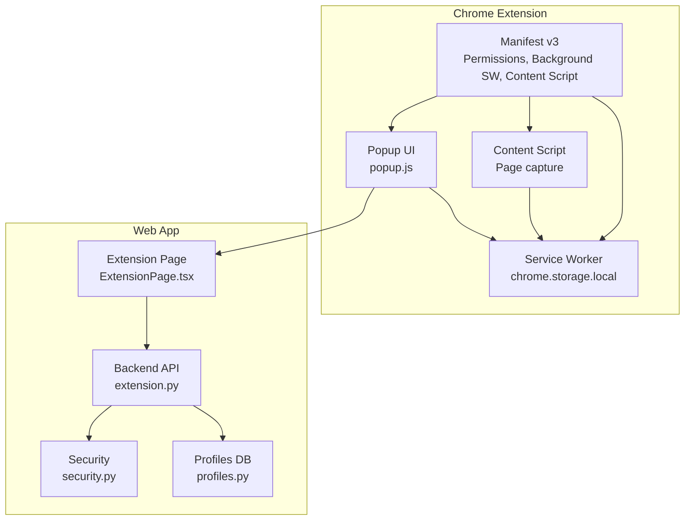
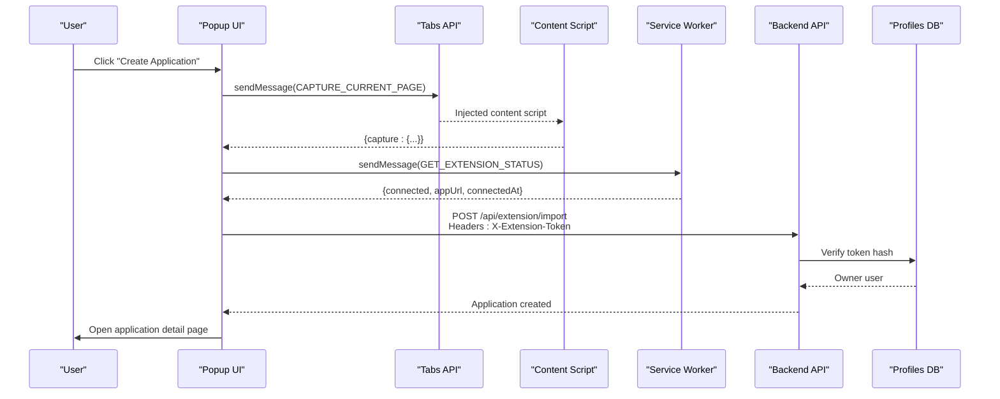
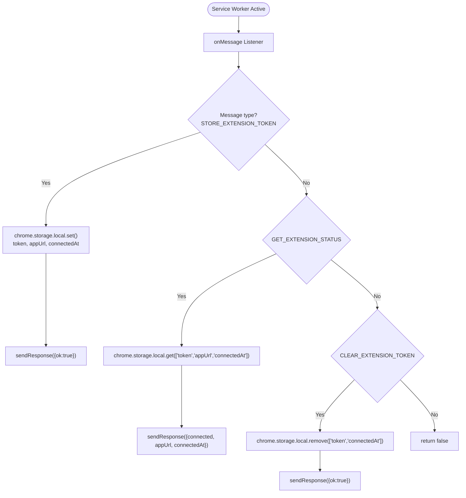
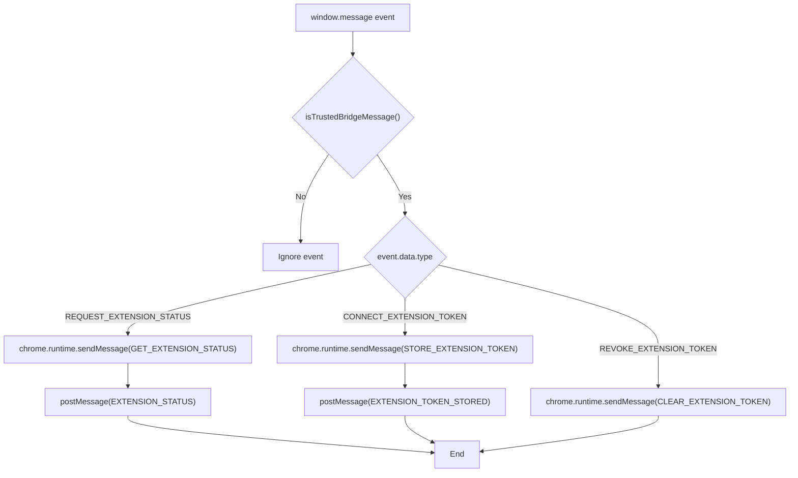
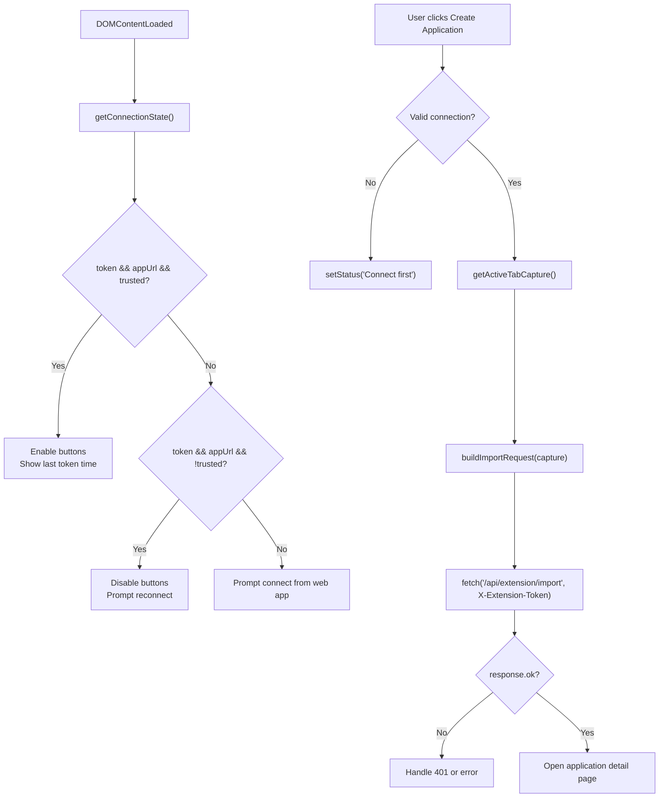
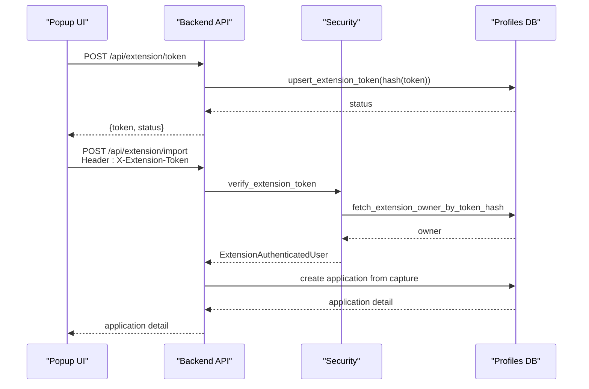
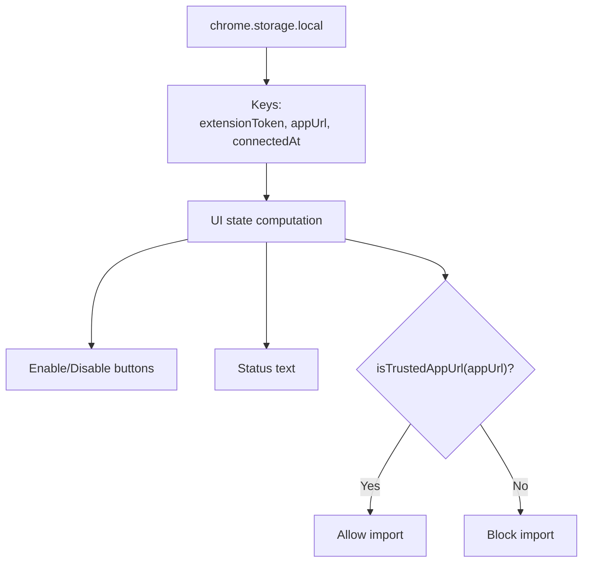
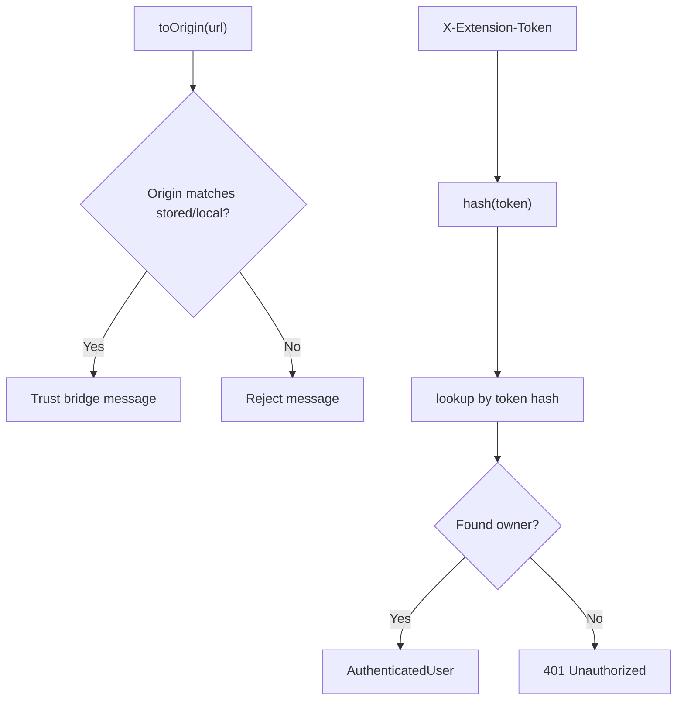
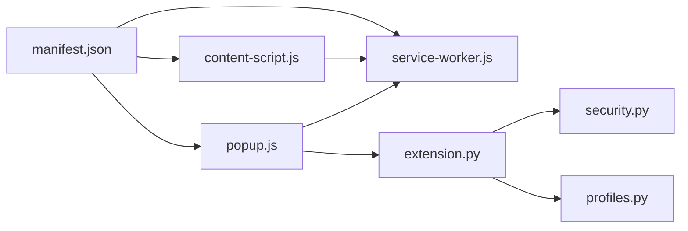

# Background Service Worker

<cite>
**Referenced Files in This Document**
- [service-worker.js](file://frontend/public/chrome-extension/service-worker.js)
- [content-script.js](file://frontend/public/chrome-extension/content-script.js)
- [popup.js](file://frontend/public/chrome-extension/popup.js)
- [manifest.json](file://frontend/public/chrome-extension/manifest.json)
- [popup.html](file://frontend/public/chrome-extension/popup.html)
- [popup.css](file://frontend/public/chrome-extension/popup.css)
- [extension.py](file://backend/app/api/extension.py)
- [security.py](file://backend/app/core/security.py)
- [profiles.py](file://backend/app/db/profiles.py)
- [ExtensionPage.tsx](file://frontend/src/routes/ExtensionPage.tsx)
- [api.ts](file://frontend/src/lib/api.ts)
</cite>

## Table of Contents
1. [Introduction](#introduction)
2. [Project Structure](#project-structure)
3. [Core Components](#core-components)
4. [Architecture Overview](#architecture-overview)
5. [Detailed Component Analysis](#detailed-component-analysis)
6. [Dependency Analysis](#dependency-analysis)
7. [Performance Considerations](#performance-considerations)
8. [Troubleshooting Guide](#troubleshooting-guide)
9. [Conclusion](#conclusion)

## Introduction
This document explains the background service worker implementation for the Chrome extension that enables capturing job posting pages and importing them into the web application. It covers the service worker lifecycle, storage management using Chrome storage APIs, message routing among content scripts, popup interface, and background processing. It also documents extension state management, update mechanisms, cache invalidation strategies, background task scheduling, notification handling, and security measures for cross-origin requests and data validation.

## Project Structure
The extension consists of:
- Manifest v3 definition declaring permissions, background service worker, action popup, and content script injection.
- A background service worker that handles extension token storage, retrieval, and clearing via Chrome storage.
- A content script that captures page metadata and forwards messages to the service worker.
- A popup UI that orchestrates connection, capture, and import flows.
- Backend API endpoints that manage extension tokens and accept captured page data.

**Diagram sources**
- [manifest.json:1-24](file://frontend/public/chrome-extension/manifest.json#L1-L24)
- [service-worker.js:1-37](file://frontend/public/chrome-extension/service-worker.js#L1-L37)
- [content-script.js:1-118](file://frontend/public/chrome-extension/content-script.js#L1-L118)
- [popup.js:1-156](file://frontend/public/chrome-extension/popup.js#L1-L156)
- [ExtensionPage.tsx:1-200](file://frontend/src/routes/ExtensionPage.tsx#L1-L200)
- [extension.py:1-141](file://backend/app/api/extension.py#L1-L141)
- [security.py:1-54](file://backend/app/core/security.py#L1-L54)
- [profiles.py:1-225](file://backend/app/db/profiles.py#L1-L225)

**Section sources**
- [manifest.json:1-24](file://frontend/public/chrome-extension/manifest.json#L1-L24)

## Core Components
- Service Worker: Listens for messages to store, retrieve, and clear the extension token and app URL, persisting them in Chrome storage.
- Content Script: Captures page metadata and validates cross-origin trust against stored app URL or local development origins.
- Popup UI: Queries current tab capture, builds import payload, posts to backend with extension token, and navigates to the created application.
- Backend API: Issues and revokes extension tokens, verifies tokens for import requests, and creates applications from captured data.
- Security Layer: Verifies extension tokens via header and hashes them for secure storage and lookup.

**Section sources**
- [service-worker.js:1-37](file://frontend/public/chrome-extension/service-worker.js#L1-L37)
- [content-script.js:1-118](file://frontend/public/chrome-extension/content-script.js#L1-L118)
- [popup.js:1-156](file://frontend/public/chrome-extension/popup.js#L1-L156)
- [extension.py:1-141](file://backend/app/api/extension.py#L1-L141)
- [security.py:1-54](file://backend/app/core/security.py#L1-L54)

## Architecture Overview
The extension uses a message-passing architecture:
- The popup triggers capture via tabs.sendMessage to the content script.
- The content script sends a message to the service worker to retrieve connection status.
- The service worker responds with stored connection state from Chrome storage.
- The popup posts the captured payload to the backend with an extension token header.
- The backend verifies the token and creates an application.

**Diagram sources**
- [popup.js:44-55](file://frontend/public/chrome-extension/popup.js#L44-L55)
- [content-script.js:60-74](file://frontend/public/chrome-extension/content-script.js#L60-L74)
- [service-worker.js:14-25](file://frontend/public/chrome-extension/service-worker.js#L14-L25)
- [extension.py:114-141](file://backend/app/api/extension.py#L114-L141)
- [security.py:34-54](file://backend/app/core/security.py#L34-L54)
- [profiles.py:86-100](file://backend/app/db/profiles.py#L86-L100)

## Detailed Component Analysis

### Service Worker Lifecycle and Storage Management
- Registration: Declared in manifest under background.service_worker.
- Activation: Runs as a module service worker; listens for runtime messages.
- Storage: Uses chrome.storage.local to persist extensionToken, appUrl, and connectedAt timestamps.
- Message Routing: Handles STORE_EXTENSION_TOKEN, GET_EXTENSION_STATUS, and CLEAR_EXTENSION_TOKEN.

**Diagram sources**
- [service-worker.js:1-37](file://frontend/public/chrome-extension/service-worker.js#L1-L37)

**Section sources**
- [service-worker.js:1-37](file://frontend/public/chrome-extension/service-worker.js#L1-L37)
- [manifest.json:8-11](file://frontend/public/chrome-extension/manifest.json#L8-L11)

### Content Script: Cross-Origin Trust and Page Capture
- Cross-origin trust: Validates that the bridge message origin matches stored appUrl origin or local dev origins.
- Page capture: Collects URL, title, visible text, meta tags, and JSON-LD scripts.
- Message routing: Sends GET_EXTENSION_STATUS to service worker and relays responses back to the web app via window.postMessage.

**Diagram sources**
- [content-script.js:76-117](file://frontend/public/chrome-extension/content-script.js#L76-L117)
- [content-script.js:40-58](file://frontend/public/chrome-extension/content-script.js#L40-L58)
- [service-worker.js:14-25](file://frontend/public/chrome-extension/service-worker.js#L14-L25)

**Section sources**
- [content-script.js:1-118](file://frontend/public/chrome-extension/content-script.js#L1-L118)
- [service-worker.js:14-25](file://frontend/public/chrome-extension/service-worker.js#L14-L25)

### Popup UI: Connection State, Capture, Import, and Navigation
- Connection state: Reads extensionToken, appUrl, connectedAt from Chrome storage and determines UI state.
- Capture: Queries active tab for CAPTURE_CURRENT_PAGE and builds import payload.
- Import: Posts to backend with X-Extension-Token header; handles 401 by clearing stored token and prompting reconnection.
- Navigation: Opens application detail page upon successful creation.

**Diagram sources**
- [popup.js:64-93](file://frontend/public/chrome-extension/popup.js#L64-L93)
- [popup.js:95-136](file://frontend/public/chrome-extension/popup.js#L95-L136)
- [popup.js:35-42](file://frontend/public/chrome-extension/popup.js#L35-L42)

**Section sources**
- [popup.js:1-156](file://frontend/public/chrome-extension/popup.js#L1-L156)

### Backend API: Token Management and Import Validation
- Token issuance: Generates a scoped extension token and stores its hash in the user’s profile.
- Token revocation: Clears the stored token hash.
- Import verification: Requires X-Extension-Token header; hashes and validates against stored token; updates last-used timestamp.
- Import endpoint: Creates an application from the captured payload.

**Diagram sources**
- [extension.py:93-112](file://backend/app/api/extension.py#L93-L112)
- [extension.py:114-141](file://backend/app/api/extension.py#L114-L141)
- [security.py:34-54](file://backend/app/core/security.py#L34-L54)
- [profiles.py:101-122](file://backend/app/db/profiles.py#L101-L122)
- [profiles.py:147-156](file://backend/app/db/profiles.py#L147-L156)

**Section sources**
- [extension.py:1-141](file://backend/app/api/extension.py#L1-L141)
- [security.py:1-54](file://backend/app/core/security.py#L1-L54)
- [profiles.py:1-225](file://backend/app/db/profiles.py#L1-L225)

### Extension State Management
- Connection status: Stored in Chrome storage keys: extensionToken, appUrl, connectedAt.
- UI state: Derived from storage values to enable/disable actions and display status.
- Cross-origin trust: Local development origins are trusted; otherwise, stored appUrl origin must match the bridge message origin.

**Diagram sources**
- [popup.js:35-42](file://frontend/public/chrome-extension/popup.js#L35-L42)
- [popup.js:64-93](file://frontend/public/chrome-extension/popup.js#L64-L93)
- [content-script.js:23-26](file://frontend/public/chrome-extension/content-script.js#L23-L26)
- [content-script.js:40-58](file://frontend/public/chrome-extension/content-script.js#L40-L58)

**Section sources**
- [popup.js:1-156](file://frontend/public/chrome-extension/popup.js#L1-L156)
- [content-script.js:1-118](file://frontend/public/chrome-extension/content-script.js#L1-L118)

### Service Worker Update Mechanisms and Cache Invalidation
- Update mechanism: Manifest v3 background service worker runs as a module; updates occur when the extension is reloaded or updated via developer mode.
- Cache invalidation: The extension does not rely on browser caches for sensitive data; it reads/write from Chrome storage for connection state and tokens. Clearing the token removes stale state.

**Section sources**
- [manifest.json:8-11](file://frontend/public/chrome-extension/manifest.json#L8-L11)
- [service-worker.js:27-33](file://frontend/public/chrome-extension/service-worker.js#L27-L33)

### Background Task Scheduling and Notification Handling
- Background tasks: The extension does not schedule recurring tasks; it reacts to user actions and bridge events.
- Notifications: The backend supports email notifications via configuration; the extension itself does not emit browser notifications.

**Section sources**
- [config.py:35-97](file://backend/app/core/config.py#L35-L97)

### Security Measures for Cross-Origin Requests and Data Validation
- Cross-origin trust: Content script validates that bridge messages originate from the stored appUrl origin or local development origins.
- Token verification: Backend requires X-Extension-Token header; token is hashed and validated against stored hash.
- Data validation: Backend validates import payloads and raises appropriate HTTP errors for malformed data.

**Diagram sources**
- [content-script.js:28-38](file://frontend/public/chrome-extension/content-script.js#L28-L38)
- [content-script.js:40-58](file://frontend/public/chrome-extension/content-script.js#L40-L58)
- [security.py:30-31](file://backend/app/core/security.py#L30-L31)
- [security.py:34-54](file://backend/app/core/security.py#L34-L54)

**Section sources**
- [content-script.js:1-118](file://frontend/public/chrome-extension/content-script.js#L1-L118)
- [security.py:1-54](file://backend/app/core/security.py#L1-L54)

## Dependency Analysis
- Manifest declares permissions and background service worker type.
- Service worker depends on Chrome storage APIs for persistence.
- Content script depends on service worker for status and on window messaging for bridge communication.
- Popup depends on tabs messaging to capture page data and on fetch to communicate with backend.
- Backend API depends on security utilities and database repository for token verification and storage.

**Diagram sources**
- [manifest.json:1-24](file://frontend/public/chrome-extension/manifest.json#L1-L24)
- [service-worker.js:1-37](file://frontend/public/chrome-extension/service-worker.js#L1-L37)
- [content-script.js:1-118](file://frontend/public/chrome-extension/content-script.js#L1-L118)
- [popup.js:1-156](file://frontend/public/chrome-extension/popup.js#L1-L156)
- [extension.py:1-141](file://backend/app/api/extension.py#L1-L141)
- [security.py:1-54](file://backend/app/core/security.py#L1-L54)
- [profiles.py:1-225](file://backend/app/db/profiles.py#L1-L225)

**Section sources**
- [manifest.json:1-24](file://frontend/public/chrome-extension/manifest.json#L1-L24)
- [extension.py:1-141](file://backend/app/api/extension.py#L1-L141)

## Performance Considerations
- Storage operations: Chrome storage is synchronous-like in callbacks; keep payloads minimal (token, appUrl, timestamps).
- Content capture: Limit meta and JSON-LD collection sizes to reduce overhead.
- Network calls: Batch import requests and handle errors gracefully to avoid repeated retries.

## Troubleshooting Guide
- Extension not connecting:
  - Ensure the web app is open locally and the Extension page is loaded.
  - Confirm the popup indicates “Connected” and displays last token issuance time.
- Import fails with 401:
  - The extension token has expired; revoke and reissue from the Extension page.
- Cross-origin bridge message rejected:
  - Verify the stored appUrl origin matches the bridge message origin or use local development origins.
- No active tab available:
  - The popup throws an error when no active tab is found; switch to a tab and retry.

**Section sources**
- [popup.js:118-126](file://frontend/public/chrome-extension/popup.js#L118-L126)
- [popup.js:46-48](file://frontend/public/chrome-extension/popup.js#L46-L48)
- [content-script.js:40-58](file://frontend/public/chrome-extension/content-script.js#L40-L58)

## Conclusion
The extension’s background service worker provides a minimal, secure, and reliable bridge between the web app and the browser. It persists connection state in Chrome storage, validates cross-origin messages, and coordinates import flows with the backend. The design emphasizes explicit trust boundaries, token hashing, and clear error handling to ensure a robust user experience.