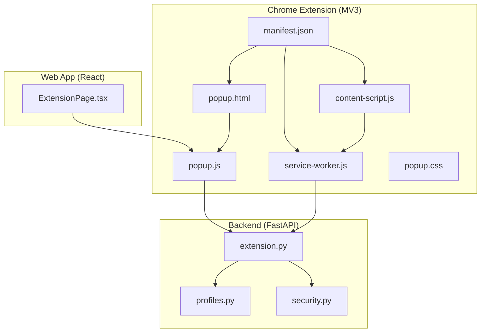
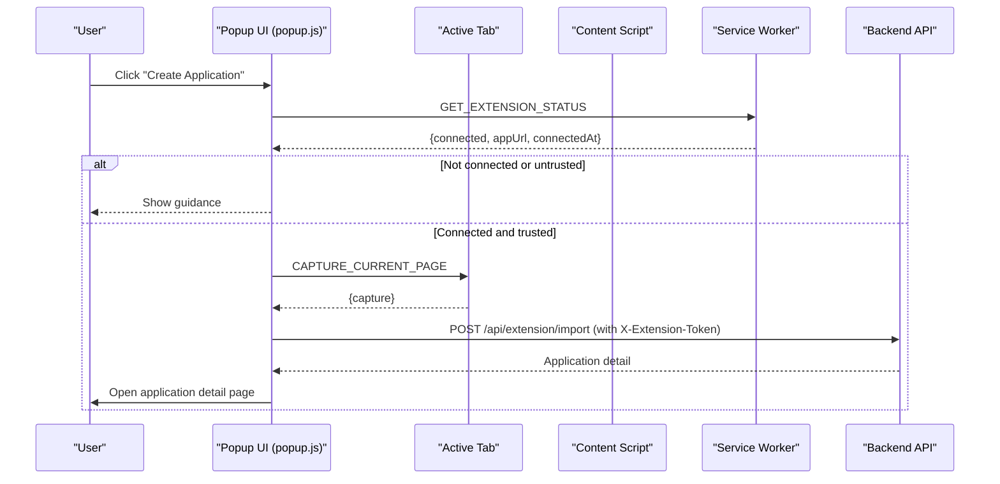
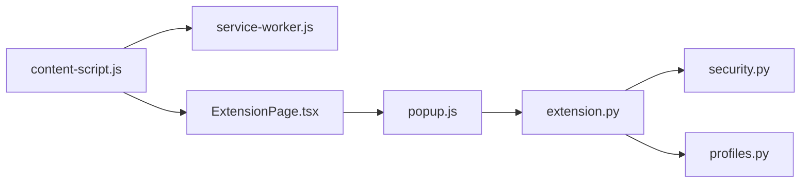
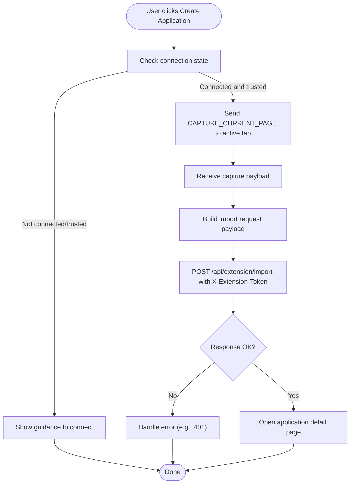

# Chrome Extension

<cite>
**Referenced Files in This Document**
- [manifest.json](file://frontend/public/chrome-extension/manifest.json)
- [content-script.js](file://frontend/public/chrome-extension/content-script.js)
- [service-worker.js](file://frontend/public/chrome-extension/service-worker.js)
- [popup.js](file://frontend/public/chrome-extension/popup.js)
- [popup.html](file://frontend/public/chrome-extension/popup.html)
- [popup.css](file://frontend/public/chrome-extension/popup.css)
- [ExtensionPage.tsx](file://frontend/src/routes/ExtensionPage.tsx)
- [extension.py](file://backend/app/api/extension.py)
- [security.py](file://backend/app/core/security.py)
- [profiles.py](file://backend/app/db/profiles.py)
- [extension-bridge.test.ts](file://frontend/src/test/extension-bridge.test.ts)
- [extension-popup.test.ts](file://frontend/src/test/extension-popup.test.ts)
- [chrome-extension-popup.d.ts](file://frontend/src/types/chrome-extension-popup.d.ts)
</cite>

## Table of Contents
1. [Introduction](#introduction)
2. [Project Structure](#project-structure)
3. [Core Components](#core-components)
4. [Architecture Overview](#architecture-overview)
5. [Detailed Component Analysis](#detailed-component-analysis)
6. [Dependency Analysis](#dependency-analysis)
7. [Performance Considerations](#performance-considerations)
8. [Troubleshooting Guide](#troubleshooting-guide)
9. [Installation and Debugging](#installation-and-debugging)
10. [Security Model and Validation](#security-model-and-validation)
11. [Job Capture Workflow](#job-capture-workflow)
12. [API Usage Examples](#api-usage-examples)
13. [Conclusion](#conclusion)

## Introduction
This document describes the Chrome Extension implementation for the AI Resume Builder project. It covers the MV3 architecture, including content script injection, background service worker, popup interface, and message-passing protocols. It explains the MV3 security model, permission management, and secure cross-origin communication. It documents the job capture functionality for extracting job details from job board pages, validating URLs, and communicating with the web application. It also details the popup interface, user interaction handling, connection management, and import workflow. Finally, it outlines testing strategies, security validation mechanisms, installation instructions, debugging procedures, troubleshooting, and integration examples.

## Project Structure
The extension is implemented under the frontend public directory and integrates with the React web application and FastAPI backend.

**Diagram sources**
- [manifest.json:1-24](file://frontend/public/chrome-extension/manifest.json#L1-L24)
- [content-script.js:1-118](file://frontend/public/chrome-extension/content-script.js#L1-L118)
- [service-worker.js:1-37](file://frontend/public/chrome-extension/service-worker.js#L1-L37)
- [popup.html:1-22](file://frontend/public/chrome-extension/popup.html#L1-L22)
- [popup.js:1-156](file://frontend/public/chrome-extension/popup.js#L1-L156)
- [ExtensionPage.tsx:1-200](file://frontend/src/routes/ExtensionPage.tsx#L1-L200)
- [extension.py:1-141](file://backend/app/api/extension.py#L1-L141)
- [security.py:1-54](file://backend/app/core/security.py#L1-L54)
- [profiles.py:1-225](file://backend/app/db/profiles.py#L1-L225)

**Section sources**
- [manifest.json:1-24](file://frontend/public/chrome-extension/manifest.json#L1-L24)
- [popup.html:1-22](file://frontend/public/chrome-extension/popup.html#L1-L22)
- [popup.css:1-61](file://frontend/public/chrome-extension/popup.css#L1-L61)

## Core Components
- Manifest v3 configuration defines permissions, host permissions, background service worker, action popup, and content script injection.
- Content script captures page metadata and JSON-LD, validates bridge messages, and exchanges status and tokens with the extension via message passing.
- Background service worker manages extension token storage and status queries.
- Popup UI handles connection state, user actions, and import requests to the backend.
- Web app Extension page coordinates token issuance, bridge messaging, and revocation.
- Backend APIs manage extension token lifecycle and import processing with MV3 token verification.

**Section sources**
- [manifest.json:6-22](file://frontend/public/chrome-extension/manifest.json#L6-L22)
- [content-script.js:40-117](file://frontend/public/chrome-extension/content-script.js#L40-L117)
- [service-worker.js:1-37](file://frontend/public/chrome-extension/service-worker.js#L1-L37)
- [popup.js:35-155](file://frontend/public/chrome-extension/popup.js#L35-L155)
- [ExtensionPage.tsx:26-200](file://frontend/src/routes/ExtensionPage.tsx#L26-L200)
- [extension.py:27-141](file://backend/app/api/extension.py#L27-L141)

## Architecture Overview
The extension follows MV3 with a content script injected into all tabs, a background service worker for persistent state, and a popup UI for user interaction. Cross-origin communication is mediated through trusted origins and secure message passing.

**Diagram sources**
- [popup.js:35-155](file://frontend/public/chrome-extension/popup.js#L35-L155)
- [content-script.js:60-74](file://frontend/public/chrome-extension/content-script.js#L60-L74)
- [service-worker.js:14-25](file://frontend/public/chrome-extension/service-worker.js#L14-L25)
- [extension.py:114-141](file://backend/app/api/extension.py#L114-L141)

## Detailed Component Analysis

### Manifest v3 Configuration
- Permissions include activeTab, storage, and tabs.
- Host permissions grant access to all URLs.
- Background service worker is declared as a module.
- Action popup points to the extension’s HTML.
- Content script runs at document_start for all URLs.

**Section sources**
- [manifest.json:6-22](file://frontend/public/chrome-extension/manifest.json#L6-L22)

### Content Script
Responsibilities:
- Listens for CAPTURE_CURRENT_PAGE messages to extract page metadata and JSON-LD.
- Validates bridge messages using trusted origins and stored appUrl.
- Handles REQUEST_EXTENSION_STATUS, CONNECT_EXTENSION_TOKEN, and REVOKE_EXTENSION_TOKEN via window messaging.
- Communicates with the service worker using chrome.runtime.sendMessage.

Key behaviors:
- Collects meta tags and JSON-LD up to limits.
- Uses chrome.storage.local to validate trusted origins.
- Enforces origin checks for bridge messages.

**Section sources**
- [content-script.js:1-118](file://frontend/public/chrome-extension/content-script.js#L1-L118)

### Background Service Worker
Responsibilities:
- Stores extension tokens and appUrl in chrome.storage.local.
- Returns connection status based on stored values.
- Clears tokens upon request.

**Section sources**
- [service-worker.js:1-37](file://frontend/public/chrome-extension/service-worker.js#L1-L37)

### Popup Interface
Responsibilities:
- Determines connection state from chrome.storage.local.
- Builds import request payload from captured page data.
- Sends import request to backend with X-Extension-Token header.
- Opens application detail page after successful import.
- Handles opening the web app’s Extension page.

UI and UX:
- Disabled/enabled buttons based on connection state.
- Status messages guide the user.
- Localhost origins are considered trusted for connection.

**Section sources**
- [popup.js:1-156](file://frontend/public/chrome-extension/popup.js#L1-L156)
- [popup.html:1-22](file://frontend/public/chrome-extension/popup.html#L1-L22)
- [popup.css:1-61](file://frontend/public/chrome-extension/popup.css#L1-L61)

### Web App Extension Page
Responsibilities:
- Issues extension tokens via backend API.
- Posts CONNECT_EXTENSION_TOKEN and REVOKE_EXTENSION_TOKEN messages to the extension bridge.
- Requests EXTENSION_STATUS from the extension and displays connection state.
- Provides instructions for connecting and importing.

**Section sources**
- [ExtensionPage.tsx:26-200](file://frontend/src/routes/ExtensionPage.tsx#L26-L200)

### Backend Extension API
Responsibilities:
- Issue and revoke extension tokens scoped to the authenticated user.
- Verify extension tokens via X-Extension-Token header.
- Import captured job data and create applications.

Security:
- Tokens are hashed server-side and stored in the database.
- Token verification updates last-used timestamps.

**Section sources**
- [extension.py:27-141](file://backend/app/api/extension.py#L27-L141)
- [security.py:25-54](file://backend/app/core/security.py#L25-L54)
- [profiles.py:70-157](file://backend/app/db/profiles.py#L70-L157)

## Dependency Analysis
The extension components depend on each other through message passing and storage. The web app depends on the backend for token management and import processing.

**Diagram sources**
- [content-script.js:60-117](file://frontend/public/chrome-extension/content-script.js#L60-L117)
- [service-worker.js:1-37](file://frontend/public/chrome-extension/service-worker.js#L1-L37)
- [popup.js:35-155](file://frontend/public/chrome-extension/popup.js#L35-L155)
- [ExtensionPage.tsx:26-200](file://frontend/src/routes/ExtensionPage.tsx#L26-L200)
- [extension.py:27-141](file://backend/app/api/extension.py#L27-L141)
- [security.py:25-54](file://backend/app/core/security.py#L25-L54)
- [profiles.py:70-157](file://backend/app/db/profiles.py#L70-L157)

**Section sources**
- [content-script.js:60-117](file://frontend/public/chrome-extension/content-script.js#L60-L117)
- [service-worker.js:1-37](file://frontend/public/chrome-extension/service-worker.js#L1-L37)
- [popup.js:35-155](file://frontend/public/chrome-extension/popup.js#L35-L155)
- [ExtensionPage.tsx:26-200](file://frontend/src/routes/ExtensionPage.tsx#L26-L200)
- [extension.py:27-141](file://backend/app/api/extension.py#L27-L141)
- [security.py:25-54](file://backend/app/core/security.py#L25-L54)
- [profiles.py:70-157](file://backend/app/db/profiles.py#L70-L157)

## Performance Considerations
- Content script extraction caps the number of meta tags and JSON-LD blocks to limit overhead.
- Service worker operations use asynchronous storage APIs to avoid blocking the UI.
- Popup import requests include only necessary fields to minimize payload size.
- Using document_start for content script injection ensures early capture without delaying page load excessively.

[No sources needed since this section provides general guidance]

## Troubleshooting Guide
Common issues and resolutions:
- Extension not detected: Ensure the extension is loaded as an unpacked extension from the correct directory and that the web app is open in Chrome.
- Untrusted app URL: The extension only trusts localhost origins; verify the web app origin matches trusted values.
- Import fails with 401: The extension token may have expired; revoke and reconnect from the web app.
- No active tab available: The popup requires an active tab; switch to a job board tab and retry.
- Bridge message ignored: Messages must originate from the trusted web app origin and include proper payload structure.

**Section sources**
- [popup.js:88-135](file://frontend/public/chrome-extension/popup.js#L88-L135)
- [content-script.js:40-58](file://frontend/public/chrome-extension/content-script.js#L40-L58)
- [extension-bridge.test.ts:34-96](file://frontend/src/test/extension-bridge.test.ts#L34-L96)

## Installation and Debugging
Installation steps:
- Load the extension as an unpacked extension from the directory containing manifest.json.
- Keep the web app open in Chrome and navigate to the Extension page.
- Issue a connection token from the web app and confirm the extension connects.

Debugging procedures:
- Use the browser console to inspect message events and runtime logs.
- Verify chrome.storage.local contains the expected token and appUrl.
- Confirm the backend receives X-Extension-Token and responds appropriately.

[No sources needed since this section provides general guidance]

## Security Model and Validation
Security measures implemented:
- MV3 permissions are minimal: activeTab, storage, tabs.
- Host permissions allow all URLs for job board scraping.
- Content script validates bridge messages against trusted origins and stored appUrl.
- Service worker stores tokens securely in chrome.storage.local.
- Backend verifies extension tokens via X-Extension-Token header and hashes tokens server-side.
- Origin checks ensure messages cannot be spoofed by untrusted origins.

Validation mechanisms:
- Trusted origins include localhost development servers.
- First-time connections accept localhost origins for setup.
- Stored appUrl must match the event origin for subsequent communications.

**Section sources**
- [manifest.json:6-7](file://frontend/public/chrome-extension/manifest.json#L6-L7)
- [content-script.js:23-58](file://frontend/public/chrome-extension/content-script.js#L23-L58)
- [service-worker.js:3-11](file://frontend/public/chrome-extension/service-worker.js#L3-L11)
- [security.py:30-54](file://backend/app/core/security.py#L30-L54)
- [profiles.py:101-157](file://backend/app/db/profiles.py#L101-L157)

## Job Capture Workflow
The extension captures job details from job board pages and sends them to the backend for import.

**Diagram sources**
- [popup.js:95-155](file://frontend/public/chrome-extension/popup.js#L95-L155)
- [content-script.js:60-74](file://frontend/public/chrome-extension/content-script.js#L60-L74)
- [extension.py:114-141](file://backend/app/api/extension.py#L114-L141)

**Section sources**
- [popup.js:95-155](file://frontend/public/chrome-extension/popup.js#L95-L155)
- [content-script.js:16-21](file://frontend/public/chrome-extension/content-script.js#L16-L21)
- [content-script.js:60-74](file://frontend/public/chrome-extension/content-script.js#L60-L74)
- [extension.py:114-141](file://backend/app/api/extension.py#L114-L141)

## API Usage Examples
Integration patterns:
- Issuing an extension token from the web app and broadcasting it to the extension bridge.
- Requesting extension status from the extension bridge.
- Revoking extension access from the web app.
- Sending import requests with X-Extension-Token header.

Example references:
- Token issuance and bridge messaging: [ExtensionPage.tsx:74-100](file://frontend/src/routes/ExtensionPage.tsx#L74-L100)
- Status polling and messaging: [ExtensionPage.tsx:35-72](file://frontend/src/routes/ExtensionPage.tsx#L35-L72)
- Revocation and bridge messaging: [ExtensionPage.tsx:102-125](file://frontend/src/routes/ExtensionPage.tsx#L102-L125)
- Import request construction: [popup.js:1-11](file://frontend/public/chrome-extension/popup.js#L1-L11)
- Backend token verification: [security.py:34-54](file://backend/app/core/security.py#L34-L54)

**Section sources**
- [ExtensionPage.tsx:35-125](file://frontend/src/routes/ExtensionPage.tsx#L35-L125)
- [popup.js:1-11](file://frontend/public/chrome-extension/popup.js#L1-L11)
- [security.py:34-54](file://backend/app/core/security.py#L34-L54)

## Testing Strategies
Testing approaches:
- Unit tests validate bridge message filtering and trusted origin handling in the content script.
- Unit tests validate payload building and origin trust logic in the popup helpers.
- Type definitions ensure correct signatures for exported popup helpers.

References:
- Bridge message tests: [extension-bridge.test.ts:34-96](file://frontend/src/test/extension-bridge.test.ts#L34-L96)
- Popup helper tests: [extension-popup.test.ts:9-30](file://frontend/src/test/extension-popup.test.ts#L9-L30)
- Popup helper types: [chrome-extension-popup.d.ts:1-20](file://frontend/src/types/chrome-extension-popup.d.ts#L1-L20)

**Section sources**
- [extension-bridge.test.ts:34-96](file://frontend/src/test/extension-bridge.test.ts#L34-L96)
- [extension-popup.test.ts:9-30](file://frontend/src/test/extension-popup.test.ts#L9-L30)
- [chrome-extension-popup.d.ts:1-20](file://frontend/src/types/chrome-extension-popup.d.ts#L1-L20)

## Conclusion
The Chrome Extension integrates seamlessly with the web application and backend to enable secure, MV3-compliant job capture and import. Its architecture leverages content script injection, a background service worker, and a popup UI, all protected by strict origin validation and token-based authentication. The testing suite ensures robust behavior for bridge messaging and payload handling. Following the installation and debugging procedures outlined here will help users and developers deploy and operate the extension effectively.