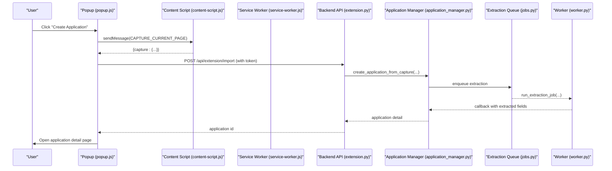
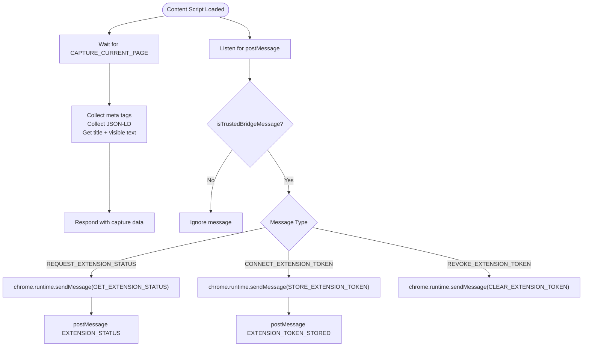
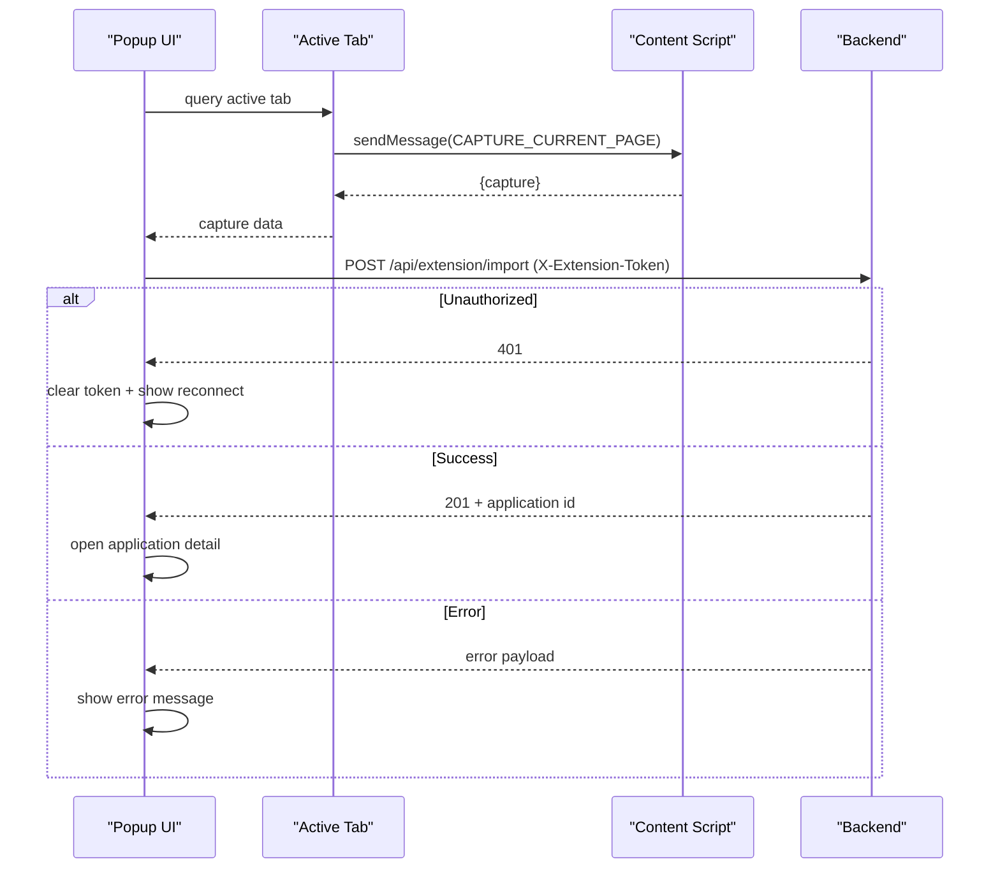
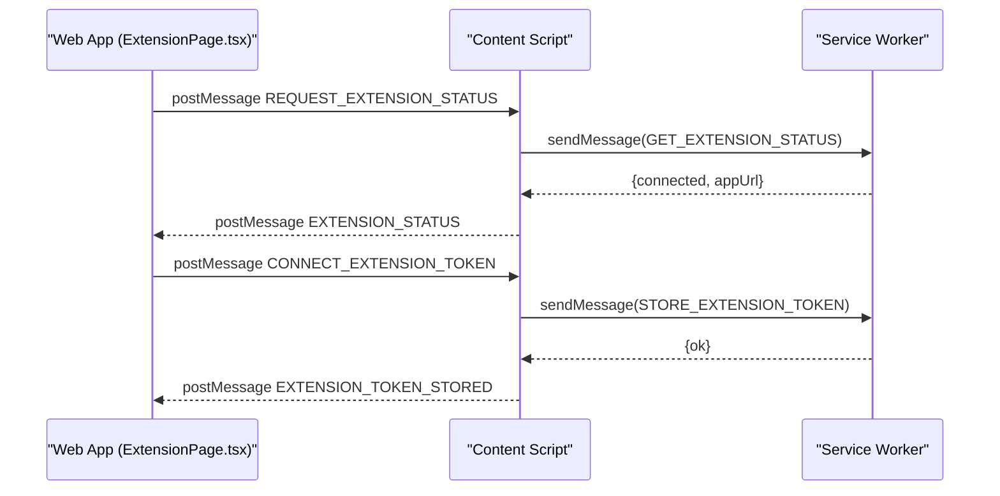
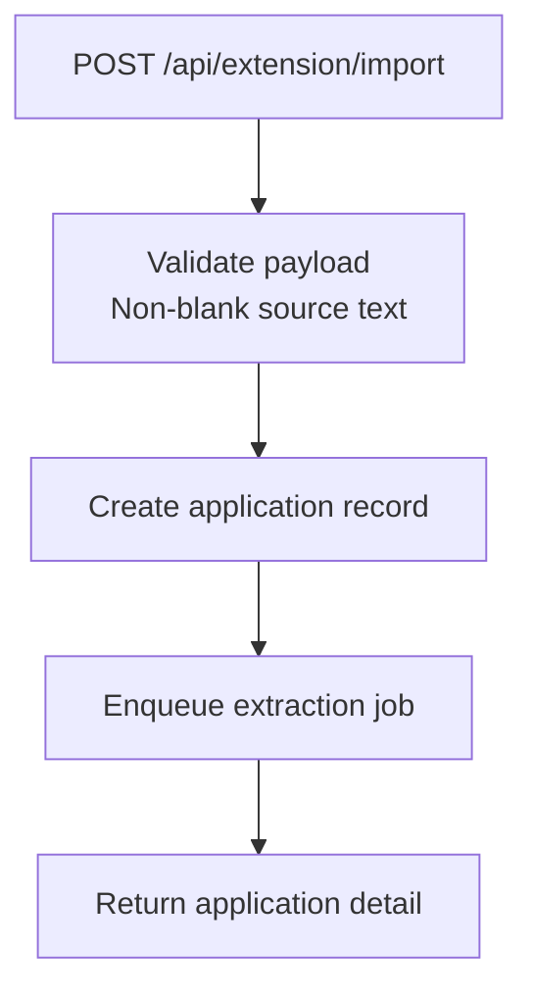
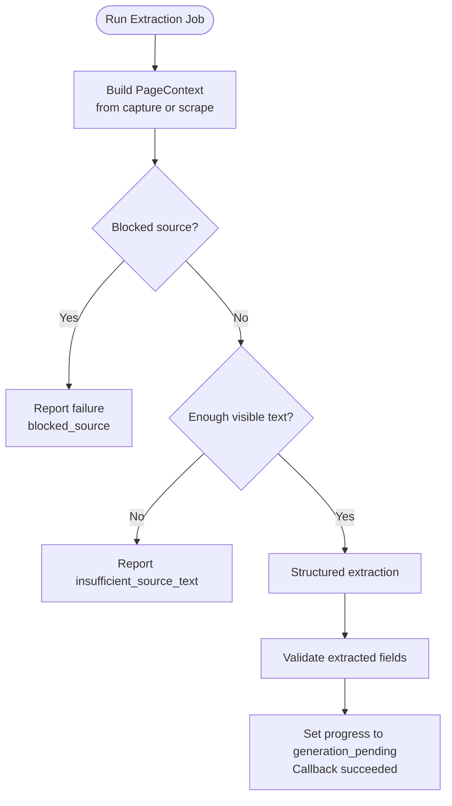
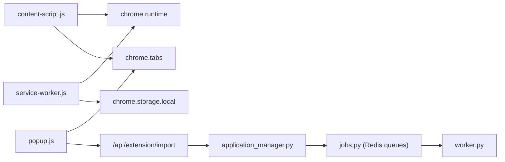

# Content Script Implementation

<cite>
**Referenced Files in This Document**
- [content-script.js](file://frontend/public/chrome-extension/content-script.js)
- [manifest.json](file://frontend/public/chrome-extension/manifest.json)
- [popup.js](file://frontend/public/chrome-extension/popup.js)
- [popup.html](file://frontend/public/chrome-extension/popup.html)
- [popup.css](file://frontend/public/chrome-extension/popup.css)
- [service-worker.js](file://frontend/public/chrome-extension/service-worker.js)
- [extension.py](file://backend/app/api/extension.py)
- [application_manager.py](file://backend/app/services/application_manager.py)
- [jobs.py](file://backend/app/services/jobs.py)
- [worker.py](file://agents/worker.py)
- [ExtensionPage.tsx](file://frontend/src/routes/ExtensionPage.tsx)
</cite>

## Table of Contents
1. [Introduction](#introduction)
2. [Project Structure](#project-structure)
3. [Core Components](#core-components)
4. [Architecture Overview](#architecture-overview)
5. [Detailed Component Analysis](#detailed-component-analysis)
6. [Dependency Analysis](#dependency-analysis)
7. [Performance Considerations](#performance-considerations)
8. [Troubleshooting Guide](#troubleshooting-guide)
9. [Conclusion](#conclusion)
10. [Appendices](#appendices)

## Introduction
This document explains the Chrome extension content script implementation that captures job board pages and extracts structured job details for import into the web application. It covers:
- How the content script runs on job board pages and captures page metadata
- How the popup triggers capture and sends data to the backend
- The message-passing protocol between the web app and the extension
- Cross-origin security and content script isolation
- Supported job board formats and extraction patterns
- Error handling and fallback mechanisms

## Project Structure
The extension consists of:
- Manifest declaring permissions, host permissions, background service worker, and content script injection
- Content script that captures page data and communicates with the background script and popup
- Popup UI and logic for importing captured data into the backend
- Background service worker for storing tokens and status
- Web app route that bridges the extension and the web app via postMessage
- Backend API that validates and ingests captured data, enqueues extraction jobs, and orchestrates worker processing

```mermaid
graph TB
subgraph "Browser"
CS["Content Script<br/>content-script.js"]
SW["Service Worker<br/>service-worker.js"]
POP["Popup UI<br/>popup.html + popup.js"]
end
subgraph "Web App"
EP["Extension Page<br/>ExtensionPage.tsx"]
end
subgraph "Backend"
API["Extension API<br/>extension.py"]
AM["Application Manager<br/>application_manager.py"]
JOB["Jobs Queues<br/>jobs.py"]
WRK["Workers<br/>worker.py"]
end
POP --> |"chrome.tabs.sendMessage"| CS
CS --> |"chrome.runtime.sendMessage"| SW
EP < --> |"postMessage bridge"| CS
POP --> |"HTTP POST /api/extension/import"| API
API --> AM
AM --> JOB
JOB --> WRK
```

**Diagram sources**
- [manifest.json:16-22](file://frontend/public/chrome-extension/manifest.json#L16-L22)
- [content-script.js:60-74](file://frontend/public/chrome-extension/content-script.js#L60-L74)
- [service-worker.js:1-37](file://frontend/public/chrome-extension/service-worker.js#L1-L37)
- [popup.js:44-55](file://frontend/public/chrome-extension/popup.js#L44-L55)
- [ExtensionPage.tsx:35-72](file://frontend/src/routes/ExtensionPage.tsx#L35-L72)
- [extension.py:114-141](file://backend/app/api/extension.py#L114-L141)
- [application_manager.py:226-246](file://backend/app/services/application_manager.py#L226-L246)
- [jobs.py:16-42](file://backend/app/services/jobs.py#L16-L42)
- [worker.py:526-667](file://agents/worker.py#L526-L667)

**Section sources**
- [manifest.json:1-24](file://frontend/public/chrome-extension/manifest.json#L1-L24)
- [content-script.js:1-118](file://frontend/public/chrome-extension/content-script.js#L1-L118)
- [popup.js:1-156](file://frontend/public/chrome-extension/popup.js#L1-L156)
- [service-worker.js:1-37](file://frontend/public/chrome-extension/service-worker.js#L1-L37)
- [ExtensionPage.tsx:1-200](file://frontend/src/routes/ExtensionPage.tsx#L1-L200)
- [extension.py:1-141](file://backend/app/api/extension.py#L1-L141)
- [application_manager.py:225-424](file://backend/app/services/application_manager.py#L225-L424)
- [jobs.py:1-138](file://backend/app/services/jobs.py#L1-L138)
- [worker.py:1-1236](file://agents/worker.py#L1-L1236)

## Core Components
- Content script: Collects page metadata (title, visible text, meta tags, JSON-LD), responds to capture requests, and exchanges messages with the web app and background script
- Popup: Captures the active tab, builds an import payload, and posts it to the backend
- Service worker: Stores and retrieves extension token and app URL, exposes status to the content script
- Extension page: Bridges the web app and extension via postMessage for connection and token storage
- Backend API: Validates and persists captured data, enqueues extraction jobs, and returns created application details
- Workers: Scrape pages, detect blocked sources, extract structured fields, and update progress

**Section sources**
- [content-script.js:1-118](file://frontend/public/chrome-extension/content-script.js#L1-L118)
- [popup.js:1-156](file://frontend/public/chrome-extension/popup.js#L1-L156)
- [service-worker.js:1-37](file://frontend/public/chrome-extension/service-worker.js#L1-L37)
- [ExtensionPage.tsx:1-200](file://frontend/src/routes/ExtensionPage.tsx#L1-L200)
- [extension.py:114-141](file://backend/app/api/extension.py#L114-L141)
- [worker.py:526-667](file://agents/worker.py#L526-L667)

## Architecture Overview
The end-to-end flow:
1. User clicks the extension popup to capture the current tab
2. Popup queries the active tab and requests the content script to capture page data
3. Content script collects metadata and returns it to the popup
4. Popup posts the payload to the backend with an extension token header
5. Backend validates and persists the capture, enqueues an extraction job
6. Worker scrapes or uses captured context, detects blocked sources, and extracts structured fields
7. Progress and results are communicated back to the UI



**Diagram sources**
- [popup.js:44-55](file://frontend/public/chrome-extension/popup.js#L44-L55)
- [content-script.js:60-74](file://frontend/public/chrome-extension/content-script.js#L60-L74)
- [service-worker.js:14-25](file://frontend/public/chrome-extension/service-worker.js#L14-L25)
- [extension.py:114-141](file://backend/app/api/extension.py#L114-L141)
- [application_manager.py:226-246](file://backend/app/services/application_manager.py#L226-L246)
- [jobs.py:16-42](file://backend/app/services/jobs.py#L16-L42)
- [worker.py:526-667](file://agents/worker.py#L526-L667)

## Detailed Component Analysis

### Content Script: Page Capture and Messaging
- Injection: Runs on all URLs at document_start via manifest
- Capture mechanism:
  - Collects meta tags (up to a limit) and JSON-LD blocks
  - Gathers page title and visible text
  - Returns structured capture data upon receiving CAPTURE_CURRENT_PAGE
- Cross-origin bridge:
  - Listens for postMessage events from the web app
  - Validates origin against stored app URL and local dev origins
  - Responds with extension status or confirms token storage
- Storage and status:
  - Uses chrome.storage.local to persist token and app URL
  - Exposes GET_EXTENSION_STATUS to the content script



**Diagram sources**
- [content-script.js:60-74](file://frontend/public/chrome-extension/content-script.js#L60-L74)
- [content-script.js:76-117](file://frontend/public/chrome-extension/content-script.js#L76-L117)
- [content-script.js:40-58](file://frontend/public/chrome-extension/content-script.js#L40-L58)
- [service-worker.js:14-33](file://frontend/public/chrome-extension/service-worker.js#L14-L33)

**Section sources**
- [manifest.json:16-22](file://frontend/public/chrome-extension/manifest.json#L16-L22)
- [content-script.js:1-118](file://frontend/public/chrome-extension/content-script.js#L1-L118)
- [service-worker.js:1-37](file://frontend/public/chrome-extension/service-worker.js#L1-L37)

### Popup: Import Workflow and Security
- Active tab capture:
  - Queries the active tab and requests page capture
  - Validates response and throws if missing
- Payload construction:
  - Builds a standardized import request with URL, title, visible text, meta, and JSON-LD
- Token-based import:
  - Sends X-Extension-Token header with the request
  - Handles 401 by clearing stored token and prompting reconnection
  - Handles non-OK responses by parsing error details
- UI state:
  - Enables/disables buttons based on connection state
  - Opens application detail page after successful creation



**Diagram sources**
- [popup.js:44-55](file://frontend/public/chrome-extension/popup.js#L44-L55)
- [popup.js:95-136](file://frontend/public/chrome-extension/popup.js#L95-L136)
- [extension.py:114-141](file://backend/app/api/extension.py#L114-L141)

**Section sources**
- [popup.js:1-156](file://frontend/public/chrome-extension/popup.js#L1-L156)
- [popup.html:1-22](file://frontend/public/chrome-extension/popup.html#L1-L22)
- [popup.css:1-61](file://frontend/public/chrome-extension/popup.css#L1-L61)

### Extension Bridge: Web App to Extension
- The web app listens for postMessage events from the extension
- It requests status and stores tokens by sending messages to the content script
- The content script validates the bridge and interacts with the service worker to persist state



**Diagram sources**
- [ExtensionPage.tsx:35-72](file://frontend/src/routes/ExtensionPage.tsx#L35-L72)
- [content-script.js:76-117](file://frontend/public/chrome-extension/content-script.js#L76-L117)
- [service-worker.js:14-12](file://frontend/public/chrome-extension/service-worker.js#L14-L12)

**Section sources**
- [ExtensionPage.tsx:1-200](file://frontend/src/routes/ExtensionPage.tsx#L1-L200)
- [content-script.js:40-58](file://frontend/public/chrome-extension/content-script.js#L40-L58)
- [service-worker.js:1-37](file://frontend/public/chrome-extension/service-worker.js#L1-L37)

### Backend API: Validation and Extraction Enqueue
- Validates incoming payload and ensures non-blank source text
- Creates an application record and enqueues an extraction job
- Returns the created application detail for redirect



**Diagram sources**
- [extension.py:41-65](file://backend/app/api/extension.py#L41-L65)
- [extension.py:114-141](file://backend/app/api/extension.py#L114-L141)
- [application_manager.py:226-246](file://backend/app/services/application_manager.py#L226-L246)
- [jobs.py:16-42](file://backend/app/services/jobs.py#L16-L42)

**Section sources**
- [extension.py:1-141](file://backend/app/api/extension.py#L1-L141)
- [application_manager.py:225-424](file://backend/app/services/application_manager.py#L225-L424)
- [jobs.py:1-138](file://backend/app/services/jobs.py#L1-L138)

### Worker: Extraction Patterns and Blocked Site Detection
- Supported origins and reference ID detection:
  - Origin mapping for LinkedIn, Indeed, Google Jobs, Glassdoor, ZipRecruiter, Monster, Dice
  - Reference ID extraction from query parameters and URL patterns
- Blocked site detection:
  - Detects Cloudflare and Indeed blocking indicators
  - Reports failure with provider and reference ID
- Extraction pipeline:
  - Builds PageContext from either scraped page or captured data
  - Runs structured extraction and validation
  - Updates progress and posts callbacks to the backend



**Diagram sources**
- [worker.py:526-667](file://agents/worker.py#L526-L667)
- [worker.py:162-197](file://agents/worker.py#L162-L197)
- [worker.py:199-238](file://agents/worker.py#L199-L238)
- [worker.py:412-424](file://agents/worker.py#L412-L424)

**Section sources**
- [worker.py:26-51](file://agents/worker.py#L26-L51)
- [worker.py:162-197](file://agents/worker.py#L162-L197)
- [worker.py:199-238](file://agents/worker.py#L199-L238)
- [worker.py:526-667](file://agents/worker.py#L526-L667)

## Dependency Analysis
- Content script depends on:
  - chrome.runtime for messaging and storage
  - chrome.tabs for capturing active tab
  - window.postMessage for bridge communication
- Popup depends on:
  - chrome.tabs.sendMessage to trigger capture
  - fetch with X-Extension-Token header to import
- Service worker depends on:
  - chrome.storage.local for token persistence
  - chrome.runtime for message handling
- Backend depends on:
  - ApplicationManager to create records and enqueue jobs
  - Redis-backed queues for asynchronous processing
  - Worker to perform extraction and validation



**Diagram sources**
- [content-script.js:60-74](file://frontend/public/chrome-extension/content-script.js#L60-L74)
- [popup.js:44-55](file://frontend/public/chrome-extension/popup.js#L44-L55)
- [service-worker.js:14-33](file://frontend/public/chrome-extension/service-worker.js#L14-L33)
- [extension.py:114-141](file://backend/app/api/extension.py#L114-L141)
- [application_manager.py:226-246](file://backend/app/services/application_manager.py#L226-L246)
- [jobs.py:16-42](file://backend/app/services/jobs.py#L16-L42)
- [worker.py:526-667](file://agents/worker.py#L526-L667)

**Section sources**
- [manifest.json:6-11](file://frontend/public/chrome-extension/manifest.json#L6-L11)
- [content-script.js:1-118](file://frontend/public/chrome-extension/content-script.js#L1-L118)
- [popup.js:1-156](file://frontend/public/chrome-extension/popup.js#L1-L156)
- [service-worker.js:1-37](file://frontend/public/chrome-extension/service-worker.js#L1-L37)
- [extension.py:1-141](file://backend/app/api/extension.py#L1-L141)
- [application_manager.py:225-424](file://backend/app/services/application_manager.py#L225-L424)
- [jobs.py:1-138](file://backend/app/services/jobs.py#L1-L138)
- [worker.py:1-1236](file://agents/worker.py#L1-L1236)

## Performance Considerations
- Content script limits:
  - Limits number of meta tags and JSON-LD entries to reduce overhead
  - Truncates visible text to a reasonable size for extraction
- Worker limits:
  - Limits visible text length and early exits for insufficient text
  - Uses timeouts for scraping and generation to prevent long hangs
- Queueing:
  - Uses Redis-backed ARQ queues to distribute work asynchronously

[No sources needed since this section provides general guidance]

## Troubleshooting Guide
Common issues and resolutions:
- Extension not connected:
  - Verify token and app URL are present and trusted
  - Reconnect from the web app’s Extension page
- Import fails with 401:
  - Token expired; reconnect from the web app
- Import fails with non-OK response:
  - Inspect returned error payload and retry
- Extraction fails due to blocked source:
  - Worker reports blocked_source with provider and reference ID
  - Use manual entry or paste job text
- Insufficient source text:
  - Worker reports insufficient_source_text; paste more text or complete manually
- Timeout during extraction or generation:
  - Worker reports timeouts; retry later or adjust provider settings

**Section sources**
- [popup.js:118-126](file://frontend/public/chrome-extension/popup.js#L118-L126)
- [worker.py:580-604](file://agents/worker.py#L580-L604)
- [worker.py:645-666](file://agents/worker.py#L645-L666)

## Conclusion
The content script implementation provides a secure, isolated mechanism to capture job board pages and communicate with the web app and backend. It enforces cross-origin trust, limits data collection, and integrates with a robust extraction pipeline that detects blocked sources and falls back to manual entry when needed.

[No sources needed since this section summarizes without analyzing specific files]

## Appendices

### Supported Job Board Formats and Extraction Patterns
- Origins:
  - LinkedIn, Indeed, Google Jobs, Glassdoor, ZipRecruiter, Monster, Dice
- Reference ID detection:
  - Query parameters: jobid, job_id, currentjobid, gh_jid, jk, reqid, requisitionid
  - URL patterns: job IDs in paths
- Blocked sites:
  - Cloudflare challenges and Indeed blocking messages are detected and reported

**Section sources**
- [worker.py:26-51](file://agents/worker.py#L26-L51)
- [worker.py:177-197](file://agents/worker.py#L177-L197)
- [worker.py:199-238](file://agents/worker.py#L199-L238)