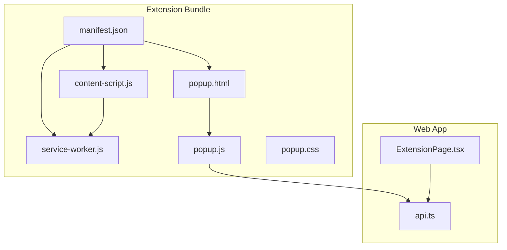
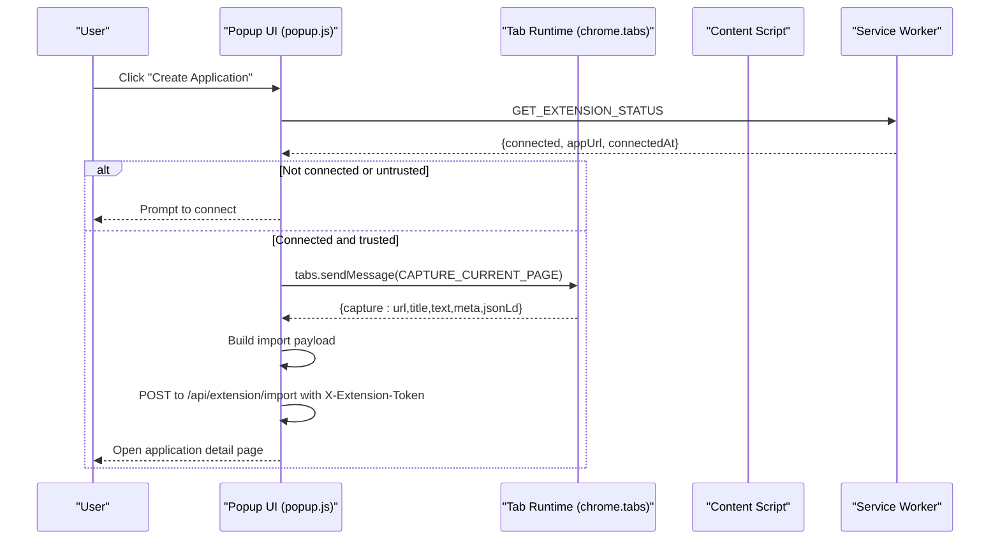
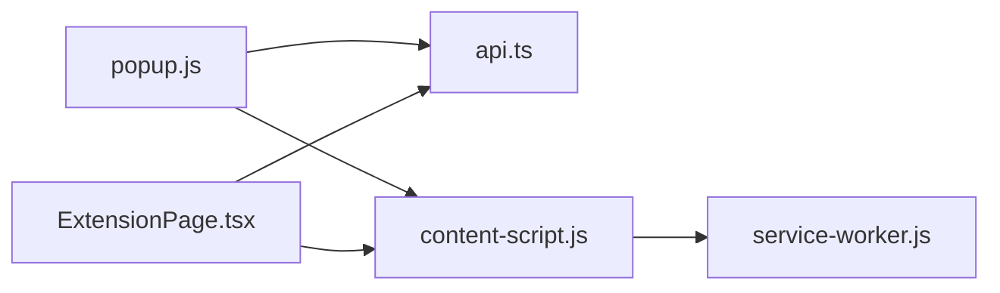

# Extension Architecture

<cite>
**Referenced Files in This Document**
- [manifest.json](file://frontend/public/chrome-extension/manifest.json)
- [content-script.js](file://frontend/public/chrome-extension/content-script.js)
- [service-worker.js](file://frontend/public/chrome-extension/service-worker.js)
- [popup.js](file://frontend/public/chrome-extension/popup.js)
- [popup.html](file://frontend/public/chrome-extension/popup.html)
- [popup.css](file://frontend/public/chrome-extension/popup.css)
- [ExtensionPage.tsx](file://frontend/src/routes/ExtensionPage.tsx)
- [api.ts](file://frontend/src/lib/api.ts)
- [extension-popup.test.ts](file://frontend/src/test/extension-popup.test.ts)
- [extension-bridge.test.ts](file://frontend/src/test/extension-bridge.test.ts)
- [chrome-extension-popup.d.ts](file://frontend/src/types/chrome-extension-popup.d.ts)
</cite>

## Table of Contents
1. [Introduction](#introduction)
2. [Project Structure](#project-structure)
3. [Core Components](#core-components)
4. [Architecture Overview](#architecture-overview)
5. [Detailed Component Analysis](#detailed-component-analysis)
6. [Dependency Analysis](#dependency-analysis)
7. [Performance Considerations](#performance-considerations)
8. [Security Model and Best Practices](#security-model-and-best-practices)
9. [Manifest Version Differences and Migration](#manifest-version-differences-and-migration)
10. [Troubleshooting Guide](#troubleshooting-guide)
11. [Conclusion](#conclusion)

## Introduction
This document describes the Chrome Extension architecture and its Manifest V3 (MV3) implementation. It covers manifest configuration, permissions, background service worker, content script, and popup UI. It explains the MV3 security model, including Content Security Policy (CSP) considerations, permission management, and secure cross-origin communication patterns. It documents the extension lifecycle (installation, activation, background processes), component relationships, and security practices such as origin validation, message passing security, and token management. It also outlines manifest version differences and migration considerations.

## Project Structure
The extension assets reside under frontend/public/chrome-extension and are bundled with the web application. The key files are:
- Manifest v3 definition
- Background service worker
- Content script injected into pages
- Popup UI (HTML/CSS/JS)
- Web app integration page and API helpers

**Diagram sources**
- [manifest.json:1-24](file://frontend/public/chrome-extension/manifest.json#L1-L24)
- [service-worker.js:1-37](file://frontend/public/chrome-extension/service-worker.js#L1-L37)
- [content-script.js:1-118](file://frontend/public/chrome-extension/content-script.js#L1-L118)
- [popup.html:1-22](file://frontend/public/chrome-extension/popup.html#L1-L22)
- [popup.js:1-156](file://frontend/public/chrome-extension/popup.js#L1-L156)
- [popup.css:1-61](file://frontend/public/chrome-extension/popup.css#L1-L61)
- [ExtensionPage.tsx:1-200](file://frontend/src/routes/ExtensionPage.tsx#L1-L200)
- [api.ts:312-326](file://frontend/src/lib/api.ts#L312-L326)

**Section sources**
- [manifest.json:1-24](file://frontend/public/chrome-extension/manifest.json#L1-L24)
- [popup.html:1-22](file://frontend/public/chrome-extension/popup.html#L1-L22)
- [popup.css:1-61](file://frontend/public/chrome-extension/popup.css#L1-L61)

## Core Components
- Manifest v3 defines permissions, host permissions, background service worker, action popup, and content script injection.
- Service worker handles extension-scoped token storage and status queries.
- Content script captures page metadata and securely bridges messages to/from the web app via postMessage with origin checks.
- Popup UI orchestrates user actions, validates trust boundaries, and performs import requests to the backend using the extension token.

Key responsibilities:
- Permissions and host permissions: minimal activeTab and storage plus broad host permissions for capturing.
- Background process: persistent service worker for message routing and token persistence.
- Content script: page capture and controlled messaging to the extension.
- Popup: user interface, trust validation, and import flow.

**Section sources**
- [manifest.json:6-22](file://frontend/public/chrome-extension/manifest.json#L6-L22)
- [service-worker.js:1-37](file://frontend/public/chrome-extension/service-worker.js#L1-L37)
- [content-script.js:60-117](file://frontend/public/chrome-extension/content-script.js#L60-L117)
- [popup.js:35-155](file://frontend/public/chrome-extension/popup.js#L35-L155)

## Architecture Overview
The extension follows MV3 with a service worker background script and a content script injected into all URLs. The popup UI runs in a separate HTML page and interacts with the service worker and content script through Chrome APIs and message passing.

**Diagram sources**
- [popup.js:35-155](file://frontend/public/chrome-extension/popup.js#L35-L155)
- [content-script.js:60-74](file://frontend/public/chrome-extension/content-script.js#L60-L74)
- [service-worker.js:14-25](file://frontend/public/chrome-extension/service-worker.js#L14-L25)

## Detailed Component Analysis

### Manifest v3 Configuration
- manifest_version: 3
- Permissions: activeTab, storage
- Host permissions: <all_urls>
- Background: service_worker with module type
- Action: default_popup pointing to popup.html
- Content scripts: matches all URLs, injects content-script.js at document_start

Security and lifecycle implications:
- Minimal permissions reduce attack surface.
- Module-type service worker aligns with modern ES modules.
- Content script injection enables page capture but must be guarded by origin checks.

**Section sources**
- [manifest.json:1-24](file://frontend/public/chrome-extension/manifest.json#L1-L24)

### Service Worker (Background)
Responsibilities:
- Store extension token and app URL in extension-scoped storage.
- Provide status queries to popup and content scripts.
- Clear tokens on demand.

Message handling:
- STORE_EXTENSION_TOKEN: persist token, appUrl, connectedAt.
- GET_EXTENSION_STATUS: return connection state.
- CLEAR_EXTENSION_TOKEN: remove token and connectedAt.

Storage model:
- Uses chrome.storage.local for extension-scoped persistence.

**Section sources**
- [service-worker.js:1-37](file://frontend/public/chrome-extension/service-worker.js#L1-L37)

### Content Script
Responsibilities:
- Capture current page metadata (URL, title, text, meta tags, JSON-LD).
- Listen for postMessage events from the web app with origin and payload validation.
- Relay messages to service worker for token storage and status retrieval.
- Respond to CAPTURE_CURRENT_PAGE with collected data.

Security validations:
- Validates event source and message source.
- Compares payload appUrl origin against stored origin or allows local dev origins.
- Ensures payload origin matches event.origin.

Cross-origin communication:
- Uses window.postMessage with explicit origin targeting.
- Bridges web app and extension via trusted origins.

**Section sources**
- [content-script.js:1-118](file://frontend/public/chrome-extension/content-script.js#L1-L118)

### Popup UI (HTML/CSS/JS)
Responsibilities:
- Present connection status and actions.
- Validate trust of stored appUrl (local dev origins only).
- Capture active tab and submit import request to backend with extension token.
- Open application detail page upon successful creation.

UI and UX:
- Clean, minimal UI with status text and two primary actions.
- Disabled/enabled states based on connection state.

**Section sources**
- [popup.html:1-22](file://frontend/public/chrome-extension/popup.html#L1-L22)
- [popup.css:1-61](file://frontend/public/chrome-extension/popup.css#L1-L61)
- [popup.js:35-155](file://frontend/public/chrome-extension/popup.js#L35-L155)

### Web App Integration (ExtensionPage and API)
- ExtensionPage.tsx listens for bridge messages from the extension and coordinates connection/revoke actions.
- Issues tokens via authenticated API calls and posts messages to the extension bridge.
- Uses X-Extension-Token header for import requests.

API helpers:
- fetchExtensionStatus, issueExtensionToken, revokeExtensionToken.

**Section sources**
- [ExtensionPage.tsx:1-200](file://frontend/src/routes/ExtensionPage.tsx#L1-L200)
- [api.ts:312-326](file://frontend/src/lib/api.ts#L312-L326)

### Type Definitions for Popup Helpers
TypeScript declarations for popup helper functions enable static typing and testing.

**Section sources**
- [chrome-extension-popup.d.ts:1-20](file://frontend/src/types/chrome-extension-popup.d.ts#L1-L20)

## Dependency Analysis
Component relationships:
- popup.js depends on chrome APIs (tabs, storage) and the backend API.
- content-script.js depends on chrome.runtime and chrome.storage for bridging.
- service-worker.js depends on chrome.runtime and chrome.storage for persistence.
- ExtensionPage.tsx depends on api.ts for extension token operations.

**Diagram sources**
- [popup.js:35-155](file://frontend/public/chrome-extension/popup.js#L35-L155)
- [content-script.js:60-117](file://frontend/public/chrome-extension/content-script.js#L60-L117)
- [service-worker.js:1-37](file://frontend/public/chrome-extension/service-worker.js#L1-L37)
- [ExtensionPage.tsx:1-200](file://frontend/src/routes/ExtensionPage.tsx#L1-L200)
- [api.ts:312-326](file://frontend/src/lib/api.ts#L312-L326)

**Section sources**
- [popup.js:35-155](file://frontend/public/chrome-extension/popup.js#L35-L155)
- [content-script.js:60-117](file://frontend/public/chrome-extension/content-script.js#L60-L117)
- [service-worker.js:1-37](file://frontend/public/chrome-extension/service-worker.js#L1-L37)
- [ExtensionPage.tsx:1-200](file://frontend/src/routes/ExtensionPage.tsx#L1-L200)
- [api.ts:312-326](file://frontend/src/lib/api.ts#L312-L326)

## Performance Considerations
- Content script capture limits: meta collection capped and JSON-LD limited to reduce overhead.
- Service worker message handling returns early for non-matching types to minimize work.
- Popup defers network calls until after connection validation to avoid unnecessary requests.
- Using module-type service worker improves load characteristics in MV3.

[No sources needed since this section provides general guidance]

## Security Model and Best Practices

### MV3 Security Model Implementation
- Permissions minimization: activeTab and storage only.
- Host permissions: broad allowance for page capture; restrict to necessary domains if feasible.
- CSP alignment: inline scripts and styles are disallowed; rely on externalized JS/CSS.
- Secure cross-origin communication: strict origin checks and message source validation.

### Origin Validation
- Content script enforces that CONNECT/STATUS messages originate from trusted web app origins.
- Local development origins are permitted during initial setup.
- Popup validates stored appUrl origin before enabling actions.

**Section sources**
- [content-script.js:40-58](file://frontend/public/chrome-extension/content-script.js#L40-L58)
- [popup.js:30-33](file://frontend/public/chrome-extension/popup.js#L30-L33)
- [extension-bridge.test.ts:34-56](file://frontend/src/test/extension-bridge.test.ts#L34-L56)
- [extension-popup.test.ts:25-29](file://frontend/src/test/extension-popup.test.ts#L25-L29)

### Message Passing Security
- PostMessage events are validated for source, type, and origin.
- Payload appUrl origin must match event.origin; stored origin must also match for verification.
- Service worker responds synchronously to status queries; content script relays messages to service worker.

**Section sources**
- [content-script.js:76-117](file://frontend/public/chrome-extension/content-script.js#L76-L117)
- [service-worker.js:14-25](file://frontend/public/chrome-extension/service-worker.js#L14-L25)

### Token Management
- Extension-scoped token stored in chrome.storage.local.
- Backend requires X-Extension-Token header for import requests.
- On 401 responses, popup clears stored token and prompts reconnection.
- Web app can revoke tokens; content script receives REVOKE_EXTENSION_TOKEN and clears local storage.

**Section sources**
- [service-worker.js:2-12](file://frontend/public/chrome-extension/service-worker.js#L2-L12)
- [popup.js:118-126](file://frontend/public/chrome-extension/popup.js#L118-L126)
- [ExtensionPage.tsx:102-125](file://frontend/src/routes/ExtensionPage.tsx#L102-L125)

### CSP Considerations
- Inline scripts/styles are not allowed; all scripts and styles are externalized.
- This aligns with MV3 CSP requirements and reduces XSS risks.

**Section sources**
- [popup.html:19](file://frontend/public/chrome-extension/popup.html#L19)
- [popup.css:1-61](file://frontend/public/chrome-extension/popup.css#L1-L61)

## Manifest Version Differences and Migration
- MV3 service worker type: module enables native ES modules and improved isolation.
- Content script injection: matches all URLs; consider scoping matches to reduce injection footprint.
- Permissions: keep activeTab and storage minimal; evaluate necessity of host_permissions.
- CSP: enforce externalized resources; avoid inline scripts/styles.
- Migration checklist:
  - Replace background pages with service workers.
  - Update message passing to use chrome.runtime.sendMessage.
  - Ensure CSP-compliant resource loading.
  - Validate content script injection timing and scope.

[No sources needed since this section provides general guidance]

## Troubleshooting Guide
Common issues and resolutions:
- Extension not connecting:
  - Verify web app is open locally and origin is trusted.
  - Ensure popup detects bridge and shows “Extension bridge detected.”
- Import fails with 401:
  - Popup clears stored token; reconnect from the web app.
- Cross-origin message blocked:
  - Confirm event.origin matches payload.appUrl origin and stored origin.
- No active tab capture:
  - Ensure a tab is active and popup has permission to access tab content.

Validation references:
- Popup helper tests confirm payload building and origin trust logic.
- Bridge tests confirm message filtering for untrusted origins and acceptance for local dev.

**Section sources**
- [extension-popup.test.ts:9-30](file://frontend/src/test/extension-popup.test.ts#L9-L30)
- [extension-bridge.test.ts:34-96](file://frontend/src/test/extension-bridge.test.ts#L34-L96)
- [popup.js:118-135](file://frontend/public/chrome-extension/popup.js#L118-L135)

## Conclusion
The extension implements a clean MV3 architecture with a service worker for persistence and message routing, a content script for page capture and secure bridging, and a popup UI for user interaction. Security is enforced through minimal permissions, strict origin validation, and CSP-compliant resource loading. The web app integrates tightly via a dedicated Extension page and typed API helpers. Following the outlined security and migration practices ensures robust operation under MV3 constraints.